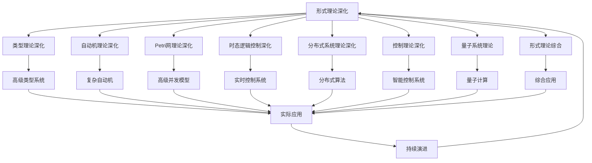

# 8-形式理论深化

## 📁 目录结构

```
8-形式理论深化/
├── 8.1-类型理论深化/
│   └── README.md
├── 8.2-自动机理论深化/
│   └── README.md
├── 8.3-Petri网理论深化/
│   └── README.md
├── 8.4-时态逻辑控制理论深化/
│   └── README.md
├── 8.5-分布式系统理论深化/
│   └── README.md
├── 8.6-控制理论深化/
│   └── README.md
├── 8.7-量子系统理论/
│   └── README.md
├── 8.8-形式理论综合/
│   └── README.md
└── README.md
```

## 🔗 主题交叉引用表

| 理论分支 | 关联理论 | 技术应用 | 实践场景 |
|---------|---------|---------|---------|
| **类型理论深化** | 范畴论、同伦类型论 | 高级类型系统、形式化验证 | 编译器设计、定理证明 |
| **自动机理论深化** | 计算复杂性、形式语言 | 高级状态机、协议验证 | 网络协议、并发系统 |
| **Petri网理论深化** | 并发理论、死锁分析 | 高级并发建模、性能分析 | 工作流系统、分布式协调 |
| **时态逻辑控制深化** | 实时系统、控制理论 | 实时控制、安全协议 | 自动驾驶、工业控制 |
| **分布式系统理论深化** | 一致性理论、容错理论 | 分布式算法、共识协议 | 区块链、云计算 |
| **控制理论深化** | 非线性控制、自适应控制 | 智能控制、鲁棒控制 | 机器人、智能系统 |
| **量子系统理论** | 量子力学、量子信息 | 量子计算、量子通信 | 量子计算机、量子密码 |
| **形式理论综合** | 多理论融合、跨领域应用 | 综合形式化方法 | 复杂系统建模、验证 |

## 🔄 全链路知识流图



## 🎯 知识体系特色

### 理论严谨性
- **数学基础**：基于严格的数学理论体系
- **形式化方法**：精确的形式化描述和证明
- **逻辑一致性**：确保理论间的逻辑相容性

### 技术创新性
- **前沿理论**：涵盖最新的理论发展
- **跨领域融合**：多理论领域的交叉应用
- **新兴技术**：量子计算等新兴技术理论

### 实践导向
- **工程应用**：理论在实际系统中的应用
- **问题解决**：针对复杂问题的理论支撑
- **验证方法**：形式化验证和证明技术

### 持续演进
- **理论发展**：跟随学术前沿持续更新
- **技术融合**：与新兴技术领域深度融合
- **应用拓展**：向更多应用场景扩展

## 📚 学习路径建议

### 🚀 入门路径
1. **基础理论回顾** → 巩固形式科学理论基础
2. **类型理论深化** → 深入高级类型系统
3. **自动机理论深化** → 掌握复杂计算模型
4. **分布式理论深化** → 理解大规模系统理论

### 🔄 进阶路径
1. **Petri网理论深化** → 深入并发系统建模
2. **时态逻辑控制深化** → 掌握实时系统理论
3. **控制理论深化** → 学习智能控制方法
4. **量子系统理论** → 探索量子计算前沿

### 🎯 专家路径
1. **形式理论综合** → 多理论融合应用
2. **前沿探索** → 参与理论创新和发展
3. **跨领域应用** → 理论在复杂系统中的应用
4. **理论验证** → 形式化验证和证明技术

## 🚀 快速导航

### 深化理论
- [类型理论深化](8.1-类型理论深化/README.md)
- [自动机理论深化](8.2-自动机理论深化/README.md)
- [Petri网理论深化](8.3-Petri网理论深化/README.md)
- [时态逻辑控制理论深化](8.4-时态逻辑控制理论深化/README.md)

### 高级理论
- [分布式系统理论深化](8.5-分布式系统理论深化/README.md)
- [控制理论深化](8.6-控制理论深化/README.md)
- [量子系统理论](8.7-量子系统理论/README.md)
- [形式理论综合](8.8-形式理论综合/README.md)

## 🛠️ 技术栈映射

### 形式化工具
- **定理证明器**：Coq、Agda、Isabelle、Lean
- **模型检查器**：SPIN、NuSMV、TLA+、UPPAAL
- **类型检查器**：Haskell、Rust、Idris、F*
- **形式化语言**：Z、B、Event-B、Alloy

### 高级算法
- **类型系统**：依赖类型、线性类型、高阶类型
- **自动机算法**：ω自动机、概率自动机、量子自动机
- **并发算法**：Petri网分析、死锁检测、性能分析
- **分布式算法**：共识算法、拜占庭容错、一致性协议

### 量子技术
- **量子编程**：Qiskit、Cirq、Quipper
- **量子算法**：Shor算法、Grover算法、量子机器学习
- **量子通信**：量子密钥分发、量子网络
- **量子模拟**：量子化学、量子材料

### 控制技术
- **非线性控制**：滑模控制、自适应控制
- **智能控制**：模糊控制、神经网络控制
- **鲁棒控制**：H∞控制、μ综合
- **实时控制**：实时调度、硬实时系统

## 🎯 应用场景体系

### 高级软件工程
- **形式化验证**：程序正确性证明
- **类型安全**：高级类型系统设计
- **并发验证**：并发程序的形式化验证
- **实时系统**：实时系统的形式化建模

### 复杂系统建模
- **分布式系统**：大规模分布式系统建模
- **网络协议**：网络协议的形式化验证
- **工作流系统**：复杂工作流的建模和分析
- **控制系统**：复杂控制系统的设计

### 前沿技术应用
- **量子计算**：量子算法和量子程序
- **人工智能**：AI系统的形式化验证
- **区块链**：分布式共识的形式化分析
- **物联网**：IoT系统的形式化建模

### 科学研究
- **数学证明**：数学定理的机器证明
- **物理建模**：物理系统的形式化建模
- **生物系统**：生物系统的形式化分析
- **经济模型**：经济系统的形式化建模

### 新兴领域
- **量子机器学习**：量子计算在机器学习中的应用
- **形式化安全**：安全协议的形式化验证
- **可信计算**：可信系统的形式化设计
- **智能合约**：区块链智能合约的形式化验证

---

**📖 相关导航**
- [返回总导航](../README.md)
- [2-形式科学理论](../2-形式科学理论/README.md)
- [9-软件工程深化](../9-软件工程深化/README.md)
- [Matter/Theory](../Matter/Theory/)
