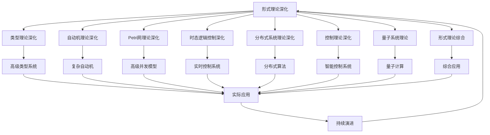

# 8-形式理论深化

## 1. 📁 目录结构

```text
8-形式理论深化/
├── 8.1-类型理论深化/
│   └── README.md
├── 8.2-自动机理论深化/
│   └── README.md
├── 8.3-Petri网理论深化/
│   └── README.md
├── 8.4-时态逻辑控制理论深化/
│   └── README.md
├── 8.5-分布式系统理论深化/
│   └── README.md
├── 8.6-控制理论深化/
│   └── README.md
├── 8.7-量子系统理论/
│   └── README.md
├── 8.8-形式理论综合/
│   └── README.md
└── README.md
```

## 2. 🔗 主题交叉引用表

| 理论分支 | 关联理论 | 技术应用 | 实践场景 |
|---------|---------|---------|---------|
| **类型理论深化** | 范畴论、同伦类型论 | 高级类型系统、形式化验证 | 编译器设计、定理证明 |
| **自动机理论深化** | 计算复杂性、形式语言 | 高级状态机、协议验证 | 网络协议、并发系统 |
| **Petri网理论深化** | 并发理论、死锁分析 | 高级并发建模、性能分析 | 工作流系统、分布式协调 |
| **时态逻辑控制深化** | 实时系统、控制理论 | 实时控制、安全协议 | 自动驾驶、工业控制 |
| **分布式系统理论深化** | 一致性理论、容错理论 | 分布式算法、共识协议 | 区块链、云计算 |
| **控制理论深化** | 非线性控制、自适应控制 | 智能控制、鲁棒控制 | 机器人、智能系统 |
| **量子系统理论** | 量子力学、量子信息 | 量子计算、量子通信 | 量子计算机、量子密码 |
| **形式理论综合** | 多理论融合、跨领域应用 | 综合形式化方法 | 复杂系统建模、验证 |

## 3. 🔄 全链路知识流图



## 4. 知识体系特色

### 4.1. 理论严谨性

- **数学基础**：基于严格的数学理论体系
- **形式化方法**：精确的形式化描述和证明
- **逻辑一致性**：确保理论间的逻辑相容性

### 4.2. 技术创新性

- **前沿理论**：涵盖最新的理论发展
- **跨领域融合**：多理论领域的交叉应用
- **新兴技术**：量子计算等新兴技术理论

### 4.3. 实践导向

- **工程应用**：理论在实际系统中的应用
- **问题解决**：针对复杂问题的理论支撑
- **验证方法**：形式化验证和证明技术

### 4.4. 持续演进

- **理论发展**：跟随学术前沿持续更新
- **技术融合**：与新兴技术领域深度融合
- **应用拓展**：向更多应用场景扩展

## 5. 学习路径建议

### 5.1. 入门路径

1. **基础理论回顾** → 巩固形式科学理论基础
2. **类型理论深化** → 深入高级类型系统
3. **自动机理论深化** → 掌握复杂计算模型
4. **分布式理论深化** → 理解大规模系统理论

### 5.2. 🔄 进阶路径

1. **Petri网理论深化** → 深入并发系统建模
2. **时态逻辑控制深化** → 掌握实时系统理论
3. **控制理论深化** → 学习智能控制方法
4. **量子系统理论** → 探索量子计算前沿

### 5.3. 专家路径

1. **形式理论综合** → 多理论融合应用
2. **前沿探索** → 参与理论创新和发展
3. **跨领域应用** → 理论在复杂系统中的应用
4. **理论验证** → 形式化验证和证明技术

## 6. 快速导航

### 6.1. 深化理论

- [类型理论深化](8.1-类型理论深化/README.md)
- [自动机理论深化](8.2-自动机理论深化/README.md)
- [Petri网理论深化](8.3-Petri网理论深化/README.md)
- [时态逻辑控制理论深化](8.4-时态逻辑控制理论深化/README.md)

### 6.2. 高级理论

- [分布式系统理论深化](8.5-分布式系统理论深化/README.md)
- [控制理论深化](8.6-控制理论深化/README.md)
- [量子系统理论](8.7-量子系统理论/README.md)
- [形式理论综合](8.8-形式理论综合/README.md)

## 7. 🛠️ 技术栈映射

### 7.1. 形式化工具

- **定理证明器**：Coq、Agda、Isabelle、Lean
- **模型检查器**：SPIN、NuSMV、TLA+、UPPAAL
- **类型检查器**：Haskell、Rust、Idris、F*
- **形式化语言**：Z、B、Event-B、Alloy

### 7.2. 高级算法

- **类型系统**：依赖类型、线性类型、高阶类型
- **自动机算法**：ω自动机、概率自动机、量子自动机
- **并发算法**：Petri网分析、死锁检测、性能分析
- **分布式算法**：共识算法、拜占庭容错、一致性协议

### 7.3. 量子技术

- **量子编程**：Qiskit、Cirq、Quipper
- **量子算法**：Shor算法、Grover算法、量子机器学习
- **量子通信**：量子密钥分发、量子网络
- **量子模拟**：量子化学、量子材料

### 7.4. 控制技术

- **非线性控制**：滑模控制、自适应控制
- **智能控制**：模糊控制、神经网络控制
- **鲁棒控制**：H∞控制、μ综合
- **实时控制**：实时调度、硬实时系统

## 8. 应用场景体系

### 8.1. 高级软件工程

- **形式化验证**：程序正确性证明
- **类型安全**：高级类型系统设计
- **并发验证**：并发程序的形式化验证
- **实时系统**：实时系统的形式化建模

### 8.2. 复杂系统建模

- **分布式系统**：大规模分布式系统建模
- **网络协议**：网络协议的形式化验证
- **工作流系统**：复杂工作流的建模和分析
- **控制系统**：复杂控制系统的设计

### 8.3. 前沿技术应用

- **量子计算**：量子算法和量子程序
- **人工智能**：AI系统的形式化验证
- **区块链**：分布式共识的形式化分析
- **物联网**：IoT系统的形式化建模

### 8.4. 科学研究

- **数学证明**：数学定理的机器证明
- **物理建模**：物理系统的形式化建模
- **生物系统**：生物系统的形式化分析
- **经济模型**：经济系统的形式化建模

### 8.5. 新兴领域

- **量子机器学习**：量子计算在机器学习中的应用
- **形式化安全**：安全协议的形式化验证
- **可信计算**：可信系统的形式化设计
- **智能合约**：区块链智能合约的形式化验证

## 9. 多表征

本分支支持多种表征方式，包括：

- 符号表征（类型、自动机、Petri网、时态逻辑、分布式结构等）
- 图结构（状态图、转换图、网络结构）
- 向量/张量（状态向量、特征嵌入）
- 自然语言（定义、注释、描述）
- 图像/可视化（结构图、流程图、时序图等）
这些表征可互映，提升理论表达力。

## 10. 形式化语义

- 语义域：$D$，如类型集合、状态空间、转换关系、模型空间
- 解释函数：$I: S \to D$，将符号/结构映射到具体语义对象
- 语义一致性：每个结构/公式在$D$中有明确定义

## 11. 形式化语法与证明

- 语法规则：如产生式、推理规则、约束条件
- **定理**：本分支的语法系统具一致性与可扩展性。
- **证明**：由产生式与推理规则递归定义，保证系统一致与可扩展。

---

## 12. 核心理论详解

### 12.1. 类型理论深化

**高级类型系统**：

- **依赖类型**：类型依赖于值
- **线性类型**：资源管理类型系统
- **同伦类型论**：类型作为空间
- **量子类型**：量子计算类型系统

**应用领域**：

- 编译器设计
- 形式化验证
- 定理证明
- 程序语言设计

### 12.2. 自动机理论深化

**高级自动机**：

- **ω自动机**：无限序列自动机
- **概率自动机**：随机性自动机
- **量子自动机**：量子计算自动机
- **层次自动机**：多层次自动机

**应用领域**：

- 协议验证
- 模型检查
- 并发系统
- 实时系统

### 12.3. Petri网理论深化

**高级Petri网**：

- **时间Petri网**：带时间约束
- **着色Petri网**：带数据标记
- **层次Petri网**：多层次结构
- **随机Petri网**：随机性建模

**应用领域**：

- 工作流建模
- 性能分析
- 死锁检测
- 并发系统

---

## 13. 分布式系统理论深化

### 13.1. 一致性理论

**一致性模型**：

- **强一致性**：线性一致性
- **弱一致性**：最终一致性
- **因果一致性**：因果顺序
- **顺序一致性**：顺序保证

**共识算法**：

- **Paxos**：经典共识算法
- **Raft**：可理解共识算法
- **PBFT**：拜占庭容错
- **PoW/PoS**：区块链共识

### 13.2. 容错理论

**故障模型**：

- **崩溃故障**：节点停止
- **拜占庭故障**：任意故障
- **网络分区**：网络分割
- **消息丢失**：通信故障

**容错机制**：

- **复制**：数据复制
- **检查点**：状态保存
- **恢复**：故障恢复
- **监控**：故障检测

---

## 14. 控制理论深化

### 14.1. 非线性控制

**控制方法**：

- **滑模控制**：鲁棒控制
- **自适应控制**：参数自适应
- **反馈线性化**：非线性系统线性化
- **反步法**：递归设计

### 14.2. 智能控制

**控制策略**：

- **模糊控制**：模糊逻辑控制
- **神经网络控制**：神经网络控制器
- **强化学习控制**：学习控制策略
- **进化控制**：进化算法优化

---

## 15. 量子系统理论

### 15.1. 量子计算基础

**量子比特**：

- **叠加态**：量子叠加
- **纠缠态**：量子纠缠
- **测量**：量子测量
- **门操作**：量子门

**量子算法**：

- **Shor算法**：因子分解
- **Grover算法**：搜索算法
- **量子机器学习**：量子ML
- **量子优化**：优化问题

### 15.2. 量子通信

**通信协议**：

- **量子密钥分发**：QKD协议
- **量子隐形传态**：量子态传输
- **量子网络**：量子网络架构
- **量子中继**：量子中继器

---

## 16. 形式理论综合

### 16.1. 多理论融合

**融合方法**：

- **类型系统与自动机**：类型化自动机
- **Petri网与时态逻辑**：时态Petri网
- **分布式与量子**：量子分布式系统
- **控制与形式化**：形式化控制

### 16.2. 跨领域应用

**应用场景**：

- **复杂系统建模**：多理论建模
- **形式化验证**：综合验证方法
- **系统设计**：综合设计方法
- **理论创新**：新理论探索

---

## 17. 工具与框架

### 17.1. 形式化工具

**定理证明器**：

- **Coq**：依赖类型证明器
- **Agda**：函数式证明器
- **Isabelle**：通用证明器
- **Lean**：现代证明器

**模型检查器**：

- **SPIN**：并发系统检查
- **NuSMV**：符号模型检查
- **TLA+**：时序逻辑检查
- **UPPAAL**：实时系统检查

### 17.2. 量子工具

**量子编程**：

- **Qiskit**：IBM量子框架
- **Cirq**：Google量子框架
- **Quipper**：函数式量子编程
- **Q#**：Microsoft量子语言

---

## 18. 最佳实践

### 18.1. 形式化建模

**建模原则**：

- 明确系统需求
- 选择合适的理论
- 形式化描述
- 验证模型正确性

### 18.2. 形式化验证

**验证方法**：

- 定理证明
- 模型检查
- 类型检查
- 静态分析

### 18.3. 系统设计

**设计原则**：

- 模块化设计
- 可验证性
- 可扩展性
- 性能优化

---

## 19. 挑战与解决方案

### 19.1. 理论复杂性

**挑战**：理论复杂、难以理解

**解决方案**：分层学习、工具辅助、实践应用

### 19.2. 验证成本

**挑战**：形式化验证成本高

**解决方案**：自动化工具、增量验证、选择性验证

### 19.3. 理论融合

**挑战**：多理论融合困难

**解决方案**：统一框架、标准化接口、渐进融合

---

## 20. 总结

形式理论深化是现代计算机科学和数学的重要分支，通过深入的形式化理论和方法，可以构建更可靠、更安全的系统。

**核心价值**：

1. **理论严谨性**：严格的数学基础
2. **系统可靠性**：形式化验证保证
3. **技术创新**：前沿理论探索
4. **实践应用**：工程实践指导

**未来展望**：

随着量子计算、AI、分布式系统等技术的发展，形式理论将继续演进，特别是在量子形式化、AI形式化、综合形式化等领域，形式理论将提供更强大的理论支撑。

---

---

## 深入学习建议

### 理论基础强化

**数学基础**：

- **逻辑学**：命题逻辑、谓词逻辑、模态逻辑
- **集合论**：集合、关系、函数
- **图论**：图的基本概念、图算法
- **代数**：群、环、域、范畴论

**形式化方法基础**：

- **类型理论**：简单类型、依赖类型、同伦类型
- **自动机理论**：有限自动机、图灵机
- **Petri网**：基础Petri网、高级变种
- **时态逻辑**：LTL、CTL、μ演算

### 实践能力提升

**编程能力**：

- **函数式编程**：Haskell、OCaml、F#
- **定理证明**：Coq、Agda、Isabelle
- **模型检查**：SPIN、NuSMV、TLA+
- **量子编程**：Qiskit、Cirq、Q#

**工具使用**：

- **形式化工具**：Coq、Isabelle、Alloy
- **验证工具**：SPIN、NuSMV、TLA+
- **量子工具**：Qiskit、Cirq、Q#
- **可视化工具**：Graphviz、D3.js

---

## 学习资源汇总

### 在线课程

- **Coursera**：形式化方法课程
- **edX**：逻辑与计算课程
- **Udemy**：形式化验证课程
- **YouTube**：形式化方法教程

### 书籍推荐

- **入门书籍**：《Formal Methods: An Introduction》
- **进阶书籍**：《Logic in Computer Science》
- **应用书籍**：《Software Abstractions》
- **工具书籍**：《Interactive Theorem Proving》

### 学术资源

- **期刊**：ACM TOPLAS、IEEE TSE、FM
- **会议**：FM、CAV、TACAS、POPL
- **数据库**：IEEE Xplore、ACM Digital Library
- **预印本**：arXiv、ResearchGate

---

## 实践项目建议

### 基础项目

- **形式化验证**：程序形式化验证
- **模型检查**：系统模型检查
- **定理证明**：数学定理证明
- **类型系统**：类型系统实现

### 进阶项目

- **综合验证**：多理论综合验证
- **工具开发**：形式化工具开发
- **应用验证**：实际系统验证
- **理论创新**：新理论探索

### 高级项目

- **量子验证**：量子程序验证
- **AI验证**：AI系统验证
- **区块链验证**：区块链协议验证
- **跨学科应用**：跨学科应用

---

## 职业发展路径

### 学术研究

- **研究方向**：形式化理论、方法创新、应用拓展
- **职业路径**：博士研究、博士后、教职、研究机构

### 工业应用

- **应用领域**：软件验证、系统设计、安全验证
- **职业路径**：验证工程师、系统架构师、安全专家

---

**📖 相关导航**:

- [返回总导航](../README.md)
- [2-形式科学理论](../2-形式科学理论/README.md)
- [9-软件工程深化](../9-软件工程深化/README.md)
- [Matter/Theory](../Matter/Theory/)
