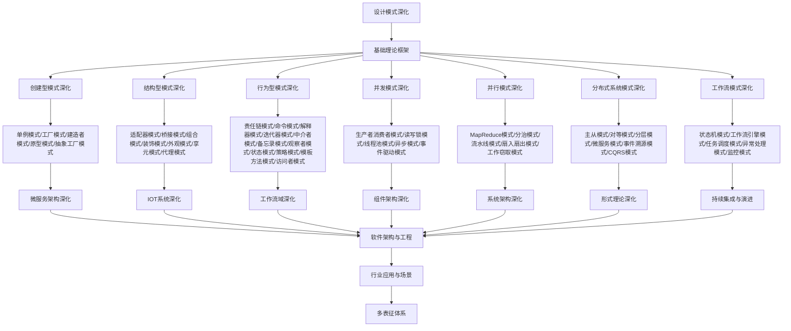

# 9.1-设计模式深化 分支导航

## 目录结构与本地跳转

- [9.1.1-创建型模式深化](9.1.1-创建型模式深化.md) - 预留分支
- [9.1.2-结构型模式深化](9.1.2-结构型模式深化.md) - 预留分支
- [9.1.3-行为型模式深化](9.1.3-行为型模式深化.md) - 预留分支
- [9.1.4-并发模式深化](9.1.4-并发模式深化.md) - 预留分支
- [9.1.5-并行模式深化](9.1.5-并行模式深化.md) - 预留分支
- [9.1.6-分布式系统模式深化](9.1.6-分布式系统模式深化.md) - 预留分支
- [9.1.7-工作流模式深化](9.1.7-工作流模式深化.md) - 预留分支

---

## 主题交叉引用

| 主题      | 基础理论 | 创建型模式 | 结构型模式 | 行为型模式 | 并发模式 | 并行模式 | 分布式系统模式 | 工作流模式 | 多表征 |
|-----------|----------|------------|------------|------------|----------|----------|----------------|------------|--------|
| 创建型模式深化| 预留     | 预留       | 预留       | 预留       | 预留     | 预留     | 预留           | 预留       | 预留   |
| 结构型模式深化| 预留     | 预留       | 预留       | 预留       | 预留     | 预留     | 预留           | 预留       | 预留   |
| 行为型模式深化| 预留     | 预留       | 预留       | 预留       | 预留     | 预留     | 预留           | 预留       | 预留   |
| 并发模式深化| 预留      | 预留       | 预留       | 预留       | 预留     | 预留     | 预留           | 预留       | 预留   |
| 并行模式深化| 预留      | 预留       | 预留       | 预留       | 预留     | 预留     | 预留           | 预留       | 预留   |
| 分布式系统模式深化| 预留 | 预留       | 预留       | 预留       | 预留     | 预留     | 预留           | 预留       | 预留   |
| 工作流模式深化| 预留     | 预留       | 预留       | 预留       | 预留     | 预留     | 预留           | 预留       | 预留   |

- 交叉引用：[4.2-设计模式](../4-软件架构与工程/4.2-设计模式/README.md)、[9.2-微服务架构深化](../9.2-微服务架构深化/README.md)、[9.4-工作流域深化](../9.4-工作流域深化/README.md)

---

## 全链路知识流（Mermaid流程图）



---

## 知识体系特色

- **模式分类**: 从经典GoF模式到现代并发、并行、分布式模式
- **应用场景**: 每种模式的具体应用场景和最佳实践
- **实现技术**: 使用Rust、Go、Haskell等语言的模式实现
- **性能分析**: 模式对系统性能的影响和优化策略
- **架构融合**: 模式在微服务、IOT、工作流等架构中的应用

---

## 核心概念详解

### 设计模式深化概述

设计模式深化是在经典GoF设计模式基础上，针对现代软件开发场景的深入研究和实践，包括：

- **模式扩展**：经典模式的变体和扩展
- **模式组合**：多个模式的组合使用
- **领域模式**：特定领域的模式应用
- **并发模式**：并发和并行编程模式
- **分布式模式**：分布式系统设计模式

### 创建型模式深化

**核心模式**：

- **单例模式**：线程安全单例、枚举单例、双重检查锁定
- **工厂模式**：简单工厂、工厂方法、抽象工厂
- **建造者模式**：链式调用、Fluent接口
- **原型模式**：深拷贝、浅拷贝、原型注册表

**应用场景**：

- 对象创建复杂
- 需要控制对象创建过程
- 需要创建大量相似对象
- 需要解耦对象创建和使用

### 结构型模式深化

**核心模式**：

- **适配器模式**：类适配器、对象适配器、双向适配器
- **装饰器模式**：动态装饰、静态装饰
- **代理模式**：静态代理、动态代理、虚拟代理、保护代理
- **外观模式**：简化接口、隐藏复杂性

**应用场景**：

- 接口不兼容
- 需要动态添加功能
- 需要控制对象访问
- 需要简化复杂子系统

### 行为型模式深化

**核心模式**：

- **观察者模式**：推模式、拉模式、事件驱动
- **策略模式**：策略选择、策略组合
- **命令模式**：撤销重做、宏命令、队列请求
- **状态模式**：状态转换、状态机

**应用场景**：

- 对象间依赖关系
- 算法选择
- 请求封装
- 状态管理

### 并发模式深化

**核心模式**：

- **生产者消费者**：有界缓冲区、无界缓冲区
- **读写锁**：读写分离、读写公平
- **线程池**：固定大小、动态调整、任务队列
- **异步模式**：Future、Promise、async/await

**应用场景**：

- 多线程编程
- 并发控制
- 资源管理
- 异步处理

### 并行模式深化

**核心模式**：

- **MapReduce**：数据并行、任务并行
- **分治模式**：递归分解、并行合并
- **流水线模式**：阶段并行、数据流
- **工作窃取**：任务窃取、负载均衡

**应用场景**：

- 大规模数据处理
- 并行计算
- 流水线处理
- 负载均衡

### 分布式系统模式深化

**核心模式**：

- **主从模式**：主节点、从节点、故障转移
- **对等模式**：P2P网络、去中心化
- **微服务模式**：服务拆分、服务治理
- **事件溯源**：事件存储、事件重放

**应用场景**：

- 分布式系统
- 高可用系统
- 微服务架构
- 事件驱动架构

### 工作流模式深化

**核心模式**：

- **状态机模式**：有限状态机、层次状态机
- **工作流引擎**：流程定义、流程执行
- **任务调度**：任务分配、任务执行
- **异常处理**：异常捕获、异常恢复

**应用场景**：

- 业务流程
- 工作流系统
- 任务调度
- 异常处理

---

## 理论基础

### 设计原则

**SOLID原则**：

- **单一职责原则**：一个类只有一个改变的理由
- **开闭原则**：对扩展开放，对修改关闭
- **里氏替换原则**：子类可以替换父类
- **接口隔离原则**：客户端不应该依赖它不需要的接口
- **依赖倒置原则**：高层模块不应该依赖低层模块

### 设计模式分类

**按目的分类**：

- **创建型**：对象创建
- **结构型**：对象组合
- **行为型**：对象交互

**按范围分类**：

- **类模式**：处理类和子类之间的关系
- **对象模式**：处理对象之间的关系

---

## 应用场景

### 大型系统设计

- 模块化设计
- 组件化架构
- 插件系统
- 框架设计

### 代码重构

- 代码优化
- 设计改进
- 技术债务
- 架构演进

### 性能优化

- 并发优化
- 内存优化
- 算法优化
- 资源管理

---

## 工具与框架

### 设计工具

- **UML工具**：Enterprise Architect、Visual Paradigm
- **代码生成**：设计模式代码生成器
- **重构工具**：IDE重构功能

### 模式库

- **Java**：Guava、Apache Commons
- **Python**：设计模式库
- **JavaScript**：Lodash、设计模式实现

---

## 最佳实践

### 模式选择

- 理解问题本质
- 评估模式效果
- 考虑系统复杂度
- 保持代码简洁

### 模式实现

- 遵循模式意图
- 保持代码可读性
- 考虑扩展性
- 文档化设计决策

### 模式重构

- 识别代码异味
- 选择合适模式
- 渐进式重构
- 测试驱动重构

---

## 多表征

本分支支持多种表征方式，包括：符号表征（模式定义、类图、序列图等）、图结构（UML图、关系图、依赖图等）、向量/张量（模式特征向量、相似度矩阵）、自然语言（定义、注释、描述）、图像/可视化（模式图、交互图等）。这些表征可互映，提升设计模式理论表达力。

---

## 形式化语义

- 语义域：$D$，如模式对象集、类空间、关系模型、接口集合
- 解释函数：$I: S \to D$，将符号/结构映射到具体语义对象
- 语义一致性：每个模式/类/接口在$D$中有明确定义

---

## 形式化语法与证明

- 语法规则：如模式定义、类图规则、关系规则、约束条件
- **定理**：本分支的语法系统具一致性与可扩展性。
- **证明**：由模式定义、类图规则与关系规则递归定义，保证系统一致与可扩展。

---

## 实际应用案例

### 大型系统设计案例

**案例1：电商平台架构**

- **模式应用**：工厂模式创建订单、观察者模式处理事件、策略模式处理支付
- **架构模式**：微服务架构、事件驱动架构
- **设计原则**：单一职责、开闭原则、依赖倒置

**案例2：金融系统架构**

- **模式应用**：单例模式管理配置、代理模式控制访问、命令模式处理交易
- **架构模式**：分层架构、领域驱动设计
- **设计原则**：高内聚低耦合、接口隔离

### 代码重构案例

**案例1：遗留系统重构**

- **问题**：代码耦合度高、难以维护
- **方案**：引入适配器模式、外观模式、策略模式
- **效果**：代码解耦、可维护性提升

**案例2：性能优化重构**

- **问题**：系统性能瓶颈
- **方案**：引入缓存模式、对象池模式、异步模式
- **效果**：性能提升、资源利用率提高

---

## 学习路径

### 入门阶段

1. **理解基础模式**：学习GoF 23种设计模式
2. **掌握设计原则**：理解SOLID原则
3. **实践应用**：在项目中应用设计模式

### 进阶阶段

1. **模式组合**：学习模式组合使用
2. **领域模式**：学习领域特定模式
3. **并发模式**：学习并发编程模式

### 专家阶段

1. **模式创新**：创造新的设计模式
2. **架构设计**：设计系统架构
3. **模式评估**：评估模式效果

---

## 工具与资源

### 设计工具

- **UML工具**：Enterprise Architect、Visual Paradigm
- **代码生成**：设计模式代码生成器
- **重构工具**：IDE重构功能

### 学习资源

- **经典书籍**：《设计模式：可复用面向对象软件的基础》
- **在线课程**：设计模式课程、架构设计课程
- **开源项目**：设计模式实现、架构设计案例

---

## 总结

设计模式深化是软件工程深化的重要组成部分，通过深入理解设计模式、掌握设计原则、积累实践经验，可以设计出高质量、可维护、可扩展的软件系统。

**核心价值**：

1. **代码质量**：提高代码质量和可维护性
2. **设计能力**：提升系统设计能力
3. **问题解决**：提供可复用的解决方案
4. **最佳实践**：总结行业最佳实践

**未来展望**：

随着软件开发技术的发展，设计模式将继续演进，特别是在并发模式、分布式模式、云原生模式等领域，设计模式将提供更强大的功能和更好的体验。

---

---

## 模式实现示例

### 创建型模式实现

**单例模式（线程安全）**：

```rust
use std::sync::{Mutex, Once};

pub struct Singleton {
    data: String,
}

static mut INSTANCE: Option<Mutex<Singleton>> = None;
static INIT: Once = Once::new();

impl Singleton {
    pub fn get_instance() -> &'static Mutex<Singleton> {
        unsafe {
            INIT.call_once(|| {
                INSTANCE = Some(Mutex::new(Singleton {
                    data: String::from("Singleton Instance"),
                }));
            });
            INSTANCE.as_ref().unwrap()
        }
    }
}
```

**工厂模式**：

```python
from abc import ABC, abstractmethod

class Product(ABC):
    @abstractmethod
    def operation(self):
        pass

class ConcreteProductA(Product):
    def operation(self):
        return "Product A"

class ConcreteProductB(Product):
    def operation(self):
        return "Product B"

class Factory:
    @staticmethod
    def create_product(product_type):
        if product_type == "A":
            return ConcreteProductA()
        elif product_type == "B":
            return ConcreteProductB()
        else:
            raise ValueError("Unknown product type")
```

### 结构型模式实现

**适配器模式**：

```python
class Target:
    def request(self):
        return "Target request"

class Adaptee:
    def specific_request(self):
        return "Adaptee specific request"

class Adapter(Target):
    def __init__(self, adaptee):
        self.adaptee = adaptee

    def request(self):
        return self.adaptee.specific_request()
```

**装饰器模式**：

```python
class Component:
    def operation(self):
        return "Component"

class Decorator(Component):
    def __init__(self, component):
        self.component = component

    def operation(self):
        return f"Decorator({self.component.operation()})"
```

### 行为型模式实现

**观察者模式**：

```python
class Subject:
    def __init__(self):
        self._observers = []

    def attach(self, observer):
        self._observers.append(observer)

    def notify(self, event):
        for observer in self._observers:
            observer.update(event)

class Observer:
    def update(self, event):
        print(f"Observer received: {event}")
```

**策略模式**：

```python
class Strategy:
    def execute(self, data):
        raise NotImplementedError

class StrategyA(Strategy):
    def execute(self, data):
        return f"Strategy A: {data}"

class StrategyB(Strategy):
    def execute(self, data):
        return f"Strategy B: {data}"

class Context:
    def __init__(self, strategy):
        self.strategy = strategy

    def execute_strategy(self, data):
        return self.strategy.execute(data)
```

---

## 模式评估

### 模式选择标准

**选择因素**：

- **问题匹配度**：模式是否匹配问题
- **复杂度**：模式实现的复杂度
- **性能影响**：模式对性能的影响
- **可维护性**：模式对可维护性的影响

### 模式效果评估

**评估指标**：

- **代码质量**：代码可读性、可维护性
- **性能**：执行效率、资源使用
- **扩展性**：系统扩展能力
- **复用性**：代码复用程度

---

[返回软件工程深化总导航](../README.md)
