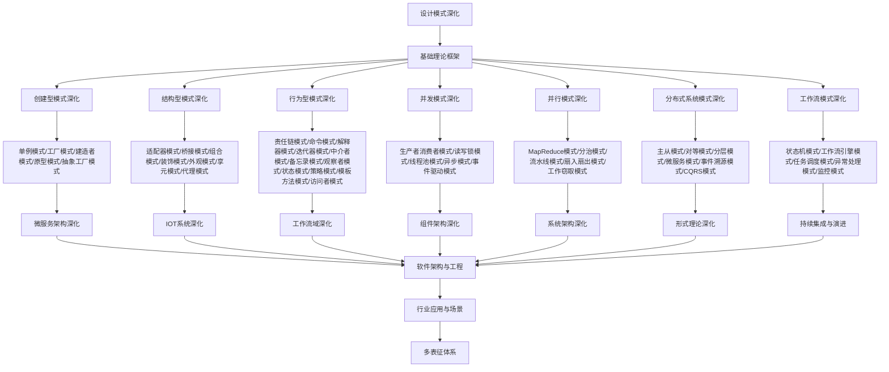

# 9.1-设计模式深化 分支导航

## 目录结构与本地跳转
- [9.1.1-创建型模式深化](9.1.1-创建型模式深化.md) - 预留分支
- [9.1.2-结构型模式深化](9.1.2-结构型模式深化.md) - 预留分支
- [9.1.3-行为型模式深化](9.1.3-行为型模式深化.md) - 预留分支
- [9.1.4-并发模式深化](9.1.4-并发模式深化.md) - 预留分支
- [9.1.5-并行模式深化](9.1.5-并行模式深化.md) - 预留分支
- [9.1.6-分布式系统模式深化](9.1.6-分布式系统模式深化.md) - 预留分支
- [9.1.7-工作流模式深化](9.1.7-工作流模式深化.md) - 预留分支

---

## 主题交叉引用
| 主题      | 基础理论 | 创建型模式 | 结构型模式 | 行为型模式 | 并发模式 | 并行模式 | 分布式系统模式 | 工作流模式 | 多表征 |
|-----------|----------|------------|------------|------------|----------|----------|----------------|------------|--------|
| 创建型模式深化| 预留     | 预留       | 预留       | 预留       | 预留     | 预留     | 预留           | 预留       | 预留   |
| 结构型模式深化| 预留     | 预留       | 预留       | 预留       | 预留     | 预留     | 预留           | 预留       | 预留   |
| 行为型模式深化| 预留     | 预留       | 预留       | 预留       | 预留     | 预留     | 预留           | 预留       | 预留   |
| 并发模式深化| 预留      | 预留       | 预留       | 预留       | 预留     | 预留     | 预留           | 预留       | 预留   |
| 并行模式深化| 预留      | 预留       | 预留       | 预留       | 预留     | 预留     | 预留           | 预留       | 预留   |
| 分布式系统模式深化| 预留 | 预留       | 预留       | 预留       | 预留     | 预留     | 预留           | 预留       | 预留   |
| 工作流模式深化| 预留     | 预留       | 预留       | 预留       | 预留     | 预留     | 预留           | 预留       | 预留   |

- 交叉引用：[4.2-设计模式](../4-软件架构与工程/4.2-设计模式/README.md)、[9.2-微服务架构深化](../9.2-微服务架构深化/README.md)、[9.4-工作流域深化](../9.4-工作流域深化/README.md)

---

## 全链路知识流（Mermaid流程图）

---

## 知识体系特色
- **模式分类**: 从经典GoF模式到现代并发、并行、分布式模式
- **应用场景**: 每种模式的具体应用场景和最佳实践
- **实现技术**: 使用Rust、Go、Haskell等语言的模式实现
- **性能分析**: 模式对系统性能的影响和优化策略
- **架构融合**: 模式在微服务、IOT、工作流等架构中的应用

---

[返回软件工程深化总导航](../README.md) 