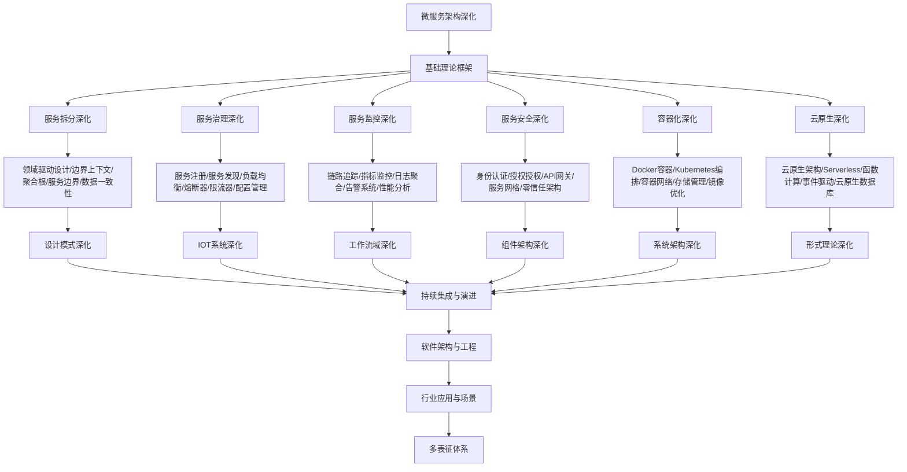

# 9.2-微服务架构深化 分支导航

## 目录结构与本地跳转

- [9.2.1-服务拆分深化](9.2.1-服务拆分深化.md) - 预留分支
- [9.2.2-服务治理深化](9.2.2-服务治理深化.md) - 预留分支
- [9.2.3-服务监控深化](9.2.3-服务监控深化.md) - 预留分支
- [9.2.4-服务安全深化](9.2.4-服务安全深化.md) - 预留分支
- [9.2.5-容器化深化](9.2.5-容器化深化.md) - 预留分支
- [9.2.6-云原生深化](9.2.6-云原生深化.md) - 预留分支

---

## 主题交叉引用

| 主题      | 基础理论 | 服务拆分 | 服务治理 | 服务监控 | 服务安全 | 容器化 | 云原生 | 多表征 |
|-----------|----------|----------|----------|----------|----------|--------|--------|--------|
| 服务拆分深化| 预留     | 预留     | 预留     | 预留     | 预留     | 预留   | 预留   | 预留   |
| 服务治理深化| 预留     | 预留     | 预留     | 预留     | 预留     | 预留   | 预留   | 预留   |
| 服务监控深化| 预留     | 预留     | 预留     | 预留     | 预留     | 预留   | 预留   | 预留   |
| 服务安全深化| 预留     | 预留     | 预留     | 预留     | 预留     | 预留   | 预留   | 预留   |
| 容器化深化| 预留      | 预留     | 预留     | 预留     | 预留     | 预留   | 预留   | 预留   |
| 云原生深化| 预留      | 预留     | 预留     | 预留     | 预留     | 预留   | 预留   | 预留   |

- 交叉引用：[4.3-微服务架构](../4-软件架构与工程/4.3-微服务架构/README.md)、[9.1-设计模式深化](../9.1-设计模式深化/README.md)、[7-持续集成与演进](../7-持续集成与演进/README.md)

---

## 全链路知识流（Mermaid流程图）

---

## 知识体系特色

- **服务拆分**: 基于DDD的微服务拆分策略和最佳实践
- **服务治理**: 完整的服务治理体系和工具链
- **可观测性**: 分布式系统的监控、追踪和告警
- **安全架构**: 微服务环境下的安全防护体系
- **云原生**: 容器化和云原生技术的深度应用

---

## 核心概念详解

### 微服务架构深化概述

微服务架构深化是在基础微服务架构之上，针对大规模分布式系统的深入研究和实践，包括：

- **服务拆分**：基于DDD的服务拆分策略
- **服务治理**：完整的服务治理体系
- **服务监控**：分布式系统的可观测性
- **服务安全**：微服务环境下的安全架构
- **容器化**：容器化和编排技术
- **云原生**：云原生架构和Serverless

### 服务拆分深化

**拆分策略**：

- **领域驱动设计**：限界上下文、聚合根、领域服务
- **业务边界**：业务能力、数据边界、团队边界
- **服务粒度**：服务大小、职责单一、高内聚低耦合
- **数据管理**：数据库per服务、数据一致性

**拆分原则**：

- 单一职责
- 业务边界清晰
- 数据独立
- 团队独立

### 服务治理深化

**治理内容**：

- **服务注册发现**：服务注册、服务发现、健康检查
- **负载均衡**：轮询、加权轮询、一致性哈希
- **熔断器**：熔断策略、降级策略、恢复策略
- **限流器**：令牌桶、漏桶、滑动窗口
- **配置管理**：配置中心、动态配置、配置版本

**治理工具**：

- **服务注册**：Consul、Eureka、Nacos
- **API网关**：Kong、Zuul、Nginx
- **服务网格**：Istio、Linkerd、Consul Connect

### 服务监控深化

**监控内容**：

- **链路追踪**：分布式追踪、调用链分析
- **指标监控**：性能指标、业务指标、系统指标
- **日志聚合**：集中式日志、日志分析、日志搜索
- **告警系统**：告警规则、告警聚合、告警升级

**监控工具**：

- **追踪**：Zipkin、Jaeger、SkyWalking
- **监控**：Prometheus、Grafana、Datadog
- **日志**：ELK Stack、Loki、Graylog

### 服务安全深化

**安全内容**：

- **身份认证**：OAuth2、JWT、mTLS
- **授权控制**：RBAC、ABAC、策略引擎
- **API网关**：API安全、限流、认证
- **服务网格**：零信任架构、服务间安全

**安全工具**：

- **认证**：Keycloak、Auth0、OAuth2
- **网关**：Kong、Zuul、API Gateway
- **网格**：Istio、Linkerd

### 容器化深化

**容器技术**：

- **Docker**：容器化、镜像管理、容器编排
- **Kubernetes**：容器编排、自动扩缩容、服务发现
- **容器网络**：CNI、Service Mesh、网络策略
- **存储管理**：PV、PVC、StorageClass

**容器优化**：

- **镜像优化**：多阶段构建、镜像压缩
- **资源优化**：资源限制、资源配额
- **安全优化**：镜像扫描、安全策略

### 云原生深化

**云原生技术**：

- **Serverless**：函数计算、事件驱动、按需计费
- **事件驱动**：事件流、事件处理、事件存储
- **云原生数据库**：云数据库、数据库服务
- **多云管理**：多云部署、多云管理

**云原生架构**：

- **12-Factor App**：云原生应用原则
- **微服务**：服务拆分、服务治理
- **DevOps**：CI/CD、自动化运维

---

## 理论基础

### 分布式系统理论

- **CAP定理**：一致性、可用性、分区容错性
- **BASE理论**：基本可用、软状态、最终一致性
- **一致性模型**：强一致性、弱一致性、最终一致性

### 服务治理理论

- **服务发现**：服务注册、服务发现、健康检查
- **负载均衡**：负载均衡算法、负载均衡策略
- **容错机制**：重试、熔断、降级、限流

---

## 应用场景

### 大规模系统

- 高并发系统
- 高可用系统
- 分布式系统
- 云原生应用

### 企业级应用

- 微服务架构
- 服务治理
- 容器化部署
- 云原生转型

---

## 工具与框架

### 服务框架

- **Spring Cloud**：微服务框架
- **Dubbo**：RPC框架
- **gRPC**：高性能RPC
- **Istio**：服务网格

### 容器平台

- **Kubernetes**：容器编排
- **Docker**：容器化
- **OpenShift**：企业级K8s

---

## 最佳实践

### 服务拆分

- 基于业务边界
- 单一职责
- 数据独立
- 团队独立

### 服务治理

- 服务注册发现
- 负载均衡
- 熔断限流
- 监控追踪

### 容器化

- 镜像优化
- 资源管理
- 安全策略
- 自动化部署

---

## 多表征

本分支支持多种表征方式，包括：符号表征（服务定义、接口、协议等）、图结构（服务架构图、依赖图、调用链图等）、向量/张量（服务特征向量、性能指标）、自然语言（定义、注释、描述）、图像/可视化（架构图、流程图、监控图等）。这些表征可互映，提升微服务架构理论表达力。

---

## 形式化语义

- 语义域：$D$，如服务对象集、接口空间、协议模型、消息集合
- 解释函数：$I: S \to D$，将符号/结构映射到具体语义对象
- 语义一致性：每个服务/接口/协议在$D$中有明确定义

---

## 形式化语法与证明

- 语法规则：如服务定义、接口规则、协议规则、约束条件
- **定理**：本分支的语法系统具一致性与可扩展性。
- **证明**：由服务定义、接口规则与协议规则递归定义，保证系统一致与可扩展。

---

## 实际应用案例

### 大型互联网公司案例

**案例1：Netflix微服务架构**

- **架构特点**：大规模微服务、服务网格、混沌工程
- **技术栈**：Spring Cloud、Eureka、Hystrix、Zuul
- **最佳实践**：服务拆分、服务治理、监控追踪

**案例2：阿里巴巴微服务架构**

- **架构特点**：服务化改造、分布式事务、服务治理
- **技术栈**：Dubbo、Nacos、Seata、Sentinel
- **最佳实践**：领域驱动设计、服务拆分、数据管理

### 企业级应用案例

**案例1：金融系统微服务化**

- **挑战**：高可用、强一致性、安全性
- **方案**：微服务架构、分布式事务、服务治理
- **效果**：系统解耦、可扩展性提升

**案例2：电商平台微服务化**

- **挑战**：高并发、高可用、快速迭代
- **方案**：微服务架构、服务网格、容器化部署
- **效果**：开发效率提升、系统性能提升

---

## 学习路径

### 入门阶段

1. **理解微服务概念**：学习微服务基本概念
2. **掌握服务拆分**：学习服务拆分策略
3. **实践服务治理**：学习服务治理技术

### 进阶阶段

1. **服务网格**：学习服务网格技术
2. **分布式事务**：学习分布式事务处理
3. **可观测性**：学习监控追踪技术

### 专家阶段

1. **大规模架构**：设计大规模微服务架构
2. **架构演进**：指导系统架构演进
3. **技术选型**：为项目选择合适技术栈

---

## 工具与资源

### 开发框架

- **Spring Cloud**：微服务框架
- **Dubbo**：RPC框架
- **gRPC**：高性能RPC
- **Istio**：服务网格

### 学习资源

- **经典书籍**：《微服务架构设计模式》
- **在线课程**：微服务课程、云原生课程
- **开源项目**：微服务框架、服务治理工具

---

## 总结

微服务架构深化是软件工程深化的重要组成部分，通过深入理解微服务架构、掌握服务治理技术、积累实践经验，可以构建高质量、可扩展、可维护的分布式系统。

**核心价值**：

1. **系统解耦**：提高系统解耦和可维护性
2. **可扩展性**：支持系统水平扩展
3. **技术多样性**：支持技术栈多样性
4. **快速交付**：支持快速迭代和交付

**未来展望**：

随着云原生、服务网格等技术的发展，微服务架构将继续演进，特别是在服务网格、Serverless、边缘计算等领域，微服务架构将提供更强大的功能和更好的体验。

---

---

## 服务拆分实践

### 拆分策略

**领域驱动设计拆分**：

- **限界上下文**：识别业务边界
- **聚合根**：确定聚合边界
- **领域服务**：识别领域服务
- **值对象**：识别值对象

**拆分步骤**：

1. **业务分析**：分析业务领域
2. **边界识别**：识别限界上下文
3. **服务设计**：设计服务接口
4. **数据设计**：设计数据模型

### 拆分原则

**拆分原则**：

- **业务边界**：按业务边界拆分
- **数据边界**：按数据边界拆分
- **团队边界**：按团队边界拆分
- **技术边界**：按技术边界拆分

---

## 服务治理实践

### 服务注册发现

**注册中心选择**：

- **Consul**：服务发现、健康检查、KV存储
- **Eureka**：服务注册、服务发现、负载均衡
- **Nacos**：服务注册、配置管理、动态DNS

**服务发现流程**：

1. **服务注册**：服务启动时注册
2. **健康检查**：定期健康检查
3. **服务发现**：客户端发现服务
4. **负载均衡**：选择服务实例

### 配置管理

**配置中心**：

- **Apollo**：配置管理、配置推送、配置审计
- **Nacos**：配置管理、服务发现、动态配置
- **Config Server**：Spring Cloud配置中心

**配置管理策略**：

- **环境隔离**：开发、测试、生产环境
- **版本管理**：配置版本管理
- **动态更新**：配置动态更新
- **配置加密**：敏感配置加密

---

## 监控追踪实践

### 分布式追踪

**追踪工具**：

- **Zipkin**：分布式追踪系统
- **Jaeger**：分布式追踪平台
- **SkyWalking**：APM和分布式追踪

**追踪实现**：

- **Trace ID**：请求追踪ID
- **Span**：操作追踪
- **Baggage**：上下文传递
- **采样策略**：追踪采样

### 指标监控

**监控指标**：

- **业务指标**：订单量、用户数、交易额
- **技术指标**：QPS、响应时间、错误率
- **系统指标**：CPU、内存、磁盘、网络

**监控工具**：

- **Prometheus**：指标收集和存储
- **Grafana**：指标可视化
- **Datadog**：APM和监控

---

## 深入学习建议

### 理论基础强化

**微服务基础**：

- **微服务架构**：微服务架构原理
- **服务拆分**：服务拆分策略
- **服务治理**：服务治理机制
- **分布式系统**：分布式系统原理

**技术基础**：

- **容器技术**：Docker、容器化
- **编排工具**：Kubernetes、服务编排
- **服务网格**：Istio、服务网格
- **API网关**：API网关设计

### 实践能力提升

**开发能力**：

- **微服务开发**：微服务应用开发
- **服务通信**：服务间通信
- **服务发现**：服务注册与发现
- **配置管理**：配置中心

**运维能力**：

- **容器编排**：Kubernetes运维
- **服务监控**：服务监控和告警
- **日志管理**：日志收集和分析
- **故障处理**：故障诊断和处理

---

## 学习资源汇总

### 在线课程

- **Coursera**：微服务架构课程
- **edX**：云原生课程
- **Udemy**：Kubernetes、微服务课程
- **YouTube**：微服务教程

### 书籍推荐

- **入门书籍**：《微服务架构设计模式》
- **进阶书籍**：《Building Microservices》
- **应用书籍**：《Kubernetes in Action》
- **工具书籍**：《Istio服务网格实战》

### 学术资源

- **期刊**：IEEE Software、ACM Queue
- **会议**：ICSE、微服务相关会议
- **数据库**：IEEE Xplore、ACM Digital Library
- **预印本**：arXiv、ResearchGate

---

## 实践项目建议

### 基础项目

- **微服务拆分**：单体应用拆分
- **服务开发**：微服务应用开发
- **服务部署**：容器化部署
- **基础监控**：基础监控设置

### 进阶项目

- **服务治理**：服务治理实现
- **服务网格**：服务网格部署
- **分布式追踪**：分布式追踪系统
- **自动化运维**：自动化运维流程

### 高级项目

- **企业级微服务**：企业级微服务平台
- **云原生架构**：云原生微服务架构
- **服务治理平台**：服务治理平台开发
- **微服务工具**：微服务工具开发

---

## 职业发展路径

### 学术研究

- **研究方向**：微服务架构、分布式系统、云原生
- **职业路径**：博士研究、博士后、教职、研究机构

### 工业应用

- **应用领域**：微服务架构、云原生、分布式系统
- **职业路径**：微服务架构师、云原生工程师、技术专家

---

[返回软件工程深化总导航](../README.md)
