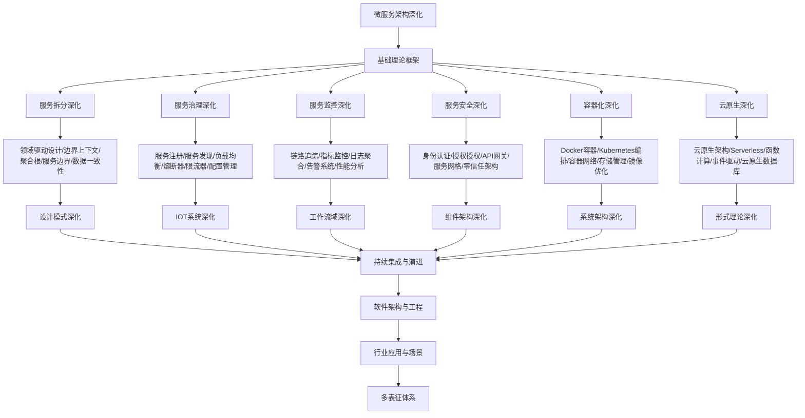

# 9.2-微服务架构深化 分支导航

## 目录结构与本地跳转

- [9.2.1-服务拆分深化](9.2.1-服务拆分深化.md) - 预留分支
- [9.2.2-服务治理深化](9.2.2-服务治理深化.md) - 预留分支
- [9.2.3-服务监控深化](9.2.3-服务监控深化.md) - 预留分支
- [9.2.4-服务安全深化](9.2.4-服务安全深化.md) - 预留分支
- [9.2.5-容器化深化](9.2.5-容器化深化.md) - 预留分支
- [9.2.6-云原生深化](9.2.6-云原生深化.md) - 预留分支

---

## 主题交叉引用

| 主题      | 基础理论 | 服务拆分 | 服务治理 | 服务监控 | 服务安全 | 容器化 | 云原生 | 多表征 |
|-----------|----------|----------|----------|----------|----------|--------|--------|--------|
| 服务拆分深化| 预留     | 预留     | 预留     | 预留     | 预留     | 预留   | 预留   | 预留   |
| 服务治理深化| 预留     | 预留     | 预留     | 预留     | 预留     | 预留   | 预留   | 预留   |
| 服务监控深化| 预留     | 预留     | 预留     | 预留     | 预留     | 预留   | 预留   | 预留   |
| 服务安全深化| 预留     | 预留     | 预留     | 预留     | 预留     | 预留   | 预留   | 预留   |
| 容器化深化| 预留      | 预留     | 预留     | 预留     | 预留     | 预留   | 预留   | 预留   |
| 云原生深化| 预留      | 预留     | 预留     | 预留     | 预留     | 预留   | 预留   | 预留   |

- 交叉引用：[4.3-微服务架构](../4-软件架构与工程/4.3-微服务架构/README.md)、[9.1-设计模式深化](../9.1-设计模式深化/README.md)、[7-持续集成与演进](../7-持续集成与演进/README.md)

---

## 全链路知识流（Mermaid流程图）

---

## 知识体系特色

- **服务拆分**: 基于DDD的微服务拆分策略和最佳实践
- **服务治理**: 完整的服务治理体系和工具链
- **可观测性**: 分布式系统的监控、追踪和告警
- **安全架构**: 微服务环境下的安全防护体系
- **云原生**: 容器化和云原生技术的深度应用

---

[返回软件工程深化总导航](../README.md)
