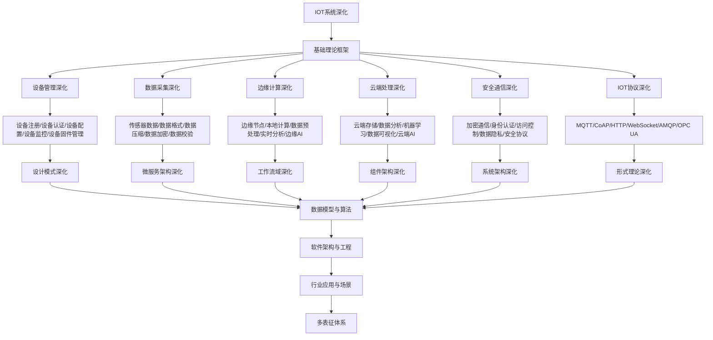

# 9.3-IOT系统深化 分支导航

## 目录结构与本地跳转

- [9.3.1-设备管理深化](9.3.1-设备管理深化.md) - 预留分支
- [9.3.2-数据采集深化](9.3.2-数据采集深化.md) - 预留分支
- [9.3.3-边缘计算深化](9.3.3-边缘计算深化.md) - 预留分支
- [9.3.4-云端处理深化](9.3.4-云端处理深化.md) - 预留分支
- [9.3.5-安全通信深化](9.3.5-安全通信深化.md) - 预留分支
- [9.3.6-IOT协议深化](9.3.6-IOT协议深化.md) - 预留分支

---

## 主题交叉引用

| 主题      | 基础理论 | 设备管理 | 数据采集 | 边缘计算 | 云端处理 | 安全通信 | IOT协议 | 多表征 |
|-----------|----------|----------|----------|----------|----------|----------|---------|--------|
| 设备管理深化| 预留     | 预留     | 预留     | 预留     | 预留     | 预留     | 预留    | 预留   |
| 数据采集深化| 预留     | 预留     | 预留     | 预留     | 预留     | 预留     | 预留    | 预留   |
| 边缘计算深化| 预留     | 预留     | 预留     | 预留     | 预留     | 预留     | 预留    | 预留   |
| 云端处理深化| 预留     | 预留     | 预留     | 预留     | 预留     | 预留     | 预留    | 预留   |
| 安全通信深化| 预留     | 预留     | 预留     | 预留     | 预留     | 预留     | 预留    | 预留   |
| IOT协议深化| 预留      | 预留     | 预留     | 预留     | 预留     | 预留     | 预留    | 预留   |

- 交叉引用：[4.4-IOT](../4-软件架构与工程/4.4-IOT/README.md)、[9.2-微服务架构深化](../9.2-微服务架构深化/README.md)、[3-数据模型与算法](../3-数据模型与算法/README.md)

---

## 全链路知识流（Mermaid流程图）

---

## 知识体系特色

- **设备管理**: IOT设备的全生命周期管理
- **数据采集**: 多源异构数据的采集和处理
- **边缘计算**: 边缘节点的计算能力和AI能力
- **云端处理**: 云端的数据分析和机器学习
- **安全通信**: IOT环境下的安全通信协议
- **协议标准**: 各种IOT通信协议和标准

---

[返回软件工程深化总导航](../README.md)
