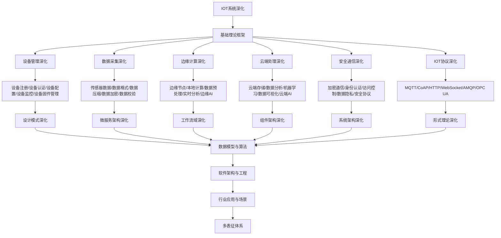

# 9.3-IOT系统深化 分支导航

## 目录结构与本地跳转

- [9.3.1-设备管理深化](9.3.1-设备管理深化.md) - 预留分支
- [9.3.2-数据采集深化](9.3.2-数据采集深化.md) - 预留分支
- [9.3.3-边缘计算深化](9.3.3-边缘计算深化.md) - 预留分支
- [9.3.4-云端处理深化](9.3.4-云端处理深化.md) - 预留分支
- [9.3.5-安全通信深化](9.3.5-安全通信深化.md) - 预留分支
- [9.3.6-IOT协议深化](9.3.6-IOT协议深化.md) - 预留分支

---

## 主题交叉引用

| 主题      | 基础理论 | 设备管理 | 数据采集 | 边缘计算 | 云端处理 | 安全通信 | IOT协议 | 多表征 |
|-----------|----------|----------|----------|----------|----------|----------|---------|--------|
| 设备管理深化| 预留     | 预留     | 预留     | 预留     | 预留     | 预留     | 预留    | 预留   |
| 数据采集深化| 预留     | 预留     | 预留     | 预留     | 预留     | 预留     | 预留    | 预留   |
| 边缘计算深化| 预留     | 预留     | 预留     | 预留     | 预留     | 预留     | 预留    | 预留   |
| 云端处理深化| 预留     | 预留     | 预留     | 预留     | 预留     | 预留     | 预留    | 预留   |
| 安全通信深化| 预留     | 预留     | 预留     | 预留     | 预留     | 预留     | 预留    | 预留   |
| IOT协议深化| 预留      | 预留     | 预留     | 预留     | 预留     | 预留     | 预留    | 预留   |

- 交叉引用：[4.4-IOT](../4-软件架构与工程/4.4-IOT/README.md)、[9.2-微服务架构深化](../9.2-微服务架构深化/README.md)、[3-数据模型与算法](../3-数据模型与算法/README.md)

---

## 全链路知识流（Mermaid流程图）



---

## 知识体系特色

- **设备管理**: IOT设备的全生命周期管理
- **数据采集**: 多源异构数据的采集和处理
- **边缘计算**: 边缘节点的计算能力和AI能力
- **云端处理**: 云端的数据分析和机器学习
- **安全通信**: IOT环境下的安全通信协议
- **协议标准**: 各种IOT通信协议和标准

---

## 核心概念详解

### IOT系统深化概述

IOT系统深化是在基础IoT系统之上，针对大规模物联网应用的深入研究和实践，包括：

- **设备管理**：设备全生命周期管理
- **数据采集**：多源异构数据采集
- **边缘计算**：边缘节点计算能力
- **云端处理**：云端数据分析和AI
- **安全通信**：IOT安全通信协议
- **协议标准**：IOT通信协议和标准

### 设备管理深化

**管理内容**：

- **设备注册**：设备注册、设备认证、设备配置
- **设备监控**：设备状态、设备健康、设备告警
- **设备控制**：远程控制、批量操作、固件升级
- **设备分组**：设备分组、设备标签、设备搜索

**管理平台**：

- **AWS IoT**：设备管理、消息路由、规则引擎
- **Azure IoT Hub**：设备管理、设备孪生、批量操作
- **阿里云IoT**：设备接入、设备管理、数据流转

### 数据采集深化

**采集内容**：

- **传感器数据**：温度、湿度、压力、位置
- **数据格式**：JSON、XML、二进制、自定义
- **数据压缩**：数据压缩、数据加密、数据校验
- **数据质量**：数据清洗、数据验证、数据补全

**采集技术**：

- **MQTT**：轻量级消息传输
- **CoAP**：受限应用协议
- **HTTP/HTTPS**：标准Web协议
- **WebSocket**：实时双向通信

### 边缘计算深化

**边缘能力**：

- **本地计算**：边缘节点计算、实时处理
- **数据预处理**：数据过滤、数据聚合、数据转换
- **边缘AI**：模型推理、实时决策、离线能力
- **边缘存储**：本地存储、缓存、数据同步

**边缘平台**：

- **AWS Greengrass**：边缘计算运行时
- **Azure IoT Edge**：容器化边缘计算
- **KubeEdge**：Kubernetes边缘计算

### 云端处理深化

**处理内容**：

- **数据存储**：时序数据库、数据湖、数据仓库
- **数据分析**：实时分析、批处理分析、流处理
- **机器学习**：模型训练、模型部署、模型推理
- **数据可视化**：仪表盘、报表、告警

**处理平台**：

- **AWS IoT Analytics**：IoT数据分析
- **Azure Stream Analytics**：流数据处理
- **Google Cloud IoT**：IoT数据处理

### 安全通信深化

**安全内容**：

- **加密通信**：TLS/SSL、DTLS、端到端加密
- **身份认证**：设备证书、OAuth2、JWT
- **访问控制**：RBAC、策略引擎、权限管理
- **数据隐私**：数据脱敏、数据加密、隐私保护

**安全协议**：

- **TLS/SSL**：传输层安全
- **DTLS**：数据报传输层安全
- **mTLS**：双向TLS认证

### IOT协议深化

**核心协议**：

- **MQTT**：轻量级消息传输、发布订阅
- **CoAP**：受限应用协议、RESTful风格
- **HTTP/HTTPS**：标准Web协议、广泛支持
- **AMQP**：高级消息队列协议、可靠传输
- **OPC UA**：工业自动化协议、统一架构

**协议选择**：

- **低功耗**：CoAP、MQTT-SN
- **高可靠性**：AMQP、MQTT QoS
- **实时性**：WebSocket、MQTT
- **工业应用**：OPC UA、Modbus

---

## 理论基础

### 物联网架构

- **感知层**：传感器、执行器、设备
- **网络层**：通信协议、网络传输
- **平台层**：设备管理、数据处理
- **应用层**：业务应用、用户界面

### 边缘计算理论

- **计算卸载**：任务分配、资源优化
- **数据本地性**：数据本地处理、减少传输
- **离线能力**：边缘节点离线运行

---

## 应用场景

### 智能家居

- 设备控制
- 场景联动
- 语音交互
- 能耗管理

### 工业物联网

- 设备监控
- 预测维护
- 质量控制
- 生产优化

### 智慧城市

- 交通管理
- 环境监测
- 公共安全
- 城市管理

---

## 工具与框架

### 设备管理

- **AWS IoT Core**：设备连接管理
- **Azure IoT Hub**：设备管理
- **阿里云IoT平台**：设备接入

### 边缘计算

- **AWS Greengrass**：边缘计算
- **Azure IoT Edge**：边缘计算
- **KubeEdge**：Kubernetes边缘

---

## 最佳实践

### 设备管理

- 统一设备模型
- 标准化接口
- 自动化管理
- 安全认证

### 数据处理

- 边缘预处理
- 数据清洗
- 实时分析
- 历史存储

### 安全实践

- 设备认证
- 数据加密
- 访问控制
- 安全更新

---

## 多表征

本分支支持多种表征方式，包括：符号表征（设备定义、协议、数据格式等）、图结构（设备拓扑图、数据流图、网络图等）、向量/张量（设备特征向量、数据向量）、自然语言（定义、注释、描述）、图像/可视化（设备图、数据图、网络图等）。这些表征可互映，提升IOT系统理论表达力。

---

## 形式化语义

- 语义域：$D$，如设备对象集、数据空间、协议模型、消息集合
- 解释函数：$I: S \to D$，将符号/结构映射到具体语义对象
- 语义一致性：每个设备/数据/协议在$D$中有明确定义

---

## 形式化语法与证明

- 语法规则：如设备定义、协议规则、数据规则、约束条件
- **定理**：本分支的语法系统具一致性与可扩展性。
- **证明**：由设备定义、协议规则与数据规则递归定义，保证系统一致与可扩展。

---

## 实际应用案例

### 智能家居案例

**案例1：智能家居系统**

- **架构特点**：设备管理、场景联动、语音交互
- **技术栈**：MQTT、边缘网关、云平台
- **最佳实践**：设备管理、数据采集、边缘计算

**案例2：智能照明系统**

- **架构特点**：设备控制、能耗管理、场景联动
- **技术栈**：Zigbee、MQTT、云平台
- **最佳实践**：设备管理、数据采集、云端分析

### 工业物联网案例

**案例1：工业设备监控**

- **挑战**：设备管理、实时监控、预测维护
- **方案**：IoT平台、边缘计算、数据分析
- **效果**：设备管理效率提升、维护成本降低

**案例2：生产线监控**

- **挑战**：数据采集、实时分析、质量控制
- **方案**：传感器网络、边缘计算、云端分析
- **效果**：生产效率提升、质量改善

---

## 学习路径

### 入门阶段

1. **理解IoT概念**：学习IoT基本概念
2. **掌握设备管理**：学习设备管理技术
3. **实践数据采集**：学习数据采集技术

### 进阶阶段

1. **边缘计算**：学习边缘计算技术
2. **云端处理**：学习云端数据处理
3. **安全通信**：学习IoT安全技术

### 专家阶段

1. **大规模系统**：设计大规模IoT系统
2. **架构设计**：设计IoT系统架构
3. **技术选型**：为项目选择合适技术栈

---

## 工具与资源

### 开发平台

- **AWS IoT**：IoT平台
- **Azure IoT Hub**：IoT平台
- **阿里云IoT**：IoT平台

### 学习资源

- **经典书籍**：《物联网系统设计》
- **在线课程**：IoT课程、边缘计算课程
- **开源项目**：IoT框架、边缘计算平台

---

## 总结

IOT系统深化是软件工程深化的重要组成部分，通过深入理解IoT系统、掌握设备管理技术、积累实践经验，可以构建高质量、可扩展、安全的物联网系统。

**核心价值**：

1. **设备管理**：提高设备管理效率
2. **数据处理**：支持大规模数据处理
3. **边缘计算**：支持边缘计算能力
4. **安全通信**：保证通信安全

**未来展望**：

随着5G、边缘计算、AI等技术的发展，IoT系统将继续演进，特别是在边缘AI、实时处理、安全通信等领域，IoT系统将提供更强大的功能和更好的体验。

---

---

## 设备管理实践

### 设备注册流程

**注册步骤**：

1. **设备认证**：设备身份认证
2. **设备注册**：设备信息注册
3. **设备配置**：设备参数配置
4. **设备激活**：设备激活上线

**设备模型**：

```json
{
  "deviceId": "device-001",
  "deviceName": "温度传感器",
  "deviceType": "sensor",
  "protocol": "MQTT",
  "status": "online",
  "location": {
    "building": "A",
    "floor": "1",
    "room": "101"
  },
  "capabilities": ["temperature", "humidity"],
  "metadata": {
    "manufacturer": "Company A",
    "model": "TS-100",
    "firmware": "1.0.0"
  }
}
```

### 设备监控

**监控内容**：

- **设备状态**：在线、离线、故障
- **设备健康**：健康检查、心跳检测
- **设备性能**：响应时间、数据质量
- **设备告警**：异常告警、故障告警

**监控实现**：

- **心跳机制**：定期心跳检测
- **健康检查**：设备健康检查
- **状态同步**：设备状态同步
- **告警规则**：告警规则配置

---

## 数据采集实践

### 数据采集流程

**采集步骤**：

1. **数据接收**：接收设备数据
2. **数据验证**：验证数据格式和完整性
3. **数据清洗**：清洗异常数据
4. **数据存储**：存储到数据库

**数据格式**：

```json
{
  "deviceId": "device-001",
  "timestamp": "2024-01-16T10:00:00Z",
  "data": {
    "temperature": 25.5,
    "humidity": 60.0
  },
  "quality": "good"
}
```

### 数据处理

**处理流程**：

- **数据过滤**：过滤无效数据
- **数据转换**：数据格式转换
- **数据聚合**：数据聚合计算
- **数据存储**：存储到时序数据库

---

## 边缘计算实践

### 边缘节点部署

**部署架构**：

- **边缘网关**：设备接入网关
- **边缘计算**：本地计算节点
- **边缘存储**：本地数据存储
- **边缘AI**：边缘AI推理

**部署工具**：

- **Docker**：容器化部署
- **Kubernetes**：容器编排
- **KubeEdge**：Kubernetes边缘计算

### 边缘AI

**AI模型部署**：

- **模型优化**：模型压缩、量化
- **模型部署**：模型部署到边缘
- **模型推理**：边缘实时推理
- **模型更新**：模型OTA更新

---

[返回软件工程深化总导航](../README.md)
