# 9.4-工作流域深化 分支导航

## 目录结构与本地跳转

- [9.4.1-流程建模深化](9.4.1-流程建模深化.md) - 预留分支
- [9.4.2-任务调度深化](9.4.2-任务调度深化.md) - 预留分支
- [9.4.3-状态管理深化](9.4.3-状态管理深化.md) - 预留分支
- [9.4.4-异常处理深化](9.4.4-异常处理深化.md) - 预留分支
- [9.4.5-监控告警深化](9.4.5-监控告警深化.md) - 预留分支
- [9.4.6-工作流引擎深化](9.4.6-工作流引擎深化.md) - 预留分支

---

## 主题交叉引用

| 主题      | 基础理论 | 流程建模 | 任务调度 | 状态管理 | 异常处理 | 监控告警 | 工作流引擎 | 多表征 |
|-----------|----------|----------|----------|----------|----------|----------|------------|--------|
| 流程建模深化| 预留     | 预留     | 预留     | 预留     | 预留     | 预留     | 预留       | 预留   |
| 任务调度深化| 预留     | 预留     | 预留     | 预留     | 预留     | 预留     | 预留       | 预留   |
| 状态管理深化| 预留     | 预留     | 预留     | 预留     | 预留     | 预留     | 预留       | 预留   |
| 异常处理深化| 预留     | 预留     | 预留     | 预留     | 预留     | 预留     | 预留       | 预留   |
| 监控告警深化| 预留     | 预留     | 预留     | 预留     | 预留     | 预留     | 预留       | 预留   |
| 工作流引擎深化| 预留     | 预留     | 预留     | 预留     | 预留     | 预留     | 预留       | 预留   |

- 交叉引用：[4.5-WorkflowDomain](../4-软件架构与工程/4.5-WorkflowDomain/README.md)、[9.1-设计模式深化](../9.1-设计模式深化/README.md)、[8.3-Petri网理论深化](../8-形式理论深化/8.3-Petri网理论深化/README.md)

---

## 全链路知识流（Mermaid流程图）

```mermaid
flowchart TD
  A[工作流域深化] --> B[基础理论框架]
  B --> C1[流程建模深化]
  B --> C2[任务调度深化]
  B --> C3[状态管理深化]
  B --> C4[异常处理深化]
  B --> C5[监控告警深化]
  B --> C6[工作流引擎深化]
  
  C1 --> D[BPMN/流程图/决策树/状态机/Petri网/事件驱动]
  C2 --> E[任务分配/优先级调度/资源管理/负载均衡/动态调度]
  C3 --> F[状态转换/状态持久化/状态同步/状态恢复/状态监控]
  C4 --> G[异常检测/异常恢复/重试机制/降级策略/容错处理]
  C5 --> H[性能监控/业务监控/告警规则/通知机制/日志分析]
  C6 --> I[工作流引擎/规则引擎/决策引擎/事件引擎/编排引擎]
  
  D --> J[设计模式深化]
  E --> K[微服务架构深化]
  F --> L[IOT系统深化]
  G --> M[组件架构深化]
  H --> N[系统架构深化]
  I --> O[Petri网理论深化]
  
  J & K & L & M & N & O --> P[形式理论深化]
  P --> Q[软件架构与工程]
  Q --> R[行业应用与场景]
  R --> S[多表征体系]
```

---

## 知识体系特色

- **流程建模**: 多种流程建模语言和工具
- **任务调度**: 智能任务调度和资源管理
- **状态管理**: 复杂状态机的设计和实现
- **异常处理**: 工作流异常的处理和恢复
- **监控告警**: 工作流系统的监控和告警
- **引擎设计**: 工作流引擎的架构和实现

---

[返回软件工程深化总导航](../README.md)
