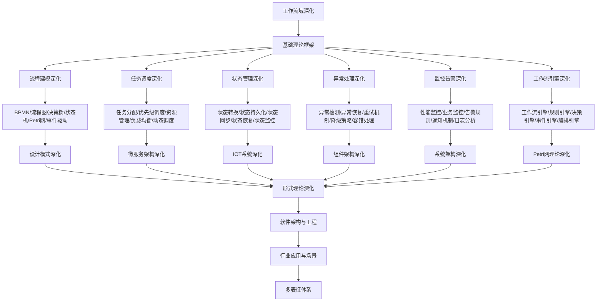

# 9.4-工作流域深化 分支导航

## 目录结构与本地跳转

- [9.4.1-流程建模深化](9.4.1-流程建模深化.md) - 预留分支
- [9.4.2-任务调度深化](9.4.2-任务调度深化.md) - 预留分支
- [9.4.3-状态管理深化](9.4.3-状态管理深化.md) - 预留分支
- [9.4.4-异常处理深化](9.4.4-异常处理深化.md) - 预留分支
- [9.4.5-监控告警深化](9.4.5-监控告警深化.md) - 预留分支
- [9.4.6-工作流引擎深化](9.4.6-工作流引擎深化.md) - 预留分支

---

## 主题交叉引用

| 主题      | 基础理论 | 流程建模 | 任务调度 | 状态管理 | 异常处理 | 监控告警 | 工作流引擎 | 多表征 |
|-----------|----------|----------|----------|----------|----------|----------|------------|--------|
| 流程建模深化| 预留     | 预留     | 预留     | 预留     | 预留     | 预留     | 预留       | 预留   |
| 任务调度深化| 预留     | 预留     | 预留     | 预留     | 预留     | 预留     | 预留       | 预留   |
| 状态管理深化| 预留     | 预留     | 预留     | 预留     | 预留     | 预留     | 预留       | 预留   |
| 异常处理深化| 预留     | 预留     | 预留     | 预留     | 预留     | 预留     | 预留       | 预留   |
| 监控告警深化| 预留     | 预留     | 预留     | 预留     | 预留     | 预留     | 预留       | 预留   |
| 工作流引擎深化| 预留     | 预留     | 预留     | 预留     | 预留     | 预留     | 预留       | 预留   |

- 交叉引用：[4.5-WorkflowDomain](../4-软件架构与工程/4.5-WorkflowDomain/README.md)、[9.1-设计模式深化](../9.1-设计模式深化/README.md)、[8.3-Petri网理论深化](../8-形式理论深化/8.3-Petri网理论深化/README.md)

---

## 全链路知识流（Mermaid流程图）



---

## 知识体系特色

- **流程建模**: 多种流程建模语言和工具
- **任务调度**: 智能任务调度和资源管理
- **状态管理**: 复杂状态机的设计和实现
- **异常处理**: 工作流异常的处理和恢复
- **监控告警**: 工作流系统的监控和告警
- **引擎设计**: 工作流引擎的架构和实现

---

## 核心概念详解

### 工作流域深化概述

工作流域深化是在基础工作流理论之上，针对复杂业务流程的深入研究和实践，包括：

- **流程建模**：多种流程建模语言和工具
- **任务调度**：智能任务调度和资源管理
- **状态管理**：复杂状态机的设计和实现
- **异常处理**：工作流异常的处理和恢复
- **监控告警**：工作流系统的监控和告警
- **引擎设计**：工作流引擎的架构和实现

### 流程建模深化

**建模语言**：

- **BPMN**：业务流程建模与标记、标准流程建模
- **流程图**：流程图、决策树、活动图
- **状态机**：有限状态机、层次状态机、状态图
- **Petri网**：Petri网建模、工作流网

**建模工具**：

- **Camunda Modeler**：BPMN建模工具
- **Activiti Designer**：流程设计器
- **Draw.io**：流程图工具
- **PlantUML**：UML工具

### 任务调度深化

**调度策略**：

- **任务分配**：任务分配算法、负载均衡
- **优先级调度**：优先级队列、动态优先级
- **资源管理**：资源分配、资源限制、资源优化
- **动态调度**：动态任务调度、自适应调度

**调度算法**：

- **FIFO**：先进先出
- **优先级**：优先级调度
- **轮询**：轮询调度
- **最短作业优先**：SJF调度

### 状态管理深化

**状态管理**：

- **状态转换**：状态转换规则、状态转换图
- **状态持久化**：状态存储、状态恢复
- **状态同步**：分布式状态同步、状态一致性
- **状态监控**：状态监控、状态告警

**状态机类型**：

- **有限状态机**：FSM、状态转换
- **层次状态机**：HFSM、状态层次
- **并发状态机**：并发状态、状态组合

### 异常处理深化

**异常处理**：

- **异常检测**：异常检测、异常分类
- **异常恢复**：异常恢复策略、补偿事务
- **重试机制**：重试策略、指数退避
- **降级策略**：服务降级、功能降级

**容错机制**：

- **故障隔离**：故障隔离、故障恢复
- **超时控制**：超时设置、超时处理
- **熔断器**：熔断策略、降级策略

### 监控告警深化

**监控内容**：

- **性能监控**：执行时间、吞吐量、资源使用
- **业务监控**：业务指标、业务告警
- **告警规则**：告警规则、告警聚合
- **通知机制**：通知渠道、通知策略

**监控工具**：

- **Prometheus**：指标收集
- **Grafana**：可视化
- **ELK Stack**：日志分析

### 工作流引擎深化

**引擎架构**：

- **流程引擎**：流程定义、流程执行
- **规则引擎**：规则定义、规则执行
- **决策引擎**：决策表、决策树
- **事件引擎**：事件处理、事件驱动

**引擎实现**：

- **Activiti**：Java工作流引擎
- **Camunda**：BPMN工作流引擎
- **Temporal**：分布式工作流引擎
- **Airflow**：Python工作流引擎

---

## 理论基础

### 工作流理论

- **Petri网理论**：工作流网、可达性分析
- **状态机理论**：有限状态机、状态转换
- **流程理论**：流程定义、流程执行

### 任务调度理论

- **调度算法**：调度策略、调度优化
- **资源管理**：资源分配、资源优化
- **负载均衡**：负载均衡算法

---

## 应用场景

### 企业流程

- 业务流程自动化
- 审批流程
- 工作流管理
- 流程优化

### 数据处理

- ETL流程
- 数据管道
- 批处理流程
- 流处理流程

---

## 工具与框架

### 工作流引擎

- **Activiti**：Java工作流引擎
- **Camunda**：BPMN工作流引擎
- **Temporal**：分布式工作流引擎
- **Airflow**：Python工作流引擎

### 任务调度

- **Quartz**：Java任务调度
- **Celery**：Python任务队列
- **XXL-Job**：分布式任务调度

---

## 最佳实践

### 流程设计

- 流程简化
- 异常处理
- 监控告警
- 性能优化

### 任务调度

- 任务粒度
- 资源管理
- 负载均衡
- 容错机制

---

## 多表征

本分支支持多种表征方式，包括：符号表征（流程定义、任务、状态等）、图结构（流程图、状态图、依赖图等）、向量/张量（流程特征向量、性能指标）、自然语言（定义、注释、描述）、图像/可视化（流程图、状态图、监控图等）。这些表征可互映，提升工作流理论表达力。

---

## 形式化语义

- 语义域：$D$，如流程对象集、任务空间、状态模型、事件集合
- 解释函数：$I: S \to D$，将符号/结构映射到具体语义对象
- 语义一致性：每个流程/任务/状态在$D$中有明确定义

---

## 形式化语法与证明

- 语法规则：如流程定义、任务规则、状态规则、约束条件
- **定理**：本分支的语法系统具一致性与可扩展性。
- **证明**：由流程定义、任务规则与状态规则递归定义，保证系统一致与可扩展。

---

## 实际应用案例

### 企业流程案例

**案例1：审批流程系统**

- **架构特点**：流程建模、任务调度、状态管理
- **技术栈**：Camunda、Activiti、工作流引擎
- **最佳实践**：流程设计、异常处理、监控告警

**案例2：订单处理流程**

- **架构特点**：订单流程、支付流程、物流流程
- **技术栈**：工作流引擎、消息队列、状态机
- **最佳实践**：流程编排、异常处理、补偿事务

### 数据处理案例

**案例1：ETL数据管道**

- **挑战**：数据提取、转换、加载
- **方案**：工作流引擎、任务调度、数据处理
- **效果**：数据处理效率提升、可维护性提升

**案例2：实时数据处理**

- **挑战**：实时数据流、流处理、批处理
- **方案**：流处理引擎、工作流编排、任务调度
- **效果**：实时处理能力提升、系统性能提升

---

## 学习路径

### 入门阶段

1. **理解工作流概念**：学习工作流基本概念
2. **掌握流程建模**：学习流程建模技术
3. **实践任务调度**：学习任务调度技术

### 进阶阶段

1. **状态管理**：学习状态管理技术
2. **异常处理**：学习异常处理技术
3. **监控告警**：学习监控告警技术

### 专家阶段

1. **引擎设计**：设计工作流引擎
2. **架构设计**：设计工作流系统架构
3. **技术选型**：为项目选择合适技术栈

---

## 工具与资源

### 工作流引擎

- **Activiti**：Java工作流引擎
- **Camunda**：BPMN工作流引擎
- **Temporal**：分布式工作流引擎
- **Airflow**：Python工作流引擎

### 学习资源

- **经典书籍**：《工作流管理：模型、方法和系统》
- **在线课程**：工作流课程、BPMN课程
- **开源项目**：工作流引擎、流程设计工具

---

## 总结

工作流域深化是软件工程深化的重要组成部分，通过深入理解工作流理论、掌握流程建模技术、积累实践经验，可以构建高质量、可维护、可扩展的工作流系统。

**核心价值**：

1. **流程自动化**：提高流程自动化程度
2. **任务调度**：支持智能任务调度
3. **异常处理**：支持完善的异常处理
4. **监控告警**：支持全面的监控告警

**未来展望**：

随着AI、边缘计算等技术的发展，工作流系统将继续演进，特别是在智能调度、边缘工作流、无服务器工作流等领域，工作流系统将提供更强大的功能和更好的体验。

---

---

## 流程建模实践

### BPMN建模

**BPMN元素**：

- **事件**：开始事件、结束事件、中间事件
- **活动**：任务、子流程、调用活动
- **网关**：排他网关、并行网关、包容网关
- **流向**：序列流、消息流、关联

**建模示例**：

```xml
<bpmn:process id="order-process">
  <bpmn:startEvent id="start"/>
  <bpmn:task id="create-order" name="创建订单"/>
  <bpmn:task id="payment" name="支付"/>
  <bpmn:task id="shipment" name="发货"/>
  <bpmn:endEvent id="end"/>
</bpmn:process>
```

### 状态机建模

**状态机元素**：

- **状态**：初始状态、中间状态、终态
- **转换**：状态转换、转换条件
- **事件**：触发事件、动作事件
- **动作**：进入动作、退出动作、转换动作

---

## 任务调度实践

### 调度算法

**调度策略**：

- **FIFO**：先进先出调度
- **优先级**：优先级调度
- **轮询**：轮询调度
- **最短作业优先**：SJF调度

**调度实现**：

```python
import heapq
from dataclasses import dataclass
from enum import Enum

class Priority(Enum):
    LOW = 1
    MEDIUM = 2
    HIGH = 3

@dataclass
class Task:
    id: str
    priority: Priority
    execution_time: int

class TaskScheduler:
    def __init__(self):
        self.queue = []

    def add_task(self, task):
        heapq.heappush(self.queue, (-task.priority.value, task))

    def get_next_task(self):
        if self.queue:
            _, task = heapq.heappop(self.queue)
            return task
        return None
```

### 资源管理

**资源分配**：

- **资源池**：资源池管理
- **资源限制**：资源限制和配额
- **资源监控**：资源使用监控
- **资源优化**：资源优化策略

---

## 状态管理实践

### 状态持久化

**持久化策略**：

- **状态存储**：状态存储到数据库
- **状态恢复**：从数据库恢复状态
- **状态同步**：分布式状态同步
- **状态版本**：状态版本管理

**状态模型**：

```python
class WorkflowState:
    def __init__(self, workflow_id, current_state, context):
        self.workflow_id = workflow_id
        self.current_state = current_state
        self.context = context
        self.history = []

    def transition(self, new_state, event):
        self.history.append({
            'from': self.current_state,
            'to': new_state,
            'event': event,
            'timestamp': time.time()
        })
        self.current_state = new_state
```

---

[返回软件工程深化总导航](../README.md)
