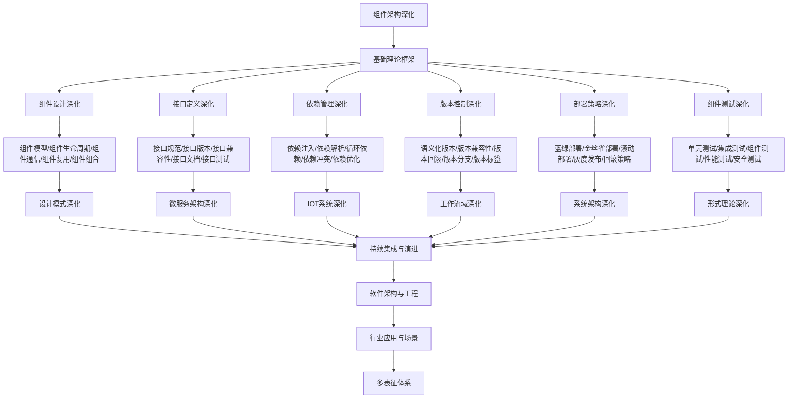

# 9.5-组件架构深化 分支导航

## 目录结构与本地跳转

- [9.5.1-组件设计深化](9.5.1-组件设计深化.md) - 预留分支
- [9.5.2-接口定义深化](9.5.2-接口定义深化.md) - 预留分支
- [9.5.3-依赖管理深化](9.5.3-依赖管理深化.md) - 预留分支
- [9.5.4-版本控制深化](9.5.4-版本控制深化.md) - 预留分支
- [9.5.5-部署策略深化](9.5.5-部署策略深化.md) - 预留分支
- [9.5.6-组件测试深化](9.5.6-组件测试深化.md) - 预留分支

---

## 主题交叉引用

| 主题      | 基础理论 | 组件设计 | 接口定义 | 依赖管理 | 版本控制 | 部署策略 | 组件测试 | 多表征 |
|-----------|----------|----------|----------|----------|----------|----------|----------|--------|
| 组件设计深化| 预留     | 预留     | 预留     | 预留     | 预留     | 预留     | 预留     | 预留   |
| 接口定义深化| 预留     | 预留     | 预留     | 预留     | 预留     | 预留     | 预留     | 预留   |
| 依赖管理深化| 预留     | 预留     | 预留     | 预留     | 预留     | 预留     | 预留     | 预留   |
| 版本控制深化| 预留     | 预留     | 预留     | 预留     | 预留     | 预留     | 预留     | 预留   |
| 部署策略深化| 预留     | 预留     | 预留     | 预留     | 预留     | 预留     | 预留     | 预留   |
| 组件测试深化| 预留     | 预留     | 预留     | 预留     | 预留     | 预留     | 预留     | 预留   |

- 交叉引用：[4.1-基础理论](../4-软件架构与工程/4.1-基础理论/README.md)、[9.1-设计模式深化](../9.1-设计模式深化/README.md)、[7.1-版本控制](../7-持续集成与演进/7.1-版本控制/README.md)

---

## 全链路知识流（Mermaid流程图）



---

## 知识体系特色

- **组件设计**: 可复用组件的设计原则和最佳实践
- **接口定义**: 清晰的接口定义和版本管理
- **依赖管理**: 复杂的依赖关系和冲突解决
- **版本控制**: 组件版本的生命周期管理
- **部署策略**: 多种部署策略和回滚机制
- **组件测试**: 组件的全面测试策略

---

## 核心概念详解

### 组件架构深化概述

组件架构深化是在基础组件理论之上，针对可复用组件系统的深入研究和实践，包括：

- **组件设计**：可复用组件的设计原则
- **接口定义**：清晰的接口定义和版本管理
- **依赖管理**：复杂的依赖关系和冲突解决
- **版本控制**：组件版本的生命周期管理
- **部署策略**：多种部署策略和回滚机制
- **组件测试**：组件的全面测试策略

### 组件设计深化

**设计原则**：

- **单一职责**：组件职责单一、高内聚
- **接口隔离**：接口清晰、最小依赖
- **依赖倒置**：依赖抽象、不依赖具体
- **开闭原则**：对扩展开放、对修改关闭

**组件模型**：

- **组件生命周期**：创建、初始化、运行、销毁
- **组件通信**：同步通信、异步通信、事件通信
- **组件复用**：组件复用、组件组合
- **组件组合**：组件组合、组件嵌套

### 接口定义深化

**接口规范**：

- **接口定义**：接口规范、接口文档
- **接口版本**：版本管理、版本兼容
- **接口兼容性**：向后兼容、向前兼容
- **接口文档**：API文档、接口说明

**接口类型**：

- **REST API**：RESTful接口
- **gRPC**：高性能RPC接口
- **GraphQL**：查询语言接口
- **WebSocket**：实时通信接口

### 依赖管理深化

**依赖注入**：

- **依赖注入**：构造函数注入、属性注入、方法注入
- **依赖解析**：依赖解析、依赖查找
- **循环依赖**：循环依赖检测、循环依赖解决
- **依赖冲突**：依赖冲突解决、版本选择

**依赖管理工具**：

- **Maven**：Java依赖管理
- **Gradle**：构建工具和依赖管理
- **npm**：Node.js包管理
- **Cargo**：Rust包管理

### 版本控制深化

**版本管理**：

- **语义化版本**：主版本、次版本、修订版本
- **版本兼容性**：向后兼容、破坏性变更
- **版本回滚**：版本回滚、版本恢复
- **版本分支**：版本分支、版本标签

**版本策略**：

- **语义化版本**：SemVer规范
- **版本号规则**：版本号命名规则
- **版本发布**：版本发布流程

### 部署策略深化

**部署方式**：

- **蓝绿部署**：零停机部署
- **金丝雀发布**：逐步发布
- **滚动部署**：逐步替换
- **灰度发布**：部分用户发布

**部署工具**：

- **Docker**：容器化部署
- **Kubernetes**：容器编排
- **Helm**：Kubernetes包管理

### 组件测试深化

**测试类型**：

- **单元测试**：组件单元测试
- **集成测试**：组件集成测试
- **组件测试**：组件功能测试
- **性能测试**：组件性能测试
- **安全测试**：组件安全测试

**测试工具**：

- **JUnit**：Java单元测试
- **pytest**：Python测试框架
- **Jest**：JavaScript测试框架

---

## 理论基础

### 组件理论

- **组件模型**：组件定义、组件接口
- **组件生命周期**：组件创建、运行、销毁
- **组件通信**：组件间通信机制

### 依赖理论

- **依赖注入**：依赖注入原理
- **依赖解析**：依赖解析算法
- **循环依赖**：循环依赖检测

---

## 应用场景

### 可扩展系统

- 插件系统
- 模块化系统
- 平台架构
- 框架设计

### 组件复用

- 组件库
- 组件市场
- 组件共享
- 组件组合

---

## 工具与框架

### 组件框架

- **OSGi**：Java组件框架
- **Spring Framework**：依赖注入框架
- **.NET Core**：.NET组件框架

### 依赖管理

- **Maven**：Java依赖管理
- **npm**：Node.js包管理
- **Cargo**：Rust包管理

---

## 最佳实践

### 组件设计

- 单一职责
- 接口清晰
- 依赖最小
- 可测试性

### 版本管理

- 语义化版本
- 版本兼容
- 版本文档
- 版本发布

---

## 多表征

本分支支持多种表征方式，包括：符号表征（组件定义、接口、依赖等）、图结构（组件图、依赖图、接口图等）、向量/张量（组件特征向量、依赖矩阵）、自然语言（定义、注释、描述）、图像/可视化（组件图、依赖图、接口图等）。这些表征可互映，提升组件架构理论表达力。

---

## 形式化语义

- 语义域：$D$，如组件对象集、接口空间、依赖模型、版本集合
- 解释函数：$I: S \to D$，将符号/结构映射到具体语义对象
- 语义一致性：每个组件/接口/依赖在$D$中有明确定义

---

## 形式化语法与证明

- 语法规则：如组件定义、接口规则、依赖规则、约束条件
- **定理**：本分支的语法系统具一致性与可扩展性。
- **证明**：由组件定义、接口规则与依赖规则递归定义，保证系统一致与可扩展。

---

## 实际应用案例

### 插件系统案例

**案例1：IDE插件系统**

- **架构特点**：插件架构、接口定义、依赖管理
- **技术栈**：OSGi、插件框架、依赖注入
- **最佳实践**：组件设计、接口定义、版本管理

**案例2：Web应用插件系统**

- **架构特点**：插件加载、插件通信、插件隔离
- **技术栈**：插件框架、模块系统、依赖管理
- **最佳实践**：组件设计、接口定义、安全隔离

### 模块化系统案例

**案例1：大型应用模块化**

- **挑战**：代码耦合、难以维护、难以扩展
- **方案**：模块化设计、接口定义、依赖管理
- **效果**：代码解耦、可维护性提升、可扩展性提升

**案例2：平台架构模块化**

- **挑战**：平台扩展、插件管理、版本兼容
- **方案**：组件架构、插件系统、版本管理
- **效果**：平台扩展能力提升、插件管理效率提升

---

## 学习路径

### 入门阶段

1. **理解组件概念**：学习组件基本概念
2. **掌握组件设计**：学习组件设计原则
3. **实践接口定义**：学习接口定义技术

### 进阶阶段

1. **依赖管理**：学习依赖管理技术
2. **版本控制**：学习版本控制技术
3. **组件测试**：学习组件测试技术

### 专家阶段

1. **架构设计**：设计组件架构
2. **框架设计**：设计组件框架
3. **技术选型**：为项目选择合适技术栈

---

## 工具与资源

### 组件框架

- **OSGi**：Java组件框架
- **Spring Framework**：依赖注入框架
- **.NET Core**：.NET组件框架

### 学习资源

- **经典书籍**：《组件化架构设计》
- **在线课程**：组件设计课程、架构设计课程
- **开源项目**：组件框架、插件系统

---

## 总结

组件架构深化是软件工程深化的重要组成部分，通过深入理解组件理论、掌握组件设计技术、积累实践经验，可以构建高质量、可复用、可扩展的组件系统。

**核心价值**：

1. **代码复用**：提高代码复用率
2. **系统解耦**：提高系统解耦和可维护性
3. **可扩展性**：支持系统扩展
4. **版本管理**：支持组件版本管理

**未来展望**：

随着模块化、插件化等技术的发展，组件架构将继续演进，特别是在插件系统、模块化系统、平台架构等领域，组件架构将提供更强大的功能和更好的体验。

---

---

## 组件设计实践

### 组件模型

**组件定义**：

```python
from abc import ABC, abstractmethod

class Component(ABC):
    def __init__(self, name):
        self.name = name
        self.dependencies = []

    @abstractmethod
    def initialize(self):
        pass

    @abstractmethod
    def execute(self, context):
        pass

    @abstractmethod
    def cleanup(self):
        pass

class ConcreteComponent(Component):
    def initialize(self):
        print(f"{self.name} initialized")

    def execute(self, context):
        print(f"{self.name} executing with context: {context}")
        return f"Result from {self.name}"

    def cleanup(self):
        print(f"{self.name} cleaned up")
```

### 组件生命周期

**生命周期阶段**：

1. **创建**：组件实例创建
2. **初始化**：组件初始化
3. **运行**：组件运行
4. **销毁**：组件销毁

**生命周期管理**：

```python
class ComponentManager:
    def __init__(self):
        self.components = {}

    def register(self, component):
        self.components[component.name] = component
        component.initialize()

    def unregister(self, name):
        if name in self.components:
            self.components[name].cleanup()
            del self.components[name]
```

---

## 接口定义实践

### 接口规范

**REST API接口**：

```python
from flask import Flask, jsonify, request

app = Flask(__name__)

@app.route('/api/v1/users', methods=['GET'])
def get_users():
    return jsonify({'users': []})

@app.route('/api/v1/users', methods=['POST'])
def create_user():
    data = request.json
    return jsonify({'id': 'user-001', **data}), 201
```

**gRPC接口**：

```protobuf
syntax = "proto3";

service UserService {
  rpc GetUser(GetUserRequest) returns (User);
  rpc CreateUser(CreateUserRequest) returns (User);
}

message User {
  string id = 1;
  string name = 2;
  string email = 3;
}
```

### 接口版本管理

**版本策略**：

- **URL版本**：/api/v1/users
- **Header版本**：Accept: application/vnd.api+json;version=1
- **参数版本**：?version=1

---

## 依赖管理实践

### 依赖注入

**依赖注入实现**：

```python
class DependencyContainer:
    def __init__(self):
        self.services = {}

    def register(self, interface, implementation):
        self.services[interface] = implementation

    def resolve(self, interface):
        return self.services.get(interface)

container = DependencyContainer()
container.register(ILogger, FileLogger)
logger = container.resolve(ILogger)
```

### 依赖解析

**依赖解析算法**：

- **拓扑排序**：依赖关系拓扑排序
- **循环检测**：循环依赖检测
- **依赖注入**：依赖自动注入

---

[返回软件工程深化总导航](../README.md)
