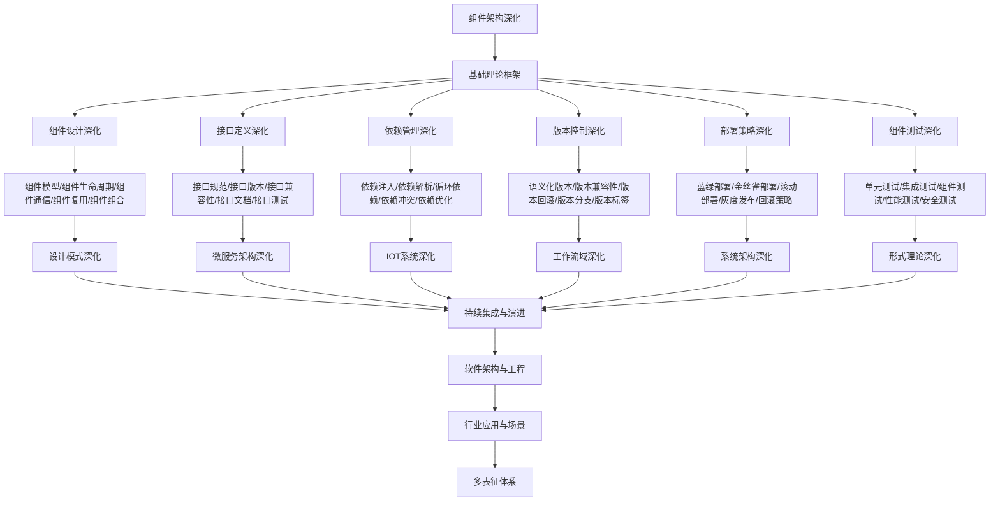

# 9.5-组件架构深化 分支导航

## 目录结构与本地跳转

- [9.5.1-组件设计深化](9.5.1-组件设计深化.md) - 预留分支
- [9.5.2-接口定义深化](9.5.2-接口定义深化.md) - 预留分支
- [9.5.3-依赖管理深化](9.5.3-依赖管理深化.md) - 预留分支
- [9.5.4-版本控制深化](9.5.4-版本控制深化.md) - 预留分支
- [9.5.5-部署策略深化](9.5.5-部署策略深化.md) - 预留分支
- [9.5.6-组件测试深化](9.5.6-组件测试深化.md) - 预留分支

---

## 主题交叉引用

| 主题      | 基础理论 | 组件设计 | 接口定义 | 依赖管理 | 版本控制 | 部署策略 | 组件测试 | 多表征 |
|-----------|----------|----------|----------|----------|----------|----------|----------|--------|
| 组件设计深化| 预留     | 预留     | 预留     | 预留     | 预留     | 预留     | 预留     | 预留   |
| 接口定义深化| 预留     | 预留     | 预留     | 预留     | 预留     | 预留     | 预留     | 预留   |
| 依赖管理深化| 预留     | 预留     | 预留     | 预留     | 预留     | 预留     | 预留     | 预留   |
| 版本控制深化| 预留     | 预留     | 预留     | 预留     | 预留     | 预留     | 预留     | 预留   |
| 部署策略深化| 预留     | 预留     | 预留     | 预留     | 预留     | 预留     | 预留     | 预留   |
| 组件测试深化| 预留     | 预留     | 预留     | 预留     | 预留     | 预留     | 预留     | 预留   |

- 交叉引用：[4.1-基础理论](../4-软件架构与工程/4.1-基础理论/README.md)、[9.1-设计模式深化](../9.1-设计模式深化/README.md)、[7.1-版本控制](../7-持续集成与演进/7.1-版本控制/README.md)

---

## 全链路知识流（Mermaid流程图）

---

## 知识体系特色

- **组件设计**: 可复用组件的设计原则和最佳实践
- **接口定义**: 清晰的接口定义和版本管理
- **依赖管理**: 复杂的依赖关系和冲突解决
- **版本控制**: 组件版本的生命周期管理
- **部署策略**: 多种部署策略和回滚机制
- **组件测试**: 组件的全面测试策略

---

[返回软件工程深化总导航](../README.md)
