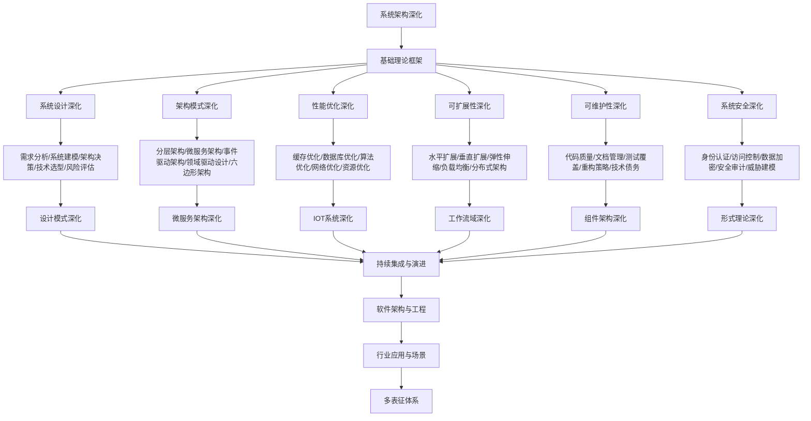

# 9.6-系统架构深化 分支导航

## 目录结构与本地跳转

- [9.6.1-系统设计深化](9.6.1-系统设计深化.md) - 预留分支
- [9.6.2-架构模式深化](9.6.2-架构模式深化.md) - 预留分支
- [9.6.3-性能优化深化](9.6.3-性能优化深化.md) - 预留分支
- [9.6.4-可扩展性深化](9.6.4-可扩展性深化.md) - 预留分支
- [9.6.5-可维护性深化](9.6.5-可维护性深化.md) - 预留分支
- [9.6.6-系统安全深化](9.6.6-系统安全深化.md) - 预留分支

---

## 主题交叉引用

| 主题      | 基础理论 | 系统设计 | 架构模式 | 性能优化 | 可扩展性 | 可维护性 | 系统安全 | 多表征 |
|-----------|----------|----------|----------|----------|----------|----------|----------|--------|
| 系统设计深化| 预留     | 预留     | 预留     | 预留     | 预留     | 预留     | 预留     | 预留   |
| 架构模式深化| 预留     | 预留     | 预留     | 预留     | 预留     | 预留     | 预留     | 预留   |
| 性能优化深化| 预留     | 预留     | 预留     | 预留     | 预留     | 预留     | 预留     | 预留   |
| 可扩展性深化| 预留     | 预留     | 预留     | 预留     | 预留     | 预留     | 预留     | 预留   |
| 可维护性深化| 预留     | 预留     | 预留     | 预留     | 预留     | 预留     | 预留     | 预留   |
| 系统安全深化| 预留     | 预留     | 预留     | 预留     | 预留     | 预留     | 预留     | 预留   |

- 交叉引用：[4.1-基础理论](../4-软件架构与工程/4.1-基础理论/README.md)、[9.1-设计模式深化](../9.1-设计模式深化/README.md)、[8-形式理论深化](../8-形式理论深化/README.md)

---

## 全链路知识流（Mermaid流程图）

---

## 知识体系特色

- **系统设计**: 从需求到架构的完整设计流程
- **架构模式**: 各种架构模式的应用场景和最佳实践
- **性能优化**: 系统性能的全面优化策略
- **可扩展性**: 系统扩展的设计原则和实现方法
- **可维护性**: 系统维护和演进的最佳实践
- **系统安全**: 系统安全的全面防护策略

---

[返回软件工程深化总导航](../README.md)
