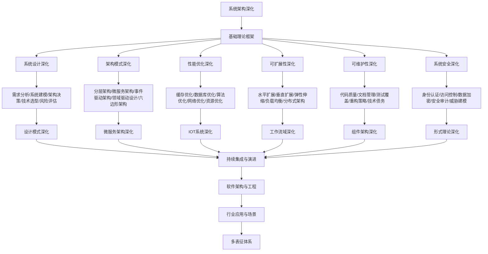

# 9.6-系统架构深化 分支导航

## 目录结构与本地跳转

- [9.6.1-系统设计深化](9.6.1-系统设计深化.md) - 预留分支
- [9.6.2-架构模式深化](9.6.2-架构模式深化.md) - 预留分支
- [9.6.3-性能优化深化](9.6.3-性能优化深化.md) - 预留分支
- [9.6.4-可扩展性深化](9.6.4-可扩展性深化.md) - 预留分支
- [9.6.5-可维护性深化](9.6.5-可维护性深化.md) - 预留分支
- [9.6.6-系统安全深化](9.6.6-系统安全深化.md) - 预留分支

---

## 主题交叉引用

| 主题      | 基础理论 | 系统设计 | 架构模式 | 性能优化 | 可扩展性 | 可维护性 | 系统安全 | 多表征 |
|-----------|----------|----------|----------|----------|----------|----------|----------|--------|
| 系统设计深化| 预留     | 预留     | 预留     | 预留     | 预留     | 预留     | 预留     | 预留   |
| 架构模式深化| 预留     | 预留     | 预留     | 预留     | 预留     | 预留     | 预留     | 预留   |
| 性能优化深化| 预留     | 预留     | 预留     | 预留     | 预留     | 预留     | 预留     | 预留   |
| 可扩展性深化| 预留     | 预留     | 预留     | 预留     | 预留     | 预留     | 预留     | 预留   |
| 可维护性深化| 预留     | 预留     | 预留     | 预留     | 预留     | 预留     | 预留     | 预留   |
| 系统安全深化| 预留     | 预留     | 预留     | 预留     | 预留     | 预留     | 预留     | 预留   |

- 交叉引用：[4.1-基础理论](../4-软件架构与工程/4.1-基础理论/README.md)、[9.1-设计模式深化](../9.1-设计模式深化/README.md)、[8-形式理论深化](../8-形式理论深化/README.md)

---

## 全链路知识流（Mermaid流程图）



---

## 知识体系特色

- **系统设计**: 从需求到架构的完整设计流程
- **架构模式**: 各种架构模式的应用场景和最佳实践
- **性能优化**: 系统性能的全面优化策略
- **可扩展性**: 系统扩展的设计原则和实现方法
- **可维护性**: 系统维护和演进的最佳实践
- **系统安全**: 系统安全的全面防护策略

---

## 核心概念详解

### 系统架构深化概述

系统架构深化是在基础架构理论之上，针对大规模复杂系统的深入研究和实践，包括：

- **系统设计**：从需求到架构的完整设计流程
- **架构模式**：各种架构模式的应用场景
- **性能优化**：系统性能的全面优化策略
- **可扩展性**：系统扩展的设计原则
- **可维护性**：系统维护和演进的最佳实践
- **系统安全**：系统安全的全面防护策略

### 系统设计深化

**设计流程**：

- **需求分析**：功能需求、非功能需求、约束条件
- **系统建模**：系统模型、架构模型、数据模型
- **架构决策**：架构选择、技术选型、权衡分析
- **风险评估**：技术风险、业务风险、运维风险

**设计方法**：

- **领域驱动设计**：DDD、限界上下文、聚合根
- **事件驱动设计**：事件溯源、CQRS、事件流
- **六边形架构**：端口适配器、依赖倒置

### 架构模式深化

**核心模式**：

- **分层架构**：MVC、MVP、MVVM、Clean Architecture
- **微服务架构**：服务拆分、服务治理、服务网格
- **事件驱动架构**：事件流、事件处理、事件存储
- **领域驱动设计**：DDD、Bounded Context、Aggregate
- **六边形架构**：端口适配器、依赖倒置

**模式选择**：

- **业务场景**：根据业务场景选择模式
- **技术约束**：考虑技术约束和限制
- **团队能力**：考虑团队技术能力
- **成本效益**：权衡成本和收益

### 性能优化深化

**优化策略**：

- **缓存优化**：多级缓存、缓存策略、缓存失效
- **数据库优化**：索引优化、查询优化、分库分表
- **算法优化**：算法选择、算法优化、数据结构
- **网络优化**：CDN、负载均衡、网络压缩
- **资源优化**：资源池、资源复用、资源限制

**性能指标**：

- **响应时间**：平均响应时间、P95、P99
- **吞吐量**：QPS、TPS、并发数
- **资源使用**：CPU、内存、磁盘、网络

### 可扩展性深化

**扩展方式**：

- **水平扩展**：增加服务器、负载均衡
- **垂直扩展**：提升服务器性能
- **弹性伸缩**：自动扩缩容、动态调整
- **分布式架构**：分布式系统、分布式存储

**扩展策略**：

- **无状态设计**：无状态服务、状态外置
- **数据分片**：数据分片、分库分表
- **缓存策略**：多级缓存、缓存预热
- **异步处理**：异步消息、异步任务

### 可维护性深化

**维护内容**：

- **代码质量**：代码规范、代码审查、代码重构
- **文档管理**：技术文档、API文档、运维文档
- **测试覆盖**：单元测试、集成测试、端到端测试
- **重构策略**：渐进式重构、技术债务管理

**维护工具**：

- **代码分析**：SonarQube、ESLint、Pylint
- **文档工具**：Markdown、Swagger、JSDoc
- **测试工具**：JUnit、pytest、Jest

### 系统安全深化

**安全内容**：

- **身份认证**：OAuth2、JWT、mTLS
- **访问控制**：RBAC、ABAC、策略引擎
- **数据加密**：传输加密、存储加密、密钥管理
- **安全审计**：审计日志、安全监控、威胁检测
- **威胁建模**：威胁分析、风险评估、安全设计

**安全工具**：

- **认证**：Keycloak、Auth0、OAuth2
- **加密**：TLS/SSL、数据加密、密钥管理
- **监控**：安全监控、威胁检测、入侵检测

---

## 理论基础

### 系统理论

- **系统论**：系统思维、系统分析
- **复杂性理论**：复杂系统、涌现性
- **控制论**：反馈控制、自适应系统

### 架构理论

- **架构模式**：架构模式分类、模式应用
- **质量属性**：性能、可用性、安全性
- **架构评估**：ATAM、CBAM

---

## 应用场景

### 企业级应用

- 大型系统设计
- 高可用系统
- 高性能系统
- 安全系统

### 互联网平台

- 高并发系统
- 大规模系统
- 分布式系统
- 云原生系统

---

## 工具与框架

### 架构工具

- **UML工具**：Enterprise Architect、Visual Paradigm
- **架构图工具**：C4 Model、ArchiMate
- **监控工具**：Prometheus、Grafana

### 性能工具

- **APM工具**：New Relic、Datadog
- **性能测试**：JMeter、Gatling
- **性能分析**：Profiler、性能分析工具

---

## 最佳实践

### 系统设计

- 从需求出发
- 考虑非功能需求
- 平衡各种质量属性
- 持续演进

### 性能优化

- 性能测试
- 性能分析
- 优化策略
- 持续监控

### 安全设计

- 安全左移
- 威胁建模
- 安全测试
- 安全监控

---

## 多表征

本分支支持多种表征方式，包括：符号表征（系统定义、架构模式、质量属性等）、图结构（架构图、系统图、依赖图等）、向量/张量（系统特征向量、性能指标）、自然语言（定义、注释、描述）、图像/可视化（架构图、系统图、性能图等）。这些表征可互映，提升系统架构理论表达力。

---

## 形式化语义

- 语义域：$D$，如系统对象集、架构空间、质量模型、性能指标
- 解释函数：$I: S \to D$，将符号/结构映射到具体语义对象
- 语义一致性：每个系统/架构/质量属性在$D$中有明确定义

---

## 形式化语法与证明

- 语法规则：如系统定义、架构规则、质量规则、约束条件
- **定理**：本分支的语法系统具一致性与可扩展性。
- **证明**：由系统定义、架构规则与质量规则递归定义，保证系统一致与可扩展。

---

## 实际应用案例

### 大型系统案例

**案例1：电商平台架构**

- **架构特点**：高并发、高可用、分布式
- **技术栈**：微服务、消息队列、缓存、数据库
- **最佳实践**：系统设计、性能优化、可扩展性

**案例2：金融系统架构**

- **架构特点**：高可用、强一致性、安全性
- **技术栈**：分布式系统、分布式事务、安全架构
- **最佳实践**：系统设计、安全设计、可维护性

### 互联网平台案例

**案例1：社交网络平台**

- **挑战**：高并发、大规模、实时性
- **方案**：分布式架构、缓存策略、CDN
- **效果**：系统性能提升、用户体验改善

**案例2：内容分发平台**

- **挑战**：内容管理、分发效率、用户体验
- **方案**：CDN、边缘计算、智能推荐
- **效果**：分发效率提升、用户体验改善

---

## 学习路径

### 入门阶段

1. **理解架构概念**：学习架构基本概念
2. **掌握架构模式**：学习架构模式
3. **实践系统设计**：学习系统设计方法

### 进阶阶段

1. **性能优化**：学习性能优化技术
2. **可扩展性**：学习可扩展性设计
3. **系统安全**：学习系统安全设计

### 专家阶段

1. **大规模架构**：设计大规模系统架构
2. **架构演进**：指导系统架构演进
3. **技术选型**：为项目选择合适技术栈

---

## 工具与资源

### 架构工具

- **UML工具**：Enterprise Architect、Visual Paradigm
- **架构图工具**：C4 Model、ArchiMate
- **监控工具**：Prometheus、Grafana

### 学习资源

- **经典书籍**：《软件架构：面向复杂系统的结构化设计》
- **在线课程**：架构设计课程、系统设计课程
- **开源项目**：架构框架、系统设计案例

---

## 总结

系统架构深化是软件工程深化的重要组成部分，通过深入理解系统架构、掌握架构设计方法、积累实践经验，可以构建高质量、高性能、可扩展的系统架构。

**核心价值**：

1. **系统设计**：提高系统设计能力
2. **性能优化**：提高系统性能
3. **可扩展性**：支持系统扩展
4. **可维护性**：提高系统可维护性

**未来展望**：

随着云原生、AI、边缘计算等技术的发展，系统架构将继续演进，特别是在云原生架构、智能化系统、边缘架构等领域，系统架构将提供更强大的功能和更好的体验。

---

---

## 系统设计实践

### 需求分析

**需求类型**：

- **功能需求**：系统功能要求
- **非功能需求**：性能、可用性、安全性
- **约束条件**：技术约束、业务约束

**需求分析方法**：

- **用户故事**：用户故事描述
- **用例分析**：用例图、用例描述
- **原型设计**：原型验证需求

### 架构决策

**决策框架**：

- **问题识别**：识别需要决策的问题
- **方案分析**：分析可能的方案
- **权衡分析**：分析方案权衡
- **决策记录**：记录决策过程和结果

**决策模板**：

```markdown
## 架构决策记录

**问题**：如何选择数据库？

**方案**：
- MySQL：关系型数据库
- MongoDB：文档数据库
- Redis：内存数据库

**决策**：选择MySQL

**理由**：
- 数据关系复杂
- 需要ACID保证
- 团队熟悉MySQL
```

---

## 性能优化实践

### 缓存优化

**缓存策略**：

- **多级缓存**：L1缓存、L2缓存、L3缓存
- **缓存预热**：系统启动时预热缓存
- **缓存失效**：缓存失效策略
- **缓存更新**：缓存更新策略

**缓存实现**：

```python
from functools import lru_cache
import redis

# 本地缓存
@lru_cache(maxsize=128)
def get_user(user_id):
    return fetch_user_from_db(user_id)

# 分布式缓存
redis_client = redis.Redis()

def get_user_cached(user_id):
    cache_key = f"user:{user_id}"
    cached = redis_client.get(cache_key)
    if cached:
        return json.loads(cached)
    user = fetch_user_from_db(user_id)
    redis_client.setex(cache_key, 3600, json.dumps(user))
    return user
```

### 数据库优化

**优化策略**：

- **索引优化**：创建合适索引
- **查询优化**：优化SQL查询
- **分库分表**：数据分片
- **读写分离**：主从复制

---

## 可扩展性实践

### 水平扩展

**扩展策略**：

- **无状态设计**：服务无状态
- **负载均衡**：请求负载均衡
- **数据分片**：数据水平分片
- **服务拆分**：服务水平拆分

### 弹性伸缩

**伸缩策略**：

- **自动扩缩容**：根据负载自动调整
- **预测性伸缩**：根据预测调整
- **定时伸缩**：定时调整容量

---

[返回软件工程深化总导航](../README.md)
