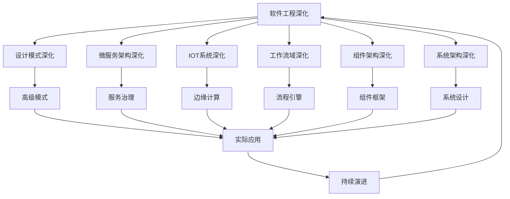

# 9-软件工程深化

## 📁 目录结构

```
9-软件工程深化/
├── 9.1-设计模式深化/
│   └── README.md
├── 9.2-微服务架构深化/
│   └── README.md
├── 9.3-IOT系统深化/
│   └── README.md
├── 9.4-工作流域深化/
│   └── README.md
├── 9.5-组件架构深化/
│   └── README.md
├── 9.6-系统架构深化/
│   └── README.md
└── README.md
```

## 🔗 主题交叉引用表

| 架构分支 | 关联理论 | 技术应用 | 实践场景 |
|---------|---------|---------|---------|
| **设计模式深化** | 面向对象理论、SOLID原则 | 高级模式、反模式 | 大型系统设计、代码重构 |
| **微服务架构深化** | 分布式系统理论、服务治理 | 服务网格、API网关 | 云原生应用、大规模系统 |
| **IOT系统深化** | 嵌入式系统、传感器网络 | 边缘计算、设备管理 | 智能家居、工业物联网 |
| **工作流域深化** | 业务流程、状态机理论 | 流程引擎、任务调度 | 企业流程、自动化系统 |
| **组件架构深化** | 模块化理论、组件化设计 | 组件框架、插件系统 | 可扩展系统、平台架构 |
| **系统架构深化** | 系统理论、架构模式 | 系统设计、性能优化 | 企业级应用、高可用系统 |

## 🔄 全链路知识流图



## 🎯 知识体系特色

### 理论严谨性

- **架构原则**：基于成熟的软件工程理论
- **设计模式**：经过验证的设计解决方案
- **最佳实践**：行业标准的最佳实践指南

### 技术创新性

- **云原生架构**：适应云计算环境的新架构模式
- **微服务演进**：从单体到微服务的架构演进
- **IOT融合**：传统软件与物联网的深度融合

### 实践导向

- **工程实现**：可直接应用于实际项目
- **可扩展性**：支持系统规模扩展
- **可维护性**：注重长期维护和演进

### 持续演进

- **技术更新**：跟随技术发展趋势
- **架构演进**：适应业务需求变化
- **最佳实践**：持续优化和改进

## 📚 学习路径建议

### 🚀 入门路径

1. **设计模式深化** → 掌握高级设计模式
2. **微服务架构深化** → 理解分布式系统设计
3. **IOT系统深化** → 学习物联网系统设计
4. **工作流域深化** → 掌握业务流程建模

### 🔄 进阶路径

1. **组件架构深化** → 深入模块化设计
2. **系统架构深化** → 学习大规模系统设计
3. **服务治理** → 掌握微服务治理技术
4. **边缘计算** → 学习分布式计算架构

### 🎯 专家路径

1. **大规模架构** → 设计高并发、高可用系统
2. **架构演进** → 指导系统架构升级和重构
3. **技术选型** → 为项目选择最适合的技术栈
4. **架构治理** → 建立企业级架构治理体系

## 🚀 快速导航

### 架构深化

- [设计模式深化](9.1-设计模式深化/README.md)
- [微服务架构深化](9.2-微服务架构深化/README.md)
- [IOT系统深化](9.3-IOT系统深化/README.md)

### 系统深化

- [工作流域深化](9.4-工作流域深化/README.md)
- [组件架构深化](9.5-组件架构深化/README.md)
- [系统架构深化](9.6-系统架构深化/README.md)

## 🛠️ 技术栈映射

### 设计模式

- **创建型模式**：抽象工厂、建造者、原型
- **结构型模式**：适配器、桥接、组合、装饰器
- **行为型模式**：责任链、命令、解释器、迭代器
- **并发模式**：生产者消费者、读写锁、线程池
- **分布式模式**：一致性哈希、分片、负载均衡

### 微服务技术

- **服务框架**：Spring Cloud、Dubbo、gRPC
- **服务发现**：Consul、Eureka、Zookeeper
- **API网关**：Kong、Zuul、Nginx
- **配置管理**：Config Server、Apollo、Nacos
- **链路追踪**：Zipkin、Jaeger、SkyWalking
- **服务网格**：Istio、Linkerd、Consul Connect

### IOT技术

- **设备管理**：Azure IoT Hub、AWS IoT、Google Cloud IoT
- **消息协议**：MQTT、CoAP、HTTP、AMQP
- **边缘计算**：Azure IoT Edge、AWS Greengrass、KubeEdge
- **数据分析**：时序数据库、流处理、机器学习
- **安全机制**：设备认证、数据加密、安全网关

### 工作流技术

- **流程引擎**：Activiti、Camunda、Flowable、Zeebe
- **任务调度**：Quartz、XXL-Job、Elastic-Job、SchedulerX
- **规则引擎**：Drools、Easy Rules、Aviator
- **状态机**：Spring Statemachine、StateMachine
- **BPMN**：业务流程建模与标记

### 组件架构

- **组件框架**：OSGi、Spring Framework、.NET Core
- **插件系统**：Eclipse RCP、IntelliJ Platform、VS Code
- **模块化**：Java 9+ Modules、ES6 Modules、Python Packages
- **依赖注入**：Spring IoC、Guice、Dagger
- **AOP**：Spring AOP、AspectJ、PostSharp

### 系统架构

- **分层架构**：MVC、MVP、MVVM、Clean Architecture
- **事件驱动**：Event Sourcing、CQRS、Event Streaming
- **领域驱动**：DDD、Bounded Context、Aggregate
- **六边形架构**：端口适配器、依赖倒置
- **CQRS**：命令查询职责分离

## 🎯 应用场景体系

### 企业级应用

- **ERP系统**：企业资源规划、业务流程管理
- **CRM系统**：客户关系管理、销售流程
- **OA系统**：办公自动化、工作流程
- **财务系统**：财务管理、会计核算

### 互联网平台

- **电商平台**：商品管理、订单处理、支付系统
- **社交网络**：用户关系、内容分发、推荐系统
- **内容平台**：媒体管理、内容创作、分发
- **游戏平台**：游戏服务、用户管理、支付

### 云原生应用

- **容器化部署**：Docker、Kubernetes、OpenShift
- **无服务器**：AWS Lambda、Azure Functions、Google Cloud Functions
- **服务网格**：Istio、Linkerd、Consul Connect
- **多云管理**：Terraform、CloudFormation、Pulumi

### 物联网应用

- **智能家居**：设备控制、场景联动、语音交互
- **工业物联网**：设备监控、预测维护、质量控制
- **智慧城市**：交通管理、环境监测、公共安全
- **农业物联网**：精准农业、环境控制、产量预测

### 金融科技

- **核心银行系统**：账户管理、交易处理、风险控制
- **支付清算**：实时清算、跨境支付、数字货币
- **风控系统**：反欺诈、信用评估、合规监管
- **区块链应用**：智能合约、去中心化应用

### 新兴技术

- **AI/ML平台**：机器学习模型部署、AI服务
- **大数据平台**：数据湖、实时处理、分析平台
- **边缘计算**：边缘节点、本地处理、低延迟
- **量子计算**：量子算法、量子安全、量子通信

---

**📖 相关导航**

- [返回总导航](../README.md)
- [4-软件架构与工程](../4-软件架构与工程/README.md)
- [8-形式理论深化](../8-形式理论深化/README.md)
- [Matter/Software](../Matter/Software/)
