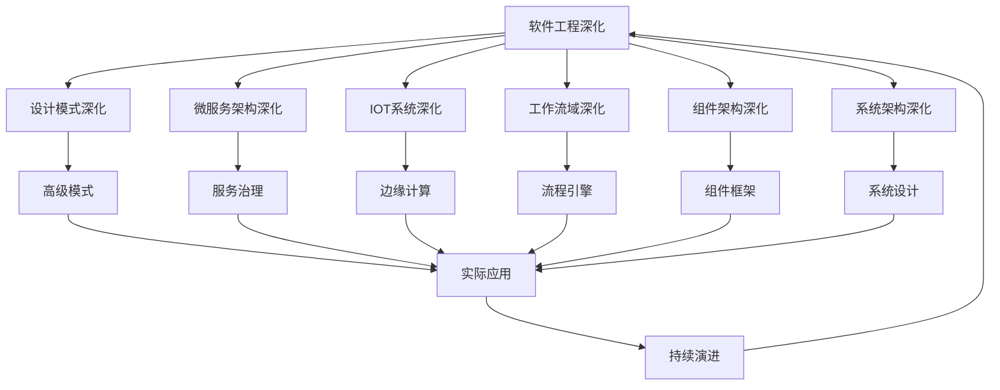

# 9-软件工程深化

## 1. 📁 目录结构

```text
9-软件工程深化/
├── 9.1-设计模式深化/
│   └── README.md
├── 9.2-微服务架构深化/
│   └── README.md
├── 9.3-IOT系统深化/
│   └── README.md
├── 9.4-工作流域深化/
│   └── README.md
├── 9.5-组件架构深化/
│   └── README.md
├── 9.6-系统架构深化/
│   └── README.md
└── README.md
```

## 2. 🔗 主题交叉引用表

| 架构分支 | 关联理论 | 技术应用 | 实践场景 |
|---------|---------|---------|---------|
| **设计模式深化** | 面向对象理论、SOLID原则 | 高级模式、反模式 | 大型系统设计、代码重构 |
| **微服务架构深化** | 分布式系统理论、服务治理 | 服务网格、API网关 | 云原生应用、大规模系统 |
| **IOT系统深化** | 嵌入式系统、传感器网络 | 边缘计算、设备管理 | 智能家居、工业物联网 |
| **工作流域深化** | 业务流程、状态机理论 | 流程引擎、任务调度 | 企业流程、自动化系统 |
| **组件架构深化** | 模块化理论、组件化设计 | 组件框架、插件系统 | 可扩展系统、平台架构 |
| **系统架构深化** | 系统理论、架构模式 | 系统设计、性能优化 | 企业级应用、高可用系统 |

## 3. 🔄 全链路知识流图



## 4. 知识体系特色

### 4.1. 理论严谨性

- **架构原则**：基于成熟的软件工程理论
- **设计模式**：经过验证的设计解决方案
- **最佳实践**：行业标准的最佳实践指南

### 4.2. 技术创新性

- **云原生架构**：适应云计算环境的新架构模式
- **微服务演进**：从单体到微服务的架构演进
- **IOT融合**：传统软件与物联网的深度融合

### 4.3. 实践导向

- **工程实现**：可直接应用于实际项目
- **可扩展性**：支持系统规模扩展
- **可维护性**：注重长期维护和演进

### 4.4. 持续演进

- **技术更新**：跟随技术发展趋势
- **架构演进**：适应业务需求变化
- **最佳实践**：持续优化和改进

## 5. 学习路径建议

### 5.1. 入门路径

1. **设计模式深化** → 掌握高级设计模式
2. **微服务架构深化** → 理解分布式系统设计
3. **IOT系统深化** → 学习物联网系统设计
4. **工作流域深化** → 掌握业务流程建模

### 5.2. 🔄 进阶路径

1. **组件架构深化** → 深入模块化设计
2. **系统架构深化** → 学习大规模系统设计
3. **服务治理** → 掌握微服务治理技术
4. **边缘计算** → 学习分布式计算架构

### 5.3. 专家路径

1. **大规模架构** → 设计高并发、高可用系统
2. **架构演进** → 指导系统架构升级和重构
3. **技术选型** → 为项目选择最适合的技术栈
4. **架构治理** → 建立企业级架构治理体系

## 6. 快速导航

### 6.1. 架构深化

- [设计模式深化](9.1-设计模式深化/README.md)
- [微服务架构深化](9.2-微服务架构深化/README.md)
- [IOT系统深化](9.3-IOT系统深化/README.md)

### 6.2. 系统深化

- [工作流域深化](9.4-工作流域深化/README.md)
- [组件架构深化](9.5-组件架构深化/README.md)
- [系统架构深化](9.6-系统架构深化/README.md)

## 7. 🛠️ 技术栈映射

### 7.1. 设计模式

- **创建型模式**：抽象工厂、建造者、原型
- **结构型模式**：适配器、桥接、组合、装饰器
- **行为型模式**：责任链、命令、解释器、迭代器
- **并发模式**：生产者消费者、读写锁、线程池
- **分布式模式**：一致性哈希、分片、负载均衡

### 7.2. 微服务技术

- **服务框架**：Spring Cloud、Dubbo、gRPC
- **服务发现**：Consul、Eureka、Zookeeper
- **API网关**：Kong、Zuul、Nginx
- **配置管理**：Config Server、Apollo、Nacos
- **链路追踪**：Zipkin、Jaeger、SkyWalking
- **服务网格**：Istio、Linkerd、Consul Connect

### 7.3. IOT技术

- **设备管理**：Azure IoT Hub、AWS IoT、Google Cloud IoT
- **消息协议**：MQTT、CoAP、HTTP、AMQP
- **边缘计算**：Azure IoT Edge、AWS Greengrass、KubeEdge
- **数据分析**：时序数据库、流处理、机器学习
- **安全机制**：设备认证、数据加密、安全网关

### 7.4. 工作流技术

- **流程引擎**：Activiti、Camunda、Flowable、Zeebe
- **任务调度**：Quartz、XXL-Job、Elastic-Job、SchedulerX
- **规则引擎**：Drools、Easy Rules、Aviator
- **状态机**：Spring Statemachine、StateMachine
- **BPMN**：业务流程建模与标记

### 7.5. 组件架构

- **组件框架**：OSGi、Spring Framework、.NET Core
- **插件系统**：Eclipse RCP、IntelliJ Platform、VS Code
- **模块化**：Java 9+ Modules、ES6 Modules、Python Packages
- **依赖注入**：Spring IoC、Guice、Dagger
- **AOP**：Spring AOP、AspectJ、PostSharp

### 7.6. 系统架构

- **分层架构**：MVC、MVP、MVVM、Clean Architecture
- **事件驱动**：Event Sourcing、CQRS、Event Streaming
- **领域驱动**：DDD、Bounded Context、Aggregate
- **六边形架构**：端口适配器、依赖倒置
- **CQRS**：命令查询职责分离

## 8. 应用场景体系

### 8.1. 企业级应用

- **ERP系统**：企业资源规划、业务流程管理
- **CRM系统**：客户关系管理、销售流程
- **OA系统**：办公自动化、工作流程
- **财务系统**：财务管理、会计核算

### 8.2. 互联网平台

- **电商平台**：商品管理、订单处理、支付系统
- **社交网络**：用户关系、内容分发、推荐系统
- **内容平台**：媒体管理、内容创作、分发
- **游戏平台**：游戏服务、用户管理、支付

### 8.3. 云原生应用

- **容器化部署**：Docker、Kubernetes、OpenShift
- **无服务器**：AWS Lambda、Azure Functions、Google Cloud Functions
- **服务网格**：Istio、Linkerd、Consul Connect
- **多云管理**：Terraform、CloudFormation、Pulumi

### 8.4. 物联网应用

- **智能家居**：设备控制、场景联动、语音交互
- **工业物联网**：设备监控、预测维护、质量控制
- **智慧城市**：交通管理、环境监测、公共安全
- **农业物联网**：精准农业、环境控制、产量预测

### 8.5. 金融科技

- **核心银行系统**：账户管理、交易处理、风险控制
- **支付清算**：实时清算、跨境支付、数字货币
- **风控系统**：反欺诈、信用评估、合规监管
- **区块链应用**：智能合约、去中心化应用

### 8.6. 新兴技术

- **AI/ML平台**：机器学习模型部署、AI服务
- **大数据平台**：数据湖、实时处理、分析平台
- **边缘计算**：边缘节点、本地处理、低延迟
- **量子计算**：量子算法、量子安全、量子通信

---

-**📖 相关导航**

- [返回总导航](../README.md)
- [4-软件架构与工程](../4-软件架构与工程/README.md)
- [8-形式理论深化](../8-形式理论深化/README.md)
- [Matter/Software](../Matter/Software/)

## 9. 多表征

本分支支持多种表征方式，包括：

- 符号表征（工程元素、设计模式、流程、接口、架构等）
- 图结构（工程流程图、组件图、依赖图、架构图等）
- 向量/张量（工程特征向量、性能指标）
- 自然语言（定义、注释、描述）
- 图像/可视化（工程结构图、流程图、交互图等）
这些表征可互映，提升软件工程理论与实践表达力。

## 10. 形式化语义

- 语义域：$D$，如工程元素集、组件空间、流程模型、接口集合
- 解释函数：$I: S \to D$，将符号/结构映射到具体语义对象
- 语义一致性：每个结构/流程/接口在$D$中有明确定义

## 11. 形式化语法与证明

- 语法规则：如工程定义、设计模式伪代码、流程规则、约束条件
- **定理**：本分支的语法系统具一致性与可扩展性。
- **证明**：由工程定义、设计模式与流程规则递归定义，保证系统一致与可扩展。

---

## 12. 核心概念详解

### 12.1. 软件工程深化定义

**定义 12.1.1** (软件工程深化)：

软件工程深化是在基础软件工程理论之上，针对特定领域和场景的深入研究和实践，包括：

- **架构深化**：深入理解各种架构模式和设计原则
- **技术深化**：掌握特定技术栈的深度应用
- **实践深化**：积累实际项目经验和最佳实践
- **理论深化**：将实践经验上升为理论体系

### 12.2. 架构演进路径

**演进阶段**：

1. **单体架构**：传统单体应用
2. **分层架构**：MVC、三层架构
3. **微服务架构**：服务拆分、分布式系统
4. **云原生架构**：容器化、服务网格
5. **Serverless架构**：无服务器、函数计算

### 12.3. 设计模式深化

**深化方向**：

- **模式组合**：多个模式的组合使用
- **模式变体**：模式的变体和扩展
- **反模式识别**：识别和避免反模式
- **领域特定模式**：特定领域的模式应用

---

## 13. 架构模式详解

### 13.1. 微服务架构深化

**核心概念**：

- **服务拆分**：领域驱动设计、业务边界
- **服务治理**：服务发现、配置管理、监控追踪
- **数据管理**：数据库per服务、分布式事务
- **通信模式**：同步通信、异步通信、事件驱动

**技术栈**：

- **服务框架**：Spring Cloud、Dubbo、gRPC
- **服务网格**：Istio、Linkerd、Consul Connect
- **API网关**：Kong、Zuul、Nginx
- **配置中心**：Apollo、Nacos、Config Server

### 13.2. 事件驱动架构

**核心概念**：

- **事件源**：事件溯源、事件存储
- **事件总线**：消息队列、事件流
- **事件处理**：事件处理器、事件聚合
- **CQRS**：命令查询职责分离

**技术栈**：

- **消息队列**：Kafka、RabbitMQ、RocketMQ
- **事件流**：Kafka Streams、Flink、Storm
- **事件存储**：EventStore、Axon Framework

### 13.3. 领域驱动设计

**核心概念**：

- **领域模型**：实体、值对象、聚合
- **限界上下文**：上下文边界、上下文映射
- **领域服务**：领域逻辑、领域事件
- **仓储模式**：数据访问抽象

---

## 14. 实际应用案例

### 14.1. 大型互联网公司架构

**案例特点**：

- 高并发、高可用
- 微服务架构
- 云原生部署
- 数据驱动

**技术栈**：

- Spring Cloud、Kubernetes
- Kafka、Redis、MySQL
- Prometheus、Grafana

### 14.2. 企业级系统架构

**案例特点**：

- 复杂业务流程
- 多系统集成
- 高安全性要求
- 合规性要求

**技术栈**：

- 企业服务总线(ESB)
- 工作流引擎
- 统一认证授权
- 审计日志

### 14.3. IoT系统架构

**案例特点**：

- 设备管理
- 边缘计算
- 实时数据处理
- 云端集成

**技术栈**：

- MQTT、CoAP
- 边缘网关
- 时序数据库
- 云平台

---

## 15. 工具与框架

### 15.1. 架构设计工具

**UML工具**：

- Enterprise Architect
- Visual Paradigm
- Draw.io
- PlantUML

**架构图工具**：

- C4 Model
- ArchiMate
- Structurizr

### 15.2. 开发框架

**微服务框架**：

- Spring Cloud
- Dubbo
- gRPC
- Istio

**工作流框架**：

- Activiti
- Camunda
- Flowable
- Temporal

### 15.3. 监控工具

**APM工具**：

- New Relic
- Datadog
- AppDynamics
- SkyWalking

**日志工具**：

- ELK Stack
- Splunk
- Graylog
- Loki

---

## 16. 最佳实践

### 16.1. 架构设计实践

**实践原则**：

- 从需求出发
- 考虑非功能需求
- 平衡各种质量属性
- 持续演进

### 16.2. 微服务实践

**实践原则**：

- 服务拆分合理
- 服务独立部署
- 服务治理完善
- 监控追踪全面

### 16.3. 系统演进实践

**演进策略**：

- 渐进式演进
- 并行运行
- 灰度发布
- 快速回滚

---

## 17. 挑战与解决方案

### 17.1. 分布式系统复杂性

**挑战**：网络延迟、部分故障、数据一致性

**解决方案**：超时机制、重试策略、熔断器、分布式事务

### 17.2. 服务治理

**挑战**：服务发现、配置管理、监控追踪

**解决方案**：服务注册中心、配置中心、分布式追踪

### 17.3. 数据管理

**挑战**：数据一致性、跨服务查询、事务管理

**解决方案**：Saga模式、CQRS、事件溯源

---

## 18. 发展趋势

### 18.1. 云原生架构

**发展趋势**：

- 容器化部署
- 服务网格
- Serverless
- 多云管理

### 18.2. AI集成

**发展趋势**：

- AI辅助开发
- 智能运维
- 自动化决策
- 智能监控

### 18.3. 边缘计算

**发展趋势**：

- 边缘节点
- 边缘智能
- 低延迟处理
- 离线能力

---

## 19. 总结

软件工程深化是软件工程理论在实际项目中的深入应用和持续演进。通过系统化的架构设计、技术选型和最佳实践，可以构建高质量、可维护、可扩展的软件系统。

**核心价值**：

1. **理论指导**：为架构设计提供理论指导
2. **实践支持**：提供系统化的实践方法
3. **工具支持**：提供实用的工具和框架
4. **最佳实践**：总结行业最佳实践和经验

**未来展望**：

随着云计算、AI、边缘计算等技术的发展，软件工程将继续深化，特别是在云原生架构、智能化系统、边缘计算等领域，软件工程将提供更强大的功能和更好的体验。

---

[返回上级目录](../README.md)
