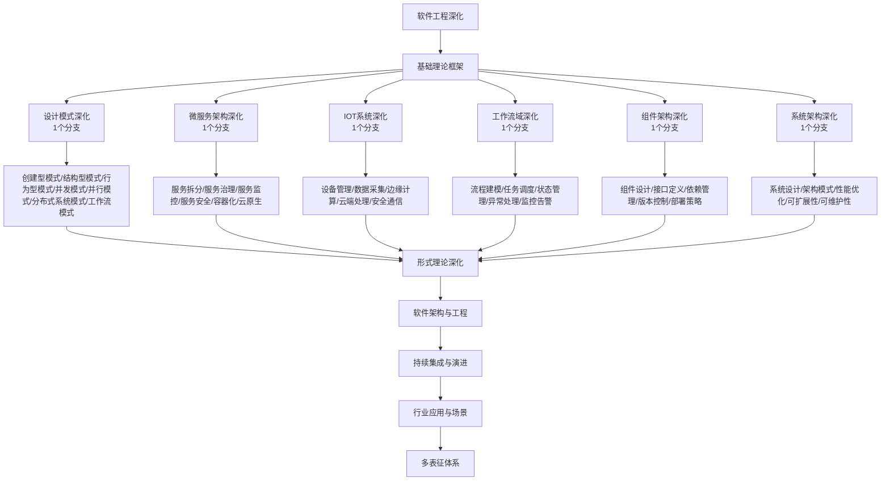

# 9-软件工程深化 总导航

## 目录结构与完成情况

- [9.1-设计模式深化](9.1-设计模式深化/README.md) - **1个分支，预留框架**
- [9.2-微服务架构深化](9.2-微服务架构深化/README.md) - **1个分支，预留框架**
- [9.3-IOT系统深化](9.3-IOT系统深化/README.md) - **1个分支，预留框架**
- [9.4-工作流域深化](9.4-工作流域深化/README.md) - **1个分支，预留框架**
- [9.5-组件架构深化](9.5-组件架构深化/README.md) - **1个分支，预留框架**
- [9.6-系统架构深化](9.6-系统架构深化/README.md) - **1个分支，预留框架**

---

## 主题交叉引用

| 分支      | 基础理论 | 设计模式 | 微服务架构 | IOT系统 | 工作流域 | 组件架构 | 系统架构 | 多表征 |
|-----------|----------|----------|------------|---------|----------|----------|----------|--------|
| 设计模式深化| 预留     | 预留     | 预留       | 预留    | 预留     | 预留     | 预留     | 预留   |
| 微服务架构深化| 预留   | 预留     | 预留       | 预留    | 预留     | 预留     | 预留     | 预留   |
| IOT系统深化| 预留     | 预留     | 预留       | 预留    | 预留     | 预留     | 预留     | 预留   |
| 工作流域深化| 预留     | 预留     | 预留       | 预留    | 预留     | 预留     | 预留     | 预留   |
| 组件架构深化| 预留     | 预留     | 预留       | 预留    | 预留     | 预留     | 预留     | 预留   |
| 系统架构深化| 预留     | 预留     | 预留       | 预留    | 预留     | 预留     | 预留     | 预留   |

- 交叉引用：[4-软件架构与工程](../4-软件架构与工程/README.md)、[8-形式理论深化](../8-形式理论深化/README.md)、[7-持续集成与演进](../7-持续集成与演进/README.md)

---

## 全链路知识流（Mermaid流程图）

---

## 知识体系特色

- **模式驱动**: 从设计模式到架构模式的完整模式体系
- **服务导向**: 微服务架构的深度理论和实践
- **物联网**: IOT系统的完整技术栈和架构
- **工作流**: 复杂业务流程的建模和执行
- **组件化**: 可复用组件的设计和实现

---

[返回Analysis总导航](../README.md)
