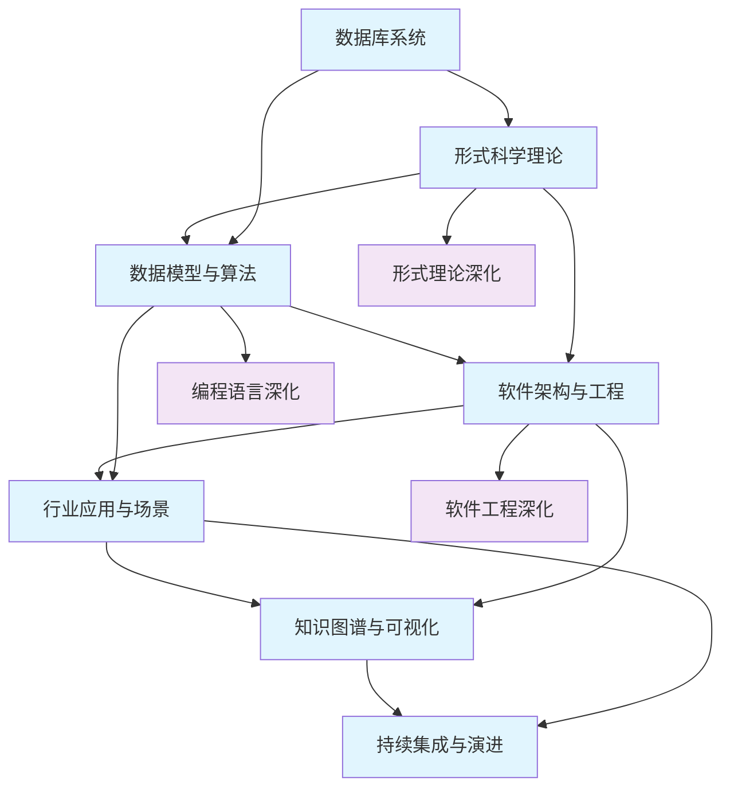

# Data-Science 知识库总导航

## 📚 目录结构与完成情况

### 🗄️ **1-数据库系统** - **已完成导航**

- [1.1-PostgreSQL](1-数据库系统/1.1-PostgreSQL/) - **20个分支，已完成导航**
- [1.2-MySQL](1-数据库系统/1.2-MySQL/) - **8个分支，已完成导航**
- [1.3-NoSQL](1-数据库系统/1.3-NoSQL/) - **6个分支，已完成导航**
- [1.4-NewSQL](1-数据库系统/1.4-NewSQL/) - **7个分支，已完成导航**
- [导航索引](1-数据库系统/导航索引.md) - **详细导航索引**

### 🔬 **2-形式科学理论** - **已完成导航**

- [2.1-类型理论](2-形式科学理论/2.1-类型理论/) - **3个分支，已完成导航**
- [2.2-自动机理论](2-形式科学理论/2.2-自动机理论/) - **1个分支，已完成导航**
- [2.3-Petri网理论](2-形式科学理论/2.3-Petri网理论/) - **2个分支，已完成导航**
- [2.4-时态逻辑控制理论](2-形式科学理论/2.4-时态逻辑控制理论/) - **1个分支，已完成导航**
- [2.5-分布式系统理论](2-形式科学理论/2.5-分布式系统理论/) - **1个分支，已完成导航**
- [2.6-控制理论](2-形式科学理论/2.6-控制理论/) - **1个分支，已完成导航**
- [2.7-数学基础理论](2-形式科学理论/2.7-数学基础理论/) - **1个分支，已完成导航**
- [2.8-编程语言理论](2-形式科学理论/2.8-编程语言理论/) - **1个分支，已完成导航**
- [2.9-哲学基础理论](2-形式科学理论/2.9-哲学基础理论/) - **1个分支，已完成导航**

### 🧮 **3-数据模型与算法** - **已完成导航**

- [3.1-基础理论](3-数据模型与算法/3.1-基础理论/) - **1个分支，已完成导航**
- [3.2-形式化模型](3-数据模型与算法/3.2-形式化模型/) - **1个分支，已完成导航**
- [3.3-算法实现](3-数据模型与算法/3.3-算法实现/) - **3个分支，已完成导航**
- [3.4-AI与机器学习算法](3-数据模型与算法/3.4-AI与机器学习算法/) - **10个分支，已完成导航**
- [3.5-数据分析与ETL](3-数据模型与算法/3.5-数据分析与ETL/) - **7个分支，已完成导航**

### 🏗️ **4-软件架构与工程** - **已完成导航**

- [4.1-基础理论](4-软件架构与工程/4.1-基础理论/) - **1个分支，已完成导航**
- [4.2-设计模式](4-软件架构与工程/4.2-设计模式/) - **1个分支，已完成导航**
- [4.3-微服务架构](4-软件架构与工程/4.3-微服务架构/) - **1个分支，已完成导航**
- [4.4-IOT](4-软件架构与工程/4.4-IOT/) - **1个分支，已完成导航**
- [4.5-WorkflowDomain](4-软件架构与工程/4.5-WorkflowDomain/) - **1个分支，已完成导航**

### 🎯 **5-行业应用与场景** - **已完成导航**

- [5.1-金融数据分析](5-行业应用与场景/5.1-金融数据分析/) - **1个分支，已完成导航**
- [5.2-科学计算](5-行业应用与场景/5.2-科学计算/) - **1个分支，已完成导航**
- [5.3-机器学习](5-行业应用与场景/5.3-机器学习/) - **1个分支，已完成导航**

### 🧠 **6-知识图谱与可视化** - **已完成导航**

- [6.1-知识表示](6-知识图谱与可视化/6.1-知识表示/) - **1个分支，已完成导航**
- [6.2-关系建模](6-知识图谱与可视化/6.2-关系建模/) - **1个分支，已完成导航**
- [6.3-可视化技术](6-知识图谱与可视化/6.3-可视化技术/) - **1个分支，已完成导航**

### 🔄 **7-持续集成与演进** - **已完成导航**

- [7.1-版本控制](7-持续集成与演进/7.1-版本控制/) - **1个分支，已完成导航**
- [7.2-自动化测试](7-持续集成与演进/7.2-自动化测试/) - **1个分支，已完成导航**
- [7.3-部署流程](7-持续集成与演进/7.3-部署流程/) - **1个分支，已完成导航**
- [7.4-CI_CD](7-持续集成与演进/7.4-CI_CD/) - **1个分支，已完成导航**

### 🔬 **8-形式理论深化** - **已完成导航**

- [8.1-类型理论深化](8-形式理论深化/8.1-类型理论深化/) - **已完成导航**
- [8.2-自动机理论深化](8-形式理论深化/8.2-自动机理论深化/) - **已完成导航**
- [8.3-Petri网理论深化](8-形式理论深化/8.3-Petri网理论深化/) - **已完成导航**
- [8.4-时态逻辑控制理论深化](8-形式理论深化/8.4-时态逻辑控制理论深化/) - **已完成导航**
- [8.5-分布式系统理论深化](8-形式理论深化/8.5-分布式系统理论深化/) - **已完成导航**
- [8.6-控制理论深化](8-形式理论深化/8.6-控制理论深化/) - **已完成导航**
- [8.7-量子系统理论](8-形式理论深化/8.7-量子系统理论/) - **已完成导航**
- [8.8-形式理论综合](8-形式理论深化/8.8-形式理论综合/) - **已完成导航**

### 🛠️ **9-软件工程深化** - **已完成导航**

- [9.1-设计模式深化](9-软件工程深化/9.1-设计模式深化/) - **已完成导航**
- [9.2-微服务架构深化](9-软件工程深化/9.2-微服务架构深化/) - **已完成导航**
- [9.3-IOT系统深化](9-软件工程深化/9.3-IOT系统深化/) - **已完成导航**
- [9.4-工作流域深化](9-软件工程深化/9.4-工作流域深化/) - **已完成导航**
- [9.5-组件架构深化](9-软件工程深化/9.5-组件架构深化/) - **已完成导航**
- [9.6-系统架构深化](9-软件工程深化/9.6-系统架构深化/) - **已完成导航**

### 💻 **10-编程语言深化** - **已完成导航**

- [10.1-Rust语言深化](10-编程语言深化/10.1-Rust语言深化/) - **已完成导航**
- [10.2-编程范式深化](10-编程语言深化/10.2-编程范式深化/) - **已完成导航**
- [10.3-语言比较深化](10-编程语言深化/10.3-语言比较深化/) - **已完成导航**

---

## 🌊 全链路知识流图

## 🎯 知识体系特色

### 🔬 **理论严谨性**

- 基于形式科学理论的严格推导
- 数学基础支撑的算法设计
- 可验证的理论框架体系

### 🚀 **实践导向性**

- 从理论到应用的完整链路
- 行业场景的深度结合
- 工程实践的最佳指导

### 🌐 **跨领域融合**

- 多学科知识的深度整合
- 理论间的交叉引用
- 技术栈的有机统一

### 📈 **持续演进性**

- 知识体系的动态扩展
- 新技术的快速集成
- 学习路径的灵活调整

## 📖 学习路径建议

### 🥇 **基础路径**

1. **数据库系统** → 建立数据思维
2. **形式科学理论** → 掌握理论基础
3. **数据模型与算法** → 理解核心算法

### 🥈 **应用路径**

1. **软件架构与工程** → 掌握工程实践
2. **行业应用与场景** → 理解实际应用
3. **知识图谱与可视化** → 学习信息展示

### 🥉 **深化路径**

1. **形式理论深化** → 深入理论研究
2. **软件工程深化** → 掌握高级架构
3. **编程语言深化** → 精通语言设计

---

*本导航为Data-Science知识库提供系统化的知识组织框架，支持从基础理论到实际应用的完整学习路径。*
