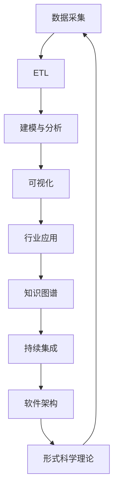

# Analysis 知识体系总览与导航

## 目录结构与本地跳转

- [1-数据库系统](./1-数据库系统/README.md)
- [2-形式科学理论](./2-形式科学理论/README.md)
- [3-数据模型与算法](./3-数据模型与算法/README.md)
- [4-软件架构与工程](./4-软件架构与工程/README.md)
- [5-行业应用与场景](./5-行业应用与场景/README.md)
- [6-知识图谱与可视化](./6-知识图谱与可视化/README.md)
- [7-持续集成与演进](./7-持续集成与演进/README.md)

---

## 全局知识体系与多表征

### 典型知识流与行业案例

- 数据科学全流程：数据采集 → ETL → 建模与分析 → 可视化 → 行业应用 → 自动化集成 → 持续演进
- 行业案例：金融、科学计算、AI、医疗、工业互联网等多领域全链路知识流
- 多表征：流程图、知识图谱、行业数据流、模型结构、自动化集成、合规审计、Latex公式等

---

- 各分支均已实现本地跳转、行业案例与多表征体系，便于全局导航与持续扩展。
- 推荐结合 [知识导航索引.md](./知识导航索引.md) 进行全局检索与主题串联。
