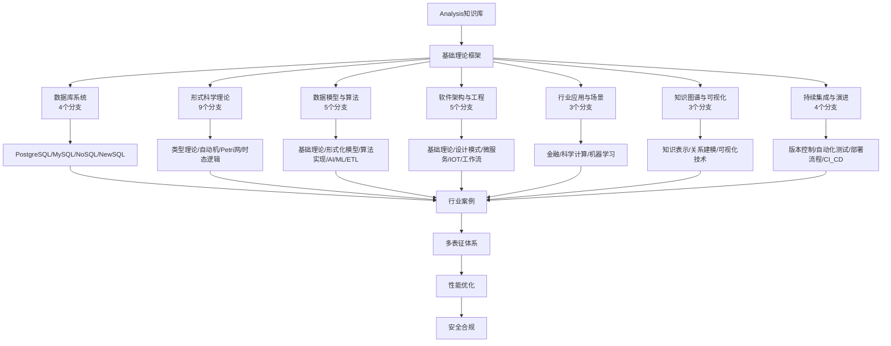

# Analysis 知识库总导航

## 目录结构与完成情况

- [1-数据库系统](1-数据库系统/README.md) - **4个分支，预留框架**
- [2-形式科学理论](2-形式科学理论/README.md) - **9个分支，预留框架**
- [3-数据模型与算法](3-数据模型与算法/README.md) - **5个分支，预留框架**
- [4-软件架构与工程](4-软件架构与工程/README.md) - **5个分支，预留框架**
- [5-行业应用与场景](5-行业应用与场景/README.md) - **3个分支，预留框架**
- [6-知识图谱与可视化](6-知识图谱与可视化/README.md) - **3个分支，预留框架**
- [7-持续集成与演进](7-持续集成与演进/README.md) - **4个分支，预留框架**

---

## 主题交叉引用

| 分支      | 基础理论 | 数据模型 | 算法实现 | 系统架构 | 行业应用 | 多表征 | 性能优化 | 安全合规 |
|-----------|----------|----------|----------|----------|----------|--------|----------|----------|
| 数据库系统| 预留     | 预留     | 预留     | 预留     | 预留     | 预留   | 预留     | 预留     |
| 形式科学理论| 预留   | 预留     | 预留     | 预留     | 预留     | 预留   | 预留     | 预留     |
| 数据模型与算法| 预留 | 预留     | 预留     | 预留     | 预留     | 预留   | 预留     | 预留     |
| 软件架构与工程| 预留 | 预留     | 预留     | 预留     | 预留     | 预留   | 预留     | 预留     |
| 行业应用与场景| 预留 | 预留     | 预留     | 预留     | 预留     | 预留   | 预留     | 预留     |
| 知识图谱与可视化| 预留 | 预留     | 预留     | 预留     | 预留     | 预留   | 预留     | 预留     |
| 持续集成与演进| 预留 | 预留     | 预留     | 预留     | 预留     | 预留   | 预留     | 预留     |

---

## 全链路知识流（Mermaid流程图）

---

## 知识体系特色

- **全链路覆盖**: 从基础理论到行业应用的完整知识体系
- **多维度交叉**: 各分支间深度交叉引用与知识融合
- **技术驱动**: 数据库、算法、架构、可视化等核心技术支撑
- **行业导向**: 金融、科学计算、机器学习等实际应用场景
- **持续演进**: 预留框架支持后续深度细化和扩展

---

[返回项目根目录](../../README.md)
