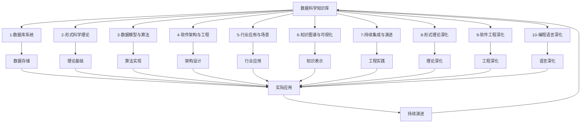

# Data-Science 知识库全链路导航

## 📁 目录结构

```text
Analysis/
├── 1-数据库系统/
│   ├── 1.1-PostgreSQL/
│   ├── 1.2-MySQL/
│   ├── 1.3-NoSQL/
│   ├── 1.4-NewSQL/
│   └── README.md
├── 2-形式科学理论/
│   ├── 2.1-类型理论/
│   ├── 2.2-自动机理论/
│   ├── 2.3-Petri网理论/
│   ├── 2.4-时态逻辑控制理论/
│   ├── 2.5-分布式系统理论/
│   ├── 2.6-控制理论/
│   ├── 2.7-数学基础理论/
│   ├── 2.8-编程语言理论/
│   ├── 2.9-哲学基础理论/
│   └── README.md
├── 3-数据模型与算法/
│   ├── 3.1-基础理论/
│   ├── 3.2-形式化模型/
│   ├── 3.3-算法实现/
│   ├── 3.4-AI与机器学习算法/
│   ├── 3.5-数据分析与ETL/
│   └── README.md
├── 4-软件架构与工程/
│   ├── 4.1-基础理论/
│   ├── 4.2-设计模式/
│   ├── 4.3-微服务架构/
│   ├── 4.4-IOT/
│   ├── 4.5-WorkflowDomain/
│   └── README.md
├── 5-行业应用与场景/
│   ├── 5.1-金融数据分析/
│   ├── 5.2-科学计算/
│   ├── 5.3-机器学习/
│   └── README.md
├── 6-知识图谱与可视化/
│   ├── 6.1-知识表示/
│   ├── 6.2-关系建模/
│   ├── 6.3-可视化技术/
│   └── README.md
├── 7-持续集成与演进/
│   ├── 7.1-版本控制/
│   ├── 7.2-自动化测试/
│   ├── 7.3-部署流程/
│   ├── 7.4-CI_CD/
│   ├── 质量保证体系.md
│   ├── 项目进度跟踪.md
│   └── README.md
├── 8-形式理论深化/
│   ├── 8.1-类型理论深化/
│   ├── 8.2-自动机理论深化/
│   ├── 8.3-Petri网理论深化/
│   ├── 8.4-时态逻辑控制理论深化/
│   ├── 8.5-分布式系统理论深化/
│   ├── 8.6-控制理论深化/
│   ├── 8.7-量子系统理论/
│   ├── 8.8-形式理论综合/
│   └── README.md
├── 9-软件工程深化/
│   ├── 9.1-设计模式深化/
│   ├── 9.2-微服务架构深化/
│   ├── 9.3-IOT系统深化/
│   ├── 9.4-工作流域深化/
│   ├── 9.5-组件架构深化/
│   ├── 9.6-系统架构深化/
│   └── README.md
├── 10-编程语言深化/
│   ├── 10.1-Rust语言深化/
│   ├── 10.2-编程范式深化/
│   ├── 10.3-语言比较深化/
│   └── README.md
├── README.md
├── 知识导航索引.md
├── 重构成果总结.md
├── 重构规划.md
├── 重构规划与规范化方案.md
└── 重构进度跟踪.md
```

## 🔗 主题交叉引用表

| 分支 | 关联理论 | 技术应用 | 实践场景 |
|------|---------|---------|---------|
| **1-数据库系统** | 数据模型、事务理论 | 数据存储、查询优化 | 企业应用、互联网平台 |
| **2-形式科学理论** | 数学基础、逻辑理论 | 形式化验证、定理证明 | 软件工程、系统设计 |
| **3-数据模型与算法** | 算法理论、统计学习 | 机器学习、数据分析 | 人工智能、科学研究 |
| **4-软件架构与工程** | 系统理论、设计模式 | 架构设计、工程实践 | 企业级应用、云原生 |
| **5-行业应用与场景** | 领域知识、业务理论 | 行业解决方案、定制开发 | 金融科技、医疗健康 |
| **6-知识图谱与可视化** | 语义理论、认知科学 | 知识表示、数据可视化 | 智能问答、决策支持 |
| **7-持续集成与演进** | DevOps理论、质量保证 | 自动化流程、持续交付 | 快速迭代、质量保证 |
| **8-形式理论深化** | 高级数学、前沿理论 | 形式化方法、验证技术 | 安全系统、关键应用 |
| **9-软件工程深化** | 工程理论、架构模式 | 高级架构、设计模式 | 大规模系统、复杂应用 |
| **10-编程语言深化** | 语言理论、类型系统 | 系统编程、语言设计 | 高性能应用、语言工具 |

## 🔄 全链路知识流图



## 🎯 知识体系特色

### 理论严谨性

- **数学基础**：基于严格的数学理论体系
- **形式化方法**：精确的形式化描述和证明
- **逻辑一致性**：确保理论间的逻辑相容性

### 技术创新性

- **前沿理论**：涵盖最新的理论发展
- **跨领域融合**：多理论领域的交叉应用
- **新兴技术**：量子计算等新兴技术理论

### 实践导向

- **工程应用**：理论在实际系统中的应用
- **问题解决**：针对复杂问题的理论支撑
- **验证方法**：形式化验证和证明技术

### 持续演进

- **理论发展**：跟随学术前沿持续更新
- **技术融合**：与新兴技术领域深度融合
- **应用拓展**：向更多应用场景扩展

## 📚 学习路径建议

### 🚀 入门路径

1. **数据库系统** → 理解数据存储基础
2. **形式科学理论** → 建立理论思维
3. **数据模型与算法** → 掌握核心算法
4. **软件架构与工程** → 学习工程实践

### 🔄 进阶路径

1. **行业应用与场景** → 了解实际应用
2. **知识图谱与可视化** → 学习知识表示
3. **持续集成与演进** → 掌握工程流程
4. **编程语言深化** → 深入语言技术

### 🎯 专家路径

1. **形式理论深化** → 掌握前沿理论
2. **软件工程深化** → 深入工程实践
3. **跨领域融合** → 多领域知识整合
4. **创新应用** → 开发新的应用场景

## 🚀 快速导航

### 基础分支

- [1-数据库系统](1-数据库系统/README.md)
- [2-形式科学理论](2-形式科学理论/README.md)
- [3-数据模型与算法](3-数据模型与算法/README.md)
- [4-软件架构与工程](4-软件架构与工程/README.md)

### 应用分支

- [5-行业应用与场景](5-行业应用与场景/README.md)
- [6-知识图谱与可视化](6-知识图谱与可视化/README.md)
- [7-持续集成与演进](7-持续集成与演进/README.md)

### 深化分支

- [8-形式理论深化](8-形式理论深化/README.md)
- [9-软件工程深化](9-软件工程深化/README.md)
- [10-编程语言深化](10-编程语言深化/README.md)

## 🛠️ 技术栈映射

### 数据库技术

- **关系数据库**：PostgreSQL、MySQL、Oracle
- **NoSQL数据库**：MongoDB、Redis、Cassandra
- **NewSQL数据库**：TiDB、CockroachDB、YugabyteDB
- **图数据库**：Neo4j、ArangoDB、Amazon Neptune

### 形式化工具

- **定理证明器**：Coq、Agda、Isabelle、Lean
- **模型检查器**：SPIN、NuSMV、TLA+、UPPAAL
- **类型检查器**：Haskell、Rust、Idris、F*
- **形式化语言**：Z、B、Event-B、Alloy

### 算法与AI

- **机器学习**：TensorFlow、PyTorch、Scikit-learn
- **深度学习**：神经网络、CNN、RNN、Transformer
- **自然语言处理**：BERT、GPT、Hugging Face
- **计算机视觉**：OpenCV、YOLO、ResNet

### 软件工程

- **架构模式**：微服务、事件驱动、CQRS
- **设计模式**：创建型、结构型、行为型模式
- **开发工具**：Git、Docker、Kubernetes
- **CI/CD**：Jenkins、GitLab CI、GitHub Actions

### 编程语言

- **系统编程**：Rust、C++、Go
- **函数式编程**：Haskell、OCaml、F#
- **Web开发**：JavaScript、TypeScript、Python
- **移动开发**：Swift、Kotlin、React Native

## 🎯 应用场景体系

### 企业级应用

- **ERP系统**：企业资源规划、业务流程管理
- **CRM系统**：客户关系管理、销售流程
- **OA系统**：办公自动化、工作流程
- **财务系统**：财务管理、会计核算

### 互联网平台

- **电商平台**：商品管理、订单处理、支付系统
- **社交网络**：用户关系、内容分发、推荐系统
- **内容平台**：媒体管理、内容创作、分发
- **游戏平台**：游戏服务、用户管理、支付

### 金融科技

- **核心银行系统**：账户管理、交易处理、风险控制
- **支付清算**：实时清算、跨境支付、数字货币
- **风控系统**：反欺诈、信用评估、合规监管
- **量化交易**：算法交易、高频交易、风险管理

### 医疗健康

- **医学影像**：CT、MRI图像分析、诊断辅助
- **药物发现**：分子设计、虚拟筛选、临床试验
- **健康管理**：疾病预测、个性化医疗、健康监测
- **医疗机器人**：手术辅助、康复训练、护理服务

### 智能制造

- **工业4.0**：智能工厂、预测性维护、质量控制
- **机器人技术**：路径规划、力控制、协作机器人
- **物联网**：设备监控、数据采集、边缘计算
- **数字孪生**：物理世界数字化、仿真建模

### 新兴技术

- **量子计算**：量子算法、量子通信、量子安全
- **区块链**：智能合约、去中心化应用、共识算法
- **边缘计算**：边缘节点、本地处理、低延迟
- **AI/ML平台**：机器学习模型部署、AI服务

---

-**📖 相关导航**

- [返回根目录](../../README.md)
- [Matter目录](../Matter/)
- [知识导航索引](知识导航索引.md)
- [重构成果总结](重构成果总结.md)
