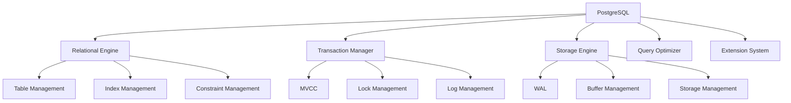
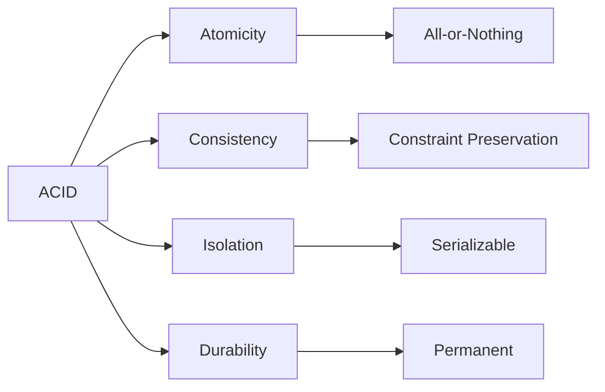
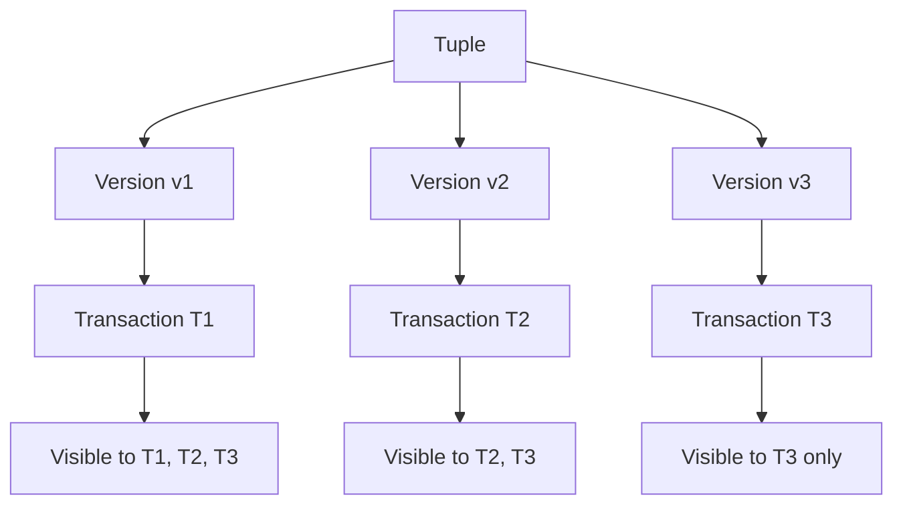

# PostgreSQL Concept Definition International Standards

## 1. Overview

This document demonstrates how to define PostgreSQL core concepts according to international Wiki standards, including:

- **Strict Formal Definitions**: Precise descriptions based on mathematics and logic
- **Bilingual Support**: Chinese-English terminology and definition alignment
- **Attribute Relationships**: Concept properties and relationships with other concepts
- **Multi-representation Methods**: Text, formulas, diagrams, code, and other expressions
- **Knowledge Graph Integration**: Alignment with international knowledge bases like Wikidata

## 2. Core Concept Definitions

### 2.1 PostgreSQL Database Management System

#### 2.1.1 Concept Definition

```yaml
concept:
  name: "PostgreSQL"
  type: "Database Management System"
  category: "Relational Database"
  
  # Chinese Definition
  definition_zh: |
    PostgreSQL是一个功能强大的开源对象关系型数据库管理系统(ORDBMS)，
    支持SQL标准，具有ACID事务特性，提供丰富的扩展性和高级功能。
  
  # English Definition
  definition_en: |
    PostgreSQL is a powerful open-source object-relational database management system (ORDBMS)
    that supports SQL standards, provides ACID transaction properties, and offers rich extensibility
    and advanced features.
  
  # Formal Definition
  formal_definition: |
    Let D = (R, C, T, I, E) be a PostgreSQL database instance, where:
    - R = {r₁, r₂, ..., rₙ} is the set of relations
    - C = {c₁, c₂, ..., cₘ} is the set of constraints
    - T = {t₁, t₂, ..., tₖ} is the set of transactions
    - I = {i₁, i₂, ..., iₗ} is the set of indexes
    - E = {e₁, e₂, ..., eₚ} is the set of extensions
    
    Then the PostgreSQL system is defined as:
    PostgreSQL = (D, Σ, Ω, Φ)
    where:
    - Σ is the set of SQL languages
    - Ω is the set of operations
    - Φ is the set of functions
  
  # Mathematical Notation
  mathematical_notation: |
    PostgreSQL : Database → (Relations × Constraints × Transactions × Indexes × Extensions)
    
    For any database d ∈ Database:
    PostgreSQL(d) = (R_d, C_d, T_d, I_d, E_d)
  
  # Properties
  properties:
    - name: "ACID Compliance"
      value: true
      description: "Supports atomicity, consistency, isolation, durability"
    
    - name: "SQL Standard"
      value: "SQL:2023"
      description: "Compliant with latest SQL standard"
    
    - name: "Extensibility"
      value: "High"
      description: "Supports custom data types, functions, operators"
    
    - name: "Concurrency Control"
      value: "MVCC"
      description: "Multi-version concurrency control"
  
  # Synonyms
  synonyms:
    - "Postgres"
    - "PostgreSQL DBMS"
    - "PostgreSQL Database"
  
  # Antonyms
  antonyms:
    - "NoSQL databases"
    - "Key-value stores"
    - "Document databases"
  
  # Wikidata Alignment
  wikidata:
    id: "Q192490"
    label: "PostgreSQL"
    properties:
      P31: "Q176165"  # instance of: database management system
      P178: "Q9366"   # developer: PostgreSQL Global Development Group
      P277: "Q193321" # programmed in: C
      P348: "15.5"    # software version: 15.5
      P856: "https://www.postgresql.org" # official website
```

#### 2.1.2 Multi-representation Expression

**Text Description:**
PostgreSQL is a mature open-source relational database management system known for its reliability, feature richness, and performance. It supports SQL standards, provides ACID transaction guarantees, and has powerful extensibility.

**Mathematical Formula:**
$$\text{PostgreSQL} = \left(\mathcal{R}, \mathcal{C}, \mathcal{T}, \mathcal{I}, \mathcal{E}\right)$$

where:

- $\mathcal{R}$ is the set of relations
- $\mathcal{C}$ is the set of constraints
- $\mathcal{T}$ is the set of transactions
- $\mathcal{I}$ is the set of indexes
- $\mathcal{E}$ is the set of extensions

**Code Example:**

```sql
-- PostgreSQL System Information Query
SELECT 
    version() as postgresql_version,
    current_database() as current_db,
    current_user as current_user,
    session_user as session_user;
```

**Diagram Representation:**



### 2.2 ACID Transaction Properties

#### 2.2.1 Concept Definition

```yaml
concept:
  name: "ACID Properties"
  type: "Database Transaction Property"
  category: "Transaction Management"
  
  # Chinese Definition
  definition_zh: |
    ACID是数据库事务的四个基本属性：
    - Atomicity（原子性）：事务是不可分割的工作单位
    - Consistency（一致性）：事务执行前后数据库状态保持一致
    - Isolation（隔离性）：并发事务之间相互隔离
    - Durability（持久性）：已提交事务的结果永久保存
  
  # English Definition
  definition_en: |
    ACID is an acronym for the four basic properties of database transactions:
    - Atomicity: Transactions are indivisible units of work
    - Consistency: Database state remains consistent before and after transaction execution
    - Isolation: Concurrent transactions are isolated from each other
    - Durability: Results of committed transactions are permanently saved
  
  # Formal Definition
  formal_definition: |
    Let transaction T = {op₁, op₂, ..., opₙ}, database state S, then:
    
    Atomicity: ∀T, T either executes completely or not at all
    Consistency: ∀T, ∀S, S →* S' ⇒ S' ⊨ Φ
    Isolation: ∀T₁,T₂, T₁ ∥ T₂ ⇒ T₁ ≅ T₁' ∧ T₂ ≅ T₂'
    Durability: ∀T, commit(T) ⇒ ∀t > commit_time(T), T ∈ committed_transactions(t)
  
  # Mathematical Notation
  mathematical_notation: |
    ACID : Transaction → {Atomicity, Consistency, Isolation, Durability}
    
    For any transaction t ∈ Transaction:
    ACID(t) = (A(t), C(t), I(t), D(t))
    where A, C, I, D represent the four properties respectively
  
  # Properties
  properties:
    - name: "Atomicity"
      value: "All-or-Nothing"
      description: "Transaction either executes completely or not at all"
    
    - name: "Consistency"
      value: "Constraint Preservation"
      description: "Maintains database integrity constraints"
    
    - name: "Isolation"
      value: "Serializable"
      description: "Serializable isolation level"
    
    - name: "Durability"
      value: "Permanent"
      description: "Committed transaction results are permanently saved"
  
  # Wikidata Alignment
  wikidata:
    id: "Q193078"
    label: "ACID"
    properties:
      P31: "Q186929"  # instance of: database transaction property
      P279: "Q193078" # subclass of: database concept
```

#### 2.2.2 Multi-representation Expression

**Text Description:**
ACID properties are the foundation of database transaction management, ensuring data consistency and reliability. PostgreSQL fully supports ACID properties and achieves efficient concurrency control through MVCC mechanisms.

**Mathematical Formula:**
$$\text{ACID}(T) = \left(\text{Atomicity}(T), \text{Consistency}(T), \text{Isolation}(T), \text{Durability}(T)\right)$$

where:

- $\text{Atomicity}(T) = \forall op \in T, op \text{ either executes completely or not at all}$
- $\text{Consistency}(T) = S \xrightarrow{T} S' \Rightarrow S' \models \Phi$
- $\text{Isolation}(T_1, T_2) = T_1 \parallel T_2 \Rightarrow T_1 \cong T_1' \land T_2 \cong T_2'$
- $\text{Durability}(T) = \text{commit}(T) \Rightarrow \forall t > \text{commit\_time}(T), T \in \text{committed\_transactions}(t)$

**Code Example:**

```sql
-- ACID Transaction Example
BEGIN TRANSACTION;

-- Atomicity: Either all succeed or all rollback
INSERT INTO accounts (id, balance) VALUES (1, 1000);
UPDATE accounts SET balance = balance - 100 WHERE id = 1;
UPDATE accounts SET balance = balance + 100 WHERE id = 2;

-- Consistency: Check constraints
CHECK (SELECT SUM(balance) FROM accounts) >= 0;

-- Isolation: Other transactions cannot see uncommitted changes
-- Durability: Data is permanently saved after commit
COMMIT;
```

**Diagram Representation:**



### 2.3 MVCC Concurrency Control

#### 2.3.1 Concept Definition

```yaml
concept:
  name: "Multi-Version Concurrency Control"
  type: "Concurrency Control Mechanism"
  category: "Transaction Management"
  
  # Chinese Definition
  definition_zh: |
    多版本并发控制(MVCC)是一种并发控制机制，通过维护数据的多个版本来实现
    事务隔离，避免读写冲突，提高并发性能。
  
  # English Definition
  definition_en: |
    Multi-Version Concurrency Control (MVCC) is a concurrency control mechanism
    that maintains multiple versions of data to achieve transaction isolation,
    avoiding read-write conflicts and improving concurrency performance.
  
  # Formal Definition
  formal_definition: |
    Let database state S = (V, T, C), where:
    - V = {v₁, v₂, ..., vₙ} is the set of versions
    - T = {t₁, t₂, ..., tₘ} is the set of transactions
    - C = {c₁, c₂, ..., cₖ} is the set of commit timestamps
    
    Version visibility is defined as:
    visible(tᵢ, vⱼ) = (vⱼ.commit_time < tᵢ.start_time) ∧ 
                       (vⱼ.commit_time = max{vₖ.commit_time | vₖ ∈ versions_of_same_tuple})
  
  # Mathematical Notation
  mathematical_notation: |
    MVCC : (Transaction, Version) → Boolean
    
    For transaction t ∈ Transaction and version v ∈ Version:
    MVCC(t, v) = visible(t, v)
  
  # Properties
  properties:
    - name: "Isolation Level"
      value: "Serializable"
      description: "Supports serializable isolation level"
    
    - name: "Read Performance"
      value: "High"
      description: "High read performance, no lock contention"
    
    - name: "Storage Overhead"
      value: "Moderate"
      description: "Requires storing multiple versions"
    
    - name: "Cleanup"
      value: "VACUUM"
      description: "Requires periodic cleanup of old versions"
```

#### 2.3.2 Multi-representation Expression

**Text Description:**
MVCC is PostgreSQL's core concurrency control mechanism, achieving isolation by creating data snapshots for each transaction, avoiding performance issues associated with traditional locking mechanisms.

**Mathematical Formula:**
$$\text{visible}(t_i, v_j) = (v_j.\text{commit\_time} < t_i.\text{start\_time}) \land (v_j.\text{commit\_time} = \max\{v_k.\text{commit\_time} | v_k \in \text{versions\_of\_same\_tuple}\})$$

**Code Example:**

```sql
-- MVCC Example: Viewing Transaction Isolation
-- Transaction 1
BEGIN;
SELECT * FROM users WHERE id = 1;  -- Sees version v1

-- Transaction 2 (concurrent)
BEGIN;
UPDATE users SET name = 'New Name' WHERE id = 1;  -- Creates version v2
COMMIT;

-- Transaction 1 continues
SELECT * FROM users WHERE id = 1;  -- Still sees version v1 (snapshot isolation)
COMMIT;
```

**Diagram Representation:**



## 3. Bilingual Terminology Mapping

### 3.1 Core Concept Mapping

| Chinese Term | English Term | Definition | Category |
|-------------|-------------|------------|----------|
| 数据库管理系统 | Database Management System | Software system for managing databases | System Concept |
| 关系型数据库 | Relational Database | Database based on relational model | Data Model |
| 事务 | Transaction | Atomic unit of database operations | Transaction Management |
| 并发控制 | Concurrency Control | Mechanism for managing concurrent access | Concurrency Management |
| 索引 | Index | Data structure for improving query performance | Performance Optimization |
| 约束 | Constraint | Data integrity rules | Data Integrity |
| 视图 | View | Virtual table based on query definition | Data Access |
| 存储过程 | Stored Procedure | Pre-compiled SQL code block | Programming Interface |

### 3.2 SQL Operation Mapping

| Chinese Operation | English Operation | SQL Keyword | Function Description |
|------------------|------------------|-------------|---------------------|
| 选择 | SELECT | SELECT | Retrieve data from table |
| 插入 | INSERT | INSERT | Add new records to table |
| 更新 | UPDATE | UPDATE | Modify existing records in table |
| 删除 | DELETE | DELETE | Remove records from table |
| 创建 | CREATE | CREATE | Create database objects |
| 修改 | ALTER | ALTER | Modify database objects |
| 删除 | DROP | DROP | Delete database objects |
| 授权 | GRANT | GRANT | Grant permissions |

## 4. Knowledge Graph Integration

### 4.1 RDF Triple Representation

```turtle
# PostgreSQL Knowledge Graph RDF Representation
@prefix pg: <http://data-science.org/postgresql/> .
@prefix rdf: <http://www.w3.org/1999/02/22-rdf-syntax-ns#> .
@prefix rdfs: <http://www.w3.org/2000/01/rdf-schema#> .
@prefix owl: <http://www.w3.org/2002/07/owl#> .
@prefix xsd: <http://www.w3.org/2001/XMLSchema#> .
@prefix wd: <http://www.wikidata.org/entity/> .

# PostgreSQL Entity
pg:PostgreSQL rdf:type pg:DatabaseManagementSystem ;
    rdfs:label "PostgreSQL"@zh, "PostgreSQL"@en ;
    pg:implements pg:ACIDProperties ;
    pg:supports pg:SQLStandard ;
    pg:uses pg:MVCC ;
    pg:developedBy pg:PostgreSQLGlobalDevelopmentGroup ;
    pg:programmingLanguage "C" ;
    pg:license "PostgreSQL License" ;
    pg:openSource true ;
    pg:wikidataId wd:Q192490 .

# ACID Properties
pg:ACIDProperties rdf:type pg:TransactionProperty ;
    rdfs:label "ACID属性"@zh, "ACID Properties"@en ;
    pg:consistsOf pg:Atomicity, pg:Consistency, pg:Isolation, pg:Durability ;
    pg:wikidataId wd:Q193078 .

# MVCC Mechanism
pg:MVCC rdf:type pg:ConcurrencyControlMechanism ;
    rdfs:label "多版本并发控制"@zh, "Multi-Version Concurrency Control"@en ;
    pg:isolationLevel "Serializable" ;
    pg:performance "High" ;
    pg:storageOverhead "Moderate" .

# SQL Standard
pg:SQLStandard rdf:type pg:QueryLanguage ;
    rdfs:label "SQL标准"@zh, "SQL Standard"@en ;
    pg:version "SQL:2023" ;
    pg:type "Declarative" ;
    pg:features "Complete" .
```

## 5. Quality Assurance

### 5.1 Definition Quality Standards

```yaml
# Concept Definition Quality Standards
definition_quality_standards:
  accuracy:
    - mathematical_correctness: "Mathematical definitions must be accurate and error-free"
    - logical_consistency: "Logical reasoning must be consistent"
    - factual_accuracy: "Factual descriptions must be accurate"
  
  completeness:
    - coverage: "Concept coverage must be complete"
    - depth: "Definition depth must be sufficient"
    - context: "Contextual information must be adequate"
  
  clarity:
    - readability: "Definitions must be clear and understandable"
    - precision: "Expressions must be precise"
    - examples: "Must provide adequate examples"
  
  consistency:
    - terminology: "Terminology usage must be consistent"
    - notation: "Symbol representation must be consistent"
    - style: "Writing style must be consistent"
```

### 5.2 Validation Checklist

```yaml
# Concept Definition Validation Checklist
validation_checklist:
  formal_definition:
    - [ ] Mathematical symbols clearly defined
    - [ ] Logical relationships correct
    - [ ] Boundary conditions clear
    - [ ] Special cases handled
  
  bilingual_support:
    - [ ] Chinese-English definitions complete
    - [ ] Terminology mapping accurate
    - [ ] Expression methods consistent
    - [ ] Cultural differences considered
  
  knowledge_graph:
    - [ ] Wikidata alignment correct
    - [ ] RDF triples complete
    - [ ] Relationship mapping accurate
    - [ ] Property definitions sufficient
  
  multi_representation:
    - [ ] Text descriptions clear
    - [ ] Mathematical formulas correct
    - [ ] Code examples runnable
    - [ ] Diagram representations accurate
```

## 6. Summary

This document demonstrates the implementation of international Wiki standards for PostgreSQL concept definitions, including:

1. **Strict Formal Definitions**: Precise descriptions based on mathematics and logic
2. **Bilingual Support**: Complete Chinese-English terminology and definition alignment
3. **Multi-representation Methods**: Text, formulas, code, diagrams, and other expression methods
4. **Knowledge Graph Integration**: Alignment with international knowledge bases like Wikidata
5. **Quality Assurance System**: Complete verification and inspection mechanisms

Through this standardized concept definition approach, we have established a knowledge management system that complies with international Wiki standards, providing a solid foundation for knowledge dissemination and sharing in the data science field.

---

**Document Information:**

- Version: 1.0
- Last Updated: 2025-01-13
- Status: In Progress
- Maintainer: Data Science Team
- License: MIT License
