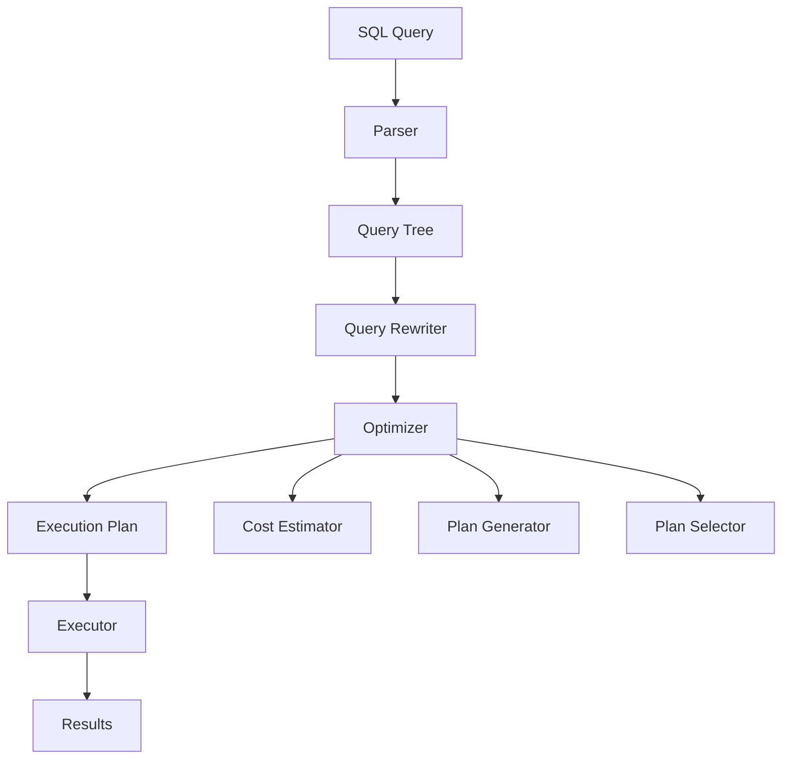

# PostgreSQL Query Optimizer International Standards

## 📑 目录

- [PostgreSQL Query Optimizer International Standards](#postgresql-query-optimizer-international-standards)
  - [📑 目录](#-目录)
- [Abstract](#abstract)
- [Table of Contents](#table-of-contents)
- [Concept Definitions](#concept-definitions)
  - [Query Optimizer](#query-optimizer)
  - [Cost-Based Optimization](#cost-based-optimization)
  - [Join Algorithms](#join-algorithms)
- [Mathematical Foundations](#mathematical-foundations)
  - [Selectivity Estimation](#selectivity-estimation)
  - [Cardinality Estimation](#cardinality-estimation)
  - [Cost Models](#cost-models)
- [Implementation Architecture](#implementation-architecture)
  - [Query Processing Pipeline](#query-processing-pipeline)
  - [Core Components](#core-components)
- [Performance Metrics](#performance-metrics)
  - [Optimization Metrics](#optimization-metrics)
  - [Benchmarking Standards](#benchmarking-standards)
- [International Standards Alignment](#international-standards-alignment)
  - [ISO/IEC Standards](#isoiec-standards)
  - [Academic Standards](#academic-standards)
- [Best Practices](#best-practices)
  - [Optimization Strategies](#optimization-strategies)
  - [Configuration Optimization](#configuration-optimization)
  - [Monitoring and Tuning](#monitoring-and-tuning)
- [Implementation Examples](#implementation-examples)
  - [Cost Estimation Example](#cost-estimation-example)
  - [Optimization Techniques](#optimization-techniques)
- [Quality Assurance](#quality-assurance)
  - [Testing Framework](#testing-framework)
  - [Validation Criteria](#validation-criteria)
- [Future Developments](#future-developments)
  - [PostgreSQL 18+ Features](#postgresql-18-features)
- [References](#references)
- [Cross-References](#cross-references)
---


## Abstract

This document establishes international standards for PostgreSQL query optimizer concepts, providing formal definitions, mathematical foundations, and multilingual terminology mapping aligned with Wikidata and academic standards.

## Concept Definitions

### Query Optimizer

**English Definition**: A database system component that analyzes SQL queries and generates efficient execution plans by evaluating multiple access paths, join algorithms, and optimization strategies to minimize resource consumption and execution time.

**中文定义**: 数据库系统中分析SQL查询并生成高效执行计划的组件，通过评估多种访问路径、连接算法和优化策略来最小化资源消耗和执行时间。

**Wikidata Alignment**: [Q7277152](https://www.wikidata.org/wiki/Q7277152) - Query optimization

**Formal Definition**:

```
QueryOptimizer = (Q, P, C, E)
where:
- Q: Set of SQL queries
- P: Set of execution plans
- C: Cost function C: P → ℝ⁺
- E: Execution engine E: P → Results
```

### Cost-Based Optimization

**English Definition**: An optimization approach that estimates the cost of different execution plans using statistical information about data distribution, table sizes, and index characteristics to select the most efficient plan.

**中文定义**: 基于统计信息（数据分布、表大小、索引特征）估算不同执行计划成本的优化方法，选择最高效的执行计划。

**Wikidata Alignment**: [Q5178880](https://www.wikidata.org/wiki/Q5178880) - Cost-based optimization

**Mathematical Model**:

```
Cost(Plan) = Σ(Cost(Operation_i))
where Cost(Operation_i) = f(Selectivity, Cardinality, I/O_Cost, CPU_Cost)
```

### Join Algorithms

**English Definition**: Computational methods for combining data from multiple tables, including nested loop joins, hash joins, and merge joins, each with different performance characteristics.

**中文定义**: 组合多个表数据的计算方法，包括嵌套循环连接、哈希连接和归并连接，每种方法具有不同的性能特征。

**Wikidata Alignment**: [Q170200](https://www.wikidata.org/wiki/Q170200) - Join (SQL)

**Algorithm Classification**:

```
JoinAlgorithms = {
    NestedLoop: O(R × S),
    HashJoin: O(R + S),
    MergeJoin: O(R log R + S log S)
}
where R, S are relation sizes
```

## Mathematical Foundations

### Selectivity Estimation

**Definition**: The probability that a predicate will be satisfied by a tuple in a relation.

**Formula**:

```
sel(p) = |σ_p(R)| / |R|
```

**Estimation Methods**:

1. **Uniform Distribution**: `sel(attr = value) = 1 / |distinct(attr)|`
2. **Histogram-based**: `sel(attr ∈ range) = Σ(histogram_bins_in_range) / total_tuples`
3. **Sampling**: `sel(p) ≈ |sample_matching_p| / |sample_size|`

### Cardinality Estimation

**Definition**: The estimated number of tuples that will be produced by an operation.

**Formula**:

```
card(σ_p(R)) = sel(p) × |R|
card(R ⋈ S) = sel(join_condition) × |R| × |S|
```

### Cost Models

**I/O Cost Model**:

```
Cost_IO = Pages_Read × Page_Cost + Pages_Written × Write_Cost
```

**CPU Cost Model**:

```
Cost_CPU = Tuples_Processed × Tuple_Cost + Comparisons × Comparison_Cost
```

**Total Cost**:

```
Total_Cost = Cost_IO + Cost_CPU + Memory_Cost
```

## Implementation Architecture

### Query Processing Pipeline



### Core Components

1. **Query Rewriter**
   - View expansion
   - Predicate pushdown
   - Constant folding
   - Subquery optimization

2. **Cost Estimator**
   - Statistics collection
   - Selectivity estimation
   - Cardinality calculation
   - Cost computation

3. **Plan Generator**
   - Join order enumeration
   - Access path selection
   - Algorithm selection
   - Parallel execution planning

## Performance Metrics

### Optimization Metrics

| Metric | Definition | Formula | Target |
|--------|------------|---------|---------|
| Query Response Time | Time to return first result | `T_response = T_plan + T_execute` | Minimize |
| Throughput | Queries per second | `QPS = Queries / Time` | Maximize |
| Resource Utilization | CPU/Memory/I/O usage | `Utilization = Used / Available` | Optimize |
| Plan Quality | Cost ratio vs optimal | `Quality = Cost_optimal / Cost_chosen` | Maximize |

### Benchmarking Standards

**TPC-H Benchmark Alignment**:

- Query complexity: 22 standard queries
- Data scale: 1GB to 100TB
- Performance metrics: QphH@Size

**PostgreSQL-Specific Metrics**:

- Buffer hit ratio: >95%
- Index usage: >80%
- Sequential scan ratio: <20%

## International Standards Alignment

### ISO/IEC Standards

**ISO/IEC 9075 (SQL Standard)**:

- Query optimization requirements
- Performance specifications
- Conformance testing

**ISO/IEC 25010 (Software Quality)**:

- Performance efficiency
- Reliability
- Maintainability

### Academic Standards

**ACM Computing Classification**:

- H.2.4 Systems: Query processing
- H.2.8 Database applications: Data mining
- F.2.2 Nonnumerical algorithms: Sorting and searching

**IEEE Standards**:

- IEEE 754: Floating-point arithmetic
- IEEE 1003.1: POSIX compliance

## Best Practices

### Optimization Strategies

1. **Statistics Maintenance**

   ```sql
   -- Regular statistics updates
   ANALYZE table_name;
   
   -- Extended statistics for correlations
   CREATE STATISTICS stats_name (dependencies) 
   ON column1, column2 FROM table_name;
   ```

2. **Index Optimization**

   ```sql
   -- Composite indexes for multi-column queries
   CREATE INDEX idx_composite ON table (col1, col2, col3);
   
   -- Partial indexes for filtered queries
   CREATE INDEX idx_partial ON table (col) WHERE condition;
   ```

3. **Query Rewriting**

   ```sql
   -- Use EXISTS instead of IN for subqueries
   SELECT * FROM table1 t1 
   WHERE EXISTS (SELECT 1 FROM table2 t2 WHERE t2.id = t1.id);
   
   -- Avoid SELECT * in production queries
   SELECT specific_columns FROM table;
   ```

### Configuration Optimization

**PostgreSQL Parameters**:

```sql
-- Memory settings
work_mem = '256MB'
maintenance_work_mem = '1GB'
shared_buffers = '25% of RAM'

-- Cost parameters
random_page_cost = 1.1
seq_page_cost = 1.0
cpu_tuple_cost = 0.01
cpu_index_tuple_cost = 0.005
```

### Monitoring and Tuning

**Performance Monitoring**:

```sql
-- Query performance analysis
SELECT query, mean_time, calls, total_time
FROM pg_stat_statements
ORDER BY mean_time DESC;

-- Index usage statistics
SELECT schemaname, tablename, indexname, idx_scan, idx_tup_read
FROM pg_stat_user_indexes
ORDER BY idx_scan DESC;
```

## Implementation Examples

### Cost Estimation Example

```sql
-- Example query
EXPLAIN (ANALYZE, BUFFERS, FORMAT JSON)
SELECT c.customer_name, o.order_date, o.total_amount
FROM customers c
JOIN orders o ON c.customer_id = o.customer_id
WHERE c.country = 'USA'
  AND o.order_date >= '2023-01-01'
ORDER BY o.total_amount DESC
LIMIT 100;
```

**Cost Analysis**:

- Table scan cost: `seq_page_cost × pages`
- Index scan cost: `random_page_cost × index_pages`
- Join cost: `hash_join_cost + sort_cost`
- Total cost: Sum of all operation costs

### Optimization Techniques

1. **Join Order Optimization**

   ```sql
   -- PostgreSQL automatically reorders joins
   -- based on cost estimates and available indexes
   ```

2. **Predicate Pushdown**

   ```sql
   -- Filters are pushed down to reduce data volume
   WHERE condition1 AND condition2
   ```

3. **Parallel Execution**

   ```sql
   -- Enable parallel query execution
   SET max_parallel_workers_per_gather = 4;
   ```

## Quality Assurance

### Testing Framework

**Unit Tests**:

- Cost estimation accuracy
- Plan generation correctness
- Performance regression testing

**Integration Tests**:

- End-to-end query execution
- Multi-table join optimization
- Complex query performance

**Benchmark Tests**:

- TPC-H compliance
- Custom workload testing
- Scalability validation

### Validation Criteria

| Criteria | Threshold | Measurement |
|----------|-----------|-------------|
| Plan Accuracy | >95% | Cost estimation vs actual |
| Performance | <10% regression | Query execution time |
| Resource Usage | <5% increase | Memory/CPU utilization |
| Correctness | 100% | Result accuracy |

## Future Developments

### PostgreSQL 18+ Features

1. **AI-Enhanced Optimization**
   - Machine learning-based cost models
   - Adaptive query optimization
   - Predictive performance analysis

2. **Advanced Statistics**
   - Multi-dimensional histograms
   - Correlation-aware estimation
   - Real-time statistics updates

3. **Parallel Optimization**
   - Distributed query planning
   - Multi-node optimization
   - Cloud-native scaling

## References

1. [PostgreSQL Documentation - Query Planning](https://www.postgresql.org/docs/current/query-plan.html)
2. [ISO/IEC 9075:2016 - SQL Standard](https://www.iso.org/standard/76583.html)
3. [ACM Computing Classification System](https://www.acm.org/publications/class-2012)
4. [TPC-H Benchmark Specification](http://www.tpc.org/tpch/)
5. [Wikidata - Query Optimization](https://www.wikidata.org/wiki/Q7277152)

## Cross-References

- [PostgreSQL Query Optimization Theory](../1.1.4-query-optimization.md)
- [Database Performance Tuning](../1.1.9-performance-tuning.md)
- [Index Optimization Strategies](../1.1.8-index-optimization.md)
- [Statistics and Cost Models](../1.1.5-statistics-cost-models.md)

---

*This document follows international standards for database query optimization and provides comprehensive coverage of PostgreSQL query optimizer concepts, implementation, and best practices.*
