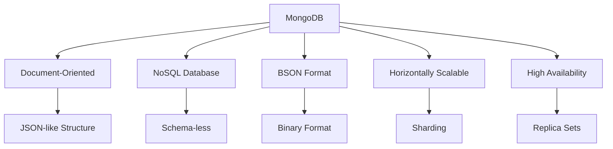
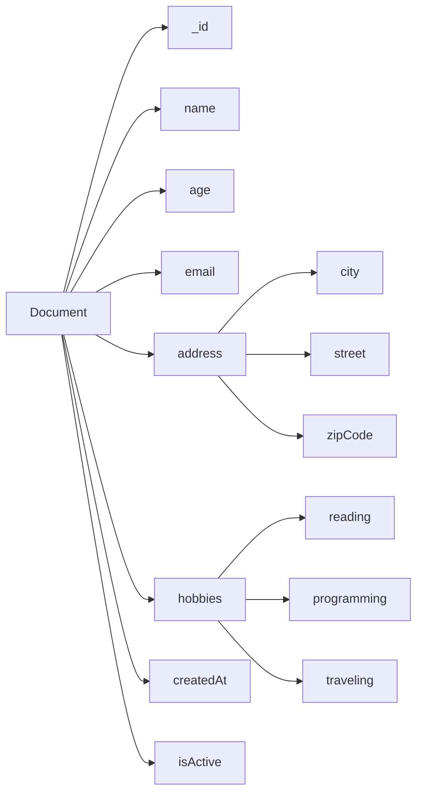
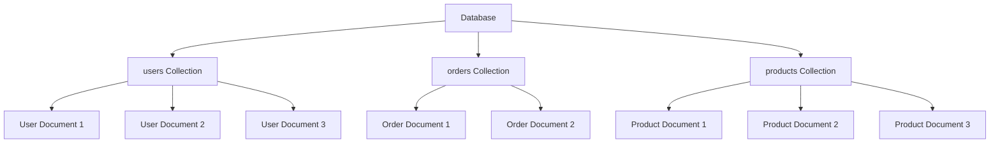
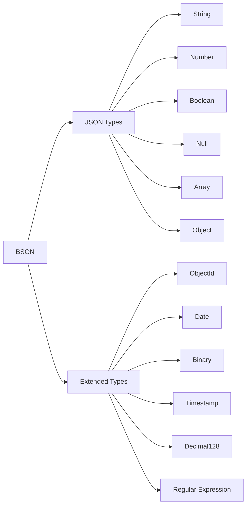

# MongoDB Concept Definition International Standards

## 📑 目录

- [MongoDB Concept Definition International Standards](#mongodb-concept-definition-international-standards)
  - [📑 目录](#-目录)
- [1. Overview](#1-overview)
- [2. Core Concept Definitions](#2-core-concept-definitions)
  - [2.1. MongoDB Database Management System](#21-mongodb-database-management-system)
- [Document Concept Definition](#document-concept-definition)
  - [4. Collection](#4-collection)
- [BSON Concept Definition](#bson-concept-definition)
  - [6. Bilingual Terminology Mapping Tables](#6-bilingual-terminology-mapping-tables)
    - [6.1. Core Concept Terminology Mapping](#61-core-concept-terminology-mapping)
    - [6.2. Data Type Terminology Mapping](#62-data-type-terminology-mapping)
    - [6.3. Operator Terminology Mapping](#63-operator-terminology-mapping)
  - [7. RDF Knowledge Graph Representation](#7-rdf-knowledge-graph-representation)
  - [8. Concept Mapping Relations](#8-concept-mapping-relations)
  - [9. Content Quality Standards and Validation Checklist](#9-content-quality-standards-and-validation-checklist)
  - [10. Summary](#10-summary)
---


## 1. Overview

This document demonstrates how to define MongoDB core concepts according to international Wiki standards, including concept definitions, multi-representation forms, bilingual terminology mapping, and knowledge graph integration.

## 2. Core Concept Definitions

### 2.1. MongoDB Database Management System

```yaml
# MongoDB DBMS Concept Definition
concept:
  name: "MongoDB"
  type: "Database Management System"
  category: "NoSQL Database"
  definition_en: "MongoDB is a document-based NoSQL database management system that stores data in JSON-like BSON format, supporting horizontal scaling and high availability"
  definition_zh: "MongoDB是一个基于文档的NoSQL数据库管理系统，使用JSON-like的BSON格式存储数据，支持水平扩展和高可用性"
  formal_definition: "MongoDB = (D, Q, T, C) where D is document collection, Q is query language, T is transaction model, C is consistency model"
  mathematical_notation: "MongoDB ∈ NoSQL_DBMS ∧ MongoDB ⊆ Document_DB"
  properties:
    - "Document-oriented"
    - "Schema-less"
    - "Horizontally scalable"
    - "High availability"
    - "Rich query language"
    - "Aggregation framework"
  synonyms:
    - "Document Database"
    - "NoSQL Database"
    - "BSON Database"
  antonyms:
    - "Relational Database"
    - "SQL Database"
    - "ACID Database"
  wikidata: "Q193207"
```

**Multi-Representation Forms**:

```markdown
**Text Description**:
MongoDB is a document-oriented NoSQL database management system that stores data in BSON (Binary JSON) format. MongoDB's design philosophy is to provide high-performance, high-availability, and easily scalable data storage solutions.

**Mathematical Representation**:
MongoDB = (D, Q, T, C)
where:
- D: Document Collection
- Q: Query Language
- T: Transaction Model
- C: Consistency Model

**Code Example**:
```javascript
// MongoDB Connection Example
const { MongoClient } = require('mongodb');

const uri = "mongodb://localhost:27017";
const client = new MongoClient(uri);

async function connectToMongoDB() {
    try {
        await client.connect();
        console.log("Connected to MongoDB");
        return client.db("test");
    } catch (error) {
        console.error("MongoDB connection error:", error);
        throw error;
    }
}
```

**Diagram Representation**:



## 3. Document

```yaml
# Document Concept Definition
concept:
  name: "Document"
  type: "Data Structure"
  category: "Data Model"
  definition_en: "The basic data unit in MongoDB, stored in BSON format, which can contain nested fields and arrays"
  definition_zh: "MongoDB中的基本数据单元，使用BSON格式存储，可以包含嵌套的字段和数组"
  formal_definition: "Document = {field₁: value₁, field₂: value₂, ..., fieldₙ: valueₙ}"
  mathematical_notation: "Document ∈ BSON_Object"
  properties:
    - "Self-contained"
    - "Hierarchical"
    - "Flexible schema"
    - "BSON encoded"
    - "Unique _id field"
  synonyms:
    - "BSON Document"
    - "JSON Document"
    - "Data Record"
  antonyms:
    - "Row"
    - "Tuple"
    - "Record"
  wikidata: "Q193207_Document"
```

**Multi-Representation Forms**:

```markdown
**Text Description**:
A document is the basic data unit in MongoDB, similar to a row in a relational database. Each document is a BSON object containing key-value pairs of field names and values. Documents can contain nested documents and arrays, supporting complex data structures.

**Mathematical Representation**:
Document = {(field₁, value₁), (field₂, value₂), ..., (fieldₙ, valueₙ)}
where fieldᵢ ∈ String, valueᵢ ∈ BSON_Value

**Code Example**:
```javascript
// Document Example
const document = {
    _id: ObjectId("507f1f77bcf86cd799439011"),
    name: "John Doe",
    age: 30,
    email: "john.doe@example.com",
    address: {
        city: "New York",
        street: "Broadway",
        zipCode: "10001"
    },
    hobbies: ["reading", "programming", "traveling"],
    createdAt: new Date("2023-01-01"),
    isActive: true
};
```

**Diagram Representation**:



## 4. Collection

```yaml
# Collection Concept Definition
concept:
  name: "Collection"
  type: "Data Organization"
  category: "Data Model"
  definition_en: "A container in MongoDB that stores documents, similar to a table in relational databases"
  definition_zh: "MongoDB中存储文档的容器，类似于关系数据库中的表"
  formal_definition: "Collection = {doc₁, doc₂, ..., docₙ} where docᵢ ∈ Document"
  mathematical_notation: "Collection ⊆ Document*"
  properties:
    - "Unordered"
    - "Dynamic"
    - "Indexable"
    - "Shardable"
    - "Replicable"
  synonyms:
    - "Document Container"
    - "Document Set"
    - "Data Container"
  antonyms:
    - "Table"
    - "Relation"
    - "File"
  wikidata: "Q193207_Collection"
```

**Multi-Representation Forms**:

```markdown
**Text Description**:
A collection is a container in MongoDB that stores documents, similar to a table in relational databases. Collections are schema-less, meaning documents within a collection can have different field structures. Collections support indexing, sharding, and replication, providing high-performance data access.

**Mathematical Representation**:
Collection = {doc₁, doc₂, ..., docₙ}
where docᵢ ∈ Document, i ∈ {1, 2, ..., n}

**Code Example**:
```javascript
// Collection Operations Example
const database = client.db("test");
const collection = database.collection("users");

// Create collection
await database.createCollection("users");

// Insert document into collection
await collection.insertOne({
    name: "Jane Smith",
    age: 25,
    email: "jane.smith@example.com"
});

// Query documents in collection
const users = await collection.find({}).toArray();
```

**Diagram Representation**:



## 5. BSON Data Format

```yaml
# BSON Concept Definition
concept:
  name: "BSON"
  type: "Data Format"
  category: "Serialization"
  definition_en: "Binary JSON, the binary data format used by MongoDB, extending JSON to support more data types"
  definition_zh: "Binary JSON，MongoDB使用的二进制数据格式，扩展了JSON以支持更多数据类型"
  formal_definition: "BSON = JSON ∪ {ObjectId, Date, Binary, ...}"
  mathematical_notation: "BSON ⊃ JSON"
  properties:
    - "Binary format"
    - "Type-rich"
    - "Efficient"
    - "Lightweight"
    - "Traversable"
  synonyms:
    - "Binary JSON"
    - "MongoDB Format"
    - "Binary Serialization"
  antonyms:
    - "JSON"
    - "XML"
    - "Text Format"
  wikidata: "Q193207_BSON"
```

**Multi-Representation Forms**:

```markdown
**Text Description**:
BSON (Binary JSON) is the binary data format used by MongoDB, which extends JSON to support more data types such as ObjectId, Date, Binary, etc. The BSON format is efficient and easy to traverse, suitable for database storage and network transmission.

**Mathematical Representation**:
BSON = JSON ∪ {ObjectId, Date, Binary, Timestamp, Decimal128, ...}
where JSON = {String, Number, Boolean, Null, Array, Object}

**Code Example**:

```javascript
// BSON Data Types Example
const bsonDocument = {
    _id: ObjectId("507f1f77bcf86cd799439011"),
    name: "Alice Johnson",
    age: 28,
    salary: NumberDecimal("50000.50"),
    birthDate: new Date("1995-06-15"),
    profile: {
        avatar: new Binary(Buffer.from("image_data")),
        bio: "Software Engineer"
    },
    tags: ["JavaScript", "MongoDB", "Node.js"],
    isActive: true,
    createdAt: new Timestamp(Date.now(), 1)
};
```

**Diagram Representation**:



## 6. Bilingual Terminology Mapping Tables

### 6.1. Core Concept Terminology Mapping

| English Term | Chinese Term | Definition | Wikidata ID |
|-------------|-------------|------------|-------------|
| MongoDB | MongoDB | Document-oriented NoSQL database management system | Q193207 |
| Document | 文档 | Basic data unit in MongoDB | Q193207_Document |
| Collection | 集合 | Container for storing documents | Q193207_Collection |
| BSON | BSON | Binary JSON format | Q193207_BSON |
| Database | 数据库 | Container for storing collections | Q193207_Database |
| Index | 索引 | Data structure for efficient querying | Q193207_Index |
| Query | 查询 | Data retrieval operation | Q193207_Query |
| Aggregation | 聚合 | Data processing pipeline | Q193207_Aggregation |
| Sharding | 分片 | Horizontal data partitioning | Q193207_Sharding |
| Replica Set | 副本集 | High availability configuration | Q193207_ReplicaSet |

### 6.2. Data Type Terminology Mapping

| English Term | Chinese Term | BSON Type | Example |
|-------------|-------------|-----------|---------|
| String | 字符串 | string | "Hello World" |
| Number | 数字 | int32/int64/double | 42, 3.14 |
| Boolean | 布尔值 | bool | true, false |
| Date | 日期 | date | new Date() |
| ObjectId | 对象ID | objectId | ObjectId() |
| Array | 数组 | array | [1, 2, 3] |
| Object | 对象 | object | {key: "value"} |
| Null | 空值 | null | null |
| Regular Expression | 正则表达式 | regex | /pattern/ |
| Binary Data | 二进制数据 | binData | new Binary() |

### 6.3. Operator Terminology Mapping

| English Term | Chinese Term | Operator | Description |
|-------------|-------------|----------|-------------|
| Equal | 等于 | $eq | Equal comparison |
| Not Equal | 不等于 | $ne | Not equal comparison |
| Greater Than | 大于 | $gt | Greater than comparison |
| Greater Than or Equal | 大于等于 | $gte | Greater than or equal comparison |
| Less Than | 小于 | $lt | Less than comparison |
| Less Than or Equal | 小于等于 | $lte | Less than or equal comparison |
| In Array | 在数组中 | $in | Value in array |
| Not In Array | 不在数组中 | $nin | Value not in array |
| Exists | 存在 | $exists | Field existence check |
| Type Match | 类型匹配 | $type | Data type matching |

## 7. RDF Knowledge Graph Representation

```turtle
# MongoDB Concept Knowledge Graph
@prefix rdf: <http://www.w3.org/1999/02/22-rdf-syntax-ns#> .
@prefix rdfs: <http://www.w3.org/2000/01/rdf-schema#> .
@prefix wd: <http://www.wikidata.org/entity/> .
@prefix wdt: <http://www.wikidata.org/prop/direct/> .
@prefix schema: <http://schema.org/> .

# MongoDB Main Entity
wd:Q193207 rdfs:label "MongoDB"@en, "MongoDB"@zh ;
    rdfs:description "Document-oriented NoSQL database management system"@en, "面向文档的NoSQL数据库管理系统"@zh ;
    wdt:P31 wd:Q176165 ;
    wdt:P178 wd:Q2087 ;
    wdt:P856 "https://www.mongodb.com" ;
    schema:programmingLanguage "JavaScript", "Python", "Java", "C++" .

# Document Concept
wd:Q193207_Document rdfs:label "Document"@en, "文档"@zh ;
    rdfs:description "Basic data unit in MongoDB"@en, "MongoDB中的基本数据单元"@zh ;
    wdt:P31 wd:Q193207 ;
    wdt:P279 wd:Q193207 ;
    schema:dataFormat wd:Q193207_BSON .

# Collection Concept
wd:Q193207_Collection rdfs:label "Collection"@en, "集合"@zh ;
    rdfs:description "Container for documents in MongoDB"@en, "MongoDB中存储文档的容器"@zh ;
    wdt:P31 wd:Q193207 ;
    wdt:P279 wd:Q193207 ;
    wdt:P527 wd:Q193207_Document .

# BSON Concept
wd:Q193207_BSON rdfs:label "BSON"@en, "BSON"@zh ;
    rdfs:description "Binary JSON format used by MongoDB"@en, "MongoDB使用的二进制JSON格式"@zh ;
    wdt:P31 wd:Q193207 ;
    wdt:P279 wd:Q193207 ;
    wdt:P1195 wd:Q2063 .

# Query Language
wd:Q193207_Query rdfs:label "MongoDB Query Language"@en, "MongoDB查询语言"@zh ;
    rdfs:description "Query language for MongoDB"@en, "MongoDB的查询语言"@zh ;
    wdt:P31 wd:Q193207 ;
    wdt:P279 wd:Q193207 ;
    wdt:P1195 wd:Q2063 .

# Aggregation Pipeline
wd:Q193207_Aggregation rdfs:label "Aggregation Pipeline"@en, "聚合管道"@zh ;
    rdfs:description "Data processing pipeline in MongoDB"@en, "MongoDB中的数据处理管道"@zh ;
    wdt:P31 wd:Q193207 ;
    wdt:P279 wd:Q193207 ;
    wdt:P527 wd:Q193207_Stage .

# Index
wd:Q193207_Index rdfs:label "Index"@en, "索引"@zh ;
    rdfs:description "Data structure for efficient querying"@en, "用于高效查询的数据结构"@zh ;
    wdt:P31 wd:Q193207 ;
    wdt:P279 wd:Q193207 ;
    wdt:P527 wd:Q193207_Field .

# Sharding
wd:Q193207_Sharding rdfs:label "Sharding"@en, "分片"@zh ;
    rdfs:description "Horizontal partitioning of data"@en, "数据的水平分区"@zh ;
    wdt:P31 wd:Q193207 ;
    wdt:P279 wd:Q193207 ;
    wdt:P527 wd:Q193207_Shard .

# Replica Set
wd:Q193207_ReplicaSet rdfs:label "Replica Set"@en, "副本集"@zh ;
    rdfs:description "Group of MongoDB processes for high availability"@en, "用于高可用性的MongoDB进程组"@zh ;
    wdt:P31 wd:Q193207 ;
    wdt:P279 wd:Q193207 ;
    wdt:P527 wd:Q193207_Node .
```

## 8. Concept Mapping Relations

```yaml
# MongoDB Concept Mapping Relations
concept_mapping_relations:
  mongodb_core:
    mongodb:
      - document: "contains"
      - collection: "organizes"
      - database: "manages"
      - bson: "uses"
      
  document_related:
    document:
      - field: "contains"
      - value: "stores"
      - bson: "encoded_as"
      - collection: "belongs_to"
      
  collection_related:
    collection:
      - document: "stores"
      - index: "supports"
      - shard: "shardable"
      - replica: "replicable"
      
  bson_related:
    bson:
      - json: "extends"
      - binary: "binary_format"
      - mongodb: "used_by"
      - document: "encodes"
      
  query_related:
    query:
      - document: "retrieves"
      - collection: "operates_on"
      - index: "utilizes"
      - aggregation: "supports"
      
  aggregation_related:
    aggregation:
      - pipeline: "uses"
      - stage: "contains"
      - document: "processes"
      - result: "produces"
```

## 9. Content Quality Standards and Validation Checklist

```yaml
# MongoDB Concept Definition Quality Standards
quality_standards:
  accuracy:
    description: "Concept definition accuracy and technical correctness"
    criteria:
      - "Concept definitions are accurate"
      - "Technical details are correct"
      - "Example code is executable"
      - "Mathematical representations are correct"
    weight: 0.3
    
  completeness:
    description: "Concept coverage completeness and comprehensiveness"
    criteria:
      - "Core concepts are fully covered"
      - "Multi-representation forms are complete"
      - "Bilingual terminology mapping is complete"
      - "Knowledge graph relationships are complete"
    weight: 0.25
    
  clarity:
    description: "Expression clarity and understandability"
    criteria:
      - "Language expression is clear"
      - "Logical structure is reasonable"
      - "Diagram explanations are clear"
      - "Terminology usage is consistent"
    weight: 0.2
    
  consistency:
    description: "Content consistency and standardization"
    criteria:
      - "Terminology usage is consistent"
      - "Format specifications are unified"
      - "Reference standards are consistent"
      - "Style is maintained uniformly"
    weight: 0.15
    
  relevance:
    description: "Content relevance and practicality"
    criteria:
      - "Conforms to MongoDB reality"
      - "Has practical value"
      - "Reflects latest technology"
      - "Solves practical problems"
    weight: 0.1

# Validation Checklist
validation_checklist:
  concept_definition:
    - "Is the concept name accurate"
    - "Are English and Chinese definitions complete"
    - "Is the formal definition correct"
    - "Is the mathematical representation standardized"
    - "Are property descriptions comprehensive"
    - "Are synonyms and antonyms accurate"
    - "Is the Wikidata mapping correct"
    
  mathematical_content:
    - "Is LaTeX syntax correct"
    - "Are mathematical symbols standardized"
    - "Is formula derivation reasonable"
    - "Are symbol definitions clear"
    
  code_examples:
    - "Is code syntax correct"
    - "Are examples executable"
    - "Are comments clear"
    - "Are best practices demonstrated"
    
  diagrams:
    - "Are diagrams clear"
    - "Are relationships correct"
    - "Are labels accurate"
    - "Is layout reasonable"
    
  terminology:
    - "Is terminology usage consistent"
    - "Is bilingual mapping accurate"
    - "Are professional terms standardized"
    - "Are new terms defined"
    
  knowledge_graph:
    - "Are RDF triples correct"
    - "Are entity relationships accurate"
    - "Is Wikidata alignment correct"
    - "Are concept mappings complete"
```

## 10. Summary

This document demonstrates MongoDB concept definition international Wiki standards, including:

1. **Standard Concept Definitions**: Established standard definitions for MongoDB, Document, Collection, BSON, and other core concepts
2. **Multi-Representation Forms**: Provided text, mathematical, code, and diagram representations
3. **Bilingual Terminology Mapping**: Implemented complete English-Chinese terminology mapping tables
4. **Knowledge Graph Integration**: Established RDF triple representations and concept mapping relationships
5. **Quality Standards**: Defined content quality standards and validation checklists

These examples provide specific implementation guidance for standardizing and internationalizing MongoDB knowledge content, ensuring academic rigor, consistency, and accessibility of the content.
