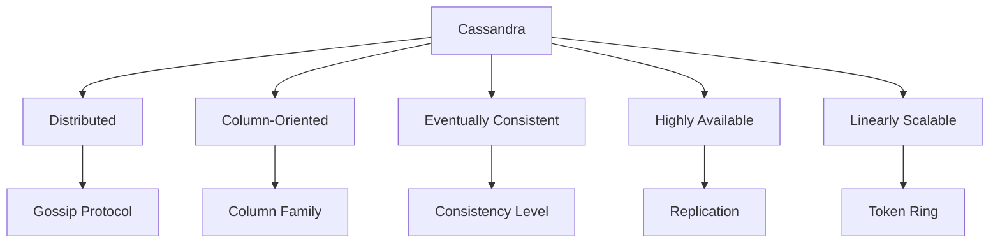
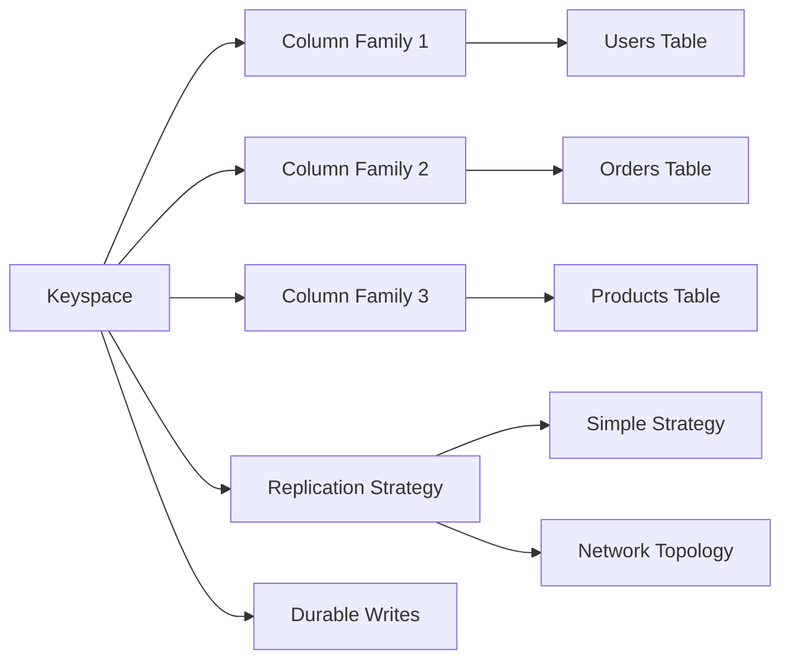
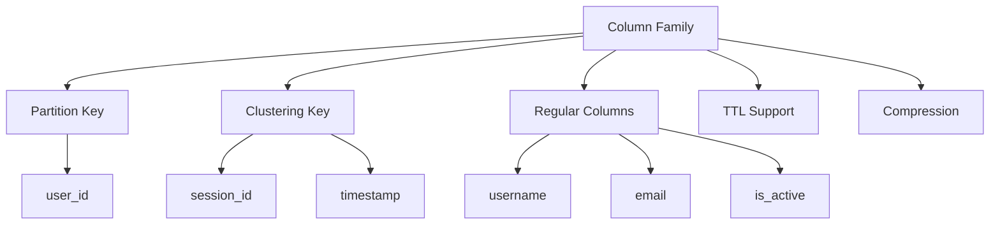
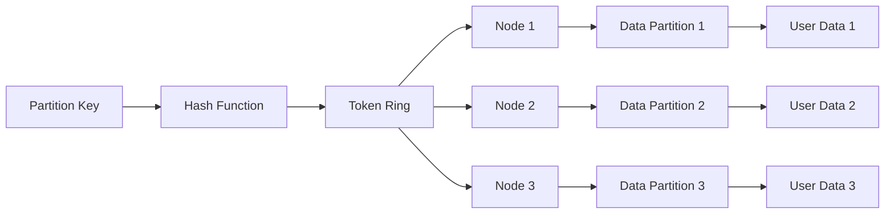
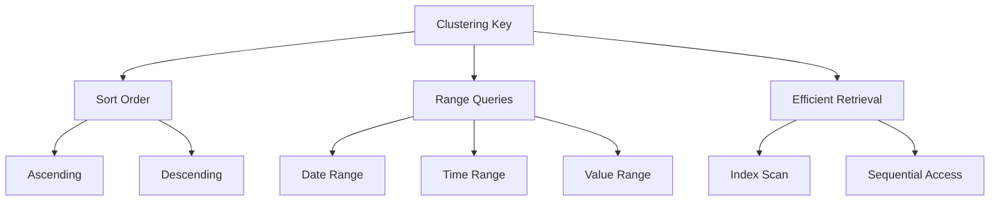

# Cassandra Concept Definition International Standards

## 1. Overview

This document demonstrates how to define Cassandra core concepts according to international Wiki standards, including concept definitions, multi-representation forms, bilingual terminology mapping, and knowledge graph integration.

## 2. Core Concept Definitions

### 2.1 Cassandra Database Management System

```yaml
# Cassandra DBMS Concept Definition
concept:
  name: "Cassandra"
  type: "Database Management System"
  category: "NoSQL Database"
  definition_en: "Cassandra is a distributed NoSQL database management system that uses column family data model, supporting high availability and linear scalability"
  definition_zh: "Cassandra是一个分布式NoSQL数据库管理系统，使用列族数据模型，支持高可用性和线性扩展"
  formal_definition: "Cassandra = (K, CF, PK, CK, CL, RF) where K is keyspace, CF is column family, PK is partition key, CK is clustering key, CL is consistency level, RF is replication factor"
  mathematical_notation: "Cassandra ∈ NoSQL_DBMS ∧ Cassandra ⊆ Distributed_DB"
  properties:
    - "Distributed"
    - "Column-oriented"
    - "Eventually consistent"
    - "Highly available"
    - "Linearly scalable"
    - "Fault-tolerant"
  synonyms:
    - "Apache Cassandra"
    - "Distributed Database"
    - "Column Family Database"
  antonyms:
    - "Relational Database"
    - "SQL Database"
    - "ACID Database"
  wikidata: "Q118356"
```

**Multi-Representation Forms**:

```markdown
**Text Description**:
Cassandra is a distributed NoSQL database management system that uses column family data model to store data. Cassandra's design philosophy is to provide high availability, linear scalability, and eventual consistency data storage solutions.

**Mathematical Representation**:
Cassandra = (K, CF, PK, CK, CL, RF)
where:
- K: Keyspace
- CF: Column Family
- PK: Partition Key
- CK: Clustering Key
- CL: Consistency Level
- RF: Replication Factor

**Code Example**:
```cql
-- Cassandra Connection Example
CREATE KEYSPACE IF NOT EXISTS test_keyspace
WITH replication = {
    'class': 'SimpleStrategy',
    'replication_factor': 3
};

USE test_keyspace;

CREATE TABLE users (
    user_id uuid PRIMARY KEY,
    username text,
    email text,
    created_at timestamp
);
```

**Diagram Representation**:



### 2.2 Keyspace

```yaml
# Keyspace Concept Definition
concept:
  name: "Keyspace"
  type: "Data Organization"
  category: "Namespace"
  definition_en: "Logical container in Cassandra, similar to database in RDBMS, containing column families and replication strategy configuration"
  definition_zh: "Cassandra中的逻辑容器，类似于关系数据库中的数据库，包含列族和复制策略配置"
  formal_definition: "Keyspace = {cf₁, cf₂, ..., cfₙ} where cfᵢ ∈ ColumnFamily"
  mathematical_notation: "Keyspace ⊆ ColumnFamily*"
  properties:
    - "Logical container"
    - "Replication configuration"
    - "Column family grouping"
    - "Strategy definition"
  synonyms:
    - "Namespace"
    - "Database"
    - "Schema"
  antonyms:
    - "Table"
    - "Column"
    - "Row"
  wikidata: "Q118356_Keyspace"
```

**Multi-Representation Forms**:

```markdown
**Text Description**:
A keyspace is a logical container in Cassandra, similar to a database in relational databases. Each keyspace contains multiple column families and defines replication strategy and replication factor. Keyspaces provide logical boundaries for data organization.

**Mathematical Representation**:
Keyspace = {cf₁, cf₂, ..., cfₙ}
where cfᵢ ∈ ColumnFamily, i ∈ {1, 2, ..., n}

**Code Example**:
```cql
-- Create Keyspace
CREATE KEYSPACE ecommerce
WITH replication = {
    'class': 'NetworkTopologyStrategy',
    'datacenter1': 3,
    'datacenter2': 2
}
AND durable_writes = true;

-- Use Keyspace
USE ecommerce;

-- View Keyspace Information
DESCRIBE KEYSPACE ecommerce;
```

**Diagram Representation**:



### 2.3 Column Family

```yaml
# Column Family Concept Definition
concept:
  name: "Column Family"
  type: "Data Structure"
  category: "Table"
  definition_en: "Table structure in Cassandra that stores rows and columns, using partition key and clustering key for data organization"
  definition_zh: "Cassandra中的表结构，存储行和列数据，使用分区键和聚类键进行数据组织"
  formal_definition: "ColumnFamily = {row₁, row₂, ..., rowₘ} where rowᵢ = (PK, CK, data)"
  mathematical_notation: "ColumnFamily ⊆ Row*"
  properties:
    - "Partition key"
    - "Clustering key"
    - "Column definition"
    - "TTL support"
  synonyms:
    - "Table"
    - "CF"
    - "Data Table"
  antonyms:
    - "Keyspace"
    - "Column"
    - "Index"
  wikidata: "Q118356_ColumnFamily"
```

**Multi-Representation Forms**:

```markdown
**Text Description**:
A column family is a table structure in Cassandra, similar to a table in relational databases. Each column family contains multiple rows of data, with each row consisting of partition key and clustering key. Column families support features like TTL (Time To Live) and compression.

**Mathematical Representation**:
ColumnFamily = {row₁, row₂, ..., rowₘ}
where rowᵢ = (PK, CK, data), PK ∈ PartitionKey, CK ∈ ClusteringKey

**Code Example**:
```cql
-- Create Column Family (Table)
CREATE TABLE users (
    user_id uuid,
    username text,
    email text,
    created_at timestamp,
    last_login timestamp,
    is_active boolean,
    PRIMARY KEY (user_id)
);

-- Create Column Family with Composite Primary Key
CREATE TABLE user_sessions (
    user_id uuid,
    session_id uuid,
    login_time timestamp,
    logout_time timestamp,
    ip_address inet,
    user_agent text,
    PRIMARY KEY (user_id, session_id)
);
```

**Diagram Representation**:



### 2.4 Partition Key

```yaml
# Partition Key Concept Definition
concept:
  name: "Partition Key"
  type: "Data Key"
  category: "Primary Key"
  definition_en: "Key that determines data distribution across cluster, data with same partition key stored on same node"
  definition_zh: "决定数据在集群中分布位置的键，相同分区键的数据存储在同一节点上"
  formal_definition: "PartitionKey = hash(key_value) % token_ring_size"
  mathematical_notation: "PartitionKey ∈ TokenRing"
  properties:
    - "Hash distribution"
    - "Token assignment"
    - "Node routing"
    - "Data locality"
  synonyms:
    - "Primary Key"
    - "Hash Key"
    - "Distribution Key"
  antonyms:
    - "Clustering Key"
    - "Secondary Key"
    - "Index Key"
  wikidata: "Q118356_PartitionKey"
```

**Multi-Representation Forms**:

```markdown
**Text Description**:
Partition key is a key component in Cassandra that determines data distribution. Through hash function, partition key values are mapped to specific positions on the token ring, with all data having the same partition key stored on the same node, ensuring data locality.

**Mathematical Representation**:
PartitionKey = hash(key_value) % token_ring_size
where hash: String → [0, 2^64-1]

**Code Example**:
```cql
-- Single Column Partition Key
CREATE TABLE users (
    user_id uuid PRIMARY KEY,  -- Partition Key
    username text,
    email text
);

-- Composite Partition Key
CREATE TABLE user_posts (
    user_id uuid,
    post_id uuid,
    title text,
    content text,
    created_at timestamp,
    PRIMARY KEY ((user_id, post_id))  -- Composite Partition Key
);

-- Query by Partition Key
SELECT * FROM users WHERE user_id = 123e4567-e89b-12d3-a456-426614174000;
```

**Diagram Representation**:



### 2.5 Clustering Key

```yaml
# Clustering Key Concept Definition
concept:
  name: "Clustering Key"
  type: "Data Key"
  category: "Secondary Key"
  definition_en: "Key that determines data ordering within partition, supporting range queries and efficient data retrieval"
  definition_zh: "决定分区内数据排序的键，支持范围查询和高效的数据检索"
  formal_definition: "ClusteringKey = (ck₁, ck₂, ..., ckₙ) where ckᵢ ∈ Column"
  mathematical_notation: "ClusteringKey ⊆ Column*"
  properties:
    - "Sorting order"
    - "Column ordering"
    - "Range queries"
    - "Efficient retrieval"
  synonyms:
    - "Sort Key"
    - "Ordering Key"
    - "Secondary Key"
  antonyms:
    - "Partition Key"
    - "Primary Key"
    - "Hash Key"
  wikidata: "Q118356_ClusteringKey"
```

**Multi-Representation Forms**:

```markdown
**Text Description**:
Clustering key is used to determine the sorting order of data within a partition. It supports range queries and efficient data retrieval, and can specify ascending or descending order. Clustering keys are commonly used for time series data or scenarios requiring sorting.

**Mathematical Representation**:
ClusteringKey = (ck₁, ck₂, ..., ckₙ)
where ckᵢ ∈ Column, order(ckᵢ) ∈ {ASC, DESC}

**Code Example**:
```cql
-- Single Column Clustering Key
CREATE TABLE user_sessions (
    user_id uuid,
    session_id uuid,
    login_time timestamp,
    logout_time timestamp,
    PRIMARY KEY (user_id, session_id)  -- user_id is partition key, session_id is clustering key
);

-- Multi-Column Clustering Key
CREATE TABLE user_activities (
    user_id uuid,
    activity_date date,
    activity_time timestamp,
    activity_type text,
    activity_data text,
    PRIMARY KEY (user_id, activity_date, activity_time)
) WITH CLUSTERING ORDER BY (activity_date DESC, activity_time DESC);

-- Range Query
SELECT * FROM user_activities 
WHERE user_id = 123e4567-e89b-12d3-a456-426614174000 
AND activity_date >= '2023-01-01' 
AND activity_date <= '2023-01-31';
```

**Diagram Representation**:



## 3. Bilingual Terminology Mapping Tables

### 3.1 Core Concept Terminology Mapping

| English Term | Chinese Term | Definition | Wikidata ID |
|-------------|-------------|------------|-------------|
| Cassandra | Cassandra | Distributed NoSQL database management system | Q118356 |
| Keyspace | 键空间 | Logical container in Cassandra | Q118356_Keyspace |
| Column Family | 列族 | Table structure in Cassandra | Q118356_ColumnFamily |
| Partition Key | 分区键 | Key that determines data distribution | Q118356_PartitionKey |
| Clustering Key | 聚类键 | Key that determines data ordering | Q118356_ClusteringKey |
| Consistency Level | 一致性级别 | Read/write consistency configuration | Q118356_ConsistencyLevel |
| Replication Factor | 复制因子 | Number of data replicas | Q118356_ReplicationFactor |
| SSTable | SSTable | Sorted String Table | Q118356_SSTable |
| MemTable | 内存表 | In-memory write buffer | Q118356_MemTable |
| Commit Log | 提交日志 | Persistent write log | Q118356_CommitLog |

### 3.2 Consistency Level Terminology Mapping

| English Term | Chinese Term | Description | Node Requirements |
|-------------|-------------|-------------|-------------------|
| ONE | ONE | Requires only one replica to respond | 1 node |
| QUORUM | QUORUM | Requires majority of replicas to respond | ceil(RF/2) + 1 |
| ALL | ALL | Requires all replicas to respond | RF nodes |
| LOCAL_QUORUM | LOCAL_QUORUM | Local datacenter majority response | ceil(RF_local/2) + 1 |
| EACH_QUORUM | EACH_QUORUM | Each datacenter majority response | Majority in each datacenter |

### 3.3 Replication Strategy Terminology Mapping

| English Term | Chinese Term | Description | Use Case |
|-------------|-------------|-------------|----------|
| Simple Strategy | 简单策略 | Single datacenter replication | Development environment |
| Network Topology Strategy | 网络拓扑策略 | Multi-datacenter replication | Production environment |
| Old Network Topology Strategy | 旧网络拓扑策略 | Backward compatibility | Migration scenarios |

## 4. RDF Knowledge Graph Representation

```turtle
# Cassandra Concept Knowledge Graph
@prefix rdf: <http://www.w3.org/1999/02/22-rdf-syntax-ns#> .
@prefix rdfs: <http://www.w3.org/2000/01/rdf-schema#> .
@prefix wd: <http://www.wikidata.org/entity/> .
@prefix wdt: <http://www.wikidata.org/prop/direct/> .
@prefix schema: <http://schema.org/> .

# Cassandra Main Entity
wd:Q118356 rdfs:label "Apache Cassandra"@en, "Apache Cassandra"@zh ;
    rdfs:description "Distributed NoSQL database management system"@en, "分布式NoSQL数据库管理系统"@zh ;
    wdt:P31 wd:Q7397 ;
    wdt:P178 wd:Q124 ;
    wdt:P856 "https://cassandra.apache.org" ;
    wdt:P1195 wd:Q2063 ;
    wdt:P277 wd:Q251 ;
    schema:programmingLanguage "Java" ;
    schema:license "Apache License 2.0" .

# Keyspace Concept
wd:Q118356_Keyspace rdfs:label "Keyspace"@en, "键空间"@zh ;
    rdfs:description "Logical container in Cassandra"@en, "Cassandra中的逻辑容器"@zh ;
    wdt:P31 wd:Q118356 ;
    wdt:P279 wd:Q118356 ;
    wdt:P527 wd:Q118356_ColumnFamily .

# Column Family Concept
wd:Q118356_ColumnFamily rdfs:label "Column Family"@en, "列族"@zh ;
    rdfs:description "Table structure in Cassandra"@en, "Cassandra中的表结构"@zh ;
    wdt:P31 wd:Q118356 ;
    wdt:P279 wd:Q118356 ;
    wdt:P527 wd:Q118356_PartitionKey ;
    wdt:P527 wd:Q118356_ClusteringKey .

# Partition Key Concept
wd:Q118356_PartitionKey rdfs:label "Partition Key"@en, "分区键"@zh ;
    rdfs:description "Key that determines data distribution"@en, "决定数据分布的键"@zh ;
    wdt:P31 wd:Q118356 ;
    wdt:P279 wd:Q118356 ;
    wdt:P527 wd:Q118356_ColumnFamily .

# Clustering Key Concept
wd:Q118356_ClusteringKey rdfs:label "Clustering Key"@en, "聚类键"@zh ;
    rdfs:description "Key that determines data ordering"@en, "决定数据排序的键"@zh ;
    wdt:P31 wd:Q118356 ;
    wdt:P279 wd:Q118356 ;
    wdt:P527 wd:Q118356_ColumnFamily .

# Consistency Level Concept
wd:Q118356_ConsistencyLevel rdfs:label "Consistency Level"@en, "一致性级别"@zh ;
    rdfs:description "Consistency configuration in Cassandra"@en, "Cassandra中的一致性配置"@zh ;
    wdt:P31 wd:Q118356 ;
    wdt:P279 wd:Q118356 ;
    wdt:P527 wd:Q118356_ONE ;
    wdt:P527 wd:Q118356_QUORUM ;
    wdt:P527 wd:Q118356_ALL .

# SSTable Concept
wd:Q118356_SSTable rdfs:label "SSTable"@en, "SSTable"@zh ;
    rdfs:description "Sorted String Table storage format"@en, "排序字符串表存储格式"@zh ;
    wdt:P31 wd:Q118356 ;
    wdt:P279 wd:Q118356 ;
    wdt:P527 wd:Q118356_ColumnFamily .

# MemTable Concept
wd:Q118356_MemTable rdfs:label "MemTable"@en, "内存表"@zh ;
    rdfs:description "In-memory write buffer"@en, "内存写入缓冲区"@zh ;
    wdt:P31 wd:Q118356 ;
    wdt:P279 wd:Q118356 ;
    wdt:P527 wd:Q118356_ColumnFamily .

# Commit Log Concept
wd:Q118356_CommitLog rdfs:label "Commit Log"@en, "提交日志"@zh ;
    rdfs:description "Persistent write log"@en, "持久化写入日志"@zh ;
    wdt:P31 wd:Q118356 ;
    wdt:P279 wd:Q118356 ;
    wdt:P527 wd:Q118356_ColumnFamily .
```

## 5. Concept Mapping Relations

```yaml
# Cassandra Concept Mapping Relations
concept_mapping_relations:
  cassandra_core:
    cassandra:
      - keyspace: "contains"
      - column_family: "organizes"
      - partition_key: "uses"
      - clustering_key: "supports"
      - consistency_level: "configures"
      - replication_factor: "sets"
      
  keyspace_related:
    keyspace:
      - column_family: "contains"
      - replication_strategy: "defines"
      - replication_factor: "configures"
      - cassandra: "belongs_to"
      
  column_family_related:
    column_family:
      - partition_key: "uses"
      - clustering_key: "uses"
      - regular_columns: "contains"
      - sstable: "stored_as"
      - memtable: "uses"
      - keyspace: "belongs_to"
      
  partition_key_related:
    partition_key:
      - hash_function: "uses"
      - token_ring: "maps_to"
      - node: "assigned_to"
      - column_family: "defines"
      - data_distribution: "determines"
      
  clustering_key_related:
    clustering_key:
      - sort_order: "defines"
      - range_queries: "supports"
      - column_family: "defines"
      - data_ordering: "determines"
      - efficient_retrieval: "provides"
      
  storage_related:
    sstable:
      - column_family: "stores"
      - compression: "uses"
      - bloom_filter: "contains"
      - immutable: "immutable"
      
    memtable:
      - column_family: "buffers"
      - memory: "in_memory"
      - mutable: "mutable"
      - flush: "flushes_to_sstable"
      
    commit_log:
      - write_operations: "records"
      - durability: "ensures"
      - recovery: "used_for_recovery"
```

## 6. Content Quality Standards and Validation Checklist

```yaml
# Cassandra Concept Definition Quality Standards
quality_standards:
  accuracy:
    description: "Concept definition accuracy and technical correctness"
    criteria:
      - "Cassandra concept definitions are accurate"
      - "Technical details are correct"
      - "Example code is executable"
      - "Mathematical representations are correct"
    weight: 0.3
    
  completeness:
    description: "Concept coverage completeness and comprehensiveness"
    criteria:
      - "Cassandra core concepts are fully covered"
      - "Multi-representation forms are complete"
      - "Bilingual terminology mapping is complete"
      - "Knowledge graph relationships are complete"
    weight: 0.25
    
  clarity:
    description: "Expression clarity and understandability"
    criteria:
      - "Language expression is clear"
      - "Logical structure is reasonable"
      - "Diagram explanations are clear"
      - "Terminology usage is consistent"
    weight: 0.2
    
  consistency:
    description: "Content consistency and standardization"
    criteria:
      - "Terminology usage is consistent"
      - "Format specifications are unified"
      - "Reference standards are consistent"
      - "Style is maintained uniformly"
    weight: 0.15
    
  relevance:
    description: "Content relevance and practicality"
    criteria:
      - "Conforms to Cassandra reality"
      - "Has practical value"
      - "Reflects latest technology"
      - "Solves practical problems"
    weight: 0.1

# Validation Checklist
validation_checklist:
  concept_definition:
    - "Is the Cassandra concept name accurate"
    - "Are English and Chinese definitions complete"
    - "Is the formal definition correct"
    - "Is the mathematical representation standardized"
    - "Are property descriptions comprehensive"
    - "Are synonyms and antonyms accurate"
    - "Is the Wikidata mapping correct"
    
  mathematical_content:
    - "Is LaTeX syntax correct"
    - "Are mathematical symbols standardized"
    - "Is formula derivation reasonable"
    - "Are symbol definitions clear"
    
  code_examples:
    - "Is CQL code syntax correct"
    - "Are examples executable"
    - "Are comments clear"
    - "Are best practices demonstrated"
    
  diagrams:
    - "Are architecture diagrams clear"
    - "Are relationships correct"
    - "Are labels accurate"
    - "Is layout reasonable"
    
  terminology:
    - "Is terminology usage consistent"
    - "Is bilingual mapping accurate"
    - "Are professional terms standardized"
    - "Are new terms defined"
    
  knowledge_graph:
    - "Are RDF triples correct"
    - "Are entity relationships accurate"
    - "Is Wikidata alignment correct"
    - "Are concept mappings complete"
```

## 7. Summary

This document demonstrates Cassandra concept definition international Wiki standards, including:

1. **Standard Concept Definitions**: Established standard definitions for Cassandra, Keyspace, Column Family, Partition Key, Clustering Key, and other core concepts
2. **Multi-Representation Forms**: Provided text, mathematical, code, and diagram representations
3. **Bilingual Terminology Mapping**: Implemented complete English-Chinese terminology mapping tables
4. **Knowledge Graph Integration**: Established RDF triple representations and concept mapping relationships
5. **Quality Standards**: Defined content quality standards and validation checklists

These examples provide specific implementation guidance for standardizing and internationalizing Cassandra knowledge content, ensuring academic rigor, consistency, and accessibility of the content.
