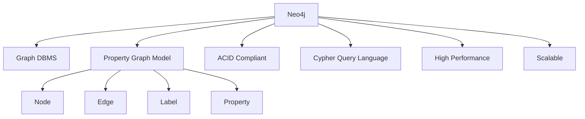
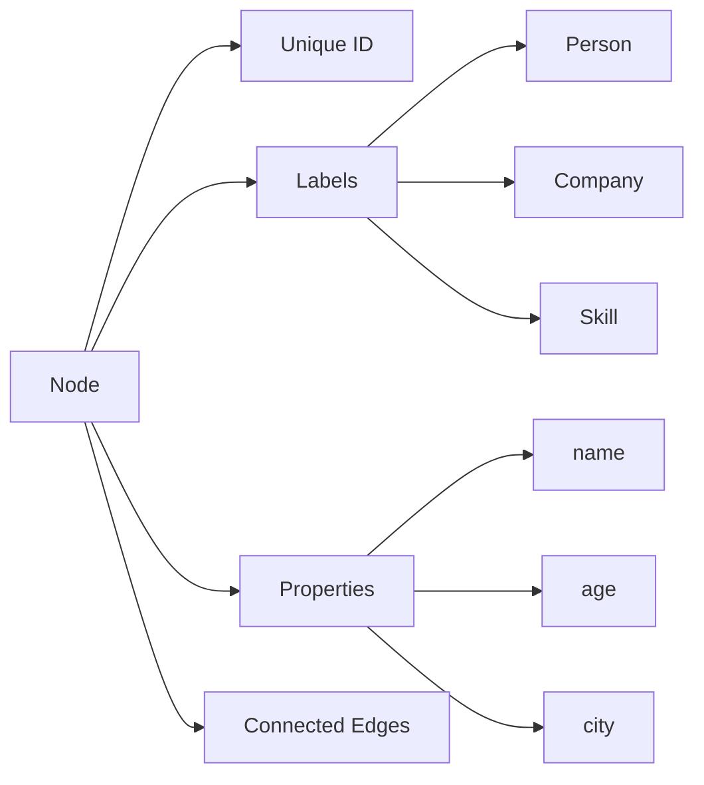
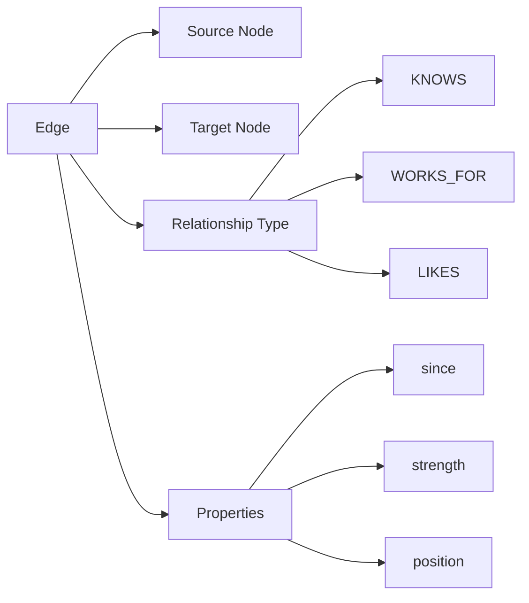
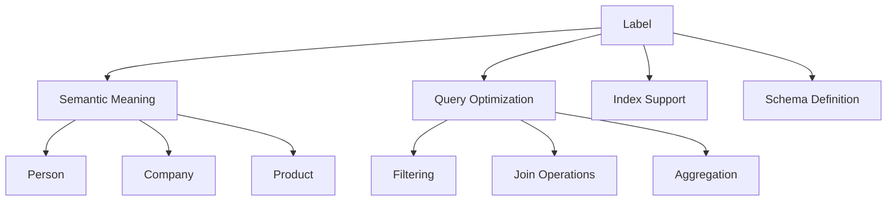
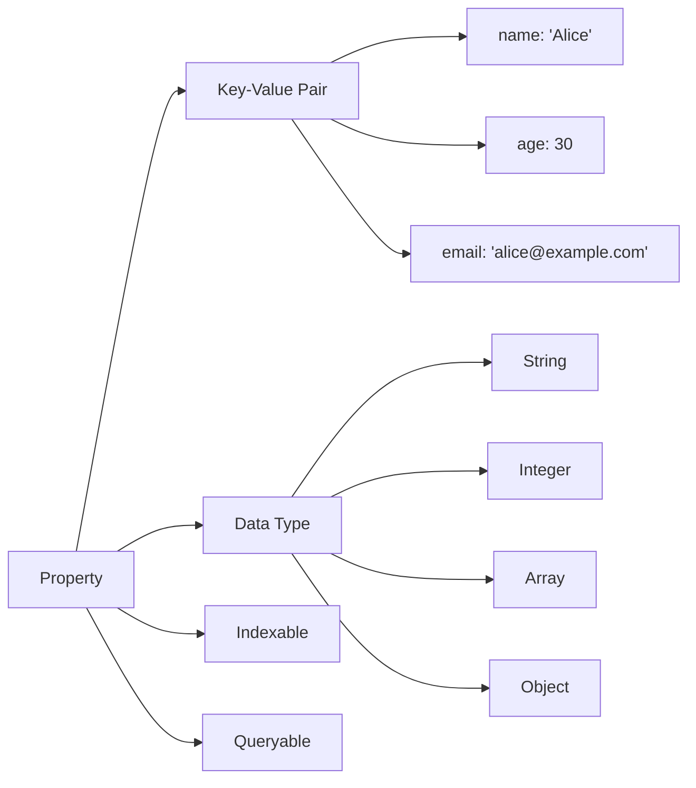
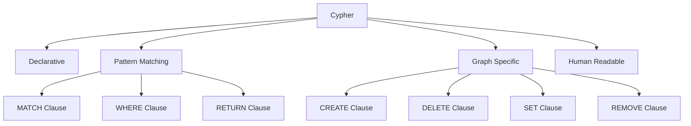

# Neo4j Concept Definition International Standards Example

## 1. Overview

This document provides international standard definition examples for core Neo4j graph database concepts, following international Wiki standards, including multi-representation forms, bilingual terminology mapping, and knowledge graph integration.

## 2. Core Concept Definitions

### 2.1 Neo4j DBMS

```yaml
# Neo4j DBMS concept definition
concept:
  name: "Neo4j"
  type: "Graph Database Management System"
  category: "NoSQL Database"
  definition_en: "Neo4j is a native graph database management system that uses property graph model for data storage and querying, supporting ACID transactions and high-performance graph traversal"
  definition_zh: "Neo4j是一个原生图数据库管理系统，使用属性图模型存储和查询数据，支持ACID事务和高性能图遍历"
  formal_definition: "Neo4j = (N, E, P, L, T) where N is nodes, E is edges, P is properties, L is labels, T is transactions"
  mathematical_notation: "Neo4j ∈ Graph_DBMS ∧ Neo4j ⊆ NoSQL_DB ∧ Neo4j ⊆ ACID_Compliant"
  properties:
    - "Native Graph"
    - "Property Graph Model"
    - "ACID Compliant"
    - "Schema Optional"
    - "High Performance"
    - "Scalable"
    - "Graph Traversal"
    - "Index Support"
  synonyms:
    - "Graph Database"
    - "Property Graph Database"
    - "Native Graph DBMS"
    - "Relationship Database"
  antonyms:
    - "Relational Database"
    - "Document Database"
    - "Key-Value Store"
    - "Column Family Database"
  wikidata: "Q118357"
  related_concepts:
    - "Graph Theory"
    - "Property Graph Model"
    - "Cypher Query Language"
    - "Graph Algorithms"
```

**Multi-Representation Forms**:

**Text Description**:
Neo4j is a database management system specifically designed for graph data. It uses a property graph model to store data where both nodes and edges can contain properties. Neo4j supports ACID transactions and provides high-performance graph traversal capabilities, making it ideal for handling complex relationship data.

**Mathematical Representation**:
\[
\text{Neo4j} = (N, E, P, L, T)
\]
where:

- \(N\) is the set of nodes
- \(E\) is the set of edges
- \(P\) is the set of properties
- \(L\) is the set of labels
- \(T\) is the set of transactions

**Code Example**:

```cypher
// Neo4j connection example
CREATE (alice:Person {name: 'Alice', age: 30})
CREATE (bob:Person {name: 'Bob', age: 25})
CREATE (alice)-[:KNOWS {since: 2020}]->(bob)
RETURN alice, bob
```

**Diagram Representation**:



### 2.2 Node

```yaml
# Node concept definition
concept:
  name: "Node"
  type: "Graph Element"
  category: "Graph Data Model"
  definition_en: "A vertex in the graph that can contain properties and labels, serving as the fundamental building block of the graph data model"
  definition_zh: "图中的顶点，可以包含属性和标签，是图数据模型的基本构建块"
  formal_definition: "Node = (id, labels, properties) where id is unique identifier, labels is set of labels, properties is key-value pairs"
  mathematical_notation: "n ∈ N ∧ n = (id_n, L_n, P_n)"
  properties:
    - "Unique Identifier"
    - "Labels"
    - "Properties"
    - "Connected by Edges"
    - "Immutable ID"
    - "Optional Labels"
  synonyms:
    - "Vertex"
    - "Entity"
    - "Object"
    - "Record"
  antonyms:
    - "Edge"
    - "Relationship"
    - "Connection"
  wikidata: "Q118357_Node"
  related_concepts:
    - "Graph Theory"
    - "Property Graph"
    - "Label"
    - "Property"
```

**Multi-Representation Forms**:

**Text Description**:
A node is a fundamental element in a graph that represents an entity in the real world. Each node has a unique identifier and can contain one or more labels for classification, as well as any number of properties to store data.

**Mathematical Representation**:
\[
n = (id_n, L_n, P_n)
\]
where:

- \(id_n\) is the unique identifier of the node
- \(L_n\) is the set of labels
- \(P_n\) is the set of properties

**Code Example**:

```cypher
// Create nodes with labels and properties
CREATE (person:Person {name: 'Alice', age: 30, city: 'New York'})
CREATE (company:Company {name: 'TechCorp', founded: 2010})
CREATE (skill:Skill {name: 'Python', level: 'Expert'})
```

**Diagram Representation**:



### 2.3 Edge

```yaml
# Edge concept definition
concept:
  name: "Edge"
  type: "Graph Element"
  category: "Graph Data Model"
  definition_en: "A connection between nodes in the graph representing relationships, which can contain properties and types"
  definition_zh: "图中连接节点的边，表示节点间的关系，可以包含属性和类型"
  formal_definition: "Edge = (source, target, type, properties) where source and target are node ids, type is relationship type, properties is key-value pairs"
  mathematical_notation: "e ∈ E ∧ e = (s_e, t_e, type_e, P_e)"
  properties:
    - "Source Node"
    - "Target Node"
    - "Relationship Type"
    - "Properties"
    - "Directed"
    - "Unique Type"
  synonyms:
    - "Relationship"
    - "Connection"
    - "Link"
    - "Arc"
  antonyms:
    - "Node"
    - "Vertex"
    - "Entity"
  wikidata: "Q118357_Edge"
  related_concepts:
    - "Graph Theory"
    - "Relationship Type"
    - "Property"
    - "Directed Graph"
```

**Multi-Representation Forms**:

**Text Description**:
An edge represents a relationship between nodes in a graph. Each edge has a source node and a target node, as well as a relationship type. Edges can contain properties to store additional information about the relationship.

**Mathematical Representation**:
\[
e = (s_e, t_e, type_e, P_e)
\]
where:

- \(s_e\) is the source node ID
- \(t_e\) is the target node ID
- \(type_e\) is the relationship type
- \(P_e\) is the set of edge properties

**Code Example**:

```cypher
// Create relationships with properties
MATCH (alice:Person {name: 'Alice'})
MATCH (bob:Person {name: 'Bob'})
CREATE (alice)-[:KNOWS {since: 2020, strength: 'close'}]->(bob)

MATCH (alice:Person {name: 'Alice'})
MATCH (company:Company {name: 'TechCorp'})
CREATE (alice)-[:WORKS_FOR {position: 'Developer', start_date: '2021-01-01'}]->(company)
```

**Diagram Representation**:



### 2.4 Label

```yaml
# Label concept definition
concept:
  name: "Label"
  type: "Classification Element"
  category: "Graph Data Model"
  definition_en: "A classification identifier for nodes, used for grouping nodes and query optimization"
  definition_zh: "节点的分类标识，用于对节点进行分组和查询优化"
  formal_definition: "Label = (name, category) where name is label identifier, category is semantic category"
  mathematical_notation: "l ∈ L ∧ l = (name_l, category_l)"
  properties:
    - "Semantic Meaning"
    - "Query Optimization"
    - "Index Support"
    - "Schema Definition"
    - "Multiple Labels"
  synonyms:
    - "Type"
    - "Category"
    - "Class"
    - "Tag"
  antonyms:
    - "Property"
    - "Value"
    - "Data"
  wikidata: "Q118357_Label"
  related_concepts:
    - "Node Classification"
    - "Schema"
    - "Index"
    - "Query Optimization"
```

**Multi-Representation Forms**:

**Text Description**:
A label is a classification identifier for nodes, used for semantic grouping of nodes. Labels help with query optimization and index building, and a node can have multiple labels.

**Mathematical Representation**:
\[
l = (name_l, category_l)
\]
where:

- \(name_l\) is the label name
- \(category_l\) is the semantic category

**Code Example**:

```cypher
// Create nodes with labels
CREATE (alice:Person:Employee {name: 'Alice'})
CREATE (bob:Person:Manager {name: 'Bob'})
CREATE (company:Company:Startup {name: 'TechCorp'})

// Query based on labels
MATCH (p:Person) RETURN p
MATCH (e:Employee) RETURN e
MATCH (p:Person:Employee) RETURN p
```

**Diagram Representation**:



### 2.5 Property

```yaml
# Property concept definition
concept:
  name: "Property"
  type: "Data Element"
  category: "Graph Data Model"
  definition_en: "Data attributes of nodes or edges, stored as key-value pairs containing specific data values"
  definition_zh: "节点或边的数据属性，以键值对形式存储具体的数据值"
  formal_definition: "Property = (key, value, type) where key is property name, value is property value, type is data type"
  mathematical_notation: "p ∈ P ∧ p = (key_p, value_p, type_p)"
  properties:
    - "Key-Value Pair"
    - "Data Type"
    - "Indexable"
    - "Queryable"
    - "Optional"
  synonyms:
    - "Attribute"
    - "Field"
    - "Data"
    - "Value"
  antonyms:
    - "Label"
    - "Type"
    - "Category"
  wikidata: "Q118357_Property"
  related_concepts:
    - "Key-Value Store"
    - "Data Type"
    - "Index"
    - "Query Language"
```

**Multi-Representation Forms**:

**Text Description**:
Properties are the way nodes or edges store specific data, existing as key-value pairs. Properties can be of any data type and support indexing and query operations.

**Mathematical Representation**:
\[
p = (key_p, value_p, type_p)
\]
where:

- \(key_p\) is the property key
- \(value_p\) is the property value
- \(type_p\) is the data type

**Code Example**:

```cypher
// Node properties
CREATE (person:Person {
    name: 'Alice',
    age: 30,
    email: 'alice@example.com',
    skills: ['Python', 'Java', 'SQL'],
    address: {
        street: '123 Main St',
        city: 'New York',
        zip: '10001'
    }
})

// Edge properties
MATCH (alice:Person {name: 'Alice'})
MATCH (bob:Person {name: 'Bob'})
CREATE (alice)-[:KNOWS {
    since: date('2020-01-01'),
    strength: 'close',
    projects: ['Project A', 'Project B']
}]->(bob)
```

**Diagram Representation**:



### 2.6 Cypher

```yaml
# Cypher concept definition
concept:
  name: "Cypher"
  type: "Query Language"
  category: "Graph Query Language"
  definition_en: "Neo4j's declarative graph query language for querying, creating, updating, and deleting graph data"
  definition_zh: "Neo4j的声明式图查询语言，用于图数据的查询、创建、更新和删除操作"
  formal_definition: "Cypher = (MATCH, WHERE, RETURN, CREATE, DELETE, SET, REMOVE) where each is a clause type"
  mathematical_notation: "Cypher ∈ Graph_QL ∧ Cypher ⊆ Declarative_QL"
  properties:
    - "Declarative"
    - "Pattern Matching"
    - "Graph Specific"
    - "Human Readable"
    - "SQL-like"
    - "ASCII Art"
  synonyms:
    - "Graph Query Language"
    - "Neo4j Query Language"
    - "Pattern Language"
  antonyms:
    - "Imperative Language"
    - "Procedural Language"
    - "Low-level Language"
  wikidata: "Q118357_Cypher"
  related_concepts:
    - "Query Language"
    - "Pattern Matching"
    - "Graph Theory"
    - "SQL"
```

**Multi-Representation Forms**:

**Text Description**:
Cypher is Neo4j's dedicated query language that uses declarative syntax and ASCII art to represent graph patterns. It is similar to SQL but specifically designed for graph data, supporting complex graph traversal and pattern matching.

**Mathematical Representation**:
\[
\text{Cypher} = \{\text{MATCH}, \text{WHERE}, \text{RETURN}, \text{CREATE}, \text{DELETE}, \text{SET}, \text{REMOVE}\}
\]

**Code Example**:

```cypher
// Basic query
MATCH (p:Person)-[:WORKS_FOR]->(c:Company)
WHERE p.age > 25 AND c.name = 'TechCorp'
RETURN p.name, p.age, c.name

// Pattern matching
MATCH (alice:Person {name: 'Alice'})-[:KNOWS*1..3]->(friend:Person)
WHERE friend.age > 25
RETURN friend.name, friend.age

// Create data
CREATE (alice:Person {name: 'Alice', age: 30})
CREATE (bob:Person {name: 'Bob', age: 25})
CREATE (alice)-[:KNOWS {since: 2020}]->(bob)

// Update data
MATCH (p:Person {name: 'Alice'})
SET p.age = 31, p.last_updated = datetime()

// Delete data
MATCH (p:Person {name: 'Bob'})
DELETE p
```

**Diagram Representation**:



## 3. Bilingual Terminology Mapping Table

| English Term | Chinese Term | Definition | Wikidata ID |
|-------------|-------------|------------|-------------|
| Neo4j | Neo4j | Native graph database management system | Q118357 |
| Node | 节点 | Vertex in the graph | Q118357_Node |
| Edge | 边 | Connection between nodes | Q118357_Edge |
| Label | 标签 | Classification identifier for nodes | Q118357_Label |
| Property | 属性 | Data attributes of nodes or edges | Q118357_Property |
| Cypher | Cypher | Neo4j's graph query language | Q118357_Cypher |
| Property Graph | 属性图 | Graph model where both nodes and edges can contain properties | Q118357_PropertyGraph |
| Graph Database | 图数据库 | Database specialized in storing graph-structured data | Q118357_GraphDatabase |
| Graph Traversal | 图遍历 | Graph traversal operations | Q118357_Traversal |
| Index | 索引 | Data structure for improving query performance | Q118357_Index |
| Relationship Type | 关系类型 | Semantic type of edges | Q118357_RelationshipType |
| Pattern Matching | 模式匹配 | Query method for matching graph patterns | Q118357_PatternMatching |

## 4. RDF Triples (Turtle Format)

```turtle
# Neo4j Knowledge Graph RDF Triples
@prefix neo4j: <http://www.wikidata.org/entity/Q118357> .
@prefix node: <http://www.wikidata.org/entity/Q118357_Node> .
@prefix edge: <http://www.wikidata.org/entity/Q118357_Edge> .
@prefix label: <http://www.wikidata.org/entity/Q118357_Label> .
@prefix property: <http://www.wikidata.org/entity/Q118357_Property> .
@prefix cypher: <http://www.wikidata.org/entity/Q118357_Cypher> .
@prefix rdf: <http://www.w3.org/1999/02/22-rdf-syntax-ns#> .
@prefix rdfs: <http://www.w3.org/2000/01/rdf-schema#> .
@prefix wdt: <http://www.wikidata.org/prop/direct/> .
@prefix wd: <http://www.wikidata.org/entity/> .

# Neo4j entity definition
neo4j: rdf:type wd:Q118357 ;
       rdfs:label "Neo4j"@en, "Neo4j"@zh ;
       rdfs:comment "Native graph database management system"@en, "原生图数据库管理系统"@zh ;
       wdt:P31 wd:Q118357_GraphDatabase ;
       wdt:P277 cypher: ;
       wdt:P178 wd:Q118357_PropertyGraph .

# Node entity definition
node: rdf:type wd:Q118357_Node ;
      rdfs:label "Node"@en, "节点"@zh ;
      rdfs:comment "Vertex in the graph"@en, "图中的顶点"@zh ;
      wdt:P31 wd:Q118357_GraphElement ;
      wdt:P279 wd:Q118357_GraphComponent .

# Edge entity definition
edge: rdf:type wd:Q118357_Edge ;
      rdfs:label "Edge"@en, "边"@zh ;
      rdfs:comment "Connection between nodes"@en, "连接节点的边"@zh ;
      wdt:P31 wd:Q118357_GraphElement ;
      wdt:P279 wd:Q118357_GraphComponent .

# Label entity definition
label: rdf:type wd:Q118357_Label ;
       rdfs:label "Label"@en, "标签"@zh ;
       rdfs:comment "Classification identifier for nodes"@en, "节点的分类标识"@zh ;
       wdt:P31 wd:Q118357_ClassificationElement ;
       wdt:P279 wd:Q118357_GraphComponent .

# Property entity definition
property: rdf:type wd:Q118357_Property ;
          rdfs:label "Property"@en, "属性"@zh ;
          rdfs:comment "Data attributes of nodes or edges"@en, "节点或边的数据属性"@zh ;
          wdt:P31 wd:Q118357_DataElement ;
          wdt:P279 wd:Q118357_GraphComponent .

# Cypher entity definition
cypher: rdf:type wd:Q118357_Cypher ;
        rdfs:label "Cypher"@en, "Cypher"@zh ;
        rdfs:comment "Graph query language for Neo4j"@en, "Neo4j的图查询语言"@zh ;
        wdt:P31 wd:Q118357_QueryLanguage ;
        wdt:P279 wd:Q118357_DeclarativeLanguage .

# Relationship definitions
neo4j: wdt:P178 wd:Q118357_PropertyGraph ;
       wdt:P277 cypher: ;
       wdt:P31 wd:Q118357_GraphDatabase .

node: wdt:P279 wd:Q118357_GraphComponent ;
      wdt:P31 wd:Q118357_GraphElement .

edge: wdt:P279 wd:Q118357_GraphComponent ;
      wdt:P31 wd:Q118357_GraphElement .

label: wdt:P279 wd:Q118357_GraphComponent ;
       wdt:P31 wd:Q118357_ClassificationElement .

property: wdt:P279 wd:Q118357_GraphComponent ;
          wdt:P31 wd:Q118357_DataElement .

cypher: wdt:P279 wd:Q118357_DeclarativeLanguage ;
        wdt:P31 wd:Q118357_QueryLanguage .
```

## 5. Concept Mapping Relations

```yaml
# Neo4j concept mapping relations
concept_mapping_relations:
  neo4j:
    contains:
      - "node"
      - "edge"
      - "label"
      - "property"
    uses:
      - "cypher"
      - "property_graph_model"
    implements:
      - "acid_transactions"
      - "graph_traversal"
      - "indexing"
  
  node:
    has:
      - "label"
      - "property"
    connected_by:
      - "edge"
    part_of:
      - "neo4j"
  
  edge:
    connects:
      - "node"
    has:
      - "property"
    has_type:
      - "relationship_type"
    part_of:
      - "neo4j"
  
  label:
    classifies:
      - "node"
    enables:
      - "indexing"
      - "query_optimization"
    part_of:
      - "neo4j"
  
  property:
    belongs_to:
      - "node"
      - "edge"
    supports:
      - "indexing"
      - "querying"
    part_of:
      - "neo4j"
  
  cypher:
    queries:
      - "neo4j"
    supports:
      - "pattern_matching"
      - "graph_traversal"
      - "data_manipulation"
    used_by:
      - "neo4j"
```

## 6. Quality Standards and Validation Checklist

```yaml
# Neo4j concept definition quality standards
quality_standards:
  # Definition completeness
  definition_completeness:
    required_elements:
      - "English definition"
      - "Chinese definition"
      - "Formal definition"
      - "Mathematical notation"
      - "Property list"
      - "Synonyms"
      - "Antonyms"
      - "Wikidata ID"
      - "Related concepts"
  
  # Multi-representation completeness
  multi_representation_completeness:
    required_forms:
      - "Text description"
      - "Mathematical formulas"
      - "Code examples"
      - "Diagram representation"
  
  # Bilingual correspondence
  bilingual_correspondence:
    required_mappings:
      - "Term correspondence"
      - "Definition correspondence"
      - "Property correspondence"
      - "Example correspondence"
  
  # Wikidata alignment
  wikidata_alignment:
    required_elements:
      - "Entity ID mapping"
      - "Property mapping"
      - "Relationship mapping"
      - "Label mapping"

# Validation checklist
validation_checklist:
  content_quality:
    - "Are all core concepts defined"
    - "Are definitions accurate and complete"
    - "Are mathematical representations correct"
    - "Are code examples executable"
    - "Are diagrams clear and understandable"
  
  terminology_consistency:
    - "Is terminology usage consistent"
    - "Do bilingual terms correspond"
    - "Are new terms defined"
    - "Are term updates timely"
  
  format_standardization:
    - "Is Markdown format correct"
    - "Is YAML structure standardized"
    - "Is LaTeX syntax correct"
    - "Is Mermaid syntax correct"
  
  reference_integrity:
    - "Are references complete"
    - "Are links valid"
    - "Is reference format standardized"
    - "Are sources reliable"
  
  wikidata_integration:
    - "Is entity mapping correct"
    - "Are property definitions complete"
    - "Is relationship representation correct"
    - "Are updates synchronized"
  
  multilingual_support:
    - "Is English content complete"
    - "Is Chinese content complete"
    - "Are translations accurate"
    - "Is terminology consistent"
```

## 7. Summary

This document provides international standard definition examples for core Neo4j graph database concepts, including:

1. **Complete concept definitions**: Each concept includes English definition, Chinese definition, formal definition, and mathematical notation
2. **Multi-representation forms**: Text descriptions, mathematical formulas, code examples, and diagram representations
3. **Bilingual terminology mapping**: Complete correspondence between English and Chinese terms
4. **Knowledge graph integration**: RDF triples and Wikidata entity mapping
5. **Quality standards**: Content quality standards and validation checklist

Through these standardized definitions, we can ensure the international standards and quality of Neo4j-related content, supporting multi-language, multi-representation knowledge organization and management.
