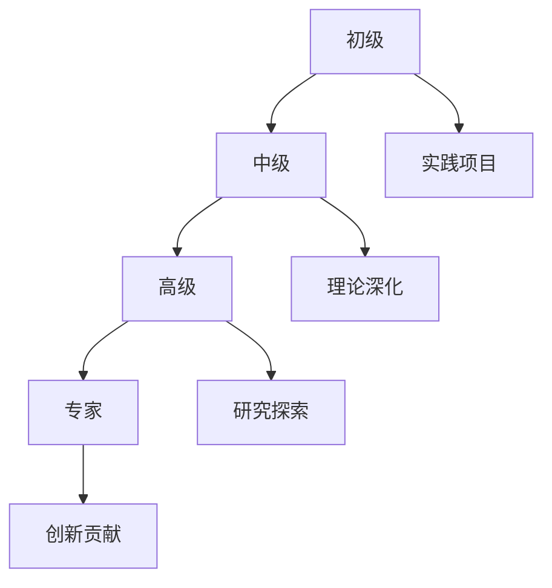

# 国际化Wiki标准与知识规范对齐指南

## 📑 目录

- [国际化Wiki标准与知识规范对齐指南](#国际化wiki标准与知识规范对齐指南)
  - [📑 目录](#-目录)
- [1. 概述](#1-概述)
  - [1.1. 目标与范围](#11-目标与范围)
  - [1.2. 参考标准](#12-参考标准)
- [2. 多语言支持框架](#2-多语言支持框架)
  - [2.1. 语言策略](#21-语言策略)
    - [2.1.1. 主要语言](#211-主要语言)
    - [2.1.2. 翻译策略](#212-翻译策略)
- [3. 国际化技术实现](#3-国际化技术实现)
  - [3.1. 文件组织](#31-文件组织)
    - [3.1.1. 语言标识](#311-语言标识)
- [4. 标准化格式规范](#4-标准化格式规范)
  - [4.1. 文档结构标准](#41-文档结构标准)
    - [4.1.1. 统一文档模板](#411-统一文档模板)
    - [4.1.2. 数学公式标准](#412-数学公式标准)
  - [4.2. 代码示例标准](#42-代码示例标准)
    - [4.2.1. 代码块规范](#421-代码块规范)
  - [5.2. 键盘导航支持](#52-键盘导航支持)
- [6. 知识管理规范](#6-知识管理规范)
  - [6.1. 知识分类体系](#61-知识分类体系)
    - [6.1.1. 主题分类](#611-主题分类)
    - [6.1.2. 难度分级](#612-难度分级)
- [7. 变更历史](#7-变更历史)
  - [7.1. v1.2.0 (2025-01-13)](#71-v120-(2025-01-13))
  - [7.2. v1.1.0 (2024-12-20)](#72-v110-(2024-12-20))
  - [7.3. v1.0.0 (2024-11-15)](#73-v100-(2024-11-15))
  - [8.2. 文化适应性要求](#82-文化适应性要求)
  - [8.3. 示例实现](#83-示例实现)
- [9. 多语言SEO优化](#9-多语言seo优化)
- [.github/workflows/quality-check.yml](#githubworkflowsquality-checkyml)
---


## 1. 概述

### 1.1. 目标与范围

本指南旨在将数据科学知识库对齐国际Wiki标准和最新知识规范，实现：

- **多语言支持**：支持中英文双语，为国际化做准备
- **标准化格式**：遵循国际Wiki和学术文档标准
- **可访问性**：符合WCAG 2.1 AA级标准
- **国际化**：支持多时区、多货币、多文化背景
- **知识规范**：符合现代知识管理最佳实践

### 1.2. 参考标准

- **Wiki标准**：MediaWiki、Wikipedia、Wikidata规范
- **学术标准**：IEEE、ACM、arXiv文档规范
- **国际化标准**：Unicode、ISO 639、ISO 3166
- **可访问性标准**：WCAG 2.1、Section 508
- **知识管理**：ISO 30401、DAMA-DMBOK

## 2. 多语言支持框架

### 2.1. 语言策略

#### 2.1.1. 主要语言

- **中文（简体）**：主要语言，完整内容
- **英文**：国际交流，核心内容翻译
- **其他语言**：按需扩展（日文、德文、法文等）

#### 2.1.2. 翻译策略

```yaml
# 翻译优先级矩阵
translation_priority:
  critical:
    - 核心概念定义
    - 数学公式和定理
    - API文档和代码示例
    - 安全相关警告
  high:
    - 理论背景和动机
    - 算法描述
    - 最佳实践指南
    - 故障排除
  medium:
    - 历史背景
    - 相关研究
    - 扩展阅读
    - 社区讨论
  low:
    - 个人观点
    - 实验性内容
    - 临时性文档
```

## 3. 国际化技术实现

### 3.1. 文件组织

```text
Analysis/
├── zh-CN/                    # 中文（简体）
│   ├── 1-数据库系统/
│   ├── 2-形式科学理论/
│   └── ...
├── en-US/                    # 英文（美国）
│   ├── 1-database-systems/
│   ├── 2-formal-science-theory/
│   └── ...
├── i18n/                     # 国际化资源
│   ├── locales/              # 语言包
│   ├── templates/            # 模板
│   └── assets/               # 共享资源
└── docs/                     # 文档规范
```

#### 3.1.1. 语言标识

```text
---
language: zh-CN
title: "PostgreSQL 2025年新特性深度分析"
description: "深入分析PostgreSQL 2025的AI原生与向量增强等特性"
keywords: ["PostgreSQL", "AI", "向量数据库", "2025"]
author: "Data Science Team"
last_updated: "2025-01-13"
translation_status: "complete"
original_language: "zh-CN"
---

PostgreSQL 2025年新特性深度分析（示例标题，不计入正文层级）

[English](en-US/1-database-systems/1.1-postgresql/1.1.144-postgresql-2025-features-deep-analysis.md) |
[中文](zh-CN/1-数据库系统/1.1-PostgreSQL/1.1.144-PostgreSQL-2025年新特性深度分析.md)
```

## 4. 标准化格式规范

### 4.1. 文档结构标准

#### 4.1.1. 统一文档模板

```text
---
metadata:
  title: "文档标题"
  description: "文档描述"
  keywords: ["关键词1", "关键词2"]
  author: "作者"
  created: "YYYY-MM-DD"
  last_updated: "YYYY-MM-DD"
  version: "1.0"
  status: "draft|review|published|deprecated"
  language: "zh-CN|en-US"
  category: "理论|实践|工具|案例"
  difficulty: "beginner|intermediate|advanced"
  estimated_reading_time: "15分钟"
  prerequisites: ["前置知识1", "前置知识2"]
---

文档结构示例（不计入正文层级）

- 概述
  - 背景与动机
  - 目标与范围
- 理论基础
  - 核心概念
  - 数学定义
- 实现方法
  - 算法描述
  - 代码实现
- 应用案例
  - 案例描述
  - 结果分析
- 总结与展望
- 参考文献
- 相关链接
- 贡献指南
- 许可证信息
```

#### 4.1.2. 数学公式标准

```markdown
数学公式规范

- **行内公式**：使用 `$...$` 或 `\(...\)`
- **块级公式**：使用 `$$...$$` 或 `\[...\]`
- **编号公式**：使用 `\begin{equation}...\end{equation}`
- **对齐公式**：使用 `\begin{align}...\end{align}`

示例：

行内公式：$E = mc^2$

块级公式：
$$\int_{-\infty}^{\infty} e^{-x^2} dx = \sqrt{\pi}$$

编号公式：
\begin{equation}
\label{eq:bayes}
P(A|B) = \frac{P(B|A)P(A)}{P(B)}
\end{equation}

对齐公式：
\begin{align}
(a + b)^2 &= a^2 + 2ab + b^2 \\
&= a^2 + b^2 + 2ab
\end{align}
```

### 4.2. 代码示例标准

#### 4.2.1. 代码块规范

```text
代码示例规范

- 语言标识：明确指定编程语言
- 注释完整：包含必要的注释和说明
- 可运行性：确保代码可以正常运行
- 版本信息：标注代码版本和依赖

示例：

Rust 代码示例（节选）

```rust
// Rust代码示例 - 所有权系统
#[derive(Debug)]
struct Point {
    x: f64,
    y: f64,
}

impl Point {
    // 构造函数
    fn new(x: f64, y: f64) -> Self {
        Point { x, y }
    }

    // 计算距离
    fn distance(&self, other: &Point) -> f64 {
        ((self.x - other.x).powi(2) + (self.y - other.y).powi(2)).sqrt()
    }
}

fn main() {
    let p1 = Point::new(0.0, 0.0);
    let p2 = Point::new(3.0, 4.0);
    println!("距离: {}", p1.distance(&p2));
}
```

SQL 代码示例（节选）

```sql
-- PostgreSQL代码示例 - 窗口函数
SELECT
    product_name,
    category,
    price,
    AVG(price) OVER (PARTITION BY category) as avg_category_price,
    ROW_NUMBER() OVER (PARTITION BY category ORDER BY price DESC) as price_rank
FROM products
WHERE category IN ('electronics', 'books')
ORDER BY category, price DESC;
```

## 5. 可访问性标准

### 5.1. WCAG 2.1 AA级合规

#### 5.1.1. 文本可访问性

```text
文本可访问性要求

- 对比度：文本与背景对比度至少4.5:1
- 字体大小：最小字体大小12pt（16px）
- 行间距：行间距至少1.5倍字体大小
- 段落间距：段落间距至少2倍字体大小

颜色使用规范

- 不依赖颜色：信息不应仅通过颜色传达
- 语义化颜色：使用语义化的颜色名称
- 高对比度：确保足够的对比度

示例：

正确：使用颜色和文本
- 成功：绿色 ✓ 操作成功
- 错误：红色 ✗ 操作失败

错误：仅使用颜色
- 绿色表示成功
- 红色表示失败
```

#### 5.1.2. 图像可访问性

```text
图像可访问性要求

- 替代文本：所有图像必须有alt属性
- 描述性文本：复杂图像需要详细描述
- 装饰性图像：使用空alt属性或CSS背景
- 图表描述：数据图表需要数据描述

示例（HTML）：

```html
<!-- 信息性图像 -->


<!-- 装饰性图像 -->


<!-- 复杂图表 -->
<figure>
    
    <figcaption>
        图1：PostgreSQL与MySQL性能对比
        横轴：并发用户数（100-10000）
        纵轴：TPS（每秒事务数）
        结果显示PostgreSQL在高并发下性能更稳定
    </figcaption>
</figure>
```

### 5.2. 键盘导航支持

```text
键盘导航要求

- Tab顺序：逻辑的Tab键导航顺序
- 焦点指示：清晰的焦点指示器
- 快捷键：常用功能的键盘快捷键
- 跳过链接：长页面的跳过导航链接

屏幕阅读器支持

- 语义化HTML：使用正确的HTML语义标签
- ARIA标签：适当的ARIA属性
- 标题结构：清晰的标题层次结构
- 列表结构：正确的列表标记
```

## 6. 知识管理规范

### 6.1. 知识分类体系

#### 6.1.1. 主题分类

```yaml
knowledge_categories:
  theory:
    - formal_science: "形式科学理论"
    - mathematical_foundations: "数学基础"
    - computational_theory: "计算理论"
    - system_theory: "系统理论"

  practice:
    - software_engineering: "软件工程"
    - data_engineering: "数据工程"
    - machine_learning: "机器学习"
    - system_architecture: "系统架构"

  tools:
    - programming_languages: "编程语言"
    - frameworks: "框架工具"
    - databases: "数据库系统"
    - cloud_platforms: "云平台"

  applications:
    - industry_solutions: "行业解决方案"
    - case_studies: "案例分析"
    - best_practices: "最佳实践"
    - performance_optimization: "性能优化"
```

#### 6.1.2. 难度分级

```markdown
难度分级标准

- **初级（Beginner）**：基础概念，无需前置知识
- **中级（Intermediate）**：需要基础理论背景
- **高级（Advanced）**：需要深入的理论和实践经验
- **专家（Expert）**：前沿研究，需要专业背景

学习路径设计



### 6.2. 版本控制与变更管理

#### 6.2.1. 版本策略

```yaml
version_strategy:
  major: "重大变更，不兼容的API变更"
  minor: "新功能，向后兼容"
  patch: "错误修复，向后兼容"
  alpha: "内部测试版本"
  beta: "公开测试版本"
  rc: "发布候选版本"
```

#### 6.2.2. 变更记录

```markdown
## 7. 变更历史

### 7.1. v1.2.0 (2025-01-13)
- ✨ 新增：AI原生集成特性分析
- 🔧 改进：向量数据库性能优化
- 🐛 修复：数学公式渲染问题

### 7.2. v1.1.0 (2024-12-20)
- ✨ 新增：PostgreSQL 2025特性支持
- 🔧 改进：文档结构优化
- 📚 更新：参考文献补充

### 7.3. v1.0.0 (2024-11-15)
- 🎉 初始版本发布
- 📖 基础理论框架
- 🔧 核心功能实现
```

## 8. 国际化最佳实践

### 8.1. 文化适应性

#### 8.1.1. 本地化考虑

```markdown
### 8.2. 文化适应性要求

- **日期格式**：支持多种日期格式（YYYY-MM-DD, MM/DD/YYYY, DD/MM/YYYY）
- **数字格式**：支持不同的数字分隔符（1,234.56 vs 1.234,56）
- **货币格式**：支持多种货币符号和格式
- **度量单位**：支持公制和英制单位
- **时区处理**：正确处理多时区显示

### 8.3. 示例实现

```javascript
// 国际化日期格式化
const date = new Date('2025-01-13');
const formatters = {
  'zh-CN': new Intl.DateTimeFormat('zh-CN', {
    year: 'numeric',
    month: 'long',
    day: 'numeric'
  }),
  'en-US': new Intl.DateTimeFormat('en-US', {
    year: 'numeric',
    month: 'long',
    day: 'numeric'
  })
};

console.log(formatters['zh-CN'].format(date)); // 2025年1月13日
console.log(formatters['en-US'].format(date)); // January 13, 2025
```

```python
# 国际化数字格式化
import locale

def format_number(number, locale_code):
    locale.setlocale(locale.LC_ALL, locale_code)
    return locale.format_string("%.2f", number, grouping=True)

print(format_number(1234.56, 'zh_CN'))  # 1,234.56
print(format_number(1234.56, 'de_DE'))  # 1.234,56
```

## 9. 多语言SEO优化

```markdown
SEO优化要求

- **语言标签**：正确的HTML lang属性
- **hreflang标签**：多语言页面关联
- **元数据翻译**：完整的元数据翻译
- **URL结构**：语言相关的URL结构

实现示例

```html
<!-- 语言标签 -->
<html lang="zh-CN">
<head>
    <!-- hreflang标签 -->
    <link rel="alternate" hreflang="zh-CN" href="https://example.com/zh-CN/">
    <link rel="alternate" hreflang="en-US" href="https://example.com/en-US/">
    <link rel="alternate" hreflang="x-default" href="https://example.com/">

    <!-- 元数据 -->
    <meta name="description" content="数据科学知识库，涵盖数据库系统、机器学习、软件架构等领域">
    <meta name="keywords" content="数据科学,数据库,机器学习,PostgreSQL">
</head>
```

## 10. 质量保证与监控

### 10.1. 自动化检查

#### 10.1.1. 检查工具

```yaml
quality_tools:
  markdown:
    - markdownlint: "Markdown语法检查"
    - remark: "Markdown内容检查"
    - mdx: "MDX语法检查"

  accessibility:
    - axe-core: "可访问性检查"
    - pa11y: "自动化可访问性测试"
    - lighthouse: "性能和质量检查"

  internationalization:
    - i18n-lint: "国际化检查"
    - react-intl: "React国际化"
    - vue-i18n: "Vue国际化"

  code_quality:
    - eslint: "JavaScript代码检查"
    - prettier: "代码格式化"
    - sonarqube: "代码质量分析"
```

#### 10.1.2. CI/CD集成

```yaml
# .github/workflows/quality-check.yml
name: Quality Check

on: [push, pull_request]

jobs:
  quality-check:
    runs-on: ubuntu-latest
    steps:
      - uses: actions/checkout@v3

      - name: Setup Node.js
        uses: actions/setup-node@v3
        with:
          node-version: '18'

      - name: Install dependencies
        run: npm install

      - name: Run markdown lint
        run: npx markdownlint "**/*.md"

      - name: Run accessibility check
        run: npx pa11y-ci

      - name: Run i18n check
        run: npx i18n-lint

      - name: Generate quality report
        run: npm run quality-report
```

## 11. 质量指标

```markdown
质量指标定义

- **完整性**：文档内容完整性评分
- **准确性**：技术内容准确性评分
- **可读性**：文档可读性评分
- **可访问性**：可访问性合规评分
- **国际化**：国际化程度评分

评分标准

| 指标 | 优秀 | 良好 | 需要改进 | 不合格 |
|------|------|------|----------|--------|
| 完整性 | 90-100% | 80-89% | 70-79% | <70% |
| 准确性 | 95-100% | 90-94% | 85-89% | <85% |
| 可读性 | 90-100% | 80-89% | 70-79% | <70% |
| 可访问性 | 95-100% | 90-94% | 85-89% | <85% |
| 国际化 | 90-100% | 80-89% | 70-79% | <70% |
```

## 12. 实施计划

### 12.1. 短期目标（1-3个月）

- [ ] 建立国际化框架
- [ ] 实现多语言支持基础
- [ ] 制定标准化模板
- [ ] 实施可访问性改进

### 12.2. 中期目标（3-6个月）

- [ ] 完成核心内容翻译
- [ ] 建立质量监控体系
- [ ] 实施自动化检查
- [ ] 优化用户体验

### 12.3. 长期目标（6-12个月）

- [ ] 建立国际化社区
- [ ] 实现多语言协作
- [ ] 建立知识贡献体系
- [ ] 实现全球影响力

## 13. 总结

本指南为数据科学知识库的国际化Wiki标准对齐提供了全面的框架和实施方案。通过遵循这些标准，我们将建立一个高质量、可访问、国际化的知识库，为全球用户提供优质的数据科学教育资源。

## 14. 参考文献

1. [WCAG 2.1 Guidelines](https://www.w3.org/WAI/WCAG21/quickref/)
2. [MediaWiki Internationalization](https://www.mediawiki.org/wiki/Internationalisation)
3. [ISO 30401 Knowledge Management](https://www.iso.org/standard/68683.html)
4. [DAMA-DMBOK Data Management](https://www.dama.org/cpages/body-of-knowledge)
5. [Unicode Internationalization](https://unicode.org/reports/tr35/)
