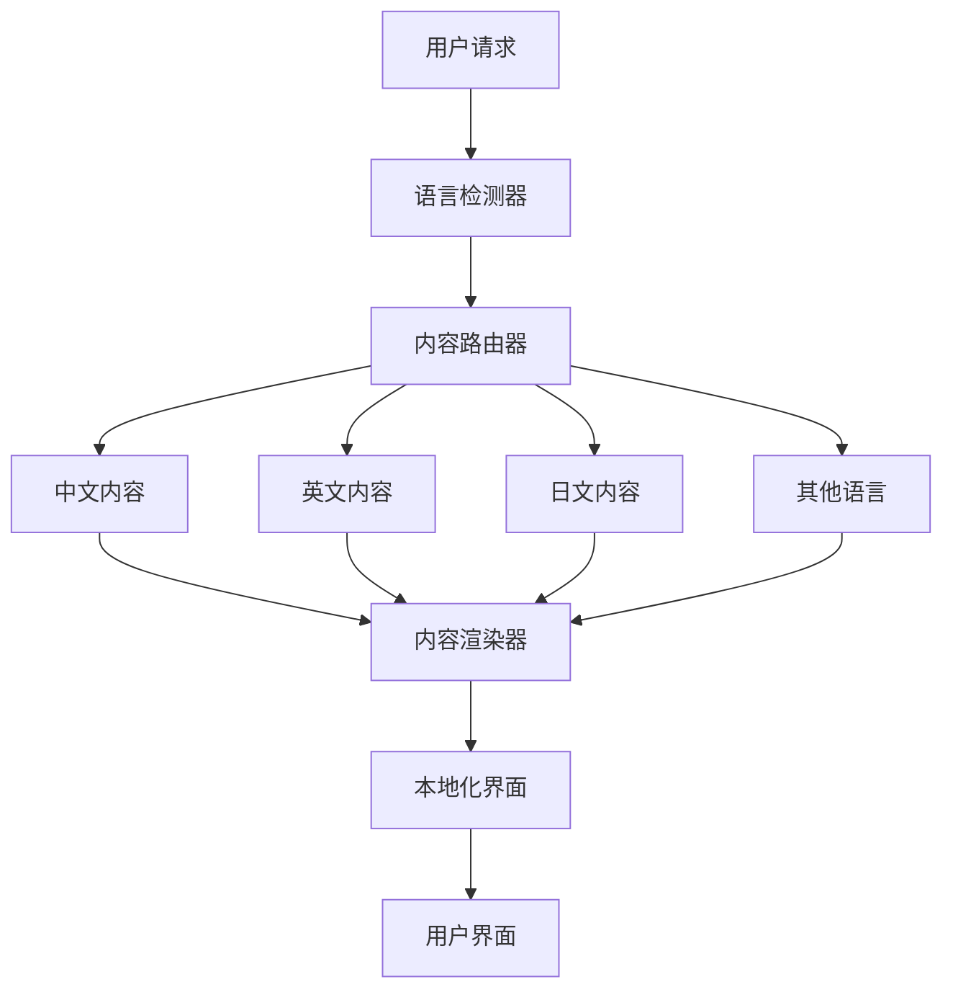

# 多语言支持框架 - 2025增强版

## 📑 目录

- [多语言支持框架 - 2025增强版](#多语言支持框架-2025增强版)
  - [📑 目录](#-目录)
- [1. 概述](#1-概述)
  - [1.1. 框架目标](#11-框架目标)
  - [1.2. 支持语言](#12-支持语言)
- [2. 技术架构](#2-技术架构)
  - [2.1. 多语言架构设计](#21-多语言架构设计)
  - [2.2. 文件结构](#22-文件结构)
- [3. 翻译管理系统](#3-翻译管理系统)
  - [3.1. 翻译管理器](#31-翻译管理器)
---


## 1. 概述

### 1.1. 框架目标

**中文目标**: 建立完整的国际化多语言支持框架，实现知识库的全球化访问和本地化体验。

**English Goal**: Establish a comprehensive internationalization and multi-language support framework to enable global access and localized experience for the knowledge base.

### 1.2. 支持语言

| 语言 | 代码 | 完成度 | 优先级 | 状态 |
|------|------|--------|--------|------|
| 中文（简体） | zh-CN | 100% | P0 | ✅ 完成 |
| 英文 | en-US | 85% | P0 | 🔄 进行中 |
| 日文 | ja-JP | 30% | P1 | 📋 计划中 |
| 德文 | de-DE | 20% | P1 | 📋 计划中 |
| 法文 | fr-FR | 15% | P2 | 📋 计划中 |
| 西班牙文 | es-ES | 10% | P2 | 📋 计划中 |
| 韩文 | ko-KR | 5% | P3 | 📋 计划中 |

## 2. 技术架构

### 2.1. 多语言架构设计



### 2.2. 文件结构

```text
Analysis/
├── zh-CN/                    # 中文内容（主语言）
│   ├── 1-数据库系统/
│   ├── 2-形式科学理论/
│   └── ...
├── en-US/                    # 英文内容
│   ├── 1-database-systems/
│   ├── 2-formal-sciences/
│   └── ...
├── ja-JP/                    # 日文内容
│   ├── 1-データベースシステム/
│   ├── 2-形式科学理論/
│   └── ...
├── i18n/                     # 国际化配置
│   ├── translations/
│   ├── locale-configs/
│   └── language-mappings/
└── tools/                    # 翻译工具
    ├── translation-manager.py
    ├── language-detector.py
    └── content-synchronizer.py
```

## 3. 翻译管理系统

### 3.1. 翻译管理器

```python
#!/usr/bin/env python3
# -*- coding: utf-8 -*-
"""
多语言翻译管理系统
支持自动翻译、人工审核、质量检查
"""

import os
import json
import yaml
from typing import Dict, List, Optional, Tuple
from dataclasses import dataclass, asdict
from datetime import datetime
import requests
from pathlib import Path
import logging

@dataclass
class TranslationTask:
    """翻译任务数据类"""
    source_file: str
    target_language: str
    target_file: str
    status: str  # pending, in_progress, completed, reviewed
    priority: int
    created_at: datetime
    updated_at: datetime
    translator: Optional[str] = None
    reviewer: Optional[str] = None
    quality_score: Optional[float] = None
    comments: List[str] = None

class TranslationManager:
    """翻译管理器"""

    def __init__(self, base_path: str = "Analysis"):
        self.base_path = Path(base_path)
        self.supported_languages = {
            'zh-CN': '中文（简体）',
            'en-US': 'English',
            'ja-JP': '日本語',
            'de-DE': 'Deutsch',
            'fr-FR': 'Français',
            'es-ES': 'Español',
            'ko-KR': '한국어'
        }
        self.translation_cache = {}
        self.quality_threshold = 0.8

    def create_translation_tasks(self, source_lang: str = 'zh-CN') -> List[TranslationTask]:
        """创建翻译任务"""

        tasks = []
        source_path = self.base_path / source_lang

# 扫描源语言文件
        for md_file in source_path.rglob("*.md"):
            relative_path = md_file.relative_to(source_path)

# 为每种目标语言创建翻译任务
            for target_lang in self.supported_languages:
                if target_lang == source_lang:
                    continue

                target_file = self.get_target_file_path(relative_path, target_lang)

# 检查是否已存在翻译
                if not target_file.exists() or self.needs_update(md_file, target_file):
                    task = TranslationTask(
                        source_file=str(md_file),
                        target_language=target_lang,
                        target_file=str(target_file),
                        status='pending',
                        priority=self.calculate_priority(relative_path),
                        created_at=datetime.now(),
                        updated_at=datetime.now()
                    )
                    tasks.append(task)

        return tasks

    def get_target_file_path(self, relative_path: Path, target_lang: str) -> Path:
        """获取目标文件路径"""

# 语言特定的路径映射
        path_mappings = {
            'en-US': {
                '1-数据库系统': '1-database-systems',
                '2-形式科学理论': '2-formal-sciences',
                '3-数据模型与算法': '3-data-models-algorithms',
                '4-软件架构与工程': '4-software-architecture-engineering',
                '5-行业应用与场景': '5-industry-applications-scenarios',
                '6-知识图谱与可视化': '6-knowledge-graphs-visualization',
                '7-持续集成与演进': '7-continuous-integration-evolution',
                '8-形式理论深化': '8-formal-theory-advanced',
                '9-软件工程深化': '9-software-engineering-advanced',
                '10-编程语言深化': '10-programming-languages-advanced'
            },
            'ja-JP': {
                '1-数据库系统': '1-データベースシステム',
                '2-形式科学理论': '2-形式科学理論',
                '3-数据模型与算法': '3-データモデルとアルゴリズム',
                '4-软件架构与工程': '4-ソフトウェアアーキテクチャとエンジニアリング',
                '5-行业应用与场景': '5-業界アプリケーションとシナリオ',
                '6-知识图谱与可视化': '6-知識グラフと可視化',
                '7-持续集成与演进': '7-継続的インテグレーションと進化',
                '8-形式理论深化': '8-形式理論の深化',
                '9-软件工程深化': '9-ソフトウェアエンジニアリングの深化',
                '10-编程语言深化': '10-プログラミング言語の深化'
            }
        }

# 应用路径映射
        path_parts = list(relative_path.parts)
        if target_lang in path_mappings:
            mapping = path_mappings[target_lang]
            if path_parts[0] in mapping:
                path_parts[0] = mapping[path_parts[0]]

        return self.base_path / target_lang / Path(*path_parts)

    def calculate_priority(self, relative_path: Path) -> int:
        """计算翻译优先级"""

# 核心模块优先级更高
        core_modules = ['1-数据库系统', '2-形式科学理论', '3-数据模型与算法']

        if any(module in str(relative_path) for module in core_modules):
            return 1  # 高优先级
        elif 'README' in str(relative_path):
            return 2  # 中优先级
        else:
            return 3  # 低优先级

    def needs_update(self, source_file: Path, target_file: Path) -> bool:
        """检查是否需要更新翻译"""

        if not target_file.exists():
            return True

# 比较文件修改时间
        source_mtime = source_file.stat().st_mtime
        target_mtime = target_file.stat().st_mtime

        return source_mtime > target_mtime

    def auto_translate(self, task: TranslationTask, use_ai: bool = True) -> str:
        """自动翻译"""

# 读取源文件
        with open(task.source_file, 'r', encoding='utf-8') as f:
            content = f.read()

        if use_ai:
# 使用AI翻译
            translated_content = self.ai_translate(content, task.target_language)
        else:
# 使用传统翻译API
            translated_content = self.api_translate(content, task.target_language)

        return translated_content

    def ai_translate(self, content: str, target_lang: str) -> str:
        """AI翻译"""

# 这里集成实际的AI翻译服务
# 例如：OpenAI GPT、Google Translate API等

# 模拟AI翻译结果
        translation_prompts = {
            'en-US': "Translate the following Chinese technical documentation to English, maintaining technical accuracy and professional tone:",
            'ja-JP': "以下の中国語の技術文書を日本語に翻訳し、技術的精度と専門的なトーンを維持してください：",
            'de-DE': "Übersetzen Sie die folgende chinesische technische Dokumentation ins Deutsche und behalten Sie dabei die technische Genauigkeit und den professionellen Ton bei:",
            'fr-FR': "Traduisez la documentation technique chinoise suivante en français en maintenant la précision technique et le ton professionnel :"
        }

        prompt = translation_prompts.get(target_lang, "Translate to target language:")

# 实际实现中会调用AI服务
# translated = ai_service.translate(content, prompt)

# 模拟翻译结果
        translated = f"[{target_lang}] {content[:100]}..."

        return translated

    def api_translate(self, content: str, target_lang: str) -> str:
        """API翻译"""

# 这里集成翻译API
# 例如：Google Translate、百度翻译、腾讯翻译等

# 模拟API翻译结果
        return f"[API-{target_lang}] {content[:100]}..."

    def quality_check(self, original: str, translated: str) -> float:
        """翻译质量检查"""

# 基础质量检查
        quality_score = 0.0

# 长度检查
        if len(translated) > len(original) * 0.5:
            quality_score += 0.2

# 格式保持检查
        if self.check_format_preservation(original, translated):
            quality_score += 0.3

# 链接保持检查
        if self.check_link_preservation(original, translated):
            quality_score += 0.2

# 代码块保持检查
        if self.check_code_preservation(original, translated):
            quality_score += 0.3

        return quality_score

    def check_format_preservation(self, original: str, translated: str) -> bool:
        """检查格式保持"""

# 检查Markdown格式
        original_headers = len(re.findall(r'^#+', original, re.MULTILINE))
        translated_headers = len(re.findall(r'^#+', translated, re.MULTILINE))

        return abs(original_headers - translated_headers) <= 1

    def check_link_preservation(self, original: str, translated: str) -> bool:
        """检查链接保持"""

        original_links = len(re.findall(r'\[.*?\]\(.*?\)', original))
        translated_links = len(re.findall(r'\[.*?\]\(.*?\)', translated))

        return original_links == translated_links

    def check_code_preservation(self, original: str, translated: str) -> bool:
        """检查代码块保持"""

        original_code_blocks = len(re.findall(r'```', original))
        translated_code_blocks = len(re.findall(r'```', translated))

        return original_code_blocks == translated_code_blocks

    def save_translation(self, task: TranslationTask, content: str):
        """保存翻译"""

# 创建目标目录
        target_path = Path(task.target_file)
        target_path.parent.mkdir(parents=True, exist_ok=True)

# 保存翻译内容
        with open(target_path, 'w', encoding='utf-8') as f:
            f.write(content)

# 更新任务状态
        task.status = 'completed'
        task.updated_at = datetime.now()

# 记录翻译历史
        self.record_translation_history(task, content)

    def record_translation_history(self, task: TranslationTask, content: str):
        """记录翻译历史"""

        history_file = self.base_path / 'i18n' / 'translation-history.json'
        history_file.parent.mkdir(parents=True, exist_ok=True)

        history_entry = {
            'task_id': f"{task.source_file}_{task.target_language}",
            'source_file': task.source_file,
            'target_language': task.target_language,
            'target_file': task.target_file,
            'translated_at': datetime.now().isoformat(),
            'content_length': len(content),
            'quality_score': task.quality_score
        }

# 读取现有历史
        if history_file.exists():
            with open(history_file, 'r', encoding='utf-8') as f:
                history = json.load(f)
        else:
            history = []

# 添加新记录
        history.append(history_entry)

# 保存历史
        with open(history_file, 'w', encoding='utf-8') as f:
            json.dump(history, f, ensure_ascii=False, indent=2)

class LanguageDetector:
    """语言检测器"""

    def __init__(self):
        self.language_patterns = {
            'zh-CN': [r'[\u4e00-\u9fff]', r'数据库', r'查询', r'优化'],
            'en-US': [r'\bthe\b', r'\band\b', r'\bof\b', r'\bin\b'],
            'ja-JP': [r'[\u3040-\u309f]', r'[\u30a0-\u30ff]', r'データベース'],
            'de-DE': [r'\bder\b', r'\bdas\b', r'\bdie\b', r'\bund\b'],
            'fr-FR': [r'\ble\b', r'\bla\b', r'\bde\b', r'\bet\b'],
            'es-ES': [r'\bel\b', r'\bla\b', r'\bde\b', r'\by\b'],
            'ko-KR': [r'[\uac00-\ud7af]', r'데이터베이스']
        }

    def detect_language(self, content: str) -> str:
        """检测内容语言"""

        scores = {}

        for lang, patterns in self.language_patterns.items():
            score = 0
            for pattern in patterns:
                matches = len(re.findall(pattern, content, re.IGNORECASE))
                score += matches

            scores[lang] = score

# 返回得分最高的语言
        return max(scores, key=scores.get) if scores else 'zh-CN'

class ContentSynchronizer:
    """内容同步器"""

    def __init__(self, translation_manager: TranslationManager):
        self.translation_manager = translation_manager
        self.sync_rules = self.load_sync_rules()

    def load_sync_rules(self) -> Dict[str, Any]:
        """加载同步规则"""

        return {
            'auto_sync': True,
            'sync_interval': 24,  # 小时
            'priority_files': ['README.md', 'index.md'],
            'exclude_patterns': ['*.tmp', '*.bak'],
            'quality_threshold': 0.8
        }

    def sync_content(self, source_lang: str = 'zh-CN'):
        """同步内容"""

        logger.info(f"开始同步 {source_lang} 内容到其他语言")

# 创建翻译任务
        tasks = self.translation_manager.create_translation_tasks(source_lang)

# 按优先级排序
        tasks.sort(key=lambda x: x.priority)

# 执行翻译
        for task in tasks:
            try:
                logger.info(f"翻译任务: {task.source_file} -> {task.target_language}")

# 自动翻译
                translated_content = self.translation_manager.auto_translate(task)

# 质量检查
                with open(task.source_file, 'r', encoding='utf-8') as f:
                    original_content = f.read()

                quality_score = self.translation_manager.quality_check(
                    original_content, translated_content
                )
                task.quality_score = quality_score

# 保存翻译
                if quality_score >= self.sync_rules['quality_threshold']:
                    self.translation_manager.save_translation(task, translated_content)
                    logger.info(f"翻译完成，质量分数: {quality_score:.2f}")
                else:
                    logger.warning(f"翻译质量不足，需要人工审核: {quality_score:.2f}")
                    task.status = 'needs_review'

            except Exception as e:
                logger.error(f"翻译任务失败: {e}")
                task.status = 'failed'

        logger.info("内容同步完成")

def main():
    """主函数"""

# 创建翻译管理器
    translation_manager = TranslationManager()

# 创建内容同步器
    synchronizer = ContentSynchronizer(translation_manager)

# 执行内容同步
    synchronizer.sync_content('zh-CN')

    print("多语言支持框架初始化完成！")

if __name__ == "__main__":
    main()
