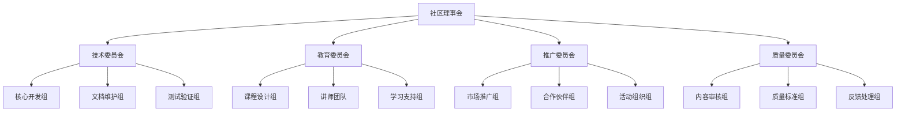
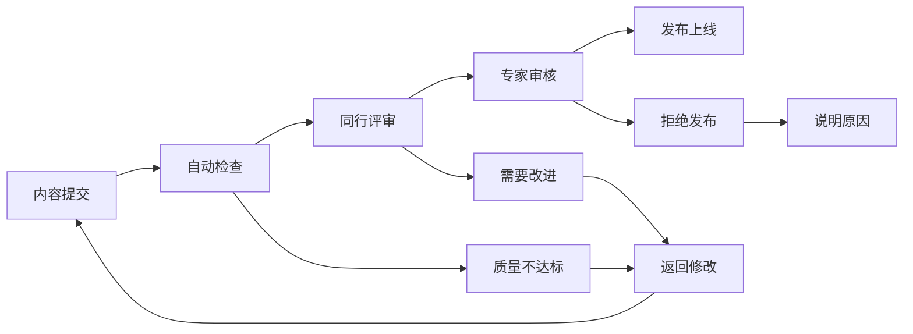
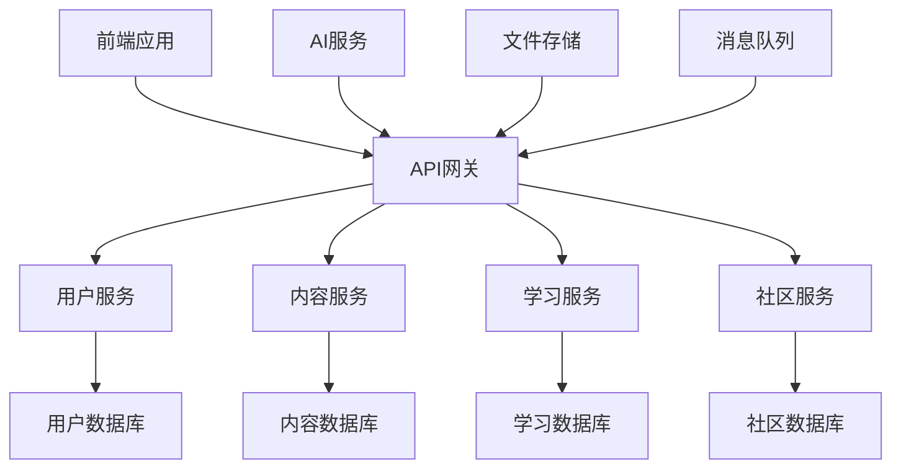

# PostgreSQL知识库社区发展计划 - 2025

## 1. 社区愿景

### 1.1 使命宣言

**中文**: 构建全球领先的PostgreSQL知识社区，推动数据库技术的创新发展和人才培养。

**English**: Build the world's leading PostgreSQL knowledge community, driving innovation in database technology and talent development.

### 1.2 核心价值

- **开放协作**: 开源精神，知识共享
- **技术卓越**: 追求技术深度和广度
- **人才培养**: 系统性的人才培养体系
- **创新驱动**: 推动技术前沿发展
- **国际化**: 全球化的技术交流平台

## 2. 社区架构

### 2.1 组织架构



### 2.2 角色定义

| 角色 | 职责 | 要求 | 权益 |
|------|------|------|------|
| **社区管理员** | 整体规划、决策制定 | 5年以上技术经验 | 决策权、资源分配权 |
| **技术专家** | 技术指导、架构设计 | 深度技术专长 | 技术影响力、荣誉认证 |
| **内容贡献者** | 文档编写、知识分享 | 相关领域经验 | 贡献认可、学习机会 |
| **讲师** | 课程开发、教学 | 教学能力、实践经验 | 教学收入、专业发展 |
| **志愿者** | 社区运营、活动支持 | 热情、时间投入 | 技能提升、人脉网络 |
| **学习者** | 学习参与、反馈提供 | 学习意愿 | 免费资源、学习支持 |

## 3. 社区发展策略

### 3.1 短期目标（3-6个月）

#### 3.1.1 社区建设

**目标**: 建立1000+活跃用户社区

**具体措施**:

- 建立官方社区平台（Discord + 论坛）
- 招募50+核心贡献者
- 举办10+技术分享活动
- 建立导师-学员配对系统

**关键指标**:

- 注册用户数: 1000+
- 月活跃用户: 300+
- 内容贡献者: 50+
- 技术文章: 100+

#### 3.1.2 内容生态

**目标**: 完善知识库内容体系

**具体措施**:

- 完成核心模块的英文翻译
- 建立用户生成内容(UGC)机制
- 实施内容质量保证体系
- 建立内容版本控制

**关键指标**:

- 文档完整性: 95%+
- 多语言覆盖率: 80%+
- 内容质量分数: 9.0+
- 用户贡献内容: 200+

### 3.2 中期目标（6-12个月）

#### 3.2.1 教育体系

**目标**: 建立完整的在线教育体系

**具体措施**:

- 开发20+专业课程
- 建立认证考试体系
- 与企业合作提供实习机会
- 建立学习路径规划系统

**关键指标**:

- 课程数量: 20+
- 学员数量: 5000+
- 认证通过率: 80%+
- 就业成功率: 70%+

#### 3.2.2 技术生态

**目标**: 构建完整的技术生态系统

**具体措施**:

- 开发开源工具和插件
- 建立API接口和SDK
- 与主流云平台集成
- 建立技术标准规范

**关键指标**:

- 开源项目: 10+
- API调用量: 100万+/月
- 云平台集成: 5+
- 技术标准: 3+

### 3.3 长期目标（1-3年）

#### 3.3.1 全球影响力

**目标**: 成为全球PostgreSQL技术权威

**具体措施**:

- 参与国际标准制定
- 举办国际技术会议
- 建立全球合作伙伴网络
- 推动技术前沿研究

**关键指标**:

- 国际会议参与: 10+/年
- 合作伙伴: 50+
- 技术论文: 20+
- 标准贡献: 5+

#### 3.3.2 商业化发展

**目标**: 建立可持续的商业模式

**具体措施**:

- 提供企业级服务
- 开发商业产品
- 建立培训认证体系
- 开展咨询服务

**关键指标**:

- 年收入: 1000万+
- 企业客户: 100+
- 服务覆盖: 全球
- 盈利能力: 30%+

## 4. 社区运营机制

### 4.1 贡献者激励体系

#### 4.1.1 积分系统

```python
class ContributorPoints:
    """贡献者积分系统"""
    
    POINT_RULES = {
        'document_creation': 50,      # 创建文档
        'document_improvement': 30,   # 改进文档
        'bug_report': 20,            # 报告问题
        'bug_fix': 40,               # 修复问题
        'translation': 25,           # 翻译内容
        'code_contribution': 60,     # 代码贡献
        'teaching': 80,              # 教学活动
        'community_help': 15,        # 社区帮助
        'event_organization': 100,   # 活动组织
    }
    
    LEVELS = {
        'Bronze': 100,      # 青铜
        'Silver': 500,      # 白银
        'Gold': 1000,       # 黄金
        'Platinum': 2500,   # 白金
        'Diamond': 5000,    # 钻石
    }
    
    def calculate_level(self, total_points):
        """计算贡献者等级"""
        for level, threshold in reversed(self.LEVELS.items()):
            if total_points >= threshold:
                return level
        return 'Bronze'
```

#### 4.1.2 奖励机制

| 等级 | 积分要求 | 奖励内容 |
|------|----------|----------|
| **青铜** | 100+ | 社区徽章、学习资源 |
| **白银** | 500+ | 技术书籍、在线课程 |
| **黄金** | 1000+ | 会议门票、技术培训 |
| **白金** | 2500+ | 导师指导、项目合作 |
| **钻石** | 5000+ | 技术顾问、商业合作 |

### 4.2 质量保证机制

#### 4.2.1 内容审核流程



#### 4.2.2 质量标准

**技术准确性**:

- 代码示例可运行
- 理论描述准确
- 最佳实践验证

**内容完整性**:

- 结构清晰完整
- 覆盖核心要点
- 提供实际案例

**可读性**:

- 语言表达清晰
- 逻辑结构合理
- 图表说明充分

### 4.3 社区治理

#### 4.3.1 决策机制

**理事会决策**:

- 重大战略决策
- 资源分配决策
- 政策制定决策

**社区投票**:

- 技术方向选择
- 功能优先级
- 社区规则修改

**专家评审**:

- 技术方案评估
- 内容质量审核
- 标准制定参与

#### 4.3.2 冲突解决

**分级处理**:

1. 社区调解
2. 委员会仲裁
3. 理事会裁决

**处理原则**:

- 公平公正
- 透明公开
- 尊重包容

## 5. 合作伙伴生态

### 5.1 企业合作伙伴

#### 5.1.1 技术合作伙伴

| 合作伙伴类型 | 合作内容 | 预期收益 |
|-------------|----------|----------|
| **云服务商** | 技术集成、联合推广 | 用户增长、技术验证 |
| **数据库厂商** | 技术交流、标准制定 | 技术影响力、生态建设 |
| **培训机构** | 课程合作、认证体系 | 收入分成、品牌推广 |
| **咨询公司** | 项目合作、人才推荐 | 商业机会、专业网络 |

#### 5.1.2 教育合作伙伴

**高等院校**:

- 课程共建
- 实习基地
- 研究合作

**职业培训机构**:

- 课程认证
- 师资培训
- 就业推荐

### 5.2 开源社区合作

#### 5.2.1 PostgreSQL官方社区

**合作内容**:

- 技术贡献
- 文档翻译
- 社区活动

**合作方式**:

- 定期技术交流
- 联合举办活动
- 共同制定标准

#### 5.2.2 其他开源项目

**相关项目**:

- 数据库工具项目
- 开发框架项目
- 监控运维项目

**合作形式**:

- 技术集成
- 文档共享
- 社区互推

## 6. 活动策划

### 6.1 定期活动

#### 6.1.1 技术分享会

**频率**: 每月2次
**形式**: 在线直播 + 录播
**内容**:

- 技术深度分享
- 最佳实践案例
- 新特性介绍
- 问题解答

#### 6.1.2 代码审查会

**频率**: 每周1次
**形式**: 在线协作
**内容**:

- 代码质量审查
- 最佳实践讨论
- 技术问题解决
- 经验分享

#### 6.1.3 学习小组

**频率**: 每周1次
**形式**: 小组讨论
**内容**:

- 专题学习
- 项目实践
- 经验交流
- 互助学习

### 6.2 年度活动

#### 6.2.1 PostgreSQL技术大会

**时间**: 每年秋季
**规模**: 500+ 参与者
**内容**:

- 主题演讲
- 技术分享
- 产品展示
- 网络交流

#### 6.2.2 开发者训练营

**时间**: 每年夏季
**规模**: 100+ 学员
**内容**:

- 集中培训
- 项目实践
- 导师指导
- 成果展示

## 7. 技术平台建设

### 7.1 社区平台

#### 7.1.1 功能需求

**核心功能**:

- 用户管理系统
- 内容发布系统
- 讨论交流系统
- 学习跟踪系统

**高级功能**:

- AI智能推荐
- 实时协作编辑
- 多媒体支持
- 移动端适配

#### 7.1.2 技术架构



### 7.2 开发工具

#### 7.2.1 内容管理工具

**功能特性**:

- 可视化编辑器
- 版本控制集成
- 协作编辑支持
- 质量检查工具

#### 7.2.2 学习管理工具

**功能特性**:

- 学习路径规划
- 进度跟踪
- 知识图谱
- 个性化推荐

## 8. 成功指标

### 8.1 社区指标

| 指标类别 | 具体指标 | 目标值 | 时间节点 |
|---------|---------|--------|----------|
| **用户增长** | 注册用户数 | 10,000+ | 12个月 |
| | 月活跃用户 | 3,000+ | 12个月 |
| | 日活跃用户 | 1,000+ | 12个月 |
| **内容质量** | 文档数量 | 1,000+ | 12个月 |
| | 内容质量分数 | 9.0+ | 持续 |
| | 用户满意度 | 90%+ | 持续 |
| **社区活跃** | 日发帖数 | 100+ | 12个月 |
| | 问题解决率 | 80%+ | 持续 |
| | 贡献者数量 | 200+ | 12个月 |

### 8.2 技术指标

| 指标类别 | 具体指标 | 目标值 | 时间节点 |
|---------|---------|--------|----------|
| **平台性能** | 响应时间 | <2秒 | 持续 |
| | 可用性 | 99.9%+ | 持续 |
| | 并发用户 | 1,000+ | 12个月 |
| **内容覆盖** | 多语言支持 | 5种语言 | 12个月 |
| | 技术领域 | 10个领域 | 12个月 |
| | 更新频率 | 每日更新 | 持续 |

### 8.3 商业指标

| 指标类别 | 具体指标 | 目标值 | 时间节点 |
|---------|---------|--------|----------|
| **收入增长** | 年收入 | 1000万+ | 24个月 |
| | 付费用户 | 1,000+ | 24个月 |
| | 企业客户 | 100+ | 24个月 |
| **市场影响** | 品牌知名度 | 行业前3 | 24个月 |
| | 技术影响力 | 国际认可 | 36个月 |
| | 合作伙伴 | 50+ | 24个月 |

## 9. 风险管控

### 9.1 技术风险

**风险识别**:

- 技术架构扩展性
- 数据安全保护
- 系统稳定性
- 性能瓶颈

**应对措施**:

- 微服务架构设计
- 多层安全防护
- 高可用部署
- 性能监控优化

### 9.2 运营风险

**风险识别**:

- 社区管理难度
- 内容质量控制
- 用户流失风险
- 竞争压力

**应对措施**:

- 建立管理团队
- 完善审核机制
- 提升用户体验
- 差异化定位

### 9.3 商业风险

**风险识别**:

- 盈利模式不清晰
- 资金链断裂
- 市场变化
- 政策风险

**应对措施**:

- 多元化收入来源
- 风险投资引入
- 市场趋势跟踪
- 合规性管理

## 10. 实施计划

### 10.1 第一阶段（1-3个月）

**重点任务**:

- 建立社区平台
- 招募核心团队
- 完善基础内容
- 启动用户招募

**关键里程碑**:

- 平台上线
- 100+注册用户
- 核心团队到位
- 基础内容完善

### 10.2 第二阶段（4-6个月）

**重点任务**:

- 扩大用户规模
- 丰富内容生态
- 建立合作伙伴
- 举办社区活动

**关键里程碑**:

- 1000+注册用户
- 500+内容条目
- 10+合作伙伴
- 20+社区活动

### 10.3 第三阶段（7-12个月）

**重点任务**:

- 商业化探索
- 技术生态建设
- 国际化发展
- 品牌建设

**关键里程碑**:

- 商业化产品上线
- 技术标准发布
- 国际合作伙伴
- 行业影响力建立

---

*本社区发展计划将根据实际情况和市场变化进行动态调整，确保社区健康可持续发展。*
