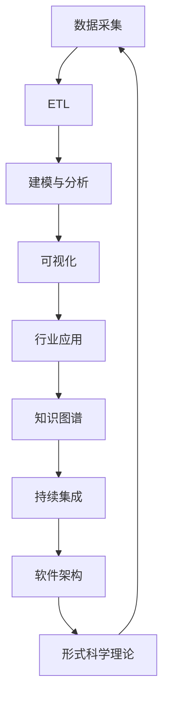

# 数据科学知识导航索引

## 📑 目录

- [数据科学知识导航索引](#数据科学知识导航索引)
  - [📑 目录](#-目录)
- [1. 项目概述](#1-项目概述)
- [2. 核心模块导航](#2-核心模块导航)
  - [2.1. 数据库系统模块](#21-数据库系统模块)
    - [2.1.1. PostgreSQL](#211-postgresql)
  - [2.2. 形式科学理论模块](#22-形式科学理论模块)
    - [2.2.1. 类型理论](#221-类型理论)
    - [2.2.2. 自动机理论](#222-自动机理论)
    - [2.2.3. Petri网理论](#223-petri网理论)
    - [2.2.4. 时态逻辑控制理论](#224-时态逻辑控制理论)
    - [2.2.5. 分布式系统理论](#225-分布式系统理论)
    - [2.2.6. 控制理论](#226-控制理论)
    - [2.2.7. 数学基础理论](#227-数学基础理论)
    - [2.2.8. 编程语言理论](#228-编程语言理论)
    - [2.2.9. 哲学基础理论](#229-哲学基础理论)
  - [2.3. 数据模型与算法模块](#23-数据模型与算法模块)
    - [2.3.1. 基础理论](#231-基础理论)
    - [2.3.2. 形式化模型](#232-形式化模型)
    - [2.3.3. 算法实现](#233-算法实现)
    - [2.3.4. AI与机器学习算法](#234-ai与机器学习算法)
  - [2.4. 软件架构与工程模块](#24-软件架构与工程模块)
    - [2.4.1. 基础理论](#241-基础理论)
    - [2.4.2. 设计模式](#242-设计模式)
    - [2.4.3. 微服务架构](#243-微服务架构)
    - [2.4.4. IOT](#244-iot)
    - [2.4.5. WorkflowDomain](#245-workflowdomain)
  - [2.5. 行业应用与场景模块](#25-行业应用与场景模块)
    - [2.5.1. 金融数据分析](#251-金融数据分析)
    - [2.5.2. 科学计算](#252-科学计算)
    - [2.5.3. 机器学习](#253-机器学习)
  - [2.6. 知识图谱与可视化模块](#26-知识图谱与可视化模块)
    - [2.6.1. 知识表示](#261-知识表示)
    - [2.6.2. 关系建模](#262-关系建模)
    - [2.6.3. 可视化技术](#263-可视化技术)
  - [2.7. 持续集成与演进模块](#27-持续集成与演进模块)
    - [2.7.1. 版本控制](#271-版本控制)
    - [2.7.2. 自动化测试](#272-自动化测试)
    - [2.7.3. 部署流程](#273-部署流程)
    - [2.7.4. CI_CD](#274-ci_cd)
    - [2.7.5. 监控与可观测](#275-监控与可观测)
- [3. 概念快速查找](#3-概念快速查找)
  - [3.1. 按技术领域分类](#31-按技术领域分类)
    - [3.1.1. 数据库技术](#311-数据库技术)
    - [3.1.2. 机器学习](#312-机器学习)
    - [3.1.3. 软件架构](#313-软件架构)
    - [3.1.4. 形式化理论](#314-形式化理论)
  - [3.2. 按应用场景分类](#32-按应用场景分类)
    - [3.2.1. 数据科学项目](#321-数据科学项目)
    - [3.2.2. 软件系统开发](#322-软件系统开发)
    - [3.2.3. 理论研究](#323-理论研究)
- [4. 学习路径推荐](#4-学习路径推荐)
  - [4.1. 初学者路径](#41-初学者路径)
  - [4.2. 进阶学习路径](#42-进阶学习路径)
  - [4.3. 专业领域路径](#43-专业领域路径)
- [5. 项目进度跟踪](#5-项目进度跟踪)
- [6. 贡献指南](#6-贡献指南)
  - [6.1. 内容贡献](#61-内容贡献)
  - [6.2. 质量保证](#62-质量保证)
- [7. 知识导航索引（全局主题索引与交叉引用）](#7-知识导航索引全局主题索引与交叉引用)
- [8. 全局主题索引](#8-全局主题索引)
- [9. 主题交叉引用表](#9-主题交叉引用表)
- [10. 知识流导航（全链路）](#10-知识流导航全链路)
- [11. 国际化与英文入口](#11-国际化与英文入口)
---

## 1. 项目概述

本索引为数据科学知识体系提供全局导航，帮助用户快速定位和查找相关内容。整个知识体系分为七大核心模块，每个模块都包含完整的理论基础和实践应用。

## 2. 核心模块导航

### 2.1. 数据库系统模块

**理论基础**：关系代数、事务理论、并发控制
**应用领域**：数据存储、查询优化、事务管理

#### 2.1.1. PostgreSQL

- [1.1.21 PostgreSQL 2025最新特性全面分析](1-数据库系统/1.1-PostgreSQL/1.1.21-PostgreSQL-2025最新特性全面分析.md) - 2025特性总览
- [1.1.22 PostgreSQL 2025代码实现与形式证明](1-数据库系统/1.1-PostgreSQL/1.1.22-PostgreSQL-2025代码实现与形式证明.md) - 代码与证明
- [1.1.144 PostgreSQL 2025年新特性深度分析](1-数据库系统/1.1-PostgreSQL/1.1.144-PostgreSQL-2025年新特性深度分析.md) - 深度剖析与案例
- [1.1.145 PostgreSQL 2025特性落地指南与实操](1-数据库系统/1.1-PostgreSQL/1.1.145-PostgreSQL-2025特性-落地指南与实操.md) - 部署配置与回退
- [1.1.1 形式模型](1-数据库系统/1.1-PostgreSQL/1.1.1-形式模型.md) - 数据库形式化理论
- [1.1.2 数据模型](1-数据库系统/1.1-PostgreSQL/1.1.2-关系数据模型.md) - 关系数据模型
- [1.1.3 查询语言](1-数据库系统/1.1-PostgreSQL/1.1.3-查询语言.md) - SQL语言理论
- [1.1.4 事务管理](1-数据库系统/1.1-PostgreSQL/1.1.4-事务管理.md) - ACID事务理论
- [1.1.5 并发控制](1-数据库系统/1.1-PostgreSQL/1.1.5-并发控制.md) - 并发控制机制
- [1.1.6 索引优化](1-数据库系统/1.1-PostgreSQL/1.1.6-索引优化.md) - 索引策略优化
- [1.1.7 存储引擎](1-数据库系统/1.1-PostgreSQL/1.1.7-存储引擎.md) - 存储引擎设计
- [1.1.8 备份恢复](1-数据库系统/1.1-PostgreSQL/1.1.8-备份恢复.md) - 数据备份策略
- [1.1.9 性能调优](1-数据库系统/1.1-PostgreSQL/1.1.9-性能调优.md) - 性能优化技术
- [1.1.10 MVCC对比分析](1-数据库系统/1.1-PostgreSQL/1.1.10-MVCC与其他并发控制模型对比与极限分析.md) - 并发控制深度分析
- [1.1.11 系统设计分析](1-数据库系统/1.1-PostgreSQL/1.1.11-PostgreSQL系统设计与现代硬件AI场景适配性分析.md) - 系统设计分析

### 2.2. 形式科学理论模块

**理论基础**：数学、逻辑学、哲学
**应用领域**：形式化验证、系统建模、理论证明

#### 2.2.1. 类型理论

- [2.1.1 基础类型理论](2-形式科学理论/2.1-类型理论/2.1.1-基础类型理论.md) - 类型系统基础
- [2.1.2 线性类型理论](2-形式科学理论/2.1-类型理论/2.1.2-线性类型理论.md) - 线性类型系统

#### 2.2.2. 自动机理论

- [2.2.1 自动机理论基础](2-形式科学理论/2.2-自动机理论/2.2.1-自动机理论基础.md) - 计算理论基础

#### 2.2.3. Petri网理论

- [2.3.1 Petri网理论基础](2-形式科学理论/2.3-Petri网理论/2.3.1-Petri网理论基础.md) - 并发理论基础
- [2.3.2 Petri网高级理论与应用](2-形式科学理论/2.3-Petri网理论/2.3.2-Petri网高级理论与应用.md) - 高级Petri网应用

#### 2.2.4. 时态逻辑控制理论

- [2.4.1 时态逻辑控制理论基础](2-形式科学理论/2.4-时态逻辑控制理论/2.4.1-时态逻辑控制理论基础.md) - 时间逻辑控制

#### 2.2.5. 分布式系统理论

- [2.5.1 分布式系统理论基础](2-形式科学理论/2.5-分布式系统理论/2.5.1-分布式系统理论基础.md) - 分布式系统基础

#### 2.2.6. 控制理论

- [2.6.1 控制理论基础](2-形式科学理论/2.6-控制理论/2.6.1-控制理论基础.md) - 控制系统理论

#### 2.2.7. 数学基础理论

- [2.7.1 数学基础理论框架](2-形式科学理论/2.7-数学基础理论/2.7.1-数学基础理论框架.md) - 数学理论体系

#### 2.2.8. 编程语言理论

- [2.8.1 编程语言基础理论](2-形式科学理论/2.8-编程语言理论/2.8.1-编程语言基础理论.md) - 语言理论基础

#### 2.2.9. 哲学基础理论

- [2.9.1 哲学基础理论框架](2-形式科学理论/2.9-哲学基础理论/2.9.1-哲学基础理论框架.md) - 哲学理论体系

### 2.3. 数据模型与算法模块

**理论基础**：数据结构、算法理论、统计学习
**应用领域**：数据处理、机器学习、算法优化

#### 2.3.1. 基础理论

- [3.1.1 数据科学基础理论框架](3-数据模型与算法/3.1-基础理论/3.1.1-数据科学基础理论框架.md) - 数据科学基础
- [3.1.20 数据科学系统性分析框架](3-数据模型与算法/3.1-数据科学基础理论/3.1.20-数据科学系统性分析框架.md) - 系统性框架
- [3.1.21 实时数据处理与流计算理论](3-数据模型与算法/3.1-数据科学基础理论/3.1.21-实时数据处理与流计算理论.md) - 流处理理论
- [3.1.22 数据科学与机器学习理论体系](3-数据模型与算法/3.1-数据科学基础理论/3.1.22-数据科学与机器学习理论体系.md) - 理论体系
- [3.1.23 深度学习架构设计](3-数据模型与算法/3.1-数据科学基础理论/3.1.23-深度学习架构设计.md) - 深度学习
- [3.1.24 强化学习高级理论](3-数据模型与算法/3.1-数据科学基础理论/3.1.24-强化学习高级理论.md) - 强化学习
- [3.1.25 数据科学2025年发展趋势深度分析](3-数据模型与算法/3.1-数据科学基础理论/3.1.25-数据科学2025年发展趋势深度分析.md) - 发展趋势

#### 2.3.2. 形式化模型

- [3.2.1 数据模型的形式化理论](3-数据模型与算法/3.2-形式化模型/3.2.1-数据模型的形式化理论.md) - 数据模型理论

#### 2.3.3. 算法实现

- [3.3.1 核心数据处理算法](3-数据模型与算法/3.3-算法实现/3.3.1-核心数据处理算法.md) - 核心算法实现
- [3.3.2 查询优化算法](3-数据模型与算法/3.3-算法实现/3.3.2-查询优化算法.md) - 查询优化
- [3.3.3 并发控制算法](3-数据模型与算法/3.3-算法实现/3.3.3-并发控制算法.md) - 并发控制

#### 2.3.4. AI与机器学习算法

- [3.4.1 机器学习基础理论](3-数据模型与算法/3.4-AI与机器学习算法/3.4.1-机器学习基础理论.md) - 机器学习基础
- [3.4.2 监督学习算法](3-数据模型与算法/3.4-AI与机器学习算法/3.4.2-监督学习算法.md) - 监督学习
- [3.4.3 无监督学习算法](3-数据模型与算法/3.4-AI与机器学习算法/3.4.3-无监督学习算法.md) - 无监督学习
- [3.4.4 强化学习算法](3-数据模型与算法/3.4-AI与机器学习算法/3.4.4-强化学习算法.md) - 强化学习
- [3.4.5 深度学习算法](3-数据模型与算法/3.4-AI与机器学习算法/3.4.5-深度学习算法.md) - 深度学习
- [3.4.6 自然语言处理算法](3-数据模型与算法/3.4-AI与机器学习算法/3.4.6-自然语言处理算法.md) - 自然语言处理
- [3.4.7 计算机视觉算法](3-数据模型与算法/3.4-AI与机器学习算法/3.4.7-计算机视觉算法.md) - 计算机视觉
- [3.4.8 推荐系统算法](3-数据模型与算法/3.4-AI与机器学习算法/3.4.8-推荐系统算法.md) - 推荐系统
- [3.4.9 图神经网络算法](3-数据模型与算法/3.4-AI与机器学习算法/3.4.9-图神经网络算法.md) - 图神经网络
- [3.4.10 多模态与大规模AI](3-数据模型与算法/3.4-AI与机器学习算法/3.4.10-多模态与大规模AI.md) - 多模态AI

### 2.4. 软件架构与工程模块

**理论基础**：软件工程、系统设计、架构模式
**应用领域**：系统架构、软件设计、工程实践

#### 2.4.1. 基础理论

- [4.1.1 软件架构基础理论](4-软件架构与工程/4.1-基础理论/4.1.1-软件架构基础理论.md) - 软件架构基础

#### 2.4.2. 设计模式

- [4.2.1 设计模式基础理论](4-软件架构与工程/4.2-设计模式/4.2.1-设计模式基础理论.md) - 设计模式理论

#### 2.4.3. 微服务架构

- [4.3.1 微服务架构基础理论](4-软件架构与工程/4.3-微服务架构/4.3.1-微服务架构基础理论.md) - 微服务架构

#### 2.4.4. IOT

- [4.4.1 IOT基础理论](4-软件架构与工程/4.4-IOT/4.4.1-IOT基础理论.md) - 物联网基础

#### 2.4.5. WorkflowDomain

- [4.5.1 工作流基础理论](4-软件架构与工程/4.5-WorkflowDomain/4.5.1-工作流基础理论.md) - 工作流基础

### 2.5. 行业应用与场景模块

**理论基础**：领域知识、业务模型、应用理论
**应用领域**：金融、科学计算、机器学习应用

#### 2.5.1. 金融数据分析

- [5.1.1 金融数据科学基础理论](5-行业应用与场景/5.1-金融数据分析/5.1.1-金融数据科学基础理论.md) - 金融数据科学
- [5.1.9 金融科技应用](5-行业应用与场景/5.1-金融数据分析/5.1.9-金融科技应用.md) - 金融+科技融合场景
- [5.1.10 智能制造应用](5-行业应用与场景/5.1-金融数据分析/5.1.10-智能制造应用.md) - 工业4.0/数字孪生/预测维护
- [5.1.11 医疗健康应用](5-行业应用与场景/5.1-金融数据分析/5.1.11-医疗健康应用.md) - 影像/药物/个性化医疗
- [5.1.12 教育科技应用](5-行业应用与场景/5.1-金融数据分析/5.1.12-教育科技应用.md) - 个性化学习/智能评测

#### 2.5.2. 科学计算

- 科学计算应用场景

#### 2.5.3. 机器学习

- 机器学习应用场景

### 2.6. 知识图谱与可视化模块

**理论基础**：知识表示、图论、可视化理论
**应用领域**：知识图谱、数据可视化、关系建模

#### 2.6.1. 知识表示

- [6.1.1 知识表示基础理论](6-知识图谱与可视化/6.1-知识表示/6.1.1-知识表示基础理论.md) - 知识表示理论

#### 2.6.2. 关系建模

- [6.2.1 关系建模基础理论](6-知识图谱与可视化/6.2-关系建模/6.2.1-关系建模基础理论.md) - 关系建模理论

#### 2.6.3. 可视化技术

- [6.3.1 可视化技术基础理论](6-知识图谱与可视化/6.3-可视化技术/6.3.1-可视化技术基础理论.md) - 可视化技术

### 2.7. 持续集成与演进模块

**理论基础**：版本控制、测试理论、部署理论
**应用领域**：CI/CD、自动化测试、部署管理

#### 2.7.1. 版本控制

- [7.1.1 版本控制基础理论](7-持续集成与演进/7.1-版本控制/7.1.1-版本控制基础理论.md) - 版本控制理论

#### 2.7.2. 自动化测试

- [7.2.1 自动化测试基础理论](7-持续集成与演进/7.2-自动化测试/7.2.1-自动化测试基础理论.md) - 自动化测试
- [7.2.9 自动化测试框架](7-持续集成与演进/7.2-自动化测试/7.2.9-自动化测试框架.md) - 分层测试与门禁

#### 2.7.3. 部署流程

- [7.3.1 部署流程基础理论](7-持续集成与演进/7.3-部署流程/7.3.1-部署流程基础理论.md) - 部署流程

#### 2.7.4. CI_CD

- [7.4.1 CI_CD最佳实践](7-持续集成与演进/7.4-CI_CD/7.4.1-CI_CD最佳实践.md) - CI/CD实践

#### 2.7.5. 监控与可观测

- [7.5.1 性能监控系统](7-持续集成与演进/7.5-监控与可观测/7.5.1-性能监控系统.md) - OTel/Prom/Grafana

## 3. 概念快速查找

### 3.1. 按技术领域分类

#### 3.1.1. 数据库技术

- **关系数据库**：1.1.1-1.1.11
- **事务管理**：1.1.4, 1.1.5, 1.1.10
- **性能优化**：1.1.6, 1.1.9

#### 3.1.2. 机器学习

- **基础理论**：3.4.1
- **监督学习**：3.4.2
- **无监督学习**：3.4.3
- **强化学习**：3.4.4
- **深度学习**：3.4.5
- **应用领域**：3.4.6-3.4.10

#### 3.1.3. 软件架构

- **架构理论**：4.1.1
- **设计模式**：4.2.1
- **微服务**：4.3.1
- **物联网**：4.4.1
- **工作流**：4.5.1

#### 3.1.4. 形式化理论

- **类型理论**：2.1.1-2.1.2
- **自动机理论**：2.2.1
- **Petri网**：2.3.1-2.3.2
- **时态逻辑**：2.4.1
- **分布式系统**：2.5.1
- **控制理论**：2.6.1
- **数学基础**：2.7.1
- **编程语言**：2.8.1
- **哲学基础**：2.9.1

### 3.2. 按应用场景分类

#### 3.2.1. 数据科学项目

1. **数据获取与存储**：1.1.1-1.1.11
2. **数据建模**：3.2.1
3. **算法实现**：3.3.1-3.3.3
4. **机器学习**：3.4.1-3.4.10
5. **可视化**：6.3.1

#### 3.2.2. 软件系统开发

1. **架构设计**：4.1.1
2. **设计模式**：4.2.1
3. **微服务架构**：4.3.1
4. **测试与部署**：7.1.1 → 7.4.1

#### 3.2.3. 理论研究

1. **形式化理论**：2.1.1-2.9.1
2. **数学基础**：2.7.1
3. **哲学基础**：2.9.1

## 4. 学习路径推荐

### 4.1. 初学者路径

1. **数据科学基础**：3.1.1 → 3.2.1 → 3.3.1
2. **机器学习入门**：3.4.1 → 3.4.2 → 3.4.5
3. **数据库基础**：1.1.1 → 1.1.2 → 1.1.3
4. **软件架构入门**：4.1.1 → 4.2.1

### 4.2. 进阶学习路径

1. **形式化理论**：2.7.1 → 2.1.1 → 2.2.1 → 2.3.1
2. **高级机器学习**：3.4.4 → 3.4.6 → 3.4.9
3. **分布式系统**：2.5.1 → 4.3.1 → 4.4.1
4. **工程实践**：7.1.1 → 7.2.1 → 7.4.1

### 4.3. 专业领域路径

1. **AI/ML专家**：2.9.1 → 3.4.1-3.4.10 → 6.1.1
2. **系统架构师**：2.5.1 → 4.1.1 → 4.3.1 → 7.4.1
3. **数据工程师**：1.1.1-1.1.11 → 3.2.1 → 3.3.1-3.3.3
4. **理论研究者**：2.7.1 → 2.1.1-2.9.1 → 3.1.1

## 5. 项目进度跟踪

- [项目进度跟踪](7-持续集成与演进/项目进度跟踪.md) - 查看项目最新进展
- [重构规划与规范化方案](重构规划与规范化方案.md) - 项目规划文档

## 6. 贡献指南

### 6.1. 内容贡献

1. 遵循学术规范，确保内容准确性
2. 提供代码示例和实际应用案例
3. 建立与其他模块的交叉引用
4. 保持文档结构的一致性

### 6.2. 质量保证

1. 所有理论都有严格的数学证明
2. 代码示例经过测试和验证
3. 建立完整的参考文献体系
4. 定期更新和维护内容

---

**最后更新**：2024年12月
**维护者**：数据科学项目团队
**版本**：v1.0

## 7. 知识导航索引（全局主题索引与交叉引用）

## 8. 全局主题索引

- [数据库系统](./1-数据库系统/README.md)
- [形式科学理论](./2-形式科学理论/README.md)
- [数据模型与算法](./3-数据模型与算法/README.md)
- [软件架构与工程](./4-软件架构与工程/README.md)
- [行业应用与场景](./5-行业应用与场景/README.md)
- [知识图谱与可视化](./6-知识图谱与可视化/README.md)
- [持续集成与演进](./7-持续集成与演进/README.md)

---

## 9. 主题交叉引用表

| 主题 | 相关主题 | 典型交叉文件 |
|------|----------|--------------|
| 数据库系统 | 数据模型、AI、行业应用 | 1.1.6-AI与PostgreSQL集成、3.5.7-数据存储与访问 |
| 形式科学理论 | 软件架构、AI、知识图谱 | 2.1-类型理论、2.3-Petri网理论、4.1-基础理论 |
| 数据模型与算法 | AI、可视化、行业应用 | 3.4-AI与机器学习算法、3.5-数据分析与ETL |
| 软件架构与工程 | 持续集成、行业应用 | 4.3-微服务架构、7-持续集成与演进 |
| 行业应用与场景 | 数据科学、知识图谱 | 5.1-金融数据分析、6-知识图谱与可视化 |
| 知识图谱与可视化 | 行业应用、AI | 6.1-知识表示、6.3-可视化技术 |
| 持续集成与演进 | 软件架构、AI | 7.4-CI_CD、4.3-微服务架构 |

---

## 10. 知识流导航（全链路）

- 数据采集 → ETL → 建模与分析 → 可视化 → 行业应用 → 自动化集成 → 持续演进 → 形式化理论
- 典型案例：金融风控、科学仿真、AI平台、医疗诊断、工业互联网等

---

- 本索引便于全局检索、主题串联与知识流导航，支持多表征与行业案例的快速定位。
- 推荐结合各分支README与行业案例进行深度学习与应用。

## 11. 国际化与英文入口

- EN 入口（PostgreSQL 2025 核心文档）：
  - [1.1.144 PostgreSQL 2025 Features Deep Analysis](en-US/1-database-systems/1.1-postgresql/1.1.144-postgresql-2025-features-deep-analysis.md)
  - [1.1.145 PostgreSQL 2025 Features — Deployment Guide and Operations](en-US/1-database-systems/1.1-postgresql/1.1.145-postgresql-2025-features-deployment-guide-and-operations.md)
  - [1.1.146 PostgreSQL 2025 — Experiments and Benchmarks](en-US/1-database-systems/1.1-postgresql/1.1.146-postgresql-2025-experiments-and-benchmarks.md)
- 提示：英文文档将逐步与中文保持同步更新。
