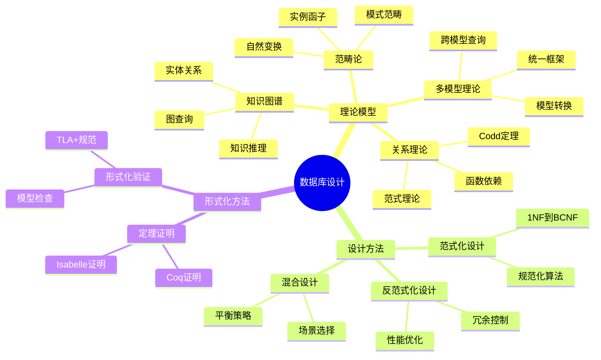
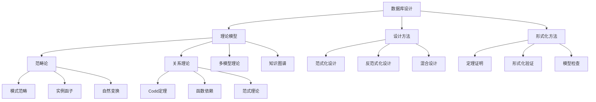

# 数据库设计理论扩展计划

> **创建日期**：2025-01-15
> **最后更新**：2025-01-15
> **版本**：v1.0
> **状态**：规划中

---

## 📋 目录

- [1. 概述](#1-概述)
- [2. 理论模型对标](#2-理论模型对标)
  - [2.1. 范畴论（Category Theory）](#21-范畴论category-theory)
  - [2.2. 关系数据库理论](#22-关系数据库理论)
  - [2.3. 多模型数据库理论](#23-多模型数据库理论)
  - [2.4. 知识图谱理论](#24-知识图谱理论)
  - [2.5. 形式化方法](#25-形式化方法)
- [3. 思维表征方式](#3-思维表征方式)
  - [3.1. 思维导图](#31-思维导图)
  - [3.2. 多维矩阵](#32-多维矩阵)
  - [3.3. 概念地图](#33-概念地图)
  - [3.4. 形式化表示](#34-形式化表示)
- [4. 形式化证明与论证](#4-形式化证明与论证)
  - [4.1. 定理证明](#41-定理证明)
  - [4.2. 形式化验证](#42-形式化验证)
  - [4.3. 概念定义与属性关系](#43-概念定义与属性关系)
- [5. 权威资源对标](#5-权威资源对标)
  - [5.1. Wikipedia对标](#51-wikipedia对标)
  - [5.2. 大学课程对标](#52-大学课程对标)
  - [5.3. 学术论文对标](#53-学术论文对标)
- [6. 项目集成方案](#6-项目集成方案)
  - [6.1. PostgreSQL模块扩展](#61-postgresql模块扩展)
  - [6.2. SQLite模块扩展](#62-sqlite模块扩展)
  - [6.3. 数据模型理论体系扩展](#63-数据模型理论体系扩展)
- [7. 实施路线图](#7-实施路线图)

---

## 1. 概述

### 1.1. 目标

本扩展计划旨在：

1. **理论对标**：对标当前最热门和成熟的数据库设计理论模型
2. **方法整合**：整合多种思维表征方式和形式化方法
3. **权威对齐**：对标Wikipedia和著名大学的课程内容
4. **项目集成**：结合项目主题和子主题，扩展数据库设计内容

### 1.2. 范围

- **理论模型**：范畴论、关系理论、多模型数据库、知识图谱等
- **思维工具**：思维导图、多维矩阵、概念地图等
- **形式化方法**：定理证明、形式化验证、概念定义等
- **实践应用**：PostgreSQL、SQLite等数据库系统的设计扩展

### 1.3. 原则

- **科学性**：基于严谨的数学和理论基础
- **实用性**：结合实际项目需求和应用场景
- **完整性**：覆盖从理论到实践的完整链条
- **可扩展性**：支持后续的扩展和深化

---

## 2. 理论模型对标

### 2.1. 范畴论（Category Theory）

#### 2.1.1. 核心概念

**数据库模式作为范畴**：

```haskell
-- 数据库模式范畴
data DatabaseSchema = Schema {
    tables :: [Table],
    foreignKeys :: [ForeignKey],
    constraints :: [Constraint]
}

-- 表作为对象
data Table = Table {
    name :: String,
    columns :: [Column],
    primaryKey :: PrimaryKey
}

-- 外键作为态射
data ForeignKey = ForeignKey {
    from :: Table,
    to :: Table,
    columns :: [(Column, Column)]
}
```

**数据库实例作为函子**：

```haskell
-- 实例函子：Schema → Set
instance Functor DatabaseInstance where
    fmap f (Instance schema rows) =
        Instance (f schema) (map f rows)

-- 自然变换：实例间的转换
data NaturalTransformation f g =
    NaturalTransformation {
        components :: forall a. f a -> g a
    }
```

#### 2.1.2. 应用场景

1. **模式映射**：数据库模式间的迁移和转换
2. **查询优化**：查询重写的范畴论视角
3. **数据迁移**：使用Kan扩张进行模式演化
4. **一致性保证**：通过自然变换保证数据一致性

#### 2.1.3. 扩展计划

- [ ] 创建《数据库设计的范畴论基础》文档
- [ ] 实现模式映射的形式化框架
- [ ] 开发查询优化的范畴论方法
- [ ] 建立数据迁移的范畴论模型

### 2.2. 关系数据库理论

#### 2.2.1. 核心理论

**Codd定理**：

```text
关系代数 ≡ 关系演算（安全域限制）
```

**函数依赖理论**：

```text
FD: X → Y
当且仅当：∀ t1, t2 ∈ R,
    t1[X] = t2[X] ⟹ t1[Y] = t2[Y]
```

**范式理论**：

```text
1NF: 原子性
2NF: 1NF + 完全函数依赖
3NF: 2NF + 传递依赖消除
BCNF: 更强的3NF
```

#### 2.2.2. 扩展内容

1. **关系代数的形式化语义**
2. **查询包含和等价性判定**
3. **依赖理论的形式化证明**
4. **规范化算法的正确性证明**

#### 2.2.3. 扩展计划

- [ ] 完善《关系数据库理论基础》文档
- [ ] 添加Codd定理的完整证明
- [ ] 实现查询包含判定算法
- [ ] 建立规范化理论的形式化框架

### 2.3. 多模型数据库理论

#### 2.3.1. 统一数据模型（UDBMS）

**多模型统一框架**：

```text
UDBMS = {
    关系模型: RelationalModel,
    文档模型: DocumentModel,
    图模型: GraphModel,
    键值模型: KeyValueModel,
    时序模型: TimeSeriesModel,
    向量模型: VectorModel
}
```

**模型间转换**：

```haskell
-- 模型转换函子
class ModelTransformer a b where
    transform :: a -> b
    preserve :: Property -> Bool

-- 关系模型 → 图模型
instance ModelTransformer RelationalModel GraphModel where
    transform (RelationalModel tables) =
        GraphModel (tablesToNodes tables) (fksToEdges tables)
```

#### 2.3.2. 扩展内容

1. **多模型统一理论框架**
2. **模型间转换的形式化方法**
3. **跨模型查询优化**
4. **多模型事务一致性**

#### 2.3.3. 扩展计划

- [ ] 创建《多模型数据库理论基础》文档
- [ ] 实现模型转换的形式化框架
- [ ] 开发跨模型查询优化器
- [ ] 建立多模型一致性理论

### 2.4. 知识图谱理论

#### 2.4.1. 关系知识图（Relational Knowledge Graph）

**知识图谱结构**：

```text
KG = (E, R, T)
其中：
  E: 实体集合
  R: 关系集合
  T: 三元组集合 (e1, r, e2)
```

**关系知识图扩展**：

```haskell
-- 关系知识图
data RelationalKG = RelationalKG {
    entities :: [Entity],
    relations :: [Relation],
    triples :: [Triple],
    relationalSchema :: RelationalSchema
}

-- 实体-关系映射
entityToTable :: Entity -> Table
relationToForeignKey :: Relation -> ForeignKey
```

#### 2.4.2. 扩展内容

1. **知识图谱的形式化定义**
2. **关系数据库与知识图谱的映射**
3. **图查询的形式化语义**
4. **知识推理的形式化方法**

#### 2.4.3. 扩展计划

- [ ] 创建《知识图谱理论基础》文档
- [ ] 实现关系知识图的转换框架
- [ ] 开发图查询的形式化语义
- [ ] 建立知识推理的形式化方法

### 2.5. 形式化方法

#### 2.5.1. 形式化验证

**TLA+规范**：

```tla
VARIABLES db, transactions, locks

Init ==
    /\ db = [t \in Tables |-> {}]
    /\ transactions = {}
    /\ locks = {}

BeginTransaction(t) ==
    /\ t \notin transactions
    /\ transactions' = transactions \cup {t}
    /\ UNCHANGED <<db, locks>>

CommitTransaction(t) ==
    /\ t \in transactions
    /\ db' = ApplyChanges(db, t)
    /\ transactions' = transactions \ {t}
    /\ locks' = ReleaseLocks(locks, t)
```

**Coq证明**：

```coq
Theorem ACID_properties :
  forall (db : Database) (t : Transaction),
    ACID_atomicity db t /\
    ACID_consistency db t /\
    ACID_isolation db t /\
    ACID_durability db t.
Proof.
  (* 证明ACID特性 *)
Qed.
```

#### 2.5.2. 扩展内容

1. **数据库系统的TLA+规范**
2. **事务一致性的Coq证明**
3. **查询优化的形式化验证**
4. **并发控制的形式化证明**

#### 2.5.3. 扩展计划

- [ ] 创建《数据库形式化验证》文档
- [ ] 实现事务系统的TLA+规范
- [ ] 开发ACID特性的Coq证明
- [ ] 建立查询优化的形式化验证框架

---

## 3. 思维表征方式

### 3.1. 思维导图

#### 3.1.1. 数据库设计思维导图



#### 3.1.2. 扩展计划

- [ ] 创建数据库设计思维导图库
- [ ] 为每个理论模型创建思维导图
- [ ] 建立思维导图与文档的关联

### 3.2. 多维矩阵

#### 3.2.1. 理论模型对比矩阵

| 维度 | 范畴论 | 关系理论 | 多模型理论 | 知识图谱 |
|------|--------|----------|------------|----------|
| **理论基础** | 范畴论 | 集合论 | 统一理论 | 图论 |
| **表达能力** | ⭐⭐⭐⭐⭐ | ⭐⭐⭐⭐ | ⭐⭐⭐⭐⭐ | ⭐⭐⭐⭐ |
| **形式化程度** | ⭐⭐⭐⭐⭐ | ⭐⭐⭐⭐ | ⭐⭐⭐ | ⭐⭐⭐ |
| **实用性** | ⭐⭐⭐ | ⭐⭐⭐⭐⭐ | ⭐⭐⭐⭐ | ⭐⭐⭐⭐ |
| **学习曲线** | 陡峭 | 中等 | 中等 | 中等 |
| **适用场景** | 理论研究 | 传统应用 | 现代应用 | 语义应用 |

#### 3.2.2. 设计方法对比矩阵

| 维度 | 范式化 | 反范式化 | 混合设计 |
|------|--------|----------|----------|
| **查询性能** | ⭐⭐⭐ | ⭐⭐⭐⭐⭐ | ⭐⭐⭐⭐ |
| **写入性能** | ⭐⭐⭐⭐⭐ | ⭐⭐⭐ | ⭐⭐⭐⭐ |
| **存储效率** | ⭐⭐⭐⭐⭐ | ⭐⭐⭐ | ⭐⭐⭐⭐ |
| **一致性** | ⭐⭐⭐⭐⭐ | ⭐⭐⭐ | ⭐⭐⭐⭐ |
| **维护成本** | ⭐⭐⭐⭐ | ⭐⭐⭐ | ⭐⭐⭐ |
| **适用场景** | OLTP | OLAP | 混合负载 |

#### 3.2.3. 扩展计划

- [ ] 创建理论模型多维对比矩阵
- [ ] 创建设计方法多维对比矩阵
- [ ] 创建工具和方法多维对比矩阵

### 3.3. 概念地图

#### 3.3.1. 数据库设计概念地图



#### 3.3.2. 扩展计划

- [ ] 创建数据库设计概念地图
- [ ] 建立概念间的关联关系
- [ ] 实现概念地图的可视化

### 3.4. 形式化表示

#### 3.4.1. 数学符号体系

**集合论符号**：

```text
R: 关系
t: 元组
A: 属性
dom(A): 属性域
```

**范畴论符号**：

```text
C: 范畴
Ob(C): 对象集合
Hom(C): 态射集合
F: C → D: 函子
η: F → G: 自然变换
```

**逻辑符号**：

```text
∀: 全称量词
∃: 存在量词
∧: 合取
∨: 析取
→: 蕴含
```

#### 3.4.2. 扩展计划

- [ ] 建立统一的符号体系
- [ ] 创建符号索引表
- [ ] 实现符号的自动识别和链接

---

## 4. 形式化证明与论证

### 4.1. 定理证明

#### 4.1.1. 核心定理

**Codd定理**：

```text
定理：关系代数与关系演算（安全域限制）等价

证明：
1. 关系代数 ⊆ 关系演算
   - 每个关系代数操作都可以用关系演算表示

2. 关系演算 ⊆ 关系代数
   - 每个安全的关系演算查询都可以用关系代数表示

因此，关系代数 ≡ 关系演算（安全域限制）
```

**函数依赖的Armstrong公理**：

```text
公理1（自反性）：如果 Y ⊆ X，则 X → Y
公理2（增广性）：如果 X → Y，则 XZ → YZ
公理3（传递性）：如果 X → Y 且 Y → Z，则 X → Z

定理：Armstrong公理是完备的
证明：通过闭包算法和最小覆盖理论
```

#### 4.1.2. 扩展计划

- [ ] 创建《数据库设计核心定理》文档
- [ ] 实现定理的Coq/Isabelle证明
- [ ] 建立定理库和证明索引

### 4.2. 形式化验证

#### 4.2.1. 事务一致性验证

**TLA+规范**：

```tla
EXTENDS Naturals, Sequences

VARIABLES
    db,           \* 数据库状态
    transactions,  \* 活跃事务集合
    locks,         \* 锁集合
    log            \* 日志

TypeInvariant ==
    /\ db \in [Tables -> Seq(Records)]
    /\ transactions \in SUBSET Transactions
    /\ locks \in [Resources -> SUBSET Transactions]

Init ==
    /\ db = [t \in Tables |-> <<>>]
    /\ transactions = {}
    /\ locks = [r \in Resources |-> {}]
    /\ log = <<>>

Next ==
    \/ BeginTransaction
    \/ ReadOperation
    \/ WriteOperation
    \/ CommitTransaction
    \/ AbortTransaction

Spec == Init /\ [][Next]_<<db, transactions, locks, log>>

THEOREM Spec => []TypeInvariant
```

#### 4.2.2. 扩展计划

- [ ] 创建《数据库系统形式化验证》文档
- [ ] 实现关键系统的TLA+规范
- [ ] 开发形式化验证工具链

### 4.3. 概念定义与属性关系

#### 4.3.1. 核心概念定义

**关系（Relation）**：

```text
定义：关系 R 是定义在属性集合 {A1, A2, ..., An} 上的一个子集
      R ⊆ dom(A1) × dom(A2) × ... × dom(An)

性质：
1. 元组唯一性：R 中不存在重复元组
2. 元组无序性：元组的顺序无关紧要
3. 属性原子性：每个属性的值都是原子的
```

**函数依赖（Functional Dependency）**：

```text
定义：给定关系 R，属性集合 X, Y ⊆ Attr(R)
      X → Y 当且仅当：
      ∀ t1, t2 ∈ R, t1[X] = t2[X] ⟹ t1[Y] = t2[Y]

性质：
1. 自反性：Y ⊆ X ⟹ X → Y
2. 增广性：X → Y ⟹ XZ → YZ
3. 传递性：X → Y ∧ Y → Z ⟹ X → Z
```

#### 4.3.2. 扩展计划

- [ ] 创建《数据库设计概念词典》文档
- [ ] 建立概念间的层次关系
- [ ] 实现概念的自动关联和索引

---

## 5. 权威资源对标

### 5.1. Wikipedia对标

#### 5.1.1. 相关条目

- **Database Design** (<https://en.wikipedia.org/wiki/Database_design>)
- **Category Theory** (<https://en.wikipedia.org/wiki/Category_theory>)
- **Relational Model** (<https://en.wikipedia.org/wiki/Relational_model>)
- **Database Normalization** (<https://en.wikipedia.org/wiki/Database_normalization>)
- **Functional Dependency** (<https://en.wikipedia.org/wiki/Functional_dependency>)
- **Entity-Relationship Model** (<https://en.wikipedia.org/wiki/Entity%E2%80%93relationship_model>)

#### 5.1.2. 对标策略

1. **内容对齐**：确保核心概念与Wikipedia一致
2. **引用规范**：引用Wikipedia作为权威参考
3. **扩展补充**：在Wikipedia基础上进行深度扩展
4. **更新同步**：定期检查Wikipedia更新并同步

#### 5.1.3. 扩展计划

- [ ] 建立Wikipedia条目索引
- [ ] 创建内容对齐检查清单
- [ ] 实现自动引用和链接

### 5.2. 大学课程对标

#### 5.2.1. 著名大学课程

**MIT 6.830 Database Systems**：

- 关系模型和SQL
- 存储和索引
- 查询执行和优化
- 事务和并发控制

**Stanford CS145 Introduction to Databases**：

- 关系模型
- SQL语言
- 数据库设计
- 查询优化

**CMU 15-445 Database Systems**：

- 存储引擎
- 查询执行
- 并发控制
- 分布式数据库

**Berkeley CS186 Introduction to Database Systems**：

- 关系模型
- SQL和查询优化
- 事务处理
- 数据库设计

#### 5.2.2. 对标策略

1. **课程大纲对齐**：确保覆盖核心课程内容
2. **深度扩展**：在课程基础上进行理论深化
3. **实践补充**：添加实际案例和工程实践
4. **形式化增强**：增加形式化证明和验证

#### 5.2.3. 扩展计划

- [ ] 建立大学课程索引
- [ ] 创建课程内容映射表
- [ ] 实现课程与文档的关联

### 5.3. 学术论文对标

#### 5.3.1. 经典论文

**关系模型**：

- Codd, E.F. (1970). "A Relational Model of Data for Large Shared Data Banks"
- Date, C.J. (1981). "An Introduction to Database Systems"

**范畴论**：

- Spivak, D.I. (2014). "Category Theory for the Sciences"
- Fong, B. & Spivak, D.I. (2019). "An Invitation to Applied Category Theory"

**数据库设计**：

- Bernstein, P.A. (1976). "Synthesizing Third Normal Form Relations"
- Maier, D. (1983). "The Theory of Relational Databases"

#### 5.3.2. 对标策略

1. **理论引用**：引用经典论文作为理论基础
2. **方法借鉴**：借鉴论文中的方法和技巧
3. **扩展创新**：在论文基础上进行扩展和创新
4. **实践应用**：将理论方法应用到实际项目中

#### 5.3.3. 扩展计划

- [ ] 建立学术论文索引
- [ ] 创建论文引用库
- [ ] 实现论文与文档的关联

---

## 6. 项目集成方案

### 6.1. PostgreSQL模块扩展

#### 6.1.1. 现有内容

项目已有PostgreSQL相关内容：

- 关系数据模型与理论
- 查询优化器原理
- 事务隔离与MVCC
- 模式映射与范畴视角

#### 6.1.2. 扩展方向

1. **范畴论扩展**：
   - 完善模式映射的范畴论框架
   - 添加查询优化的范畴论方法
   - 实现数据迁移的范畴论模型

2. **形式化扩展**：
   - 添加MVCC的形式化证明
   - 实现查询优化的形式化验证
   - 建立事务一致性的形式化框架

3. **多模型扩展**：
   - 添加JSONB的范畴论视角
   - 实现图数据的范畴论模型
   - 建立向量数据的范畴论框架

#### 6.1.3. 扩展计划

- [ ] 扩展PostgreSQL/07-形式化理论目录
- [ ] 创建PostgreSQL/10-理论基础/10.03-范畴论基础.md
- [ ] 创建PostgreSQL/10-理论基础/10.04-多模型理论.md
- [ ] 创建PostgreSQL/10-理论基础/10.05-形式化验证.md

### 6.2. SQLite模块扩展

#### 6.2.1. 现有内容

项目已有SQLite相关内容：

- 架构设计模型
- 设计原则
- 设计模式
- 设计决策

#### 6.2.2. 扩展方向

1. **理论扩展**：
   - 添加SQLite设计的范畴论分析
   - 实现设计决策的形式化证明
   - 建立设计模式的形式化框架

2. **方法扩展**：
   - 添加设计方法的思维导图
   - 创建设计决策的多维矩阵
   - 建立设计概念的概念地图

3. **验证扩展**：
   - 实现SQLite系统的形式化验证
   - 添加设计正确性的形式化证明
   - 建立设计模式的形式化验证

#### 6.2.3. 扩展计划

- [ ] 扩展Sqlite/12-设计模型目录
- [ ] 创建Sqlite/12-设计模型/12.06-范畴论设计分析.md
- [ ] 创建Sqlite/12-设计模型/12.07-形式化验证.md
- [ ] 创建Sqlite/12-设计模型/12.08-设计方法矩阵.md

### 6.3. 数据模型理论体系扩展

#### 6.3.1. 现有内容

项目已有数据模型理论体系：

- 数据模型基础理论
- 形式化模型
- 算法实现

#### 6.3.2. 扩展方向

1. **理论扩展**：
   - 添加范畴论数据模型
   - 实现多模型统一理论
   - 建立知识图谱理论框架

2. **方法扩展**：
   - 添加思维导图库
   - 创建多维矩阵库
   - 建立概念地图库

3. **验证扩展**：
   - 实现数据模型的形式化验证
   - 添加模型转换的形式化证明
   - 建立模型一致性的形式化框架

#### 6.3.3. 扩展计划

- [ ] 扩展Analysis/数据模型理论体系目录
- [ ] 创建Analysis/数据模型理论体系/4-范畴论模型/
- [ ] 创建Analysis/数据模型理论体系/5-多模型理论/
- [ ] 创建Analysis/数据模型理论体系/6-形式化验证/

---

## 7. 实施路线图

### 7.1. 第一阶段：理论基础建设（1-3个月）

#### 7.1.1. 目标

建立完整的理论基础框架

#### 7.1.2. 任务

1. **理论模型文档**：
   - [ ] 创建范畴论基础文档
   - [ ] 创建多模型理论文档
   - [ ] 创建知识图谱理论文档
   - [ ] 创建形式化方法文档

2. **思维表征工具**：
   - [ ] 创建思维导图库
   - [ ] 创建多维矩阵库
   - [ ] 创建概念地图库

3. **权威资源对标**：
   - [ ] 建立Wikipedia条目索引
   - [ ] 建立大学课程索引
   - [ ] 建立学术论文索引

#### 7.1.3. 交付物

- 理论基础文档集
- 思维表征工具库
- 权威资源索引

### 7.2. 第二阶段：实践应用（4-6个月）

#### 7.2.1. 目标

将理论应用到实际项目中

#### 7.2.2. 任务

1. **PostgreSQL扩展**：
   - [ ] 实现范畴论框架
   - [ ] 添加形式化验证
   - [ ] 创建多模型理论文档

2. **SQLite扩展**：
   - [ ] 添加范畴论分析
   - [ ] 实现形式化验证
   - [ ] 创建设计方法矩阵

3. **数据模型扩展**：
   - [ ] 实现范畴论模型
   - [ ] 添加多模型理论
   - [ ] 建立形式化验证框架

#### 7.2.3. 交付物

- PostgreSQL扩展文档
- SQLite扩展文档
- 数据模型扩展文档

### 7.3. 第三阶段：深度整合（7-12个月）

#### 7.3.1. 目标

深度整合理论、方法和实践

#### 7.3.2. 任务

1. **理论深化**：
   - [ ] 完善形式化证明
   - [ ] 实现定理证明
   - [ ] 建立验证框架

2. **方法优化**：
   - [ ] 优化思维表征工具
   - [ ] 完善多维矩阵
   - [ ] 建立概念关联

3. **实践深化**：
   - [ ] 实现完整的形式化验证
   - [ ] 建立自动化工具链
   - [ ] 创建最佳实践指南

#### 7.3.3. 交付物

- 完整的理论体系
- 优化的方法工具
- 深化的实践应用

---

## 8. 后续推进方案

### 8.1. 持续更新机制

1. **理论更新**：
   - 定期检查最新研究成果
   - 更新理论模型内容
   - 同步权威资源

2. **方法优化**：
   - 收集用户反馈
   - 优化思维表征工具
   - 改进多维矩阵

3. **实践迭代**：
   - 基于实际应用优化
   - 添加新的实践案例
   - 完善形式化验证

### 8.2. 社区协作

1. **贡献机制**：
   - 建立贡献指南
   - 设立贡献奖励
   - 定期评审贡献

2. **知识共享**：
   - 组织技术分享
   - 建立讨论社区
   - 发布技术博客

3. **学术合作**：
   - 与大学建立合作
   - 参与学术会议
   - 发表学术论文

### 8.3. 质量保证

1. **内容质量**：
   - 建立评审机制
   - 定期质量检查
   - 持续改进优化

2. **形式化验证**：
   - 建立验证标准
   - 实现自动化验证
   - 持续验证更新

3. **文档维护**：
   - 定期更新文档
   - 保持文档一致性
   - 优化文档结构

---

## 9. 参考资料

### 9.1. 理论参考

- Spivak, D.I. (2014). "Category Theory for the Sciences"
- Fong, B. & Spivak, D.I. (2019). "An Invitation to Applied Category Theory"
- Codd, E.F. (1970). "A Relational Model of Data for Large Shared Data Banks"
- Date, C.J. (1981). "An Introduction to Database Systems"

### 9.2. 方法参考

- Wikipedia: Database Design
- MIT 6.830 Database Systems
- Stanford CS145 Introduction to Databases
- CMU 15-445 Database Systems

### 9.3. 工具参考

- Coq Proof Assistant
- Isabelle/HOL
- TLA+ Toolbox
- Mermaid Diagrams

---

**最后更新**：2025-01-15
**维护者**：Data-Science Team
**状态**：规划中
