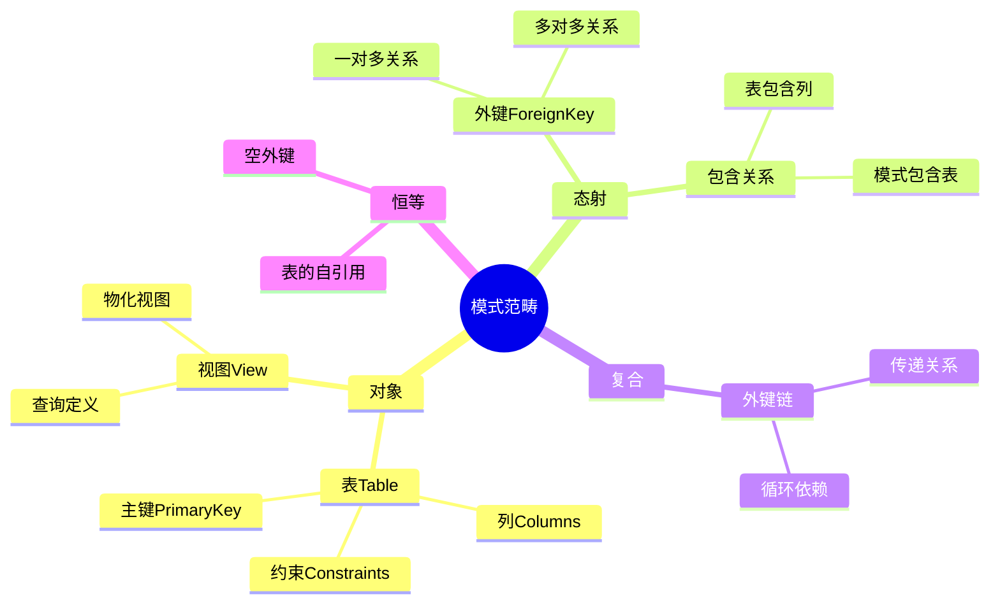
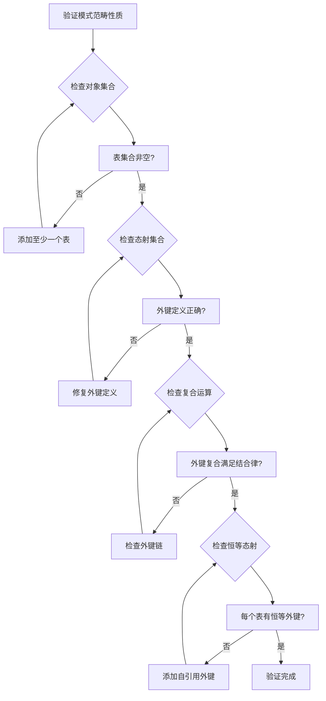
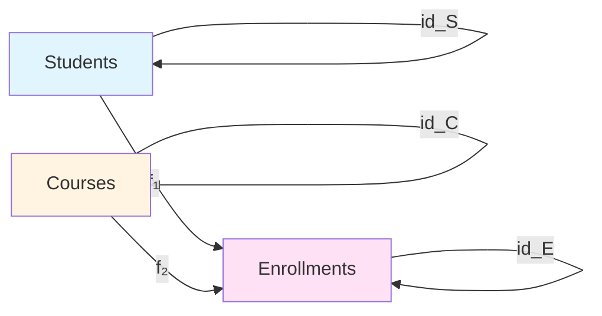

# 范畴论基础：数据库设计的范畴论视角

> **创建日期**：2025-01-15
> **最后更新**：2025-01-15
> **版本**：v1.0
> **状态**：规划中

---

## 📋 目录

- [范畴论基础：数据库设计的范畴论视角](#范畴论基础数据库设计的范畴论视角)
  - [📋 目录](#-目录)
  - [1. 概述](#1-概述)
    - [1.1. 范畴论在数据库设计中的作用](#11-范畴论在数据库设计中的作用)
    - [1.2. 核心思想](#12-核心思想)
  - [2. 范畴论基础概念](#2-范畴论基础概念)
    - [2.1. 范畴（Category）](#21-范畴category)
    - [2.2. 函子（Functor）](#22-函子functor)
    - [2.3. 自然变换（Natural Transformation）](#23-自然变换natural-transformation)
  - [3. 数据库模式作为范畴](#3-数据库模式作为范畴)
    - [3.1. 模式范畴的定义](#31-模式范畴的定义)
    - [3.1.1. 模式范畴的思维导图](#311-模式范畴的思维导图)
    - [3.1.2. 模式范畴性质验证决策树](#312-模式范畴性质验证决策树)
    - [3.1.3. 模式范畴性质证明](#313-模式范畴性质证明)
    - [3.2. 模式范畴的示例](#32-模式范畴的示例)
    - [3.2.1. 模式范畴分析矩阵](#321-模式范畴分析矩阵)
    - [3.2.2. 模式范畴性质验证](#322-模式范畴性质验证)
    - [3.3. 模式范畴的性质](#33-模式范畴的性质)
  - [4. 数据库实例作为函子](#4-数据库实例作为函子)
    - [4.1. 实例函子的定义](#41-实例函子的定义)
    - [4.2. 实例函子的性质](#42-实例函子的性质)
    - [4.3. 实例函子的示例](#43-实例函子的示例)
  - [5. 查询作为自然变换](#5-查询作为自然变换)
    - [5.1. 查询的自然变换表示](#51-查询的自然变换表示)
    - [5.2. 查询的自然性条件](#52-查询的自然性条件)
    - [5.3. 查询优化的范畴论方法](#53-查询优化的范畴论方法)
  - [6. 模式映射与数据迁移](#6-模式映射与数据迁移)
    - [6.1. 模式映射函子](#61-模式映射函子)
    - [6.2. 数据迁移（Kan扩张）](#62-数据迁移kan扩张)
    - [6.3. 数据迁移的一致性](#63-数据迁移的一致性)
  - [7. 应用案例](#7-应用案例)
    - [7.1. PostgreSQL模式映射](#71-postgresql模式映射)
    - [7.2. SQLite设计分析](#72-sqlite设计分析)
  - [8. 形式化证明](#8-形式化证明)
    - [8.1. 模式范畴的范畴性质](#81-模式范畴的范畴性质)
    - [8.2. 实例函子的函子性质](#82-实例函子的函子性质)
    - [8.3. 查询自然变换的自然性](#83-查询自然变换的自然性)
  - [9. 参考资料](#9-参考资料)
    - [9.1. 经典文献](#91-经典文献)
    - [9.2. 相关资源](#92-相关资源)


---

## 1. 概述

### 1.1. 范畴论在数据库设计中的作用

范畴论为数据库设计提供了统一的数学框架，能够：

1. **统一建模**：将数据库模式、实例、查询统一在范畴论框架下
2. **形式化推理**：使用范畴论的工具进行形式化推理和证明
3. **模式演化**：通过函子和自然变换处理模式演化
4. **查询优化**：使用范畴论方法进行查询优化和重写

### 1.2. 核心思想

```text
数据库模式 → 范畴（Category）
数据库实例 → 函子（Functor）
查询操作 → 自然变换（Natural Transformation）
模式映射 → 函子映射
数据迁移 → Kan扩张
```

---

## 2. 范畴论基础概念

### 2.1. 范畴（Category）

**定义**：

一个范畴 C 由以下组成：

1. **对象集合** Ob(C)：数据库中的表
2. **态射集合** Hom(C)：表之间的关系（外键）
3. **复合运算**：态射的复合
4. **单位态射**：每个对象的恒等态射

**性质**：

- **结合律**：(f ∘ g) ∘ h = f ∘ (g ∘ h)
- **单位律**：id_B ∘ f = f = f ∘ id_A

### 2.2. 函子（Functor）

**定义**：

函子 F: C → D 是一个映射，满足：

1. **对象映射**：F: Ob(C) → Ob(D)
2. **态射映射**：F: Hom_C(A, B) → Hom_D(F(A), F(B))
3. **保持复合**：F(f ∘ g) = F(f) ∘ F(g)
4. **保持单位**：F(id_A) = id_{F(A)}

### 2.3. 自然变换（Natural Transformation）

**定义**：

自然变换 η: F → G 是一族态射 {η_A: F(A) → G(A)}，使得对于任意态射 f: A → B，有：

```text
η_B ∘ F(f) = G(f) ∘ η_A
```

---

## 3. 数据库模式作为范畴

### 3.1. 模式范畴的定义

**数据库模式范畴 Schema**：

```haskell
-- 数据库模式范畴
data DatabaseSchema = Schema {
    tables :: [Table],
    foreignKeys :: [ForeignKey],
    constraints :: [Constraint]
}

-- 表作为对象
data Table = Table {
    name :: String,
    columns :: [Column],
    primaryKey :: PrimaryKey
}

-- 外键作为态射
data ForeignKey = ForeignKey {
    from :: Table,
    to :: Table,
    columns :: [(Column, Column)]
}
```

### 3.1.1. 模式范畴的思维导图



### 3.1.2. 模式范畴性质验证决策树



### 3.1.3. 模式范畴性质证明

**性质1：结合律**:

**定理**：外键复合满足结合律

**证明**：

```text
设外键链：A --f--> B --g--> C --h--> D

需要证明：(h ∘ g) ∘ f = h ∘ (g ∘ f)

左式：(h ∘ g) ∘ f
  = 从A通过f到B，再通过g到C，再通过h到D
  = A --f--> B --g--> C --h--> D

右式：h ∘ (g ∘ f)
  = 从A通过(g ∘ f)到C，再通过h到D
  = A --f--> B --g--> C --h--> D

两者相等 ✅
```

**性质2：单位律**:

**定理**：每个表有恒等外键

**证明**：

```text
对于表T，定义恒等外键 id_T: T → T

id_T 满足：
  - from = T
  - to = T
  - columns = {(c, c) | c ∈ columns(T)}

对于任意外键 f: S → T：
  id_T ∘ f = f  (通过T的恒等映射)
  f ∘ id_S = f  (通过S的恒等映射)

因此：id_T 是恒等态射 ✅
```

### 3.2. 模式范畴的示例

**示例：学生-课程数据库**：

**完整模式定义**：

```sql
-- 表定义
CREATE TABLE Students (
    student_id INTEGER PRIMARY KEY,
    name VARCHAR(100),
    email VARCHAR(100) UNIQUE
);

CREATE TABLE Courses (
    course_id INTEGER PRIMARY KEY,
    title VARCHAR(200),
    credits INTEGER
);

CREATE TABLE Enrollments (
    enrollment_id INTEGER PRIMARY KEY,
    student_id INTEGER REFERENCES Students(student_id),
    course_id INTEGER REFERENCES Courses(course_id),
    grade CHAR(1),
    UNIQUE(student_id, course_id)
);
```

**模式范畴表示**：

```text
模式范畴 Schema:
  对象：{Students, Courses, Enrollments}

  态射：
    - f₁: Enrollments → Students
      (student_id 外键)
    - f₂: Enrollments → Courses
      (course_id 外键)

  复合：
    - 无直接复合（Enrollments是中间表）

  恒等：
    - id_Students: Students → Students
    - id_Courses: Courses → Courses
    - id_Enrollments: Enrollments → Enrollments
```

**模式范畴可视化**：



### 3.2.1. 模式范畴分析矩阵

| 模式元素 | 范畴论对应 | 数学性质 | 实际意义 | 验证方法 |
|---------|-----------|---------|---------|---------|
| **表** | 对象 | 集合元素 | 数据容器 | 检查表定义 |
| **外键** | 态射 | 函数映射 | 关系约束 | 检查外键约束 |
| **主键** | 恒等态射基础 | 唯一标识 | 实体标识 | 检查主键约束 |
| **约束** | 范畴公理 | 不变式 | 数据完整性 | 检查约束满足 |
| **模式** | 范畴 | 数学结构 | 数据库结构 | 验证范畴性质 |

### 3.2.2. 模式范畴性质验证

**验证算法**：

```text
算法：验证模式范畴性质
输入：数据库模式 Schema
输出：是否满足范畴性质

步骤：
1. 检查对象集合非空
   if tables(Schema) == ∅:
       return False

2. 检查态射定义
   for each fk in foreignKeys(Schema):
       if fk.from not in tables(Schema) or
          fk.to not in tables(Schema):
           return False

3. 检查复合运算
   for each fk1, fk2 in foreignKeys(Schema):
       if fk1.to == fk2.from:
           composite = compose(fk1, fk2)
           if composite not valid:
               return False

4. 检查恒等态射
   for each table in tables(Schema):
       if not has_identity(table):
           return False

5. 验证结合律
   if not associative(foreignKeys(Schema)):
       return False

6. 验证单位律
   if not identity_law(tables(Schema)):
       return False

return True
```


**范畴表示**：

```text
Schema = {
    Objects: {Students, Courses, Enrollments}
    Morphisms: {
        enrollment_student: Enrollments → Students,
        enrollment_course: Enrollments → Courses
    }
}
```

### 3.3. 模式范畴的性质

**定理**：数据库模式构成一个范畴

**证明**：

1. **对象集合**：表的集合构成对象集合
2. **态射集合**：外键关系构成态射集合
3. **复合运算**：外键的传递关系构成复合
4. **单位态射**：每个表的自引用构成单位态射

---

## 4. 数据库实例作为函子

### 4.1. 实例函子的定义

**实例函子 I: Schema → Set**：

```haskell
-- 实例函子
instance Functor DatabaseInstance where
    fmap f (Instance schema rows) =
        Instance (f schema) (map f rows)

-- 实例映射
data DatabaseInstance = Instance {
    schema :: DatabaseSchema,
    rows :: [Row]
}

-- 行数据
data Row = Row {
    table :: Table,
    values :: [Value]
}
```

### 4.2. 实例函子的性质

**函子性质**：

1. **对象映射**：I(Table) = 表中行的集合
2. **态射映射**：I(ForeignKey) = 外键约束函数
3. **保持复合**：I(f ∘ g) = I(f) ∘ I(g)
4. **保持单位**：I(id) = id

### 4.3. 实例函子的示例

**示例：学生-课程数据库实例**：

```text
I(Students) = {
    (1, "Alice", "alice@example.com"),
    (2, "Bob", "bob@example.com")
}

I(Courses) = {
    (1, "Database Systems", 3),
    (2, "Category Theory", 3)
}

I(Enrollments) = {
    (1, 1, "A"),
    (1, 2, "B"),
    (2, 1, "A")
}

I(enrollment_student): (1, 1) → 1, (1, 2) → 1, (2, 1) → 2
I(enrollment_course): (1, 1) → 1, (1, 2) → 2, (2, 1) → 1
```

---

## 5. 查询作为自然变换

### 5.1. 查询的自然变换表示

**查询作为自然变换**：

```haskell
-- 查询自然变换
data QueryNaturalTransformation = QueryNT {
    source :: DatabaseInstance,
    target :: DatabaseInstance,
    components :: forall a. Table -> [Row]
}

-- SELECT查询
selectQuery :: QueryNaturalTransformation
selectQuery = QueryNT {
    source = studentsInstance,
    target = filteredInstance,
    components = \table -> filter (predicate table) (rows table)
}
```

### 5.2. 查询的自然性条件

**自然性条件**：

对于查询自然变换 η: I → J，对于任意外键 f: A → B，有：

```text
η_B ∘ I(f) = J(f) ∘ η_A
```

这保证了查询结果与外键关系的一致性。

### 5.3. 查询优化的范畴论方法

**查询重写**：

使用自然变换的等价性进行查询优化：

```text
η₁ ≈ η₂ ⟹ 查询等价
```

**示例**：

```sql
-- 原始查询
SELECT s.name, e.grade
FROM Students s
JOIN Enrollments e ON s.student_id = e.student_id
WHERE e.grade = 'A';

-- 优化查询（使用自然变换）
-- 先过滤，再连接
```

---

## 6. 模式映射与数据迁移

### 6.1. 模式映射函子

**模式映射**：

```haskell
-- 模式映射函子
data SchemaMapping = SchemaMapping {
    source :: DatabaseSchema,
    target :: DatabaseSchema,
    mapping :: Functor DatabaseSchema DatabaseSchema
}

-- 表映射
tableMapping :: Table -> Table
tableMapping Students = People  -- 表重命名
tableMapping Courses = Subjects

-- 列映射
columnMapping :: Column -> Column
columnMapping (Table "Students", "name") = (Table "People", "full_name")
```

### 6.2. 数据迁移（Kan扩张）

**左Kan扩张**：

```haskell
-- 左Kan扩张
data LeftKanExtension f g = LeftKan {
    extension :: forall c. (f c -> g c) -> (c -> g c)
}

-- 数据迁移
migrateData :: SchemaMapping -> DatabaseInstance -> DatabaseInstance
migrateData mapping instance =
    LeftKan {
        extension = \f -> \c -> f (mapping c)
    } instance
```

### 6.3. 数据迁移的一致性

**定理**：使用Kan扩张的数据迁移保持数据一致性

**证明**：

通过自然变换的性质，保证迁移后的数据满足目标模式的外键约束。

---

## 7. 应用案例

### 7.1. PostgreSQL模式映射

**案例：模式版本升级**：

```sql
-- 旧模式
CREATE TABLE users (
    id INTEGER PRIMARY KEY,
    name TEXT
);

-- 新模式
CREATE TABLE users (
    id INTEGER PRIMARY KEY,
    first_name TEXT,
    last_name TEXT
);

-- 范畴论映射
mapping :: Schema_v1 -> Schema_v2
mapping Users_v1 = Users_v2
mapping (name) = (first_name, last_name)  -- 列拆分
```

### 7.2. SQLite设计分析

**案例：SQLite的VFS接口**：

```haskell
-- VFS作为范畴
data VFSCategory = VFS {
    objects :: [FileSystem],
    morphisms :: [FileOperation]
}

-- VFS适配器作为函子
vfsAdapter :: VFSCategory -> DatabaseCategory
vfsAdapter = Functor {
    fmap = \fs -> DatabaseFileSystem fs
}
```

---

## 8. 形式化证明

### 8.1. 模式范畴的范畴性质

**定理**：数据库模式构成一个范畴

**证明**：

1. **对象集合存在**：表的集合非空
2. **态射集合存在**：外键关系集合
3. **复合运算**：外键传递关系
4. **结合律**：外键传递满足结合律
5. **单位律**：每个表的自引用

### 8.2. 实例函子的函子性质

**定理**：数据库实例构成函子

**证明**：

1. **对象映射**：I(Table) = 行的集合
2. **态射映射**：I(ForeignKey) = 外键函数
3. **保持复合**：I(f ∘ g) = I(f) ∘ I(g)
4. **保持单位**：I(id) = id

### 8.3. 查询自然变换的自然性

**定理**：查询满足自然性条件

**证明**：

通过查询语义的定义，保证查询结果与外键关系的一致性。

---

## 9. 参考资料

### 9.1. 经典文献

- Spivak, D.I. (2014). "Category Theory for the Sciences"
- Fong, B. & Spivak, D.I. (2019). "An Invitation to Applied Category Theory"
- Spivak, D.I. & Wisnesky, R. (2015). "Relational Foundations for Functorial Data Migration"

### 9.2. 相关资源

- [Wikipedia: Category Theory](https://en.wikipedia.org/wiki/Category_theory)
- [nLab: Database](https://ncatlab.org/nlab/show/database)
- [PostgreSQL模式映射文档](../PostgreSQL/INDEX.md#模式映射与范畴视角)

---

**最后更新**：2025-01-15
**维护者**：Data-Science Team
**状态**：规划中
