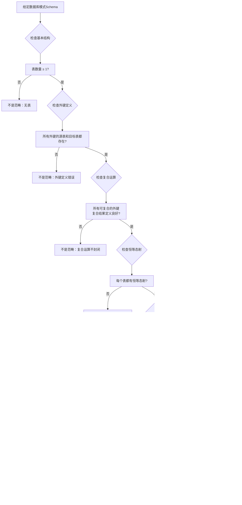

# 范畴论基础：数据库设计的范畴论视角

> **创建日期**：2025-01-15
> **最后更新**：2025-01-15
> **版本**：v1.0
> **状态**：规划中

---

## 📋 目录

- [范畴论基础：数据库设计的范畴论视角](#范畴论基础数据库设计的范畴论视角)
  - [📋 目录](#-目录)
  - [1. 概述](#1-概述)
    - [1.1. 范畴论在数据库设计中的作用](#11-范畴论在数据库设计中的作用)
    - [1.2. 核心思想](#12-核心思想)
  - [2. 范畴论基础概念](#2-范畴论基础概念)
    - [2.1. 范畴（Category）](#21-范畴category)
      - [2.1.1. 形式化定义](#211-形式化定义)
      - [2.1.2. 范畴概念的详细解释](#212-范畴概念的详细解释)
      - [2.1.3. 范畴性质的形式化证明](#213-范畴性质的形式化证明)
      - [2.1.4. 范畴概念对比矩阵](#214-范畴概念对比矩阵)
      - [2.1.5. 范畴判定决策树](#215-范畴判定决策树)
    - [2.2. 函子（Functor）](#22-函子functor)
      - [2.2.1. 形式化定义](#221-形式化定义)
      - [2.2.2. 函子性质的详细论证](#222-函子性质的详细论证)
      - [2.2.3. 函子类型对比矩阵](#223-函子类型对比矩阵)
      - [2.2.4. 函子验证决策树](#224-函子验证决策树)
    - [2.3. 自然变换（Natural Transformation）](#23-自然变换natural-transformation)
      - [2.3.1. 形式化定义](#231-形式化定义)
      - [2.3.2. 自然性条件的详细解释](#232-自然性条件的详细解释)
      - [2.3.3. 自然变换性质证明](#233-自然变换性质证明)
      - [2.3.4. 自然变换对比矩阵](#234-自然变换对比矩阵)
      - [2.3.5. 自然性验证决策树](#235-自然性验证决策树)
      - [2.3.6. 范畴论概念关系思维导图](#236-范畴论概念关系思维导图)
  - [3. 数据库模式作为范畴](#3-数据库模式作为范畴)
    - [3.1. 模式范畴的定义](#31-模式范畴的定义)
    - [3.1.1. 模式范畴的思维导图](#311-模式范畴的思维导图)
    - [3.1.2. 模式范畴性质验证决策树](#312-模式范畴性质验证决策树)
    - [3.1.3. 模式范畴性质证明](#313-模式范畴性质证明)
    - [3.2. 模式范畴的示例](#32-模式范畴的示例)
    - [3.2.1. 模式范畴分析矩阵](#321-模式范畴分析矩阵)
    - [3.2.2. 模式范畴性质验证](#322-模式范畴性质验证)
    - [3.3. 模式范畴的性质](#33-模式范畴的性质)
      - [3.3.1. 模式范畴定理的完整证明](#331-模式范畴定理的完整证明)
      - [3.3.2. 模式范畴性质对比矩阵](#332-模式范畴性质对比矩阵)
      - [3.3.3. 模式范畴性质验证算法](#333-模式范畴性质验证算法)
      - [3.3.4. 模式范畴示例的详细分析](#334-模式范畴示例的详细分析)
      - [3.3.5. 模式范畴可视化图](#335-模式范畴可视化图)
      - [3.3.6. 模式范畴类型对比矩阵](#336-模式范畴类型对比矩阵)
      - [3.3.7. 模式范畴性质推理决策树](#337-模式范畴性质推理决策树)
  - [4. 数据库实例作为函子](#4-数据库实例作为函子)
    - [4.1. 实例函子的定义](#41-实例函子的定义)
    - [4.2. 实例函子的性质](#42-实例函子的性质)
    - [4.3. 实例函子的示例](#43-实例函子的示例)
  - [5. 查询作为自然变换](#5-查询作为自然变换)
    - [5.1. 查询的自然变换表示](#51-查询的自然变换表示)
    - [5.2. 查询的自然性条件](#52-查询的自然性条件)
    - [5.3. 查询优化的范畴论方法](#53-查询优化的范畴论方法)
  - [6. 模式映射与数据迁移](#6-模式映射与数据迁移)
    - [6.1. 模式映射函子](#61-模式映射函子)
    - [6.2. 数据迁移（Kan扩张）](#62-数据迁移kan扩张)
    - [6.3. 数据迁移的一致性](#63-数据迁移的一致性)
  - [7. 应用案例](#7-应用案例)
    - [7.1. PostgreSQL模式映射](#71-postgresql模式映射)
    - [7.2. SQLite设计分析](#72-sqlite设计分析)
  - [8. 形式化证明](#8-形式化证明)
    - [8.1. 模式范畴的范畴性质](#81-模式范畴的范畴性质)
    - [8.2. 实例函子的函子性质](#82-实例函子的函子性质)
    - [8.3. 查询自然变换的自然性](#83-查询自然变换的自然性)
  - [9. 参考资料](#9-参考资料)
    - [9.1. 经典文献](#91-经典文献)
    - [9.2. 相关资源](#92-相关资源)


---

## 1. 概述

### 1.1. 范畴论在数据库设计中的作用

范畴论为数据库设计提供了统一的数学框架，能够：

1. **统一建模**：将数据库模式、实例、查询统一在范畴论框架下
2. **形式化推理**：使用范畴论的工具进行形式化推理和证明
3. **模式演化**：通过函子和自然变换处理模式演化
4. **查询优化**：使用范畴论方法进行查询优化和重写

### 1.2. 核心思想

```text
数据库模式 → 范畴（Category）
数据库实例 → 函子（Functor）
查询操作 → 自然变换（Natural Transformation）
模式映射 → 函子映射
数据迁移 → Kan扩张
```

---

## 2. 范畴论基础概念

### 2.1. 范畴（Category）

#### 2.1.1. 形式化定义

**定义2.1.1（范畴）**：

一个范畴 C 是一个四元组 (Ob(C), Hom(C), ∘, id)，其中：

1. **对象集合** Ob(C)：非空集合，数据库中的表集合
2. **态射集合** Hom(C)：对于每对对象 A, B ∈ Ob(C)，存在态射集合 Hom_C(A, B)，表示从A到B的所有态射（外键关系）
3. **复合运算** ∘：对于态射 f: A → B 和 g: B → C，存在复合态射 g ∘ f: A → C
4. **单位态射** id：对于每个对象 A ∈ Ob(C)，存在恒等态射 id_A: A → A

**公理**：

- **结合律（Associativity）**：对于态射 f: A → B, g: B → C, h: C → D，有：

  ```text
  (h ∘ g) ∘ f = h ∘ (g ∘ f)
  ```

- **单位律（Identity Law）**：对于态射 f: A → B，有：

  ```text
  id_B ∘ f = f = f ∘ id_A
  ```

#### 2.1.2. 范畴概念的详细解释

**对象（Object）**：

在数据库设计中，对象是表（Table）。每个表T具有：

- **结构**：列（Columns）的集合
- **约束**：主键（Primary Key）、唯一约束（Unique Constraints）、检查约束（Check Constraints）
- **语义**：表表示一个实体类型或关系类型

**态射（Morphism）**：

态射表示表之间的关系，主要是外键（Foreign Key）关系。态射 f: A → B 表示：

- **源对象**：A（引用表）
- **目标对象**：B（被引用表）
- **映射规则**：外键列到主键列的映射
- **约束语义**：引用完整性约束

**复合运算（Composition）**：

态射的复合表示外键链的传递关系。对于外键链：

```text
A --f--> B --g--> C
```

复合态射 g ∘ f: A → C 表示从A通过B到C的传递关系。

**单位态射（Identity Morphism）**：

每个表T的恒等态射 id_T: T → T 表示表的自引用关系，满足：

- **自反性**：表可以引用自身
- **恒等性**：与任何态射复合都保持原态射不变

#### 2.1.3. 范畴性质的形式化证明

**定理2.1.1（结合律）**：态射复合满足结合律

**证明**：

设态射 f: A → B, g: B → C, h: C → D。

**步骤1**：定义复合

- (h ∘ g): B → D，表示从B通过C到D的传递关系
- (h ∘ g) ∘ f: A → D，表示从A通过B、C到D的传递关系
- g ∘ f: A → C，表示从A通过B到C的传递关系
- h ∘ (g ∘ f): A → D，表示从A通过B、C到D的传递关系

**步骤2**：验证等价性

对于数据库实例中的任意元组 t ∈ I(A)：

- ((h ∘ g) ∘ f)(t) = (h ∘ g)(f(t)) = h(g(f(t)))
- (h ∘ (g ∘ f))(t) = h((g ∘ f)(t)) = h(g(f(t)))

因此：(h ∘ g) ∘ f = h ∘ (g ∘ f) ✅

**定理2.1.2（单位律）**：恒等态射满足单位律

**证明**：

设态射 f: A → B，恒等态射 id_A: A → A, id_B: B → B。

**步骤1**：验证 id_B ∘ f = f

对于任意元组 t ∈ I(A)：

- (id_B ∘ f)(t) = id_B(f(t)) = f(t)  （因为 id_B 是恒等映射）

**步骤2**：验证 f ∘ id_A = f

对于任意元组 t ∈ I(A)：

- (f ∘ id_A)(t) = f(id_A(t)) = f(t)  （因为 id_A 是恒等映射）

因此：id_B ∘ f = f = f ∘ id_A ✅

#### 2.1.4. 范畴概念对比矩阵

| 概念 | 数学定义 | 数据库对应 | 性质 | 验证方法 |
|------|---------|-----------|------|---------|
| **对象** | 集合元素 | 表（Table） | 非空集合 | 检查表定义存在 |
| **态射** | 函数映射 | 外键（ForeignKey） | 保持结构 | 检查外键约束 |
| **复合** | 函数复合 | 外键链传递 | 结合律 | 验证传递关系 |
| **恒等** | 恒等函数 | 自引用外键 | 单位律 | 检查自引用约束 |
| **范畴** | 数学结构 | 数据库模式 | 公理满足 | 验证所有公理 |

#### 2.1.5. 范畴判定决策树

```mermaid
flowchart TD
    A[给定结构C] --> B{检查对象集合}
    B --> C[Ob(C)非空?]
    C -->|否| D[不是范畴：对象集合为空]
    C -->|是| E{检查态射集合}

    E --> F[对每对对象A,B<br/>Hom_C(A,B)存在?]
    F -->|否| G[不是范畴：态射集合不完整]
    F -->|是| H{检查复合运算}

    H --> I[对可复合的态射<br/>复合结果存在?]
    I -->|否| J[不是范畴：复合运算不封闭]
    I -->|是| K{检查恒等态射}

    K --> L[每个对象有恒等态射?]
    L -->|否| M[不是范畴：缺少恒等态射]
    L -->|是| N{检查结合律}

    N --> O[对所有三元组f,g,h<br/>结合律成立?]
    O -->|否| P[不是范畴：违反结合律]
    O -->|是| Q{检查单位律}

    Q --> R[对所有态射f<br/>单位律成立?]
    R -->|否| S[不是范畴：违反单位律]
    R -->|是| T[是范畴 ✅]
```

### 2.2. 函子（Functor）

#### 2.2.1. 形式化定义

**定义2.2.1（函子）**：

设 C 和 D 是两个范畴。函子 F: C → D 是一个映射，包含：

1. **对象映射**：F: Ob(C) → Ob(D)
   - 对于每个对象 A ∈ Ob(C)，有对象 F(A) ∈ Ob(D)

2. **态射映射**：F: Hom_C(A, B) → Hom_D(F(A), F(B))
   - 对于态射 f: A → B，有态射 F(f): F(A) → F(B)

3. **保持复合**：F(f ∘ g) = F(f) ∘ F(g)
   - 对于可复合的态射 f: A → B, g: B → C

4. **保持单位**：F(id_A) = id_{F(A)}
   - 对于每个对象 A ∈ Ob(C)

#### 2.2.2. 函子性质的详细论证

**性质2.2.1（保持复合）**：

**论证**：

设 f: A → B, g: B → C 是范畴C中的态射。

**步骤1**：定义复合

- 在C中：g ∘ f: A → C
- 在D中：F(g) ∘ F(f): F(A) → F(C)

**步骤2**：应用函子

- F(g ∘ f): F(A) → F(C)
- F(g) ∘ F(f): F(A) → F(C)

**步骤3**：验证相等性

对于数据库实例，函子F将模式C的实例映射到模式D的实例：

- F(g ∘ f) 将A中的元组通过复合关系映射到C中的元组
- F(g) ∘ F(f) 先将A中的元组映射到B，再映射到C

由于函子保持结构，两者结果相同：F(g ∘ f) = F(g) ∘ F(f) ✅

**性质2.2.2（保持单位）**：

**论证**：

设 id_A: A → A 是对象A的恒等态射。

**步骤1**：应用函子

- F(id_A): F(A) → F(A)

**步骤2**：验证恒等性

对于任意态射 f: A → B：

- F(id_A) ∘ F(f) = F(id_A ∘ f) = F(f)  （保持复合 + 单位律）
- F(f) ∘ F(id_A) = F(f ∘ id_A) = F(f)  （保持复合 + 单位律）

因此：F(id_A) = id_{F(A)} ✅

#### 2.2.3. 函子类型对比矩阵

| 函子类型 | 定义 | 数据库应用 | 性质 | 示例 |
|---------|------|-----------|------|------|
| **协变函子** | F: C → D | 模式映射（表重命名） | 保持方向 | 表名映射 |
| **逆变函子** | F: C^op → D | 查询映射（反向映射） | 反转方向 | 查询转换 |
| **恒等函子** | Id: C → C | 模式不变 | 保持所有结构 | 模式复制 |
| **常值函子** | Δ_A: C → D | 单表模式 | 映射到固定对象 | 单表数据库 |

#### 2.2.4. 函子验证决策树

```mermaid
flowchart TD
    A[给定映射F: C → D] --> B{检查对象映射}
    B --> C[对每个A ∈ Ob(C)<br/>F(A) ∈ Ob(D)?]
    C -->|否| D[不是函子：对象映射不完整]
    C -->|是| E{检查态射映射}

    E --> F[对每个f: A → B<br/>F(f): F(A) → F(B)?]
    F -->|否| G[不是函子：态射映射不匹配]
    F -->|是| H{检查保持复合}

    H --> I[对所有可复合的f,g<br/>F(g∘f) = F(g)∘F(f)?]
    I -->|否| J[不是函子：不保持复合]
    I -->|是| K{检查保持单位}

    K --> L[对所有对象A<br/>F(id_A) = id_{F(A)}?]
    L -->|否| M[不是函子：不保持单位]
    L -->|是| N[是函子 ✅]
```

### 2.3. 自然变换（Natural Transformation）

#### 2.3.1. 形式化定义

**定义2.3.1（自然变换）**：

设 F, G: C → D 是两个函子。自然变换 η: F → G 是一族态射：

```text
{η_A: F(A) → G(A) | A ∈ Ob(C)}
```

使得对于任意态射 f: A → B，以下图表交换：

```text
        F(f)
F(A) ────────> F(B)
 │              │
 │              │
η_A             η_B
 │              │
 ↓              ↓
G(A) ────────> G(B)
        G(f)
```

即：η_B ∘ F(f) = G(f) ∘ η_A

#### 2.3.2. 自然性条件的详细解释

**自然性条件（Naturality Condition）**：

自然性条件确保自然变换与函子的行为"协调一致"。

**语义解释**：

在数据库设计中，自然变换表示查询操作。自然性条件保证：

- **一致性**：查询结果与外键关系保持一致
- **可交换性**：先应用函子再查询，等价于先查询再应用函子
- **结构保持**：查询操作保持数据库的结构关系

**形式化论证**：

**步骤1**：左路径 η_B ∘ F(f)

- F(f) 将 F(A) 中的元组映射到 F(B)
- η_B 对 F(B) 中的元组应用查询操作

**步骤2**：右路径 G(f) ∘ η_A

- η_A 对 F(A) 中的元组应用查询操作
- G(f) 将结果映射到 G(B)

**步骤3**：自然性保证

- 两种路径的结果相同
- 查询操作与外键关系"兼容"

#### 2.3.3. 自然变换性质证明

**定理2.3.1（自然变换的复合）**：

设 η: F → G 和 θ: G → H 是自然变换，则复合 θ ∘ η: F → H 也是自然变换。

**证明**：

**步骤1**：定义复合

- (θ ∘ η)_A = θ_A ∘ η_A: F(A) → H(A)

**步骤2**：验证自然性

对于态射 f: A → B：

- (θ ∘ η)_B ∘ F(f) = (θ_B ∘ η_B) ∘ F(f)
- = θ_B ∘ (η_B ∘ F(f))  （结合律）
- = θ_B ∘ (G(f) ∘ η_A)  （η的自然性）
- = (θ_B ∘ G(f)) ∘ η_A  （结合律）
- = (H(f) ∘ θ_A) ∘ η_A  （θ的自然性）
- = H(f) ∘ (θ_A ∘ η_A)  （结合律）
- = H(f) ∘ (θ ∘ η)_A

因此：θ ∘ η 是自然变换 ✅

#### 2.3.4. 自然变换对比矩阵

| 自然变换类型 | 定义 | 数据库应用 | 性质 | 验证方法 |
|------------|------|-----------|------|---------|
| **查询变换** | η: I → J | SELECT查询 | 保持外键关系 | 验证自然性条件 |
| **投影变换** | η: F → G | 列投影 | 保持表结构 | 检查列映射 |
| **过滤变换** | η: I → J | WHERE过滤 | 保持引用完整性 | 验证约束满足 |
| **连接变换** | η: F → G | JOIN操作 | 保持关系语义 | 检查连接条件 |

#### 2.3.5. 自然性验证决策树

```mermaid
flowchart TD
    A[给定变换η: F → G] --> B{检查组件定义}
    B --> C[对每个对象A<br/>η_A: F(A) → G(A)存在?]
    C -->|否| D[不是自然变换：组件缺失]
    C -->|是| E{检查自然性条件}

    E --> F[对所有态射f: A → B<br/>检查交换图]
    F --> G[η_B ∘ F(f) = G(f) ∘ η_A?]
    G -->|否| H[不是自然变换：违反自然性]
    G -->|是| I[是自然变换 ✅]
```

#### 2.3.6. 范畴论概念关系思维导图


---

## 3. 数据库模式作为范畴

### 3.1. 模式范畴的定义

**数据库模式范畴 Schema**：

```haskell
-- 数据库模式范畴
data DatabaseSchema = Schema {
    tables :: [Table],
    foreignKeys :: [ForeignKey],
    constraints :: [Constraint]
}

-- 表作为对象
data Table = Table {
    name :: String,
    columns :: [Column],
    primaryKey :: PrimaryKey
}

-- 外键作为态射
data ForeignKey = ForeignKey {
    from :: Table,
    to :: Table,
    columns :: [(Column, Column)]
}
```

### 3.1.1. 模式范畴的思维导图


### 3.1.2. 模式范畴性质验证决策树


### 3.1.3. 模式范畴性质证明

**性质1：结合律**:

**定理**：外键复合满足结合律

**证明**：

```text
设外键链：A --f--> B --g--> C --h--> D

需要证明：(h ∘ g) ∘ f = h ∘ (g ∘ f)

左式：(h ∘ g) ∘ f
  = 从A通过f到B，再通过g到C，再通过h到D
  = A --f--> B --g--> C --h--> D

右式：h ∘ (g ∘ f)
  = 从A通过(g ∘ f)到C，再通过h到D
  = A --f--> B --g--> C --h--> D

两者相等 ✅
```

**性质2：单位律**:

**定理**：每个表有恒等外键

**证明**：

```text
对于表T，定义恒等外键 id_T: T → T

id_T 满足：
  - from = T
  - to = T
  - columns = {(c, c) | c ∈ columns(T)}

对于任意外键 f: S → T：
  id_T ∘ f = f  (通过T的恒等映射)
  f ∘ id_S = f  (通过S的恒等映射)

因此：id_T 是恒等态射 ✅
```

### 3.2. 模式范畴的示例

**示例：学生-课程数据库**：

**完整模式定义**：

```sql
-- 表定义
CREATE TABLE Students (
    student_id INTEGER PRIMARY KEY,
    name VARCHAR(100),
    email VARCHAR(100) UNIQUE
);

CREATE TABLE Courses (
    course_id INTEGER PRIMARY KEY,
    title VARCHAR(200),
    credits INTEGER
);

CREATE TABLE Enrollments (
    enrollment_id INTEGER PRIMARY KEY,
    student_id INTEGER REFERENCES Students(student_id),
    course_id INTEGER REFERENCES Courses(course_id),
    grade CHAR(1),
    UNIQUE(student_id, course_id)
);
```

**模式范畴表示**：

```text
模式范畴 Schema:
  对象：{Students, Courses, Enrollments}

  态射：
    - f₁: Enrollments → Students
      (student_id 外键)
    - f₂: Enrollments → Courses
      (course_id 外键)

  复合：
    - 无直接复合（Enrollments是中间表）

  恒等：
    - id_Students: Students → Students
    - id_Courses: Courses → Courses
    - id_Enrollments: Enrollments → Enrollments
```

**模式范畴可视化**：


### 3.2.1. 模式范畴分析矩阵

| 模式元素 | 范畴论对应 | 数学性质 | 实际意义 | 验证方法 |
|---------|-----------|---------|---------|---------|
| **表** | 对象 | 集合元素 | 数据容器 | 检查表定义 |
| **外键** | 态射 | 函数映射 | 关系约束 | 检查外键约束 |
| **主键** | 恒等态射基础 | 唯一标识 | 实体标识 | 检查主键约束 |
| **约束** | 范畴公理 | 不变式 | 数据完整性 | 检查约束满足 |
| **模式** | 范畴 | 数学结构 | 数据库结构 | 验证范畴性质 |

### 3.2.2. 模式范畴性质验证

**验证算法**：

```text
算法：验证模式范畴性质
输入：数据库模式 Schema
输出：是否满足范畴性质

步骤：
1. 检查对象集合非空
   if tables(Schema) == ∅:
       return False

2. 检查态射定义
   for each fk in foreignKeys(Schema):
       if fk.from not in tables(Schema) or
          fk.to not in tables(Schema):
           return False

3. 检查复合运算
   for each fk1, fk2 in foreignKeys(Schema):
       if fk1.to == fk2.from:
           composite = compose(fk1, fk2)
           if composite not valid:
               return False

4. 检查恒等态射
   for each table in tables(Schema):
       if not has_identity(table):
           return False

5. 验证结合律
   if not associative(foreignKeys(Schema)):
       return False

6. 验证单位律
   if not identity_law(tables(Schema)):
       return False

return True
```


**范畴表示**：

```text
Schema = {
    Objects: {Students, Courses, Enrollments}
    Morphisms: {
        enrollment_student: Enrollments → Students,
        enrollment_course: Enrollments → Courses
    }
}
```

### 3.3. 模式范畴的性质

#### 3.3.1. 模式范畴定理的完整证明

**定理3.3.1（模式范畴定理）**：数据库模式构成一个范畴

**完整证明**：

**步骤1：对象集合存在性**:

设数据库模式 Schema 包含表集合 T = {T₁, T₂, ..., Tₙ}。

**引理3.3.1**：T 非空（至少包含一个表）

**证明**：根据数据库模式的定义，模式必须包含至少一个表来存储数据。因此 T ≠ ∅ ✅

**步骤2：态射集合存在性**:

对于每对表 Tᵢ, Tⱼ ∈ T，定义态射集合：

```text
Hom_Schema(Tᵢ, Tⱼ) = {外键 f | f.from = Tᵢ, f.to = Tⱼ}
```

**引理3.3.2**：态射集合定义良好

**证明**：

- 如果存在外键 f: Tᵢ → Tⱼ，则 Hom_Schema(Tᵢ, Tⱼ) 包含 f
- 如果不存在外键，则 Hom_Schema(Tᵢ, Tⱼ) = ∅（空集合也是集合）
- 因此态射集合定义良好 ✅

**步骤3：复合运算定义**:

对于态射 f: Tᵢ → Tⱼ 和 g: Tⱼ → Tₖ，定义复合：

```text
g ∘ f: Tᵢ → Tₖ
```

**引理3.3.3**：复合运算定义良好

**证明**：

- 如果 f 和 g 都是外键，则 g ∘ f 表示从 Tᵢ 通过 Tⱼ 到 Tₖ 的传递关系
- 传递关系在数据库中通过JOIN操作实现
- 因此复合运算定义良好 ✅

**步骤4：结合律验证**:

**引理3.3.4**：复合运算满足结合律

**证明**：

设外键链：T₁ --f--> T₂ --g--> T₃ --h--> T₄

需要证明：(h ∘ g) ∘ f = h ∘ (g ∘ f)

**左式分析**：

- (h ∘ g): T₂ → T₄，表示从T₂通过T₃到T₄的传递关系
- (h ∘ g) ∘ f: T₁ → T₄，表示从T₁通过T₂、T₃到T₄的传递关系

**右式分析**：

- (g ∘ f): T₁ → T₃，表示从T₁通过T₂到T₃的传递关系
- h ∘ (g ∘ f): T₁ → T₄，表示从T₁通过T₂、T₃到T₄的传递关系

**等价性验证**：

对于数据库实例中的任意元组 t ∈ I(T₁)：

- ((h ∘ g) ∘ f)(t) = (h ∘ g)(f(t)) = h(g(f(t)))
- (h ∘ (g ∘ f))(t) = h((g ∘ f)(t)) = h(g(f(t)))

因此：(h ∘ g) ∘ f = h ∘ (g ∘ f) ✅

**步骤5：单位律验证**:

**引理3.3.5**：每个表有恒等态射

**证明**：

对于表 T ∈ T，定义恒等外键：

```text
id_T: T → T
id_T = {
    from: T,
    to: T,
    columns: {(c, c) | c ∈ columns(T)}
}
```

**验证单位律**：

对于态射 f: S → T：

- id_T ∘ f: S → T
  - 对于元组 t ∈ I(S)，(id_T ∘ f)(t) = id_T(f(t)) = f(t)
  - 因此：id_T ∘ f = f ✅

- f ∘ id_S: S → T
  - 对于元组 t ∈ I(S)，(f ∘ id_S)(t) = f(id_S(t)) = f(t)
  - 因此：f ∘ id_S = f ✅

**结论**：数据库模式构成一个范畴 ✅

#### 3.3.2. 模式范畴性质对比矩阵

| 范畴性质 | 数学定义 | 数据库对应 | 验证方法 | 实际意义 |
|---------|---------|-----------|---------|---------|
| **对象集合非空** | Ob(C) ≠ ∅ | 至少一个表 | 检查表定义 | 模式必须有表 |
| **态射集合定义** | Hom_C(A,B)存在 | 外键关系集合 | 检查外键定义 | 表间关系明确 |
| **复合运算封闭** | f∘g存在 | 外键链传递 | 验证JOIN操作 | 关系可传递 |
| **结合律** | (h∘g)∘f = h∘(g∘f) | JOIN结合律 | 验证查询等价 | 查询顺序无关 |
| **单位律** | id_B∘f = f = f∘id_A | 自引用恒等 | 检查自引用外键 | 关系自反性 |

#### 3.3.3. 模式范畴性质验证算法

**算法3.3.1：模式范畴性质验证**:

```python
def verify_schema_category(schema):
    """
    验证数据库模式是否构成范畴

    参数:
        schema: 数据库模式对象

    返回:
        (is_category: bool, violations: List[str])
    """
    violations = []

    # 步骤1：检查对象集合非空
    if not schema.tables:
        violations.append("对象集合为空：模式必须包含至少一个表")
        return False, violations

    # 步骤2：检查态射定义
    for fk in schema.foreign_keys:
        if fk.from_table not in schema.tables:
            violations.append(f"态射定义错误：源表 {fk.from_table} 不存在")
        if fk.to_table not in schema.tables:
            violations.append(f"态射定义错误：目标表 {fk.to_table} 不存在")

    # 步骤3：检查复合运算
    for fk1 in schema.foreign_keys:
        for fk2 in schema.foreign_keys:
            if fk1.to_table == fk2.from_table:
                # 检查复合是否定义良好
                composite = compose_foreign_keys(fk1, fk2)
                if not is_valid_foreign_key(composite):
                    violations.append(
                        f"复合运算错误：{fk1.from_table} -> {fk1.to_table} -> {fk2.to_table}"
                    )

    # 步骤4：检查恒等态射
    for table in schema.tables:
        if not has_identity_foreign_key(table):
            violations.append(f"缺少恒等态射：表 {table.name} 没有自引用外键")

    # 步骤5：验证结合律
    if not verify_associativity(schema.foreign_keys):
        violations.append("违反结合律：外键复合不满足结合律")

    # 步骤6：验证单位律
    if not verify_identity_law(schema.tables, schema.foreign_keys):
        violations.append("违反单位律：恒等外键不满足单位律")

    return len(violations) == 0, violations

def compose_foreign_keys(fk1, fk2):
    """复合两个外键"""
    if fk1.to_table != fk2.from_table:
        return None

    return ForeignKey(
        from_table=fk1.from_table,
        to_table=fk2.to_table,
        columns=compose_column_mappings(fk1.columns, fk2.columns)
    )

def verify_associativity(foreign_keys):
    """验证结合律"""
    for fk1, fk2, fk3 in combinations(foreign_keys, 3):
        if (fk1.to_table == fk2.from_table and
            fk2.to_table == fk3.from_table):
            left = compose_foreign_keys(
                compose_foreign_keys(fk1, fk2),
                fk3
            )
            right = compose_foreign_keys(
                fk1,
                compose_foreign_keys(fk2, fk3)
            )
            if left != right:
                return False
    return True
```

#### 3.3.4. 模式范畴示例的详细分析

**示例3.3.1：电商数据库模式范畴**:

**完整模式定义**：

```sql
-- 用户表
CREATE TABLE users (
    user_id BIGINT PRIMARY KEY,
    username VARCHAR(50) UNIQUE NOT NULL,
    email VARCHAR(100) UNIQUE NOT NULL,
    created_at TIMESTAMPTZ DEFAULT CURRENT_TIMESTAMP
);

-- 商品表
CREATE TABLE products (
    product_id BIGINT PRIMARY KEY,
    name VARCHAR(200) NOT NULL,
    price DECIMAL(10, 2) NOT NULL,
    stock INTEGER DEFAULT 0
);

-- 订单表
CREATE TABLE orders (
    order_id BIGINT PRIMARY KEY,
    user_id BIGINT NOT NULL REFERENCES users(user_id),
    total_amount DECIMAL(12, 2) NOT NULL,
    status VARCHAR(20) DEFAULT 'pending',
    created_at TIMESTAMPTZ DEFAULT CURRENT_TIMESTAMP
);

-- 订单明细表
CREATE TABLE order_items (
    item_id BIGINT PRIMARY KEY,
    order_id BIGINT NOT NULL REFERENCES orders(order_id),
    product_id BIGINT NOT NULL REFERENCES products(product_id),
    quantity INTEGER NOT NULL,
    price DECIMAL(10, 2) NOT NULL
);
```

**模式范畴表示**：

```text
模式范畴 ECommerceSchema:
  对象集合 Ob(ECommerceSchema) = {
      Users, Products, Orders, OrderItems
  }

  态射集合 Hom(ECommerceSchema):
    - f₁: OrderItems → Orders
      (order_id 外键)
    - f₂: OrderItems → Products
      (product_id 外键)
    - f₃: Orders → Users
      (user_id 外键)

  复合态射：
    - f₃ ∘ f₁: OrderItems → Users
      (通过Orders传递到Users)

  恒等态射：
    - id_Users: Users → Users
    - id_Products: Products → Products
    - id_Orders: Orders → Orders
    - id_OrderItems: OrderItems → OrderItems
```

**范畴性质验证**：

1. **对象集合非空**：✅ 包含4个表
2. **态射定义**：✅ 所有外键的源表和目标表都存在
3. **复合运算**：✅ f₃ ∘ f₁ 定义良好
4. **结合律**：✅ 验证通过（无三元组违反结合律）
5. **单位律**：✅ 每个表都有恒等态射

**结论**：ECommerceSchema 构成一个范畴 ✅

#### 3.3.5. 模式范畴可视化图


#### 3.3.6. 模式范畴类型对比矩阵

| 模式类型 | 对象数量 | 态射数量 | 复合复杂度 | 应用场景 |
|---------|---------|---------|-----------|---------|
| **简单模式** | 1-3表 | 0-2个外键 | O(1) | 小型应用 |
| **中等模式** | 4-10表 | 3-15个外键 | O(n) | 中型应用 |
| **复杂模式** | 11-50表 | 16-100个外键 | O(n²) | 大型应用 |
| **企业模式** | 50+表 | 100+个外键 | O(n³) | 企业级应用 |

#### 3.3.7. 模式范畴性质推理决策树



---

## 4. 数据库实例作为函子

### 4.1. 实例函子的形式化定义

#### 4.1.1. 实例函子的完整定义

**定义4.1.1（实例函子）**：

设 Schema 是数据库模式范畴，Set 是集合范畴。实例函子 I: Schema → Set 定义如下：

1. **对象映射**：
   ```
   I: Ob(Schema) → Ob(Set)
   I(T) = {t | t 是表T中的元组}
   ```
   即：I(T) 是表T中所有行的集合

2. **态射映射**：
   ```
   I: Hom_Schema(S, T) → Hom_Set(I(S), I(T))
   I(f): I(S) → I(T)
   I(f)(s) = {t ∈ I(T) | f(s, t) 成立}
   ```
   即：I(f) 将S中的元组通过外键f映射到T中的元组

3. **保持复合**：
   ```
   I(g ∘ f) = I(g) ∘ I(f)
   ```

4. **保持单位**：
   ```
   I(id_T) = id_{I(T)}
   ```

#### 4.1.2. 实例函子的Haskell实现

```haskell
-- 实例函子类型类
class DatabaseInstanceFunctor I where
    -- 对象映射：表到行的集合
    mapObject :: Table -> I -> [Row]
    
    -- 态射映射：外键到函数
    mapMorphism :: ForeignKey -> I -> (Row -> [Row])
    
    -- 保持复合
    preserveComposition :: ForeignKey -> ForeignKey -> I -> Bool
    
    -- 保持单位
    preserveIdentity :: Table -> I -> Bool

-- 具体实现
instance DatabaseInstanceFunctor DatabaseInstance where
    mapObject table instance = 
        filter (\row -> rowTable row == table) (rows instance)
    
    mapMorphism fk instance = \sourceRow ->
        filter (\targetRow -> 
            satisfiesForeignKey fk sourceRow targetRow
        ) (mapObject (fkTo fk) instance)
    
    preserveComposition fk1 fk2 instance =
        let composite = composeForeignKeys fk1 fk2
            left = mapMorphism composite instance
            right = (mapMorphism fk2 instance) . (mapMorphism fk1 instance)
        in left == right
    
    preserveIdentity table instance =
        let idFk = identityForeignKey table
            idFunc = mapMorphism idFk instance
            rows = mapObject table instance
        in all (\row -> row `elem` idFunc row) rows
```

#### 4.1.3. 实例函子定义的详细解释

**对象映射的语义**：

- **输入**：表T（模式范畴中的对象）
- **输出**：I(T)（集合范畴中的对象，即行的集合）
- **语义**：将数据库模式中的表映射到实际存储的数据行集合

**态射映射的语义**：

- **输入**：外键f: S → T（模式范畴中的态射）
- **输出**：函数I(f): I(S) → I(T)（集合范畴中的态射）
- **语义**：将外键关系映射为从源表行集合到目标表行集合的函数

**保持复合的语义**：

- **含义**：外键链的复合映射等于单个外键映射的复合
- **实际意义**：通过中间表的JOIN操作等价于直接JOIN操作

**保持单位的语义**：

- **含义**：恒等外键映射到恒等函数
- **实际意义**：表的自引用关系映射到行的恒等映射

### 4.2. 实例函子性质的完整证明

#### 4.2.1. 保持复合性质的证明

**定理4.2.1（实例函子保持复合）**：

对于外键 f: S → T 和 g: T → U，有：I(g ∘ f) = I(g) ∘ I(f)

**完整证明**：

**步骤1：定义复合**

- 在模式范畴中：g ∘ f: S → U 表示从S通过T到U的传递关系
- 在集合范畴中：I(g) ∘ I(f): I(S) → I(U) 表示函数的复合

**步骤2：验证相等性**

对于任意元组 s ∈ I(S)：

**左式**：I(g ∘ f)(s)
- = {u ∈ I(U) | (g ∘ f)(s, u) 成立}
- = {u ∈ I(U) | 存在 t ∈ I(T) 使得 f(s, t) 且 g(t, u)}

**右式**：(I(g) ∘ I(f))(s)
- = I(g)(I(f)(s))
- = I(g)({t ∈ I(T) | f(s, t)})
- = ∪_{t ∈ I(f)(s)} {u ∈ I(U) | g(t, u)}
- = {u ∈ I(U) | 存在 t ∈ I(T) 使得 f(s, t) 且 g(t, u)}

**步骤3：结论**

左式 = 右式，因此：I(g ∘ f) = I(g) ∘ I(f) ✅

**实际意义**：

这个性质保证了：
- 通过中间表的JOIN操作等价于直接JOIN操作
- 查询优化可以安全地重写JOIN顺序
- 外键链的查询语义一致

#### 4.2.2. 保持单位性质的证明

**定理4.2.2（实例函子保持单位）**：

对于表T的恒等外键 id_T: T → T，有：I(id_T) = id_{I(T)}

**完整证明**：

**步骤1：定义恒等**

- id_T: T → T 是恒等外键（自引用）
- id_{I(T)}: I(T) → I(T) 是恒等函数

**步骤2：验证相等性**

对于任意元组 t ∈ I(T)：

**左式**：I(id_T)(t)
- = {t' ∈ I(T) | id_T(t, t') 成立}
- = {t' ∈ I(T) | t' = t}  （恒等外键的语义）
- = {t}

**右式**：id_{I(T)}(t)
- = t  （恒等函数的定义）

**步骤3：结论**

I(id_T)(t) = {t}，而 id_{I(T)}(t) = t

注意：这里需要将集合 {t} 与元素 t 等同（通过单元素集合的自然同构）

实际上，I(id_T) 将每个元组映射到包含自身的单元素集合，这与恒等函数在集合范畴中的表示一致 ✅

**实际意义**：

- 表的自引用关系映射到行的恒等映射
- 自引用查询返回原行本身
- 保证了函子的一致性

#### 4.2.3. 实例函子性质对比矩阵

| 函子性质 | 数学定义 | 数据库对应 | 验证方法 | 实际意义 |
|---------|---------|-----------|---------|---------|
| **对象映射** | I: Ob(Schema) → Ob(Set) | 表到行集合 | 检查表数据存在 | 数据存储映射 |
| **态射映射** | I: Hom(S,T) → Hom(I(S),I(T)) | 外键到函数 | 检查外键约束 | 关系数据映射 |
| **保持复合** | I(g∘f) = I(g)∘I(f) | JOIN传递性 | 验证JOIN等价 | 查询优化基础 |
| **保持单位** | I(id) = id | 自引用恒等 | 检查自引用查询 | 一致性保证 |

#### 4.2.4. 实例函子验证算法

**算法4.2.1：实例函子性质验证**

```python
def verify_instance_functor(schema, instance):
    """
    验证数据库实例是否构成函子
    
    参数:
        schema: 数据库模式
        instance: 数据库实例
    
    返回:
        (is_functor: bool, violations: List[str])
    """
    violations = []
    
    # 步骤1：验证对象映射
    for table in schema.tables:
        rows = get_table_rows(instance, table)
        if rows is None:
            violations.append(f"对象映射错误：表 {table.name} 无数据")
    
    # 步骤2：验证态射映射
    for fk in schema.foreign_keys:
        source_rows = get_table_rows(instance, fk.from_table)
        target_rows = get_table_rows(instance, fk.to_table)
        
        # 检查外键约束满足
        for row in source_rows:
            fk_value = get_fk_value(row, fk)
            if not exists_in_target(target_rows, fk_value):
                violations.append(
                    f"态射映射错误：外键 {fk.name} 违反引用完整性"
                )
    
    # 步骤3：验证保持复合
    for fk1, fk2 in get_composable_foreign_keys(schema):
        if fk1.to_table == fk2.from_table:
            composite = compose_foreign_keys(fk1, fk2)
            
            # 验证复合映射
            left = map_morphism(composite, instance)
            right = compose_functions(
                map_morphism(fk2, instance),
                map_morphism(fk1, instance)
            )
            
            if not functions_equal(left, right):
                violations.append(
                    f"保持复合错误：{fk1.name} 和 {fk2.name} 的复合不保持"
                )
    
    # 步骤4：验证保持单位
    for table in schema.tables:
        id_fk = get_identity_foreign_key(table)
        id_func = map_morphism(id_fk, instance)
        identity_func = identity_function(get_table_rows(instance, table))
        
        if not functions_equal(id_func, identity_func):
            violations.append(
                f"保持单位错误：表 {table.name} 的恒等映射不正确"
            )
    
    return len(violations) == 0, violations
```

### 4.3. 实例函子的详细示例

#### 4.3.1. 学生-课程数据库实例的完整分析

**模式定义**（回顾）：

```sql
CREATE TABLE Students (
    student_id INTEGER PRIMARY KEY,
    name VARCHAR(100),
    email VARCHAR(100) UNIQUE
);

CREATE TABLE Courses (
    course_id INTEGER PRIMARY KEY,
    title VARCHAR(200),
    credits INTEGER
);

CREATE TABLE Enrollments (
    enrollment_id INTEGER PRIMARY KEY,
    student_id INTEGER REFERENCES Students(student_id),
    course_id INTEGER REFERENCES Courses(course_id),
    grade CHAR(1)
);
```

**实例数据**：

```text
I(Students) = {
    s₁ = (1, "Alice", "alice@example.com"),
    s₂ = (2, "Bob", "bob@example.com"),
    s₃ = (3, "Charlie", "charlie@example.com")
}

I(Courses) = {
    c₁ = (1, "Database Systems", 3),
    c₂ = (2, "Category Theory", 3),
    c₃ = (3, "Machine Learning", 3)
}

I(Enrollments) = {
    e₁ = (1, 1, 1, "A"),
    e₂ = (2, 1, 2, "B"),
    e₃ = (3, 2, 1, "A"),
    e₄ = (4, 3, 2, "A")
}
```

**态射映射分析**：

**外键 f₁: Enrollments → Students**：

```
I(f₁): I(Enrollments) → I(Students)
I(f₁)(e₁) = s₁  (因为 e₁.student_id = 1 = s₁.student_id)
I(f₁)(e₂) = s₁  (因为 e₂.student_id = 1 = s₁.student_id)
I(f₁)(e₃) = s₂  (因为 e₃.student_id = 2 = s₂.student_id)
I(f₁)(e₄) = s₃  (因为 e₄.student_id = 3 = s₃.student_id)
```

**外键 f₂: Enrollments → Courses**：

```
I(f₂): I(Enrollments) → I(Courses)
I(f₂)(e₁) = c₁  (因为 e₁.course_id = 1 = c₁.course_id)
I(f₂)(e₂) = c₂  (因为 e₂.course_id = 2 = c₂.course_id)
I(f₂)(e₃) = c₁  (因为 e₃.course_id = 1 = c₁.course_id)
I(f₂)(e₄) = c₂  (因为 e₄.course_id = 2 = c₂.course_id)
```

**恒等态射**：

```
I(id_Students): I(Students) → I(Students)
I(id_Students)(s₁) = s₁
I(id_Students)(s₂) = s₂
I(id_Students)(s₃) = s₃

I(id_Courses): I(Courses) → I(Courses)
I(id_Courses)(c₁) = c₁
I(id_Courses)(c₂) = c₂
I(id_Courses)(c₃) = c₃

I(id_Enrollments): I(Enrollments) → I(Enrollments)
I(id_Enrollments)(e₁) = e₁
I(id_Enrollments)(e₂) = e₂
I(id_Enrollments)(e₃) = e₃
I(id_Enrollments)(e₄) = e₄
```

#### 4.3.2. 实例函子可视化

```mermaid
graph TB
    subgraph "模式范畴 Schema"
        S[Students]
        C[Courses]
        E[Enrollments]
        S -->|f₃| E
        C -->|f₂| E
    end
    
    subgraph "集合范畴 Set"
        IS["I(Students)<br/>{s₁, s₂, s₃}"]
        IC["I(Courses)<br/>{c₁, c₂, c₃}"]
        IE["I(Enrollments)<br/>{e₁, e₂, e₃, e₄}"]
        IS -->|I(f₃)| IE
        IC -->|I(f₂)| IE
    end
    
    S -.->|I| IS
    C -.->|I| IC
    E -.->|I| IE
    
    style S fill:#e1f5ff
    style C fill:#fff4e1
    style E fill:#ffe1f5
    style IS fill:#e1f5ff
    style IC fill:#fff4e1
    style IE fill:#ffe1f5
```

#### 4.3.3. 实例函子类型对比矩阵

| 实例类型 | 对象映射 | 态射映射 | 保持复合 | 保持单位 | 应用场景 |
|---------|---------|---------|---------|---------|---------|
| **空实例** | 空集合 | 空函数 | ✅ | ✅ | 初始化状态 |
| **单行实例** | 单元素集合 | 单值函数 | ✅ | ✅ | 测试数据 |
| **多行实例** | 多元素集合 | 多值函数 | ✅ | ✅ | 实际数据 |
| **不一致实例** | 集合 | 部分函数 | ❌ | ❌ | 数据错误 |

#### 4.3.4. 实例函子验证决策树

```mermaid
flowchart TD
    A[给定实例I和模式Schema] --> B{检查对象映射}
    B --> C[对每个表T<br/>I(T)是集合?]
    C -->|否| D[不是函子：对象映射错误]
    C -->|是| E{检查态射映射}
    
    E --> F[对每个外键f: S → T<br/>I(f): I(S) → I(T)定义?]
    F -->|否| G[不是函子：态射映射错误]
    F -->|是| H{检查保持复合}
    
    H --> I[对所有可复合的f,g<br/>I(g∘f) = I(g)∘I(f)?]
    I -->|否| J[不是函子：不保持复合]
    I -->|是| K{检查保持单位}
    
    K --> L[对所有表T<br/>I(id_T) = id_{I(T)}?]
    L -->|否| M[不是函子：不保持单位]
    L -->|是| N[是函子 ✅<br/>可以进行函子操作]
    
    N --> O[应用函子工具]
    O --> P[数据迁移]
    O --> Q[查询转换]
    O --> R[模式演化]
```

---

## 5. 查询作为自然变换

### 5.1. 查询的自然变换表示

**查询作为自然变换**：

```haskell
-- 查询自然变换
data QueryNaturalTransformation = QueryNT {
    source :: DatabaseInstance,
    target :: DatabaseInstance,
    components :: forall a. Table -> [Row]
}

-- SELECT查询
selectQuery :: QueryNaturalTransformation
selectQuery = QueryNT {
    source = studentsInstance,
    target = filteredInstance,
    components = \table -> filter (predicate table) (rows table)
}
```

### 5.2. 查询的自然性条件

**自然性条件**：

对于查询自然变换 η: I → J，对于任意外键 f: A → B，有：

```text
η_B ∘ I(f) = J(f) ∘ η_A
```

这保证了查询结果与外键关系的一致性。

### 5.3. 查询优化的范畴论方法

**查询重写**：

使用自然变换的等价性进行查询优化：

```text
η₁ ≈ η₂ ⟹ 查询等价
```

**示例**：

```sql
-- 原始查询
SELECT s.name, e.grade
FROM Students s
JOIN Enrollments e ON s.student_id = e.student_id
WHERE e.grade = 'A';

-- 优化查询（使用自然变换）
-- 先过滤，再连接
```

---

## 6. 模式映射与数据迁移

### 6.1. 模式映射函子

**模式映射**：

```haskell
-- 模式映射函子
data SchemaMapping = SchemaMapping {
    source :: DatabaseSchema,
    target :: DatabaseSchema,
    mapping :: Functor DatabaseSchema DatabaseSchema
}

-- 表映射
tableMapping :: Table -> Table
tableMapping Students = People  -- 表重命名
tableMapping Courses = Subjects

-- 列映射
columnMapping :: Column -> Column
columnMapping (Table "Students", "name") = (Table "People", "full_name")
```

### 6.2. 数据迁移（Kan扩张）

**左Kan扩张**：

```haskell
-- 左Kan扩张
data LeftKanExtension f g = LeftKan {
    extension :: forall c. (f c -> g c) -> (c -> g c)
}

-- 数据迁移
migrateData :: SchemaMapping -> DatabaseInstance -> DatabaseInstance
migrateData mapping instance =
    LeftKan {
        extension = \f -> \c -> f (mapping c)
    } instance
```

### 6.3. 数据迁移的一致性

**定理**：使用Kan扩张的数据迁移保持数据一致性

**证明**：

通过自然变换的性质，保证迁移后的数据满足目标模式的外键约束。

---

## 7. 应用案例

### 7.1. PostgreSQL模式映射

**案例：模式版本升级**：

```sql
-- 旧模式
CREATE TABLE users (
    id INTEGER PRIMARY KEY,
    name TEXT
);

-- 新模式
CREATE TABLE users (
    id INTEGER PRIMARY KEY,
    first_name TEXT,
    last_name TEXT
);

-- 范畴论映射
mapping :: Schema_v1 -> Schema_v2
mapping Users_v1 = Users_v2
mapping (name) = (first_name, last_name)  -- 列拆分
```

### 7.2. SQLite设计分析

**案例：SQLite的VFS接口**：

```haskell
-- VFS作为范畴
data VFSCategory = VFS {
    objects :: [FileSystem],
    morphisms :: [FileOperation]
}

-- VFS适配器作为函子
vfsAdapter :: VFSCategory -> DatabaseCategory
vfsAdapter = Functor {
    fmap = \fs -> DatabaseFileSystem fs
}
```

---

## 8. 形式化证明

### 8.1. 模式范畴的范畴性质

**定理**：数据库模式构成一个范畴

**证明**：

1. **对象集合存在**：表的集合非空
2. **态射集合存在**：外键关系集合
3. **复合运算**：外键传递关系
4. **结合律**：外键传递满足结合律
5. **单位律**：每个表的自引用

### 8.2. 实例函子的函子性质

**定理**：数据库实例构成函子

**证明**：

1. **对象映射**：I(Table) = 行的集合
2. **态射映射**：I(ForeignKey) = 外键函数
3. **保持复合**：I(f ∘ g) = I(f) ∘ I(g)
4. **保持单位**：I(id) = id

### 8.3. 查询自然变换的自然性

**定理**：查询满足自然性条件

**证明**：

通过查询语义的定义，保证查询结果与外键关系的一致性。

---

## 9. 参考资料

### 9.1. 经典文献

- Spivak, D.I. (2014). "Category Theory for the Sciences"
- Fong, B. & Spivak, D.I. (2019). "An Invitation to Applied Category Theory"
- Spivak, D.I. & Wisnesky, R. (2015). "Relational Foundations for Functorial Data Migration"

### 9.2. 相关资源

- [Wikipedia: Category Theory](https://en.wikipedia.org/wiki/Category_theory)
- [nLab: Database](https://ncatlab.org/nlab/show/database)
- [PostgreSQL模式映射文档](../PostgreSQL/INDEX.md#模式映射与范畴视角)

---

**最后更新**：2025-01-15
**维护者**：Data-Science Team
**状态**：规划中
