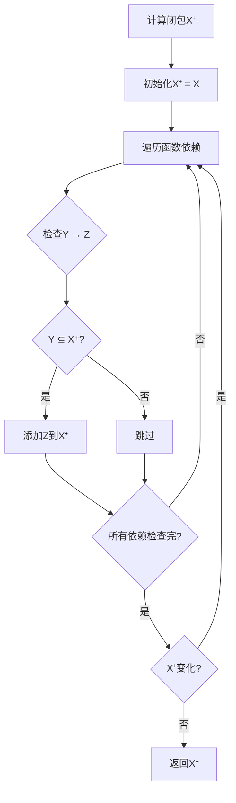
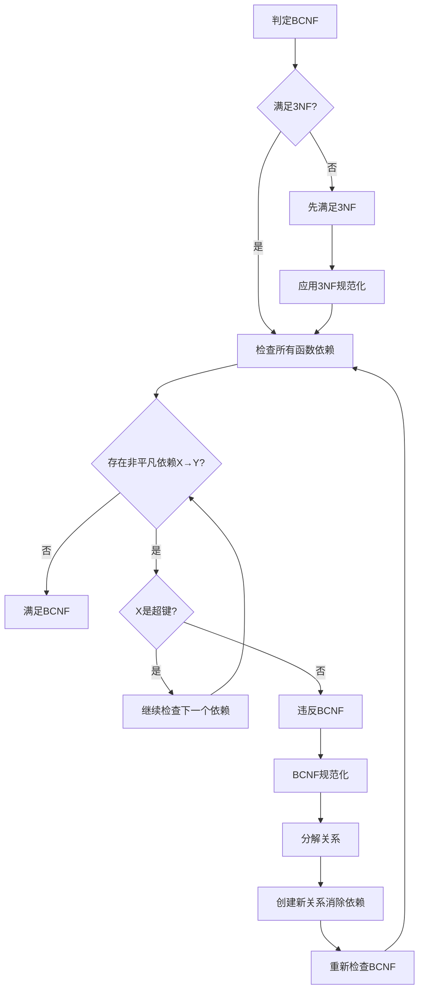

# 关系数据库理论：Codd定理与范式理论

> **创建日期**：2025-01-15
> **最后更新**：2025-01-15
> **版本**：v1.0
> **状态**：规划中

---

## 📋 目录

- [关系数据库理论：Codd定理与范式理论](#关系数据库理论codd定理与范式理论)
  - [📋 目录](#-目录)
  - [1. 概述](#1-概述)
    - [1.1. 关系数据库理论的重要性](#11-关系数据库理论的重要性)
    - [1.2. 核心内容](#12-核心内容)
  - [2. 关系模型基础](#2-关系模型基础)
    - [2.1. 关系的定义](#21-关系的定义)
    - [2.2. 关系的性质](#22-关系的性质)
    - [2.3. 关系操作](#23-关系操作)
  - [3. Codd定理](#3-codd定理)
    - [3.1. 定理陈述](#31-定理陈述)
    - [3.2. 关系代数](#32-关系代数)
    - [3.3. 关系演算](#33-关系演算)
    - [3.4. 安全域限制](#34-安全域限制)
    - [3.5. 等价性证明](#35-等价性证明)
  - [4. 函数依赖理论](#4-函数依赖理论)
    - [4.1. 函数依赖的定义](#41-函数依赖的定义)
    - [4.2. Armstrong公理](#42-armstrong公理)
    - [4.3. 函数依赖的闭包](#43-函数依赖的闭包)
      - [4.3.1. 闭包计算决策树](#431-闭包计算决策树)
      - [4.3.2. 闭包算法详细论证](#432-闭包算法详细论证)
      - [4.3.3. 闭包应用场景矩阵](#433-闭包应用场景矩阵)
    - [4.4. 函数依赖的覆盖](#44-函数依赖的覆盖)
  - [5. 范式理论](#5-范式理论)
    - [5.1. 第一范式（1NF）](#51-第一范式1nf)
    - [5.2. 第二范式（2NF）](#52-第二范式2nf)
    - [5.3. 第三范式（3NF）](#53-第三范式3nf)
    - [5.4. Boyce-Codd范式（BCNF）](#54-boyce-codd范式bcnf)
      - [5.4.1. BCNF判定决策树](#541-bcnf判定决策树)
      - [5.4.2. BCNF详细论证](#542-bcnf详细论证)
      - [5.4.3. 范式选择决策矩阵](#543-范式选择决策矩阵)
    - [5.5. 第四范式（4NF）](#55-第四范式4nf)
    - [5.6. 第五范式（5NF）](#56-第五范式5nf)
  - [6. 查询包含与等价性](#6-查询包含与等价性)
    - [6.1. 查询包含](#61-查询包含)
    - [6.2. 查询等价](#62-查询等价)
    - [6.3. 同态判定](#63-同态判定)
  - [7. 关系代数与关系演算](#7-关系代数与关系演算)
    - [7.1. 关系代数的完备性](#71-关系代数的完备性)
    - [7.2. 关系演算的安全性](#72-关系演算的安全性)
  - [8. 形式化证明](#8-形式化证明)
    - [8.1. Codd定理的证明](#81-codd定理的证明)
    - [8.2. Armstrong公理的完备性](#82-armstrong公理的完备性)
    - [8.3. 范式分解的正确性](#83-范式分解的正确性)
  - [9. 参考资料](#9-参考资料)
    - [9.1. 经典文献](#91-经典文献)
    - [9.2. 相关资源](#92-相关资源)

---

## 1. 概述

### 1.1. 关系数据库理论的重要性

关系数据库理论是数据库设计的数学基础，提供了：

1. **形式化基础**：基于集合论和一阶逻辑的严格数学框架
2. **设计指导**：范式理论指导数据库设计
3. **查询理论**：关系代数和关系演算的等价性
4. **优化基础**：查询包含和等价性判定

### 1.2. 核心内容

- **Codd定理**：关系代数与关系演算的等价性
- **函数依赖**：数据依赖关系的数学表示
- **范式理论**：数据库规范化的层次体系
- **查询理论**：查询包含和等价性判定

---

## 2. 关系模型基础

### 2.1. 关系的定义

**定义**：关系 R 是定义在属性集合 {A₁, A₂, ..., Aₙ} 上的一个子集

```text
R ⊆ dom(A₁) × dom(A₂) × ... × dom(Aₙ)
```

其中：

- **dom(Aᵢ)**：属性 Aᵢ 的值域
- **元组**：关系中的元素 t = (a₁, a₂, ..., aₙ)
- **度（Degree）**：属性的数量 n
- **基数（Cardinality）**：元组的数量 |R|

### 2.2. 关系的性质

1. **元组唯一性**：R 中不存在重复元组
2. **元组无序性**：元组的顺序无关紧要
3. **属性原子性**：每个属性的值都是原子的（不可再分）
4. **属性命名唯一性**：每个属性有唯一的名称

### 2.3. 关系操作

**基本操作**：

- **选择（Selection）**：σ_θ(R) = {t | t ∈ R ∧ θ(t)}
- **投影（Projection）**：π_A(R) = {t[A] | t ∈ R}
- **并（Union）**：R ∪ S = {t | t ∈ R ∨ t ∈ S}
- **差（Difference）**：R - S = {t | t ∈ R ∧ t ∉ S}
- **笛卡尔积（Cartesian Product）**：R × S = {(r, s) | r ∈ R ∧ s ∈ S}

**派生操作**：

- **交（Intersection）**：R ∩ S = R - (R - S)
- **连接（Join）**：R ⋈_θ S = σ_θ(R × S)
- **自然连接（Natural Join）**：R ⋈ S
- **除（Division）**：R ÷ S

---

## 3. Codd定理

### 3.1. 定理陈述

**Codd定理**：关系代数与关系演算（安全域限制）等价

```text
关系代数 ≡ 关系演算（安全域限制）
```

### 3.2. 关系代数

**关系代数**：基于集合运算的查询语言

**基本操作**：

```text
1. 选择：σ_θ(R)
2. 投影：π_A(R)
3. 并：R ∪ S
4. 差：R - S
5. 笛卡尔积：R × S
6. 重命名：ρ_{A→B}(R)
```

**示例**：

```text
-- 查询所有成绩为'A'的学生
σ_{grade='A'}(Enrollments)

-- 查询学生的姓名和邮箱
π_{name, email}(Students)

-- 查询选修了数据库课程的学生
π_{name}(Students ⋈ (σ_{title='Database Systems'}(Courses) ⋈ Enrollments))
```

### 3.3. 关系演算

**元组关系演算（TRC）**：

```text
{t | P(t)}
```

其中 P(t) 是元组 t 的谓词。

**示例**：

```text
-- 查询所有成绩为'A'的学生
{t | t ∈ Enrollments ∧ t.grade = 'A'}

-- 查询学生的姓名和邮箱
{t | ∃s ∈ Students (t.name = s.name ∧ t.email = s.email)}
```

**域关系演算（DRC）**：

```text
{<x₁, x₂, ..., xₙ> | P(x₁, x₂, ..., xₙ)}
```

### 3.4. 安全域限制

**安全域限制**：确保关系演算查询的结果是有限的

**条件**：

1. 所有自由变量都出现在某个关系的元组中
2. 所有存在量词和全称量词都有界

### 3.5. 等价性证明

**证明思路**：

1. **关系代数 ⊆ 关系演算**：
   - 每个关系代数操作都可以用关系演算表示
   - 通过归纳法证明

2. **关系演算 ⊆ 关系代数**：
   - 每个安全的关系演算查询都可以用关系代数表示
   - 通过范式化方法证明

---

## 4. 函数依赖理论

### 4.1. 函数依赖的定义

**定义**：给定关系 R，属性集合 X, Y ⊆ Attr(R)

```text
X → Y
```

当且仅当：

```text
∀ t₁, t₂ ∈ R, t₁[X] = t₂[X] ⟹ t₁[Y] = t₂[Y]
```

**读作**：X 函数决定 Y，或 Y 函数依赖于 X

### 4.2. Armstrong公理

**Armstrong公理系统**：

1. **自反性（Reflexivity）**：

   ```text
   如果 Y ⊆ X，则 X → Y
   ```

2. **增广性（Augmentation）**：

   ```text
   如果 X → Y，则 XZ → YZ
   ```

3. **传递性（Transitivity）**：

   ```text
   如果 X → Y 且 Y → Z，则 X → Z
   ```

### 4.3. 函数依赖的闭包

**闭包定义**：

```text
F⁺ = {X → Y | F ⊢ X → Y}
```

**详细论证**：

#### 4.3.1. 闭包计算决策树



#### 4.3.2. 闭包算法详细论证

**闭包算法**：

```text
算法：计算属性集合X的闭包X⁺
输入：函数依赖集合F，属性集合X
输出：X⁺

X⁺ := X
repeat
    oldX⁺ := X⁺
    for each Y → Z in F do
        if Y ⊆ X⁺ then
            X⁺ := X⁺ ∪ Z
until X⁺ = oldX⁺
return X⁺
```

**算法正确性证明**：

```text
需要证明：算法计算的X⁺等于F ⊢ X → Y的所有Y的集合

证明步骤：
  1. 包含性（X⁺ ⊆ {Y | F ⊢ X → Y}）：
     通过归纳法证明：
     - 基础：X ⊆ {Y | F ⊢ X → Y}（自反性）
     - 归纳：如果Y ⊆ X⁺且Y → Z ∈ F，则Z ∈ {Y | F ⊢ X → Y}
       （传递性）

  2. 完备性（{Y | F ⊢ X → Y} ⊆ X⁺）：
     反证法：假设存在A使得F ⊢ X → A但A ∉ X⁺
     构造反例关系，导出矛盾

  因此：X⁺ = {Y | F ⊢ X → Y} ✅
```

**算法复杂度分析**：

| 步骤 | 时间复杂度 | 空间复杂度 | 说明 |
|------|-----------|-----------|------|
| **初始化** | O(\|X\|) | O(\|X\|) | 设置初始闭包 |
| **迭代** | O(\|F\| × \|U\|) | O(\|U\|) | 最多\|U\|次迭代 |
| **总复杂度** | O(\|F\| × \|U\|²) | O(\|U\|) | U是属性集合 |

#### 4.3.3. 闭包应用场景矩阵

| 应用场景 | 使用闭包 | 复杂度 | 重要性 |
|---------|---------|--------|--------|
| **键判定** | 检查X⁺ = U | ⭐⭐⭐ | ⭐⭐⭐⭐⭐ |
| **函数依赖推导** | 检查Y ⊆ X⁺ | ⭐⭐⭐ | ⭐⭐⭐⭐⭐ |
| **范式判定** | 检查传递依赖 | ⭐⭐⭐⭐ | ⭐⭐⭐⭐ |
| **最小覆盖计算** | 计算闭包 | ⭐⭐⭐⭐⭐ | ⭐⭐⭐ |

### 4.4. 函数依赖的覆盖

**覆盖定义**：

函数依赖集合 F 覆盖 G（F ⊇ G），当且仅当：

```text
G⁺ ⊆ F⁺
```

**最小覆盖**：

函数依赖集合 F 是最小覆盖，当且仅当：

1. **右部单一化**：每个函数依赖的右部只有一个属性
2. **左部最小化**：不能从 F 中删除任何函数依赖
3. **无冗余**：不能从 F 中删除任何属性

---

## 5. 范式理论

### 5.1. 第一范式（1NF）

**定义**：关系 R 满足第一范式，当且仅当：

- R 的每个属性都是原子的（不可再分）

**示例**：

```text
-- 不满足1NF
Students(student_id, name, courses)  -- courses是集合

-- 满足1NF
Students(student_id, name)
Enrollments(student_id, course_id)
```

### 5.2. 第二范式（2NF）

**定义**：关系 R 满足第二范式，当且仅当：

1. R 满足 1NF
2. R 的每个非主属性完全函数依赖于主键

**示例**：

```text
-- 不满足2NF
Enrollments(student_id, course_id, course_title, grade)
-- course_title 部分依赖于 (student_id, course_id)

-- 满足2NF
Enrollments(student_id, course_id, grade)
Courses(course_id, course_title)
```

### 5.3. 第三范式（3NF）

**定义**：关系 R 满足第三范式，当且仅当：

1. R 满足 2NF
2. R 的每个非主属性不传递依赖于主键

**形式化**：

```text
对于每个非平凡函数依赖 X → Y：
- X 是超键，或
- Y 是主属性
```

**示例**：

```text
-- 不满足3NF
Students(student_id, name, department_id, department_name)
-- department_name 传递依赖于 student_id

-- 满足3NF
Students(student_id, name, department_id)
Departments(department_id, department_name)
```

### 5.4. Boyce-Codd范式（BCNF）

**定义**：关系 R 满足BCNF，当且仅当：

对于每个非平凡函数依赖 X → Y：

```text
X 是超键
```

**详细论证**：

#### 5.4.1. BCNF判定决策树



#### 5.4.2. BCNF详细论证

**BCNF定义分析**：

BCNF要求每个函数依赖的决定因素都是超键，这比3NF更严格：

- 3NF允许：如果Y是主属性，则X可以不是超键
- BCNF要求：无论Y是什么，X都必须是超键

**BCNF vs 3NF对比**：

| 特性 | 3NF | BCNF | 说明 |
|------|-----|------|------|
| **定义** | X是超键或Y是主属性 | X必须是超键 | BCNF更严格 |
| **冗余消除** | 部分消除 | 完全消除 | BCNF更好 |
| **依赖保持** | 可能保持 | 可能丢失 | 需要权衡 |
| **分解复杂度** | ⭐⭐⭐ | ⭐⭐⭐⭐ | BCNF更复杂 |
| **应用场景** | 一般应用 | 严格要求 | 根据需求选择 |

**BCNF分解算法**：

```text
算法：BCNF分解
输入：关系 R，函数依赖集合 F
输出：BCNF分解 {R₁, R₂, ..., Rₙ}

步骤：
1. 如果 R 满足 BCNF，返回 {R}
2. 否则，找到违反 BCNF 的函数依赖 X → Y
   （X 不是超键）
3. 分解 R 为：
   R₁ = XY
   R₂ = R - Y + X
4. 递归分解 R₁ 和 R₂
5. 返回所有分解结果
```

**BCNF vs 3NF**：

- BCNF 比 3NF 更强
- BCNF 消除了所有函数依赖导致的冗余
- 3NF 允许主属性对非主属性的传递依赖

#### 5.4.3. 范式选择决策矩阵

| 范式 | 冗余程度 | 依赖保持 | 查询性能 | 更新性能 | 推荐场景 |
|------|---------|---------|---------|---------|---------|
| **1NF** | 高 | ✅ | ⭐⭐⭐ | ⭐⭐⭐ | 基础要求 |
| **2NF** | 中 | ✅ | ⭐⭐⭐⭐ | ⭐⭐⭐⭐ | 有复合主键 |
| **3NF** | 低 | ✅ | ⭐⭐⭐⭐ | ⭐⭐⭐⭐⭐ | 一般应用 |
| **BCNF** | 最低 | 可能丢失 | ⭐⭐⭐ | ⭐⭐⭐⭐⭐ | 严格要求 |
| **4NF** | 最低 | 可能丢失 | ⭐⭐⭐ | ⭐⭐⭐⭐⭐ | 多值依赖 |
| **5NF** | 最低 | 可能丢失 | ⭐⭐ | ⭐⭐⭐⭐⭐ | 理论研究 |

### 5.5. 第四范式（4NF）

**定义**：关系 R 满足第四范式，当且仅当：

1. R 满足 BCNF
2. R 的每个非平凡多值依赖 X →→ Y 中，X 是超键

**多值依赖（MVD）**：

```text
X →→ Y
```

当且仅当：

```text
∀ t₁, t₂ ∈ R, t₁[X] = t₂[X] ⟹
    ∃ t₃, t₄ ∈ R:
        t₃[X] = t₁[X] ∧ t₃[Y] = t₁[Y] ∧ t₃[Z] = t₂[Z]
        t₄[X] = t₁[X] ∧ t₄[Y] = t₂[Y] ∧ t₄[Z] = t₁[Z]
```

其中 Z = Attr(R) - X - Y

### 5.6. 第五范式（5NF）

**定义**：关系 R 满足第五范式，当且仅当：

1. R 满足 4NF
2. R 的每个非平凡连接依赖都是超键依赖

**连接依赖（JD）**：

```text
⋈(R₁, R₂, ..., Rₙ)
```

当且仅当：

```text
R = π_{Attr(R₁)}(R) ⋈ π_{Attr(R₂)}(R) ⋈ ... ⋈ π_{Attr(Rₙ)}(R)
```

---

## 6. 查询包含与等价性

### 6.1. 查询包含

**定义**：查询 Q₁ 包含查询 Q₂（Q₁ ⊇ Q₂），当且仅当：

```text
对于所有数据库实例 I，Q₁(I) ⊇ Q₂(I)
```

### 6.2. 查询等价

**定义**：查询 Q₁ 等价于查询 Q₂（Q₁ ≡ Q₂），当且仅当：

```text
Q₁ ⊇ Q₂ 且 Q₂ ⊇ Q₁
```

### 6.3. 同态判定

**定理**：对于SPJ查询（选择-投影-连接），查询包含可以通过同态判定

**同态定义**：

查询 Q₁ 到 Q₂ 的同态 h，满足：

1. **表映射**：h 将 Q₁ 的表映射到 Q₂ 的表
2. **属性映射**：h 保持属性对应关系
3. **条件保持**：Q₁ 的条件在 Q₂ 中成立

**判定算法**：

```text
算法：SPJ查询包含判定
输入：查询 Q₁, Q₂
输出：Q₁ ⊇ Q₂ 是否成立

1. 构造 Q₁ 的查询图
2. 构造 Q₂ 的查询图
3. 寻找从 Q₂ 到 Q₁ 的同态
4. 如果存在同态，则 Q₁ ⊇ Q₂
```

---

## 7. 关系代数与关系演算

### 7.1. 关系代数的完备性

**定理**：关系代数是关系完备的

**证明**：

通过Codd定理，关系代数等价于关系演算，因此是关系完备的。

### 7.2. 关系演算的安全性

**安全域限制**：

确保关系演算查询的结果是有限的，避免无限关系。

**安全规则**：

1. 所有自由变量都出现在某个关系的元组中
2. 所有存在量词和全称量词都有界

---

## 8. 形式化证明

### 8.1. Codd定理的证明

**定理**：关系代数与关系演算（安全域限制）等价

**证明**：

**部分1：关系代数 ⊆ 关系演算**:

对关系代数操作进行归纳：

1. **选择**：σ_θ(R) = {t | t ∈ R ∧ θ(t)}
2. **投影**：π_A(R) = {t[A] | ∃s ∈ R (t = s[A])}
3. **并**：R ∪ S = {t | t ∈ R ∨ t ∈ S}
4. **差**：R - S = {t | t ∈ R ∧ t ∉ S}
5. **笛卡尔积**：R × S = {(r, s) | r ∈ R ∧ s ∈ S}

**部分2：关系演算 ⊆ 关系代数**:

对关系演算公式进行归纳：

1. **原子公式**：R(t) 对应关系 R
2. **合取**：P ∧ Q 对应选择操作
3. **析取**：P ∨ Q 对应并操作
4. **否定**：¬P 对应差操作
5. **存在量词**：∃x P(x) 对应投影操作

### 8.2. Armstrong公理的完备性

**定理**：Armstrong公理是完备的

**证明**：

通过反证法，假设存在函数依赖 X → Y 不能从 F 通过Armstrong公理推导，但 F ⊨ X → Y，则导出矛盾。

### 8.3. 范式分解的正确性

**定理**：3NF分解保持函数依赖且无损

**证明**：

通过3NF分解算法，保证：

1. 每个分解后的关系满足3NF
2. 函数依赖被保持
3. 分解是无损的（通过连接测试）

---

## 9. 参考资料

### 9.1. 经典文献

- Codd, E.F. (1970). "A Relational Model of Data for Large Shared Data Banks"
- Date, C.J. (1981). "An Introduction to Database Systems"
- Maier, D. (1983). "The Theory of Relational Databases"
- Bernstein, P.A. (1976). "Synthesizing Third Normal Form Relations"

### 9.2. 相关资源

- [Wikipedia: Relational Model](https://en.wikipedia.org/wiki/Relational_model)
- [Wikipedia: Database Normalization](https://en.wikipedia.org/wiki/Database_normalization)
- [Wikipedia: Functional Dependency](https://en.wikipedia.org/wiki/Functional_dependency)
- [PostgreSQL关系数据模型文档](../PostgreSQL/01-核心基础/01.02-关系数据模型与理论.md)

---

**最后更新**：2025-01-15
**维护者**：Data-Science Team
**状态**：规划中
