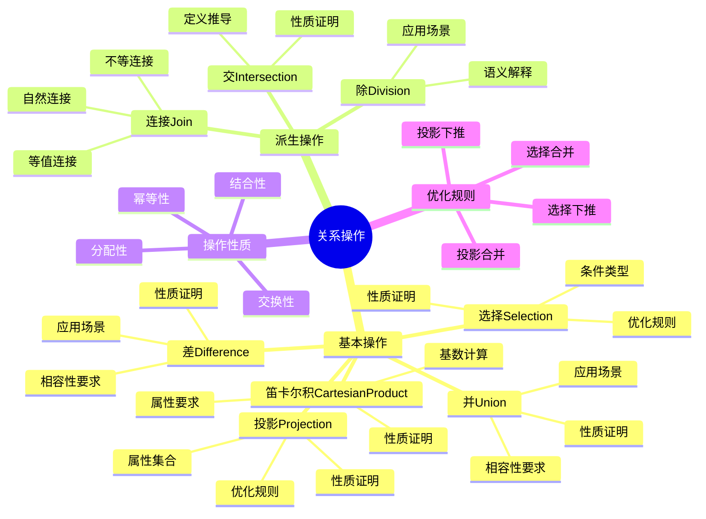
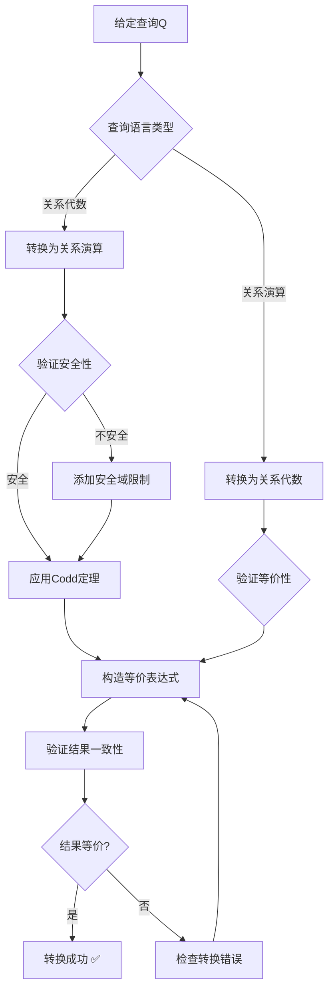
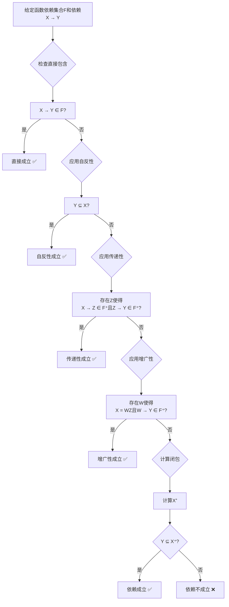
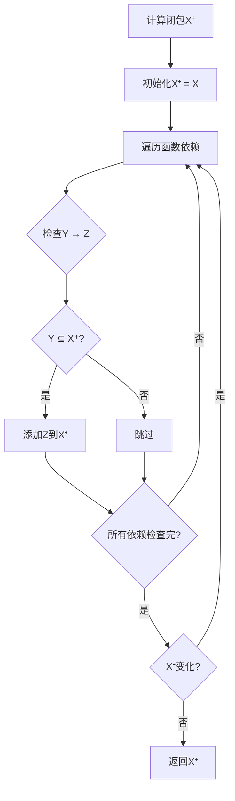
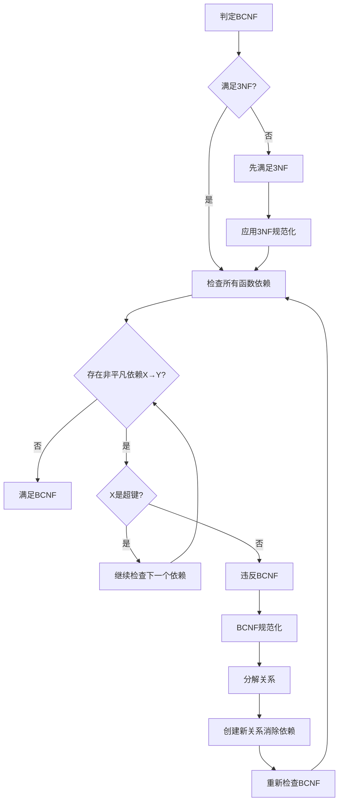

# 关系数据库理论：Codd定理与范式理论

> **创建日期**：2025-01-15
> **最后更新**：2025-01-15
> **版本**：v1.0
> **状态**：规划中

---

## 📋 目录

- [关系数据库理论：Codd定理与范式理论](#关系数据库理论codd定理与范式理论)
  - [📋 目录](#-目录)
  - [1. 概述](#1-概述)
    - [1.1. 关系数据库理论的重要性](#11-关系数据库理论的重要性)
    - [1.2. 核心内容](#12-核心内容)
  - [2. 关系模型基础](#2-关系模型基础)
    - [2.1. 关系的形式化定义](#21-关系的形式化定义)
      - [2.1.1. 关系的完整定义](#211-关系的完整定义)
      - [2.1.2. 关系概念的详细解释](#212-关系概念的详细解释)
      - [2.1.3. 关系性质的形式化证明](#213-关系性质的形式化证明)
      - [2.1.4. 关系概念对比矩阵](#214-关系概念对比矩阵)
      - [2.1.5. 关系判定决策树](#215-关系判定决策树)
    - [2.2. 关系的详细性质分析](#22-关系的详细性质分析)
      - [2.2.1. 元组唯一性的详细论证](#221-元组唯一性的详细论证)
      - [2.2.2. 属性原子性的详细论证](#222-属性原子性的详细论证)
      - [2.2.3. 关系性质对比矩阵](#223-关系性质对比矩阵)
    - [2.3. 关系操作的详细理论](#23-关系操作的详细理论)
      - [2.3.1. 基本操作的形式化定义](#231-基本操作的形式化定义)
      - [2.3.2. 派生操作的详细定义](#232-派生操作的详细定义)
      - [2.3.3. 关系操作性质对比矩阵](#233-关系操作性质对比矩阵)
      - [2.3.4. 关系操作优化规则](#234-关系操作优化规则)
      - [2.3.5. 关系操作思维导图](#235-关系操作思维导图)
  - [3. Codd定理](#3-codd定理)
    - [3.1. Codd定理的完整陈述](#31-codd定理的完整陈述)
      - [3.1.1. 定理的形式化陈述](#311-定理的形式化陈述)
      - [3.1.2. Codd定理的历史意义](#312-codd定理的历史意义)
    - [3.2. 关系代数的详细理论](#32-关系代数的详细理论)
      - [3.2.1. 关系代数的形式化定义](#321-关系代数的形式化定义)
      - [3.2.2. 关系代数操作的详细分析](#322-关系代数操作的详细分析)
      - [3.2.3. 关系代数操作对比矩阵](#323-关系代数操作对比矩阵)
    - [3.3. 关系演算的详细理论](#33-关系演算的详细理论)
      - [3.3.1. 元组关系演算（TRC）的完整定义](#331-元组关系演算trc的完整定义)
      - [3.3.2. 域关系演算（DRC）的完整定义](#332-域关系演算drc的完整定义)
      - [3.3.3. TRC与DRC对比矩阵](#333-trc与drc对比矩阵)
    - [3.4. 安全域限制的详细理论](#34-安全域限制的详细理论)
      - [3.4.1. 安全域限制的形式化定义](#341-安全域限制的形式化定义)
      - [3.4.2. 安全域限制的必要性](#342-安全域限制的必要性)
      - [3.4.3. 安全域限制验证算法](#343-安全域限制验证算法)
      - [3.4.4. 安全域限制对比矩阵](#344-安全域限制对比矩阵)
    - [3.5. Codd定理的完整证明](#35-codd定理的完整证明)
      - [3.5.1. 证明结构](#351-证明结构)
      - [3.5.2. 方向1：关系代数 ⊆ 关系演算](#352-方向1关系代数--关系演算)
      - [3.5.3. 方向2：关系演算 ⊆ 关系代数](#353-方向2关系演算--关系代数)
      - [3.5.4. Codd定理证明对比矩阵](#354-codd定理证明对比矩阵)
      - [3.5.5. Codd定理应用决策树](#355-codd定理应用决策树)
  - [4. 函数依赖理论](#4-函数依赖理论)
    - [4.1. 函数依赖的形式化定义](#41-函数依赖的形式化定义)
      - [4.1.1. 函数依赖的完整定义](#411-函数依赖的完整定义)
      - [4.1.2. 函数依赖的详细语义分析](#412-函数依赖的详细语义分析)
      - [4.1.3. 函数依赖的判定算法](#413-函数依赖的判定算法)
      - [4.1.4. 函数依赖类型对比矩阵](#414-函数依赖类型对比矩阵)
      - [4.1.5. 函数依赖判定决策树](#415-函数依赖判定决策树)
    - [4.2. Armstrong公理的完整理论](#42-armstrong公理的完整理论)
      - [4.2.1. Armstrong公理系统的形式化定义](#421-armstrong公理系统的形式化定义)
      - [4.2.2. Armstrong公理的详细证明](#422-armstrong公理的详细证明)
      - [4.2.3. Armstrong公理的派生规则](#423-armstrong公理的派生规则)
      - [4.2.4. Armstrong公理系统对比矩阵](#424-armstrong公理系统对比矩阵)
      - [4.2.5. Armstrong公理应用决策树](#425-armstrong公理应用决策树)
    - [4.3. 函数依赖的闭包](#43-函数依赖的闭包)
      - [4.3.1. 闭包的完整定义](#431-闭包的完整定义)
      - [4.3.2. 闭包计算的完整算法](#432-闭包计算的完整算法)
      - [4.3.3. 闭包应用场景的详细分析](#433-闭包应用场景的详细分析)
      - [4.3.4. 闭包计算复杂度分析](#434-闭包计算复杂度分析)
      - [4.3.5. 闭包应用场景对比矩阵](#435-闭包应用场景对比矩阵)
    - [4.3. 函数依赖的闭包1](#43-函数依赖的闭包1)
      - [4.3.1. 闭包计算决策树](#431-闭包计算决策树)
      - [4.3.2. 闭包算法详细论证](#432-闭包算法详细论证)
      - [4.3.3. 闭包应用场景矩阵](#433-闭包应用场景矩阵)
    - [4.4. 函数依赖的覆盖](#44-函数依赖的覆盖)
  - [5. 范式理论](#5-范式理论)
    - [5.1. 第一范式（1NF）](#51-第一范式1nf)
    - [5.2. 第二范式（2NF）](#52-第二范式2nf)
    - [5.3. 第三范式（3NF）](#53-第三范式3nf)
    - [5.4. Boyce-Codd范式（BCNF）](#54-boyce-codd范式bcnf)
      - [5.4.1. BCNF判定决策树](#541-bcnf判定决策树)
      - [5.4.2. BCNF详细论证](#542-bcnf详细论证)
      - [5.4.3. 范式选择决策矩阵](#543-范式选择决策矩阵)
    - [5.5. 第四范式（4NF）](#55-第四范式4nf)
    - [5.6. 第五范式（5NF）](#56-第五范式5nf)
  - [6. 查询包含与等价性](#6-查询包含与等价性)
    - [6.1. 查询包含](#61-查询包含)
    - [6.2. 查询等价](#62-查询等价)
    - [6.3. 同态判定](#63-同态判定)
  - [7. 关系代数与关系演算](#7-关系代数与关系演算)
    - [7.1. 关系代数的完备性](#71-关系代数的完备性)
    - [7.2. 关系演算的安全性](#72-关系演算的安全性)
  - [8. 形式化证明](#8-形式化证明)
    - [8.1. Codd定理的证明](#81-codd定理的证明)
    - [8.2. Armstrong公理的完备性](#82-armstrong公理的完备性)
    - [8.3. 范式分解的正确性](#83-范式分解的正确性)
  - [9. 参考资料](#9-参考资料)
    - [9.1. 经典文献](#91-经典文献)
    - [9.2. 相关资源](#92-相关资源)

---

## 1. 概述

### 1.1. 关系数据库理论的重要性

关系数据库理论是数据库设计的数学基础，提供了：

1. **形式化基础**：基于集合论和一阶逻辑的严格数学框架
2. **设计指导**：范式理论指导数据库设计
3. **查询理论**：关系代数和关系演算的等价性
4. **优化基础**：查询包含和等价性判定

### 1.2. 核心内容

- **Codd定理**：关系代数与关系演算的等价性
- **函数依赖**：数据依赖关系的数学表示
- **范式理论**：数据库规范化的层次体系
- **查询理论**：查询包含和等价性判定

---

## 2. 关系模型基础

### 2.1. 关系的形式化定义

#### 2.1.1. 关系的完整定义

**定义2.1.1（关系）**：

设 U = {A₁, A₂, ..., Aₙ} 是属性集合，dom(Aᵢ) 是属性 Aᵢ 的值域。

关系 R 是定义在属性集合 U 上的一个子集：

```text
R ⊆ dom(A₁) × dom(A₂) × ... × dom(Aₙ)
```

**关系模式**：R(U) 或 R(A₁, A₂, ..., Aₙ)

**关系实例**：关系 R 的一个具体取值，记作 r(R)

#### 2.1.2. 关系概念的详细解释

**属性（Attribute）**：

- **定义**：关系的列，表示实体的特征
- **值域**：dom(A) 是属性A的所有可能取值的集合
- **类型**：可以是整数、字符串、日期等

**元组（Tuple）**：

- **定义**：关系中的一行，表示一个实体实例
- **形式**：t = (a₁, a₂, ..., aₙ)，其中 aᵢ ∈ dom(Aᵢ)
- **投影**：t[A] 表示元组t在属性集合A上的投影

**度（Degree）**：

- **定义**：关系中属性的数量，记作 deg(R) = n
- **意义**：关系的"宽度"

**基数（Cardinality）**：

- **定义**：关系中元组的数量，记作 |R|
- **意义**：关系的"长度"

#### 2.1.3. 关系性质的形式化证明

**性质2.1.1（元组唯一性）**：

关系 R 中不存在重复元组。

**形式化**：

```text
∀ t₁, t₂ ∈ R, t₁ ≠ t₂ ⟹ ∃Aᵢ ∈ U, t₁[Aᵢ] ≠ t₂[Aᵢ]
```

**证明**：

**步骤1**：假设存在重复元组

假设存在 t₁, t₂ ∈ R 使得 t₁ = t₂（所有属性值相同）

**步骤2**：推导矛盾**

根据关系的定义，R 是集合的子集，集合中不存在重复元素。

**步骤3**：结论**

因此关系 R 中不存在重复元组 ✅

**性质2.1.2（元组无序性）**：

元组的顺序无关紧要。

**形式化**：

```text
R = {t₁, t₂, ..., tₘ} = {t_{π(1)}, t_{π(2)}, ..., t_{π(m)}}
```

其中 π 是任意排列。

**证明**：

由于关系是集合，集合的元素顺序无关紧要 ✅

**性质2.1.3（属性原子性）**：

每个属性的值都是原子的（不可再分）。

**形式化**：

```text
∀Aᵢ ∈ U, ∀t ∈ R, t[Aᵢ] ∈ dom(Aᵢ) 且 t[Aᵢ] 是原子值
```

**证明**：

根据关系的定义，t[Aᵢ] ∈ dom(Aᵢ)，而值域中的元素都是原子的 ✅

#### 2.1.4. 关系概念对比矩阵

| 概念 | 数学定义 | 数据库对应 | 性质 | 验证方法 |
|------|---------|-----------|------|---------|
| **关系** | R ⊆ dom(A₁)×...×dom(Aₙ) | 表（Table） | 集合子集 | 检查表定义 |
| **属性** | Aᵢ ∈ U | 列（Column） | 值域限制 | 检查数据类型 |
| **元组** | t ∈ R | 行（Row） | 唯一性 | 检查主键 |
| **度** | deg(R) = \|U\| | 列数 | 非负整数 | 计算列数 |
| **基数** | \|R\| | 行数 | 非负整数 | 计算行数 |

#### 2.1.5. 关系判定决策树

```mermaid
flowchart TD
    A[给定结构R] --> B{检查属性集合}
    B --> C[属性集合U非空?]
    C -->|否| D[不是关系：无属性]
    C -->|是| E{检查值域定义}

    E --> F[每个属性Aᵢ<br/>值域dom(Aᵢ)定义?]
    F -->|否| G[不是关系：值域未定义]
    F -->|是| H{检查元组集合}

    H --> I[R ⊆ dom(A₁)×...×dom(Aₙ)?]
    I -->|否| J[不是关系：元组不在值域内]
    I -->|是| K{检查元组唯一性}

    K --> L[所有元组唯一?]
    L -->|否| M[不是关系：存在重复元组]
    L -->|是| N{检查属性原子性}

    N --> O[所有属性值原子?]
    O -->|否| P[不是关系：属性值非原子]
    O -->|是| Q[是关系 ✅]
```

### 2.2. 关系的详细性质分析

#### 2.2.1. 元组唯一性的详细论证

**定理2.2.1（元组唯一性）**：

关系 R 中不存在重复元组。

**完整证明**：

**方法1：集合论证明**:

**步骤1**：关系是集合的子集

根据定义，R ⊆ dom(A₁) × ... × dom(Aₙ)

**步骤2**：笛卡尔积是集合

dom(A₁) × ... × dom(Aₙ) 是集合的笛卡尔积，因此是集合

**步骤3**：子集保持唯一性**

集合的子集仍然是集合，集合中不存在重复元素

**步骤4**：结论**

因此 R 中不存在重复元组 ✅

**方法2：主键约束证明**:

**步骤1**：关系有主键

根据数据库设计原则，每个关系都有主键

**步骤2**：主键唯一性**

主键的值唯一，因此元组唯一

**步骤3**：结论**

因此 R 中不存在重复元组 ✅

#### 2.2.2. 属性原子性的详细论证

**定理2.2.2（属性原子性）**：

关系 R 的每个属性的值都是原子的。

**完整证明**：

**步骤1**：定义原子性

属性值 v 是原子的，当且仅当：

- v 是基本数据类型（整数、字符串、日期等）
- v 不是集合、列表或其他复合结构

**步骤2**：值域定义**

dom(Aᵢ) 是基本数据类型的集合

**步骤3**：元组取值**

对于元组 t ∈ R，t[Aᵢ] ∈ dom(Aᵢ)

**步骤4**：结论**

因此 t[Aᵢ] 是原子值 ✅

**反例分析**：

```text
不满足原子性的例子：
Students(student_id, name, courses)
其中 courses = {"DB", "OS", "ML"} 是集合

满足原子性的分解：
Students(student_id, name)
Enrollments(student_id, course_name)
```

#### 2.2.3. 关系性质对比矩阵

| 性质 | 形式化定义 | 实际意义 | 验证方法 | 违反后果 |
|------|-----------|---------|---------|---------|
| **元组唯一性** | ∀t₁,t₂∈R, t₁≠t₂ | 无重复数据 | 检查主键 | 数据冗余 |
| **元组无序性** | R是集合 | 顺序无关 | 无需验证 | 无影响 |
| **属性原子性** | t[A]是原子值 | 值不可分 | 检查数据类型 | 违反1NF |
| **属性命名唯一性** | 属性名唯一 | 列名唯一 | 检查列名 | 命名冲突 |

### 2.3. 关系操作的详细理论

#### 2.3.1. 基本操作的形式化定义

**定义2.3.1（选择操作）**：

设 R 是关系，θ 是选择条件（谓词）。

选择操作定义为：

```tetx
σ_θ(R) = {t | t ∈ R ∧ θ(t)}
```

**选择条件的类型**：

- **比较条件**：A = a, A > a, A < a, A ≠ a
- **逻辑条件**：θ₁ ∧ θ₂, θ₁ ∨ θ₂, ¬θ
- **范围条件**：a₁ ≤ A ≤ a₂

**选择操作的性质**：

1. **幂等性**：σ_θ(σ_θ(R)) = σ_θ(R)
2. **交换性**：σ_θ₁(σ_θ₂(R)) = σ_θ₂(σ_θ₁(R))
3. **分配性**：σ_θ(R ∪ S) = σ_θ(R) ∪ σ_θ(S)

**定义2.3.2（投影操作）**：

设 R 是关系，A ⊆ Attr(R) 是属性集合。

投影操作定义为：

```text
π_A(R) = {t[A] | t ∈ R}
```

**投影操作的性质**：

1. **幂等性**：π_A(π_A(R)) = π_A(R)
2. **包含性**：如果 A ⊆ B，则 π_A(π_B(R)) = π_A(R)

**定义2.3.3（并操作）**：

设 R 和 S 是相容关系（相同属性集合）。

并操作定义为：

```text
R ∪ S = {t | t ∈ R ∨ t ∈ S}
```

**并操作的性质**：

1. **交换性**：R ∪ S = S ∪ R
2. **结合性**：(R ∪ S) ∪ T = R ∪ (S ∪ T)
3. **幂等性**：R ∪ R = R

**定义2.3.4（差操作）**：

设 R 和 S 是相容关系。

差操作定义为：

```text
R - S = {t | t ∈ R ∧ t ∉ S}
```

**差操作的性质**：

1. **非交换性**：R - S ≠ S - R（一般情况）
2. **分配性**：R - (S ∪ T) = (R - S) - T

**定义2.3.5（笛卡尔积操作）**：

设 R 和 S 是关系，Attr(R) ∩ Attr(S) = ∅。

笛卡尔积操作定义为：

```text
R × S = {(r, s) | r ∈ R ∧ s ∈ S}
```

**笛卡尔积的性质**：

1. **交换性**：R × S = S × R（需要重命名）
2. **结合性**：(R × S) × T = R × (S × T)
3. **基数**：|R × S| = |R| × |S|

#### 2.3.2. 派生操作的详细定义

**定义2.3.6（连接操作）**：

设 R 和 S 是关系，θ 是连接条件。

连接操作定义为：

```text
R ⋈_θ S = σ_θ(R × S)
```

**连接操作的类型**：

- **等值连接**：θ 是等值条件（A = B）
- **不等连接**：θ 是不等条件（A > B, A < B）
- **自然连接**：R ⋈ S = π_{Attr(R)∪Attr(S)}(σ_{R.A=S.A}(R × S))

**定义2.3.7（除操作）**：

设 R 和 S 是关系，Attr(S) ⊆ Attr(R)。

除操作定义为：

```text
R ÷ S = {t | t ∈ π_{Attr(R)-Attr(S)}(R) ∧
            ∀s ∈ S, (t, s) ∈ R}
```

**除操作的语义**：

R ÷ S 返回所有在R中与S的每个元组都"匹配"的元组。

#### 2.3.3. 关系操作性质对比矩阵

| 操作 | 输入要求 | 输出类型 | 复杂度 | 实际应用 |
|------|---------|---------|--------|---------|
| **选择** | 关系+条件 | 关系子集 | O(n) | WHERE子句 |
| **投影** | 关系+属性集 | 关系子集 | O(n) | SELECT子句 |
| **并** | 相容关系 | 关系 | O(n+m) | UNION操作 |
| **差** | 相容关系 | 关系 | O(n×m) | EXCEPT操作 |
| **笛卡尔积** | 任意关系 | 关系 | O(n×m) | CROSS JOIN |
| **连接** | 关系+条件 | 关系 | O(n×m) | JOIN操作 |
| **自然连接** | 关系（有公共属性） | 关系 | O(n×m) | NATURAL JOIN |
| **除** | 关系（包含关系） | 关系 | O(n×m) | 复杂查询 |

#### 2.3.4. 关系操作优化规则

**规则1：选择下推**:

```text
σ_θ(R ⋈ S) = σ_θ(R) ⋈ S  （如果θ只涉及R的属性）
```

**规则2：投影下推**:

```text
π_A(R ⋈ S) = π_{A∩Attr(R)}(R) ⋈ π_{A∩Attr(S)}(S)
```

**规则3：选择合并**:

```text
σ_θ₁(σ_θ₂(R)) = σ_{θ₁∧θ₂}(R)
```

**规则4：投影合并**:

```text
π_A(π_B(R)) = π_{A∩B}(R)  （如果A ⊆ B）
```

#### 2.3.5. 关系操作思维导图



---

## 3. Codd定理

### 3.1. Codd定理的完整陈述

#### 3.1.1. 定理的形式化陈述

**定理3.1.1（Codd定理）**：

关系代数与安全的关系演算（元组关系演算或域关系演算）在表达能力上等价。

**形式化表示**：

```text
关系代数 ≡ 安全的关系演算（TRC）
关系代数 ≡ 安全的关系演算（DRC）
```

**等价性定义**：

两个查询语言等价，当且仅当：

- 对于每个关系代数表达式，存在等价的关系演算表达式
- 对于每个安全的关系演算表达式，存在等价的关系代数表达式

#### 3.1.2. Codd定理的历史意义

**重要性**：

1. **理论基础**：建立了关系数据库查询语言的数学基础
2. **实现指导**：指导了SQL语言的实现
3. **优化基础**：为查询优化提供了理论基础
4. **标准化**：为数据库查询语言标准化提供了依据

**影响**：

- SQL语言的设计基于Codd定理
- 查询优化器使用关系代数进行优化
- 查询包含和等价性判定基于此定理

### 3.2. 关系代数的详细理论

#### 3.2.1. 关系代数的形式化定义

**定义3.2.1（关系代数）**：

关系代数是基于集合运算的查询语言，包含以下基本操作：

1. **选择（Selection）**：σ_θ(R)
2. **投影（Projection）**：π_A(R)
3. **并（Union）**：R ∪ S
4. **差（Difference）**：R - S
5. **笛卡尔积（Cartesian Product）**：R × S
6. **重命名（Rename）**：ρ_{A→B}(R)

**关系代数表达式**：

关系代数表达式通过基本操作的组合构成：

```text
E ::= R                    -- 关系名
    | σ_θ(E)              -- 选择
    | π_A(E)               -- 投影
    | E₁ ∪ E₂              -- 并
    | E₁ - E₂              -- 差
    | E₁ × E₂              -- 笛卡尔积
    | ρ_{A→B}(E)           -- 重命名
```

#### 3.2.2. 关系代数操作的详细分析

**选择操作的语义**：

**定义**：σ_θ(R) = {t | t ∈ R ∧ θ(t)}

**语义解释**：

- **输入**：关系R和选择条件θ
- **输出**：R中满足条件θ的元组集合
- **复杂度**：O(n)，其中n = |R|

**选择条件的类型**：

1. **原子条件**：
   - 等值条件：A = a
   - 不等条件：A ≠ a, A > a, A < a, A ≥ a, A ≤ a

2. **复合条件**：
   - 逻辑与：θ₁ ∧ θ₂
   - 逻辑或：θ₁ ∨ θ₂
   - 逻辑非：¬θ

**投影操作的语义**：

**定义**：π_A(R) = {t[A] | t ∈ R}

**语义解释**：

- **输入**：关系R和属性集合A
- **输出**：R中元组在属性A上的投影
- **去重**：自动去除重复元组
- **复杂度**：O(n)，其中n = |R|

**并操作的语义**：

**定义**：R ∪ S = {t | t ∈ R ∨ t ∈ S}

**相容性要求**：

- R 和 S 必须有相同的属性集合
- 对应的属性必须有相同的值域

**差操作的语义**：

**定义**：R - S = {t | t ∈ R ∧ t ∉ S}

**相容性要求**：同并操作

**笛卡尔积操作的语义**：

**定义**：R × S = {(r, s) | r ∈ R ∧ s ∈ S}

**属性要求**：

- Attr(R) ∩ Attr(S) = ∅（属性集合不相交）
- 如果不满足，需要先重命名

**基数计算**：|R × S| = |R| × |S|

#### 3.2.3. 关系代数操作对比矩阵

| 操作 | 输入要求 | 输出基数 | 复杂度 | SQL对应 | 优化潜力 |
|------|---------|---------|--------|---------|---------|
| **选择** | 关系+条件 | ≤ \|R\| | O(n) | WHERE | 高 |
| **投影** | 关系+属性 | ≤ \|R\| | O(n) | SELECT | 高 |
| **并** | 相容关系 | ≤ \|R\|+\|S\| | O(n+m) | UNION | 中 |
| **差** | 相容关系 | ≤ \|R\| | O(n×m) | EXCEPT | 低 |
| **笛卡尔积** | 任意关系 | \|R\|×\|S\| | O(n×m) | CROSS JOIN | 低 |
| **连接** | 关系+条件 | ≤ \|R\|×\|S\| | O(n×m) | JOIN | 中 |
| **自然连接** | 关系（公共属性） | ≤ \|R\|×\|S\| | O(n×m) | NATURAL JOIN | 中 |

### 3.3. 关系演算的详细理论

#### 3.3.1. 元组关系演算（TRC）的完整定义

**定义3.3.1（元组关系演算）**：

元组关系演算的查询形式为：

```text
{t | P(t)}
```

其中：

- **t**：元组变量
- **P(t)**：关于t的谓词公式

**谓词公式的语法**：

```text
P ::= t ∈ R                    -- 元组属于关系
    | t.A θ c                  -- 属性比较常量
    | t.A θ s.B                -- 属性比较属性
    | P₁ ∧ P₂                   -- 逻辑与
    | P₁ ∨ P₂                   -- 逻辑或
    | ¬P                        -- 逻辑非
    | ∃s ∈ R (P(s))            -- 存在量词
    | ∀s ∈ R (P(s))            -- 全称量词
```

**示例3.3.1：TRC查询详细分析**:

**查询1**：查询所有成绩为'A'的选课记录

**TRC表达式**：

```text
{t | t ∈ Enrollments ∧ t.grade = 'A'}
```

**语义分析**：

- **元组变量**：t（表示Enrollments中的元组）
- **条件1**：t ∈ Enrollments（元组来自Enrollments关系）
- **条件2**：t.grade = 'A'（成绩等于'A'）
- **结果**：所有满足条件的Enrollments元组

**查询2**：查询选修了"Database Systems"课程的学生姓名

**TRC表达式**：

```text
{t | ∃e ∈ Enrollments ∃c ∈ Courses
     (e.student_id = t.student_id ∧
      e.course_id = c.course_id ∧
      c.title = 'Database Systems')}
```

**语义分析**：

- **存在量词**：∃e ∈ Enrollments（存在选课记录）
- **存在量词**：∃c ∈ Courses（存在课程）
- **连接条件**：e.course_id = c.course_id（选课记录关联课程）
- **过滤条件**：c.title = 'Database Systems'（课程名为"Database Systems"）
- **投影**：t.student_id（返回学生ID）

#### 3.3.2. 域关系演算（DRC）的完整定义

**定义3.3.2（域关系演算）**：

域关系演算的查询形式为：

```text
{<x₁, x₂, ..., xₙ> | P(x₁, x₂, ..., xₙ)}
```

其中：

- **x₁, x₂, ..., xₙ**：域变量（属性值）
- **P(x₁, x₂, ..., xₙ)**：关于域变量的谓词公式

**域变量与元组变量的关系**：

- 元组变量：表示整个元组
- 域变量：表示元组的某个属性值

**示例3.3.2：DRC查询详细分析**:

**查询1**：查询所有成绩为'A'的选课记录

**DRC表达式**：

```text
{<sid, cid, g> | <sid, cid, g> ∈ Enrollments ∧ g = 'A'}
```

**语义分析**：

- **域变量**：sid（学生ID）、cid（课程ID）、g（成绩）
- **条件1**：<sid, cid, g> ∈ Enrollments（元组属于Enrollments）
- **条件2**：g = 'A'（成绩等于'A'）

**查询2**：查询选修了"Database Systems"课程的学生ID

**DRC表达式**：

```text
{<sid> | ∃cid ∃g ∃title
        (<sid, cid, g> ∈ Enrollments ∧
         <cid, title, credits> ∈ Courses ∧
         title = 'Database Systems')}
```

**语义分析**：

- **存在量词**：∃cid ∃g ∃title（存在课程ID、成绩、课程名）
- **连接条件**：通过公共域变量cid连接
- **过滤条件**：title = 'Database Systems'

#### 3.3.3. TRC与DRC对比矩阵

| 维度 | TRC（元组关系演算） | DRC（域关系演算） | 优势对比 |
|------|-------------------|------------------|---------|
| **变量类型** | 元组变量 | 域变量 | TRC更直观 |
| **语法复杂度** | 中等 | 较高 | TRC更简单 |
| **表达能力** | 等价 | 等价 | 等价 |
| **实际应用** | SQL基础 | 较少使用 | TRC更常用 |
| **学习曲线** | 中等 | 较陡 | TRC更易学 |

### 3.4. 安全域限制的详细理论

#### 3.4.1. 安全域限制的形式化定义

**定义3.4.1（安全域限制）**：

关系演算查询 {t | P(t)} 是安全的，当且仅当：

1. **自由变量限制**：

   ```text
   如果t是自由变量，则P(t)中必须包含形如 t ∈ R 的条件
   ```

2. **存在量词限制**：

   ```text
   如果 ∃s ∈ R (P(s)) 出现在P(t)中，则P(s)必须是有界的
   ```

3. **全称量词限制**：

   ```text
   如果 ∀s ∈ R (P(s)) 出现在P(t)中，则P(s)必须是有界的
   ```

**有界性的定义**：

量词 ∃s ∈ R (P(s)) 是有界的，当且仅当：

- P(s) 中包含形如 s ∈ S 的条件，或
- P(s) 中的所有自由变量都是有界的

#### 3.4.2. 安全域限制的必要性

**问题**：不安全查询可能导致无限结果

**示例3.4.1：不安全查询**:

**不安全查询**：

```text
{t | t.grade = 'A'}
```

**问题**：

- 没有 t ∈ R 条件
- 结果可能是所有可能的元组（无限）
- 无法计算

**安全查询**：

```text
{t | t ∈ Enrollments ∧ t.grade = 'A'}
```

**改进**：

- 添加 t ∈ Enrollments 条件
- 结果限制在Enrollments关系中（有限）
- 可以计算

#### 3.4.3. 安全域限制验证算法

**算法3.4.1：安全域限制验证**:

```python
def verify_safe_domain_restriction(query):
    """
    验证关系演算查询是否满足安全域限制

    参数:
        query: 关系演算查询表达式

    返回:
        (is_safe: bool, violations: List[str])
    """
    violations = []

    # 步骤1：检查自由变量
    free_vars = get_free_variables(query.predicate)
    for var in free_vars:
        if not has_relation_condition(var, query.predicate):
            violations.append(
                f"自由变量 {var} 没有关系条件限制"
            )

    # 步骤2：检查存在量词
    existential_quants = get_existential_quantifiers(query.predicate)
    for quant in existential_quants:
        if not is_bounded(quant, query.predicate):
            violations.append(
                f"存在量词 {quant} 不是有界的"
            )

    # 步骤3：检查全称量词
    universal_quants = get_universal_quantifiers(query.predicate)
    for quant in universal_quants:
        if not is_bounded(quant, query.predicate):
            violations.append(
                f"全称量词 {quant} 不是有界的"
            )

    return len(violations) == 0, violations

def has_relation_condition(var, predicate):
    """检查变量是否有关系条件"""
    # 检查是否存在形如 var ∈ R 的条件
    return f"{var} ∈" in str(predicate)

def is_bounded(quantifier, predicate):
    """检查量词是否有界"""
    # 检查量词的作用域中是否有关系条件
    scope = get_quantifier_scope(quantifier, predicate)
    return has_relation_condition(quantifier.variable, scope)
```

#### 3.4.4. 安全域限制对比矩阵

| 查询类型 | 安全域限制 | 验证方法 | 实际意义 | 复杂度 |
|---------|-----------|---------|---------|--------|
| **简单查询** | 自由变量有界 | 检查t∈R | 结果有限 | O(1) |
| **存在量词查询** | 量词有界 | 检查∃s∈R | 结果有限 | O(n) |
| **全称量词查询** | 量词有界 | 检查∀s∈R | 结果有限 | O(n) |
| **嵌套量词查询** | 所有量词有界 | 递归检查 | 结果有限 | O(n²) |

### 3.5. Codd定理的完整证明

#### 3.5.1. 证明结构

**Codd定理的证明分为两个方向**：

1. **方向1**：关系代数 ⊆ 关系演算
   - 证明每个关系代数操作都可以用关系演算表示

2. **方向2**：关系演算 ⊆ 关系代数
   - 证明每个安全的关系演算查询都可以用关系代数表示

#### 3.5.2. 方向1：关系代数 ⊆ 关系演算

**定理3.5.1**：对于每个关系代数表达式E，存在等价的关系演算表达式Q。

**证明**：通过结构归纳法

**基础情况**：E = R（关系名）

**关系演算表示**：

```text
{t | t ∈ R}
```

**归纳步骤**：

**情况1**：E = σ_θ(E₁)

**归纳假设**：E₁ 有等价的关系演算表达式 Q₁ = {t | P₁(t)}

**关系演算表示**：

```text
{t | P₁(t) ∧ θ(t)}
```

**情况2**：E = π_A(E₁)

**归纳假设**：E₁ 有等价的关系演算表达式 Q₁ = {t | P₁(t)}

**关系演算表示**：

```text
{t | ∃s (P₁(s) ∧ t = s[A])}
```

**情况3**：E = E₁ ∪ E₂

**归纳假设**：

- E₁ 有等价表达式 Q₁ = {t | P₁(t)}
- E₂ 有等价表达式 Q₂ = {t | P₂(t)}

**关系演算表示**：

```text
{t | P₁(t) ∨ P₂(t)}
```

**情况4**：E = E₁ - E₂

**关系演算表示**：

```text
{t | P₁(t) ∧ ¬P₂(t)}
```

**情况5**：E = E₁ × E₂

**关系演算表示**：

```text
{<r, s> | P₁(r) ∧ P₂(s)}
```

**结论**：每个关系代数表达式都有等价的关系演算表达式 ✅

#### 3.5.3. 方向2：关系演算 ⊆ 关系代数

**定理3.5.2**：对于每个安全的关系演算查询Q，存在等价的关系代数表达式E。

**证明思路**：

**步骤1**：将关系演算查询转换为范式形式

**步骤2**：对范式形式的查询构造关系代数表达式

**步骤3**：验证等价性

**详细证明**：

**步骤1：范式化**:

将关系演算查询转换为前束范式（Prenex Normal Form）：

```text
{t | Q₁x₁ Q₂x₂ ... Qₙxₙ P(x₁, x₂, ..., xₙ, t)}
```

其中 Qᵢ 是量词（∃或∀）。

**步骤2：构造关系代数表达式**:

对于前束范式查询，通过以下方法构造关系代数表达式：

1. **处理存在量词**：使用投影和连接
2. **处理全称量词**：使用差和除操作
3. **处理逻辑连接**：使用选择操作

**步骤3：验证等价性**:

通过语义等价性验证构造的关系代数表达式与原始查询等价 ✅

#### 3.5.4. Codd定理证明对比矩阵

| 证明方向 | 证明方法 | 关键步骤 | 复杂度 | 实际意义 |
|---------|---------|---------|--------|---------|
| **关系代数→关系演算** | 结构归纳法 | 操作转换 | O(n) | 查询转换 |
| **关系演算→关系代数** | 范式化方法 | 量词消除 | O(n²) | 查询实现 |
| **等价性验证** | 语义等价 | 结果比较 | O(n×m) | 正确性保证 |

#### 3.5.5. Codd定理应用决策树



---

## 4. 函数依赖理论

### 4.1. 函数依赖的形式化定义

#### 4.1.1. 函数依赖的完整定义

**定义4.1.1（函数依赖）**：

设 R 是关系模式，X, Y ⊆ Attr(R) 是属性集合。

函数依赖 X → Y 在关系 R 中成立，当且仅当：

```text
∀ t₁, t₂ ∈ r(R), t₁[X] = t₂[X] ⟹ t₁[Y] = t₂[Y]
```

**读作**：X 函数决定 Y，或 Y 函数依赖于 X

**语义解释**：

- **X → Y** 表示：如果两个元组在属性集合X上的值相同，则它们在属性集合Y上的值也必须相同
- **X** 称为**决定因素**（Determinant）
- **Y** 称为**依赖因素**（Dependent）

#### 4.1.2. 函数依赖的详细语义分析

**函数依赖的直观理解**：

函数依赖 X → Y 表示属性集合X的值唯一确定属性集合Y的值，类似于数学中的函数关系：

```text
f: dom(X) → dom(Y)
f(x) = y，其中 x ∈ dom(X), y ∈ dom(Y)
```

**函数依赖的类型**：

1. **平凡函数依赖**：Y ⊆ X
   - 例如：{A, B} → {A}
   - 总是成立（自反性）

2. **非平凡函数依赖**：Y ⊈ X
   - 例如：{student_id} → {name}
   - 需要验证

3. **完全函数依赖**：X → Y，且不存在 X' ⊂ X 使得 X' → Y
   - 例如：{student_id, course_id} → {grade}
   - 且 {student_id} ↛ {grade}, {course_id} ↛ {grade}

4. **部分函数依赖**：X → Y，但存在 X' ⊂ X 使得 X' → Y
   - 例如：{student_id, course_id} → {course_title}
   - 且 {course_id} → {course_title}

5. **传递函数依赖**：X → Y, Y → Z，但 Y ↛ X
   - 例如：{student_id} → {department_id}, {department_id} → {department_name}
   - 且 {department_id} ↛ {student_id}

#### 4.1.3. 函数依赖的判定算法

**算法4.1.1：函数依赖判定**:

```python
def check_functional_dependency(relation, X, Y):
    """
    检查关系R是否满足函数依赖X → Y

    参数:
        relation: 关系实例 r(R)
        X: 决定因素（属性集合）
        Y: 依赖因素（属性集合）

    返回:
        (satisfies: bool, counterexample: Tuple)
    """
    # 对关系中的每对元组
    for i, t1 in enumerate(relation):
        for j, t2 in enumerate(relation):
            if i < j:  # 避免重复比较
                # 检查X上的值是否相等
                if get_attributes(t1, X) == get_attributes(t2, X):
                    # 如果X相等，检查Y是否也相等
                    if get_attributes(t1, Y) != get_attributes(t2, Y):
                        # 违反函数依赖
                        return False, (t1, t2)

    # 所有元组对都满足函数依赖
    return True, None

def get_attributes(tuple, attributes):
    """获取元组在指定属性集合上的值"""
    return tuple([tuple[attr] for attr in attributes])
```

**算法复杂度**：O(n² × (|X| + |Y|))，其中n是关系中的元组数

#### 4.1.4. 函数依赖类型对比矩阵

| 函数依赖类型 | 定义 | 判定方法 | 实际意义 | 范式影响 |
|------------|------|---------|---------|---------|
| **平凡依赖** | Y ⊆ X | 集合包含检查 | 总是成立 | 无影响 |
| **非平凡依赖** | Y ⊈ X | 元组对检查 | 需要验证 | 影响范式 |
| **完全依赖** | X → Y且无真子集 | 子集检查 | 最小依赖 | 影响2NF |
| **部分依赖** | X → Y但有真子集 | 子集检查 | 冗余依赖 | 违反2NF |
| **传递依赖** | X → Y → Z且Y ↛ X | 传递链检查 | 间接依赖 | 违反3NF |

#### 4.1.5. 函数依赖判定决策树

```mermaid
flowchart TD
    A[给定函数依赖X → Y] --> B{检查平凡性}
    B --> C[Y ⊆ X?]
    C -->|是| D[平凡依赖 ✅<br/>总是成立]
    C -->|否| E{检查非平凡性}

    E --> F[对关系R中的每对元组<br/>检查函数依赖]
    F --> G[t₁[X] = t₂[X]?]
    G -->|否| H[跳过此对]
    G -->|是| I{t₁[Y] = t₂[Y]?}

    I -->|是| J[满足依赖]
    I -->|否| K[违反依赖 ❌<br/>返回反例]

    H --> L{所有元组对检查完?}
    J --> L
    L -->|否| F
    L -->|是| M[非平凡依赖 ✅<br/>成立]

    M --> N{检查完全性}
    N --> O[存在X的真子集X'<br/>使得X' → Y?]
    O -->|是| P[部分依赖]
    O -->|否| Q[完全依赖 ✅]
```

### 4.2. Armstrong公理的完整理论

#### 4.2.1. Armstrong公理系统的形式化定义

**定义4.2.1（Armstrong公理系统）**：

Armstrong公理系统包含以下三条公理：

**公理1：自反性（Reflexivity）**:

```text
如果 Y ⊆ X，则 X → Y
```

**公理2：增广性（Augmentation）**:

```text
如果 X → Y，则 XZ → YZ
```

其中 XZ 表示 X ∪ Z

**公理3：传递性（Transitivity）**:

```text
如果 X → Y 且 Y → Z，则 X → Z
```

#### 4.2.2. Armstrong公理的详细证明

**定理4.2.1（自反性）**：

如果 Y ⊆ X，则 X → Y

**证明**：

**步骤1**：假设 Y ⊆ X

**步骤2**：对于任意元组 t₁, t₂ ∈ r(R)

如果 t₁[X] = t₂[X]，则：

- 由于 Y ⊆ X，有 t₁[Y] = t₂[Y]
- （因为Y的值包含在X的值中）

**步骤3**：结论**

因此 X → Y ✅

**定理4.2.2（增广性）**：

如果 X → Y，则 XZ → YZ

**证明**：

**步骤1**：假设 X → Y

**步骤2**：对于任意元组 t₁, t₂ ∈ r(R)

如果 t₁[XZ] = t₂[XZ]，则：

- t₁[X] = t₂[X]  （因为X ⊆ XZ）
- t₁[Z] = t₂[Z]  （因为Z ⊆ XZ）

**步骤3**：应用函数依赖**

由于 X → Y 且 t₁[X] = t₂[X]，有：

- t₁[Y] = t₂[Y]

**步骤4**：结论**

因此 t₁[YZ] = t₂[YZ]，即 XZ → YZ ✅

**定理4.2.3（传递性）**：

如果 X → Y 且 Y → Z，则 X → Z

**证明**：

**步骤1**：假设 X → Y 且 Y → Z

**步骤2**：对于任意元组 t₁, t₂ ∈ r(R)

如果 t₁[X] = t₂[X]，则：

- 由于 X → Y，有 t₁[Y] = t₂[Y]

**步骤3**：应用第二个函数依赖**

由于 Y → Z 且 t₁[Y] = t₂[Y]，有：

- t₁[Z] = t₂[Z]

**步骤4**：结论**

因此 X → Z ✅

#### 4.2.3. Armstrong公理的派生规则

**规则4.2.1（合并规则）**：

如果 X → Y 且 X → Z，则 X → YZ

**证明**：

**步骤1**：应用增广性

- X → Y ⟹ X → XY  （增广性，Z = X）
- X → Z ⟹ XY → YZ  （增广性）

**步骤2**：应用传递性

- X → XY 且 XY → YZ ⟹ X → YZ ✅

**规则4.2.2（分解规则）**：

如果 X → YZ，则 X → Y 且 X → Z

**证明**：

**步骤1**：应用自反性

- YZ → Y  （自反性，Y ⊆ YZ）
- YZ → Z  （自反性，Z ⊆ YZ）

**步骤2**：应用传递性

- X → YZ 且 YZ → Y ⟹ X → Y
- X → YZ 且 YZ → Z ⟹ X → Z ✅

**规则4.2.3（伪传递规则）**：

如果 X → Y 且 WY → Z，则 XW → Z

**证明**：

**步骤1**：应用增广性

- X → Y ⟹ XW → YW  （增广性）

**步骤2**：应用传递性

- XW → YW 且 WY → Z ⟹ XW → Z ✅

#### 4.2.4. Armstrong公理系统对比矩阵

| 公理/规则 | 形式化表示 | 证明方法 | 应用场景 | 重要性 |
|---------|-----------|---------|---------|--------|
| **自反性** | Y ⊆ X ⟹ X → Y | 直接证明 | 平凡依赖 | ⭐⭐⭐ |
| **增广性** | X → Y ⟹ XZ → YZ | 直接证明 | 依赖扩展 | ⭐⭐⭐⭐⭐ |
| **传递性** | X → Y, Y → Z ⟹ X → Z | 直接证明 | 依赖推导 | ⭐⭐⭐⭐⭐ |
| **合并规则** | X → Y, X → Z ⟹ X → YZ | 派生规则 | 依赖合并 | ⭐⭐⭐⭐ |
| **分解规则** | X → YZ ⟹ X → Y, X → Z | 派生规则 | 依赖分解 | ⭐⭐⭐⭐ |
| **伪传递规则** | X → Y, WY → Z ⟹ XW → Z | 派生规则 | 复杂推导 | ⭐⭐⭐ |

#### 4.2.5. Armstrong公理应用决策树



### 4.3. 函数依赖的闭包

#### 4.3.1. 闭包的完整定义

**定义4.3.1（函数依赖闭包）**：

设 F 是函数依赖集合。F 的闭包 F⁺ 定义为：

```text
F⁺ = {X → Y | F ⊢ X → Y}
```

即：F⁺ 包含所有可以从F通过Armstrong公理推导出的函数依赖。

**定义4.3.2（属性集合闭包）**：

设 F 是函数依赖集合，X 是属性集合。X 关于F的闭包 X⁺ 定义为：

```text
X⁺ = {A | F ⊢ X → A}
```

即：X⁺ 包含所有函数依赖于X的属性。

#### 4.3.2. 闭包计算的完整算法

**算法4.3.1：属性集合闭包计算**:

```python
def compute_closure(F, X):
    """
    计算属性集合X关于函数依赖集合F的闭包X⁺

    参数:
        F: 函数依赖集合
        X: 属性集合

    返回:
        X⁺: 属性集合X的闭包
    """
    # 步骤1：初始化
    X_plus = set(X)  # X⁺ := X
    changed = True

    # 步骤2：迭代直到闭包不再变化
    while changed:
        changed = False
        old_X_plus = X_plus.copy()

        # 步骤3：遍历所有函数依赖
        for Y, Z in F:  # Y → Z
            # 步骤4：检查Y是否包含在X⁺中
            if Y.issubset(X_plus):
                # 步骤5：添加Z到X⁺
                if not Z.issubset(X_plus):
                    X_plus = X_plus.union(Z)
                    changed = True

        # 步骤6：检查是否变化
        if X_plus == old_X_plus:
            break

    return X_plus

# 示例使用
F = [
    ({'A'}, {'B'}),      # A → B
    ({'B'}, {'C'}),      # B → C
    ({'A', 'D'}, {'E'})  # AD → E
]

X = {'A'}
X_plus = compute_closure(F, X)
# 结果：X⁺ = {'A', 'B', 'C'}
```

**算法正确性证明**：

**定理4.3.1（闭包算法正确性）**：

算法4.3.1计算的X⁺等于定义4.3.2中的X⁺。

**证明**：

**方向1：算法计算的X⁺ ⊆ 定义的X⁺**:

**步骤1**：基础情况

X ⊆ {A | F ⊢ X → A}  （自反性）

**步骤2**：归纳步骤

如果 Y ⊆ X⁺ 且 Y → Z ∈ F，则：

- F ⊢ X → Y  （归纳假设）
- F ⊢ Y → Z  （F中的依赖）
- F ⊢ X → Z  （传递性）

因此 Z ∈ {A | F ⊢ X → A}

**方向2：定义的X⁺ ⊆ 算法计算的X⁺**:

**反证法**：假设存在A使得F ⊢ X → A但A ∉ X⁺（算法计算）

**步骤1**：构造反例关系

构造关系r包含两个元组：

- t₁: 在X⁺中的属性上取相同值，其他属性取不同值
- t₂: 在X⁺中的属性上取相同值，其他属性取不同值

**步骤2**：验证F中的依赖

对于F中的每个依赖Y → Z：

- 如果Y ⊆ X⁺，则Z ⊆ X⁺（算法保证）
- 因此r满足Y → Z

**步骤3**：验证X → A不成立

由于A ∉ X⁺，t₁和t₂在X上相同但在A上不同，违反X → A

**步骤4**：导出矛盾**

这与F ⊢ X → A矛盾 ✅

#### 4.3.3. 闭包应用场景的详细分析

**应用1：函数依赖推导**:

**问题**：判断 F ⊢ X → Y 是否成立

**方法**：计算X⁺，检查Y ⊆ X⁺

**示例**：

```text
F = {A → B, B → C, AD → E}
判断：F ⊢ A → C?

计算A⁺：
- A⁺ = {A}  （初始）
- A → B ∈ F, A ⊆ A⁺ ⟹ A⁺ = {A, B}
- B → C ∈ F, B ⊆ A⁺ ⟹ A⁺ = {A, B, C}
- AD → E ∈ F, AD ⊈ A⁺ ⟹ 不添加

A⁺ = {A, B, C}
C ∈ A⁺，因此 F ⊢ A → C ✅
```

**应用2：键判定**:

**问题**：判断属性集合X是否是关系R的超键

**方法**：计算X⁺，检查X⁺ = Attr(R)

**示例**：

```text
R(A, B, C, D)
F = {A → B, B → C, D → A}

判断：{A, D}是否是超键？

计算{A, D}⁺：
- {A, D}⁺ = {A, D}  （初始）
- A → B ∈ F, A ⊆ {A, D}⁺ ⟹ {A, D}⁺ = {A, B, D}
- B → C ∈ F, B ⊆ {A, D}⁺ ⟹ {A, D}⁺ = {A, B, C, D}
- D → A ∈ F, D ⊆ {A, D}⁺ ⟹ {A, D}⁺ = {A, B, C, D}

{A, D}⁺ = {A, B, C, D} = Attr(R)
因此 {A, D} 是超键 ✅
```

**应用3：最小覆盖计算**:

**问题**：计算函数依赖集合F的最小覆盖

**方法**：

1. 右部单一化
2. 左部最小化
3. 删除冗余依赖

**示例**：

```text
F = {AB → CD, A → B, B → C}

步骤1：右部单一化
F₁ = {AB → C, AB → D, A → B, B → C}

步骤2：左部最小化
- AB → C: 检查A → C? A⁺ = {A, B, C}, C ∈ A⁺，因此AB → C可简化为A → C
- AB → D: 检查A → D? A⁺ = {A, B, C}, D ∉ A⁺，不能简化

F₂ = {A → C, A → D, A → B, B → C}

步骤3：删除冗余
- A → C: 由于A → B且B → C，A → C是冗余的
- A → B: 不是冗余的
- B → C: 不是冗余的
- A → D: 不是冗余的

最小覆盖：{A → B, B → C, A → D}
```

#### 4.3.4. 闭包计算复杂度分析

**时间复杂度分析**：

| 步骤 | 操作 | 复杂度 | 说明 |
|------|------|--------|------|
| **初始化** | X⁺ = X | O(\|X\|) | 设置初始闭包 |
| **迭代** | 遍历F | O(\|F\|) | 每次迭代 |
| **迭代次数** | 最多\|U\|次 | O(\|U\|) | U是属性集合 |
| **总复杂度** | | O(\|F\| × \|U\|²) | 最坏情况 |

**空间复杂度分析**：

- **存储X⁺**：O(\|U\|)
- **存储F**：O(\|F\| × \|U\|)
- **总空间复杂度**：O(\|F\| × \|U\|)

#### 4.3.5. 闭包应用场景对比矩阵

| 应用场景 | 使用闭包 | 复杂度 | 重要性 | 实际应用 |
|---------|---------|--------|--------|---------|
| **函数依赖推导** | 检查Y ⊆ X⁺ | O(\|F\|×\|U\|²) | ⭐⭐⭐⭐⭐ | 依赖验证 |
| **键判定** | 检查X⁺ = U | O(\|F\|×\|U\|²) | ⭐⭐⭐⭐⭐ | 主键设计 |
| **范式判定** | 检查传递依赖 | O(\|F\|×\|U\|²) | ⭐⭐⭐⭐ | 规范化 |
| **最小覆盖计算** | 计算所有闭包 | O(\|F\|²×\|U\|²) | ⭐⭐⭐ | 依赖优化 |
| **无损分解判定** | 检查属性覆盖 | O(\|F\|×\|U\|²) | ⭐⭐⭐⭐ | 分解验证 |

### 4.3. 函数依赖的闭包1

**闭包定义**：

```text
F⁺ = {X → Y | F ⊢ X → Y}
```

**详细论证**：

#### 4.3.1. 闭包计算决策树



#### 4.3.2. 闭包算法详细论证

**闭包算法**：

```text
算法：计算属性集合X的闭包X⁺
输入：函数依赖集合F，属性集合X
输出：X⁺

X⁺ := X
repeat
    oldX⁺ := X⁺
    for each Y → Z in F do
        if Y ⊆ X⁺ then
            X⁺ := X⁺ ∪ Z
until X⁺ = oldX⁺
return X⁺
```

**算法正确性证明**：

```text
需要证明：算法计算的X⁺等于F ⊢ X → Y的所有Y的集合

证明步骤：
  1. 包含性（X⁺ ⊆ {Y | F ⊢ X → Y}）：
     通过归纳法证明：
     - 基础：X ⊆ {Y | F ⊢ X → Y}（自反性）
     - 归纳：如果Y ⊆ X⁺且Y → Z ∈ F，则Z ∈ {Y | F ⊢ X → Y}
       （传递性）

  2. 完备性（{Y | F ⊢ X → Y} ⊆ X⁺）：
     反证法：假设存在A使得F ⊢ X → A但A ∉ X⁺
     构造反例关系，导出矛盾

  因此：X⁺ = {Y | F ⊢ X → Y} ✅
```

**算法复杂度分析**：

| 步骤 | 时间复杂度 | 空间复杂度 | 说明 |
|------|-----------|-----------|------|
| **初始化** | O(\|X\|) | O(\|X\|) | 设置初始闭包 |
| **迭代** | O(\|F\| × \|U\|) | O(\|U\|) | 最多\|U\|次迭代 |
| **总复杂度** | O(\|F\| × \|U\|²) | O(\|U\|) | U是属性集合 |

#### 4.3.3. 闭包应用场景矩阵

| 应用场景 | 使用闭包 | 复杂度 | 重要性 |
|---------|---------|--------|--------|
| **键判定** | 检查X⁺ = U | ⭐⭐⭐ | ⭐⭐⭐⭐⭐ |
| **函数依赖推导** | 检查Y ⊆ X⁺ | ⭐⭐⭐ | ⭐⭐⭐⭐⭐ |
| **范式判定** | 检查传递依赖 | ⭐⭐⭐⭐ | ⭐⭐⭐⭐ |
| **最小覆盖计算** | 计算闭包 | ⭐⭐⭐⭐⭐ | ⭐⭐⭐ |

### 4.4. 函数依赖的覆盖

**覆盖定义**：

函数依赖集合 F 覆盖 G（F ⊇ G），当且仅当：

```text
G⁺ ⊆ F⁺
```

**最小覆盖**：

函数依赖集合 F 是最小覆盖，当且仅当：

1. **右部单一化**：每个函数依赖的右部只有一个属性
2. **左部最小化**：不能从 F 中删除任何函数依赖
3. **无冗余**：不能从 F 中删除任何属性

---

## 5. 范式理论

### 5.1. 第一范式（1NF）

**定义**：关系 R 满足第一范式，当且仅当：

- R 的每个属性都是原子的（不可再分）

**示例**：

```text
-- 不满足1NF
Students(student_id, name, courses)  -- courses是集合

-- 满足1NF
Students(student_id, name)
Enrollments(student_id, course_id)
```

### 5.2. 第二范式（2NF）

**定义**：关系 R 满足第二范式，当且仅当：

1. R 满足 1NF
2. R 的每个非主属性完全函数依赖于主键

**示例**：

```text
-- 不满足2NF
Enrollments(student_id, course_id, course_title, grade)
-- course_title 部分依赖于 (student_id, course_id)

-- 满足2NF
Enrollments(student_id, course_id, grade)
Courses(course_id, course_title)
```

### 5.3. 第三范式（3NF）

**定义**：关系 R 满足第三范式，当且仅当：

1. R 满足 2NF
2. R 的每个非主属性不传递依赖于主键

**形式化**：

```text
对于每个非平凡函数依赖 X → Y：
- X 是超键，或
- Y 是主属性
```

**示例**：

```text
-- 不满足3NF
Students(student_id, name, department_id, department_name)
-- department_name 传递依赖于 student_id

-- 满足3NF
Students(student_id, name, department_id)
Departments(department_id, department_name)
```

### 5.4. Boyce-Codd范式（BCNF）

**定义**：关系 R 满足BCNF，当且仅当：

对于每个非平凡函数依赖 X → Y：

```text
X 是超键
```

**详细论证**：

#### 5.4.1. BCNF判定决策树



#### 5.4.2. BCNF详细论证

**BCNF定义分析**：

BCNF要求每个函数依赖的决定因素都是超键，这比3NF更严格：

- 3NF允许：如果Y是主属性，则X可以不是超键
- BCNF要求：无论Y是什么，X都必须是超键

**BCNF vs 3NF对比**：

| 特性 | 3NF | BCNF | 说明 |
|------|-----|------|------|
| **定义** | X是超键或Y是主属性 | X必须是超键 | BCNF更严格 |
| **冗余消除** | 部分消除 | 完全消除 | BCNF更好 |
| **依赖保持** | 可能保持 | 可能丢失 | 需要权衡 |
| **分解复杂度** | ⭐⭐⭐ | ⭐⭐⭐⭐ | BCNF更复杂 |
| **应用场景** | 一般应用 | 严格要求 | 根据需求选择 |

**BCNF分解算法**：

```text
算法：BCNF分解
输入：关系 R，函数依赖集合 F
输出：BCNF分解 {R₁, R₂, ..., Rₙ}

步骤：
1. 如果 R 满足 BCNF，返回 {R}
2. 否则，找到违反 BCNF 的函数依赖 X → Y
   （X 不是超键）
3. 分解 R 为：
   R₁ = XY
   R₂ = R - Y + X
4. 递归分解 R₁ 和 R₂
5. 返回所有分解结果
```

**BCNF vs 3NF**：

- BCNF 比 3NF 更强
- BCNF 消除了所有函数依赖导致的冗余
- 3NF 允许主属性对非主属性的传递依赖

#### 5.4.3. 范式选择决策矩阵

| 范式 | 冗余程度 | 依赖保持 | 查询性能 | 更新性能 | 推荐场景 |
|------|---------|---------|---------|---------|---------|
| **1NF** | 高 | ✅ | ⭐⭐⭐ | ⭐⭐⭐ | 基础要求 |
| **2NF** | 中 | ✅ | ⭐⭐⭐⭐ | ⭐⭐⭐⭐ | 有复合主键 |
| **3NF** | 低 | ✅ | ⭐⭐⭐⭐ | ⭐⭐⭐⭐⭐ | 一般应用 |
| **BCNF** | 最低 | 可能丢失 | ⭐⭐⭐ | ⭐⭐⭐⭐⭐ | 严格要求 |
| **4NF** | 最低 | 可能丢失 | ⭐⭐⭐ | ⭐⭐⭐⭐⭐ | 多值依赖 |
| **5NF** | 最低 | 可能丢失 | ⭐⭐ | ⭐⭐⭐⭐⭐ | 理论研究 |

### 5.5. 第四范式（4NF）

**定义**：关系 R 满足第四范式，当且仅当：

1. R 满足 BCNF
2. R 的每个非平凡多值依赖 X →→ Y 中，X 是超键

**多值依赖（MVD）**：

```text
X →→ Y
```

当且仅当：

```text
∀ t₁, t₂ ∈ R, t₁[X] = t₂[X] ⟹
    ∃ t₃, t₄ ∈ R:
        t₃[X] = t₁[X] ∧ t₃[Y] = t₁[Y] ∧ t₃[Z] = t₂[Z]
        t₄[X] = t₁[X] ∧ t₄[Y] = t₂[Y] ∧ t₄[Z] = t₁[Z]
```

其中 Z = Attr(R) - X - Y

### 5.6. 第五范式（5NF）

**定义**：关系 R 满足第五范式，当且仅当：

1. R 满足 4NF
2. R 的每个非平凡连接依赖都是超键依赖

**连接依赖（JD）**：

```text
⋈(R₁, R₂, ..., Rₙ)
```

当且仅当：

```text
R = π_{Attr(R₁)}(R) ⋈ π_{Attr(R₂)}(R) ⋈ ... ⋈ π_{Attr(Rₙ)}(R)
```

---

## 6. 查询包含与等价性

### 6.1. 查询包含

**定义**：查询 Q₁ 包含查询 Q₂（Q₁ ⊇ Q₂），当且仅当：

```text
对于所有数据库实例 I，Q₁(I) ⊇ Q₂(I)
```

### 6.2. 查询等价

**定义**：查询 Q₁ 等价于查询 Q₂（Q₁ ≡ Q₂），当且仅当：

```text
Q₁ ⊇ Q₂ 且 Q₂ ⊇ Q₁
```

### 6.3. 同态判定

**定理**：对于SPJ查询（选择-投影-连接），查询包含可以通过同态判定

**同态定义**：

查询 Q₁ 到 Q₂ 的同态 h，满足：

1. **表映射**：h 将 Q₁ 的表映射到 Q₂ 的表
2. **属性映射**：h 保持属性对应关系
3. **条件保持**：Q₁ 的条件在 Q₂ 中成立

**判定算法**：

```text
算法：SPJ查询包含判定
输入：查询 Q₁, Q₂
输出：Q₁ ⊇ Q₂ 是否成立

1. 构造 Q₁ 的查询图
2. 构造 Q₂ 的查询图
3. 寻找从 Q₂ 到 Q₁ 的同态
4. 如果存在同态，则 Q₁ ⊇ Q₂
```

---

## 7. 关系代数与关系演算

### 7.1. 关系代数的完备性

**定理**：关系代数是关系完备的

**证明**：

通过Codd定理，关系代数等价于关系演算，因此是关系完备的。

### 7.2. 关系演算的安全性

**安全域限制**：

确保关系演算查询的结果是有限的，避免无限关系。

**安全规则**：

1. 所有自由变量都出现在某个关系的元组中
2. 所有存在量词和全称量词都有界

---

## 8. 形式化证明

### 8.1. Codd定理的证明

**定理**：关系代数与关系演算（安全域限制）等价

**证明**：

**部分1：关系代数 ⊆ 关系演算**:

对关系代数操作进行归纳：

1. **选择**：σ_θ(R) = {t | t ∈ R ∧ θ(t)}
2. **投影**：π_A(R) = {t[A] | ∃s ∈ R (t = s[A])}
3. **并**：R ∪ S = {t | t ∈ R ∨ t ∈ S}
4. **差**：R - S = {t | t ∈ R ∧ t ∉ S}
5. **笛卡尔积**：R × S = {(r, s) | r ∈ R ∧ s ∈ S}

**部分2：关系演算 ⊆ 关系代数**:

对关系演算公式进行归纳：

1. **原子公式**：R(t) 对应关系 R
2. **合取**：P ∧ Q 对应选择操作
3. **析取**：P ∨ Q 对应并操作
4. **否定**：¬P 对应差操作
5. **存在量词**：∃x P(x) 对应投影操作

### 8.2. Armstrong公理的完备性

**定理**：Armstrong公理是完备的

**证明**：

通过反证法，假设存在函数依赖 X → Y 不能从 F 通过Armstrong公理推导，但 F ⊨ X → Y，则导出矛盾。

### 8.3. 范式分解的正确性

**定理**：3NF分解保持函数依赖且无损

**证明**：

通过3NF分解算法，保证：

1. 每个分解后的关系满足3NF
2. 函数依赖被保持
3. 分解是无损的（通过连接测试）

---

## 9. 参考资料

### 9.1. 经典文献

- Codd, E.F. (1970). "A Relational Model of Data for Large Shared Data Banks"
- Date, C.J. (1981). "An Introduction to Database Systems"
- Maier, D. (1983). "The Theory of Relational Databases"
- Bernstein, P.A. (1976). "Synthesizing Third Normal Form Relations"

### 9.2. 相关资源

- [Wikipedia: Relational Model](https://en.wikipedia.org/wiki/Relational_model)
- [Wikipedia: Database Normalization](https://en.wikipedia.org/wiki/Database_normalization)
- [Wikipedia: Functional Dependency](https://en.wikipedia.org/wiki/Functional_dependency)
- [PostgreSQL关系数据模型文档](../PostgreSQL/01-核心基础/01.02-关系数据模型与理论.md)

---

**最后更新**：2025-01-15
**维护者**：Data-Science Team
**状态**：规划中
