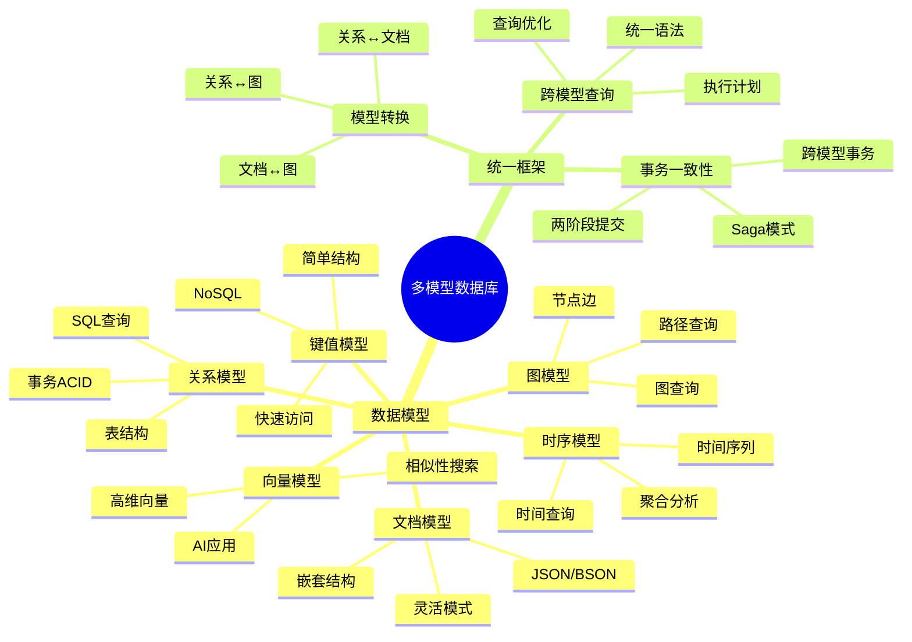
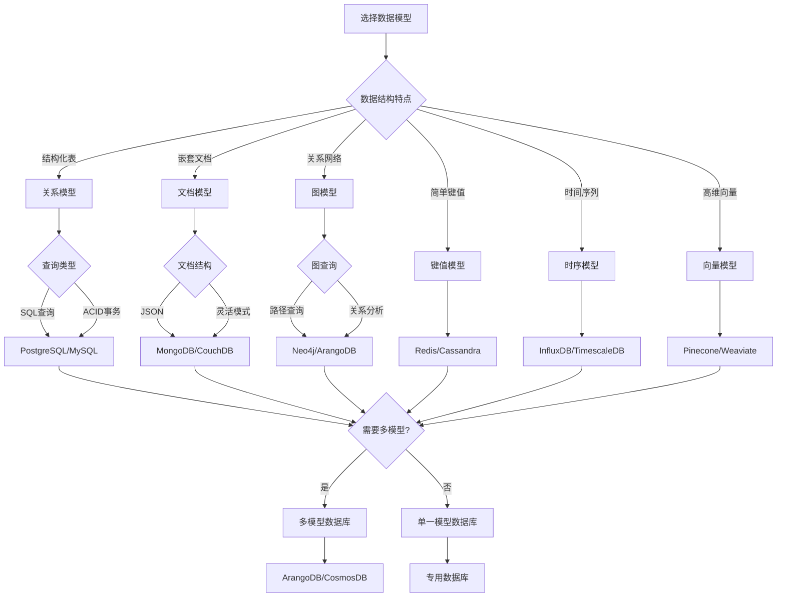
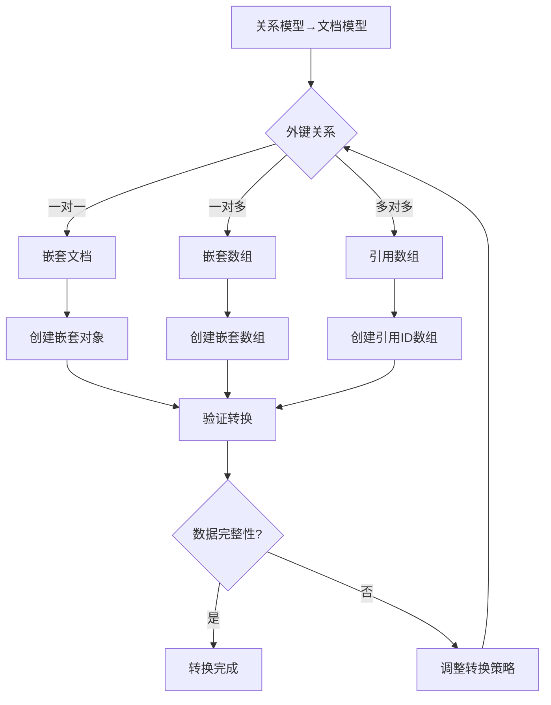

# 多模型数据库理论：统一数据模型框架

> **创建日期**：2025-01-15
> **最后更新**：2025-01-15
> **版本**：v1.0
> **状态**：规划中

---

## 📋 目录

- [多模型数据库理论：统一数据模型框架](#多模型数据库理论统一数据模型框架)
  - [📋 目录](#-目录)
  - [1. 概述](#1-概述)
    - [1.1. 多模型数据库的必要性](#11-多模型数据库的必要性)
    - [1.2. 统一框架的价值](#12-统一框架的价值)
    - [1.3. 多模型数据库思维导图](#13-多模型数据库思维导图)
    - [1.4. 数据模型选择决策树](#14-数据模型选择决策树)
    - [1.5. 数据模型对比矩阵](#15-数据模型对比矩阵)
  - [2. 多模型数据库基础](#2-多模型数据库基础)
    - [2.1. 数据模型分类](#21-数据模型分类)
    - [2.2. 多模型数据库系统](#22-多模型数据库系统)
  - [3. 统一数据模型框架](#3-统一数据模型框架)
    - [3.1. 抽象数据模型](#31-抽象数据模型)
    - [3.2. 模型映射](#32-模型映射)
    - [3.3. 统一查询语言](#33-统一查询语言)
  - [4. 模型间转换](#4-模型间转换)
    - [4.1. 关系模型 ↔ 文档模型](#41-关系模型--文档模型)
      - [4.1.1. 关系模型到文档模型转换决策树](#411-关系模型到文档模型转换决策树)
      - [4.1.2. 转换算法详细论证](#412-转换算法详细论证)
      - [4.1.3. 模型转换正确性矩阵](#413-模型转换正确性矩阵)
    - [4.2. 关系模型 ↔ 图模型](#42-关系模型--图模型)
    - [4.3. 文档模型 ↔ 图模型](#43-文档模型--图模型)
  - [5. 跨模型查询](#5-跨模型查询)
    - [5.1. 统一查询语法](#51-统一查询语法)
    - [5.2. 查询优化](#52-查询优化)
    - [5.3. 查询计划](#53-查询计划)
  - [6. 多模型事务一致性](#6-多模型事务一致性)
    - [6.1. 跨模型事务](#61-跨模型事务)
    - [6.2. 两阶段提交（2PC）](#62-两阶段提交2pc)
    - [6.3. Saga模式](#63-saga模式)
  - [7. 形式化框架](#7-形式化框架)
    - [7.1. 模型类型系统](#71-模型类型系统)
    - [7.2. 模型转换函子](#72-模型转换函子)
    - [7.3. 统一查询语义](#73-统一查询语义)
  - [8. 参考资料](#8-参考资料)
    - [8.1. 学术文献](#81-学术文献)
    - [8.2. 相关资源](#82-相关资源)

---

## 1. 概述

### 1.1. 多模型数据库的必要性

现代应用需要处理多种数据模型：

1. **关系模型**：结构化数据，SQL查询
2. **文档模型**：半结构化数据，JSON/XML
3. **图模型**：关系网络，图查询
4. **键值模型**：简单键值对，快速访问
5. **时序模型**：时间序列数据，时间查询
6. **向量模型**：高维向量，相似性搜索

### 1.2. 统一框架的价值

统一数据模型框架提供：

- **统一接口**：单一API访问多种模型
- **模型转换**：自动模型间转换
- **跨模型查询**：统一查询语言
- **一致性保证**：跨模型事务一致性

### 1.3. 多模型数据库思维导图



### 1.4. 数据模型选择决策树



### 1.5. 数据模型对比矩阵

| 数据模型 | 数据结构 | 查询语言 | 事务支持 | 适用场景 | 性能特点 |
|---------|---------|---------|---------|---------|---------|
| **关系模型** | 表、行、列 | SQL | ACID | 结构化数据 | ⭐⭐⭐⭐ |
| **文档模型** | JSON/BSON | MongoDB Query | 有限 | 半结构化数据 | ⭐⭐⭐⭐⭐ |
| **图模型** | 节点、边 | Cypher/Gremlin | 有限 | 关系网络 | ⭐⭐⭐ |
| **键值模型** | 键值对 | 简单API | 有限 | 缓存、会话 | ⭐⭐⭐⭐⭐ |
| **时序模型** | 时间序列 | 时间查询 | 有限 | 监控、IoT | ⭐⭐⭐⭐ |
| **向量模型** | 高维向量 | 向量查询 | 有限 | AI、搜索 | ⭐⭐⭐ |

---

## 2. 多模型数据库基础

### 2.1. 数据模型分类

**结构化模型**：

- **关系模型**：表、行、列
- **键值模型**：键值对
- **列族模型**：列族、行键

**半结构化模型**：

- **文档模型**：JSON、XML、BSON
- **树模型**：层次结构

**非结构化模型**：

- **图模型**：节点、边、属性
- **向量模型**：高维向量空间
- **时序模型**：时间序列

### 2.2. 多模型数据库系统

**统一后端系统（UDBMS）**：

```text
UDBMS = {
    关系模型: RelationalModel,
    文档模型: DocumentModel,
    图模型: GraphModel,
    键值模型: KeyValueModel,
    时序模型: TimeSeriesModel,
    向量模型: VectorModel
}
```

**示例系统**：

- **PostgreSQL**：支持关系、JSON、数组、向量
- **MongoDB**：支持文档、图、时序
- **ArangoDB**：统一多模型数据库
- **Couchbase**：文档和键值模型

---

## 3. 统一数据模型框架

### 3.1. 抽象数据模型

**统一数据模型定义**：

```haskell
-- 统一数据模型
data UnifiedDataModel = UnifiedModel {
    models :: [DataModel],
    mappings :: [ModelMapping],
    queries :: [UnifiedQuery]
}

-- 数据模型
data DataModel =
    RelationalModel Schema
  | DocumentModel DocumentSchema
  | GraphModel GraphSchema
  | KeyValueModel KeyValueSchema
  | TimeSeriesModel TimeSeriesSchema
  | VectorModel VectorSchema
```

### 3.2. 模型映射

**模型映射定义**：

```haskell
-- 模型映射
class ModelTransformer a b where
    transform :: a -> b
    preserve :: Property -> Bool
    inverse :: b -> Maybe a

-- 关系模型 → 文档模型
instance ModelTransformer RelationalModel DocumentModel where
    transform (RelationalModel schema) =
        DocumentModel (schemaToDocumentSchema schema)
    preserve DataIntegrity = True
    preserve QuerySemantics = True
```

### 3.3. 统一查询语言

**统一查询接口**：

```haskell
-- 统一查询
data UnifiedQuery = UnifiedQuery {
    model :: DataModel,
    query :: QueryExpression,
    result :: ResultType
}

-- 查询表达式
data QueryExpression =
    SelectQuery SelectClause FromClause WhereClause
  | GraphQuery GraphPattern
  | DocumentQuery DocumentFilter
  | VectorQuery SimilaritySearch
```

---

## 4. 模型间转换

### 4.1. 关系模型 ↔ 文档模型

**关系 → 文档**：

```text
表 → 文档集合
行 → 文档
列 → 文档字段
外键 → 嵌套文档或引用
```

**详细论证**：

#### 4.1.1. 关系模型到文档模型转换决策树



#### 4.1.2. 转换算法详细论证

**转换算法**：

```text
算法：关系模型到文档模型转换
输入：关系表 R，外键关系 F
输出：文档集合 D

步骤：
1. 对于每个表 T：
    创建文档集合 D_T = {}

2. 对于每个行 r ∈ T：
    创建文档 d = {}

    对于每个列 c ∈ T：
        d[c] = r[c]

    对于每个外键 fk: T → T'：
        如果是一对一关系：
            d[fk.name] = 查找关联文档(r[fk])
        如果是一对多关系：
            d[fk.name] = 查找关联文档数组(r[fk])

    D_T = D_T ∪ {d}

3. 返回 D = ∪_{T} D_T
```

**转换正确性证明**：

```text
需要证明：转换后的文档模型保持关系模型的数据和语义

证明步骤：
  1. 数据完整性：
     - 每个关系行对应一个文档
     - 每个列值对应文档字段值
     - 外键关系转换为嵌套或引用

  2. 语义等价性：
     - 关系查询可以转换为文档查询
     - 查询结果语义等价

  3. 约束保持：
     - 主键约束 → 文档ID唯一性
     - 外键约束 → 引用完整性
```

**示例**：

```sql
-- 关系模型
CREATE TABLE users (
    id INTEGER PRIMARY KEY,
    name TEXT,
    email TEXT
);

CREATE TABLE orders (
    id INTEGER PRIMARY KEY,
    user_id INTEGER REFERENCES users(id),
    total DECIMAL
);
```

```json
// 文档模型
{
  "users": [
    {
      "id": 1,
      "name": "Alice",
      "email": "alice@example.com",
      "orders": [
        {"id": 1, "total": 100.0},
        {"id": 2, "total": 200.0}
      ]
    }
  ]
}
```

**文档 → 关系**：

```text
文档集合 → 表
文档 → 行
字段 → 列
嵌套文档 → 关联表
```

#### 4.1.3. 模型转换正确性矩阵

| 转换方向 | 转换方法 | 数据完整性 | 语义等价性 | 性能影响 | 复杂度 |
|---------|---------|-----------|-----------|---------|--------|
| **关系→文档** | 嵌套/引用 | ⭐⭐⭐⭐ | ⭐⭐⭐⭐ | ⭐⭐⭐ | ⭐⭐⭐ |
| **文档→关系** | 扁平化/关联表 | ⭐⭐⭐ | ⭐⭐⭐ | ⭐⭐⭐⭐ | ⭐⭐⭐⭐ |
| **关系→图** | 表→节点，外键→边 | ⭐⭐⭐⭐⭐ | ⭐⭐⭐⭐ | ⭐⭐⭐ | ⭐⭐ |
| **图→关系** | 节点→表，边→关联表 | ⭐⭐⭐⭐ | ⭐⭐⭐ | ⭐⭐⭐ | ⭐⭐⭐ |
| **文档→图** | 文档→节点，引用→边 | ⭐⭐⭐⭐ | ⭐⭐⭐ | ⭐⭐⭐ | ⭐⭐⭐ |

### 4.2. 关系模型 ↔ 图模型

**关系 → 图**：

```text
表 → 节点类型或边类型
行 → 节点或边
列 → 节点或边属性
外键 → 边
```

**示例**：

```sql
-- 关系模型
CREATE TABLE users (
    id INTEGER PRIMARY KEY,
    name TEXT
);

CREATE TABLE follows (
    follower_id INTEGER REFERENCES users(id),
    followee_id INTEGER REFERENCES users(id)
);
```

```cypher
// 图模型
CREATE (u1:User {id: 1, name: "Alice"})
CREATE (u2:User {id: 2, name: "Bob"})
CREATE (u1)-[:FOLLOWS]->(u2)
```

**图 → 关系**：

```text
节点类型 → 表
节点 → 行
节点属性 → 列
边类型 → 关联表
边 → 关联行
```

### 4.3. 文档模型 ↔ 图模型

**文档 → 图**：

```text
文档集合 → 节点类型
文档 → 节点
字段 → 节点属性
引用 → 边
```

**图 → 文档**：

```text
节点类型 → 文档集合
节点 → 文档
节点属性 → 文档字段
边 → 文档引用或嵌套
```

---

## 5. 跨模型查询

### 5.1. 统一查询语法

**SQL扩展**：

```sql
-- 跨模型查询
SELECT u.name, COUNT(o.id) as order_count
FROM users u
JOIN orders o ON u.id = o.user_id
WHERE u.profile->>'city' = 'Beijing'  -- JSON字段
  AND EXISTS (
    SELECT 1 FROM graph_paths gp
    WHERE gp.start_node = u.id
      AND gp.end_node = 100
      AND gp.distance <= 3
  )
GROUP BY u.id, u.name;
```

### 5.2. 查询优化

**跨模型查询优化**：

1. **模型选择**：选择最优数据模型执行查询
2. **转换优化**：优化模型间转换成本
3. **并行执行**：并行执行不同模型的查询
4. **结果合并**：高效合并跨模型查询结果

### 5.3. 查询计划

**跨模型查询计划**：

```text
查询计划：
  1. 解析查询，识别涉及的模型
  2. 选择执行模型
  3. 生成模型特定查询
  4. 执行查询
  5. 转换结果
  6. 合并结果
```

---

## 6. 多模型事务一致性

### 6.1. 跨模型事务

**跨模型事务定义**：

```text
跨模型事务 = {
    操作1: Model1.Operation,
    操作2: Model2.Operation,
    ...
    操作N: ModelN.Operation
}
```

**一致性要求**：

- **原子性**：所有操作要么全部成功，要么全部失败
- **一致性**：跨模型数据一致性
- **隔离性**：并发事务隔离
- **持久性**：事务结果持久化

### 6.2. 两阶段提交（2PC）

**跨模型2PC**：

```text
阶段1：准备阶段
  - 协调者发送prepare到所有参与者
  - 每个参与者（不同模型）准备事务
  - 参与者返回vote（yes/no）

阶段2：提交阶段
  - 如果所有参与者都vote yes：
    - 协调者发送commit
    - 所有参与者提交事务
  - 否则：
    - 协调者发送abort
    - 所有参与者回滚事务
```

### 6.3. Saga模式

**跨模型Saga**：

```text
Saga = {
    步骤1: Model1.Operation + Model1.Compensation,
    步骤2: Model2.Operation + Model2.Compensation,
    ...
    步骤N: ModelN.Operation + ModelN.Compensation
}
```

**执行**：

- 顺序执行所有步骤
- 如果某步骤失败，执行已执行步骤的补偿操作
- 保证最终一致性

---

## 7. 形式化框架

### 7.1. 模型类型系统

**类型定义**：

```haskell
-- 模型类型
class DataModelType m where
    type Schema m :: *
    type Instance m :: *
    type Query m :: *

    -- 模型操作
    insert :: Instance m -> m -> m
    query :: Query m -> Instance m -> Result
    update :: Query m -> Update -> Instance m -> Instance m
    delete :: Query m -> Instance m -> Instance m
```

### 7.2. 模型转换函子

**转换函子**：

```haskell
-- 模型转换函子
data ModelTransformerF a b = ModelTransformerF {
    transformSchema :: Schema a -> Schema b,
    transformInstance :: Instance a -> Instance b,
    transformQuery :: Query b -> Query a
}

-- 函子性质
instance Functor (ModelTransformerF a) where
    fmap f (ModelTransformerF ts ti tq) =
        ModelTransformerF ts (f . ti) tq
```

### 7.3. 统一查询语义

**查询语义**：

```haskell
-- 统一查询语义
class UnifiedQuerySemantics q where
    type Model q :: DataModelType
    type Result q :: *

    semantics :: q -> Instance (Model q) -> Result q

    -- 查询等价
    equivalent :: q -> q -> Bool
    equivalent q1 q2 =
        forall i. semantics q1 i == semantics q2 i
```

---

## 8. 参考资料

### 8.1. 学术文献

- "Unified Database Management Systems: A Survey" (2016)
- "Multi-Model Databases: A New Journey to Handle the Variety of Data" (2019)
- "A Formal Framework for Multi-Model Databases" (2020)

### 8.2. 相关资源

- [Wikipedia: Multi-Model Database](https://en.wikipedia.org/wiki/Multi-model_database)
- [ArangoDB Multi-Model Database](https://www.arangodb.com/)
- [PostgreSQL JSON支持](../PostgreSQL/03-高级特性/03.06-图数据库功能.md)

---

**最后更新**：2025-01-15
**维护者**：Data-Science Team
**状态**：规划中
