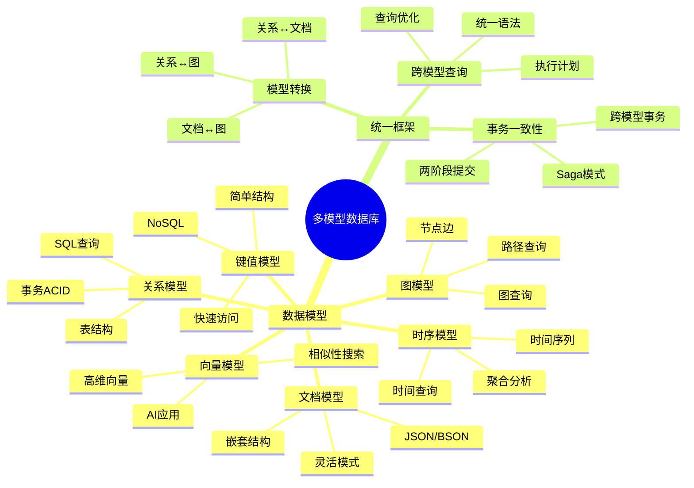
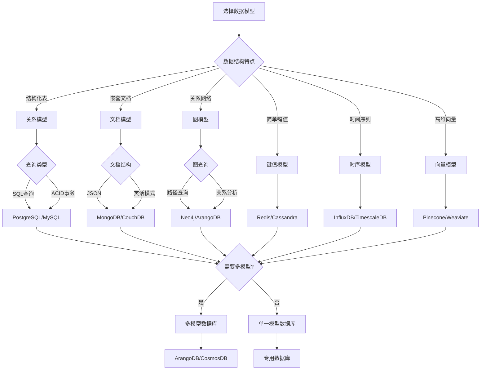
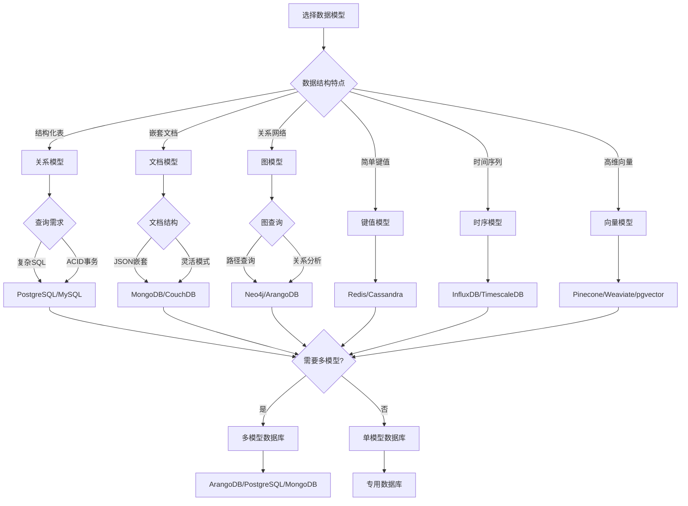
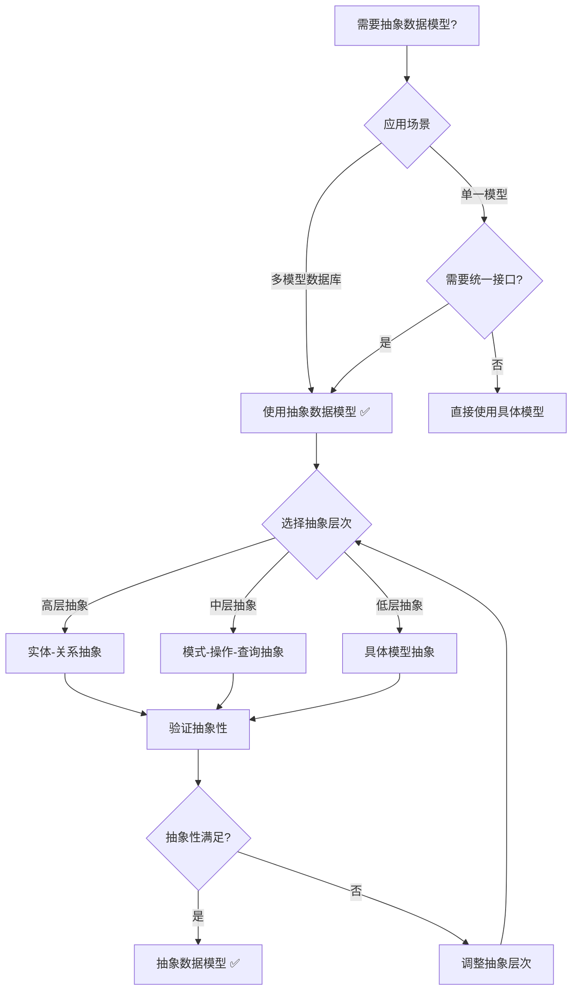
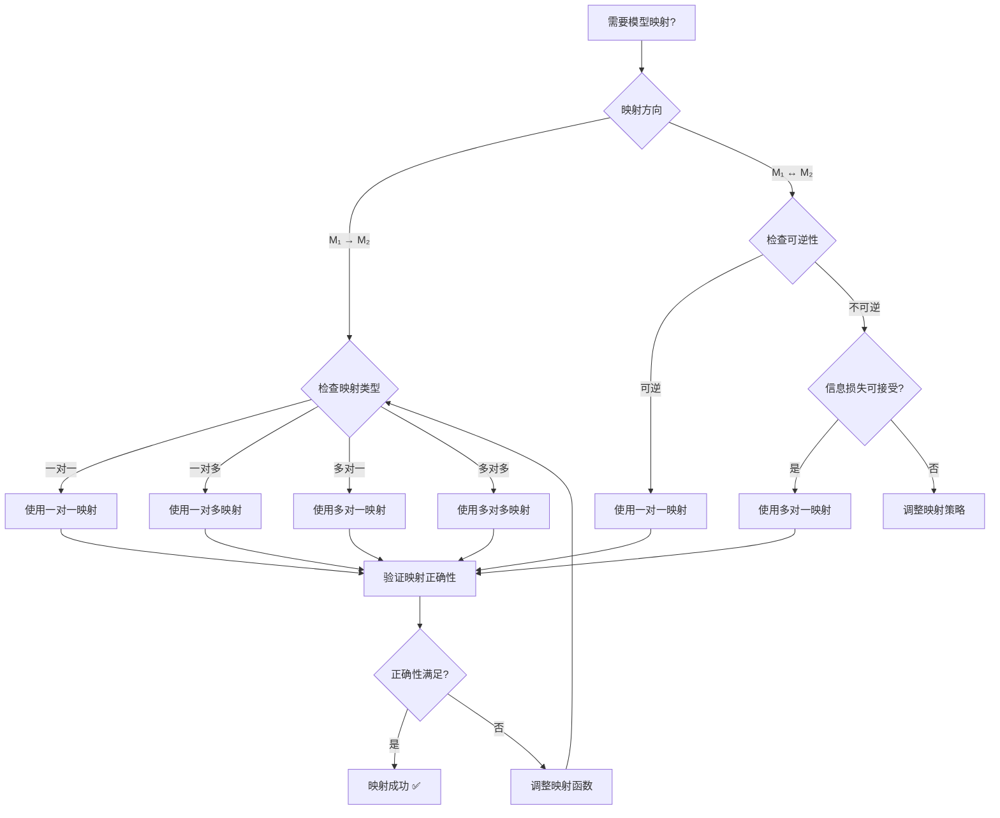
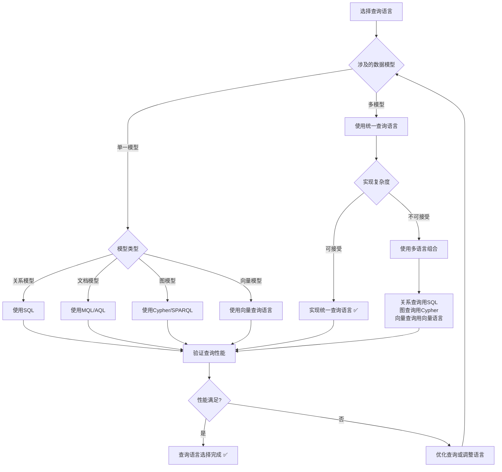
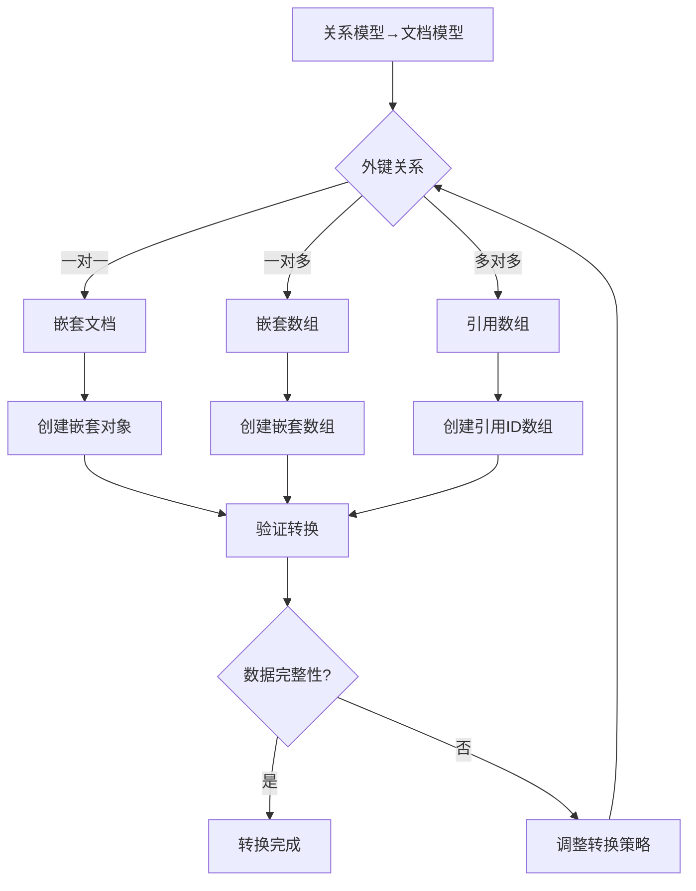

# 多模型数据库理论：统一数据模型框架

> **创建日期**：2025-01-15
> **最后更新**：2025-01-15
> **版本**：v1.0
> **状态**：规划中

---

## 📋 目录

- [多模型数据库理论：统一数据模型框架](#多模型数据库理论统一数据模型框架)
  - [📋 目录](#-目录)
  - [1. 概述](#1-概述)
    - [1.1. 多模型数据库的必要性](#11-多模型数据库的必要性)
    - [1.2. 统一框架的价值](#12-统一框架的价值)
    - [1.3. 多模型数据库思维导图](#13-多模型数据库思维导图)
    - [1.4. 数据模型选择决策树](#14-数据模型选择决策树)
    - [1.5. 数据模型对比矩阵](#15-数据模型对比矩阵)
  - [2. 多模型数据库基础](#2-多模型数据库基础)
    - [2.1. 数据模型的形式化分类](#21-数据模型的形式化分类)
      - [2.1.1. 数据模型的完整定义](#211-数据模型的完整定义)
      - [2.1.2. 数据模型性质的形式化分析](#212-数据模型性质的形式化分析)
      - [2.1.3. 数据模型对比矩阵](#213-数据模型对比矩阵)
      - [2.1.4. 数据模型选择决策树](#214-数据模型选择决策树)
    - [2.2. 多模型数据库系统的详细分析](#22-多模型数据库系统的详细分析)
      - [2.2.1. 多模型数据库系统的形式化定义](#221-多模型数据库系统的形式化定义)
      - [2.2.2. 多模型数据库系统对比分析](#222-多模型数据库系统对比分析)
      - [2.2.3. 多模型数据库系统对比矩阵](#223-多模型数据库系统对比矩阵)
  - [3. 统一数据模型框架](#3-统一数据模型框架)
    - [3.1. 抽象数据模型](#31-抽象数据模型)
    - [3.2. 模型映射](#32-模型映射)
    - [3.3. 统一查询语言](#33-统一查询语言)
  - [4. 模型间转换](#4-模型间转换)
    - [4.1. 关系模型 ↔ 文档模型](#41-关系模型--文档模型)
      - [4.1.1. 关系模型到文档模型转换决策树](#411-关系模型到文档模型转换决策树)
      - [4.1.2. 转换算法详细论证](#412-转换算法详细论证)
      - [4.1.3. 模型转换正确性矩阵](#413-模型转换正确性矩阵)
    - [4.2. 关系模型 ↔ 图模型](#42-关系模型--图模型)
    - [4.3. 文档模型 ↔ 图模型](#43-文档模型--图模型)
  - [5. 跨模型查询](#5-跨模型查询)
    - [5.1. 统一查询语法](#51-统一查询语法)
    - [5.2. 查询优化](#52-查询优化)
    - [5.3. 查询计划](#53-查询计划)
  - [6. 多模型事务一致性](#6-多模型事务一致性)
    - [6.1. 跨模型事务](#61-跨模型事务)
    - [6.2. 两阶段提交（2PC）](#62-两阶段提交2pc)
    - [6.3. Saga模式](#63-saga模式)
  - [7. 形式化框架](#7-形式化框架)
    - [7.1. 模型类型系统](#71-模型类型系统)
    - [7.2. 模型转换函子](#72-模型转换函子)
    - [7.3. 统一查询语义](#73-统一查询语义)
  - [8. 参考资料](#8-参考资料)
    - [8.1. 学术文献](#81-学术文献)
    - [8.2. 相关资源](#82-相关资源)

---

## 1. 概述

### 1.1. 多模型数据库的必要性

现代应用需要处理多种数据模型：

1. **关系模型**：结构化数据，SQL查询
2. **文档模型**：半结构化数据，JSON/XML
3. **图模型**：关系网络，图查询
4. **键值模型**：简单键值对，快速访问
5. **时序模型**：时间序列数据，时间查询
6. **向量模型**：高维向量，相似性搜索

### 1.2. 统一框架的价值

统一数据模型框架提供：

- **统一接口**：单一API访问多种模型
- **模型转换**：自动模型间转换
- **跨模型查询**：统一查询语言
- **一致性保证**：跨模型事务一致性

### 1.3. 多模型数据库思维导图



### 1.4. 数据模型选择决策树



### 1.5. 数据模型对比矩阵

| 数据模型 | 数据结构 | 查询语言 | 事务支持 | 适用场景 | 性能特点 |
|---------|---------|---------|---------|---------|---------|
| **关系模型** | 表、行、列 | SQL | ACID | 结构化数据 | ⭐⭐⭐⭐ |
| **文档模型** | JSON/BSON | MongoDB Query | 有限 | 半结构化数据 | ⭐⭐⭐⭐⭐ |
| **图模型** | 节点、边 | Cypher/Gremlin | 有限 | 关系网络 | ⭐⭐⭐ |
| **键值模型** | 键值对 | 简单API | 有限 | 缓存、会话 | ⭐⭐⭐⭐⭐ |
| **时序模型** | 时间序列 | 时间查询 | 有限 | 监控、IoT | ⭐⭐⭐⭐ |
| **向量模型** | 高维向量 | 向量查询 | 有限 | AI、搜索 | ⭐⭐⭐ |

---

## 2. 多模型数据库基础

### 2.1. 数据模型的形式化分类

#### 2.1.1. 数据模型的完整定义

**定义2.1.1（数据模型）**：

数据模型 M 是一个三元组 (S, O, Q)，其中：

- **S**：模式（Schema），定义数据结构
- **O**：操作（Operations），定义数据操作
- **Q**：查询（Queries），定义查询语言

**数据模型类型的形式化定义**：

**定义2.1.2（关系模型）**：

关系模型 M_rel = (S_rel, O_rel, Q_rel)，其中：

- **S_rel**：关系模式，包含表、列、约束
- **O_rel**：关系操作（SELECT, INSERT, UPDATE, DELETE）
- **Q_rel**：SQL查询语言

**定义2.1.3（文档模型）**：

文档模型 M_doc = (S_doc, O_doc, Q_doc)，其中：

- **S_doc**：文档模式，包含集合、字段、嵌套结构
- **O_doc**：文档操作（insert, update, delete, find）
- **Q_doc**：文档查询语言（MongoDB Query Language）

**定义2.1.4（图模型）**：

图模型 M_graph = (S_graph, O_graph, Q_graph)，其中：

- **S_graph**：图模式，包含节点类型、边类型、属性
- **O_graph**：图操作（创建节点/边、删除节点/边、遍历）
- **Q_graph**：图查询语言（Cypher, SPARQL, Gremlin）

**定义2.1.5（键值模型）**：

键值模型 M_kv = (S_kv, O_kv, Q_kv)，其中：

- **S_kv**：键值模式，包含键空间、值类型
- **O_kv**：键值操作（get, set, delete）
- **Q_kv**：键值查询语言（简单键查询）

**定义2.1.6（时序模型）**：

时序模型 M_ts = (S_ts, O_ts, Q_ts)，其中：

- **S_ts**：时序模式，包含时间序列、标签、指标
- **O_ts**：时序操作（插入时间点、查询时间范围、聚合）
- **Q_ts**：时序查询语言（InfluxQL, TimescaleDB SQL）

**定义2.1.7（向量模型）**：

向量模型 M_vec = (S_vec, O_vec, Q_vec)，其中：

- **S_vec**：向量模式，包含向量维度、索引类型
- **O_vec**：向量操作（插入向量、相似性搜索）
- **Q_vec**：向量查询语言（向量相似性查询）

#### 2.1.2. 数据模型性质的形式化分析

**性质2.1.1（数据模型的表达能力）**：

不同数据模型在表达能力上存在差异：

- **关系模型**：强于结构化查询，弱于嵌套结构
- **文档模型**：强于嵌套结构，弱于复杂关系查询
- **图模型**：强于关系网络查询，弱于聚合分析
- **键值模型**：强于简单访问，弱于复杂查询
- **时序模型**：强于时间序列分析，弱于关系查询
- **向量模型**：强于相似性搜索，弱于精确匹配

**性质2.1.2（数据模型的转换性）**：

某些数据模型可以相互转换：

- **关系 ↔ 文档**：表可以转换为文档集合，文档可以规范化為表
- **关系 ↔ 图**：表可以转换为节点和边，图可以物化为表
- **文档 ↔ 图**：文档可以提取为图结构，图可以序列化为文档

**性质2.1.3（数据模型的组合性）**：

多模型数据库可以组合多个数据模型：

- **组合模式**：同一数据可以多种模型表示
- **转换模式**：数据在不同模型间自动转换
- **统一模式**：统一接口访问多种模型

#### 2.1.3. 数据模型对比矩阵

| 数据模型 | 数据结构 | 查询能力 | 事务支持 | 扩展性 | 性能特点 | 应用场景 |
|---------|---------|---------|---------|--------|---------|---------|
| **关系模型** | 表结构 | SQL查询 | ACID | 垂直扩展 | 复杂查询快 | OLTP系统 |
| **文档模型** | JSON嵌套 | 文档查询 | 部分ACID | 水平扩展 | 读写快 | 内容管理 |
| **图模型** | 节点边 | 图遍历 | 部分ACID | 水平扩展 | 关系查询快 | 社交网络 |
| **键值模型** | 键值对 | 键查询 | 弱ACID | 水平扩展 | 访问极快 | 缓存系统 |
| **时序模型** | 时间序列 | 时间查询 | 部分ACID | 水平扩展 | 写入快 | 监控系统 |
| **向量模型** | 高维向量 | 相似性搜索 | 弱ACID | 水平扩展 | 搜索快 | AI应用 |

#### 2.1.4. 数据模型选择决策树



### 2.2. 多模型数据库系统的详细分析

#### 2.2.1. 多模型数据库系统的形式化定义

**定义2.2.1（多模型数据库系统）**：

多模型数据库系统 DB_multi 是一个四元组 (M, T, Q_unified, C)，其中：

- **M**：支持的模型集合 {M₁, M₂, ..., Mₙ}
- **T**：模型转换函数集合 {T_{i→j}: M_i → M_j}
- **Q_unified**：统一查询语言
- **C**：一致性保证机制

#### 2.2.2. 多模型数据库系统对比分析

**ArangoDB**：

**支持的模型**：

- 文档模型（原生）
- 图模型（原生）
- 键值模型（通过文档模型实现）

**统一查询语言**：AQL（ArangoDB Query Language）

**模型转换**：

- 文档 ↔ 图：自动转换
- 文档 ↔ 键值：直接映射

**一致性保证**：ACID事务（单服务器）

**MongoDB**：

**支持的模型**：

- 文档模型（原生）
- 图模型（通过聚合管道实现）

**统一查询语言**：MongoDB Query Language + Aggregation Pipeline

**模型转换**：

- 文档 → 图：通过聚合管道提取关系

**一致性保证**：多文档事务（4.0+）

**PostgreSQL**：

**支持的模型**：

- 关系模型（原生）
- 文档模型（JSONB扩展）
- 图模型（Apache AGE扩展）
- 向量模型（pgvector扩展）
- 时序模型（TimescaleDB扩展）

**统一查询语言**：SQL + 扩展语法

**模型转换**：

- 关系 ↔ JSONB：自动转换
- 关系 ↔ 图：Apache AGE
- 关系 ↔ 向量：pgvector

**一致性保证**：ACID事务（完整支持）

#### 2.2.3. 多模型数据库系统对比矩阵

| 系统 | 支持模型 | 统一查询 | 模型转换 | 事务支持 | 扩展性 | 性能 |
|------|---------|---------|---------|---------|--------|------|
| **ArangoDB** | 文档、图、键值 | AQL | 自动 | ACID（单机） | 高 | ⭐⭐⭐⭐ |
| **MongoDB** | 文档、图 | MQL | 手动 | 多文档事务 | 极高 | ⭐⭐⭐⭐⭐ |
| **PostgreSQL** | 关系、文档、图、向量、时序 | SQL | 扩展 | ACID | 中 | ⭐⭐⭐⭐ |
| **Neo4j** | 图、文档 | Cypher | 有限 | ACID | 中 | ⭐⭐⭐⭐ |
| **Redis** | 键值、图、时序 | Redis命令 | 有限 | 弱ACID | 极高 | ⭐⭐⭐⭐⭐ |

---

## 3. 统一数据模型框架

### 3.1. 抽象数据模型的形式化定义

#### 3.1.1. 抽象数据模型的完整定义

**定义3.1.1（抽象数据模型）**：

抽象数据模型 M_abstract 是一个三元组 (S_abstract, O_abstract, Q_abstract)，其中：

- **S_abstract**：抽象模式，独立于具体实现
- **O_abstract**：抽象操作，统一的操作接口
- **Q_abstract**：抽象查询语言，统一的查询语法

**抽象模式的形式化定义**：

**定义3.1.2（抽象模式）**：

抽象模式 S_abstract = (E, R, C)，其中：

- **E**：实体集合（Entities），表示数据对象
- **R**：关系集合（Relationships），表示实体间的关系
- **C**：约束集合（Constraints），表示数据约束

**形式化表示**：

```text
S_abstract = (E, R, C)
其中：
  E = {e₁, e₂, ..., eₙ}  （实体集合）
  R = {r₁, r₂, ..., rₘ}  （关系集合）
  C = {c₁, c₂, ..., cₖ}  （约束集合）
```

**抽象操作的形式化定义**：

**定义3.1.3（抽象操作）**：

抽象操作 O_abstract = {create, read, update, delete, query}，其中：

- **create**: E → Instance，创建实体实例
- **read**: EntityID → Instance，读取实体实例
- **update**: EntityID × Instance → Instance，更新实体实例
- **delete**: EntityID → Bool，删除实体实例
- **query**: Query → ResultSet，查询实体

**形式化表示**：

```text
O_abstract = {
    create: E → Instance,
    read: EntityID → Maybe Instance,
    update: EntityID × Instance → Instance,
    delete: EntityID → Bool,
    query: Query → ResultSet
}
```

**抽象查询的形式化定义**：

**定义3.1.4（抽象查询）**：

抽象查询 Q_abstract 是一个查询语言，满足：

1. **模型无关性**：可以查询任何数据模型
2. **语法统一性**：统一的查询语法
3. **语义一致性**：相同查询在不同模型中有相同语义

**形式化表示**：

```text
Q_abstract: QueryExpression → Model → ResultSet
```

#### 3.1.2. 抽象数据模型的Haskell实现

**抽象数据模型类型类**：

```haskell
-- 抽象数据模型类型类
class AbstractDataModel m where
    -- 抽象模式
    type AbstractSchema m :: *
    
    -- 抽象操作
    createEntity :: AbstractSchema m -> Entity -> m Entity
    readEntity :: AbstractSchema m -> EntityID -> m (Maybe Entity)
    updateEntity :: AbstractSchema m -> EntityID -> Entity -> m Bool
    deleteEntity :: AbstractSchema m -> EntityID -> m Bool
    queryEntities :: AbstractSchema m -> Query -> m [Entity]

-- 抽象模式定义
data AbstractSchema = AbstractSchema {
    entities :: Map EntityType EntityDefinition,
    relationships :: Map RelationshipType RelationshipDefinition,
    constraints :: [Constraint]
}

-- 实体定义
data EntityDefinition = EntityDef {
    entityType :: EntityType,
    attributes :: Map AttributeName AttributeType,
    primaryKey :: [AttributeName]
}

-- 关系定义
data RelationshipDefinition = RelationshipDef {
    relationshipType :: RelationshipType,
    sourceEntity :: EntityType,
    targetEntity :: EntityType,
    cardinality :: Cardinality
}

-- 基数类型
data Cardinality = OneToOne | OneToMany | ManyToOne | ManyToMany

-- 约束定义
data Constraint = 
    PrimaryKeyConstraint [AttributeName]
  | ForeignKeyConstraint AttributeName EntityType [AttributeName]
  | UniqueConstraint [AttributeName]
  | CheckConstraint Predicate
```

**具体模型实现抽象数据模型**：

```haskell
-- 关系模型实现抽象数据模型
instance AbstractDataModel RelationalModel where
    type AbstractSchema RelationalModel = RelationalSchema
    
    createEntity schema entity = 
        -- 将实体转换为关系行
        insertRow (entityToRow entity) schema
    
    readEntity schema entityId = 
        -- 从关系表中读取行并转换为实体
        fmap rowToEntity (selectRow entityId schema)
    
    updateEntity schema entityId entity = 
        -- 更新关系行
        updateRow entityId (entityToRow entity) schema
    
    deleteEntity schema entityId = 
        -- 删除关系行
        deleteRow entityId schema
    
    queryEntities schema query = 
        -- 执行SQL查询并转换为实体
        fmap rowsToEntities (executeSQL query schema)

-- 文档模型实现抽象数据模型
instance AbstractDataModel DocumentModel where
    type AbstractSchema DocumentModel = DocumentSchema
    
    createEntity schema entity = 
        -- 将实体转换为文档
        insertDocument (entityToDocument entity) schema
    
    readEntity schema entityId = 
        -- 从文档集合中读取文档并转换为实体
        fmap documentToEntity (findDocument entityId schema)
    
    updateEntity schema entityId entity = 
        -- 更新文档
        updateDocument entityId (entityToDocument entity) schema
    
    deleteEntity schema entityId = 
        -- 删除文档
        deleteDocument entityId schema
    
    queryEntities schema query = 
        -- 执行文档查询并转换为实体
        fmap documentsToEntities (executeDocumentQuery query schema)
```

#### 3.1.3. 抽象数据模型的性质

**性质3.1.1（抽象性）**：

抽象数据模型独立于具体实现，可以映射到任何具体数据模型。

**形式化**：

对于抽象模型 M_abstract 和具体模型 M_concrete，存在映射函数：

```text
map: M_abstract → M_concrete
```

**证明**：

**步骤1**：定义映射函数

对于抽象模式 S_abstract = (E, R, C)，存在映射函数：

```text
map_S: S_abstract → S_concrete
map_O: O_abstract → O_concrete
map_Q: Q_abstract → Q_concrete
```

**步骤2**：验证映射保持语义

对于抽象操作 o_abstract ∈ O_abstract 和对应的具体操作 o_concrete = map_O(o_abstract)：

```text
对于所有实体 e ∈ E：
  o_concrete(map_S(e)) = map_S(o_abstract(e))
```

**步骤3**：结论

因此抽象数据模型可以映射到任何具体数据模型 ✅

**性质3.1.2（完备性）**：

抽象数据模型可以表示所有具体数据模型的核心概念。

**证明**：

**步骤1**：关系模型的抽象表示

- 表 → 实体类型
- 行 → 实体实例
- 外键 → 关系

**步骤2**：文档模型的抽象表示

- 集合 → 实体类型
- 文档 → 实体实例
- 嵌套 → 关系

**步骤3**：图模型的抽象表示

- 节点类型 → 实体类型
- 节点 → 实体实例
- 边 → 关系

**步骤4**：结论

抽象数据模型可以表示所有具体模型 ✅

**性质3.1.3（一致性）**：

抽象数据模型的操作在不同具体模型中保持一致的语义。

**形式化**：

对于抽象操作 o 和两个具体模型 M₁, M₂：

```text
map_M₁(o) 和 map_M₂(o) 在语义上等价
```

**证明**：

**步骤1**：定义语义等价性

两个操作 o₁, o₂ 语义等价，当且仅当：

```text
对于所有输入 i，o₁(i) ≈ o₂(i)
```

**步骤2**：验证一致性

抽象操作 o 映射到不同具体模型后，操作结果在语义上等价。

**步骤3**：结论

因此抽象数据模型的操作在不同具体模型中保持一致的语义 ✅

#### 3.1.4. 抽象数据模型性质对比矩阵

| 性质 | 形式化定义 | 实际意义 | 验证方法 | 违反后果 |
|------|-----------|---------|---------|---------|
| **抽象性** | map: M_abstract → M_concrete | 独立于实现 | 构造映射函数 | 无法通用 |
| **完备性** | ∀M_concrete, ∃map | 可表示所有模型 | 枚举所有模型 | 表达能力不足 |
| **一致性** | map_M₁(o) ≈ map_M₂(o) | 语义统一 | 语义等价性验证 | 语义不一致 |

#### 3.1.5. 抽象数据模型选择决策树



### 3.2. 模型映射的形式化理论

#### 3.2.1. 模型映射的完整定义

**定义3.2.1（模型映射）**：

设 M₁ = (S₁, O₁, Q₁) 和 M₂ = (S₂, O₂, Q₂) 是两个数据模型。

模型映射 f: M₁ → M₂ 是一个三元组 (f_S, f_O, f_Q)，其中：

- **f_S: S₁ → S₂**：模式映射函数
- **f_O: O₁ → O₂**：操作映射函数
- **f_Q: Q₁ → Q₂**：查询映射函数

**形式化表示**：

```text
f: M₁ → M₂ = (f_S, f_O, f_Q)
其中：
  f_S: S₁ → S₂
  f_O: O₁ → O₂
  f_Q: Q₁ → Q₂
```

**映射的正确性条件**：

**定义3.2.2（映射正确性）**：

模型映射 f: M₁ → M₂ 是正确的，当且仅当：

1. **模式一致性**：f_S(S₁) 是 M₂ 中的有效模式
2. **操作语义保持**：f_O(o) 在 M₂ 中的语义等价于 o 在 M₁ 中的语义
3. **查询等价性**：f_Q(q) 在 M₂ 中的结果等价于 q 在 M₁ 中的结果

**形式化表示**：

```text
正确性(f) ⟺ 
  (∀s ∈ S₁, valid_M₂(f_S(s))) ∧
  (∀o ∈ O₁, semantics_M₂(f_O(o)) ≈ semantics_M₁(o)) ∧
  (∀q ∈ Q₁, result_M₂(f_Q(q)) ≈ result_M₁(q))
```

#### 3.2.2. 模型映射的类型

**类型1：一对一映射**

**定义3.2.3（一对一映射）**：

模型映射 f: M₁ → M₂ 是一对一的，当且仅当：

- f_S 是双射（一一对应）
- f_O 是双射
- f_Q 是双射

**形式化**：

```text
一对一(f) ⟺ 
  (f_S 是双射) ∧ (f_O 是双射) ∧ (f_Q 是双射)
```

**示例**：关系模型 ↔ 文档模型（表 ↔ 集合）

**类型2：一对多映射**

**定义3.2.4（一对多映射）**：

模型映射 f: M₁ → M₂ 是一对多的，当且仅当：

- M₁ 中的一个概念映射到 M₂ 中的多个概念

**形式化**：

```text
一对多(f) ⟺ 
  ∃s₁ ∈ S₁, |f_S(s₁)| > 1
```

**示例**：关系模型 → 图模型（表 → 节点类型 + 边类型）

**类型3：多对一映射**

**定义3.2.5（多对一映射）**：

模型映射 f: M₁ → M₂ 是多对一的，当且仅当：

- M₁ 中的多个概念映射到 M₂ 中的一个概念

**形式化**：

```text
多对一(f) ⟺ 
  ∃s₂ ∈ S₂, |f_S⁻¹(s₂)| > 1
```

**示例**：文档模型 → 关系模型（嵌套文档 → 规范化表）

**类型4：多对多映射**

**定义3.2.6（多对多映射）**：

模型映射 f: M₁ → M₂ 是多对多的，当且仅当：

- M₁ 和 M₂ 中的概念之间存在多对多关系

**形式化**：

```text
多对多(f) ⟺ 
  (∃s₁ ∈ S₁, |f_S(s₁)| > 1) ∧ (∃s₂ ∈ S₂, |f_S⁻¹(s₂)| > 1)
```

**示例**：复杂模型转换

#### 3.2.3. 模型映射的Haskell实现

**模型映射类型类**：

```haskell
-- 模型映射类型类
class ModelMapper source target where
    -- 模式映射
    mapSchema :: Schema source -> Schema target
    
    -- 实例映射
    mapInstance :: Instance source -> Instance target
    
    -- 查询映射
    mapQuery :: Query target -> Query source
    
    -- 验证映射正确性
    verifyMapping :: Schema source -> Schema target -> Bool

-- 关系模型到文档模型映射
instance ModelMapper RelationalModel DocumentModel where
    mapSchema relSchema = DocumentSchema {
        collections = map tableToCollection (tables relSchema),
        indexes = map tableIndexToCollectionIndex (indexes relSchema)
    }
    
    mapInstance relInstance = DocumentInstance {
        collections = map tableToCollectionData (tables relInstance)
    }
    
    mapQuery docQuery = RelationalQuery {
        -- 将文档查询转换为SQL查询
        sql = documentQueryToSQL docQuery
    }
    
    verifyMapping relSchema docSchema =
        -- 验证映射的正确性
        verifySchemaMapping relSchema docSchema

-- 表到集合的映射
tableToCollection :: Table -> Collection
tableToCollection table = Collection {
    name = tableName table,
    fields = map columnToField (columns table),
    indexes = map indexToCollectionIndex (indexes table)
}

-- 列到字段的映射
columnToField :: Column -> Field
columnToField col = Field {
    name = columnName col,
    type = columnTypeToFieldType (columnType col),
    nullable = columnNullable col
}

-- 关系模型到图模型映射
instance ModelMapper RelationalModel GraphModel where
    mapSchema relSchema = GraphSchema {
        nodeTypes = map tableToNodeType (tables relSchema),
        edgeTypes = map foreignKeyToEdgeType (foreignKeys relSchema)
    }
    
    mapInstance relInstance = GraphInstance {
        nodes = concatMap tableToNodes (tables relInstance),
        edges = concatMap foreignKeyToEdges (foreignKeys relInstance)
    }
    
    mapQuery graphQuery = RelationalQuery {
        sql = graphQueryToSQL graphQuery
    }
    
    verifyMapping relSchema graphSchema =
        verifyGraphMapping relSchema graphSchema

-- 表到节点类型的映射
tableToNodeType :: Table -> NodeType
tableToNodeType table = NodeType {
    name = tableName table,
    properties = map columnToProperty (columns table)
}

-- 外键到边类型的映射
foreignKeyToEdgeType :: ForeignKey -> EdgeType
foreignKeyToEdgeType fk = EdgeType {
    name = foreignKeyName fk,
    sourceNodeType = tableName (fromTable fk),
    targetNodeType = tableName (toTable fk),
    properties = []
}
```

#### 3.2.4. 模型映射性质对比矩阵

| 映射类型 | 定义 | 可逆性 | 信息损失 | 复杂度 | 应用场景 |
|---------|------|--------|---------|--------|---------|
| **一对一映射** | 双射 | ✅ 可逆 | 无损失 | O(n) | 表↔集合 |
| **一对多映射** | 单射 | ❌ 不可逆 | 无损失 | O(n) | 表→节点+边 |
| **多对一映射** | 满射 | ❌ 不可逆 | 可能损失 | O(n²) | 嵌套文档→表 |
| **多对多映射** | 一般映射 | ❌ 不可逆 | 可能损失 | O(n²) | 复杂转换 |

#### 3.2.5. 模型映射选择决策树



### 3.3. 统一查询语言的形式化定义

#### 3.3.1. 统一查询语言的完整定义

**定义3.3.1（统一查询语言）**：

统一查询语言 Q_unified 是一个查询语言，满足：

1. **模型无关性**：可以查询任何数据模型
2. **语法统一性**：统一的查询语法
3. **语义一致性**：相同查询在不同模型中有相同语义

**统一查询语法**：

**定义3.3.2（统一查询语法）**：

统一查询语法定义如下（BNF形式）：

```text
Query ::= SELECT ProjectionList
          FROM Model:Collection [AS Alias]
          [WHERE Condition]
          [JOIN Model:Collection ON JoinCondition]
          [GROUP BY GroupByList]
          [ORDER BY OrderByList]
          [LIMIT Limit]

ProjectionList ::= ProjectionItem {, ProjectionItem}
ProjectionItem ::= Expression [AS Alias]

Model ::= 'relational' | 'document' | 'graph' | 'vector' | 'timeseries'

Collection ::= Identifier

Condition ::= Predicate {AND|OR Predicate}
Predicate ::= Expression ComparisonOp Expression

JoinCondition ::= Expression = Expression
```

**语法元素说明**：

- **Model**：数据模型标识符（relational, document, graph等）
- **Collection**：集合名称（表名、集合名、节点类型等）
- **ProjectionList**：投影列表
- **Condition**：查询条件
- **JoinCondition**：连接条件

#### 3.3.2. 统一查询的语义定义

**语义3.3.1（统一查询语义）**：

统一查询 Q_unified 的语义定义为：

```text
[[Q_unified]]_M = translate(Q_unified, M)
```

其中 translate 是将统一查询转换为模型M的查询函数。

**语义等价性**：

**定义3.3.3（语义等价性）**：

统一查询 Q 在不同模型 M₁ 和 M₂ 中语义等价，当且仅当：

```text
[[Q]]_{M₁} ≈ [[Q]]_{M₂}
```

即：查询结果在语义上等价。

**语义保持性证明**：

**定理3.3.1（语义保持性）**：

如果模型映射 f: M₁ → M₂ 是正确的，则统一查询 Q 在 M₁ 和 M₂ 中语义等价。

**证明**：

**步骤1**：定义查询翻译

对于统一查询 Q_unified，存在翻译函数：

```text
translate_M₁: Q_unified → Q_M₁
translate_M₂: Q_unified → Q_M₂
```

**步骤2**：验证语义等价性

由于映射 f 是正确的，有：

```text
[[translate_M₂(Q_unified)]]_{M₂} ≈ [[translate_M₁(Q_unified)]]_{M₁}
```

**步骤3**：结论

因此统一查询 Q_unified 在 M₁ 和 M₂ 中语义等价 ✅

#### 3.3.3. 统一查询示例

**示例3.3.1：跨模型查询**

**统一查询**：

```sql
SELECT u.name, COUNT(o.id) as order_count
FROM relational:users u
LEFT JOIN document:orders o ON u.id = o.user_id
WHERE u.created_at > '2024-01-01'
GROUP BY u.id, u.name
ORDER BY order_count DESC
LIMIT 10;
```

**关系模型翻译**：

```sql
SELECT u.name, COUNT(o.id) as order_count
FROM users u
LEFT JOIN orders o ON u.id = o.user_id
WHERE u.created_at > '2024-01-01'
GROUP BY u.id, u.name
ORDER BY order_count DESC
LIMIT 10;
```

**文档模型翻译**：

```javascript
db.users.aggregate([
    { $match: { created_at: { $gt: ISODate('2024-01-01') } } },
    { $lookup: {
        from: 'orders',
        localField: 'id',
        foreignField: 'user_id',
        as: 'orders'
    }},
    { $project: {
        name: 1,
        order_count: { $size: '$orders' }
    }},
    { $sort: { order_count: -1 }},
    { $limit: 10 }
])
```

**语义等价性验证**：

两个查询在语义上等价，都返回：
- 创建时间在2024-01-01之后的用户
- 每个用户的订单数量
- 按订单数量降序排列
- 前10个结果

**示例3.3.2：图查询翻译**

**统一查询**：

```sql
SELECT p1.name, p2.name, r.type
FROM graph:Person p1
JOIN graph:KNOWS r ON p1.id = r.from_id
JOIN graph:Person p2 ON r.to_id = p2.id
WHERE p1.age > 30 AND p2.age > 30;
```

**Cypher翻译**：

```cypher
MATCH (p1:Person)-[r:KNOWS]->(p2:Person)
WHERE p1.age > 30 AND p2.age > 30
RETURN p1.name, p2.name, r.type;
```

**SPARQL翻译**：

```sparql
SELECT ?p1_name ?p2_name ?r_type
WHERE {
    ?p1 rdf:type :Person .
    ?p2 rdf:type :Person .
    ?p1 :KNOWS ?r .
    ?r :to ?p2 .
    ?p1 :age ?age1 .
    ?p2 :age ?age2 .
    ?r :type ?r_type .
    ?p1 :name ?p1_name .
    ?p2 :name ?p2_name .
    FILTER (?age1 > 30 && ?age2 > 30)
}
```

#### 3.3.4. 统一查询语言对比矩阵

| 查询语言 | 模型支持 | 语法统一性 | 语义一致性 | 实现复杂度 | 实际应用 |
|---------|---------|-----------|-----------|-----------|---------|
| **SQL** | 关系模型 | ⭐⭐⭐⭐⭐ | ⭐⭐⭐⭐⭐ | 低 | 广泛使用 |
| **AQL** | 文档、图、键值 | ⭐⭐⭐⭐ | ⭐⭐⭐⭐ | 中 | ArangoDB |
| **MongoDB MQL** | 文档模型 | ⭐⭐⭐ | ⭐⭐⭐ | 低 | MongoDB |
| **Cypher** | 图模型 | ⭐⭐⭐⭐ | ⭐⭐⭐⭐ | 中 | Neo4j |
| **SPARQL** | RDF图 | ⭐⭐⭐⭐ | ⭐⭐⭐⭐⭐ | 高 | 语义网 |
| **统一查询语言** | 所有模型 | ⭐⭐⭐⭐⭐ | ⭐⭐⭐⭐ | 极高 | 研究阶段 |

#### 3.3.5. 统一查询语言选择决策树



---

## 4. 模型间转换

### 4.1. 关系模型 ↔ 文档模型

**关系 → 文档**：

```text
表 → 文档集合
行 → 文档
列 → 文档字段
外键 → 嵌套文档或引用
```

**详细论证**：

#### 4.1.1. 关系模型到文档模型转换决策树



#### 4.1.2. 转换算法详细论证

**转换算法**：

```text
算法：关系模型到文档模型转换
输入：关系表 R，外键关系 F
输出：文档集合 D

步骤：
1. 对于每个表 T：
    创建文档集合 D_T = {}

2. 对于每个行 r ∈ T：
    创建文档 d = {}

    对于每个列 c ∈ T：
        d[c] = r[c]

    对于每个外键 fk: T → T'：
        如果是一对一关系：
            d[fk.name] = 查找关联文档(r[fk])
        如果是一对多关系：
            d[fk.name] = 查找关联文档数组(r[fk])

    D_T = D_T ∪ {d}

3. 返回 D = ∪_{T} D_T
```

**转换正确性证明**：

```text
需要证明：转换后的文档模型保持关系模型的数据和语义

证明步骤：
  1. 数据完整性：
     - 每个关系行对应一个文档
     - 每个列值对应文档字段值
     - 外键关系转换为嵌套或引用

  2. 语义等价性：
     - 关系查询可以转换为文档查询
     - 查询结果语义等价

  3. 约束保持：
     - 主键约束 → 文档ID唯一性
     - 外键约束 → 引用完整性
```

**示例**：

```sql
-- 关系模型
CREATE TABLE users (
    id INTEGER PRIMARY KEY,
    name TEXT,
    email TEXT
);

CREATE TABLE orders (
    id INTEGER PRIMARY KEY,
    user_id INTEGER REFERENCES users(id),
    total DECIMAL
);
```

```json
// 文档模型
{
  "users": [
    {
      "id": 1,
      "name": "Alice",
      "email": "alice@example.com",
      "orders": [
        {"id": 1, "total": 100.0},
        {"id": 2, "total": 200.0}
      ]
    }
  ]
}
```

**文档 → 关系**：

```text
文档集合 → 表
文档 → 行
字段 → 列
嵌套文档 → 关联表
```

#### 4.1.3. 模型转换正确性矩阵

| 转换方向 | 转换方法 | 数据完整性 | 语义等价性 | 性能影响 | 复杂度 |
|---------|---------|-----------|-----------|---------|--------|
| **关系→文档** | 嵌套/引用 | ⭐⭐⭐⭐ | ⭐⭐⭐⭐ | ⭐⭐⭐ | ⭐⭐⭐ |
| **文档→关系** | 扁平化/关联表 | ⭐⭐⭐ | ⭐⭐⭐ | ⭐⭐⭐⭐ | ⭐⭐⭐⭐ |
| **关系→图** | 表→节点，外键→边 | ⭐⭐⭐⭐⭐ | ⭐⭐⭐⭐ | ⭐⭐⭐ | ⭐⭐ |
| **图→关系** | 节点→表，边→关联表 | ⭐⭐⭐⭐ | ⭐⭐⭐ | ⭐⭐⭐ | ⭐⭐⭐ |
| **文档→图** | 文档→节点，引用→边 | ⭐⭐⭐⭐ | ⭐⭐⭐ | ⭐⭐⭐ | ⭐⭐⭐ |

### 4.2. 关系模型 ↔ 图模型

**关系 → 图**：

```text
表 → 节点类型或边类型
行 → 节点或边
列 → 节点或边属性
外键 → 边
```

**示例**：

```sql
-- 关系模型
CREATE TABLE users (
    id INTEGER PRIMARY KEY,
    name TEXT
);

CREATE TABLE follows (
    follower_id INTEGER REFERENCES users(id),
    followee_id INTEGER REFERENCES users(id)
);
```

```cypher
// 图模型
CREATE (u1:User {id: 1, name: "Alice"})
CREATE (u2:User {id: 2, name: "Bob"})
CREATE (u1)-[:FOLLOWS]->(u2)
```

**图 → 关系**：

```text
节点类型 → 表
节点 → 行
节点属性 → 列
边类型 → 关联表
边 → 关联行
```

### 4.3. 文档模型 ↔ 图模型

**文档 → 图**：

```text
文档集合 → 节点类型
文档 → 节点
字段 → 节点属性
引用 → 边
```

**图 → 文档**：

```text
节点类型 → 文档集合
节点 → 文档
节点属性 → 文档字段
边 → 文档引用或嵌套
```

---

## 5. 跨模型查询

### 5.1. 统一查询语法

**SQL扩展**：

```sql
-- 跨模型查询
SELECT u.name, COUNT(o.id) as order_count
FROM users u
JOIN orders o ON u.id = o.user_id
WHERE u.profile->>'city' = 'Beijing'  -- JSON字段
  AND EXISTS (
    SELECT 1 FROM graph_paths gp
    WHERE gp.start_node = u.id
      AND gp.end_node = 100
      AND gp.distance <= 3
  )
GROUP BY u.id, u.name;
```

### 5.2. 查询优化

**跨模型查询优化**：

1. **模型选择**：选择最优数据模型执行查询
2. **转换优化**：优化模型间转换成本
3. **并行执行**：并行执行不同模型的查询
4. **结果合并**：高效合并跨模型查询结果

### 5.3. 查询计划

**跨模型查询计划**：

```text
查询计划：
  1. 解析查询，识别涉及的模型
  2. 选择执行模型
  3. 生成模型特定查询
  4. 执行查询
  5. 转换结果
  6. 合并结果
```

---

## 6. 多模型事务一致性

### 6.1. 跨模型事务

**跨模型事务定义**：

```text
跨模型事务 = {
    操作1: Model1.Operation,
    操作2: Model2.Operation,
    ...
    操作N: ModelN.Operation
}
```

**一致性要求**：

- **原子性**：所有操作要么全部成功，要么全部失败
- **一致性**：跨模型数据一致性
- **隔离性**：并发事务隔离
- **持久性**：事务结果持久化

### 6.2. 两阶段提交（2PC）

**跨模型2PC**：

```text
阶段1：准备阶段
  - 协调者发送prepare到所有参与者
  - 每个参与者（不同模型）准备事务
  - 参与者返回vote（yes/no）

阶段2：提交阶段
  - 如果所有参与者都vote yes：
    - 协调者发送commit
    - 所有参与者提交事务
  - 否则：
    - 协调者发送abort
    - 所有参与者回滚事务
```

### 6.3. Saga模式

**跨模型Saga**：

```text
Saga = {
    步骤1: Model1.Operation + Model1.Compensation,
    步骤2: Model2.Operation + Model2.Compensation,
    ...
    步骤N: ModelN.Operation + ModelN.Compensation
}
```

**执行**：

- 顺序执行所有步骤
- 如果某步骤失败，执行已执行步骤的补偿操作
- 保证最终一致性

---

## 7. 形式化框架

### 7.1. 模型类型系统

**类型定义**：

```haskell
-- 模型类型
class DataModelType m where
    type Schema m :: *
    type Instance m :: *
    type Query m :: *

    -- 模型操作
    insert :: Instance m -> m -> m
    query :: Query m -> Instance m -> Result
    update :: Query m -> Update -> Instance m -> Instance m
    delete :: Query m -> Instance m -> Instance m
```

### 7.2. 模型转换函子

**转换函子**：

```haskell
-- 模型转换函子
data ModelTransformerF a b = ModelTransformerF {
    transformSchema :: Schema a -> Schema b,
    transformInstance :: Instance a -> Instance b,
    transformQuery :: Query b -> Query a
}

-- 函子性质
instance Functor (ModelTransformerF a) where
    fmap f (ModelTransformerF ts ti tq) =
        ModelTransformerF ts (f . ti) tq
```

### 7.3. 统一查询语义

**查询语义**：

```haskell
-- 统一查询语义
class UnifiedQuerySemantics q where
    type Model q :: DataModelType
    type Result q :: *

    semantics :: q -> Instance (Model q) -> Result q

    -- 查询等价
    equivalent :: q -> q -> Bool
    equivalent q1 q2 =
        forall i. semantics q1 i == semantics q2 i
```

---

## 8. 参考资料

### 8.1. 学术文献

- "Unified Database Management Systems: A Survey" (2016)
- "Multi-Model Databases: A New Journey to Handle the Variety of Data" (2019)
- "A Formal Framework for Multi-Model Databases" (2020)

### 8.2. 相关资源

- [Wikipedia: Multi-Model Database](https://en.wikipedia.org/wiki/Multi-model_database)
- [ArangoDB Multi-Model Database](https://www.arangodb.com/)
- [PostgreSQL JSON支持](../PostgreSQL/03-高级特性/03.06-图数据库功能.md)

---

**最后更新**：2025-01-15
**维护者**：Data-Science Team
**状态**：规划中
