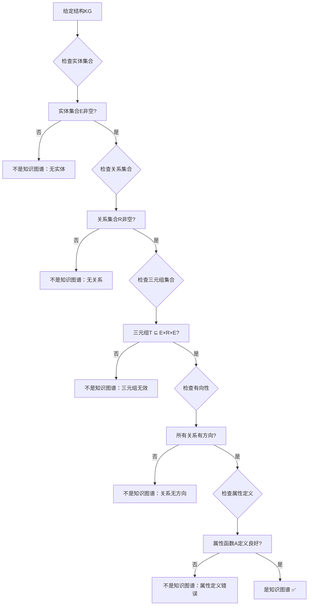
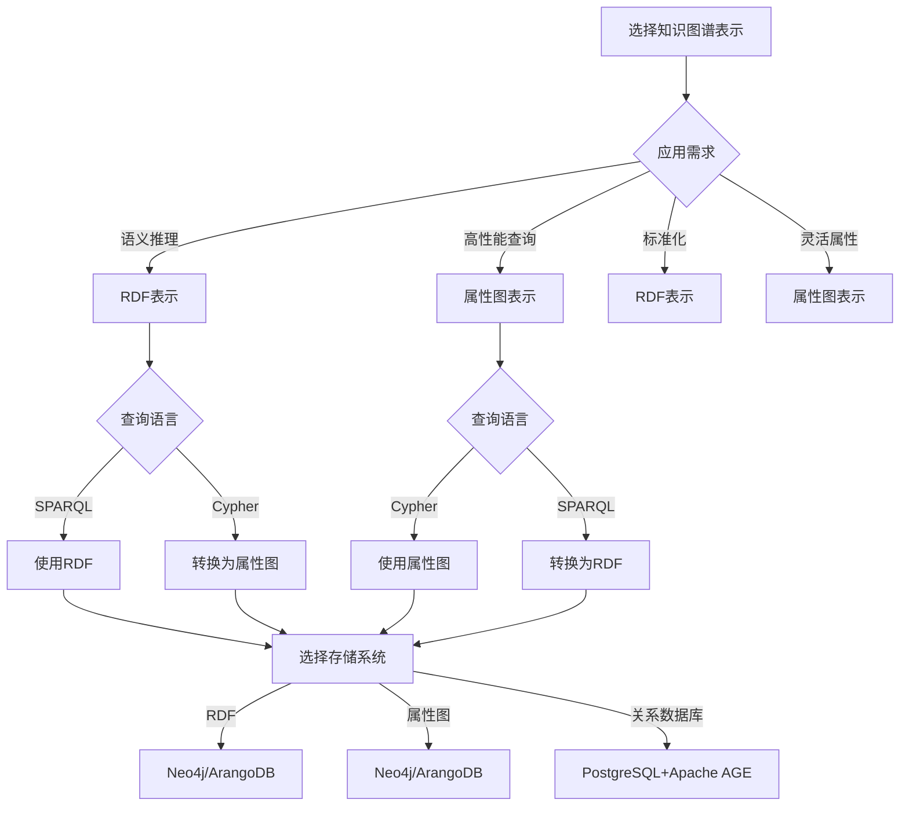
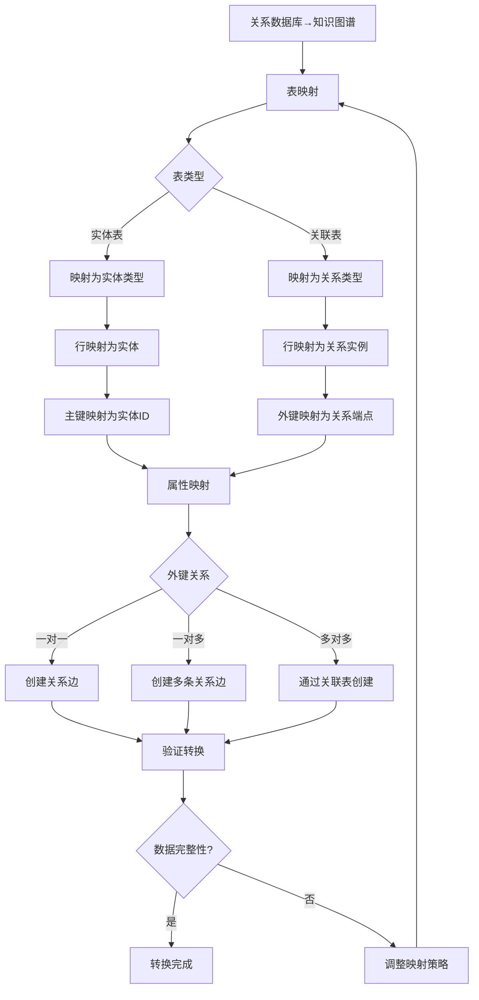
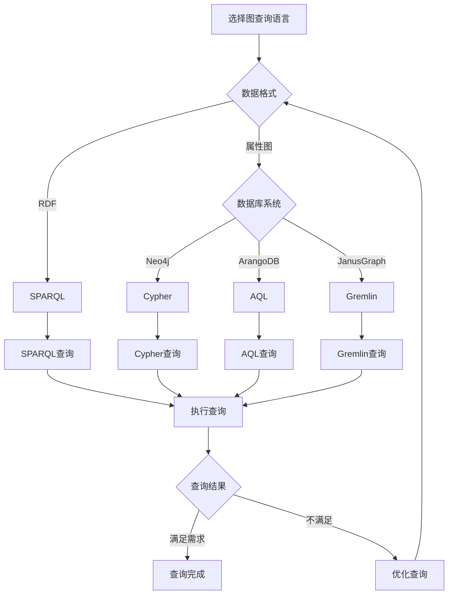
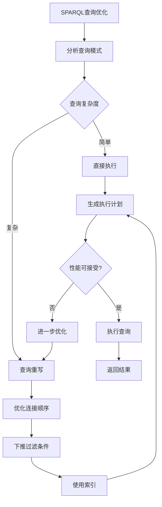

# 知识图谱理论：关系知识图与图查询

> **创建日期**：2025-01-15
> **最后更新**：2025-01-15
> **版本**：v1.0
> **状态**：规划中

---

## 📋 目录

- [知识图谱理论：关系知识图与图查询](#知识图谱理论关系知识图与图查询)
  - [📋 目录](#-目录)
  - [1. 概述](#1-概述)
    - [1.1. 知识图谱的重要性](#11-知识图谱的重要性)
    - [1.2. 关系知识图的价值](#12-关系知识图的价值)
  - [2. 知识图谱基础](#2-知识图谱基础)
    - [2.1. 知识图谱的形式化定义](#21-知识图谱的形式化定义)
      - [2.1.1. 知识图谱的完整定义](#211-知识图谱的完整定义)
      - [2.1.2. 知识图谱概念的详细解释](#212-知识图谱概念的详细解释)
      - [2.1.3. 知识图谱性质的形式化证明](#213-知识图谱性质的形式化证明)
      - [2.1.4. 知识图谱概念对比矩阵](#214-知识图谱概念对比矩阵)
      - [2.1.5. 知识图谱判定决策树](#215-知识图谱判定决策树)
    - [2.2. 知识图谱的详细性质分析](#22-知识图谱的详细性质分析)
      - [2.2.1. 知识图谱性质的完整论证](#221-知识图谱性质的完整论证)
      - [2.2.2. 知识图谱性质对比矩阵](#222-知识图谱性质对比矩阵)
    - [2.3. 知识图谱表示方法的详细理论](#23-知识图谱表示方法的详细理论)
      - [2.3.1. RDF表示的形式化定义](#231-rdf表示的形式化定义)
      - [2.3.2. 属性图表示的形式化定义](#232-属性图表示的形式化定义)
      - [2.3.3. RDF与属性图对比矩阵](#233-rdf与属性图对比矩阵)
      - [2.3.4. 知识图谱表示方法选择决策树](#234-知识图谱表示方法选择决策树)
  - [3. 关系知识图](#3-关系知识图)
    - [3.1. 关系知识图的定义](#31-关系知识图的定义)
    - [3.2. 关系数据库到知识图谱的映射](#32-关系数据库到知识图谱的映射)
      - [3.2.1. 关系数据库到知识图谱转换决策树](#321-关系数据库到知识图谱转换决策树)
      - [3.2.2. 转换算法详细论证](#322-转换算法详细论证)
      - [3.2.3. 映射策略对比矩阵](#323-映射策略对比矩阵)
    - [3.3. 知识图谱到关系数据库的映射](#33-知识图谱到关系数据库的映射)
  - [4. 图查询语言](#4-图查询语言)
    - [4.1. SPARQL查询](#41-sparql查询)
      - [4.1.1. 图查询语言选择决策树](#411-图查询语言选择决策树)
      - [4.1.2. SPARQL查询优化决策树](#412-sparql查询优化决策树)
      - [4.1.3. 图查询语言对比矩阵](#413-图查询语言对比矩阵)
    - [4.2. Cypher查询](#42-cypher查询)
    - [4.3. Gremlin查询](#43-gremlin查询)
    - [4.4. SQL扩展查询](#44-sql扩展查询)
  - [5. 知识推理](#5-知识推理)
    - [5.1. 规则推理](#51-规则推理)
    - [5.2. 模式匹配推理](#52-模式匹配推理)
    - [5.3. 本体推理](#53-本体推理)
  - [6. 图数据库系统](#6-图数据库系统)
    - [6.1. 图数据库分类](#61-图数据库分类)
    - [6.2. 图存储模型](#62-图存储模型)
    - [6.3. 图查询优化](#63-图查询优化)
  - [7. 形式化框架](#7-形式化框架)
    - [7.1. 知识图谱的形式化定义](#71-知识图谱的形式化定义)
    - [7.2. 图查询的形式化语义](#72-图查询的形式化语义)
    - [7.3. 知识推理的形式化](#73-知识推理的形式化)
  - [8. 参考资料](#8-参考资料)
    - [8.1. 经典文献](#81-经典文献)
    - [8.2. 相关资源](#82-相关资源)

---

## 1. 概述

### 1.1. 知识图谱的重要性

知识图谱是现代信息系统的核心组件，提供：

1. **语义理解**：理解实体间的关系
2. **知识推理**：基于规则和模式进行推理
3. **智能搜索**：基于语义的搜索和推荐
4. **数据集成**：统一不同数据源的知识

### 1.2. 关系知识图的价值

关系知识图结合了关系数据库和知识图谱的优势：

- **结构化存储**：利用关系数据库的成熟技术
- **语义查询**：支持图查询和知识推理
- **性能优化**：关系数据库的优化技术
- **一致性保证**：ACID事务支持

---

## 2. 知识图谱基础

### 2.1. 知识图谱的形式化定义

#### 2.1.1. 知识图谱的完整定义

**定义2.1.1（知识图谱）**：

知识图谱 KG 是一个四元组 (E, R, T, A)，其中：

- **E**：实体集合（Entities），E = {e₁, e₂, ..., eₙ}
- **R**：关系集合（Relations），R = {r₁, r₂, ..., rₘ}
- **T**：三元组集合（Triples），T ⊆ E × R × E
- **A**：属性集合（Attributes），A: (E ∪ R) → AttributeValues

**三元组的形式化定义**：

**定义2.1.2（三元组）**：

三元组 t = (e_s, r, e_o) ∈ T，其中：

- **e_s**：主体实体（Subject Entity）
- **r**：关系（Relation/Predicate）
- **e_o**：客体实体（Object Entity）

**语义**：实体 e_s 通过关系 r 关联到实体 e_o

**属性的形式化定义**：

**定义2.1.3（实体属性）**：

实体 e ∈ E 的属性函数 A_e: AttributeNames → AttributeValues

**定义2.1.4（关系属性）**：

关系 r ∈ R 的属性函数 A_r: AttributeNames → AttributeValues

#### 2.1.2. 知识图谱概念的详细解释

**实体（Entity）**：

- **定义**：知识图谱中的节点，表示现实世界中的对象
- **类型**：实体可以有类型（Person, Organization, Location等）
- **属性**：实体可以有多个属性（name, age, location等）
- **标识**：每个实体有唯一标识符（URI或ID）

**关系（Relation）**：

- **定义**：实体间的有向连接，表示实体间的关系
- **类型**：关系可以有类型（knows, worksAt, locatedIn等）
- **属性**：关系可以有属性（since, weight等）
- **方向性**：关系是有方向的（e₁ → e₂ 不同于 e₂ → e₁）

**三元组（Triple）**：

- **定义**：知识图谱的基本单元，表示一个事实
- **形式**：(subject, predicate, object)
- **语义**：subject通过predicate关联到object
- **存储**：三元组是知识图谱的主要存储形式

**属性（Attribute）**：

- **定义**：实体和关系的特征描述
- **类型**：属性可以是字符串、数字、日期等
- **多值性**：属性可以是单值或多值
- **可选性**：属性可以是必需的或可选的

#### 2.1.3. 知识图谱性质的形式化证明

**性质2.1.1（有向性）**：

知识图谱中的关系是有方向的。

**形式化**：

```
对于三元组 t = (e_s, r, e_o)，有：
t ≠ (e_o, r, e_s)  （一般情况）
```

**证明**：

**步骤1**：定义关系方向

关系 r: E → E 是有向的，表示从源实体到目标实体的方向。

**步骤2**：验证方向性

对于三元组 (Alice, knows, Bob)：

- 表示：Alice知道Bob
- 不等于：(Bob, knows, Alice)（Bob知道Alice是不同的关系）

**步骤3**：结论**

因此关系是有方向的 ✅

**性质2.1.2（多重性）**：

两个实体可以有多个不同的关系。

**形式化**：

```
对于实体 e₁, e₂ ∈ E，可以存在多个三元组：
(e₁, r₁, e₂), (e₁, r₂, e₂), ..., (e₁, rₙ, e₂)
其中 rᵢ ≠ rⱼ（i ≠ j）
```

**证明**：

**步骤1**：定义多重关系

两个实体可以有多种关系，例如：

- (Alice, knows, Bob)
- (Alice, worksWith, Bob)
- (Alice, friendOf, Bob)

**步骤2**：验证多重性

这些三元组表示不同的关系，可以同时存在。

**步骤3**：结论**

因此两个实体可以有多个关系 ✅

**性质2.1.3（自反性）**：

实体可以与自己有关系。

**形式化**：

```
对于实体 e ∈ E，可以存在三元组：
(e, r, e) ∈ T
```

**证明**：

**步骤1**：定义自反关系

实体可以与自己有关系，例如：

- (Person, isInstanceOf, Person)
- (Company, owns, Company)（公司可以拥有子公司）

**步骤2**：验证自反性

这些三元组在知识图谱中是有效的。

**步骤3**：结论**

因此实体可以与自己有关系 ✅

#### 2.1.4. 知识图谱概念对比矩阵

| 概念 | 形式化定义 | 图论对应 | 数据库对应 | 实际意义 |
|------|-----------|---------|-----------|---------|
| **实体** | e ∈ E | 节点（Node） | 表行（Row） | 现实对象 |
| **关系** | r ∈ R | 边（Edge） | 外键（ForeignKey） | 对象关系 |
| **三元组** | (e_s, r, e_o) | 有向边 | 关系实例 | 事实陈述 |
| **属性** | A(e) 或 A(r) | 节点/边标签 | 列值（Column Value） | 对象特征 |

#### 2.1.5. 知识图谱判定决策树



### 2.2. 知识图谱的详细性质分析

#### 2.2.1. 知识图谱性质的完整论证

**定理2.2.1（知识图谱的图结构）**：

知识图谱构成一个有向多重图。

**证明**：

**步骤1**：定义图结构

知识图谱 KG = (E, R, T) 可以表示为有向图 G = (V, E_graph)，其中：

- **V = E**：节点集合等于实体集合
- **E_graph = T**：边集合等于三元组集合

**步骤2**：验证图性质

- **有向性**：三元组 (e_s, r, e_o) 表示从 e_s 到 e_o 的有向边 ✅
- **多重性**：两个实体可以有多个不同的关系，对应多条边 ✅
- **自反性**：实体可以与自己有关系，对应自环 ✅

**步骤3**：结论**

因此知识图谱构成一个有向多重图 ✅

**定理2.2.2（知识图谱的语义性）**：

知识图谱具有明确的语义。

**证明**：

**步骤1**：定义语义

知识图谱的语义通过以下方式定义：

- **实体类型**：定义实体的语义类别
- **关系类型**：定义关系的语义含义
- **属性**：定义实体和关系的特征

**步骤2**：验证语义性

- **类型系统**：实体和关系都有明确的类型
- **本体定义**：可以使用本体（Ontology）定义语义
- **推理规则**：可以基于语义进行推理

**步骤3**：结论**

因此知识图谱具有明确的语义 ✅

#### 2.2.2. 知识图谱性质对比矩阵

| 性质 | 形式化定义 | 实际意义 | 验证方法 | 违反后果 |
|------|-----------|---------|---------|---------|
| **有向性** | (e_s, r, e_o) ≠ (e_o, r, e_s) | 关系有方向 | 检查三元组 | 语义错误 |
| **多重性** | 多个不同关系 | 多种关系并存 | 检查关系类型 | 信息丢失 |
| **自反性** | (e, r, e) ∈ T | 自引用关系 | 检查自环 | 无影响 |
| **属性性** | A(e) 或 A(r) 定义 | 特征描述 | 检查属性定义 | 信息不足 |

### 2.3. 知识图谱表示方法的详细理论

#### 2.3.1. RDF表示的形式化定义

**定义2.3.1（RDF三元组）**：

RDF三元组是一个三元组 (s, p, o)，其中：

- **s**：主体（Subject），URI或空白节点
- **p**：谓词（Predicate），URI
- **o**：客体（Object），URI、字面量或空白节点

**RDF图的形式化定义**：

**定义2.3.2（RDF图）**：

RDF图 G 是一个三元组集合：

```
G = {(s₁, p₁, o₁), (s₂, p₂, o₂), ..., (sₙ, pₙ, oₙ)}
```

**RDF语法示例的详细分析**：

**示例2.3.1：RDF表示详细分析**

**Turtle语法**：

```turtle
@prefix ex: <http://example.org/> .
@prefix rdf: <http://www.w3.org/1999/02/22-rdf-syntax-ns#> .
@prefix rdfs: <http://www.w3.org/2000/01/rdf-schema#> .

# 实体定义
ex:Alice rdf:type ex:Person .
ex:Bob rdf:type ex:Person .
ex:Company rdf:type ex:Organization .

# 属性定义
ex:Alice ex:name "Alice" .
ex:Alice ex:age 30 .
ex:Bob ex:name "Bob" .
ex:Bob ex:age 28 .

# 关系定义
ex:Alice ex:knows ex:Bob .
ex:Bob ex:worksAt ex:Company .
ex:Company ex:locatedIn ex:Beijing .
```

**语义分析**：

- **实体类型**：ex:Person, ex:Organization
- **实体属性**：ex:name, ex:age
- **实体关系**：ex:knows, ex:worksAt, ex:locatedIn
- **字面量**：字符串和数字

#### 2.3.2. 属性图表示的形式化定义

**定义2.3.3（属性图）**：

属性图 G_prop = (V, E, L_V, L_E, A_V, A_E)，其中：

- **V**：节点集合
- **E**：边集合
- **L_V: V → LabelSet**：节点标签函数
- **L_E: E → LabelSet**：边标签函数
- **A_V: V → AttributeMap**：节点属性函数
- **A_E: E → AttributeMap**：边属性函数

**属性图语法示例的详细分析**：

**示例2.3.2：Cypher属性图表示**

```cypher
// 创建节点
CREATE (alice:Person {name: "Alice", age: 30})
CREATE (bob:Person {name: "Bob", age: 28})
CREATE (company:Company {name: "Tech Corp"})

// 创建关系
CREATE (alice)-[:KNOWS {since: 2020}]->(bob)
CREATE (bob)-[:WORKS_AT {position: "Engineer"}]->(company)
```

**语义分析**：

- **节点类型**：Person, Company（标签）
- **节点属性**：name, age（属性映射）
- **关系类型**：KNOWS, WORKS_AT（边标签）
- **关系属性**：since, position（边属性）

#### 2.3.3. RDF与属性图对比矩阵

| 维度 | RDF | 属性图 | 优势对比 |
|------|-----|--------|---------|
| **理论基础** | 语义网标准 | 图数据库标准 | RDF更标准化 |
| **表达能力** | 强语义 | 强属性 | 属性图更灵活 |
| **查询语言** | SPARQL | Cypher/Gremlin | 各有优势 |
| **存储效率** | 较低 | 较高 | 属性图更高效 |
| **推理能力** | 强 | 弱 | RDF更适合推理 |
| **实际应用** | 语义网 | 图数据库 | 属性图更常用 |

#### 2.3.4. 知识图谱表示方法选择决策树



---

## 3. 关系知识图

### 3.1. 关系知识图的定义

**定义**：关系知识图是关系数据库与知识图谱的结合

```haskell
-- 关系知识图
data RelationalKG = RelationalKG {
    entities :: [Entity],
    relations :: [Relation],
    triples :: [Triple],
    relationalSchema :: RelationalSchema
}

-- 实体
data Entity = Entity {
    id :: EntityID,
    type :: EntityType,
    attributes :: [Attribute]
}

-- 关系
data Relation = Relation {
    id :: RelationID,
    type :: RelationType,
    attributes :: [Attribute]
}

-- 三元组
data Triple = Triple {
    subject :: EntityID,
    predicate :: RelationID,
    object :: EntityID
}
```

### 3.2. 关系数据库到知识图谱的映射

**映射规则**：

```text
表 → 实体类型
行 → 实体
列 → 实体属性
外键 → 关系
```

**详细论证**：

#### 3.2.1. 关系数据库到知识图谱转换决策树



#### 3.2.2. 转换算法详细论证

**转换算法**：

```text
算法：关系数据库到知识图谱转换
输入：关系数据库 DB = {T₁, T₂, ..., Tₙ}，外键集合 FK
输出：知识图谱 KG = (E, R, T)

步骤：
1. 实体映射：
   对于每个表 Tᵢ：
     E_Tᵢ = {e | e 是 Tᵢ 中的行}
     实体类型 type(e) = Tᵢ.name
     实体ID id(e) = e[primary_key(Tᵢ)]

2. 属性映射：
   对于每个实体 e ∈ E_Tᵢ：
     对于每个列 c ∈ Tᵢ（非主键）：
       A(e, c) = e[c]

3. 关系映射：
   对于每个外键 fk: Tᵢ → Tⱼ：
     对于每个行 rᵢ ∈ Tᵢ：
        eᵢ = 实体(rᵢ)
        eⱼ = 查找实体(rᵢ[fk])
        创建三元组 t = (eᵢ, fk.name, eⱼ)
        T = T ∪ {t}

4. 返回 KG = (E, R, T)
```

**转换正确性证明**：

```text
需要证明：转换后的知识图谱保持关系数据库的数据和语义

证明步骤：
  1. 数据完整性：
     - 每个关系行对应一个实体
     - 每个列值对应实体属性值
     - 外键关系转换为三元组

  2. 语义等价性：
     - 关系查询可以转换为图查询
     - 查询结果语义等价

  3. 约束保持：
     - 主键约束 → 实体ID唯一性
     - 外键约束 → 三元组的存在性
```

**示例**：

```sql
-- 关系数据库
CREATE TABLE Person (
    id INTEGER PRIMARY KEY,
    name TEXT,
    age INTEGER
);

CREATE TABLE Company (
    id INTEGER PRIMARY KEY,
    name TEXT
);

CREATE TABLE WorksAt (
    person_id INTEGER REFERENCES Person(id),
    company_id INTEGER REFERENCES Company(id),
    since DATE
);
```

```cypher
// 知识图谱
(:Person {id: 1, name: "Alice", age: 30})
  -[:WORKS_AT {since: "2020-01-01"}]->
(:Company {id: 1, name: "Tech Corp"})
```

#### 3.2.3. 映射策略对比矩阵

| 映射策略 | 复杂度 | 数据完整性 | 语义保持 | 性能 | 适用场景 |
|---------|--------|-----------|---------|------|---------|
| **直接映射** | ⭐⭐ | ⭐⭐⭐⭐⭐ | ⭐⭐⭐⭐ | ⭐⭐⭐⭐⭐ | 简单结构 |
| **语义增强** | ⭐⭐⭐⭐ | ⭐⭐⭐⭐ | ⭐⭐⭐⭐⭐ | ⭐⭐⭐ | 复杂语义 |
| **增量转换** | ⭐⭐⭐ | ⭐⭐⭐⭐ | ⭐⭐⭐⭐ | ⭐⭐⭐⭐ | 实时转换 |
| **批量转换** | ⭐⭐⭐ | ⭐⭐⭐⭐⭐ | ⭐⭐⭐⭐ | ⭐⭐⭐ | 历史数据 |

### 3.3. 知识图谱到关系数据库的映射

**映射规则**：

```text
实体类型 → 表
实体 → 行
实体属性 → 列
关系类型 → 关联表
关系 → 关联行
关系属性 → 关联表列
```

**示例**：

```cypher
// 知识图谱
(:Person {name: "Alice"}) -[:KNOWS]-> (:Person {name: "Bob"})
```

```sql
-- 关系数据库
CREATE TABLE Person (
    id INTEGER PRIMARY KEY,
    name TEXT
);

CREATE TABLE Knows (
    person1_id INTEGER REFERENCES Person(id),
    person2_id INTEGER REFERENCES Person(id)
);
```

---

## 4. 图查询语言

### 4.1. SPARQL查询

**SPARQL基础**：

```sparql
PREFIX ex: <http://example.org/>

SELECT ?person ?company
WHERE {
    ?person ex:worksAt ?company .
    ?person ex:age ?age .
    FILTER (?age > 25)
}
```

**详细论证**：

#### 4.1.1. 图查询语言选择决策树



#### 4.1.2. SPARQL查询优化决策树



**SPARQL操作**：

- **SELECT**：选择查询变量
- **WHERE**：图模式匹配
- **FILTER**：过滤条件
- **OPTIONAL**：可选匹配
- **UNION**：并集查询

#### 4.1.3. 图查询语言对比矩阵

| 查询语言 | 数据模型 | 语法复杂度 | 表达能力 | 性能 | 学习曲线 |
|---------|---------|-----------|---------|------|---------|
| **SPARQL** | RDF | ⭐⭐⭐⭐ | ⭐⭐⭐⭐⭐ | ⭐⭐⭐ | ⭐⭐⭐⭐ |
| **Cypher** | 属性图 | ⭐⭐⭐ | ⭐⭐⭐⭐ | ⭐⭐⭐⭐ | ⭐⭐⭐ |
| **Gremlin** | 属性图 | ⭐⭐⭐⭐⭐ | ⭐⭐⭐⭐⭐ | ⭐⭐⭐ | ⭐⭐⭐⭐⭐ |
| **AQL** | 属性图 | ⭐⭐⭐ | ⭐⭐⭐⭐ | ⭐⭐⭐⭐ | ⭐⭐⭐ |

### 4.2. Cypher查询

**Cypher基础**：

```cypher
MATCH (p:Person)-[:WORKS_AT]->(c:Company)
WHERE p.age > 25
RETURN p.name, c.name
```

**Cypher操作**：

- **MATCH**：图模式匹配
- **WHERE**：过滤条件
- **RETURN**：返回结果
- **CREATE**：创建节点和边
- **DELETE**：删除节点和边
- **SET**：设置属性

### 4.3. Gremlin查询

**Gremlin基础**：

```gremlin
g.V().has('Person', 'age', gt(25))
    .out('WORKS_AT')
    .values('name')
```

**Gremlin操作**：

- **V()**：顶点遍历
- **E()**：边遍历
- **has()**：属性过滤
- **out()**：出边遍历
- **in()**：入边遍历
- **values()**：获取属性值

### 4.4. SQL扩展查询

**SQL图查询扩展**：

```sql
-- PostgreSQL图查询扩展
SELECT p1.name, p2.name
FROM graph_paths(
    'Person', 'KNOWS', 'Person',
    start_node => 1,
    max_depth => 3
) gp
JOIN Person p1 ON gp.start_node = p1.id
JOIN Person p2 ON gp.end_node = p2.id;
```

---

## 5. 知识推理

### 5.1. 规则推理

**规则定义**：

```text
规则：如果 A 且 B，则 C
形式：A ∧ B → C
```

**示例规则**：

```text
规则1：如果 X 是 Y 的父亲，Y 是 Z 的父亲，则 X 是 Z 的祖父
规则2：如果 X 是 Y 的朋友，Y 是 Z 的朋友，则 X 可能是 Z 的朋友
规则3：如果 X 工作于 Y，Y 位于 Z，则 X 工作于位于 Z 的公司
```

### 5.2. 模式匹配推理

**模式匹配**：

```cypher
// 查找所有三度关系
MATCH (a:Person)-[:KNOWS*3..3]->(b:Person)
RETURN a, b
```

**路径查询**：

```cypher
// 查找最短路径
MATCH path = shortestPath(
    (a:Person {name: "Alice"})-[*]-(b:Person {name: "Bob"})
)
RETURN path
```

### 5.3. 本体推理

**本体定义**：

```text
本体 = (C, R, I, A)
其中：
  C: 概念集合
  R: 关系集合
  I: 实例集合
  A: 公理集合
```

**推理规则**：

- **传递性**：如果 A 是 B 的子类，B 是 C 的子类，则 A 是 C 的子类
- **对称性**：如果 A 与 B 对称相关，则 B 与 A 对称相关
- **逆关系**：如果 A 是 B 的父类，则 B 是 A 的子类

---

## 6. 图数据库系统

### 6.1. 图数据库分类

**原生图数据库**：

- **Neo4j**：属性图模型，Cypher查询
- **ArangoDB**：多模型数据库，支持图
- **Amazon Neptune**：托管图数据库服务

**关系数据库图扩展**：

- **PostgreSQL + Apache AGE**：PostgreSQL图扩展
- **SQL Server Graph**：SQL Server图功能
- **Oracle Spatial and Graph**：Oracle图功能

### 6.2. 图存储模型

**邻接表模型**：

```text
节点表：
  node_id | properties
  1       | {name: "Alice"}
  2       | {name: "Bob"}

边表：
  from_id | to_id | relation | properties
  1       | 2     | KNOWS    | {since: 2020}
```

**邻接矩阵模型**：

```text
矩阵表示：
     1    2
  1  -    KNOWS
  2  -    -
```

**属性图模型**：

```text
节点和边都存储属性：
  节点：(id: 1, labels: [Person], properties: {name: "Alice"})
  边：(from: 1, to: 2, type: KNOWS, properties: {since: 2020})
```

### 6.3. 图查询优化

**索引优化**：

- **节点索引**：按标签和属性建立索引
- **边索引**：按关系类型建立索引
- **路径索引**：预计算常用路径

**查询优化**：

- **模式匹配优化**：选择最优匹配顺序
- **路径剪枝**：提前终止不可能路径
- **并行执行**：并行执行独立查询

---

## 7. 形式化框架

### 7.1. 知识图谱的形式化定义

**形式化定义**：

```haskell
-- 知识图谱类型
type KnowledgeGraph = (EntitySet, RelationSet, TripleSet)

-- 实体集合
type EntitySet = Set Entity

-- 关系集合
type RelationSet = Set Relation

-- 三元组集合
type TripleSet = Set Triple

-- 三元组
data Triple = Triple {
    subject :: Entity,
    predicate :: Relation,
    object :: Entity
}
```

### 7.2. 图查询的形式化语义

**查询语义**：

```haskell
-- 图查询类型
data GraphQuery = GraphQuery {
    pattern :: GraphPattern,
    filters :: [Filter],
    projection :: Projection
}

-- 图模式
data GraphPattern =
    NodePattern NodeLabel [Property]
  | EdgePattern RelationType [Property]
  | PathPattern GraphPattern GraphPattern
  | UnionPattern GraphPattern GraphPattern

-- 查询语义函数
semantics :: GraphQuery -> KnowledgeGraph -> ResultSet
semantics query kg =
    project (query.projection)
    (filter (query.filters)
     (match (query.pattern) kg))
```

### 7.3. 知识推理的形式化

**推理规则**：

```haskell
-- 推理规则
data InferenceRule = InferenceRule {
    premise :: [Triple],
    conclusion :: Triple
}

-- 推理函数
infer :: [InferenceRule] -> KnowledgeGraph -> KnowledgeGraph
infer rules kg =
    foldl applyRule kg rules
    where
        applyRule kg rule =
            if matches (rule.premise) kg
            then addTriple kg (rule.conclusion)
            else kg
```

---

## 8. 参考资料

### 8.1. 经典文献

- "Knowledge Graphs" (Hogan et al., 2021)
- "The Semantic Web" (Berners-Lee et al., 2001)
- "RDF and SPARQL" (Prud'hommeaux & Seaborne, 2008)

### 8.2. 相关资源

- [Wikipedia: Knowledge Graph](https://en.wikipedia.org/wiki/Knowledge_graph)
- [Wikipedia: SPARQL](https://en.wikipedia.org/wiki/SPARQL)
- [Neo4j Cypher Manual](https://neo4j.com/docs/cypher-manual/)
- [PostgreSQL图数据库功能](../PostgreSQL/03-高级特性/03.06-图数据库功能.md)

---

**最后更新**：2025-01-15
**维护者**：Data-Science Team
**状态**：规划中
