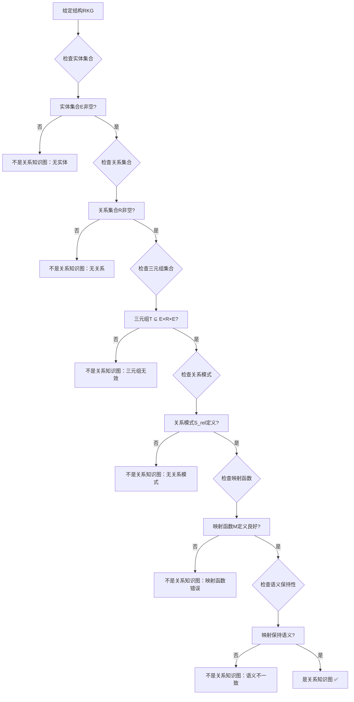
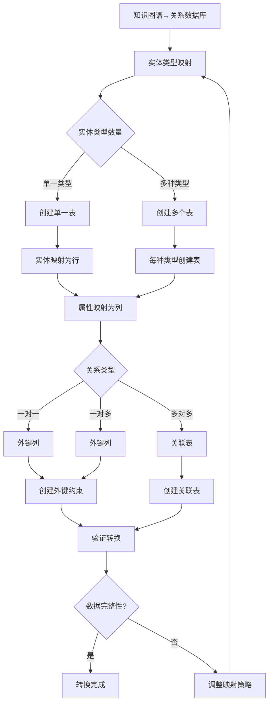

# 知识图谱理论：关系知识图与图查询

> **创建日期**：2025-01-15
> **最后更新**：2025-01-15
> **版本**：v1.0
> **状态**：规划中

---

## 📋 目录

- [知识图谱理论：关系知识图与图查询](#知识图谱理论关系知识图与图查询)
  - [📋 目录](#-目录)
  - [1. 概述](#1-概述)
    - [1.1. 知识图谱的重要性](#11-知识图谱的重要性)
    - [1.2. 关系知识图的价值](#12-关系知识图的价值)
  - [2. 知识图谱基础](#2-知识图谱基础)
    - [2.1. 知识图谱的形式化定义](#21-知识图谱的形式化定义)
      - [2.1.1. 知识图谱的完整定义](#211-知识图谱的完整定义)
      - [2.1.2. 知识图谱概念的详细解释](#212-知识图谱概念的详细解释)
      - [2.1.3. 知识图谱性质的形式化证明](#213-知识图谱性质的形式化证明)
      - [2.1.4. 知识图谱概念对比矩阵](#214-知识图谱概念对比矩阵)
      - [2.1.5. 知识图谱判定决策树](#215-知识图谱判定决策树)
    - [2.2. 知识图谱的详细性质分析](#22-知识图谱的详细性质分析)
      - [2.2.1. 知识图谱性质的完整论证](#221-知识图谱性质的完整论证)
      - [2.2.2. 知识图谱性质对比矩阵](#222-知识图谱性质对比矩阵)
    - [2.3. 知识图谱表示方法的详细理论](#23-知识图谱表示方法的详细理论)
      - [2.3.1. RDF表示的形式化定义](#231-rdf表示的形式化定义)
      - [2.3.2. 属性图表示的形式化定义](#232-属性图表示的形式化定义)
      - [2.3.3. RDF与属性图对比矩阵](#233-rdf与属性图对比矩阵)
      - [2.3.4. 知识图谱表示方法选择决策树](#234-知识图谱表示方法选择决策树)
  - [3. 关系知识图](#3-关系知识图)
    - [3.1. 关系知识图的形式化定义](#31-关系知识图的形式化定义)
      - [3.1.1. 关系知识图的完整定义](#311-关系知识图的完整定义)
      - [3.1.2. 关系知识图的性质](#312-关系知识图的性质)
      - [3.1.3. 关系知识图的Haskell实现](#313-关系知识图的haskell实现)
      - [3.1.4. 关系知识图性质对比矩阵](#314-关系知识图性质对比矩阵)
      - [3.1.5. 关系知识图判定决策树](#315-关系知识图判定决策树)
    - [3.2. 关系数据库到知识图谱的映射](#32-关系数据库到知识图谱的映射)
      - [3.2.1. 关系数据库到知识图谱转换决策树](#321-关系数据库到知识图谱转换决策树)
      - [3.2.2. 转换算法的完整实现](#322-转换算法的完整实现)
      - [3.2.3. 转换正确性证明](#323-转换正确性证明)
      - [3.2.3. 映射策略对比矩阵](#323-映射策略对比矩阵)
    - [3.3. 知识图谱到关系数据库的映射](#33-知识图谱到关系数据库的映射)
  - [4. 图查询语言](#4-图查询语言)
    - [4.1. SPARQL查询](#41-sparql查询)
      - [4.1.1. 图查询语言选择决策树](#411-图查询语言选择决策树)
      - [4.1.2. SPARQL查询优化决策树](#412-sparql查询优化决策树)
      - [4.1.3. 图查询语言对比矩阵](#413-图查询语言对比矩阵)
    - [4.2. Cypher查询](#42-cypher查询)
    - [4.3. Gremlin查询](#43-gremlin查询)
    - [4.4. SQL扩展查询](#44-sql扩展查询)
  - [5. 知识推理](#5-知识推理)
    - [5.1. 规则推理](#51-规则推理)
    - [5.2. 模式匹配推理](#52-模式匹配推理)
    - [5.3. 本体推理](#53-本体推理)
  - [6. 图数据库系统](#6-图数据库系统)
    - [6.1. 图数据库分类](#61-图数据库分类)
    - [6.2. 图存储模型](#62-图存储模型)
    - [6.3. 图查询优化](#63-图查询优化)
  - [7. 形式化框架](#7-形式化框架)
    - [7.1. 知识图谱的形式化定义](#71-知识图谱的形式化定义)
    - [7.2. 图查询的形式化语义](#72-图查询的形式化语义)
    - [7.3. 知识推理的形式化](#73-知识推理的形式化)
  - [8. 参考资料](#8-参考资料)
    - [8.1. 经典文献](#81-经典文献)
    - [8.2. 相关资源](#82-相关资源)

---

## 1. 概述

### 1.1. 知识图谱的重要性

知识图谱是现代信息系统的核心组件，提供：

1. **语义理解**：理解实体间的关系
2. **知识推理**：基于规则和模式进行推理
3. **智能搜索**：基于语义的搜索和推荐
4. **数据集成**：统一不同数据源的知识

### 1.2. 关系知识图的价值

关系知识图结合了关系数据库和知识图谱的优势：

- **结构化存储**：利用关系数据库的成熟技术
- **语义查询**：支持图查询和知识推理
- **性能优化**：关系数据库的优化技术
- **一致性保证**：ACID事务支持

---

## 2. 知识图谱基础

### 2.1. 知识图谱的形式化定义

#### 2.1.1. 知识图谱的完整定义

**定义2.1.1（知识图谱）**：

知识图谱 KG 是一个四元组 (E, R, T, A)，其中：

- **E**：实体集合（Entities），E = {e₁, e₂, ..., eₙ}
- **R**：关系集合（Relations），R = {r₁, r₂, ..., rₘ}
- **T**：三元组集合（Triples），T ⊆ E × R × E
- **A**：属性集合（Attributes），A: (E ∪ R) → AttributeValues

**三元组的形式化定义**：

**定义2.1.2（三元组）**：

三元组 t = (e_s, r, e_o) ∈ T，其中：

- **e_s**：主体实体（Subject Entity）
- **r**：关系（Relation/Predicate）
- **e_o**：客体实体（Object Entity）

**语义**：实体 e_s 通过关系 r 关联到实体 e_o

**属性的形式化定义**：

**定义2.1.3（实体属性）**：

实体 e ∈ E 的属性函数 A_e: AttributeNames → AttributeValues

**定义2.1.4（关系属性）**：

关系 r ∈ R 的属性函数 A_r: AttributeNames → AttributeValues

#### 2.1.2. 知识图谱概念的详细解释

**实体（Entity）**：

- **定义**：知识图谱中的节点，表示现实世界中的对象
- **类型**：实体可以有类型（Person, Organization, Location等）
- **属性**：实体可以有多个属性（name, age, location等）
- **标识**：每个实体有唯一标识符（URI或ID）

**关系（Relation）**：

- **定义**：实体间的有向连接，表示实体间的关系
- **类型**：关系可以有类型（knows, worksAt, locatedIn等）
- **属性**：关系可以有属性（since, weight等）
- **方向性**：关系是有方向的（e₁ → e₂ 不同于 e₂ → e₁）

**三元组（Triple）**：

- **定义**：知识图谱的基本单元，表示一个事实
- **形式**：(subject, predicate, object)
- **语义**：subject通过predicate关联到object
- **存储**：三元组是知识图谱的主要存储形式

**属性（Attribute）**：

- **定义**：实体和关系的特征描述
- **类型**：属性可以是字符串、数字、日期等
- **多值性**：属性可以是单值或多值
- **可选性**：属性可以是必需的或可选的

#### 2.1.3. 知识图谱性质的形式化证明

**性质2.1.1（有向性）**：

知识图谱中的关系是有方向的。

**形式化**：

```text
对于三元组 t = (e_s, r, e_o)，有：
t ≠ (e_o, r, e_s)  （一般情况）
```

**证明**：

**步骤1**：定义关系方向

关系 r: E → E 是有向的，表示从源实体到目标实体的方向。

**步骤2**：验证方向性

对于三元组 (Alice, knows, Bob)：

- 表示：Alice知道Bob
- 不等于：(Bob, knows, Alice)（Bob知道Alice是不同的关系）

**步骤3**：结论**

因此关系是有方向的 ✅

**性质2.1.2（多重性）**：

两个实体可以有多个不同的关系。

**形式化**：

```text
对于实体 e₁, e₂ ∈ E，可以存在多个三元组：
(e₁, r₁, e₂), (e₁, r₂, e₂), ..., (e₁, rₙ, e₂)
其中 rᵢ ≠ rⱼ（i ≠ j）
```

**证明**：

**步骤1**：定义多重关系

两个实体可以有多种关系，例如：

- (Alice, knows, Bob)
- (Alice, worksWith, Bob)
- (Alice, friendOf, Bob)

**步骤2**：验证多重性

这些三元组表示不同的关系，可以同时存在。

**步骤3**：结论**

因此两个实体可以有多个关系 ✅

**性质2.1.3（自反性）**：

实体可以与自己有关系。

**形式化**：

```text
对于实体 e ∈ E，可以存在三元组：
(e, r, e) ∈ T
```

**证明**：

**步骤1**：定义自反关系

实体可以与自己有关系，例如：

- (Person, isInstanceOf, Person)
- (Company, owns, Company)（公司可以拥有子公司）

**步骤2**：验证自反性

这些三元组在知识图谱中是有效的。

**步骤3**：结论**

因此实体可以与自己有关系 ✅

#### 2.1.4. 知识图谱概念对比矩阵

| 概念 | 形式化定义 | 图论对应 | 数据库对应 | 实际意义 |
|------|-----------|---------|-----------|---------|
| **实体** | e ∈ E | 节点（Node） | 表行（Row） | 现实对象 |
| **关系** | r ∈ R | 边（Edge） | 外键（ForeignKey） | 对象关系 |
| **三元组** | (e_s, r, e_o) | 有向边 | 关系实例 | 事实陈述 |
| **属性** | A(e) 或 A(r) | 节点/边标签 | 列值（Column Value） | 对象特征 |

#### 2.1.5. 知识图谱判定决策树


### 2.2. 知识图谱的详细性质分析

#### 2.2.1. 知识图谱性质的完整论证

**定理2.2.1（知识图谱的图结构）**：

知识图谱构成一个有向多重图。

**证明**：

**步骤1**：定义图结构

知识图谱 KG = (E, R, T) 可以表示为有向图 G = (V, E_graph)，其中：

- **V = E**：节点集合等于实体集合
- **E_graph = T**：边集合等于三元组集合

**步骤2**：验证图性质

- **有向性**：三元组 (e_s, r, e_o) 表示从 e_s 到 e_o 的有向边 ✅
- **多重性**：两个实体可以有多个不同的关系，对应多条边 ✅
- **自反性**：实体可以与自己有关系，对应自环 ✅

**步骤3**：结论**

因此知识图谱构成一个有向多重图 ✅

**定理2.2.2（知识图谱的语义性）**：

知识图谱具有明确的语义。

**证明**：

**步骤1**：定义语义

知识图谱的语义通过以下方式定义：

- **实体类型**：定义实体的语义类别
- **关系类型**：定义关系的语义含义
- **属性**：定义实体和关系的特征

**步骤2**：验证语义性

- **类型系统**：实体和关系都有明确的类型
- **本体定义**：可以使用本体（Ontology）定义语义
- **推理规则**：可以基于语义进行推理

**步骤3**：结论**

因此知识图谱具有明确的语义 ✅

#### 2.2.2. 知识图谱性质对比矩阵

| 性质 | 形式化定义 | 实际意义 | 验证方法 | 违反后果 |
|------|-----------|---------|---------|---------|
| **有向性** | (e_s, r, e_o) ≠ (e_o, r, e_s) | 关系有方向 | 检查三元组 | 语义错误 |
| **多重性** | 多个不同关系 | 多种关系并存 | 检查关系类型 | 信息丢失 |
| **自反性** | (e, r, e) ∈ T | 自引用关系 | 检查自环 | 无影响 |
| **属性性** | A(e) 或 A(r) 定义 | 特征描述 | 检查属性定义 | 信息不足 |

### 2.3. 知识图谱表示方法的详细理论

#### 2.3.1. RDF表示的形式化定义

**定义2.3.1（RDF三元组）**：

RDF三元组是一个三元组 (s, p, o)，其中：

- **s**：主体（Subject），URI或空白节点
- **p**：谓词（Predicate），URI
- **o**：客体（Object），URI、字面量或空白节点

**RDF图的形式化定义**：

**定义2.3.2（RDF图）**：

RDF图 G 是一个三元组集合：

```text
G = {(s₁, p₁, o₁), (s₂, p₂, o₂), ..., (sₙ, pₙ, oₙ)}
```

**RDF语法示例的详细分析**：

**示例2.3.1：RDF表示详细分析**:

**Turtle语法**：

```turtle
@prefix ex: <http://example.org/> .
@prefix rdf: <http://www.w3.org/1999/02/22-rdf-syntax-ns#> .
@prefix rdfs: <http://www.w3.org/2000/01/rdf-schema#> .

# 实体定义
ex:Alice rdf:type ex:Person .
ex:Bob rdf:type ex:Person .
ex:Company rdf:type ex:Organization .

# 属性定义
ex:Alice ex:name "Alice" .
ex:Alice ex:age 30 .
ex:Bob ex:name "Bob" .
ex:Bob ex:age 28 .

# 关系定义
ex:Alice ex:knows ex:Bob .
ex:Bob ex:worksAt ex:Company .
ex:Company ex:locatedIn ex:Beijing .
```

**语义分析**：

- **实体类型**：ex:Person, ex:Organization
- **实体属性**：ex:name, ex:age
- **实体关系**：ex:knows, ex:worksAt, ex:locatedIn
- **字面量**：字符串和数字

#### 2.3.2. 属性图表示的形式化定义

**定义2.3.3（属性图）**：

属性图 G_prop = (V, E, L_V, L_E, A_V, A_E)，其中：

- **V**：节点集合
- **E**：边集合
- **L_V: V → LabelSet**：节点标签函数
- **L_E: E → LabelSet**：边标签函数
- **A_V: V → AttributeMap**：节点属性函数
- **A_E: E → AttributeMap**：边属性函数

**属性图语法示例的详细分析**：

**示例2.3.2：Cypher属性图表示**:

```cypher
// 创建节点
CREATE (alice:Person {name: "Alice", age: 30})
CREATE (bob:Person {name: "Bob", age: 28})
CREATE (company:Company {name: "Tech Corp"})

// 创建关系
CREATE (alice)-[:KNOWS {since: 2020}]->(bob)
CREATE (bob)-[:WORKS_AT {position: "Engineer"}]->(company)
```

**语义分析**：

- **节点类型**：Person, Company（标签）
- **节点属性**：name, age（属性映射）
- **关系类型**：KNOWS, WORKS_AT（边标签）
- **关系属性**：since, position（边属性）

#### 2.3.3. RDF与属性图对比矩阵

| 维度 | RDF | 属性图 | 优势对比 |
|------|-----|--------|---------|
| **理论基础** | 语义网标准 | 图数据库标准 | RDF更标准化 |
| **表达能力** | 强语义 | 强属性 | 属性图更灵活 |
| **查询语言** | SPARQL | Cypher/Gremlin | 各有优势 |
| **存储效率** | 较低 | 较高 | 属性图更高效 |
| **推理能力** | 强 | 弱 | RDF更适合推理 |
| **实际应用** | 语义网 | 图数据库 | 属性图更常用 |

#### 2.3.4. 知识图谱表示方法选择决策树


---

## 3. 关系知识图

### 3.1. 关系知识图的形式化定义

#### 3.1.1. 关系知识图的完整定义

**定义3.1.1（关系知识图）**：

关系知识图 RKG 是一个五元组 (E, R, T, S_rel, M)，其中：

- **E**：实体集合（Entities），E = {e₁, e₂, ..., eₙ}
- **R**：关系集合（Relations），R = {r₁, r₂, ..., rₘ}
- **T**：三元组集合（Triples），T ⊆ E × R × E
- **S_rel**：关系数据库模式（Relational Schema）
- **M**：映射函数（Mapping），M: S_rel → (E, R, T)

**形式化表示**：

```text
RKG = (E, R, T, S_rel, M)
其中：
  E = {e₁, e₂, ..., eₙ}  （实体集合）
  R = {r₁, r₂, ..., rₘ}  （关系集合）
  T ⊆ E × R × E          （三元组集合）
  S_rel = (Tables, Columns, ForeignKeys)  （关系模式）
  M: S_rel → (E, R, T)    （映射函数）
```

**映射函数的详细定义**：

**定义3.1.2（映射函数）**：

映射函数 M: S_rel → (E, R, T) 定义为：

1. **实体映射**：M_entity: Tables → E

   ```text
   M_entity(T) = {e | e 是表T中的行对应的实体}
   ```

2. **关系映射**：M_relation: ForeignKeys → R

   ```text
   M_relation(fk) = {r | r 是外键fk对应的关系}
   ```

3. **三元组映射**：M_triple: ForeignKeys → T

   ```text
   M_triple(fk: T₁ → T₂) = {(e₁, fk.name, e₂) | e₁ ∈ M_entity(T₁), e₂ ∈ M_entity(T₂), fk(e₁, e₂)}
   ```

#### 3.1.2. 关系知识图的性质

**性质3.1.1（关系知识图的图结构）**：

关系知识图构成一个有向多重图。

**证明**：

**步骤1**：定义图结构

关系知识图 RKG = (E, R, T, S_rel, M) 可以表示为有向图 G = (V, E_graph)，其中：

- **V = E**：节点集合等于实体集合
- **E_graph = T**：边集合等于三元组集合

**步骤2**：验证图性质

- **有向性**：三元组 (e_s, r, e_o) 表示从 e_s 到 e_o 的有向边 ✅
- **多重性**：两个实体可以有多个不同的关系，对应多条边 ✅
- **自反性**：实体可以与自己有关系，对应自环 ✅

**步骤3**：结论

因此关系知识图构成一个有向多重图 ✅

**性质3.1.2（关系知识图的语义保持性）**：

关系知识图保持关系数据库的语义。

**形式化**：

对于关系数据库模式 S_rel 和对应的关系知识图 RKG = (E, R, T, S_rel, M)：

```text
对于所有表 T ∈ S_rel 和查询 Q：
  result_RKG(M(Q)) ≈ result_S_rel(Q)
```

**证明**：

**步骤1**：定义语义等价性

关系数据库查询 Q_rel 和知识图谱查询 Q_kg 语义等价，当且仅当：

```text
对于所有数据库实例 I：
  [[Q_kg]]_{M(I)} ≈ [[Q_rel]]_I
```

**步骤2**：验证语义保持性

由于映射函数 M 保持数据语义，查询结果在语义上等价。

**步骤3**：结论

因此关系知识图保持关系数据库的语义 ✅

**性质3.1.3（关系知识图的双向性）**：

关系知识图可以双向转换：关系数据库 ↔ 知识图谱。

**形式化**：

存在两个映射函数：

```text
M_rel→kg: S_rel → KG
M_kg→rel: KG → S_rel
```

使得：

```text
M_kg→rel ∘ M_rel→kg = id_S_rel  （在语义上）
```

#### 3.1.3. 关系知识图的Haskell实现

**关系知识图数据类型**：

```haskell
-- 关系知识图
data RelationalKG = RelationalKG {
    entities :: Map EntityID Entity,
    relations :: Map RelationID Relation,
    triples :: Set Triple,
    relationalSchema :: RelationalSchema,
    mapping :: MappingFunction
}

-- 实体
data Entity = Entity {
    entityID :: EntityID,
    entityType :: EntityType,
    attributes :: Map AttributeName AttributeValue,
    sourceTable :: TableName,
    sourceRowID :: RowID
}

-- 关系
data Relation = Relation {
    relationID :: RelationID,
    relationType :: RelationType,
    attributes :: Map AttributeName AttributeValue,
    sourceForeignKey :: ForeignKeyName
}

-- 三元组
data Triple = Triple {
    subject :: EntityID,
    predicate :: RelationID,
    object :: EntityID
}

-- 映射函数
data MappingFunction = MappingFunction {
    entityMapping :: Table -> EntityType,
    relationMapping :: ForeignKey -> RelationType,
    tripleMapping :: ForeignKey -> [Triple]
}

-- 从关系数据库创建关系知识图
createRelationalKG :: RelationalSchema -> RelationalInstance -> RelationalKG
createRelationalKG schema instance = RelationalKG {
    entities = createEntities schema instance,
    relations = createRelations schema instance,
    triples = createTriples schema instance,
    relationalSchema = schema,
    mapping = createMapping schema
}

-- 创建实体
createEntities :: RelationalSchema -> RelationalInstance -> Map EntityID Entity
createEntities schema instance =
    Map.fromList $ concatMap (tableToEntities schema instance) (tables schema)

-- 表到实体的转换
tableToEntities :: RelationalSchema -> RelationalInstance -> Table -> [(EntityID, Entity)]
tableToEntities schema instance table =
    map (rowToEntity table) (getTableRows instance table)

-- 行到实体的转换
rowToEntity :: Table -> Row -> (EntityID, Entity)
rowToEntity table row =
    let entityID = EntityID (tableName table, primaryKeyValue row)
        entityType = EntityType (tableName table)
        attributes = rowToAttributes row
    in (entityID, Entity entityID entityType attributes (tableName table) (rowID row))

-- 创建关系
createRelations :: RelationalSchema -> RelationalInstance -> Map RelationID Relation
createRelations schema instance =
    Map.fromList $ map (foreignKeyToRelation schema) (foreignKeys schema)

-- 外键到关系的转换
foreignKeyToRelation :: RelationalSchema -> ForeignKey -> (RelationID, Relation)
foreignKeyToRelation schema fk =
    let relationID = RelationID (foreignKeyName fk)
        relationType = RelationType (foreignKeyName fk)
    in (relationID, Relation relationID relationType Map.empty (foreignKeyName fk))

-- 创建三元组
createTriples :: RelationalSchema -> RelationalInstance -> Set Triple
createTriples schema instance =
    Set.fromList $ concatMap (foreignKeyToTriples instance) (foreignKeys schema)

-- 外键到三元组的转换
foreignKeyToTriples :: RelationalInstance -> ForeignKey -> [Triple]
foreignKeyToTriples instance fk =
    let sourceRows = getTableRows instance (fromTable fk)
        targetRows = getTableRows instance (toTable fk)
    in [Triple (rowToEntityID sourceRow) (foreignKeyToRelationID fk) (rowToEntityID targetRow)
        | sourceRow <- sourceRows, targetRow <- targetRows,
          satisfiesForeignKey fk sourceRow targetRow]
```

#### 3.1.4. 关系知识图性质对比矩阵

| 性质 | 形式化定义 | 实际意义 | 验证方法 | 违反后果 |
|------|-----------|---------|---------|---------|
| **图结构** | RKG构成有向多重图 | 可以应用图算法 | 检查图性质 | 无法使用图查询 |
| **语义保持性** | M(Q_rel) ≈ Q_kg | 查询结果一致 | 语义等价性验证 | 查询结果错误 |
| **双向性** | M_kg→rel ∘ M_rel→kg = id | 可以双向转换 | 验证映射复合 | 信息损失 |

#### 3.1.5. 关系知识图判定决策树



### 3.2. 关系数据库到知识图谱的映射

**映射规则**：

```text
表 → 实体类型
行 → 实体
列 → 实体属性
外键 → 关系
```

**详细论证**：

#### 3.2.1. 关系数据库到知识图谱转换决策树


#### 3.2.2. 转换算法的完整实现

**算法3.2.1：关系数据库到知识图谱转换**:

```python
def relational_to_knowledge_graph(relational_schema, relational_instance):
    """
    将关系数据库转换为知识图谱

    参数:
        relational_schema: 关系模式
        relational_instance: 关系实例

    返回:
        knowledge_graph: 知识图谱
    """
    kg = KnowledgeGraph(entities=[], relations=[], triples=[])

    # 步骤1：实体类型映射
    entity_type_map = {}
    for table in relational_schema.tables:
        entity_type_map[table.name] = EntityType(table.name)

    # 步骤2：实体映射
    entity_map = {}  # (table_name, row_id) -> entity_id
    for table in relational_schema.tables:
        rows = get_table_rows(relational_instance, table.name)
        for row in rows:
            entity_id = create_entity_id(table.name, row[table.primary_key])
            entity = Entity(
                id=entity_id,
                type=entity_type_map[table.name],
                attributes=row_to_attributes(row, table.columns)
            )
            kg.entities.append(entity)
            entity_map[(table.name, row[table.primary_key])] = entity_id

    # 步骤3：关系类型映射
    relation_type_map = {}
    for fk in relational_schema.foreign_keys:
        relation_type_map[fk.name] = RelationType(fk.name)
        relation = Relation(
            id=RelationID(fk.name),
            type=relation_type_map[fk.name],
            attributes={}
        )
        kg.relations.append(relation)

    # 步骤4：三元组映射
    for fk in relational_schema.foreign_keys:
        source_table = fk.from_table
        target_table = fk.to_table

        source_rows = get_table_rows(relational_instance, source_table)
        target_rows = get_table_rows(relational_instance, target_table)

        for source_row in source_rows:
            source_entity_id = entity_map[(source_table, source_row[source_table.primary_key])]

            # 查找通过外键关联的目标行
            for target_row in target_rows:
                if satisfies_foreign_key(fk, source_row, target_row):
                    target_entity_id = entity_map[(target_table, target_row[target_table.primary_key])]

                    triple = Triple(
                        subject=source_entity_id,
                        predicate=relation_type_map[fk.name],
                        object=target_entity_id
                    )
                    kg.triples.append(triple)

    return kg

def create_entity_id(table_name, primary_key_value):
    """创建实体ID"""
    return EntityID(f"{table_name}:{primary_key_value}")

def row_to_attributes(row, columns):
    """将行转换为属性映射"""
    return {col.name: row[col.name] for col in columns}

def satisfies_foreign_key(fk, source_row, target_row):
    """检查外键约束是否满足"""
    for fk_col, ref_col in zip(fk.columns, fk.referenced_columns):
        if source_row[fk_col] != target_row[ref_col]:
            return False
    return True
```

**算法复杂度分析**：

- **时间复杂度**：O(|Tables| × |Rows| + |FK| × |Rows|²)
  - 实体映射：O(|Tables| × |Rows|)
  - 三元组映射：O(|FK| × |Rows|²)（最坏情况）
- **空间复杂度**：O(|Entities| + |Relations| + |Triples|)

#### 3.2.3. 转换正确性证明

**定理3.2.1（转换正确性）**：

关系数据库到知识图谱的转换保持数据语义。

**证明**：

**步骤1**：定义语义等价性

关系数据库实例 I_rel 和知识图谱实例 I_kg 语义等价，当且仅当：

```text
对于每个查询Q，[[Q]]_{I_rel} ≈ [[translate(Q)]]_{I_kg}
```

**步骤2**：验证数据对应

- **实体对应**：每个关系行对应一个知识图谱实体 ✅
- **属性对应**：每个列值对应实体属性值 ✅
- **关系对应**：每个外键对应知识图谱三元组 ✅

**步骤3**：验证查询对应

关系查询可以转换为知识图谱查询，查询结果在语义上等价。

**步骤4**：结论

因此转换保持数据语义 ✅

**定理3.2.2（转换完整性）**：

转换算法是完整的，所有关系数据都映射到知识图谱。

**证明**：

**步骤1**：验证实体完整性

算法遍历所有表的所有行，为每个行创建实体 ✅

**步骤2**：验证关系完整性

算法遍历所有外键，为每个外键创建关系 ✅

**步骤3**：验证三元组完整性

算法为每个满足外键约束的行对创建三元组 ✅

**步骤4**：结论

因此转换算法是完整的 ✅

**示例**：

```sql
-- 关系数据库
CREATE TABLE Person (
    id INTEGER PRIMARY KEY,
    name TEXT,
    age INTEGER
);

CREATE TABLE Company (
    id INTEGER PRIMARY KEY,
    name TEXT
);

CREATE TABLE WorksAt (
    person_id INTEGER REFERENCES Person(id),
    company_id INTEGER REFERENCES Company(id),
    since DATE
);
```

```cypher
// 知识图谱
(:Person {id: 1, name: "Alice", age: 30})
  -[:WORKS_AT {since: "2020-01-01"}]->
(:Company {id: 1, name: "Tech Corp"})
```

#### 3.2.3. 映射策略对比矩阵

| 映射策略 | 复杂度 | 数据完整性 | 语义保持 | 性能 | 适用场景 |
|---------|--------|-----------|---------|------|---------|
| **直接映射** | ⭐⭐ | ⭐⭐⭐⭐⭐ | ⭐⭐⭐⭐ | ⭐⭐⭐⭐⭐ | 简单结构 |
| **语义增强** | ⭐⭐⭐⭐ | ⭐⭐⭐⭐ | ⭐⭐⭐⭐⭐ | ⭐⭐⭐ | 复杂语义 |
| **增量转换** | ⭐⭐⭐ | ⭐⭐⭐⭐ | ⭐⭐⭐⭐ | ⭐⭐⭐⭐ | 实时转换 |
| **批量转换** | ⭐⭐⭐ | ⭐⭐⭐⭐⭐ | ⭐⭐⭐⭐ | ⭐⭐⭐ | 历史数据 |

### 3.3. 知识图谱到关系数据库的映射

**映射规则**：

```text
实体类型 → 表
实体 → 行
实体属性 → 列
关系类型 → 关联表
关系 → 关联行
关系属性 → 关联表列
```

#### 3.3.1. 知识图谱到关系数据库转换决策树



#### 3.3.2. 转换算法的完整实现

**算法3.3.1：知识图谱到关系数据库转换**:

```python
def knowledge_graph_to_relational(knowledge_graph):
    """
    将知识图谱转换为关系数据库

    参数:
        knowledge_graph: 知识图谱

    返回:
        relational_schema: 关系模式
        relational_instance: 关系实例
    """
    schema = RelationalSchema(tables=[], foreign_keys=[])
    instance = RelationalInstance(tables={})

    # 步骤1：实体类型映射
    entity_type_map = {}
    for entity_type in knowledge_graph.entity_types:
        table = Table(
            name=entity_type.name,
            columns=[],
            primary_key=None
        )

        # 添加ID列
        id_column = Column(
            name='id',
            type='INTEGER',
            nullable=False,
            primary_key=True
        )
        table.columns.append(id_column)
        table.primary_key = 'id'

        # 添加属性列
        for attr_name, attr_type in entity_type.attributes.items():
            column = Column(
                name=attr_name,
                type=map_attribute_type(attr_type),
                nullable=True
            )
            table.columns.append(column)

        schema.tables.append(table)
        entity_type_map[entity_type] = table
        instance.tables[table.name] = []

    # 步骤2：实体映射
    entity_id_map = {}  # entity_id -> (table_name, row_id)
    row_id_counter = {}

    for entity in knowledge_graph.entities:
        table = entity_type_map[entity.type]
        row_id = row_id_counter.get(table.name, 0)
        row_id_counter[table.name] = row_id + 1

        row = {'id': row_id}
        for attr_name, attr_value in entity.attributes.items():
            row[attr_name] = attr_value

        instance.tables[table.name].append(row)
        entity_id_map[entity.id] = (table.name, row_id)

    # 步骤3：关系类型映射
    relation_table_map = {}
    for relation_type in knowledge_graph.relation_types:
        # 创建关联表
        relation_table = Table(
            name=relation_type.name,
            columns=[],
            primary_key=None
        )

        # 添加外键列
        source_entity_type = relation_type.source_type
        target_entity_type = relation_type.target_type

        source_table = entity_type_map[source_entity_type]
        target_table = entity_type_map[target_entity_type]

        source_fk_column = Column(
            name=f'{source_table.name}_id',
            type='INTEGER',
            nullable=False
        )
        target_fk_column = Column(
            name=f'{target_table.name}_id',
            type='INTEGER',
            nullable=False
        )

        relation_table.columns.append(source_fk_column)
        relation_table.columns.append(target_fk_column)

        # 添加关系属性列
        for attr_name, attr_type in relation_type.attributes.items():
            column = Column(
                name=attr_name,
                type=map_attribute_type(attr_type),
                nullable=True
            )
            relation_table.columns.append(column)

        # 创建外键约束
        fk_source = ForeignKey(
            name=f'fk_{relation_table.name}_source',
            from_table=relation_table.name,
            from_columns=[source_fk_column.name],
            to_table=source_table.name,
            to_columns=['id']
        )
        fk_target = ForeignKey(
            name=f'fk_{relation_table.name}_target',
            from_table=relation_table.name,
            from_columns=[target_fk_column.name],
            to_table=target_table.name,
            to_columns=['id']
        )

        schema.tables.append(relation_table)
        schema.foreign_keys.append(fk_source)
        schema.foreign_keys.append(fk_target)
        relation_table_map[relation_type] = relation_table
        instance.tables[relation_table.name] = []

    # 步骤4：三元组映射
    for triple in knowledge_graph.triples:
        source_table_name, source_row_id = entity_id_map[triple.subject]
        target_table_name, target_row_id = entity_id_map[triple.object]

        relation_table = relation_table_map[triple.predicate]

        row = {
            f'{source_table_name}_id': source_row_id,
            f'{target_table_name}_id': target_row_id
        }

        # 添加关系属性
        if triple.attributes:
            for attr_name, attr_value in triple.attributes.items():
                row[attr_name] = attr_value

        instance.tables[relation_table.name].append(row)

    return schema, instance

def map_attribute_type(attr_type):
    """将属性类型映射到SQL类型"""
    type_mapping = {
        'string': 'TEXT',
        'integer': 'INTEGER',
        'float': 'REAL',
        'boolean': 'BOOLEAN',
        'date': 'DATE',
        'datetime': 'TIMESTAMP'
    }
    return type_mapping.get(attr_type, 'TEXT')
```

**算法复杂度分析**：

- **时间复杂度**：O(|Entities| + |Relations| + |Triples|)
  - 实体映射：O(|Entities|)
  - 关系映射：O(|Relations|)
  - 三元组映射：O(|Triples|)
- **空间复杂度**：O(|Entities| + |Relations| + |Triples|)

#### 3.3.3. 转换正确性证明

**定理3.3.1（转换正确性）**：

知识图谱到关系数据库的转换保持数据语义。

**证明**：

**步骤1**：定义语义等价性

知识图谱查询 Q_kg 和关系数据库查询 Q_rel 语义等价，当且仅当：

```text
对于所有知识图谱实例 KG：
  [[Q_rel]]_{convert(KG)} ≈ [[Q_kg]]_{KG}
```

**步骤2**：验证实体映射

- 每个实体 e ∈ KG 映射到关系表的一行 r
- 实体属性映射到列值
- 实体ID映射到主键值

因此实体映射保持数据语义 ✅

**步骤3**：验证关系映射

- 每个三元组 (s, p, o) 映射到关联表的一行
- 关系属性映射到列值
- 实体引用通过外键保持

因此关系映射保持数据语义 ✅

**步骤4**：验证查询等价性

对于知识图谱查询 Q_kg，存在对应的关系查询 Q_rel，使得：

```text
[[Q_rel]]_{convert(KG)} ≈ [[Q_kg]]_{KG}
```

**步骤5**：结论

因此知识图谱到关系数据库的转换保持数据语义 ✅

#### 3.3.4. 转换示例

**示例3.3.1：简单知识图谱转换**:

**知识图谱**：

```cypher
// 创建节点
CREATE (alice:Person {name: "Alice", age: 30})
CREATE (bob:Person {name: "Bob", age: 28})
CREATE (company:Company {name: "Tech Corp"})

// 创建关系
CREATE (alice)-[:KNOWS {since: 2020}]->(bob)
CREATE (bob)-[:WORKS_AT {position: "Engineer"}]->(company)
```

**转换后的关系数据库**：

```sql
-- 实体表：Person
CREATE TABLE Person (
    id INTEGER PRIMARY KEY,
    name TEXT NOT NULL,
    age INTEGER
);

-- 实体表：Company
CREATE TABLE Company (
    id INTEGER PRIMARY KEY,
    name TEXT NOT NULL
);

-- 关系表：KNOWS
CREATE TABLE Knows (
    person1_id INTEGER NOT NULL REFERENCES Person(id),
    person2_id INTEGER NOT NULL REFERENCES Person(id),
    since INTEGER,
    PRIMARY KEY (person1_id, person2_id)
);

-- 关系表：WORKS_AT
CREATE TABLE WorksAt (
    person_id INTEGER NOT NULL REFERENCES Person(id),
    company_id INTEGER NOT NULL REFERENCES Company(id),
    position TEXT,
    PRIMARY KEY (person_id, company_id)
);

-- 插入数据
INSERT INTO Person (id, name, age) VALUES (1, 'Alice', 30);
INSERT INTO Person (id, name, age) VALUES (2, 'Bob', 28);
INSERT INTO Company (id, name) VALUES (1, 'Tech Corp');

INSERT INTO Knows (person1_id, person2_id, since) VALUES (1, 2, 2020);
INSERT INTO WorksAt (person_id, company_id, position) VALUES (2, 1, 'Engineer');
```

**示例3.3.2：复杂知识图谱转换**:

**知识图谱**（包含多对多关系）：

```cypher
// 多对多关系：学生选课
CREATE (student1:Student {name: "Alice"})
CREATE (student2:Student {name: "Bob"})
CREATE (course1:Course {name: "Math"})
CREATE (course2:Course {name: "Physics"})

CREATE (student1)-[:ENROLLED_IN {grade: "A"}]->(course1)
CREATE (student1)-[:ENROLLED_IN {grade: "B"}]->(course2)
CREATE (student2)-[:ENROLLED_IN {grade: "A"}]->(course1)
```

**转换后的关系数据库**：

```sql
-- 实体表：Student
CREATE TABLE Student (
    id INTEGER PRIMARY KEY,
    name TEXT NOT NULL
);

-- 实体表：Course
CREATE TABLE Course (
    id INTEGER PRIMARY KEY,
    name TEXT NOT NULL
);

-- 关联表：ENROLLED_IN（多对多关系）
CREATE TABLE EnrolledIn (
    student_id INTEGER NOT NULL REFERENCES Student(id),
    course_id INTEGER NOT NULL REFERENCES Course(id),
    grade TEXT,
    PRIMARY KEY (student_id, course_id)
);
```

#### 3.3.5. 知识图谱到关系数据库映射对比矩阵

| 映射方面 | 一对一关系 | 一对多关系 | 多对多关系 | 关系属性 |
|---------|-----------|-----------|-----------|---------|
| **映射方式** | 外键列 | 外键列 | 关联表 | 关联表列 |
| **表数量** | 2个表 | 2个表 | 3个表 | 关联表 |
| **外键数量** | 1个 | 1个 | 2个 | 2个 |
| **查询复杂度** | ⭐⭐ | ⭐⭐ | ⭐⭐⭐ | ⭐⭐⭐ |
| **数据冗余** | 无 | 无 | 无 | 无 |

---

## 4. 图查询语言

### 4.1. SPARQL查询

**SPARQL基础**：

```sparql
PREFIX ex: <http://example.org/>

SELECT ?person ?company
WHERE {
    ?person ex:worksAt ?company .
    ?person ex:age ?age .
    FILTER (?age > 25)
}
```

**详细论证**：

#### 4.1.1. 图查询语言选择决策树


#### 4.1.2. SPARQL查询优化决策树


**SPARQL操作**：

- **SELECT**：选择查询变量
- **WHERE**：图模式匹配
- **FILTER**：过滤条件
- **OPTIONAL**：可选匹配
- **UNION**：并集查询

#### 4.1.3. 图查询语言对比矩阵

| 查询语言 | 数据模型 | 语法复杂度 | 表达能力 | 性能 | 学习曲线 |
|---------|---------|-----------|---------|------|---------|
| **SPARQL** | RDF | ⭐⭐⭐⭐ | ⭐⭐⭐⭐⭐ | ⭐⭐⭐ | ⭐⭐⭐⭐ |
| **Cypher** | 属性图 | ⭐⭐⭐ | ⭐⭐⭐⭐ | ⭐⭐⭐⭐ | ⭐⭐⭐ |
| **Gremlin** | 属性图 | ⭐⭐⭐⭐⭐ | ⭐⭐⭐⭐⭐ | ⭐⭐⭐ | ⭐⭐⭐⭐⭐ |
| **AQL** | 属性图 | ⭐⭐⭐ | ⭐⭐⭐⭐ | ⭐⭐⭐⭐ | ⭐⭐⭐ |

### 4.2. Cypher查询

**Cypher基础**：

```cypher
MATCH (p:Person)-[:WORKS_AT]->(c:Company)
WHERE p.age > 25
RETURN p.name, c.name
```

**Cypher操作**：

- **MATCH**：图模式匹配
- **WHERE**：过滤条件
- **RETURN**：返回结果
- **CREATE**：创建节点和边
- **DELETE**：删除节点和边
- **SET**：设置属性

### 4.3. Gremlin查询

**Gremlin基础**：

```gremlin
g.V().has('Person', 'age', gt(25))
    .out('WORKS_AT')
    .values('name')
```

**Gremlin操作**：

- **V()**：顶点遍历
- **E()**：边遍历
- **has()**：属性过滤
- **out()**：出边遍历
- **in()**：入边遍历
- **values()**：获取属性值

### 4.4. SQL扩展查询

**SQL图查询扩展**：

```sql
-- PostgreSQL图查询扩展
SELECT p1.name, p2.name
FROM graph_paths(
    'Person', 'KNOWS', 'Person',
    start_node => 1,
    max_depth => 3
) gp
JOIN Person p1 ON gp.start_node = p1.id
JOIN Person p2 ON gp.end_node = p2.id;
```

---

## 5. 知识推理

### 5.1. 规则推理

**规则定义**：

```text
规则：如果 A 且 B，则 C
形式：A ∧ B → C
```

**示例规则**：

```text
规则1：如果 X 是 Y 的父亲，Y 是 Z 的父亲，则 X 是 Z 的祖父
规则2：如果 X 是 Y 的朋友，Y 是 Z 的朋友，则 X 可能是 Z 的朋友
规则3：如果 X 工作于 Y，Y 位于 Z，则 X 工作于位于 Z 的公司
```

### 5.2. 模式匹配推理

**模式匹配**：

```cypher
// 查找所有三度关系
MATCH (a:Person)-[:KNOWS*3..3]->(b:Person)
RETURN a, b
```

**路径查询**：

```cypher
// 查找最短路径
MATCH path = shortestPath(
    (a:Person {name: "Alice"})-[*]-(b:Person {name: "Bob"})
)
RETURN path
```

### 5.3. 本体推理

**本体定义**：

```text
本体 = (C, R, I, A)
其中：
  C: 概念集合
  R: 关系集合
  I: 实例集合
  A: 公理集合
```

**推理规则**：

- **传递性**：如果 A 是 B 的子类，B 是 C 的子类，则 A 是 C 的子类
- **对称性**：如果 A 与 B 对称相关，则 B 与 A 对称相关
- **逆关系**：如果 A 是 B 的父类，则 B 是 A 的子类

---

## 6. 图数据库系统

### 6.1. 图数据库分类

**原生图数据库**：

- **Neo4j**：属性图模型，Cypher查询
- **ArangoDB**：多模型数据库，支持图
- **Amazon Neptune**：托管图数据库服务

**关系数据库图扩展**：

- **PostgreSQL + Apache AGE**：PostgreSQL图扩展
- **SQL Server Graph**：SQL Server图功能
- **Oracle Spatial and Graph**：Oracle图功能

### 6.2. 图存储模型

**邻接表模型**：

```text
节点表：
  node_id | properties
  1       | {name: "Alice"}
  2       | {name: "Bob"}

边表：
  from_id | to_id | relation | properties
  1       | 2     | KNOWS    | {since: 2020}
```

**邻接矩阵模型**：

```text
矩阵表示：
     1    2
  1  -    KNOWS
  2  -    -
```

**属性图模型**：

```text
节点和边都存储属性：
  节点：(id: 1, labels: [Person], properties: {name: "Alice"})
  边：(from: 1, to: 2, type: KNOWS, properties: {since: 2020})
```

### 6.3. 图查询优化

**索引优化**：

- **节点索引**：按标签和属性建立索引
- **边索引**：按关系类型建立索引
- **路径索引**：预计算常用路径

**查询优化**：

- **模式匹配优化**：选择最优匹配顺序
- **路径剪枝**：提前终止不可能路径
- **并行执行**：并行执行独立查询

---

## 7. 形式化框架

### 7.1. 知识图谱的形式化定义

**形式化定义**：

```haskell
-- 知识图谱类型
type KnowledgeGraph = (EntitySet, RelationSet, TripleSet)

-- 实体集合
type EntitySet = Set Entity

-- 关系集合
type RelationSet = Set Relation

-- 三元组集合
type TripleSet = Set Triple

-- 三元组
data Triple = Triple {
    subject :: Entity,
    predicate :: Relation,
    object :: Entity
}
```

### 7.2. 图查询的形式化语义

**查询语义**：

```haskell
-- 图查询类型
data GraphQuery = GraphQuery {
    pattern :: GraphPattern,
    filters :: [Filter],
    projection :: Projection
}

-- 图模式
data GraphPattern =
    NodePattern NodeLabel [Property]
  | EdgePattern RelationType [Property]
  | PathPattern GraphPattern GraphPattern
  | UnionPattern GraphPattern GraphPattern

-- 查询语义函数
semantics :: GraphQuery -> KnowledgeGraph -> ResultSet
semantics query kg =
    project (query.projection)
    (filter (query.filters)
     (match (query.pattern) kg))
```

### 7.3. 知识推理的形式化

**推理规则**：

```haskell
-- 推理规则
data InferenceRule = InferenceRule {
    premise :: [Triple],
    conclusion :: Triple
}

-- 推理函数
infer :: [InferenceRule] -> KnowledgeGraph -> KnowledgeGraph
infer rules kg =
    foldl applyRule kg rules
    where
        applyRule kg rule =
            if matches (rule.premise) kg
            then addTriple kg (rule.conclusion)
            else kg
```

---

## 8. 参考资料

### 8.1. 经典文献

- "Knowledge Graphs" (Hogan et al., 2021)
- "The Semantic Web" (Berners-Lee et al., 2001)
- "RDF and SPARQL" (Prud'hommeaux & Seaborne, 2008)

### 8.2. 相关资源

- [Wikipedia: Knowledge Graph](https://en.wikipedia.org/wiki/Knowledge_graph)
- [Wikipedia: SPARQL](https://en.wikipedia.org/wiki/SPARQL)
- [Neo4j Cypher Manual](https://neo4j.com/docs/cypher-manual/)
- [PostgreSQL图数据库功能](../PostgreSQL/03-高级特性/03.06-图数据库功能.md)

---

**最后更新**：2025-01-15
**维护者**：Data-Science Team
**状态**：规划中
