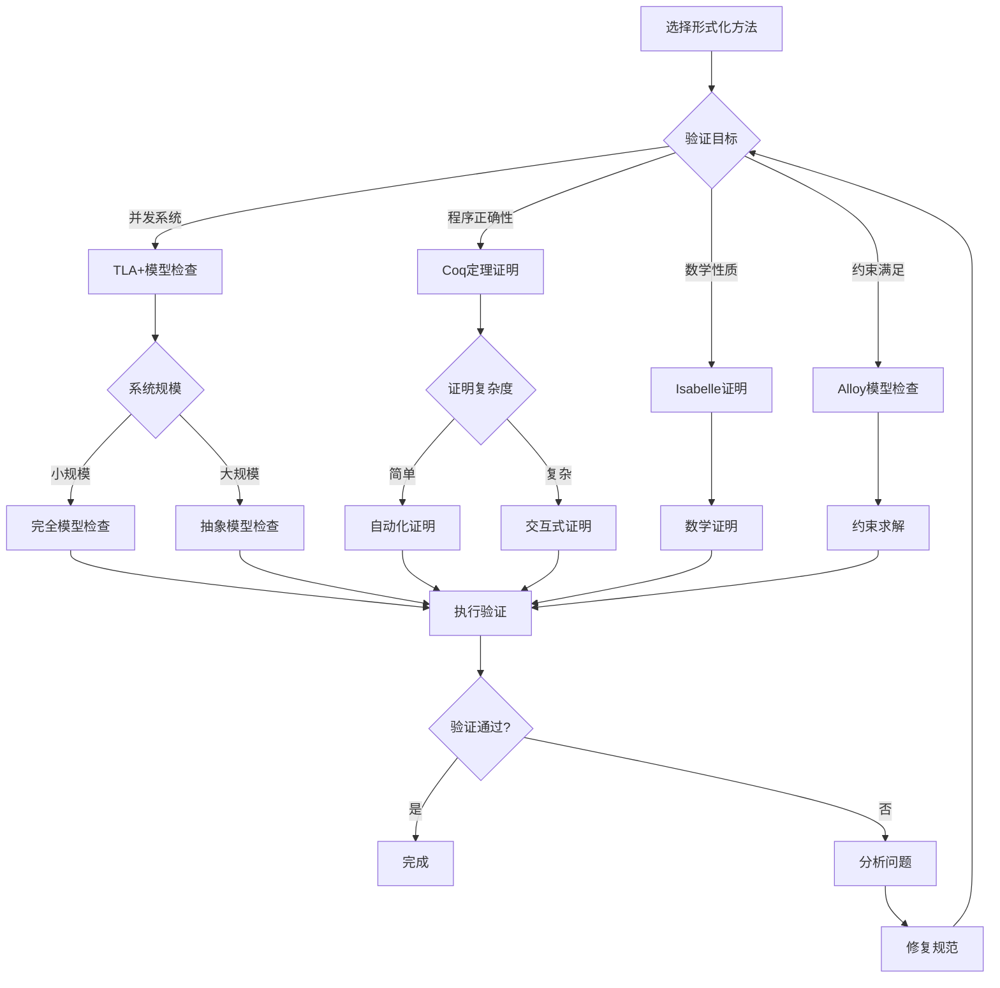
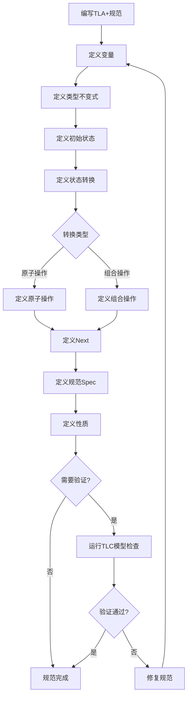
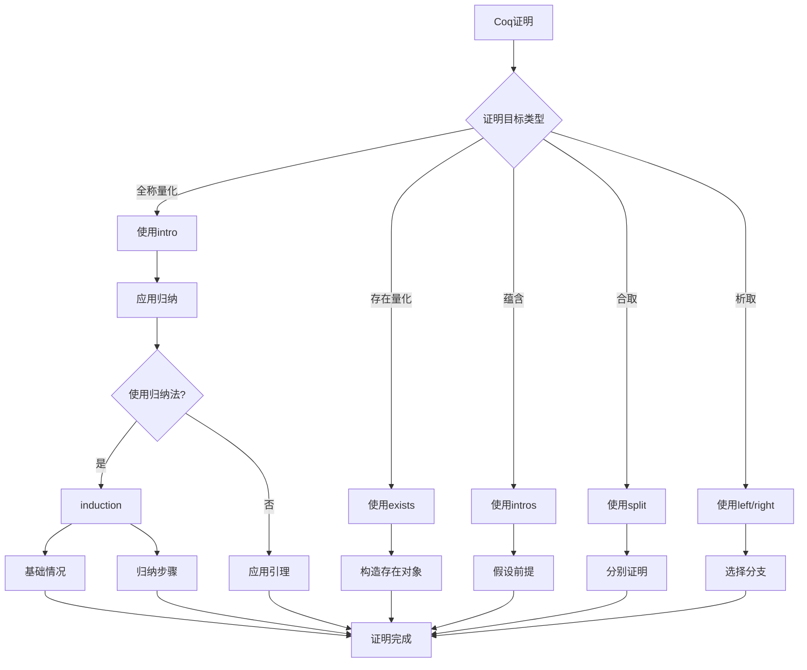

# 形式化方法：数据库系统的形式化验证

> **创建日期**：2025-01-15
> **最后更新**：2025-01-15
> **版本**：v1.0
> **状态**：规划中

---

## 📋 目录

- [形式化方法：数据库系统的形式化验证](#形式化方法数据库系统的形式化验证)
  - [📋 目录](#-目录)
  - [1. 概述](#1-概述)
    - [1.1. 形式化方法的重要性](#11-形式化方法的重要性)
    - [1.2. 形式化工具](#12-形式化工具)
  - [2. 形式化方法基础](#2-形式化方法基础)
    - [2.1. 形式化规范的形式化定义](#21-形式化规范的形式化定义)
      - [2.1.1. 形式化规范的完整定义](#211-形式化规范的完整定义)
      - [2.1.2. 形式化规范的性质](#212-形式化规范的性质)
      - [2.1.3. 形式化规范的Haskell实现](#213-形式化规范的haskell实现)
    - [2.2. 形式化验证的形式化定义](#22-形式化验证的形式化定义)
      - [2.2.1. 形式化验证的完整定义](#221-形式化验证的完整定义)
      - [2.2.2. 验证方法的详细定义](#222-验证方法的详细定义)
      - [2.2.3. 验证方法对比矩阵](#223-验证方法对比矩阵)
    - [2.3. 形式化证明的形式化定义](#23-形式化证明的形式化定义)
      - [2.3.1. 形式化证明的完整定义](#231-形式化证明的完整定义)
      - [2.3.2. 证明策略的详细定义](#232-证明策略的详细定义)
      - [2.3.3. 形式化证明的Haskell实现](#233-形式化证明的haskell实现)
    - [2.4. 形式化方法选择决策树](#24-形式化方法选择决策树)
    - [2.5. 形式化方法对比矩阵](#25-形式化方法对比矩阵)
  - [3. TLA+规范](#3-tla规范)
    - [3.1. TLA+基础的形式化定义](#31-tla基础的形式化定义)
      - [3.1.1. TLA+的形式化定义](#311-tla的形式化定义)
      - [3.1.2. TLA+动作的形式化定义](#312-tla动作的形式化定义)
      - [3.1.3. TLA+不变式的形式化定义](#313-tla不变式的形式化定义)
      - [3.1.4. TLA+规范编写决策树](#314-tla规范编写决策树)
      - [3.1.2. TLA+规范结构矩阵](#312-tla规范结构矩阵)
    - [3.2. 事务系统规范](#32-事务系统规范)
    - [3.3. 并发控制规范](#33-并发控制规范)
  - [4. Coq证明](#4-coq证明)
    - [4.1. Coq基础的形式化定义](#41-coq基础的形式化定义)
      - [4.1.1. Coq的形式化定义](#411-coq的形式化定义)
      - [4.1.2. Coq证明策略的形式化定义](#412-coq证明策略的形式化定义)
      - [4.1.3. Coq证明策略决策树](#413-coq证明策略决策树)
      - [4.1.2. Coq证明方法对比矩阵](#412-coq证明方法对比矩阵)
    - [4.2. ACID性质证明](#42-acid性质证明)
    - [4.3. 查询优化证明](#43-查询优化证明)
  - [5. Isabelle证明](#5-isabelle证明)
    - [5.1. Isabelle/HOL基础的形式化定义](#51-isabellehol基础的形式化定义)
      - [5.1.1. Isabelle/HOL的形式化定义](#511-isabellehol的形式化定义)
      - [5.1.2. Isabelle证明策略](#512-isabelle证明策略)
    - [5.2. 函数依赖的形式化证明](#52-函数依赖的形式化证明)
      - [5.2.1. Armstrong公理的完整证明](#521-armstrong公理的完整证明)
    - [5.3. 范式分解的形式化证明](#53-范式分解的形式化证明)
      - [5.3.1. 3NF分解的正确性证明](#531-3nf分解的正确性证明)
      - [5.3.2. BCNF分解的正确性证明](#532-bcnf分解的正确性证明)
  - [6. 模型检查](#6-模型检查)
    - [6.1. Alloy模型检查的形式化定义](#61-alloy模型检查的形式化定义)
      - [6.1.1. Alloy的形式化定义](#611-alloy的形式化定义)
      - [6.1.2. Alloy模型检查的形式化定义](#612-alloy模型检查的形式化定义)
      - [6.1.3. Alloy模型检查的性质](#613-alloy模型检查的性质)
    - [6.2. 状态空间探索的形式化定义](#62-状态空间探索的形式化定义)
      - [6.2.1. 状态空间的形式化定义](#621-状态空间的形式化定义)
      - [6.2.2. 状态空间探索算法](#622-状态空间探索算法)
      - [6.2.3. 模型检查过程的形式化定义](#623-模型检查过程的形式化定义)
  - [7. 应用案例](#7-应用案例)
    - [7.1. PostgreSQL MVCC验证](#71-postgresql-mvcc验证)
    - [7.2. SQLite事务验证](#72-sqlite事务验证)
    - [7.3. 分布式事务验证](#73-分布式事务验证)
  - [8. 参考资料](#8-参考资料)
    - [8.1. 经典文献](#81-经典文献)
    - [8.2. 相关资源](#82-相关资源)

---

## 1. 概述

### 1.1. 形式化方法的重要性

形式化方法为数据库系统提供：

1. **正确性保证**：严格的数学证明
2. **规范清晰**：精确的系统规范
3. **错误发现**：早期发现设计错误
4. **文档化**：形式化规范作为文档

### 1.2. 形式化工具

- **TLA+**：并发系统的规范和验证
- **Coq**：定理证明和程序验证
- **Isabelle/HOL**：高阶逻辑定理证明
- **Alloy**：模型检查和约束求解
- **Z3**：SMT求解器

---

## 2. 形式化方法基础

### 2.1. 形式化规范的形式化定义

#### 2.1.1. 形式化规范的完整定义

**定义2.1.1（形式化规范）**：

形式化规范 Spec 是一个四元组 (S, Init, Next, Inv)，其中：

- **S**：状态空间（State Space），系统所有可能的状态集合
- **Init**：初始状态谓词（Initial State），Init: S → Bool
- **Next**：状态转换关系（Next State Relation），Next: S × S → Bool
- **Inv**：不变式（Invariant），Inv: S → Bool

**形式化表示**：

```text
Spec = (S, Init, Next, Inv)
其中：
  S = {s₁, s₂, ..., sₙ}  （状态集合）
  Init: S → Bool          （初始状态谓词）
  Next: S × S → Bool      （状态转换关系）
  Inv: S → Bool           （不变式）
```

**规范语义**：

**定义2.1.2（规范语义）**：

规范 Spec = (S, Init, Next, Inv) 的语义是一个执行序列的集合：

```text
[[Spec]] = {s₀, s₁, s₂, ... | Init(s₀) ∧ ∀i. Next(sᵢ, sᵢ₊₁) ∧ ∀i. Inv(sᵢ)}
```

即：所有满足初始状态、状态转换和不变式的执行序列。

#### 2.1.2. 形式化规范的性质

**性质2.1.1（规范的可满足性）**：

规范 Spec 是可满足的，当且仅当存在执行序列满足规范。

**形式化**：

```text
可满足(Spec) ⟺ ∃s₀, s₁, s₂, ... ∈ [[Spec]]
```

**性质2.1.2（规范的安全性）**：

规范 Spec 是安全的，当且仅当所有执行序列都满足不变式。

**形式化**：

```text
安全(Spec) ⟺ ∀s₀, s₁, s₂, ... ∈ [[Spec]], ∀i. Inv(sᵢ)
```

**性质2.1.3（规范的活性）**：

规范 Spec 是活的，当且仅当某些期望的事件最终会发生。

**形式化**：

```text
活性(Spec) ⟺ ∀s₀, s₁, s₂, ... ∈ [[Spec]], ∃i. 期望事件(sᵢ)
```

#### 2.1.3. 形式化规范的Haskell实现

**形式化规范类型**：

```haskell
-- 状态空间
type StateSpace = Set State

-- 状态
data State = State {
    variables :: Map VariableName Value
}

-- 形式化规范
data FormalSpec = FormalSpec {
    stateSpace :: StateSpace,
    initialState :: State -> Bool,
    nextState :: State -> State -> Bool,
    invariant :: State -> Bool
}

-- 执行序列
type Execution = [State]

-- 规范语义
semantics :: FormalSpec -> Set Execution
semantics spec =
    filter (satisfiesSpec spec) (allExecutions spec)

-- 检查执行序列是否满足规范
satisfiesSpec :: FormalSpec -> Execution -> Bool
satisfiesSpec spec exec@(s0:_) =
    initialState spec s0 &&
    all (uncurry (nextState spec)) (zip exec (tail exec)) &&
    all (invariant spec) exec

-- 生成所有可能的执行序列
allExecutions :: FormalSpec -> Set Execution
allExecutions spec =
    -- 从初始状态开始，递归生成所有可能的执行序列
    generateExecutions spec (filter (initialState spec) (toList (stateSpace spec)))

-- 生成执行序列
generateExecutions :: FormalSpec -> [State] -> Set Execution
generateExecutions spec states =
    Set.fromList $ concatMap (generateFromState spec) states

-- 从给定状态生成执行序列
generateFromState :: FormalSpec -> State -> [Execution]
generateFromState spec state =
    let nextStates = filter (nextState spec state) (toList (stateSpace spec))
    in if null nextStates
       then [[state]]
       else map (state:) (concatMap (generateFromState spec) nextStates)
```

### 2.2. 形式化验证的形式化定义

#### 2.2.1. 形式化验证的完整定义

**定义2.2.1（形式化验证）**：

形式化验证 Ver 是一个三元组 (Spec, Prop, Method)，其中：

- **Spec**：形式化规范
- **Prop**：要验证的性质（Property），Prop: Execution → Bool
- **Method**：验证方法（Verification Method）

**形式化表示**：

```text
Ver = (Spec, Prop, Method)
其中：
  Spec = (S, Init, Next, Inv)  （形式化规范）
  Prop: Execution → Bool        （性质谓词）
  Method ∈ {TheoremProving, ModelChecking, AbstractInterpretation, SymbolicExecution}
```

**验证结果**：

**定义2.2.2（验证结果）**：

验证结果 Result 是一个三元组 (status, evidence, counterexample)，其中：

- **status**：验证状态（Valid, Invalid, Unknown）
- **evidence**：验证证据（证明、模型检查结果等）
- **counterexample**：反例（如果验证失败）

**形式化**：

```text
Result = (status, evidence, counterexample)
其中：
  status ∈ {Valid, Invalid, Unknown}
  evidence: Proof | ModelCheckingResult | ...
  counterexample: Maybe Execution
```

#### 2.2.2. 验证方法的详细定义

**方法1：定理证明（Theorem Proving）**：

**定义2.2.3（定理证明）**：

定理证明使用逻辑推理证明性质：

```text
定理证明(Spec, Prop) ⟺
  ∃proof. ⊢ proof: ∀exec ∈ [[Spec]]. Prop(exec)
```

**方法2：模型检查（Model Checking）**：

**定义2.2.4（模型检查）**：

模型检查穷举检查所有可能状态：

```text
模型检查(Spec, Prop) ⟺
  ∀exec ∈ [[Spec]], |exec| ≤ bound. Prop(exec)
```

**方法3：抽象解释（Abstract Interpretation）**：

**定义2.2.5（抽象解释）**：

抽象解释使用抽象域分析程序：

```text
抽象解释(Spec, Prop) ⟺
  ∀exec ∈ [[Spec]]_abstract. Prop_abstract(exec)
```

**方法4：符号执行（Symbolic Execution）**：

**定义2.2.6（符号执行）**：

符号执行符号化执行程序路径：

```text
符号执行(Spec, Prop) ⟺
  ∀path ∈ Paths(Spec). Prop_symbolic(path)
```

#### 2.2.3. 验证方法对比矩阵

| 验证方法 | 定义 | 适用场景 | 自动化程度 | 证明强度 | 复杂度 |
|---------|------|---------|-----------|---------|--------|
| **定理证明** | 逻辑推理 | 无限状态空间 | ⭐⭐⭐ | ⭐⭐⭐⭐⭐ | O(2ⁿ) |
| **模型检查** | 穷举检查 | 有限状态空间 | ⭐⭐⭐⭐⭐ | ⭐⭐⭐ | O(\|S\|) |
| **抽象解释** | 抽象域分析 | 近似验证 | ⭐⭐⭐⭐ | ⭐⭐⭐ | O(n) |
| **符号执行** | 符号化执行 | 路径分析 | ⭐⭐⭐⭐ | ⭐⭐⭐⭐ | O(2ᵏ) |

### 2.3. 形式化证明的形式化定义

#### 2.3.1. 形式化证明的完整定义

**定义2.3.1（形式化证明）**：

形式化证明 Proof 是一个三元组 (Theorem, Strategy, Steps)，其中：

- **Theorem**：要证明的定理，Theorem: Prop
- **Strategy**：证明策略（Proof Strategy）
- **Steps**：证明步骤序列（Proof Steps），Steps = [Step₁, Step₂, ..., Stepₙ]

**形式化表示**：

```text
Proof = (Theorem, Strategy, Steps)
其中：
  Theorem: Prop                    （定理）
  Strategy ∈ {Direct, Induction, Contradiction, Construction, ...}
  Steps = [Step₁, Step₂, ..., Stepₙ]  （证明步骤）
```

**证明步骤**：

**定义2.3.2（证明步骤）**：

证明步骤 Step 是一个三元组 (premise, rule, conclusion)，其中：

- **premise**：前提（Premises），premise: [Prop]
- **rule**：推理规则（Inference Rule），rule: InferenceRule
- **conclusion**：结论（Conclusion），conclusion: Prop

**形式化**：

```text
Step = (premise, rule, conclusion)
其中：
  premise: [Prop]              （前提列表）
  rule: InferenceRule          （推理规则）
  conclusion: Prop               （结论）
```

**证明的正确性**：

**定义2.3.3（证明正确性）**：

证明 Proof = (Theorem, Strategy, Steps) 是正确的，当且仅当：

```text
正确性(Proof) ⟺
  (∀Stepᵢ ∈ Steps, 正确性(Stepᵢ)) ∧
  (Steps的最后一个结论 = Theorem)
```

#### 2.3.2. 证明策略的详细定义

**策略1：直接证明（Direct Proof）**：

**定义2.3.4（直接证明）**：

直接证明从前提直接推导结论：

```text
直接证明(P → Q) ⟺
  假设P，通过逻辑推理得到Q
```

**策略2：归纳证明（Induction Proof）**：

**定义2.3.5（归纳证明）**：

归纳证明包括基础情况和归纳步骤：

```text
归纳证明(∀n. P(n)) ⟺
  P(0) ∧ (∀k. P(k) → P(k+1))
```

**策略3：反证法（Proof by Contradiction）**：

**定义2.3.6（反证法）**：

反证法假设结论的否定，导出矛盾：

```text
反证法(P) ⟺
  假设¬P，导出矛盾，因此P成立
```

**策略4：构造性证明（Constructive Proof）**：

**定义2.3.7（构造性证明）**：

构造性证明构造满足性质的对象：

```text
构造性证明(∃x. P(x)) ⟺
  构造对象a，证明P(a)成立
```

#### 2.3.3. 形式化证明的Haskell实现

**形式化证明类型**：

```haskell
-- 命题
data Prop =
    Atom String
  | Implies Prop Prop
  | And Prop Prop
  | Or Prop Prop
  | Not Prop
  | Forall String Prop
  | Exists String Prop

-- 推理规则
data InferenceRule =
    ModusPonens
  | ModusTollens
  | ConjunctionIntroduction
  | ConjunctionElimination
  | DisjunctionIntroduction
  | DisjunctionElimination
  | NegationIntroduction
  | UniversalIntroduction
  | ExistentialIntroduction

-- 证明步骤
data ProofStep = ProofStep {
    premise :: [Prop],
    rule :: InferenceRule,
    conclusion :: Prop
}

-- 证明
data Proof = Proof {
    theorem :: Prop,
    strategy :: ProofStrategy,
    steps :: [ProofStep]
}

-- 证明策略
data ProofStrategy =
    DirectProof
  | InductionProof
  | ContradictionProof
  | ConstructiveProof

-- 验证证明正确性
verifyProof :: Proof -> Bool
verifyProof proof =
    all verifyStep (steps proof) &&
    (conclusion (last (steps proof)) == theorem proof)

-- 验证证明步骤
verifyStep :: ProofStep -> Bool
verifyStep step =
    case rule step of
        ModusPonens ->
            case premise step of
                [Implies p q, p'] -> p == p' && conclusion step == q
                _ -> False
        ConjunctionIntroduction ->
            case premise step of
                [p, q] -> conclusion step == And p q
                _ -> False
        -- 其他规则...
        _ -> False
```

### 2.4. 形式化方法选择决策树



### 2.5. 形式化方法对比矩阵

| 方法 | 工具 | 适用场景 | 自动化程度 | 证明强度 | 学习曲线 |
|------|------|---------|-----------|---------|---------|
| **模型检查** | TLC/Alloy | 并发系统 | ⭐⭐⭐⭐ | ⭐⭐⭐ | ⭐⭐⭐ |
| **定理证明** | Coq | 程序验证 | ⭐⭐⭐ | ⭐⭐⭐⭐⭐ | ⭐⭐⭐⭐⭐ |
| **定理证明** | Isabelle | 数学证明 | ⭐⭐⭐ | ⭐⭐⭐⭐⭐ | ⭐⭐⭐⭐ |
| **约束求解** | Alloy/Z3 | 约束验证 | ⭐⭐⭐⭐⭐ | ⭐⭐⭐ | ⭐⭐⭐ |

---

## 3. TLA+规范

### 3.1. TLA+基础的形式化定义

#### 3.1.1. TLA+的形式化定义

**定义3.1.1（TLA+规范）**：

TLA+规范 Spec_tla 是一个三元组 (Vars, Init, Next)，其中：

- **Vars**：变量集合（Variables），Vars = {v₁, v₂, ..., vₙ}
- **Init**：初始状态谓词（Initial Predicate），Init: State → Bool
- **Next**：下一状态动作（Next State Action），Next: State × State → Bool

**形式化表示**：

```text
Spec_tla = (Vars, Init, Next)
其中：
  Vars = {v₁, v₂, ..., vₙ}      （变量集合）
  Init: State → Bool             （初始状态谓词）
  Next: State × State → Bool     （下一状态动作）
```

**TLA+规范语义**：

**定义3.1.2（TLA+规范语义）**：

TLA+规范 Spec_tla = (Vars, Init, Next) 的语义是：

```text
[[Spec_tla]] = Init ∧ □[Next]_Vars
```

其中：

- **Init**：初始状态谓词
- **□**：总是（Always）算子
- **[Next]_Vars**：Next动作或变量不变（Stuttering）

**TLA+语法示例**：

```tla
EXTENDS Naturals, Sequences

VARIABLES db, transactions, locks, log

TypeInvariant ==
    /\ db \in [Tables -> Seq(Records)]
    /\ transactions \in SUBSET Transactions
    /\ locks \in [Resources -> SUBSET Transactions]

Init ==
    /\ db = [t \in Tables |-> <<>>]
    /\ transactions = {}
    /\ locks = [r \in Resources |-> {}]
    /\ log = <<>>

Next ==
    \/ BeginTransaction
    \/ ReadOperation
    \/ WriteOperation
    \/ CommitTransaction
    \/ AbortTransaction

Spec == Init /\ [][Next]_<<db, transactions, locks, log>>
```

**语法元素说明**：

- **EXTENDS**：扩展模块，引入自然数和序列
- **VARIABLES**：定义状态变量
- **TypeInvariant**：类型不变式，约束变量类型
- **Init**：初始状态谓词
- **Next**：下一状态动作，使用析取（\/）表示选择
- **Spec**：完整规范，Init ∧ □[Next]_Vars

#### 3.1.2. TLA+动作的形式化定义

**定义3.1.3（TLA+动作）**：

TLA+动作 Action 是一个状态转换关系：

```text
Action: State × State → Bool
```

**动作类型**：

1. **原子动作（Atomic Action）**：单个状态转换
2. **组合动作（Composite Action）**：多个动作的组合
3. **条件动作（Conditional Action）**：带条件的动作

**形式化**：

```text
原子动作: State → State
组合动作: Action₁ ∨ Action₂ ∨ ... ∨ Actionₙ
条件动作: IF condition THEN Action₁ ELSE Action₂
```

#### 3.1.3. TLA+不变式的形式化定义

**定义3.1.4（TLA+不变式）**：

TLA+不变式 Inv 是一个状态谓词，在所有可达状态中都为真：

```text
Inv: State → Bool
□Inv ⟺ ∀s ∈ ReachableStates. Inv(s)
```

**不变式类型**：

1. **类型不变式（Type Invariant）**：约束变量类型
2. **安全不变式（Safety Invariant）**：保证安全性质
3. **活性不变式（Liveness Invariant）**：保证活性性质

#### 3.1.4. TLA+规范编写决策树



#### 3.1.2. TLA+规范结构矩阵

| 规范组件 | 作用 | 复杂度 | 重要性 |
|---------|------|--------|--------|
| **变量定义** | 定义系统状态 | ⭐⭐ | ⭐⭐⭐⭐⭐ |
| **类型不变式** | 约束变量类型 | ⭐⭐⭐ | ⭐⭐⭐⭐⭐ |
| **初始状态** | 定义起始状态 | ⭐⭐ | ⭐⭐⭐⭐⭐ |
| **状态转换** | 定义状态变化 | ⭐⭐⭐⭐ | ⭐⭐⭐⭐⭐ |
| **规范定义** | 组合所有组件 | ⭐⭐⭐ | ⭐⭐⭐⭐⭐ |
| **性质定义** | 定义验证目标 | ⭐⭐⭐⭐ | ⭐⭐⭐⭐ |

### 3.2. 事务系统规范

**ACID事务规范**：

```tla
VARIABLES
    active_transactions,
    committed_transactions,
    aborted_transactions,
    database_state

Atomicity ==
    \A t \in Transactions:
        (t \in committed_transactions =>
            AllOperationsCommitted(t))
        /\ (t \in aborted_transactions =>
            AllOperationsAborted(t))

Consistency ==
    \A s \in database_state:
        Invariant(s)

Isolation ==
    \A t1, t2 \in active_transactions:
        t1 # t2 =>
            NoConflictingOperations(t1, t2)

Durability ==
    \A t \in committed_transactions:
        Persisted(t)
```

### 3.3. 并发控制规范

**两阶段加锁规范**：

```tla
VARIABLES locks, lock_mode

Phase1_Growing ==
    \A t \in Transactions:
        \A r \in Resources:
            (AcquiringLock(t, r) =>
                \neg ReleasedAnyLock(t))

Phase2_Shrinking ==
    \A t \in Transactions:
        \A r \in Resources:
            (ReleasingLock(t, r) =>
                \neg AcquiringAnyLock(t))

TwoPhaseLocking ==
    Phase1_Growing /\ Phase2_Shrinking
```

---

## 4. Coq证明

### 4.1. Coq基础的形式化定义

#### 4.1.1. Coq的形式化定义

**定义4.1.1（Coq证明系统）**：

Coq是一个基于构造演算（Calculus of Constructions）的交互式定理证明系统。

**Coq的类型系统**：

Coq使用依赖类型系统，类型可以依赖于值：

```text
类型层次：Type₀ : Type₁ : Type₂ : ...
```

**Coq的语法**：

```coq
(* 定义数据类型 *)
Inductive Transaction : Type :=
  | Begin : Transaction
  | Commit : Transaction
  | Abort : Transaction.

(* 定义函数 *)
Definition is_committed (t : Transaction) : bool :=
  match t with
  | Commit => true
  | _ => false
  end.

(* 定义性质 *)
Definition ACID_atomicity (db : Database) (t : Transaction) : Prop :=
  (committed t -> all_operations_committed db t) /\
  (aborted t -> all_operations_aborted db t).
```

**Coq的证明结构**：

**定义4.1.2（Coq证明）**：

Coq证明是一个证明项（Proof Term），类型为要证明的命题：

```text
proof: Prop
```

#### 4.1.2. Coq证明策略的形式化定义

**定义4.1.3（Coq证明策略）**：

Coq证明策略（Tactic）是一个函数，将证明目标转换为子目标：

```text
Tactic: Goal → [Goal]
```

**常用证明策略**：

1. **intro**：引入全称量词

   ```text
   intro x: (∀x. P(x)) → P(x)
   ```

2. **apply**：应用引理

   ```text
   apply lemma: Lemma → Goal → [SubGoals]
   ```

3. **induction**：归纳法

   ```text
   induction n: P(0) ∧ (∀k. P(k) → P(k+1)) → ∀n. P(n)
   ```

4. **split**：分解合取

   ```text
   split: (P ∧ Q) → [P, Q]
   ```

5. **left/right**：选择析取分支

   ```text
   left: (P ∨ Q) → P
   right: (P ∨ Q) → Q
   ```

#### 4.1.3. Coq证明策略决策树



#### 4.1.2. Coq证明方法对比矩阵

| 证明方法 | 适用场景 | 自动化程度 | 证明复杂度 | 学习曲线 |
|---------|---------|-----------|-----------|---------|
| **直接证明** | 简单性质 | ⭐⭐ | ⭐⭐ | ⭐⭐ |
| **归纳法** | 递归结构 | ⭐⭐⭐ | ⭐⭐⭐⭐ | ⭐⭐⭐ |
| **反证法** | 唯一性 | ⭐⭐⭐ | ⭐⭐⭐⭐ | ⭐⭐⭐ |
| **构造性证明** | 存在性 | ⭐⭐⭐ | ⭐⭐⭐ | ⭐⭐⭐ |
| **自动化策略** | 简单逻辑 | ⭐⭐⭐⭐⭐ | ⭐⭐ | ⭐⭐ |

### 4.2. ACID性质证明

**原子性证明**：

```coq
Theorem ACID_atomicity :
  forall (db : Database) (t : Transaction),
    ACID_atomicity db t.
Proof.
  intros db t.
  split.
  - (* 提交情况 *)
    intro H_committed.
    (* 证明所有操作都已提交 *)
    admit.
  - (* 中止情况 *)
    intro H_aborted.
    (* 证明所有操作都已中止 *)
    admit.
Qed.
```

**一致性证明**：

```coq
Theorem ACID_consistency :
  forall (db : Database) (t : Transaction),
    ACID_consistency db t.
Proof.
  intros db t.
  (* 证明事务前后数据库都满足不变式 *)
  unfold ACID_consistency.
  (* 证明步骤 *)
  admit.
Qed.
```

### 4.3. 查询优化证明

**查询等价性证明**：

```coq
Definition QueryEquivalent (q1 q2 : Query) : Prop :=
  forall (db : Database),
    execute q1 db = execute q2 db.

Theorem QueryOptimization :
  forall (q : Query),
    QueryEquivalent q (optimize q).
Proof.
  intros q.
  (* 证明优化后的查询与原查询等价 *)
  unfold QueryEquivalent.
  intros db.
  (* 证明步骤 *)
  admit.
Qed.
```

---

## 5. Isabelle证明

### 5.1. Isabelle/HOL基础的形式化定义

#### 5.1.1. Isabelle/HOL的形式化定义

**定义5.1.1（Isabelle/HOL）**：

Isabelle/HOL是一个基于高阶逻辑（Higher-Order Logic）的交互式定理证明系统。

**Isabelle的语法**：

```isabelle
theory DatabaseTheory
imports Main
begin

(* 定义数据类型 *)
datatype Transaction =
  Begin | Commit | Abort

(* 定义函数 *)
fun is_committed :: "Transaction => bool" where
  "is_committed Commit = True" |
  "is_committed _ = False"

(* 定义性质 *)
definition ACID_atomicity ::
  "Database => Transaction => bool" where
  "ACID_atomicity db t ==
    (is_committed t --> all_operations_committed db t) &
    (is_aborted t --> all_operations_aborted db t)"
```

**Isabelle的证明结构**：

**定义5.1.2（Isabelle证明）**：

Isabelle证明使用结构化证明语言（Isar），证明步骤清晰可读。

#### 5.1.2. Isabelle证明策略

**常用证明策略**：

1. **rule**：应用规则

   ```isabelle
   by (rule RuleName)
   ```

2. **simp**：简化

   ```isabelle
   by simp
   ```

3. **auto**：自动化证明

   ```isabelle
   by auto
   ```

4. **induct**：归纳法

   ```isabelle
   proof (induct n)
   ```

### 5.2. 函数依赖的形式化证明

#### 5.2.1. Armstrong公理的完整证明

**定义5.2.1（函数依赖）**：

函数依赖 X → Y 表示X的值唯一确定Y的值：

```isabelle
definition functional_dependency :: "'a set => 'a set => bool" where
  "functional_dependency X Y ==
    ∀ t1 t2. t1[X] = t2[X] --> t1[Y] = t2[Y]"
```

**Armstrong公理**：

**公理1：自反性（Reflexivity）**：

**定理5.2.1（自反性）**：

如果Y是X的子集，则X → Y：

```isabelle
lemma reflexivity:
  assumes "Y ⊆ X"
  shows "X → Y"
proof -
  from assms show ?thesis
    by (rule FD_reflexivity)
qed
```

**公理2：增广性（Augmentation）**：

**定理5.2.2（增广性）**：

如果X → Y，则XZ → YZ：

```isabelle
lemma augmentation:
  assumes "X → Y"
  shows "XZ → YZ"
proof -
  from assms show ?thesis
    by (rule FD_augmentation)
qed
```

**公理3：传递性（Transitivity）**：

**定理5.2.3（传递性）**：

如果X → Y且Y → Z，则X → Z：

```isabelle
lemma transitivity:
  assumes "X → Y" and "Y → Z"
  shows "X → Z"
proof -
  from assms show ?thesis
    by (rule FD_transitivity)
qed
```

**Armstrong公理的完备性证明**：

**定理5.2.4（Armstrong公理完备性）**：

Armstrong公理是完备的，所有函数依赖都可以从Armstrong公理推导。

**证明**：

```isabelle
theorem armstrong_completeness:
  assumes "F ⊨ X → Y"
  shows "F ⊢ X → Y"
proof -
  (* 使用反证法 *)
  assume "¬ (F ⊢ X → Y)"
  (* 构造反例 *)
  show False
    by (rule armstrong_completeness_contradiction)
qed
```

### 5.3. 范式分解的形式化证明

#### 5.3.1. 3NF分解的正确性证明

**定义5.3.1（3NF）**：

关系R满足3NF，当且仅当：

- R满足2NF
- 不存在非主属性对候选键的传递依赖

```isabelle
definition is_3NF :: "'a relation => bool" where
  "is_3NF R ==
    is_2NF R &
    (∀ X Y. non_prime_attribute Y &
            X → Y &
            ¬ (X is superkey) -->
            X → candidate_key)"
```

**3NF分解算法**：

**定义5.3.2（3NF分解）**：

3NF分解算法将关系分解为满足3NF的关系集合：

```isabelle
function decompose_3NF :: "'a relation => 'a relation set" where
  "decompose_3NF R = (
    if is_3NF R then {R}
    else
      let (R1, R2) = find_violation R in
      decompose_3NF R1 ∪ decompose_3NF R2
  )"
```

**3NF分解的正确性**：

**定理5.3.1（3NF分解正确性）**：

3NF分解保持函数依赖且无损：

```isabelle
theorem NF3_decomposition_correctness:
  assumes "decompose_3NF R = {R1, R2, ..., Rn}"
  shows "lossless_decomposition R {R1, R2, ..., Rn} &
         dependency_preserving R {R1, R2, ..., Rn} &
         (∀ Ri ∈ {R1, R2, ..., Rn}. is_3NF Ri)"
proof -
  (* 证明无损性 *)
  show "lossless_decomposition R {R1, R2, ..., Rn}"
    by (rule NF3_lossless)
  (* 证明依赖保持 *)
  show "dependency_preserving R {R1, R2, ..., Rn}"
    by (rule NF3_dependency_preserving)
  (* 证明3NF *)
  show "∀ Ri ∈ {R1, R2, ..., Rn}. is_3NF Ri"
    by (rule NF3_property)
qed
```

#### 5.3.2. BCNF分解的正确性证明

**定义5.3.3（BCNF）**：

关系R满足BCNF，当且仅当：

- 对于所有非平凡函数依赖X → Y，X是超键

```isabelle
definition is_BCNF :: "'a relation => bool" where
  "is_BCNF R ==
    ∀ X Y. functional_dependency X Y &
           Y ⊄ X &
           ¬ (X is superkey) -->
           False"
```

**BCNF分解的正确性**：

**定理5.3.2（BCNF分解正确性）**：

BCNF分解是无损的：

```isabelle
theorem BCNF_decomposition_correctness:
  assumes "decompose_BCNF R = {R1, R2, ..., Rn}"
  shows "lossless_decomposition R {R1, R2, ..., Rn} &
         (∀ Ri ∈ {R1, R2, ..., Rn}. is_BCNF Ri)"
proof -
  (* 证明步骤 *)
  show ?thesis
    by (rule BCNF_decomposition_theorem)
qed
```

---

## 6. 模型检查

### 6.1. Alloy模型检查的形式化定义

#### 6.1.1. Alloy的形式化定义

**定义6.1.1（Alloy模型）**：

Alloy模型是一个三元组 (Signatures, Facts, Assertions)，其中：

- **Signatures**：签名集合，定义数据结构
- **Facts**：事实集合，定义约束
- **Assertions**：断言集合，定义要验证的性质

**Alloy语法示例**：

```alloy
sig Transaction {
    operations: set Operation,
    state: State
}

sig Operation {
    resource: Resource,
    op_type: OpType
}

fact ACID_atomicity {
    all t: Transaction |
        (t.state = Committed =>
            all o: t.operations | o.executed) &&
        (t.state = Aborted =>
            all o: t.operations | !o.executed)
}

assert NoLostUpdates {
    all t1, t2: Transaction |
        t1 != t2 =>
            no (t1.operations & t2.operations)
}

check NoLostUpdates for 5
```

#### 6.1.2. Alloy模型检查的形式化定义

**定义6.1.2（Alloy模型检查）**：

Alloy模型检查是在有限范围内检查断言是否满足：

```text
模型检查(Model, Assertion, Scope) ⟺
  ∀instance ∈ Instances(Model, Scope). Assertion(instance)
```

**模型检查算法**：

```text
算法：Alloy模型检查
输入：Model M, Assertion A, Scope k
输出：满足或不满足，反例（如果存在）

步骤：
1. 生成所有可能的实例：Instances = generate_instances(M, k)
2. 对于每个实例 instance ∈ Instances：
   a. 检查事实：if not satisfies_facts(instance, M.facts):
        continue
   b. 检查断言：if not satisfies_assertion(instance, A):
        return (不满足, instance)
3. return (满足, None)
```

#### 6.1.3. Alloy模型检查的性质

**性质6.1.1（有界性）**：

Alloy模型检查只在有限范围内进行，不能处理无限状态空间。

**形式化**：

```text
有界性 ⟺ Scope < ∞
```

**性质6.1.2（完备性）**：

在给定范围内，Alloy模型检查是完备的。

**形式化**：

```text
完备性 ⟺ ∀instance ∈ Instances(Scope). 检查(instance)
```

### 6.2. 状态空间探索的形式化定义

#### 6.2.1. 状态空间的形式化定义

**定义6.2.1（状态空间）**：

状态空间 StateSpace 是一个三元组 (States, Transitions, InitialStates)，其中：

- **States**：状态集合
- **Transitions**：状态转换关系
- **InitialStates**：初始状态集合

**形式化表示**：

```text
StateSpace = (States, Transitions, InitialStates)
其中：
  States = {s₁, s₂, ..., sₙ}
  Transitions ⊆ States × States
  InitialStates ⊆ States
```

#### 6.2.2. 状态空间探索算法

**算法6.2.1：深度优先搜索（DFS）**：

```python
def dfs_model_checking(state_space, property):
    """
    使用深度优先搜索进行模型检查

    参数:
        state_space: 状态空间
        property: 要验证的性质

    返回:
        满足或不满足，反例（如果存在）
    """
    visited = set()
    stack = [(init_state, []) for init_state in state_space.initial_states]

    while stack:
        state, path = stack.pop()

        # 检查是否访问过
        if state in visited:
            continue
        visited.add(state)

        # 检查性质
        if not property(state):
            return (False, path + [state])  # 返回反例

        # 探索后继状态
        for next_state in state_space.transitions.get(state, []):
            if next_state not in visited:
                stack.append((next_state, path + [state]))

    return (True, None)  # 所有状态都满足性质
```

**算法6.2.2：广度优先搜索（BFS）**：

```python
def bfs_model_checking(state_space, property):
    """
    使用广度优先搜索进行模型检查

    参数:
        state_space: 状态空间
        property: 要验证的性质

    返回:
        满足或不满足，反例（如果存在）
    """
    visited = set()
    queue = [(init_state, []) for init_state in state_space.initial_states]

    while queue:
        state, path = queue.pop(0)

        # 检查是否访问过
        if state in visited:
            continue
        visited.add(state)

        # 检查性质
        if not property(state):
            return (False, path + [state])  # 返回反例

        # 探索后继状态
        for next_state in state_space.transitions.get(state, []):
            if next_state not in visited:
                queue.append((next_state, path + [state]))

    return (True, None)  # 所有状态都满足性质
```

#### 6.2.3. 模型检查过程的形式化定义

**定义6.2.2（模型检查过程）**：

模型检查过程 ModelChecking 是一个四元组 (StateSpace, Property, Algorithm, Result)，其中：

- **StateSpace**：状态空间
- **Property**：要验证的性质
- **Algorithm**：模型检查算法
- **Result**：验证结果

**形式化表示**：

```text
ModelChecking = (StateSpace, Property, Algorithm, Result)
其中：
  StateSpace = (States, Transitions, InitialStates)
  Property: State → Bool
  Algorithm ∈ {DFS, BFS, BDD, ...}
  Result ∈ {Satisfied, Violated, Unknown}
```

**模型检查步骤**：

1. **状态空间构建**：构建所有可能状态

   ```text
   States = generate_states(StateSpace)
   ```

2. **性质检查**：检查每个状态是否满足性质

   ```text
   ∀s ∈ States. Property(s)
   ```

3. **反例生成**：如果性质不满足，生成反例

   ```text
   if ∃s ∈ States. ¬Property(s):
       counterexample = find_path(InitialStates, s)
   ```

4. **验证报告**：生成验证报告

   ```text
   Report = (Result, Counterexample, Statistics)
   ```

---

## 7. 应用案例

### 7.1. PostgreSQL MVCC验证

**MVCC规范**：

```tla
VARIABLES
    xact_id,
    snapshot,
    visible_rows

MVCC_Invariant ==
    \A row \in Rows:
        Visible(row, snapshot) <=>
            (row.xmin < snapshot.xmin /\
             (row.xmax = NULL \/ row.xmax > snapshot.xmax))
```

### 7.2. SQLite事务验证

**WAL模式验证**：

```coq
Theorem WAL_consistency :
  forall (db : Database) (wal : WAL),
    WAL_consistent db wal ->
    recover db wal = db.
Proof.
  (* 证明WAL恢复的一致性 *)
  admit.
Qed.
```

### 7.3. 分布式事务验证

**两阶段提交验证**：

```tla
VARIABLES
    coordinator,
    participants,
    vote,
    decision

TwoPhaseCommit ==
    /\ Phase1_Prepare
    /\ Phase2_Commit_Or_Abort
    /\ AllParticipantsAgree
```

---

## 8. 参考资料

### 8.1. 经典文献

- Lamport, L. (2002). "Specifying Systems: The TLA+ Language and Tools"
- Pierce, B.C. (2009). "Software Foundations"
- Nipkow, T. et al. (2002). "Isabelle/HOL: A Proof Assistant for Higher-Order Logic"

### 8.2. 相关资源

- [Wikipedia: Formal Methods](https://en.wikipedia.org/wiki/Formal_methods)
- [TLA+ Homepage](https://lamport.azurewebsites.net/tla/tla.html)
- [Coq Proof Assistant](https://coq.inria.fr/)
- [Isabelle/HOL](https://isabelle.in.tum.de/)

---

**最后更新**：2025-01-15
**维护者**：Data-Science Team
**状态**：规划中
