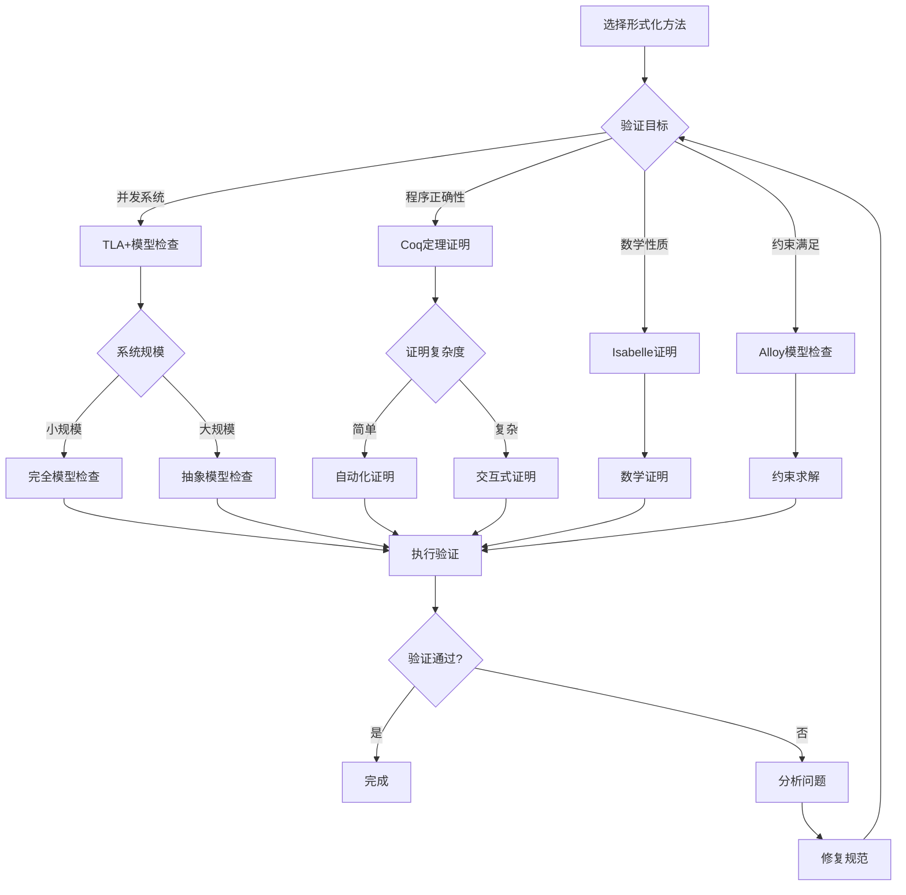
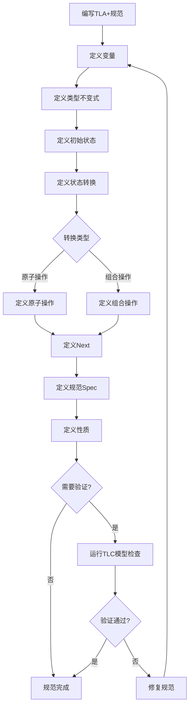
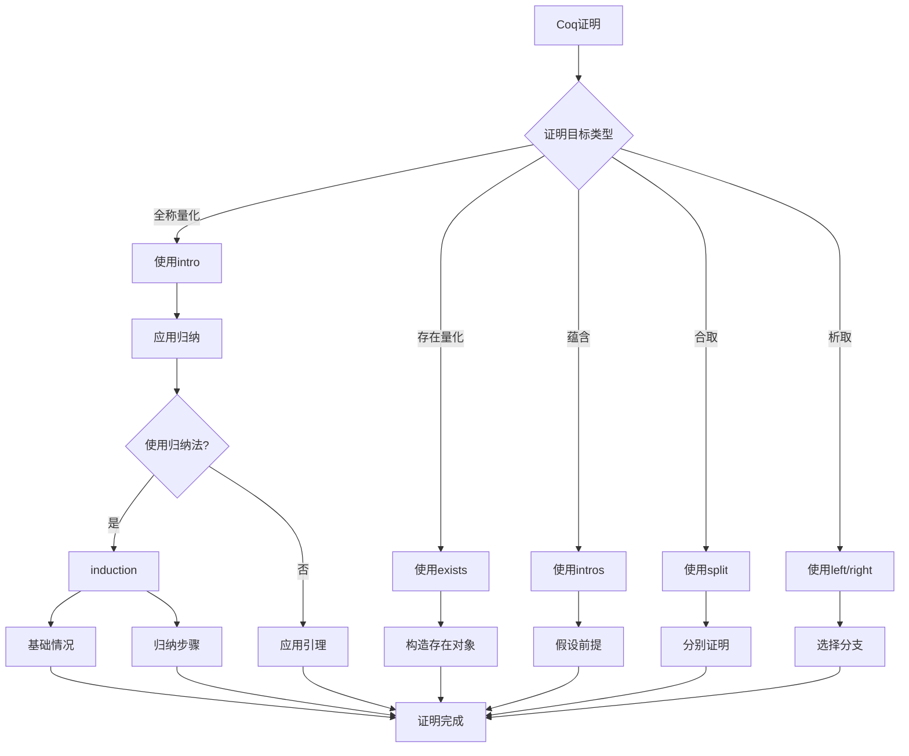

# 形式化方法：数据库系统的形式化验证

> **创建日期**：2025-01-15
> **最后更新**：2025-01-15
> **版本**：v1.0
> **状态**：规划中

---

## 📋 目录

- [形式化方法：数据库系统的形式化验证](#形式化方法数据库系统的形式化验证)
  - [📋 目录](#-目录)
  - [1. 概述](#1-概述)
    - [1.1. 形式化方法的重要性](#11-形式化方法的重要性)
    - [1.2. 形式化工具](#12-形式化工具)
  - [2. 形式化方法基础](#2-形式化方法基础)
    - [2.1. 形式化规范](#21-形式化规范)
    - [2.2. 形式化验证](#22-形式化验证)
    - [2.3. 形式化证明](#23-形式化证明)
    - [2.4. 形式化方法选择决策树](#24-形式化方法选择决策树)
    - [2.5. 形式化方法对比矩阵](#25-形式化方法对比矩阵)
  - [3. TLA+规范](#3-tla规范)
    - [3.1. TLA+基础](#31-tla基础)
      - [3.1.1. TLA+规范编写决策树](#311-tla规范编写决策树)
      - [3.1.2. TLA+规范结构矩阵](#312-tla规范结构矩阵)
    - [3.2. 事务系统规范](#32-事务系统规范)
    - [3.3. 并发控制规范](#33-并发控制规范)
  - [4. Coq证明](#4-coq证明)
    - [4.1. Coq基础](#41-coq基础)
      - [4.1.1. Coq证明策略决策树](#411-coq证明策略决策树)
      - [4.1.2. Coq证明方法对比矩阵](#412-coq证明方法对比矩阵)
    - [4.2. ACID性质证明](#42-acid性质证明)
    - [4.3. 查询优化证明](#43-查询优化证明)
  - [5. Isabelle证明](#5-isabelle证明)
    - [5.1. Isabelle/HOL基础](#51-isabellehol基础)
    - [5.2. 函数依赖证明](#52-函数依赖证明)
    - [5.3. 范式分解证明](#53-范式分解证明)
  - [6. 模型检查](#6-模型检查)
    - [6.1. Alloy模型检查](#61-alloy模型检查)
    - [6.2. 状态空间探索](#62-状态空间探索)
  - [7. 应用案例](#7-应用案例)
    - [7.1. PostgreSQL MVCC验证](#71-postgresql-mvcc验证)
    - [7.2. SQLite事务验证](#72-sqlite事务验证)
    - [7.3. 分布式事务验证](#73-分布式事务验证)
  - [8. 参考资料](#8-参考资料)
    - [8.1. 经典文献](#81-经典文献)
    - [8.2. 相关资源](#82-相关资源)

---

## 1. 概述

### 1.1. 形式化方法的重要性

形式化方法为数据库系统提供：

1. **正确性保证**：严格的数学证明
2. **规范清晰**：精确的系统规范
3. **错误发现**：早期发现设计错误
4. **文档化**：形式化规范作为文档

### 1.2. 形式化工具

- **TLA+**：并发系统的规范和验证
- **Coq**：定理证明和程序验证
- **Isabelle/HOL**：高阶逻辑定理证明
- **Alloy**：模型检查和约束求解
- **Z3**：SMT求解器

---

## 2. 形式化方法基础

### 2.1. 形式化规范

**规范定义**：

形式化规范是用数学语言精确描述系统行为的文档。

**规范组成**：

1. **状态空间**：系统可能的状态
2. **初始状态**：系统的初始条件
3. **状态转换**：状态如何变化
4. **不变式**：系统必须满足的性质

### 2.2. 形式化验证

**验证方法**：

- **定理证明**：使用逻辑推理证明性质
- **模型检查**：穷举检查所有可能状态
- **抽象解释**：使用抽象域分析程序
- **符号执行**：符号化执行程序路径

### 2.3. 形式化证明

**证明结构**：

1. **定理陈述**：要证明的性质
2. **证明策略**：证明方法
3. **证明步骤**：详细的推理步骤
4. **结论**：证明结果

### 2.4. 形式化方法选择决策树



### 2.5. 形式化方法对比矩阵

| 方法 | 工具 | 适用场景 | 自动化程度 | 证明强度 | 学习曲线 |
|------|------|---------|-----------|---------|---------|
| **模型检查** | TLC/Alloy | 并发系统 | ⭐⭐⭐⭐ | ⭐⭐⭐ | ⭐⭐⭐ |
| **定理证明** | Coq | 程序验证 | ⭐⭐⭐ | ⭐⭐⭐⭐⭐ | ⭐⭐⭐⭐⭐ |
| **定理证明** | Isabelle | 数学证明 | ⭐⭐⭐ | ⭐⭐⭐⭐⭐ | ⭐⭐⭐⭐ |
| **约束求解** | Alloy/Z3 | 约束验证 | ⭐⭐⭐⭐⭐ | ⭐⭐⭐ | ⭐⭐⭐ |

---

## 3. TLA+规范

### 3.1. TLA+基础

**TLA+语法**：

```tla
EXTENDS Naturals, Sequences

VARIABLES db, transactions, locks, log

TypeInvariant ==
    /\ db \in [Tables -> Seq(Records)]
    /\ transactions \in SUBSET Transactions
    /\ locks \in [Resources -> SUBSET Transactions]

Init ==
    /\ db = [t \in Tables |-> <<>>]
    /\ transactions = {}
    /\ locks = [r \in Resources |-> {}]
    /\ log = <<>>

Next ==
    \/ BeginTransaction
    \/ ReadOperation
    \/ WriteOperation
    \/ CommitTransaction
    \/ AbortTransaction

Spec == Init /\ [][Next]_<<db, transactions, locks, log>>
```

**详细论证**：

#### 3.1.1. TLA+规范编写决策树



#### 3.1.2. TLA+规范结构矩阵

| 规范组件 | 作用 | 复杂度 | 重要性 |
|---------|------|--------|--------|
| **变量定义** | 定义系统状态 | ⭐⭐ | ⭐⭐⭐⭐⭐ |
| **类型不变式** | 约束变量类型 | ⭐⭐⭐ | ⭐⭐⭐⭐⭐ |
| **初始状态** | 定义起始状态 | ⭐⭐ | ⭐⭐⭐⭐⭐ |
| **状态转换** | 定义状态变化 | ⭐⭐⭐⭐ | ⭐⭐⭐⭐⭐ |
| **规范定义** | 组合所有组件 | ⭐⭐⭐ | ⭐⭐⭐⭐⭐ |
| **性质定义** | 定义验证目标 | ⭐⭐⭐⭐ | ⭐⭐⭐⭐ |

### 3.2. 事务系统规范

**ACID事务规范**：

```tla
VARIABLES
    active_transactions,
    committed_transactions,
    aborted_transactions,
    database_state

Atomicity ==
    \A t \in Transactions:
        (t \in committed_transactions =>
            AllOperationsCommitted(t))
        /\ (t \in aborted_transactions =>
            AllOperationsAborted(t))

Consistency ==
    \A s \in database_state:
        Invariant(s)

Isolation ==
    \A t1, t2 \in active_transactions:
        t1 # t2 =>
            NoConflictingOperations(t1, t2)

Durability ==
    \A t \in committed_transactions:
        Persisted(t)
```

### 3.3. 并发控制规范

**两阶段加锁规范**：

```tla
VARIABLES locks, lock_mode

Phase1_Growing ==
    \A t \in Transactions:
        \A r \in Resources:
            (AcquiringLock(t, r) =>
                \neg ReleasedAnyLock(t))

Phase2_Shrinking ==
    \A t \in Transactions:
        \A r \in Resources:
            (ReleasingLock(t, r) =>
                \neg AcquiringAnyLock(t))

TwoPhaseLocking ==
    Phase1_Growing /\ Phase2_Shrinking
```

---

## 4. Coq证明

### 4.1. Coq基础

**Coq语法**：

```coq
(* 定义数据类型 *)
Inductive Transaction : Type :=
  | Begin : Transaction
  | Commit : Transaction
  | Abort : Transaction.

(* 定义函数 *)
Definition is_committed (t : Transaction) : bool :=
  match t with
  | Commit => true
  | _ => false
  end.

(* 定义性质 *)
Definition ACID_atomicity (db : Database) (t : Transaction) : Prop :=
  (committed t -> all_operations_committed db t) /\
  (aborted t -> all_operations_aborted db t).
```

**详细论证**：

#### 4.1.1. Coq证明策略决策树



#### 4.1.2. Coq证明方法对比矩阵

| 证明方法 | 适用场景 | 自动化程度 | 证明复杂度 | 学习曲线 |
|---------|---------|-----------|-----------|---------|
| **直接证明** | 简单性质 | ⭐⭐ | ⭐⭐ | ⭐⭐ |
| **归纳法** | 递归结构 | ⭐⭐⭐ | ⭐⭐⭐⭐ | ⭐⭐⭐ |
| **反证法** | 唯一性 | ⭐⭐⭐ | ⭐⭐⭐⭐ | ⭐⭐⭐ |
| **构造性证明** | 存在性 | ⭐⭐⭐ | ⭐⭐⭐ | ⭐⭐⭐ |
| **自动化策略** | 简单逻辑 | ⭐⭐⭐⭐⭐ | ⭐⭐ | ⭐⭐ |

### 4.2. ACID性质证明

**原子性证明**：

```coq
Theorem ACID_atomicity :
  forall (db : Database) (t : Transaction),
    ACID_atomicity db t.
Proof.
  intros db t.
  split.
  - (* 提交情况 *)
    intro H_committed.
    (* 证明所有操作都已提交 *)
    admit.
  - (* 中止情况 *)
    intro H_aborted.
    (* 证明所有操作都已中止 *)
    admit.
Qed.
```

**一致性证明**：

```coq
Theorem ACID_consistency :
  forall (db : Database) (t : Transaction),
    ACID_consistency db t.
Proof.
  intros db t.
  (* 证明事务前后数据库都满足不变式 *)
  unfold ACID_consistency.
  (* 证明步骤 *)
  admit.
Qed.
```

### 4.3. 查询优化证明

**查询等价性证明**：

```coq
Definition QueryEquivalent (q1 q2 : Query) : Prop :=
  forall (db : Database),
    execute q1 db = execute q2 db.

Theorem QueryOptimization :
  forall (q : Query),
    QueryEquivalent q (optimize q).
Proof.
  intros q.
  (* 证明优化后的查询与原查询等价 *)
  unfold QueryEquivalent.
  intros db.
  (* 证明步骤 *)
  admit.
Qed.
```

---

## 5. Isabelle证明

### 5.1. Isabelle/HOL基础

**Isabelle语法**：

```isabelle
theory DatabaseTheory
imports Main
begin

(* 定义数据类型 *)
datatype Transaction =
  Begin | Commit | Abort

(* 定义函数 *)
fun is_committed :: "Transaction => bool" where
  "is_committed Commit = True" |
  "is_committed _ = False"

(* 定义性质 *)
definition ACID_atomicity ::
  "Database => Transaction => bool" where
  "ACID_atomicity db t ==
    (is_committed t --> all_operations_committed db t) &
    (is_aborted t --> all_operations_aborted db t)"
```

### 5.2. 函数依赖证明

**Armstrong公理证明**：

```isabelle
(* 自反性 *)
lemma reflexivity:
  assumes "Y ⊆ X"
  shows "X → Y"
proof -
  (* 证明步骤 *)
  from assms show ?thesis
    by (rule FD_reflexivity)
qed

(* 增广性 *)
lemma augmentation:
  assumes "X → Y"
  shows "XZ → YZ"
proof -
  (* 证明步骤 *)
  from assms show ?thesis
    by (rule FD_augmentation)
qed

(* 传递性 *)
lemma transitivity:
  assumes "X → Y" and "Y → Z"
  shows "X → Z"
proof -
  (* 证明步骤 *)
  from assms show ?thesis
    by (rule FD_transitivity)
qed
```

### 5.3. 范式分解证明

**3NF分解正确性**：

```isabelle
theorem NF3_decomposition_correctness:
  assumes "decompose_3NF R = {R1, R2, ..., Rn}"
  shows "lossless_decomposition R {R1, R2, ..., Rn} &
         dependency_preserving R {R1, R2, ..., Rn} &
         (∀ Ri ∈ {R1, R2, ..., Rn}. is_3NF Ri)"
proof -
  (* 证明步骤 *)
  show ?thesis
    by (rule NF3_decomposition_theorem)
qed
```

---

## 6. 模型检查

### 6.1. Alloy模型检查

**Alloy语法**：

```alloy
sig Transaction {
    operations: set Operation,
    state: State
}

sig Operation {
    resource: Resource,
    op_type: OpType
}

fact ACID_atomicity {
    all t: Transaction |
        (t.state = Committed =>
            all o: t.operations | o.executed) &&
        (t.state = Aborted =>
            all o: t.operations | !o.executed)
}

assert NoLostUpdates {
    all t1, t2: Transaction |
        t1 != t2 =>
            no (t1.operations & t2.operations)
}

check NoLostUpdates for 5
```

### 6.2. 状态空间探索

**模型检查过程**：

1. **状态空间构建**：构建所有可能状态
2. **性质检查**：检查每个状态是否满足性质
3. **反例生成**：如果性质不满足，生成反例
4. **验证报告**：生成验证报告

---

## 7. 应用案例

### 7.1. PostgreSQL MVCC验证

**MVCC规范**：

```tla
VARIABLES
    xact_id,
    snapshot,
    visible_rows

MVCC_Invariant ==
    \A row \in Rows:
        Visible(row, snapshot) <=>
            (row.xmin < snapshot.xmin /\
             (row.xmax = NULL \/ row.xmax > snapshot.xmax))
```

### 7.2. SQLite事务验证

**WAL模式验证**：

```coq
Theorem WAL_consistency :
  forall (db : Database) (wal : WAL),
    WAL_consistent db wal ->
    recover db wal = db.
Proof.
  (* 证明WAL恢复的一致性 *)
  admit.
Qed.
```

### 7.3. 分布式事务验证

**两阶段提交验证**：

```tla
VARIABLES
    coordinator,
    participants,
    vote,
    decision

TwoPhaseCommit ==
    /\ Phase1_Prepare
    /\ Phase2_Commit_Or_Abort
    /\ AllParticipantsAgree
```

---

## 8. 参考资料

### 8.1. 经典文献

- Lamport, L. (2002). "Specifying Systems: The TLA+ Language and Tools"
- Pierce, B.C. (2009). "Software Foundations"
- Nipkow, T. et al. (2002). "Isabelle/HOL: A Proof Assistant for Higher-Order Logic"

### 8.2. 相关资源

- [Wikipedia: Formal Methods](https://en.wikipedia.org/wiki/Formal_methods)
- [TLA+ Homepage](https://lamport.azurewebsites.net/tla/tla.html)
- [Coq Proof Assistant](https://coq.inria.fr/)
- [Isabelle/HOL](https://isabelle.in.tum.de/)

---

**最后更新**：2025-01-15
**维护者**：Data-Science Team
**状态**：规划中
