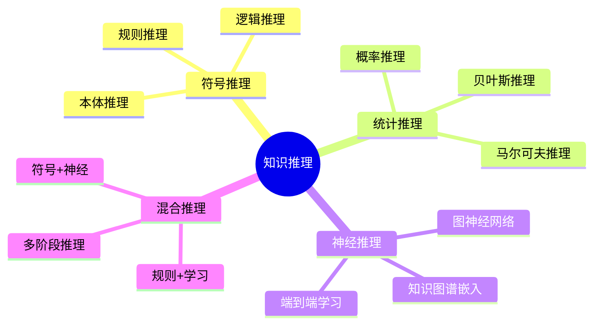
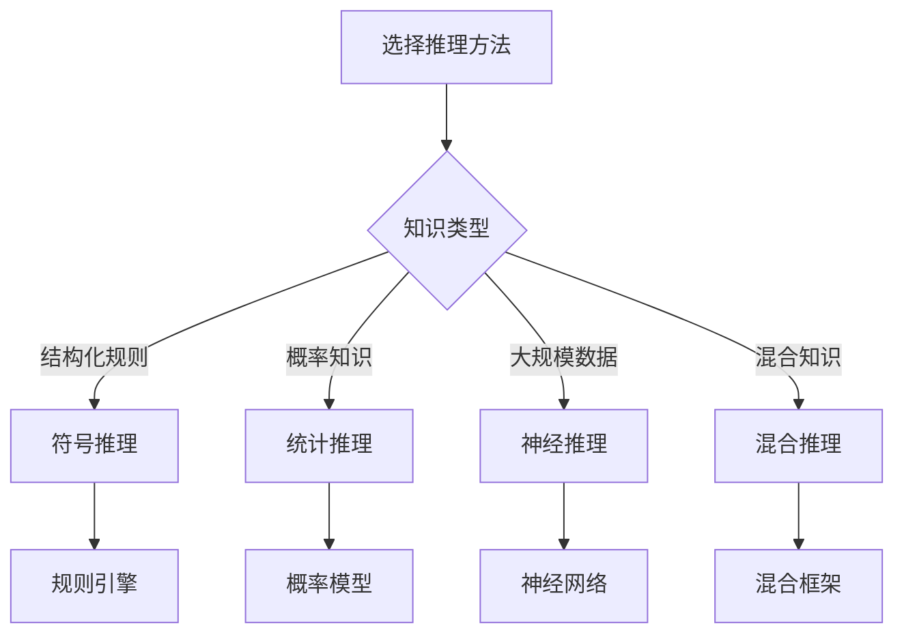
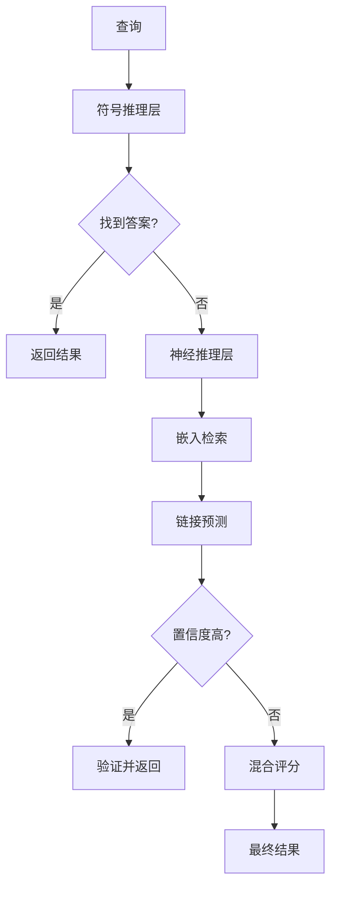

# 知识推理与归纳理论：从符号推理到神经推理

> **创建日期**：2025-01-15
> **最后更新**：2025-01-15
> **版本**：v1.0
> **状态**：实施中

---

## 📋 目录

- [知识推理与归纳理论：从符号推理到神经推理](#知识推理与归纳理论从符号推理到神经推理)
  - [📋 目录](#-目录)
  - [1. 概述](#1-概述)
    - [1.1. 推理类型分类](#11-推理类型分类)
    - [1.2. 推理方法选择决策树](#12-推理方法选择决策树)
  - [2. 符号推理](#2-符号推理)
    - [2.1. 规则推理](#21-规则推理)
    - [2.2. 逻辑推理](#22-逻辑推理)
    - [2.3. 本体推理](#23-本体推理)
  - [3. 统计推理](#3-统计推理)
    - [3.1. 概率推理](#31-概率推理)
    - [3.2. 链接预测](#32-链接预测)
  - [4. 神经推理](#4-神经推理)
    - [4.1. 知识图谱嵌入（KGE）](#41-知识图谱嵌入kge)
    - [4.2. 图神经网络（GNN）推理](#42-图神经网络gnn推理)
    - [4.3. 知识图谱嵌入存储](#43-知识图谱嵌入存储)
  - [5. 知识归纳](#5-知识归纳)
    - [5.1. 规则归纳](#51-规则归纳)
    - [5.2. 模式归纳](#52-模式归纳)
    - [5.3. 概念归纳](#53-概念归纳)
  - [6. 混合推理框架](#6-混合推理框架)
    - [6.1. 符号+神经混合推理](#61-符号神经混合推理)
  - [7. 推理系统设计](#7-推理系统设计)
    - [7.1. 推理引擎架构](#71-推理引擎架构)
    - [7.2. 推理性能优化](#72-推理性能优化)
  - [8. 参考资料](#8-参考资料)

---

## 1. 概述

知识推理是从已知知识推导出新知识的过程，知识归纳是从具体实例抽象出一般规律的过程。

### 1.1. 推理类型分类



### 1.2. 推理方法选择决策树



---

## 2. 符号推理

### 2.1. 规则推理

**推理规则定义**：

```text
规则形式：IF 前提 THEN 结论

示例规则：
  R1: IF (X, parentOf, Y) AND (Y, parentOf, Z)
      THEN (X, grandparentOf, Z)

  R2: IF (X, type, Person) AND (X, age, A) AND A > 18
      THEN (X, type, Adult)
```

**规则推理实现**：

```sql
-- 规则存储表
CREATE TABLE knowledge_rules (
    rule_id SERIAL PRIMARY KEY,
    rule_name VARCHAR(100) NOT NULL,
    premise_pattern TEXT NOT NULL,  -- SPARQL模式或Cypher模式
    conclusion_pattern TEXT NOT NULL,
    rule_type VARCHAR(50) NOT NULL,  -- TRANSITIVE, SYMMETRIC, INVERSE, CUSTOM
    confidence DECIMAL(3,2) DEFAULT 1.0,
    is_active BOOLEAN DEFAULT TRUE,
    created_at TIMESTAMP DEFAULT CURRENT_TIMESTAMP
);

-- 三元组表（知识图谱存储）
CREATE TABLE knowledge_triples (
    triple_id BIGSERIAL PRIMARY KEY,
    subject VARCHAR(200) NOT NULL,
    predicate VARCHAR(200) NOT NULL,
    object VARCHAR(200) NOT NULL,
    confidence DECIMAL(3,2) DEFAULT 1.0,
    source VARCHAR(100),
    created_at TIMESTAMP DEFAULT CURRENT_TIMESTAMP,
    UNIQUE(subject, predicate, object)
);

CREATE INDEX idx_triples_subject ON knowledge_triples(subject);
CREATE INDEX idx_triples_predicate ON knowledge_triples(predicate);
CREATE INDEX idx_triples_object ON knowledge_triples(object);
CREATE INDEX idx_triples_spo ON knowledge_triples(subject, predicate, object);

-- 传递性推理函数
CREATE OR REPLACE FUNCTION transitive_reasoning(
    p_predicate VARCHAR(200),
    p_max_depth INTEGER DEFAULT 5
)
RETURNS TABLE (
    subject VARCHAR(200),
    predicate VARCHAR(200),
    object VARCHAR(200),
    depth INTEGER
) AS $$
WITH RECURSIVE transitive_closure AS (
    -- 基础情况：直接关系
    SELECT
        subject,
        predicate,
        object,
        1 AS depth
    FROM knowledge_triples
    WHERE predicate = p_predicate

    UNION

    -- 递归情况：传递关系
    SELECT
        tc.subject,
        tc.predicate,
        t.object,
        tc.depth + 1
    FROM transitive_closure tc
    JOIN knowledge_triples t ON tc.object = t.subject
    WHERE t.predicate = p_predicate
      AND tc.depth < p_max_depth
)
SELECT * FROM transitive_closure;
$$ LANGUAGE plpgsql;

-- 使用示例：查找所有祖先关系
SELECT * FROM transitive_reasoning('parentOf', 10);
```

### 2.2. 逻辑推理

**一阶逻辑推理**：

```text
逻辑规则：
  ∀x, y, z: parentOf(x, y) ∧ parentOf(y, z) → grandparentOf(x, z)

推理过程：
  1. 已知：parentOf(Alice, Bob)
  2. 已知：parentOf(Bob, Charlie)
  3. 应用规则：grandparentOf(Alice, Charlie)
```

**逻辑推理实现**：

```sql
-- 逻辑规则表
CREATE TABLE logic_rules (
    rule_id SERIAL PRIMARY KEY,
    rule_formula TEXT NOT NULL,  -- 一阶逻辑公式
    rule_type VARCHAR(50),  -- IMPLICATION, EQUIVALENCE, NEGATION
    created_at TIMESTAMP DEFAULT CURRENT_TIMESTAMP
);

-- 逻辑推理引擎（简化版）
CREATE OR REPLACE FUNCTION logical_reasoning(
    p_goal_predicate VARCHAR(200),
    p_goal_subject VARCHAR(200),
    p_goal_object VARCHAR(200)
)
RETURNS BOOLEAN AS $$
DECLARE
    v_rule RECORD;
    v_result BOOLEAN := FALSE;
BEGIN
    -- 检查直接事实
    SELECT EXISTS(
        SELECT 1 FROM knowledge_triples
        WHERE subject = p_goal_subject
          AND predicate = p_goal_predicate
          AND object = p_goal_object
    ) INTO v_result;

    IF v_result THEN
        RETURN TRUE;
    END IF;

    -- 应用规则推理
    FOR v_rule IN
        SELECT * FROM logic_rules WHERE is_active = TRUE
    LOOP
        -- 这里需要实现规则匹配和推理逻辑
        -- 简化示例：传递性规则
        IF v_rule.rule_type = 'TRANSITIVE' THEN
            -- 检查是否存在中间实体
            SELECT EXISTS(
                SELECT 1 FROM knowledge_triples t1
                JOIN knowledge_triples t2 ON t1.object = t2.subject
                WHERE t1.subject = p_goal_subject
                  AND t1.predicate = p_goal_predicate
                  AND t2.predicate = p_goal_predicate
                  AND t2.object = p_goal_object
            ) INTO v_result;

            IF v_result THEN
                RETURN TRUE;
            END IF;
        END IF;
    END LOOP;

    RETURN FALSE;
END;
$$ LANGUAGE plpgsql;
```

### 2.3. 本体推理

**OWL本体推理**：

```text
本体公理示例：
  SubClassOf(Person, Animal)
  SubClassOf(Student, Person)

推理结果：
  SubClassOf(Student, Animal)  -- 传递性
```

**本体推理实现**：

```sql
-- 本体类层次表
CREATE TABLE ontology_classes (
    class_id SERIAL PRIMARY KEY,
    class_uri VARCHAR(500) UNIQUE NOT NULL,
    class_name VARCHAR(200) NOT NULL,
    parent_class_uri VARCHAR(500),
    created_at TIMESTAMP DEFAULT CURRENT_TIMESTAMP
);

CREATE INDEX idx_ontology_classes_parent ON ontology_classes(parent_class_uri);

-- 类层次推理（传递闭包）
CREATE OR REPLACE FUNCTION get_all_subclasses(
    p_class_uri VARCHAR(500)
)
RETURNS TABLE (
    subclass_uri VARCHAR(500),
    depth INTEGER
) AS $$
WITH RECURSIVE subclass_hierarchy AS (
    -- 基础：直接子类
    SELECT
        class_uri,
        1 AS depth
    FROM ontology_classes
    WHERE parent_class_uri = p_class_uri

    UNION

    -- 递归：间接子类
    SELECT
        oc.class_uri,
        sh.depth + 1
    FROM subclass_hierarchy sh
    JOIN ontology_classes oc ON oc.parent_class_uri = sh.class_uri
)
SELECT class_uri AS subclass_uri, depth FROM subclass_hierarchy;
$$ LANGUAGE plpgsql;

-- 实例类型推理
CREATE TABLE entity_types (
    entity_id BIGINT NOT NULL,
    type_uri VARCHAR(500) NOT NULL,
    PRIMARY KEY (entity_id, type_uri)
);

-- 推理所有类型（包括继承的类型）
CREATE OR REPLACE FUNCTION infer_all_types(
    p_entity_id BIGINT
)
RETURNS TABLE (type_uri VARCHAR(500)) AS $$
BEGIN
    RETURN QUERY
    WITH direct_types AS (
        SELECT type_uri FROM entity_types WHERE entity_id = p_entity_id
    ),
    inherited_types AS (
        SELECT DISTINCT parent.class_uri AS type_uri
        FROM entity_types et
        JOIN ontology_classes child ON et.type_uri = child.class_uri
        JOIN get_all_subclasses(child.class_uri) parent ON TRUE
        WHERE et.entity_id = p_entity_id
    )
    SELECT type_uri FROM direct_types
    UNION
    SELECT type_uri FROM inherited_types;
END;
$$ LANGUAGE plpgsql;
```

---

## 3. 统计推理

### 3.1. 概率推理

**贝叶斯推理**：

```text
贝叶斯规则：
  P(H|E) = P(E|H) × P(H) / P(E)

其中：
  H: 假设（如：实体间存在关系）
  E: 证据（如：共现、文本相似度等）
```

**概率推理实现**：

```sql
-- 关系概率表
CREATE TABLE relation_probabilities (
    relation_id SERIAL PRIMARY KEY,
    subject_type VARCHAR(200) NOT NULL,
    predicate VARCHAR(200) NOT NULL,
    object_type VARCHAR(200) NOT NULL,
    prior_probability DECIMAL(5,4) NOT NULL,  -- P(predicate | subject_type, object_type)
    evidence_count BIGINT DEFAULT 0,
    updated_at TIMESTAMP DEFAULT CURRENT_TIMESTAMP,
    UNIQUE(subject_type, predicate, object_type)
);

-- 证据表
CREATE TABLE relation_evidence (
    evidence_id BIGSERIAL PRIMARY KEY,
    subject VARCHAR(200) NOT NULL,
    predicate VARCHAR(200) NOT NULL,
    object VARCHAR(200) NOT NULL,
    evidence_type VARCHAR(50) NOT NULL,  -- COOCCURRENCE, TEXT_SIMILARITY, PATTERN
    evidence_strength DECIMAL(5,4) NOT NULL,
    created_at TIMESTAMP DEFAULT CURRENT_TIMESTAMP
);

-- 贝叶斯推理函数
CREATE OR REPLACE FUNCTION bayesian_reasoning(
    p_subject VARCHAR(200),
    p_predicate VARCHAR(200),
    p_object VARCHAR(200)
)
RETURNS DECIMAL AS $$
DECLARE
    v_subject_type VARCHAR(200);
    v_object_type VARCHAR(200);
    v_prior DECIMAL(5,4);
    v_likelihood DECIMAL(5,4);
    v_evidence DECIMAL(5,4);
    v_posterior DECIMAL(5,4);
BEGIN
    -- 获取实体类型
    SELECT type_uri INTO v_subject_type
    FROM entity_types
    WHERE entity_id = (SELECT entity_id FROM entities WHERE uri = p_subject)
    LIMIT 1;

    SELECT type_uri INTO v_object_type
    FROM entity_types
    WHERE entity_id = (SELECT entity_id FROM entities WHERE uri = p_object)
    LIMIT 1;

    -- 获取先验概率
    SELECT prior_probability INTO v_prior
    FROM relation_probabilities
    WHERE subject_type = v_subject_type
      AND predicate = p_predicate
      AND object_type = v_object_type;

    IF v_prior IS NULL THEN
        v_prior := 0.01;  -- 默认先验
    END IF;

    -- 计算证据强度
    SELECT AVG(evidence_strength) INTO v_evidence
    FROM relation_evidence
    WHERE subject = p_subject
      AND predicate = p_predicate
      AND object = p_object;

    IF v_evidence IS NULL THEN
        v_evidence := 0.5;  -- 默认证据强度
    END IF;

    -- 贝叶斯更新
    v_likelihood := v_evidence;
    v_posterior := (v_likelihood * v_prior) /
                   (v_likelihood * v_prior + (1 - v_likelihood) * (1 - v_prior));

    RETURN v_posterior;
END;
$$ LANGUAGE plpgsql;
```

### 3.2. 链接预测

**基于统计的链接预测**：

```sql
-- 链接预测结果表
CREATE TABLE link_predictions (
    prediction_id BIGSERIAL PRIMARY KEY,
    subject VARCHAR(200) NOT NULL,
    predicate VARCHAR(200) NOT NULL,
    object VARCHAR(200) NOT NULL,
    prediction_score DECIMAL(5,4) NOT NULL,
    prediction_method VARCHAR(50) NOT NULL,  -- STATISTICAL, EMBEDDING, HYBRID
    created_at TIMESTAMP DEFAULT CURRENT_TIMESTAMP,
    UNIQUE(subject, predicate, object, prediction_method)
);

-- 基于共现的链接预测
CREATE OR REPLACE FUNCTION cooccurrence_link_prediction(
    p_subject VARCHAR(200),
    p_predicate VARCHAR(200),
    p_top_k INTEGER DEFAULT 10
)
RETURNS TABLE (
    object VARCHAR(200),
    score DECIMAL(5,4)
) AS $$
BEGIN
    RETURN QUERY
    WITH subject_neighbors AS (
        SELECT object AS neighbor
        FROM knowledge_triples
        WHERE subject = p_subject
    ),
    neighbor_objects AS (
        SELECT
            t.object,
            COUNT(*) AS cooccurrence_count
        FROM knowledge_triples t
        JOIN subject_neighbors sn ON t.subject = sn.neighbor
        WHERE t.predicate = p_predicate
          AND t.object NOT IN (
              SELECT object FROM knowledge_triples
              WHERE subject = p_subject AND predicate = p_predicate
          )
        GROUP BY t.object
    ),
    max_count AS (
        SELECT MAX(cooccurrence_count) AS max_val FROM neighbor_objects
    )
    SELECT
        no.object,
        no.cooccurrence_count::DECIMAL / NULLIF(mc.max_val, 0) AS score
    FROM neighbor_objects no
    CROSS JOIN max_count mc
    ORDER BY score DESC
    LIMIT p_top_k;
END;
$$ LANGUAGE plpgsql;
```

---

## 4. 神经推理

### 4.1. 知识图谱嵌入（KGE）

**TransE模型**：

```text
TransE核心思想：
  对于三元组 (h, r, t)，满足：
    h + r ≈ t

  损失函数：
    L = ||h + r - t||₂
```

**KGE实现（Python示例）**：

```python
import torch
import torch.nn as nn
import torch.optim as optim
from torch.utils.data import DataLoader

class TransE(nn.Module):
    def __init__(self, num_entities, num_relations, embedding_dim=100):
        super(TransE, self).__init__()
        self.num_entities = num_entities
        self.num_relations = num_relations
        self.embedding_dim = embedding_dim

        # 实体嵌入
        self.entity_embeddings = nn.Embedding(num_entities, embedding_dim)
        # 关系嵌入
        self.relation_embeddings = nn.Embedding(num_relations, embedding_dim)

        # 初始化
        nn.init.xavier_uniform_(self.entity_embeddings.weight.data)
        nn.init.xavier_uniform_(self.relation_embeddings.weight.data)

        # L2归一化
        self.entity_embeddings.weight.data = \
            nn.functional.normalize(self.entity_embeddings.weight.data, p=2, dim=1)

    def forward(self, heads, relations, tails, neg_heads=None, neg_tails=None):
        """
        前向传播
        heads: [batch_size] 头实体ID
        relations: [batch_size] 关系ID
        tails: [batch_size] 尾实体ID
        """
        h = self.entity_embeddings(heads)
        r = self.relation_embeddings(relations)
        t = self.entity_embeddings(tails)

        # TransE得分：||h + r - t||
        score = torch.norm(h + r - t, p=2, dim=1)

        # 负采样损失
        if neg_heads is not None and neg_tails is not None:
            neg_h = self.entity_embeddings(neg_heads)
            neg_t = self.entity_embeddings(neg_tails)
            neg_score = torch.norm(neg_h + r - neg_t, p=2, dim=1)
            # 边际损失
            loss = torch.relu(score - neg_score + 1.0).mean()
            return loss, score

        return score

    def predict(self, heads, relations, candidates=None):
        """
        预测尾实体
        """
        h = self.entity_embeddings(heads)
        r = self.relation_embeddings(relations)

        if candidates is None:
            # 对所有实体计算得分
            all_entities = torch.arange(self.num_entities).to(heads.device)
            t_candidates = self.entity_embeddings(all_entities)
        else:
            t_candidates = self.entity_embeddings(candidates)

        # 计算得分
        scores = torch.norm(
            h.unsqueeze(1) + r.unsqueeze(1) - t_candidates.unsqueeze(0),
            p=2, dim=2
        )

        return scores

# 训练示例
def train_transe(model, train_data, num_epochs=100, batch_size=128):
    optimizer = optim.Adam(model.parameters(), lr=0.001)

    for epoch in range(num_epochs):
        total_loss = 0
        for batch in DataLoader(train_data, batch_size=batch_size, shuffle=True):
            heads, relations, tails = batch

            # 负采样
            neg_heads = torch.randint(0, model.num_entities, (batch_size,))
            neg_tails = torch.randint(0, model.num_entities, (batch_size,))

            optimizer.zero_grad()
            loss, _ = model(heads, relations, tails, neg_heads, neg_tails)
            loss.backward()
            optimizer.step()

            total_loss += loss.item()

        print(f"Epoch {epoch+1}/{num_epochs}, Loss: {total_loss/len(train_data)}")
```

### 4.2. 图神经网络（GNN）推理

**GCN（Graph Convolutional Network）实现**：

```python
import torch
import torch.nn as nn
import torch.nn.functional as F
from torch_geometric.nn import GCNConv

class KGCN(nn.Module):
    """
    知识图谱卷积网络
    """
    def __init__(self, num_entities, num_relations, embedding_dim=100, hidden_dim=200):
        super(KGCN, self).__init__()
        self.num_entities = num_entities
        self.num_relations = num_relations

        # 实体嵌入
        self.entity_embedding = nn.Embedding(num_entities, embedding_dim)
        # 关系嵌入
        self.relation_embedding = nn.Embedding(num_relations, embedding_dim)

        # GCN层
        self.conv1 = GCNConv(embedding_dim, hidden_dim)
        self.conv2 = GCNConv(hidden_dim, embedding_dim)

        # 链接预测头
        self.link_predictor = nn.Linear(embedding_dim * 3, 1)

    def forward(self, x, edge_index, edge_type, heads, relations, tails):
        """
        x: 节点特征 [num_nodes, embedding_dim]
        edge_index: 边索引 [2, num_edges]
        edge_type: 边类型（关系）[num_edges]
        """
        # GCN传播
        x = F.relu(self.conv1(x, edge_index))
        x = self.conv2(x, edge_index)

        # 获取实体嵌入
        h_emb = x[heads]
        r_emb = self.relation_embedding(relations)
        t_emb = x[tails]

        # 链接预测
        combined = torch.cat([h_emb, r_emb, t_emb], dim=1)
        score = torch.sigmoid(self.link_predictor(combined))

        return score
```

### 4.3. 知识图谱嵌入存储

**在数据库中存储嵌入向量**：

```sql
-- 实体嵌入表
CREATE TABLE entity_embeddings (
    entity_id BIGINT PRIMARY KEY,
    embedding vector(100) NOT NULL,  -- TransE嵌入向量
    model_name VARCHAR(100) NOT NULL,
    model_version VARCHAR(50) NOT NULL,
    created_at TIMESTAMP DEFAULT CURRENT_TIMESTAMP
);

CREATE INDEX idx_entity_embeddings_vector
ON entity_embeddings
USING hnsw (embedding vector_cosine_ops);

-- 关系嵌入表
CREATE TABLE relation_embeddings (
    relation_id INTEGER PRIMARY KEY,
    relation_uri VARCHAR(500) UNIQUE NOT NULL,
    embedding vector(100) NOT NULL,
    model_name VARCHAR(100) NOT NULL,
    created_at TIMESTAMP DEFAULT CURRENT_TIMESTAMP
);

-- 基于嵌入的链接预测
CREATE OR REPLACE FUNCTION embedding_link_prediction(
    p_head_entity_id BIGINT,
    p_relation_id INTEGER,
    p_top_k INTEGER DEFAULT 10
)
RETURNS TABLE (
    tail_entity_id BIGINT,
    score DECIMAL(5,4)
) AS $$
DECLARE
    v_head_embedding vector(100);
    v_relation_embedding vector(100);
BEGIN
    -- 获取头实体和关系嵌入
    SELECT embedding INTO v_head_embedding
    FROM entity_embeddings
    WHERE entity_id = p_head_entity_id;

    SELECT embedding INTO v_relation_embedding
    FROM relation_embeddings
    WHERE relation_id = p_relation_id;

    -- 计算目标嵌入：head + relation
    -- 预测尾实体：找到最接近的实体嵌入
    RETURN QUERY
    SELECT
        ee.entity_id,
        1 - (ee.embedding <=> (v_head_embedding + v_relation_embedding)) AS score
    FROM entity_embeddings ee
    ORDER BY ee.embedding <=> (v_head_embedding + v_relation_embedding)
    LIMIT p_top_k;
END;
$$ LANGUAGE plpgsql;
```

---

## 5. 知识归纳

### 5.1. 规则归纳

**从实例归纳规则**：

```text
归纳过程：
  输入：多个三元组实例
    (Alice, parentOf, Bob)
    (Bob, parentOf, Charlie)
    (David, parentOf, Eve)
    (Eve, parentOf, Frank)

  归纳规则：
    IF (X, parentOf, Y) AND (Y, parentOf, Z)
    THEN (X, grandparentOf, Z)
```

**规则归纳实现**：

```sql
-- 规则模式表
CREATE TABLE rule_patterns (
    pattern_id SERIAL PRIMARY KEY,
    pattern_type VARCHAR(50) NOT NULL,  -- TRANSITIVE, SYMMETRIC, INVERSE
    premise_pattern TEXT NOT NULL,
    conclusion_pattern TEXT NOT NULL,
    support_count INTEGER DEFAULT 0,  -- 支持该规则的实例数
    confidence DECIMAL(5,4),  -- 置信度
    created_at TIMESTAMP DEFAULT CURRENT_TIMESTAMP
);

-- 规则归纳函数（传递性规则）
CREATE OR REPLACE FUNCTION induce_transitive_rule(
    p_predicate VARCHAR(200),
    p_min_support INTEGER DEFAULT 10,
    p_min_confidence DECIMAL DEFAULT 0.8
)
RETURNS TABLE (
    rule_id INTEGER,
    support_count BIGINT,
    confidence DECIMAL
) AS $$
BEGIN
    RETURN QUERY
    WITH transitive_instances AS (
        SELECT
            t1.subject,
            t1.predicate,
            t2.object,
            COUNT(*) AS instance_count
        FROM knowledge_triples t1
        JOIN knowledge_triples t2
            ON t1.object = t2.subject
            AND t1.predicate = t2.predicate
        WHERE t1.predicate = p_predicate
        GROUP BY t1.subject, t1.predicate, t2.object
    ),
    rule_stats AS (
        SELECT
            ti.subject,
            ti.predicate,
            ti.object,
            ti.instance_count,
            CASE
                WHEN EXISTS(
                    SELECT 1 FROM knowledge_triples kt
                    WHERE kt.subject = ti.subject
                      AND kt.predicate = ti.predicate
                      AND kt.object = ti.object
                ) THEN 1
                ELSE 0
            END AS direct_exists
        FROM transitive_instances ti
    )
    SELECT
        ROW_NUMBER() OVER ()::INTEGER AS rule_id,
        SUM(instance_count)::BIGINT AS support_count,
        AVG(direct_exists::DECIMAL) AS confidence
    FROM rule_stats
    GROUP BY predicate
    HAVING SUM(instance_count) >= p_min_support
       AND AVG(direct_exists) >= p_min_confidence;
END;
$$ LANGUAGE plpgsql;
```

### 5.2. 模式归纳

**图模式归纳**：

```sql
-- 图模式表
CREATE TABLE graph_patterns (
    pattern_id SERIAL PRIMARY KEY,
    pattern_name VARCHAR(200) NOT NULL,
    pattern_graph JSONB NOT NULL,  -- 图结构描述
    frequency INTEGER DEFAULT 0,
    significance_score DECIMAL(5,4),
    created_at TIMESTAMP DEFAULT CURRENT_TIMESTAMP
);

-- 模式匹配函数
CREATE OR REPLACE FUNCTION match_graph_pattern(
    p_pattern_graph JSONB
)
RETURNS TABLE (
    match_id BIGINT,
    matched_entities JSONB
) AS $$
DECLARE
    v_pattern_nodes JSONB;
    v_pattern_edges JSONB;
BEGIN
    -- 解析模式图
    v_pattern_nodes := p_pattern_graph->'nodes';
    v_pattern_edges := p_pattern_graph->'edges';

    -- 实现图模式匹配算法
    -- 这里简化示例，实际需要实现子图同构算法

    RETURN QUERY
    SELECT
        ROW_NUMBER() OVER ()::BIGINT AS match_id,
        '{}'::JSONB AS matched_entities;  -- 简化示例
END;
$$ LANGUAGE plpgsql;
```

### 5.3. 概念归纳

**从实例归纳概念**：

```sql
-- 概念归纳表
CREATE TABLE concept_inductions (
    concept_id SERIAL PRIMARY KEY,
    concept_name VARCHAR(200) NOT NULL,
    parent_concept_id INTEGER REFERENCES concept_inductions(concept_id),
    defining_properties JSONB,  -- 定义该概念的属性
    instance_count INTEGER DEFAULT 0,
    created_at TIMESTAMP DEFAULT CURRENT_TIMESTAMP
);

-- 概念归纳函数（基于共同属性）
CREATE OR REPLACE FUNCTION induce_concept(
    p_min_instances INTEGER DEFAULT 5,
    p_min_common_properties INTEGER DEFAULT 3
)
RETURNS TABLE (
    concept_id INTEGER,
    concept_name VARCHAR(200),
    common_properties JSONB,
    instance_count BIGINT
) AS $$
BEGIN
    RETURN QUERY
    WITH entity_properties AS (
        SELECT
            e.entity_id,
            jsonb_object_agg(p.predicate, p.object) AS properties
        FROM entities e
        JOIN knowledge_triples p ON e.entity_id = p.subject
        GROUP BY e.entity_id
    ),
    property_groups AS (
        SELECT
            properties,
            COUNT(*) AS instance_count,
            array_agg(entity_id) AS entity_ids
        FROM entity_properties
        GROUP BY properties
        HAVING COUNT(*) >= p_min_instances
    )
    SELECT
        ROW_NUMBER() OVER ()::INTEGER AS concept_id,
        'Concept_' || ROW_NUMBER() OVER ()::TEXT AS concept_name,
        pg.properties AS common_properties,
        pg.instance_count::BIGINT
    FROM property_groups pg
    WHERE jsonb_object_keys(pg.properties)::INTEGER >= p_min_common_properties;
END;
$$ LANGUAGE plpgsql;
```

---

## 6. 混合推理框架

### 6.1. 符号+神经混合推理

**混合推理架构**：



**混合推理实现**：

```sql
-- 混合推理结果表
CREATE TABLE hybrid_reasoning_results (
    result_id BIGSERIAL PRIMARY KEY,
    query_subject VARCHAR(200),
    query_predicate VARCHAR(200),
    query_object VARCHAR(200),
    symbolic_score DECIMAL(5,4),
    neural_score DECIMAL(5,4),
    combined_score DECIMAL(5,4),
    reasoning_path TEXT,  -- 推理路径
    created_at TIMESTAMP DEFAULT CURRENT_TIMESTAMP
);

-- 混合推理函数
CREATE OR REPLACE FUNCTION hybrid_reasoning(
    p_subject VARCHAR(200),
    p_predicate VARCHAR(200),
    p_object VARCHAR(200),
    p_symbolic_weight DECIMAL DEFAULT 0.6,
    p_neural_weight DECIMAL DEFAULT 0.4
)
RETURNS DECIMAL AS $$
DECLARE
    v_symbolic_score DECIMAL(5,4);
    v_neural_score DECIMAL(5,4);
    v_combined_score DECIMAL(5,4);
BEGIN
    -- 符号推理得分
    SELECT CASE
        WHEN EXISTS(
            SELECT 1 FROM knowledge_triples
            WHERE subject = p_subject
              AND predicate = p_predicate
              AND object = p_object
        ) THEN 1.0
        ELSE 0.0
    END INTO v_symbolic_score;

    -- 神经推理得分（基于嵌入）
    SELECT embedding_link_prediction_score(
        (SELECT entity_id FROM entities WHERE uri = p_subject),
        (SELECT relation_id FROM relations WHERE uri = p_predicate),
        (SELECT entity_id FROM entities WHERE uri = p_object)
    ) INTO v_neural_score;

    -- 组合得分
    v_combined_score :=
        p_symbolic_weight * v_symbolic_score +
        p_neural_weight * v_neural_score;

    -- 记录结果
    INSERT INTO hybrid_reasoning_results
    (query_subject, query_predicate, query_object,
     symbolic_score, neural_score, combined_score)
    VALUES (p_subject, p_predicate, p_object,
            v_symbolic_score, v_neural_score, v_combined_score);

    RETURN v_combined_score;
END;
$$ LANGUAGE plpgsql;
```

---

## 7. 推理系统设计

### 7.1. 推理引擎架构

**完整推理系统Schema**：

```sql
CREATE SCHEMA reasoning_engine;

-- 推理任务表
CREATE TABLE reasoning_engine.reasoning_tasks (
    task_id BIGSERIAL PRIMARY KEY,
    task_type VARCHAR(50) NOT NULL,  -- LINK_PREDICTION, QUERY_ANSWERING, RULE_INDUCTION
    query_pattern TEXT NOT NULL,
    reasoning_method VARCHAR(50) NOT NULL,  -- SYMBOLIC, NEURAL, HYBRID
    status VARCHAR(20) DEFAULT 'pending',  -- pending, processing, completed, failed
    result JSONB,
    execution_time_ms INTEGER,
    created_at TIMESTAMP DEFAULT CURRENT_TIMESTAMP,
    completed_at TIMESTAMP
);

CREATE INDEX idx_reasoning_tasks_status ON reasoning_engine.reasoning_tasks(status);
CREATE INDEX idx_reasoning_tasks_created ON reasoning_engine.reasoning_tasks(created_at DESC);

-- 推理规则库
CREATE TABLE reasoning_engine.rule_library (
    rule_id SERIAL PRIMARY KEY,
    rule_name VARCHAR(200) NOT NULL,
    rule_category VARCHAR(50),  -- TRANSITIVE, SYMMETRIC, INVERSE, CUSTOM
    rule_definition TEXT NOT NULL,
    rule_confidence DECIMAL(5,4) DEFAULT 1.0,
    usage_count INTEGER DEFAULT 0,
    success_count INTEGER DEFAULT 0,
    is_active BOOLEAN DEFAULT TRUE,
    created_at TIMESTAMP DEFAULT CURRENT_TIMESTAMP
);

-- 推理历史表
CREATE TABLE reasoning_engine.reasoning_history (
    history_id BIGSERIAL PRIMARY KEY,
    task_id BIGINT REFERENCES reasoning_engine.reasoning_tasks(task_id),
    step_order INTEGER NOT NULL,
    step_type VARCHAR(50),  -- RULE_APPLICATION, EMBEDDING_SEARCH, PATTERN_MATCH
    input_data JSONB,
    output_data JSONB,
    execution_time_ms INTEGER,
    created_at TIMESTAMP DEFAULT CURRENT_TIMESTAMP
);

CREATE INDEX idx_reasoning_history_task ON reasoning_engine.reasoning_history(task_id, step_order);
```

### 7.2. 推理性能优化

**推理缓存**：

```sql
-- 推理结果缓存
CREATE TABLE reasoning_engine.reasoning_cache (
    cache_id BIGSERIAL PRIMARY KEY,
    query_hash VARCHAR(64) UNIQUE NOT NULL,
    query_pattern TEXT NOT NULL,
    result JSONB NOT NULL,
    result_score DECIMAL(5,4),
    cache_hit_count INTEGER DEFAULT 0,
    created_at TIMESTAMP DEFAULT CURRENT_TIMESTAMP,
    last_accessed_at TIMESTAMP DEFAULT CURRENT_TIMESTAMP
);

CREATE INDEX idx_reasoning_cache_hash ON reasoning_engine.reasoning_cache(query_hash);

-- 缓存查询函数
CREATE OR REPLACE FUNCTION get_cached_reasoning_result(
    p_query_pattern TEXT
)
RETURNS JSONB AS $$
DECLARE
    v_query_hash VARCHAR(64);
    v_cached_result JSONB;
BEGIN
    -- 计算查询哈希
    v_query_hash := md5(p_query_pattern);

    -- 查找缓存
    SELECT result INTO v_cached_result
    FROM reasoning_engine.reasoning_cache
    WHERE query_hash = v_query_hash;

    -- 更新访问时间
    IF v_cached_result IS NOT NULL THEN
        UPDATE reasoning_engine.reasoning_cache
        SET cache_hit_count = cache_hit_count + 1,
            last_accessed_at = CURRENT_TIMESTAMP
        WHERE query_hash = v_query_hash;
    END IF;

    RETURN v_cached_result;
END;
$$ LANGUAGE plpgsql;
```

---

## 8. 参考资料

- [知识图谱理论](./01.04-知识图谱理论.md)
- [图神经网络论文](https://arxiv.org/abs/2003.00911)
- [知识图谱嵌入综述](https://arxiv.org/abs/2003.00911)

---

**最后更新**：2025-01-15
**维护者**：Data-Science Team
**状态**：实施中
