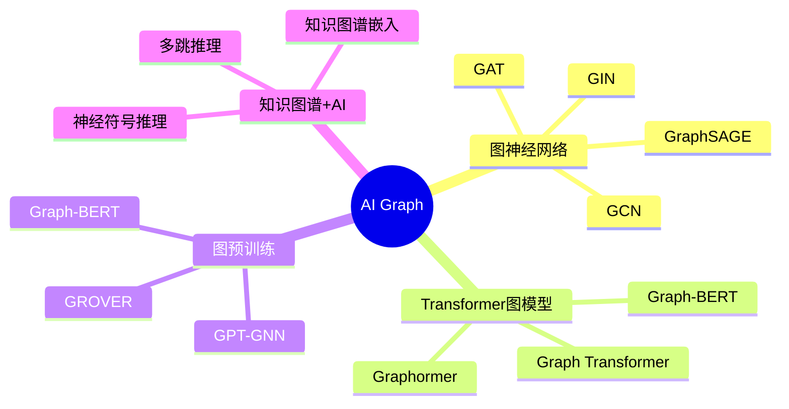
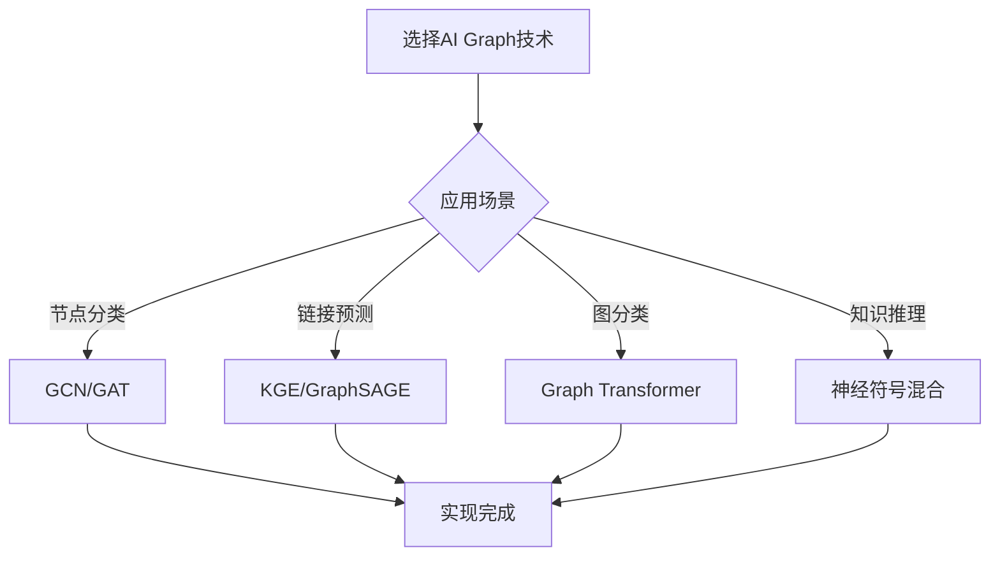

# AI Graph理论：图神经网络与知识图谱的AI融合

> **创建日期**：2025-01-15
> **最后更新**：2025-01-15
> **版本**：v1.0
> **状态**：实施中

---

## 📋 目录

- [AI Graph理论：图神经网络与知识图谱的AI融合](#ai-graph理论图神经网络与知识图谱的ai融合)
  - [📋 目录](#-目录)
  - [1. 概述](#1-概述)
    - [1.1. AI Graph技术栈](#11-ai-graph技术栈)
    - [1.2. AI Graph应用决策树](#12-ai-graph应用决策树)
  - [2. 图神经网络基础](#2-图神经网络基础)
    - [2.1. GCN（Graph Convolutional Network）](#21-gcngraph-convolutional-network)
    - [2.2. GAT（Graph Attention Network）](#22-gatgraph-attention-network)
    - [2.3. GraphSAGE](#23-graphsage)
  - [3. 知识图谱+AI融合](#3-知识图谱ai融合)
    - [3.1. 知识图谱嵌入与GNN结合](#31-知识图谱嵌入与gnn结合)
    - [3.2. 多跳推理](#32-多跳推理)
  - [4. Graph Transformer](#4-graph-transformer)
    - [4.1. Graph Transformer架构](#41-graph-transformer架构)
    - [4.2. Graphormer](#42-graphormer)
  - [5. 图预训练模型](#5-图预训练模型)
    - [5.1. GPT-GNN](#51-gpt-gnn)
    - [5.2. 图对比学习](#52-图对比学习)
  - [6. 图数据库AI扩展](#6-图数据库ai扩展)
    - [6.1. Neo4j + GNN集成](#61-neo4j--gnn集成)
    - [6.2. 图数据库中的AI推理](#62-图数据库中的ai推理)
  - [7. 参考资料](#7-参考资料)

---

## 1. 概述

AI Graph结合了图结构数据和人工智能技术，通过图神经网络、Transformer等模型实现知识图谱的智能推理和学习。

### 1.1. AI Graph技术栈



### 1.2. AI Graph应用决策树



---

## 2. 图神经网络基础

### 2.1. GCN（Graph Convolutional Network）

**GCN核心公式**：

```text
H^(l+1) = σ(D^(-1/2) A D^(-1/2) H^(l) W^(l))

其中：
  H^(l): 第l层的节点特征矩阵
  A: 邻接矩阵
  D: 度矩阵（对角矩阵）
  W^(l): 第l层的权重矩阵
  σ: 激活函数
```

**GCN实现（PyTorch Geometric）**：

```python
import torch
import torch.nn as nn
import torch.nn.functional as F
from torch_geometric.nn import GCNConv
from torch_geometric.data import Data

class GCNModel(nn.Module):
    def __init__(self, num_features, hidden_dim, num_classes):
        super(GCNModel, self).__init__()
        self.conv1 = GCNConv(num_features, hidden_dim)
        self.conv2 = GCNConv(hidden_dim, num_classes)
        self.dropout = nn.Dropout(0.5)

    def forward(self, x, edge_index):
        # 第一层GCN
        x = self.conv1(x, edge_index)
        x = F.relu(x)
        x = self.dropout(x)

        # 第二层GCN
        x = self.conv2(x, edge_index)

        return F.log_softmax(x, dim=1)

# 知识图谱数据准备
def prepare_kg_data(triples, entity_features):
    """
    将知识图谱三元组转换为图数据
    triples: [(head, relation, tail), ...]
    entity_features: {entity_id: feature_vector}
    """
    # 构建边索引
    edge_index = []
    edge_attr = []  # 关系类型

    entity_to_idx = {e: i for i, e in enumerate(entity_features.keys())}

    for head, relation, tail in triples:
        if head in entity_to_idx and tail in entity_to_idx:
            edge_index.append([entity_to_idx[head], entity_to_idx[tail]])
            edge_attr.append(relation)

    edge_index = torch.tensor(edge_index, dtype=torch.long).t().contiguous()

    # 节点特征
    x = torch.tensor([entity_features[e] for e in entity_features.keys()])

    return Data(x=x, edge_index=edge_index, edge_attr=edge_attr)
```

### 2.2. GAT（Graph Attention Network）

**GAT注意力机制**：

```text
注意力系数：
  α_ij = softmax(LeakyReLU(a^T [W h_i || W h_j]))

节点更新：
  h_i' = σ(Σ_j∈N(i) α_ij W h_j)
```

**GAT实现**：

```python
from torch_geometric.nn import GATConv

class GATModel(nn.Module):
    def __init__(self, num_features, hidden_dim, num_classes, num_heads=8):
        super(GATModel, self).__init__()
        self.conv1 = GATConv(
            num_features,
            hidden_dim,
            heads=num_heads,
            dropout=0.6
        )
        self.conv2 = GATConv(
            hidden_dim * num_heads,
            num_classes,
            heads=1,
            dropout=0.6
        )

    def forward(self, x, edge_index):
        x = F.dropout(x, p=0.6, training=self.training)
        x = F.elu(self.conv1(x, edge_index))
        x = F.dropout(x, p=0.6, training=self.training)
        x = self.conv2(x, edge_index)
        return F.log_softmax(x, dim=1)
```

### 2.3. GraphSAGE

**GraphSAGE采样聚合**：

```text
采样邻居：
  N_k(v) = 随机采样k个v的邻居

聚合函数：
  h_v^k = σ(W^k · CONCAT(h_v^(k-1), AGG({h_u^(k-1), u ∈ N_k(v)})))
```

**GraphSAGE实现**：

```python
from torch_geometric.nn import SAGEConv

class GraphSAGEModel(nn.Module):
    def __init__(self, num_features, hidden_dim, num_classes):
        super(GraphSAGEModel, self).__init__()
        self.conv1 = SAGEConv(num_features, hidden_dim)
        self.conv2 = SAGEConv(hidden_dim, num_classes)

    def forward(self, x, edge_index):
        x = F.relu(self.conv1(x, edge_index))
        x = F.dropout(x, training=self.training)
        x = self.conv2(x, edge_index)
        return F.log_softmax(x, dim=1)
```

---

## 3. 知识图谱+AI融合

### 3.1. 知识图谱嵌入与GNN结合

**RGCN（Relational GCN）**：

```python
from torch_geometric.nn import RGCNConv

class RGCNModel(nn.Module):
    """
    关系图卷积网络，专门用于知识图谱
    """
    def __init__(self, num_entities, num_relations, embedding_dim, hidden_dim):
        super(RGCNModel, self).__init__()
        self.entity_embedding = nn.Embedding(num_entities, embedding_dim)
        self.conv1 = RGCNConv(embedding_dim, hidden_dim, num_relations)
        self.conv2 = RGCNConv(hidden_dim, embedding_dim, num_relations)

    def forward(self, edge_index, edge_type):
        x = self.entity_embedding.weight
        x = F.relu(self.conv1(x, edge_index, edge_type))
        x = self.conv2(x, edge_index, edge_type)
        return x
```

### 3.2. 多跳推理

**基于GNN的多跳推理**：

```python
class MultiHopReasoning(nn.Module):
    """
    多跳推理模型
    """
    def __init__(self, num_entities, num_relations, embedding_dim, num_hops=3):
        super(MultiHopReasoning, self).__init__()
        self.num_hops = num_hops
        self.entity_embedding = nn.Embedding(num_entities, embedding_dim)
        self.relation_embedding = nn.Embedding(num_relations, embedding_dim)

        # 每跳的GCN层
        self.gcn_layers = nn.ModuleList([
            GCNConv(embedding_dim, embedding_dim)
            for _ in range(num_hops)
        ])

    def forward(self, head_ids, relation_ids, tail_ids, edge_index):
        # 初始实体嵌入
        entity_emb = self.entity_embedding.weight

        # 多跳传播
        for i, gcn_layer in enumerate(self.gcn_layers):
            entity_emb = F.relu(gcn_layer(entity_emb, edge_index))

        # 获取查询实体嵌入
        head_emb = entity_emb[head_ids]
        relation_emb = self.relation_embedding(relation_ids)
        tail_emb = entity_emb[tail_ids]

        # 计算得分
        score = torch.norm(head_emb + relation_emb - tail_emb, p=2, dim=1)

        return score
```

---

## 4. Graph Transformer

### 4.1. Graph Transformer架构

**Graph Transformer核心**：

```text
Graph Transformer = Transformer + 图结构信息

关键改进：
  1. 位置编码 → 图结构编码
  2. 自注意力 → 图注意力
  3. 序列 → 图节点序列
```

**Graph Transformer实现**：

```python
import math
import torch
import torch.nn as nn
from torch.nn import TransformerEncoder, TransformerEncoderLayer

class GraphTransformer(nn.Module):
    def __init__(self, num_features, hidden_dim, num_heads, num_layers, num_classes):
        super(GraphTransformer, self).__init__()
        self.embedding = nn.Linear(num_features, hidden_dim)

        # 图结构编码（替代位置编码）
        self.structure_encoder = nn.Parameter(
            torch.randn(1000, hidden_dim)  # 最大节点数
        )

        # Transformer编码器
        encoder_layers = TransformerEncoderLayer(
            hidden_dim,
            num_heads,
            dim_feedforward=hidden_dim*4,
            dropout=0.1
        )
        self.transformer = TransformerEncoder(encoder_layers, num_layers)

        self.classifier = nn.Linear(hidden_dim, num_classes)

    def forward(self, x, edge_index, batch=None):
        # 节点嵌入
        x = self.embedding(x)

        # 添加图结构编码
        batch_size = x.size(0)
        x = x + self.structure_encoder[:batch_size]

        # Transformer编码（需要将图转换为序列）
        # 这里简化处理，实际需要图到序列的转换
        x = x.unsqueeze(0)  # [1, num_nodes, hidden_dim]
        x = self.transformer(x)
        x = x.squeeze(0)

        # 图级表示（池化）
        if batch is not None:
            # 图级别池化
            from torch_geometric.nn import global_mean_pool
            x = global_mean_pool(x, batch)
        else:
            x = x.mean(dim=0, keepdim=True)

        # 分类
        x = self.classifier(x)

        return x
```

### 4.2. Graphormer

**Graphormer核心改进**：

```text
1. 中心性编码：节点度中心性
2. 空间编码：节点间最短路径距离
3. 边编码：路径上的边信息
```

---

## 5. 图预训练模型

### 5.1. GPT-GNN

**图预训练策略**：

```python
class GPTGNN(nn.Module):
    """
    图预训练模型，类似GPT
    """
    def __init__(self, num_entities, num_relations, embedding_dim):
        super(GPTGNN, self).__init__()
        self.entity_embedding = nn.Embedding(num_entities, embedding_dim)
        self.relation_embedding = nn.Embedding(num_relations, embedding_dim)

        # Transformer编码器
        self.transformer = TransformerEncoder(...)

    def pretrain(self, masked_triples):
        """
        预训练：掩码三元组预测
        """
        # 掩码部分三元组
        # 预测被掩码的关系或实体
        pass

    def finetune(self, downstream_task):
        """
        微调：下游任务
        """
        pass
```

### 5.2. 图对比学习

**图对比学习预训练**：

```python
class GraphContrastiveLearning(nn.Module):
    """
    图对比学习
    """
    def __init__(self, encoder, projection_dim=128):
        super(GraphContrastiveLearning, self).__init__()
        self.encoder = encoder
        self.projector = nn.Sequential(
            nn.Linear(encoder.output_dim, projection_dim),
            nn.ReLU(),
            nn.Linear(projection_dim, projection_dim)
        )

    def forward(self, graph1, graph2):
        # 编码
        z1 = self.encoder(graph1)
        z2 = self.encoder(graph2)

        # 投影
        p1 = self.projector(z1)
        p2 = self.projector(z2)

        # 对比损失（InfoNCE）
        loss = contrastive_loss(p1, p2)

        return loss
```

---

## 6. 图数据库AI扩展

### 6.1. Neo4j + GNN集成

**Neo4j图数据导出为PyTorch Geometric格式**：

```python
from neo4j import GraphDatabase
from torch_geometric.data import Data

class Neo4jToPyG:
    def __init__(self, uri, user, password):
        self.driver = GraphDatabase.driver(uri, auth=(user, password))

    def export_graph(self, node_label=None, relation_type=None):
        """
        从Neo4j导出图数据
        """
        with self.driver.session() as session:
            # 获取节点
            if node_label:
                query = f"MATCH (n:{node_label}) RETURN id(n) as id, properties(n) as props"
            else:
                query = "MATCH (n) RETURN id(n) as id, properties(n) as props"

            nodes = session.run(query).data()

            # 获取边
            if relation_type:
                query = f"MATCH (a)-[r:{relation_type}]->(b) RETURN id(a) as source, id(b) as target"
            else:
                query = "MATCH (a)-[r]->(b) RETURN id(a) as source, id(b) as target, type(r) as rel_type"

            edges = session.run(query).data()

            # 转换为PyG格式
            edge_index = [[e['source'], e['target']] for e in edges]
            edge_index = torch.tensor(edge_index, dtype=torch.long).t().contiguous()

            # 节点特征（简化）
            x = torch.randn(len(nodes), 128)  # 需要根据实际属性构建

            return Data(x=x, edge_index=edge_index)
```

### 6.2. 图数据库中的AI推理

**在数据库中存储GNN模型结果**：

```sql
-- GNN节点嵌入表
CREATE TABLE gnn_node_embeddings (
    node_id BIGINT PRIMARY KEY,
    embedding vector(128) NOT NULL,  -- GNN学习到的节点嵌入
    model_name VARCHAR(100) NOT NULL,
    model_version VARCHAR(50) NOT NULL,
    layer_depth INTEGER DEFAULT 1,  -- 第几层的嵌入
    created_at TIMESTAMP DEFAULT CURRENT_TIMESTAMP
);

CREATE INDEX idx_gnn_embeddings_vector
ON gnn_node_embeddings
USING hnsw (embedding vector_cosine_ops);

-- GNN链接预测结果
CREATE TABLE gnn_link_predictions (
    prediction_id BIGSERIAL PRIMARY KEY,
    source_node_id BIGINT NOT NULL,
    target_node_id BIGINT NOT NULL,
    predicted_relation VARCHAR(200),
    prediction_score DECIMAL(5,4) NOT NULL,
    model_name VARCHAR(100) NOT NULL,
    created_at TIMESTAMP DEFAULT CURRENT_TIMESTAMP
);

CREATE INDEX idx_gnn_predictions_source ON gnn_link_predictions(source_node_id);
CREATE INDEX idx_gnn_predictions_target ON gnn_link_predictions(target_node_id);
```

---

## 7. 参考资料

- [知识图谱理论](./01.04-知识图谱理论.md)
- [知识推理与归纳理论](./01.06-知识推理与归纳理论.md)
- [图神经网络论文](https://arxiv.org/abs/2003.00911)

---

**最后更新**：2025-01-15
**维护者**：Data-Science Team
**状态**：实施中
