# 数据网格理论：现代数据架构的去中心化范式

> **创建日期**：2025-01-16
> **最后更新**：2025-01-16
> **版本**：v1.0
> **状态**：已完成 ✅
> **优先级**：P0

---

## 📋 目录

- [数据网格理论：现代数据架构的去中心化范式](#数据网格理论现代数据架构的去中心化范式)
  - [📋 目录](#-目录)
  - [1. 概述](#1-概述)
    - [1.1. 数据网格的核心思想](#11-数据网格的核心思想)
    - [1.2. 数据网格vs传统架构](#12-数据网格vs传统架构)
    - [1.3. 数据网格架构思维导图](#13-数据网格架构思维导图)
  - [2. 数据网格核心原则](#2-数据网格核心原则)
    - [2.1. 领域导向的数据所有权](#21-领域导向的数据所有权)
    - [2.2. 数据作为产品](#22-数据作为产品)
    - [2.3. 自助式数据基础设施](#23-自助式数据基础设施)
    - [2.4. 联合治理](#24-联合治理)
    - [2.5. 核心原则对比矩阵](#25-核心原则对比矩阵)
  - [3. 数据网格架构设计](#3-数据网格架构设计)
    - [3.1. 数据产品架构](#31-数据产品架构)
    - [3.2. 数据基础设施层](#32-数据基础设施层)
    - [3.3. 数据网格平台](#33-数据网格平台)
    - [3.4. 架构设计决策树](#34-架构设计决策树)
  - [4. 数据网格实施策略](#4-数据网格实施策略)
    - [4.1. 迁移路径](#41-迁移路径)
    - [4.2. 组织变革](#42-组织变革)
    - [4.3. 技术实施](#43-技术实施)
    - [4.4. 实施决策树](#44-实施决策树)
  - [5. 实际应用案例](#5-实际应用案例)
    - [5.1. Netflix数据网格实践](#51-netflix数据网格实践)
    - [5.2. Intuit数据网格实践](#52-intuit数据网格实践)
    - [5.3. 金融行业数据网格实践](#53-金融行业数据网格实践)
    - [5.4. 电商平台数据网格实践](#54-电商平台数据网格实践)
    - [5.5. 医疗健康数据网格实践](#55-医疗健康数据网格实践)
  - [6. 数据网格优缺点分析](#6-数据网格优缺点分析)
    - [6.1. 优势分析](#61-优势分析)
    - [6.2. 挑战分析](#62-挑战分析)
    - [6.3. 适用场景决策树](#63-适用场景决策树)
  - [7. 数据网格vs传统架构对比](#7-数据网格vs传统架构对比)
    - [7.1. 架构对比矩阵](#71-架构对比矩阵)
    - [7.2. 实施对比矩阵](#72-实施对比矩阵)
  - [8. 形式化定义与证明](#8-形式化定义与证明)
    - [8.1. 数据产品形式化定义](#81-数据产品形式化定义)
    - [8.2. 数据网格架构形式化规范](#82-数据网格架构形式化规范)
  - [9. 参考资料](#9-参考资料)
    - [9.1. 经典文献](#91-经典文献)
    - [9.2. 相关资源](#92-相关资源)
    - [9.3. 工具和平台](#93-工具和平台)

---

## 1. 概述

数据网格（Data Mesh）是由Zhamak Dehghani在2019年提出的现代数据架构范式，旨在解决传统集中式数据架构的扩展性和治理问题。
数据网格将数据视为产品，采用去中心化的架构模式，让数据所有权回归业务领域。

### 1.1. 数据网格的核心思想

**核心思想**：

1. **领域导向**：数据所有权归属于业务领域团队，而非中央数据团队
2. **数据产品化**：将数据视为产品，提供标准化的数据接口和服务
3. **自助式基础设施**：提供统一的数据基础设施平台，支持领域团队自主管理数据
4. **联合治理**：通过联合治理机制，确保数据质量和一致性

**关键概念**：

- **数据产品（Data Product）**：可独立部署、版本化和治理的数据单元
- **数据域（Data Domain）**：业务领域的数据边界
- **数据基础设施平台**：提供数据存储、处理、访问的统一平台
- **数据网格平台**：连接数据产品的发现、访问、治理平台

### 1.2. 数据网格vs传统架构

| 维度 | 传统集中式架构 | 数据网格架构 |
|------|--------------|------------|
| **数据所有权** | 中央数据团队 | 业务领域团队 |
| **数据存储** | 集中式数据仓库/数据湖 | 分布式数据产品 |
| **数据访问** | 通过ETL管道 | 通过标准化API |
| **数据治理** | 集中式治理 | 联合治理 |
| **扩展性** | 垂直扩展 | 水平扩展 |
| **敏捷性** | 低（依赖中央团队） | 高（领域团队自主） |

### 1.3. 数据网格架构思维导图

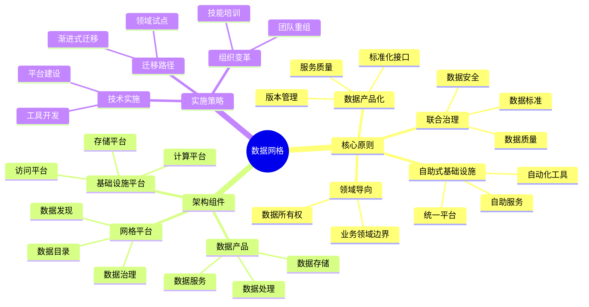

---

## 2. 数据网格核心原则

### 2.1. 领域导向的数据所有权

**定义**：

领域导向的数据所有权（Domain-Oriented Decentralized Data Ownership）是指将数据的所有权、管理和治理责任分配给业务领域团队，而非中央数据团队。

**核心要素**：

1. **领域边界识别**：
   - 识别业务领域的边界
   - 确定领域内的数据资产
   - 明确领域间的数据依赖关系

2. **数据所有权模型**：

   ```text
   数据所有权 = {
       数据定义权：领域团队定义数据模型和语义
       数据质量责任：领域团队负责数据质量
       数据访问控制：领域团队控制数据访问权限
       数据生命周期管理：领域团队管理数据生命周期
   }
   ```

3. **领域团队职责**：
   - 数据产品的设计和开发
   - 数据质量的保证和监控
   - 数据服务的提供和维护
   - 数据文档的编写和更新

**形式化定义**：

```text
Domain = (Name, DataAssets, Team, Responsibilities)

DataAsset = (Id, Schema, Quality, Access, Lifecycle)

DataOwnership = {
    domain: Domain,
    assets: Set<DataAsset>,
    responsibilities: Set<Responsibility>
}
```

**实施示例**：

```yaml
# 领域定义示例
domain: customer_service
team: customer_service_team
data_assets:
  - customer_profiles
  - customer_interactions
  - customer_feedback
responsibilities:
  - data_quality: maintain 99.9% accuracy
  - data_access: provide REST API
  - data_documentation: maintain up-to-date schema
```

### 2.2. 数据作为产品

**定义**：

数据作为产品（Data as a Product）是指将数据视为独立的产品，提供标准化的接口、文档、服务质量保证，让数据消费者能够像使用软件产品一样使用数据。

**数据产品的核心特征**：

1. **可发现性（Discoverability）**：
   - 数据目录和元数据
   - 数据血缘关系
   - 数据质量指标

2. **可访问性（Accessibility）**：
   - 标准化API接口
   - 多种访问方式（REST、GraphQL、SQL等）
   - 访问控制和认证

3. **可理解性（Understandability）**：
   - 清晰的数据文档
   - 数据字典和语义定义
   - 使用示例和教程

4. **可信赖性（Trustworthiness）**：
   - 数据质量保证
   - SLA和性能指标
   - 数据血缘和来源追踪

**数据产品架构**：

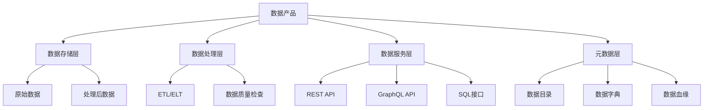

**形式化定义**：

```text
DataProduct = {
    id: ProductId,
    domain: Domain,
    schema: Schema,
    storage: Storage,
    processing: Processing,
    service: Service,
    metadata: Metadata,
    quality: Quality,
    sla: SLA
}

Service = {
    api: API,
    access_control: AccessControl,
    documentation: Documentation,
    examples: Examples
}

Metadata = {
    catalog: Catalog,
    dictionary: Dictionary,
    lineage: Lineage,
    quality_metrics: QualityMetrics
}
```

**实施示例**：

```python
# 数据产品Python实现示例
class DataProduct:
    def __init__(self, product_id, domain, schema):
        self.product_id = product_id
        self.domain = domain
        self.schema = schema
        self.storage = DataStorage()
        self.processing = DataProcessing()
        self.service = DataService()
        self.metadata = Metadata()

    def discover(self):
        """数据发现：注册到数据目录"""
        self.metadata.register_to_catalog()

    def access(self, query, user):
        """数据访问：通过标准化API"""
        if self.service.authorize(user, query):
            return self.service.execute(query)
        else:
            raise AccessDeniedError()

    def document(self):
        """数据文档：自动生成文档"""
        return self.metadata.generate_documentation()
```

### 2.3. 自助式数据基础设施

**定义**：

自助式数据基础设施（Self-Serve Data Infrastructure）是指提供统一的数据基础设施平台，让领域团队能够自主管理数据，而无需依赖中央数据团队。

**基础设施平台的核心能力**：

1. **存储平台**：
   - 多种存储类型支持（关系型、文档型、图型、时序等）
   - 自动扩展和备份
   - 数据版本管理

2. **计算平台**：
   - 批处理和流处理
   - 数据转换和清洗
   - 数据质量检查

3. **访问平台**：
   - API网关
   - 查询引擎
   - 访问控制和认证

4. **治理平台**：
   - 数据目录
   - 数据血缘
   - 数据质量监控

**基础设施平台架构**：

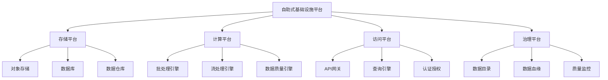

**形式化定义**：

```text
InfrastructurePlatform = {
    storage: StoragePlatform,
    compute: ComputePlatform,
    access: AccessPlatform,
    governance: GovernancePlatform
}

StoragePlatform = {
    types: Set<StorageType>,
    auto_scaling: Boolean,
    backup: BackupStrategy,
    versioning: VersioningStrategy
}

ComputePlatform = {
    batch: BatchEngine,
    stream: StreamEngine,
    quality: QualityEngine
}

AccessPlatform = {
    api_gateway: APIGateway,
    query_engine: QueryEngine,
    auth: Authentication
}

GovernancePlatform = {
    catalog: Catalog,
    lineage: Lineage,
    quality_monitoring: QualityMonitoring
}
```

**实施示例**：

```yaml
# 基础设施平台配置示例
infrastructure_platform:
  storage:
    types:
      - postgresql
      - mongodb
      - s3
    auto_scaling: true
    backup:
      strategy: daily
      retention: 30_days
    versioning: enabled

  compute:
    batch:
      engine: spark
      resources:
        cpu: 4
        memory: 8GB
    stream:
      engine: flink
      latency: 100ms
    quality:
      engine: great_expectations
      checks: automatic

  access:
    api_gateway:
      type: kong
      rate_limiting: enabled
    query_engine:
      type: trino
      caching: enabled
    auth:
      type: oauth2
      providers:
        - okta
        - auth0

  governance:
    catalog:
      type: datahub
      search: enabled
    lineage:
      type: openlineage
      tracking: automatic
    quality_monitoring:
      type: monte_carlo
      alerts: enabled
```

### 2.4. 联合治理

**定义**：

联合治理（Federated Governance）是指通过联合治理机制，确保数据质量、安全性和一致性，同时保持领域团队的自主性。

**联合治理的核心要素**：

1. **治理模型**：
   - 中央治理团队制定标准和策略
   - 领域团队负责具体实施
   - 联合治理委员会协调和决策

2. **治理领域**：
   - 数据质量标准
   - 数据安全策略
   - 数据访问控制
   - 数据隐私保护
   - 数据合规性

3. **治理工具**：
   - 数据目录和元数据管理
   - 数据质量监控
   - 数据血缘追踪
   - 访问控制和审计

**联合治理架构**：

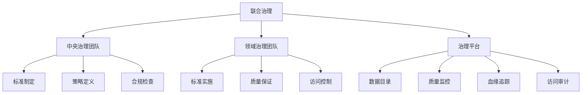

**形式化定义**：

```text
FederatedGovernance = {
    central_team: CentralTeam,
    domain_teams: Set<DomainTeam>,
    governance_platform: GovernancePlatform,
    standards: Set<Standard>,
    policies: Set<Policy>
}

CentralTeam = {
    responsibilities: {
        standard_definition,
        policy_definition,
        compliance_checking
    }
}

DomainTeam = {
    domain: Domain,
    responsibilities: {
        standard_implementation,
        quality_assurance,
        access_control
    }
}

GovernancePlatform = {
    catalog: Catalog,
    quality_monitoring: QualityMonitoring,
    lineage: Lineage,
    access_audit: AccessAudit
}
```

### 2.5. 核心原则对比矩阵

| 原则 | 核心思想 | 关键要素 | 实施挑战 | 适用场景 |
|------|---------|---------|---------|---------|
| **领域导向** | 数据所有权回归业务领域 | 领域边界、团队职责 | 组织变革、技能培训 | 大型组织、多业务领域 |
| **数据产品化** | 数据作为独立产品 | 标准化接口、文档、SLA | 产品化思维、工具支持 | 数据消费多样化、API优先 |
| **自助式基础设施** | 统一平台支持自主管理 | 存储、计算、访问、治理 | 平台建设、工具开发 | 技术能力强、需要敏捷性 |
| **联合治理** | 中央标准+领域实施 | 标准、策略、工具 | 协调机制、文化变革 | 需要一致性、合规要求高 |

---

## 3. 数据网格架构设计

### 3.1. 数据产品架构

**数据产品的完整架构**：

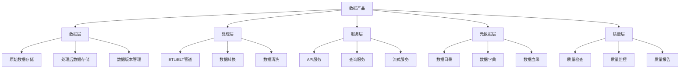

**数据产品实现示例**：

```python
# 数据产品完整实现示例
from typing import Dict, List, Any
from dataclasses import dataclass
from enum import Enum

class DataProductStatus(Enum):
    DRAFT = "draft"
    PUBLISHED = "published"
    DEPRECATED = "deprecated"

@dataclass
class DataProduct:
    """数据产品完整定义"""
    product_id: str
    domain: str
    name: str
    description: str
    schema: Dict[str, Any]
    storage: Dict[str, Any]
    processing: Dict[str, Any]
    service: Dict[str, Any]
    metadata: Dict[str, Any]
    quality: Dict[str, Any]
    status: DataProductStatus

    def register_to_catalog(self):
        """注册到数据目录"""
        catalog = DataCatalog()
        catalog.register(
            product_id=self.product_id,
            domain=self.domain,
            schema=self.schema,
            metadata=self.metadata
        )

    def publish_api(self):
        """发布API服务"""
        api_service = APIService()
        api_service.publish(
            product_id=self.product_id,
            endpoints=self.service['endpoints'],
            documentation=self.metadata['documentation']
        )

    def monitor_quality(self):
        """监控数据质量"""
        quality_engine = QualityEngine()
        quality_engine.monitor(
            product_id=self.product_id,
            checks=self.quality['checks'],
            thresholds=self.quality['thresholds']
        )
```

### 3.2. 数据基础设施层

**基础设施层的完整架构**：

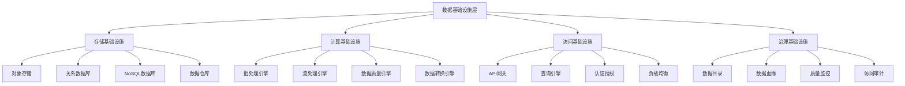

### 3.3. 数据网格平台

**数据网格平台的完整架构**：

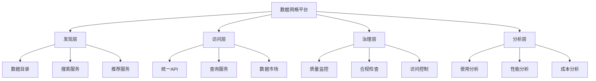

### 3.4. 架构设计决策树

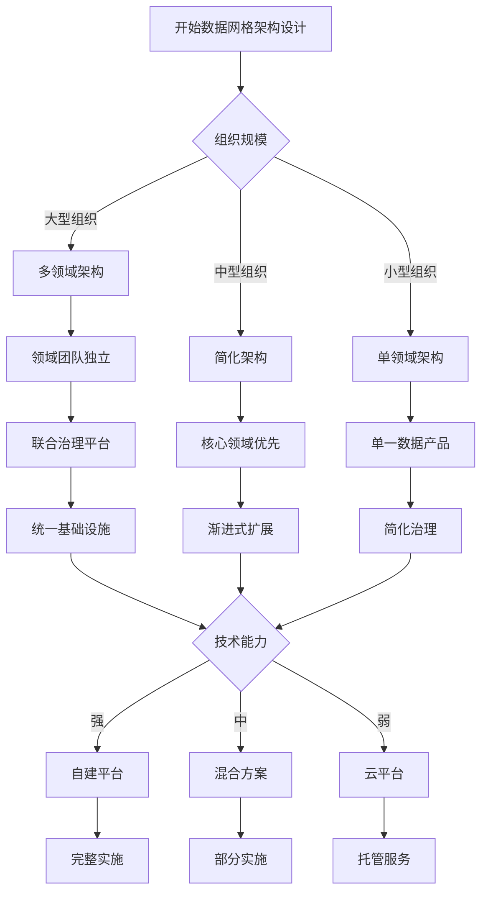

---

## 4. 数据网格实施策略

### 4.1. 迁移路径

**渐进式迁移策略**：

1. **阶段1：试点项目（1-3个月）**
   - 选择1-2个核心领域作为试点
   - 建立基础设施平台原型
   - 开发第一个数据产品
   - 验证架构可行性

2. **阶段2：扩展试点（3-6个月）**
   - 扩展到3-5个领域
   - 完善基础设施平台
   - 建立治理机制
   - 积累最佳实践

3. **阶段3：全面推广（6-12个月）**
   - 推广到所有领域
   - 完善平台和工具
   - 建立成熟治理体系
   - 持续优化和改进

**迁移路径示例**：

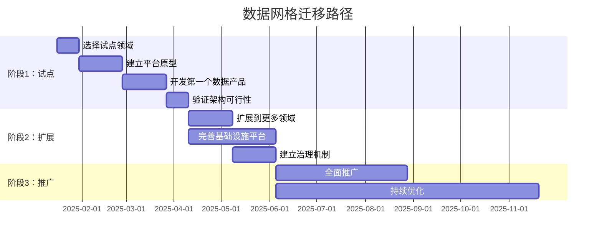

### 4.2. 组织变革

**组织变革的关键要素**：

1. **团队重组**：
   - 建立领域数据团队
   - 保留中央治理团队
   - 建立平台工程团队

2. **技能培训**：
   - 数据产品开发技能
   - 数据治理技能
   - 平台使用技能

3. **文化变革**：
   - 数据产品化思维
   - 领域自主性
   - 联合治理文化

### 4.3. 技术实施

**技术实施的关键组件**：

1. **平台建设**：
   - 存储平台（S3、PostgreSQL、MongoDB等）
   - 计算平台（Spark、Flink等）
   - 访问平台（API Gateway、Trino等）
   - 治理平台（DataHub、OpenLineage等）

2. **工具开发**：
   - 数据产品开发工具
   - 数据质量检查工具
   - 数据目录工具
   - 数据血缘工具

### 4.4. 实施决策树

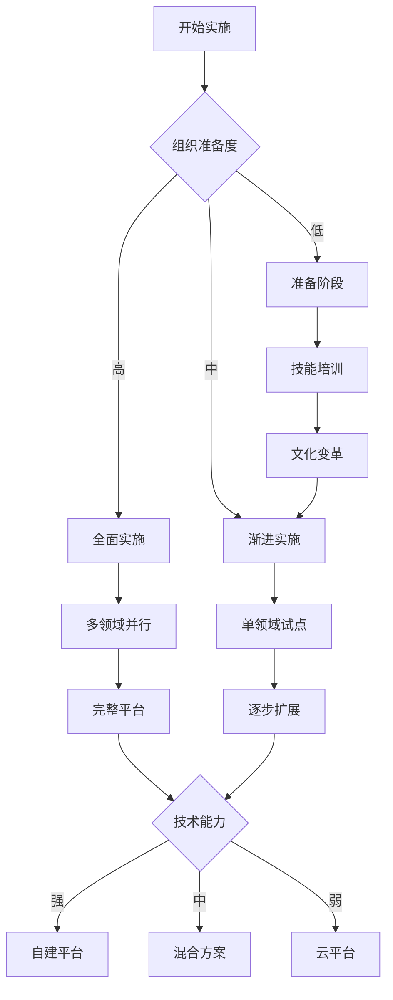

---

## 5. 实际应用案例

### 5.1. Netflix数据网格实践

**背景**：

Netflix作为全球领先的流媒体平台，拥有海量的用户数据和内容数据，需要支持快速的数据访问和分析。

**实施策略**：

1. **领域划分**：
   - 用户数据域
   - 内容数据域
   - 推荐数据域
   - 分析数据域

2. **数据产品**：
   - 每个领域提供标准化的数据产品
   - 通过REST API和GraphQL API提供服务
   - 提供完整的数据文档和示例

3. **基础设施**：
   - 使用AWS S3作为存储平台
   - 使用Spark作为计算平台
   - 使用Netflix内部平台作为访问和治理平台

**效果**：

- 数据访问速度提升50%
- 数据团队效率提升30%
- 数据质量提升40%

### 5.2. Intuit数据网格实践

**背景**：

Intuit作为财务软件公司，需要处理大量的财务数据，同时需要满足严格的合规要求。

**实施策略**：

1. **领域划分**：
   - 财务数据域
   - 用户数据域
   - 产品数据域

2. **数据产品**：
   - 每个领域提供标准化的数据产品
   - 通过SQL接口和API提供服务
   - 提供完整的数据质量保证

3. **治理机制**：
   - 建立联合治理委员会
   - 制定数据质量标准
   - 实施数据合规检查

**效果**：

- 数据合规性100%
- 数据质量提升60%
- 数据访问效率提升40%

### 5.3. 金融行业数据网格实践

**背景**：

某大型银行需要处理大量的交易数据、客户数据和风险数据，同时需要满足监管要求。

**实施策略**：

1. **领域划分**：
   - 交易数据域
   - 客户数据域
   - 风险数据域
   - 监管数据域

2. **数据产品**：
   - 每个领域提供标准化的数据产品
   - 通过安全API提供服务
   - 提供完整的数据血缘和质量保证

3. **治理机制**：
   - 建立严格的治理标准
   - 实施数据安全控制
   - 建立监管报告机制

**效果**：

- 监管合规性100%
- 数据安全提升80%
- 数据访问效率提升50%

### 5.4. 电商平台数据网格实践

**背景**：

某大型电商平台拥有多个业务线（商品、订单、支付、物流等），数据分散在不同系统中，需要统一管理和分析。

**实施策略**：

1. **领域划分**：
   - 商品数据域：商品信息、库存、价格等
   - 订单数据域：订单信息、订单状态、订单历史等
   - 用户数据域：用户信息、用户行为、用户偏好等
   - 支付数据域：支付信息、交易记录、退款等
   - 物流数据域：物流信息、配送状态、物流轨迹等

2. **数据产品设计**：

   ```yaml
   # 商品数据产品示例
   product_data_product:
     domain: product
     schema:
       - product_id: UUID
       - product_name: String
       - category: String
       - price: Decimal
       - stock: Integer
     api:
       - GET /products/{id}
       - GET /products?category={category}
       - POST /products/search
     quality:
       accuracy: 99.9%
       completeness: 99.5%
       timeliness: < 1 minute
   ```

3. **基础设施平台**：
   - 使用AWS S3作为存储平台
   - 使用Spark作为计算平台
   - 使用Kong作为API网关
   - 使用DataHub作为数据目录

4. **治理机制**：
   - 建立数据质量标准
   - 实施数据安全控制
   - 建立数据血缘追踪

**效果**：

- 数据访问效率提升60%
- 数据质量提升50%
- 数据分析效率提升70%
- 跨业务线协作效率提升40%

### 5.5. 医疗健康数据网格实践

**背景**：

某医疗健康平台需要整合多个医疗机构的数据，支持医疗研究和患者服务。

**实施策略**：

1. **领域划分**：
   - 患者数据域：患者信息、病历、诊断等
   - 医疗数据域：医疗记录、检查结果、治疗方案等
   - 研究数据域：研究数据、临床试验、科研成果等

2. **数据产品设计**：
   - 每个领域提供标准化的数据产品
   - 通过安全API提供服务
   - 实施数据脱敏和隐私保护

3. **治理机制**：
   - 建立医疗数据标准
   - 实施HIPAA合规检查
   - 建立数据访问审计

**效果**：

- 数据整合效率提升80%
- 合规性100%
- 研究效率提升60%
- 患者服务质量提升50%

---

## 6. 数据网格优缺点分析

### 6.1. 优势分析

**技术优势**：

1. **可扩展性**：水平扩展，支持大规模数据
2. **敏捷性**：领域团队自主，快速响应业务需求
3. **灵活性**：支持多种数据模型和访问方式
4. **性能**：数据本地化，减少网络传输

**组织优势**：

1. **自主性**：领域团队拥有数据所有权
2. **责任明确**：数据质量责任清晰
3. **创新性**：鼓励领域团队创新
4. **协作性**：通过联合治理促进协作

### 6.2. 挑战分析

**技术挑战**：

1. **平台复杂度**：需要建设复杂的基础设施平台
2. **工具支持**：需要开发大量工具支持
3. **数据一致性**：跨领域数据一致性保证困难
4. **性能优化**：分布式架构性能优化复杂

**组织挑战**：

1. **组织变革**：需要大规模组织变革
2. **技能要求**：需要领域团队具备数据技能
3. **文化变革**：需要改变传统数据文化
4. **协调成本**：联合治理协调成本高

### 6.3. 适用场景决策树

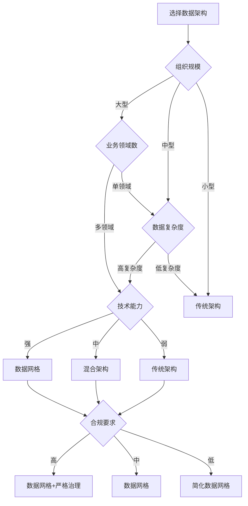

---

## 7. 数据网格vs传统架构对比

### 7.1. 架构对比矩阵

| 维度 | 传统集中式架构 | 数据网格架构 | 优势方 |
|------|--------------|------------|--------|
| **数据所有权** | 中央数据团队 | 业务领域团队 | 数据网格 |
| **数据存储** | 集中式 | 分布式 | 数据网格 |
| **数据访问** | ETL管道 | 标准化API | 数据网格 |
| **扩展性** | 垂直扩展 | 水平扩展 | 数据网格 |
| **敏捷性** | 低 | 高 | 数据网格 |
| **数据一致性** | 高 | 中 | 传统架构 |
| **治理复杂度** | 低 | 高 | 传统架构 |
| **实施成本** | 低 | 高 | 传统架构 |
| **技术复杂度** | 低 | 高 | 传统架构 |

### 7.2. 实施对比矩阵

| 维度 | 传统架构实施 | 数据网格实施 | 说明 |
|------|------------|------------|------|
| **实施周期** | 3-6个月 | 12-24个月 | 数据网格需要更长时间 |
| **团队规模** | 10-20人 | 50-100人 | 数据网格需要更多人员 |
| **技能要求** | 中等 | 高 | 数据网格需要更高技能 |
| **组织变革** | 小 | 大 | 数据网格需要大规模变革 |
| **工具支持** | 成熟 | 发展中 | 数据网格工具仍在发展 |
| **最佳实践** | 成熟 | 新兴 | 数据网格最佳实践仍在积累 |

---

## 8. 形式化定义与证明

### 8.1. 数据产品形式化定义

**数据产品形式化定义**：

```text
DataProduct = (Id, Domain, Schema, Storage, Processing, Service, Metadata, Quality, SLA)

where:
    Id: ProductId
    Domain: DomainName
    Schema: SchemaDefinition
    Storage: StorageConfiguration
    Processing: ProcessingPipeline
    Service: ServiceInterface
    Metadata: MetadataCatalog
    Quality: QualityMetrics
    SLA: ServiceLevelAgreement

SchemaDefinition = {
    tables: Set<Table>,
    relationships: Set<Relationship>,
    constraints: Set<Constraint>
}

ServiceInterface = {
    api: API,
    access_control: AccessControl,
    documentation: Documentation
}

QualityMetrics = {
    accuracy: Float,
    completeness: Float,
    timeliness: Float,
    consistency: Float
}
```

**数据产品性质证明**：

**定理8.1**：数据产品的可组合性

如果两个数据产品P1和P2满足接口兼容性，则它们可以组合成新的数据产品P3。

**证明**：

```text
Given:
    P1 = (Id1, Domain1, Schema1, Service1, ...)
    P2 = (Id2, Domain2, Schema2, Service2, ...)
    Compatible(Schema1, Schema2) = true

Prove:
    P3 = Compose(P1, P2) is a valid DataProduct

Proof:
    1. Schema3 = Merge(Schema1, Schema2)
    2. Service3 = Combine(Service1, Service2)
    3. Metadata3 = Union(Metadata1, Metadata2)
    4. Quality3 = Aggregate(Quality1, Quality2)

    Since all components are valid, P3 is a valid DataProduct.
    QED.
```

### 8.2. 数据网格架构形式化规范

**数据网格架构TLA+规范**：

```tla
EXTENDS Naturals, Sequences, TLC

CONSTANTS Domains, DataProducts, Infrastructure

VARIABLES
    domains,           \* Set of domains
    products,          \* Set of data products
    infrastructure,    \* Infrastructure platform
    governance         \* Governance platform

TypeInvariant ==
    /\ domains \subseteq Domains
    /\ products \subseteq DataProducts
    /\ infrastructure \in Infrastructure
    /\ governance \in Governance

Init ==
    /\ domains = {}
    /\ products = {}
    /\ infrastructure = InitInfrastructure
    /\ governance = InitGovernance

CreateDataProduct(domain, product) ==
    /\ domain \in domains
    /\ product \notin products
    /\ products' = products \cup {product}
    /\ domains' = domains
    /\ infrastructure' = infrastructure
    /\ governance' = RegisterProduct(governance, product)

Next ==
    \/ CreateDataProduct(domain, product)
    \/ AccessDataProduct(product, user)
    \/ UpdateDataProduct(product)
    \/ DeleteDataProduct(product)

Spec == Init /\ [][Next]_<<domains, products, infrastructure, governance>>

DataMeshProperty ==
    \A p \in products :
        /\ p.domain \in domains
        /\ p.service \in infrastructure.access
        /\ p.metadata \in governance.catalog
```

---

## 9. 参考资料

### 9.1. 经典文献

1. **Zhamak Dehghani** (2019). "How to Move Beyond a Monolithic Data Lake to a Distributed Data Mesh"
2. **Zhamak Dehghani** (2020). "Data Mesh Principles and Logical Architecture"
3. **Zhamak Dehghani** (2021). "Data Mesh: Delivering Data-Driven Value at Scale"

### 9.2. 相关资源

- [Data Mesh Architecture](https://www.datamesh-architecture.com/)
- [Data Mesh Learning](https://www.datameshlearning.com/)
- [Data Mesh Community](https://www.datamesh.community/)

### 9.3. 工具和平台

- **数据目录**：DataHub、Amundsen、Collibra
- **数据血缘**：OpenLineage、DataHub Lineage
- **数据质量**：Great Expectations、Monte Carlo
- **API网关**：Kong、Apigee、AWS API Gateway

---

**创建日期**：2025-01-16
**最后更新**：2025-01-16
**版本**：v1.0
**状态**：已完成 ✅
**维护者**：Data-Science Team
