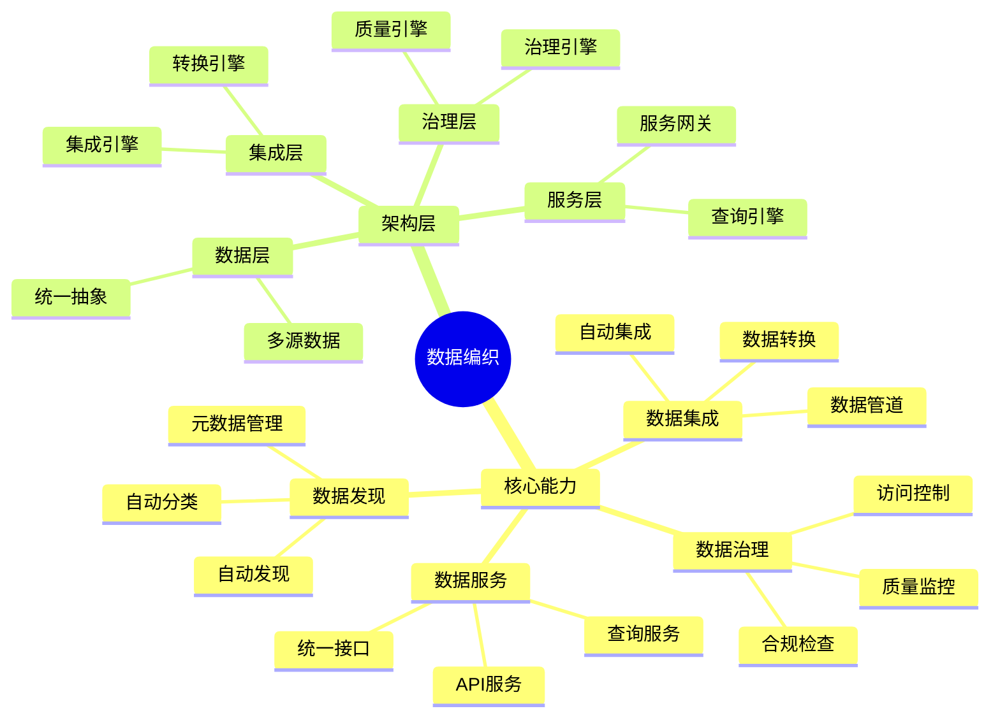
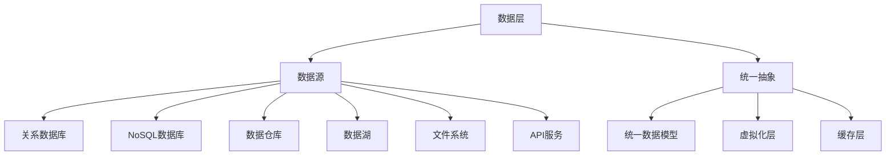
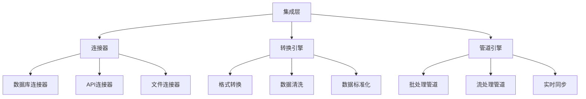
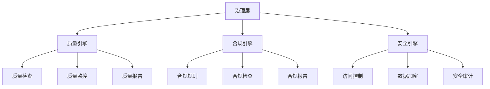
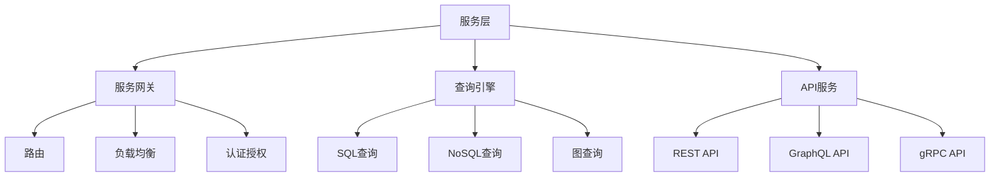
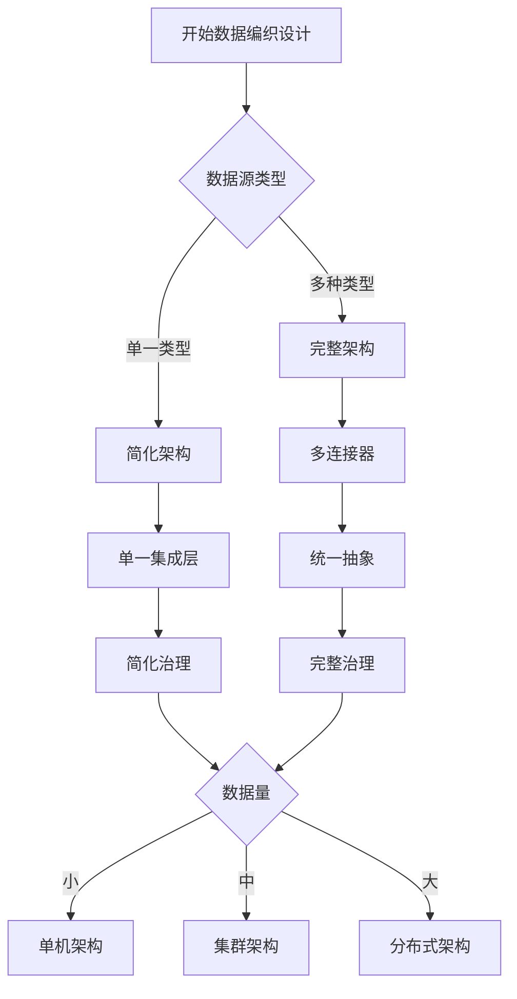
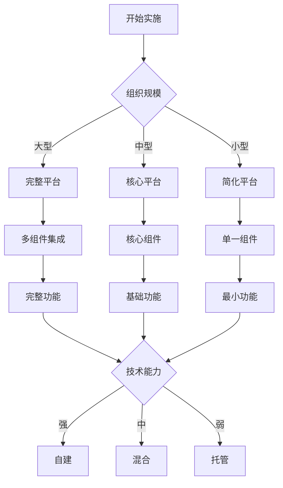
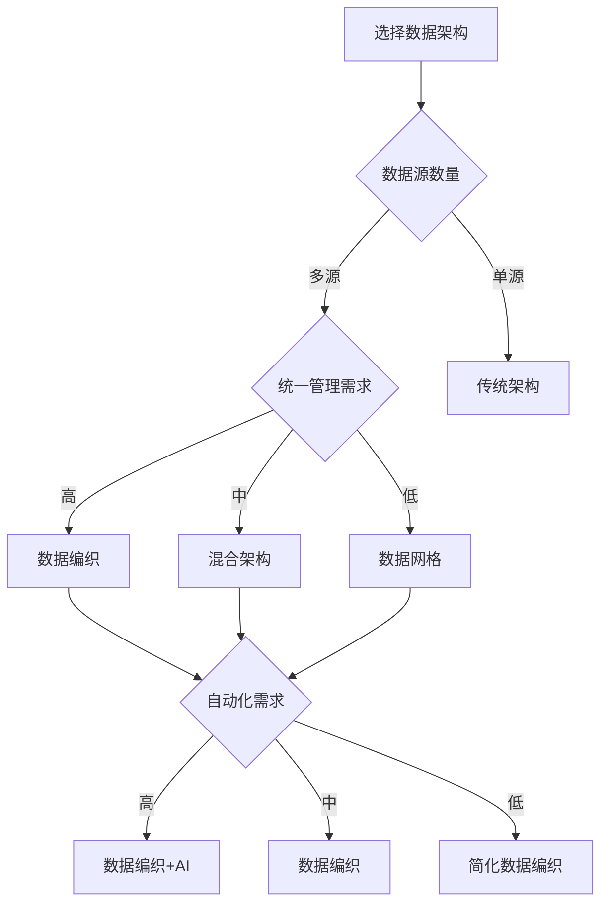

# 数据编织理论：统一数据管理的智能架构

> **创建日期**：2025-01-16
> **最后更新**：2025-01-16
> **版本**：v1.0
> **状态**：已完成 ✅
> **优先级**：P0

---

## 📋 目录

- [数据编织理论：统一数据管理的智能架构](#数据编织理论统一数据管理的智能架构)
  - [📋 目录](#-目录)
  - [1. 概述](#1-概述)
    - [1.1. 数据编织的核心思想](#11-数据编织的核心思想)
    - [1.2. 数据编织vs数据网格](#12-数据编织vs数据网格)
    - [1.3. 数据编织架构思维导图](#13-数据编织架构思维导图)
  - [2. 数据编织核心能力](#2-数据编织核心能力)
    - [2.1. 数据发现与目录](#21-数据发现与目录)
    - [2.2. 数据集成与转换](#22-数据集成与转换)
    - [2.3. 数据治理与质量](#23-数据治理与质量)
    - [2.4. 数据安全与隐私](#24-数据安全与隐私)
    - [2.5. 核心能力对比矩阵](#25-核心能力对比矩阵)
  - [3. 数据编织架构设计](#3-数据编织架构设计)
    - [3.1. 数据层](#31-数据层)
    - [3.2. 集成层](#32-集成层)
    - [3.3. 治理层](#33-治理层)
    - [3.4. 服务层](#34-服务层)
    - [3.5. 架构设计决策树](#35-架构设计决策树)
  - [4. 数据编织实施方法](#4-数据编织实施方法)
    - [4.1. 实施路径](#41-实施路径)
    - [4.2. 技术选型](#42-技术选型)
    - [4.3. 实施决策树](#43-实施决策树)
  - [5. 实际应用案例](#5-实际应用案例)
    - [5.1. 企业数据编织实践](#51-企业数据编织实践)
    - [5.2. 云原生数据编织实践](#52-云原生数据编织实践)
  - [6. 数据编织优缺点分析](#6-数据编织优缺点分析)
    - [6.1. 优势分析](#61-优势分析)
    - [6.2. 挑战分析](#62-挑战分析)
    - [6.3. 适用场景决策树](#63-适用场景决策树)
  - [7. 数据编织vs数据网格对比](#7-数据编织vs数据网格对比)
    - [7.1. 架构对比矩阵](#71-架构对比矩阵)
    - [7.2. 实施对比矩阵](#72-实施对比矩阵)
  - [8. 形式化定义与证明](#8-形式化定义与证明)
    - [8.1. 数据编织架构形式化定义](#81-数据编织架构形式化定义)
    - [8.2. 数据集成形式化规范](#82-数据集成形式化规范)
  - [9. 参考资料](#9-参考资料)
    - [9.1. 经典文献](#91-经典文献)
    - [9.2. 相关资源](#92-相关资源)
    - [9.3. 工具和平台](#93-工具和平台)

---

## 1. 概述

数据编织（Data Fabric）是由Gartner在2020年提出的数据管理架构概念，旨在通过统一的数据管理平台，实现跨系统、跨云的数据发现、集成、治理和访问。

### 1.1. 数据编织的核心思想

**核心思想**：

1. **统一数据管理**：通过统一平台管理所有数据资产
2. **智能数据发现**：自动发现和分类数据资产
3. **自动化集成**：自动化数据集成和转换
4. **主动治理**：主动数据治理和质量保证
5. **统一访问**：提供统一的数据访问接口

**关键概念**：

- **数据编织层**：统一的数据管理抽象层
- **数据目录**：自动化的数据资产目录
- **数据管道**：自动化的数据集成管道
- **数据治理**：主动的数据治理机制
- **数据服务**：统一的数据服务接口

### 1.2. 数据编织vs数据网格

| 维度 | 数据网格 | 数据编织 |
|------|---------|---------|
| **架构模式** | 去中心化 | 统一平台 |
| **数据所有权** | 领域团队 | 中央管理 |
| **数据存储** | 分布式 | 统一抽象 |
| **数据访问** | 领域API | 统一服务 |
| **治理模式** | 联合治理 | 中央治理 |
| **适用场景** | 大型组织、多领域 | 统一管理、跨系统 |

### 1.3. 数据编织架构思维导图



---

## 2. 数据编织核心能力

### 2.1. 数据发现与目录

**数据发现能力**：

1. **自动发现**：
   - 自动扫描数据源
   - 自动识别数据模式
   - 自动提取元数据

2. **自动分类**：
   - 基于ML的数据分类
   - 敏感数据识别
   - 数据质量评估

3. **数据目录**：
   - 统一的数据资产目录
   - 数据血缘关系
   - 数据使用情况

**形式化定义**：

```text
DataDiscovery = {
    scan: ScanEngine,
    classify: ClassifyEngine,
    catalog: Catalog
}

ScanEngine = {
    sources: Set<DataSource>,
    frequency: Frequency,
    metadata: MetadataExtractor
}

ClassifyEngine = {
    ml_model: MLModel,
    categories: Set<Category>,
    confidence: Float
}

Catalog = {
    assets: Set<DataAsset>,
    lineage: LineageGraph,
    usage: UsageMetrics
}
```

### 2.2. 数据集成与转换

**数据集成能力**：

1. **自动集成**：
   - 自动识别数据源
   - 自动建立连接
   - 自动数据映射

2. **数据转换**：
   - 格式转换
   - 数据清洗
   - 数据标准化

3. **数据管道**：
   - 批处理管道
   - 流处理管道
   - 实时同步

**形式化定义**：

```text
DataIntegration = {
    connectors: Set<Connector>,
    transformation: TransformationEngine,
    pipeline: PipelineEngine
}

Connector = {
    source_type: SourceType,
    connection: Connection,
    schema: Schema
}

TransformationEngine = {
    rules: Set<TransformationRule>,
    functions: Set<Function>,
    quality: QualityCheck
}

PipelineEngine = {
    type: PipelineType,  // batch, stream, real-time
    schedule: Schedule,
    monitoring: Monitoring
}
```

### 2.3. 数据治理与质量

**数据治理能力**：

1. **质量监控**：
   - 实时质量检查
   - 质量指标监控
   - 质量报告生成

2. **合规检查**：
   - 数据合规性检查
   - 隐私保护检查
   - 安全审计

3. **访问控制**：
   - 细粒度访问控制
   - 数据脱敏
   - 访问审计

**形式化定义**：

```text
DataGovernance = {
    quality: QualityEngine,
    compliance: ComplianceEngine,
    access_control: AccessControl
}

QualityEngine = {
    checks: Set<QualityCheck>,
    metrics: Set<QualityMetric>,
    alerts: AlertSystem
}

ComplianceEngine = {
    rules: Set<ComplianceRule>,
    checks: Set<ComplianceCheck>,
    reports: ReportGenerator
}

AccessControl = {
    policies: Set<AccessPolicy>,
    encryption: Encryption,
    audit: AuditLog
}
```

### 2.4. 数据安全与隐私

**安全与隐私能力**：

1. **数据加密**：
   - 静态数据加密
   - 传输数据加密
   - 密钥管理

2. **数据脱敏**：
   - 敏感数据识别
   - 自动脱敏
   - 脱敏策略管理

3. **隐私保护**：
   - 数据匿名化
   - 差分隐私
   - 隐私合规检查

### 2.5. 核心能力对比矩阵

| 能力 | 数据发现 | 数据集成 | 数据治理 | 数据安全 | 重要性 |
|------|---------|---------|---------|---------|--------|
| **自动发现** | ⭐⭐⭐⭐⭐ | ⭐⭐⭐ | ⭐⭐⭐ | ⭐⭐ | 高 |
| **自动集成** | ⭐⭐ | ⭐⭐⭐⭐⭐ | ⭐⭐⭐ | ⭐⭐⭐ | 高 |
| **质量监控** | ⭐⭐⭐ | ⭐⭐⭐ | ⭐⭐⭐⭐⭐ | ⭐⭐ | 高 |
| **访问控制** | ⭐⭐ | ⭐⭐ | ⭐⭐⭐ | ⭐⭐⭐⭐⭐ | 高 |
| **合规检查** | ⭐⭐ | ⭐⭐ | ⭐⭐⭐⭐⭐ | ⭐⭐⭐⭐ | 中 |

---

## 3. 数据编织架构设计

### 3.1. 数据层

**数据层架构**：



### 3.2. 集成层

**集成层架构**：



### 3.3. 治理层

**治理层架构**：



### 3.4. 服务层

**服务层架构**：



### 3.5. 架构设计决策树



---

## 4. 数据编织实施方法

### 4.1. 实施路径

**渐进式实施策略**：

1. **阶段1：数据发现（1-2个月）**
   - 部署数据发现工具
   - 扫描和分类数据源
   - 建立数据目录

2. **阶段2：数据集成（2-3个月）**
   - 部署集成平台
   - 建立数据管道
   - 实现数据转换

3. **阶段3：数据治理（2-3个月）**
   - 部署治理平台
   - 建立治理规则
   - 实施质量监控

4. **阶段4：数据服务（1-2个月）**
   - 部署服务网关
   - 提供统一接口
   - 实现访问控制

### 4.2. 技术选型

**技术选型矩阵**：

| 组件 | 开源方案 | 商业方案 | 推荐度 |
|------|---------|---------|--------|
| **数据目录** | DataHub、Amundsen | Collibra、Alation | ⭐⭐⭐⭐ |
| **数据集成** | Airbyte、dbt | Informatica、Talend | ⭐⭐⭐⭐ |
| **数据治理** | Great Expectations | Collibra、Alation | ⭐⭐⭐ |
| **数据服务** | Trino、Presto | Denodo、Dremio | ⭐⭐⭐⭐ |

### 4.3. 实施决策树



---

## 5. 实际应用案例

### 5.1. 企业数据编织实践

**背景**：

某大型企业拥有多个业务系统，数据分散在不同系统中，需要统一管理和访问。

**实施策略**：

1. **数据发现**：
   - 使用DataHub建立数据目录
   - 自动扫描所有数据源
   - 建立数据血缘关系

2. **数据集成**：
   - 使用Airbyte建立数据管道
   - 实现数据自动同步
   - 建立数据转换规则

3. **数据治理**：
   - 使用Great Expectations进行质量检查
   - 建立治理规则
   - 实施质量监控

4. **数据服务**：
   - 使用Trino提供统一查询接口
   - 实现统一API服务
   - 实施访问控制

**效果**：

- 数据发现效率提升80%
- 数据集成时间减少60%
- 数据质量提升50%
- 数据访问效率提升70%

### 5.2. 云原生数据编织实践

**背景**：

某云原生企业需要管理跨云、跨区域的数据，实现统一的数据管理。

**实施策略**：

1. **多云支持**：
   - 支持AWS、Azure、GCP
   - 统一数据抽象
   - 跨云数据同步

2. **容器化部署**：
   - 使用Kubernetes部署
   - 实现弹性扩展
   - 实现高可用

3. **服务化架构**：
   - 微服务架构
   - API优先
   - 服务网格

**效果**：

- 跨云数据访问效率提升60%
- 系统可用性达到99.9%
- 运维成本降低40%

---

## 6. 数据编织优缺点分析

### 6.1. 优势分析

**技术优势**：

1. **统一管理**：统一平台管理所有数据
2. **自动化**：自动化发现、集成、治理
3. **智能化**：基于ML的智能分类和推荐
4. **可扩展性**：支持大规模数据管理

**组织优势**：

1. **效率提升**：减少手动操作，提高效率
2. **质量保证**：主动治理，保证数据质量
3. **合规性**：自动合规检查，保证合规性
4. **成本降低**：减少重复工作，降低成本

### 6.2. 挑战分析

**技术挑战**：

1. **平台复杂度**：需要建设复杂的统一平台
2. **数据源多样性**：需要支持多种数据源
3. **性能优化**：统一抽象可能影响性能
4. **数据一致性**：跨系统数据一致性保证困难

**组织挑战**：

1. **实施成本**：需要大量投资
2. **技能要求**：需要高技能团队
3. **组织变革**：需要组织支持
4. **工具成熟度**：部分工具仍在发展中

### 6.3. 适用场景决策树



---

## 7. 数据编织vs数据网格对比

### 7.1. 架构对比矩阵

| 维度 | 数据网格 | 数据编织 | 优势方 |
|------|---------|---------|--------|
| **架构模式** | 去中心化 | 统一平台 | 各有优势 |
| **数据所有权** | 领域团队 | 中央管理 | 数据网格 |
| **数据发现** | 手动/半自动 | 全自动 | 数据编织 |
| **数据集成** | 领域自主 | 统一集成 | 数据编织 |
| **数据治理** | 联合治理 | 中央治理 | 各有优势 |
| **自动化程度** | 中 | 高 | 数据编织 |
| **灵活性** | 高 | 中 | 数据网格 |
| **一致性** | 中 | 高 | 数据编织 |

### 7.2. 实施对比矩阵

| 维度 | 数据网格实施 | 数据编织实施 | 说明 |
|------|------------|------------|------|
| **实施周期** | 12-24个月 | 6-12个月 | 数据编织实施更快 |
| **团队规模** | 50-100人 | 20-50人 | 数据编织需要更少人员 |
| **技能要求** | 高 | 中-高 | 数据编织技能要求稍低 |
| **组织变革** | 大 | 中 | 数据编织组织变革较小 |
| **工具支持** | 发展中 | 较成熟 | 数据编织工具更成熟 |
| **最佳实践** | 新兴 | 较成熟 | 数据编织最佳实践更成熟 |

---

## 8. 形式化定义与证明

### 8.1. 数据编织架构形式化定义

**数据编织架构形式化定义**：

```text
DataFabric = (Discovery, Integration, Governance, Service)

where:
    Discovery = (ScanEngine, ClassifyEngine, Catalog)
    Integration = (Connectors, Transformation, Pipeline)
    Governance = (Quality, Compliance, Security)
    Service = (Gateway, QueryEngine, API)

ScanEngine = {
    sources: Set<DataSource>,
    frequency: Frequency,
    metadata: MetadataExtractor
}

Integration = {
    connectors: Set<Connector>,
    transformation: TransformationEngine,
    pipeline: PipelineEngine
}

Governance = {
    quality: QualityEngine,
    compliance: ComplianceEngine,
    security: SecurityEngine
}

Service = {
    gateway: ServiceGateway,
    query: QueryEngine,
    api: APIService
}
```

### 8.2. 数据集成形式化规范

**数据集成TLA+规范**：

```tla
EXTENDS Naturals, Sequences, TLC

CONSTANTS DataSources, Transformations, Targets

VARIABLES
    sources,          \* Set of data sources
    transformations,  \* Set of transformations
    targets,          \* Set of targets
    pipelines         \* Set of pipelines

TypeInvariant ==
    /\ sources \subseteq DataSources
    /\ transformations \subseteq Transformations
    /\ targets \subseteq Targets
    /\ pipelines \subseteq Pipelines

Init ==
    /\ sources = {}
    /\ transformations = {}
    /\ targets = {}
    /\ pipelines = {}

CreatePipeline(source, transformation, target) ==
    /\ source \in sources
    /\ transformation \in transformations
    /\ target \in targets
    /\ pipelines' = pipelines \cup {Pipeline(source, transformation, target)}
    /\ UNCHANGED <<sources, transformations, targets>>

Next ==
    \/ CreatePipeline(source, transformation, target)
    \/ ExecutePipeline(pipeline)
    \/ MonitorPipeline(pipeline)

Spec == Init /\ [][Next]_<<sources, transformations, targets, pipelines>>

DataFabricProperty ==
    \A p \in pipelines :
        /\ p.source \in sources
        /\ p.transformation \in transformations
        /\ p.target \in targets
        /\ p.status \in {active, completed, failed}
```

---

## 9. 参考资料

### 9.1. 经典文献

1. **Gartner** (2020). "Data Fabric: The Future of Data Management"
2. **Gartner** (2021). "How to Build a Data Fabric"
3. **Gartner** (2022). "Data Fabric Architecture Patterns"

### 9.2. 相关资源

- [Gartner Data Fabric](https://www.gartner.com/en/information-technology/glossary/data-fabric)
- [Data Fabric Architecture](https://www.datamesh-architecture.com/data-fabric)

### 9.3. 工具和平台

- **数据目录**：DataHub、Amundsen、Collibra
- **数据集成**：Airbyte、dbt、Informatica
- **数据治理**：Great Expectations、Collibra
- **数据服务**：Trino、Presto、Denodo

---

**创建日期**：2025-01-16
**最后更新**：2025-01-16
**版本**：v1.0
**状态**：已完成 ✅
**维护者**：Data-Science Team
