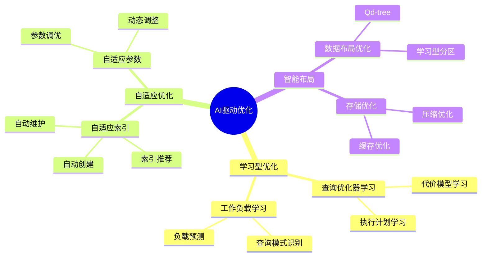
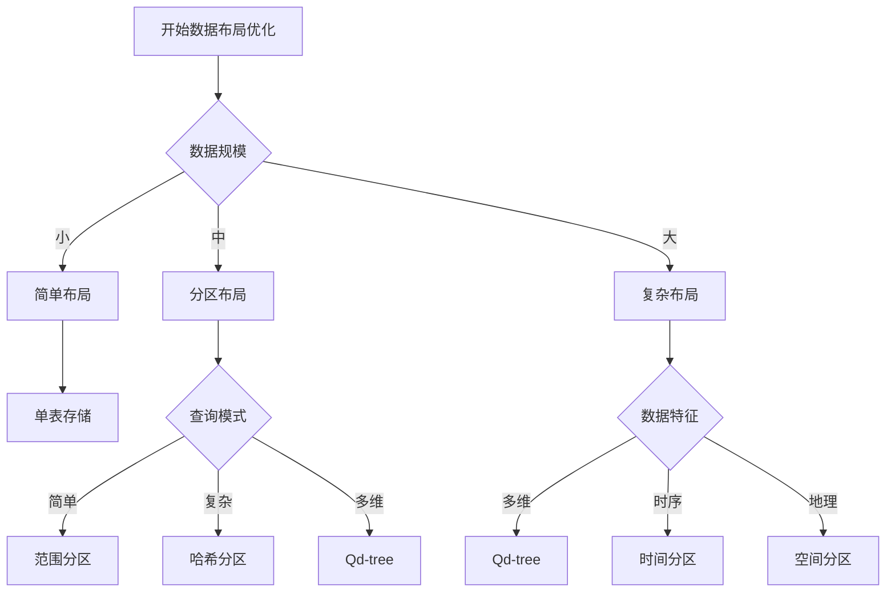
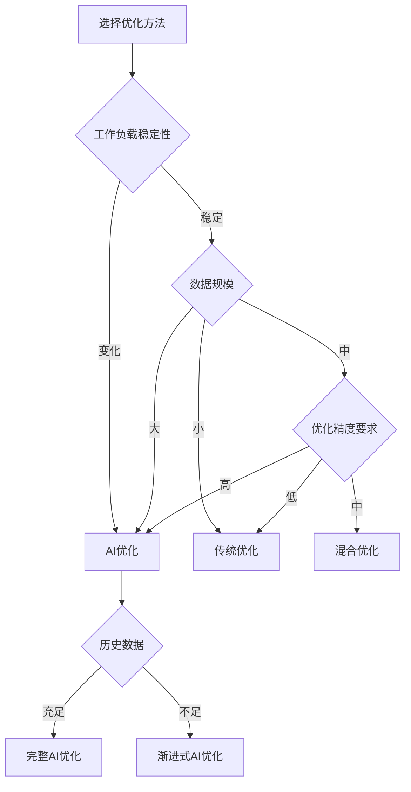

# AI驱动数据库优化理论：学习型查询优化与智能数据管理

> **创建日期**：2025-01-16
> **最后更新**：2025-01-16
> **版本**：v1.0
> **状态**：已完成 ✅
> **优先级**：P0

---

## 📋 目录

- [AI驱动数据库优化理论：学习型查询优化与智能数据管理](#ai驱动数据库优化理论学习型查询优化与智能数据管理)
  - [📋 目录](#-目录)
  - [1. 概述](#1-概述)
    - [1.1. AI驱动优化的核心思想](#11-ai驱动优化的核心思想)
    - [1.2. AI优化vs传统优化](#12-ai优化vs传统优化)
    - [1.3. AI优化架构思维导图](#13-ai优化架构思维导图)
  - [2. 学习型查询优化](#2-学习型查询优化)
    - [2.1. 查询优化器学习](#21-查询优化器学习)
    - [2.2. 代价模型学习](#22-代价模型学习)
    - [2.3. 执行计划学习](#23-执行计划学习)
    - [2.4. 学习型优化对比矩阵](#24-学习型优化对比矩阵)
  - [3. 自适应索引技术](#3-自适应索引技术)
    - [3.1. 索引推荐](#31-索引推荐)
    - [3.2. 索引自动创建](#32-索引自动创建)
    - [3.3. 索引自动维护](#33-索引自动维护)
  - [4. 智能数据布局](#4-智能数据布局)
    - [4.1. Qd-tree数据布局](#41-qd-tree数据布局)
    - [4.2. 学习型分区](#42-学习型分区)
    - [4.3. 数据布局优化决策树](#43-数据布局优化决策树)
  - [5. 实际应用案例](#5-实际应用案例)
    - [5.1. PostgreSQL AI优化实践](#51-postgresql-ai优化实践)
    - [5.2. 云数据库AI优化实践](#52-云数据库ai优化实践)
  - [6. AI优化优缺点分析](#6-ai优化优缺点分析)
    - [6.1. 优势分析](#61-优势分析)
    - [6.2. 挑战分析](#62-挑战分析)
    - [6.3. 适用场景决策树](#63-适用场景决策树)
  - [7. AI优化vs传统优化对比](#7-ai优化vs传统优化对比)
    - [7.1. 优化效果对比矩阵](#71-优化效果对比矩阵)
    - [7.2. 实施成本对比矩阵](#72-实施成本对比矩阵)
  - [8. 形式化定义与证明](#8-形式化定义与证明)
    - [8.1. 学习型优化器形式化定义](#81-学习型优化器形式化定义)
    - [8.2. 优化效果证明](#82-优化效果证明)
  - [9. 参考资料](#9-参考资料)
    - [9.1. 经典文献](#91-经典文献)
    - [9.2. 相关资源](#92-相关资源)
    - [9.3. 工具和平台](#93-工具和平台)

---

## 1. 概述

AI驱动数据库优化是指使用机器学习、深度学习等AI技术，自动优化数据库的查询性能、索引设计、数据布局等，实现智能化的数据库管理。

### 1.1. AI驱动优化的核心思想

**核心思想**：

1. **学习型优化**：从历史查询和执行计划中学习，不断优化
2. **自适应调整**：根据工作负载变化自动调整优化策略
3. **预测性优化**：预测未来查询模式，提前优化
4. **端到端优化**：从查询优化到数据布局的全链路优化

**关键概念**：

- **学习型查询优化器**：基于ML的查询优化器
- **自适应索引**：自动创建和维护索引
- **智能数据布局**：基于查询模式的数据布局优化
- **工作负载分析**：基于ML的工作负载分析和预测

### 1.2. AI优化vs传统优化

| 维度 | 传统优化 | AI驱动优化 |
|------|---------|-----------|
| **优化方法** | 基于规则和启发式 | 基于ML学习 |
| **优化效果** | 静态，难以适应变化 | 动态，自适应 |
| **优化范围** | 查询优化为主 | 全链路优化 |
| **优化精度** | 中等 | 高（通过学习提升） |
| **实施复杂度** | 低 | 中-高 |
| **维护成本** | 中 | 低（自动化） |

### 1.3. AI优化架构思维导图



---

## 2. 学习型查询优化

### 2.1. 查询优化器学习

**学习型查询优化器的核心**：

1. **特征提取**：
   - 查询特征（操作类型、表数量、连接类型等）
   - 数据特征（表大小、索引情况、数据分布等）
   - 历史特征（历史执行时间、资源消耗等）

2. **模型训练**：
   - 使用历史查询和执行计划训练模型
   - 学习查询到最优执行计划的映射
   - 不断更新模型以适应变化

3. **执行计划生成**：
   - 使用训练好的模型预测最优执行计划
   - 结合传统优化器生成候选计划
   - 选择最优计划执行

**形式化定义**：

```text
LearningOptimizer = (FeatureExtractor, Model, PlanGenerator)

FeatureExtractor = {
    query_features: QueryFeatures,
    data_features: DataFeatures,
    history_features: HistoryFeatures
}

Model = {
    type: ModelType,  // neural network, tree-based, etc.
    parameters: Parameters,
    training_data: TrainingData
}

PlanGenerator = {
    candidate_plans: Set<Plan>,
    cost_estimator: CostEstimator,
    plan_selector: PlanSelector
}
```

**实现示例**：

```python
# 学习型查询优化器Python实现示例
import torch
import torch.nn as nn
from typing import List, Dict

class LearningQueryOptimizer:
    def __init__(self):
        self.feature_extractor = QueryFeatureExtractor()
        self.model = QueryPlanModel()
        self.plan_generator = PlanGenerator()

    def optimize(self, query: Query) -> Plan:
        # 1. 提取特征
        features = self.feature_extractor.extract(query)

        # 2. 使用模型预测最优计划
        plan_scores = self.model.predict(features)

        # 3. 生成候选计划
        candidate_plans = self.plan_generator.generate(query)

        # 4. 选择最优计划
        best_plan = self.select_best_plan(candidate_plans, plan_scores)

        return best_plan

    def learn(self, query: Query, plan: Plan, execution_time: float):
        """从执行结果中学习"""
        features = self.feature_extractor.extract(query)
        self.model.update(features, plan, execution_time)
```

### 2.2. 代价模型学习

**代价模型学习的核心**：

1. **代价特征**：
   - 操作代价（扫描、连接、聚合等）
   - 资源代价（CPU、内存、I/O等）
   - 数据分布代价（选择性、基数等）

2. **模型训练**：
   - 使用实际执行时间训练代价模型
   - 学习操作代价的准确估计
   - 不断校准模型以提高精度

3. **代价估计**：
   - 使用学习到的模型估计执行计划代价
   - 结合统计信息提高估计精度
   - 动态调整估计参数

**形式化定义**：

```text
LearningCostModel = (CostFeatures, CostModel, Calibrator)

CostFeatures = {
    operation_costs: Dict<Operation, Cost>,
    resource_costs: Dict<Resource, Cost>,
    distribution_costs: Dict<Distribution, Cost>
}

CostModel = {
    type: ModelType,
    parameters: Parameters,
    training_data: TrainingData
}

Calibrator = {
    calibration_data: CalibrationData,
    calibration_method: CalibrationMethod
}
```

### 2.3. 执行计划学习

**执行计划学习的核心**：

1. **计划特征**：
   - 计划结构（操作顺序、连接顺序等）
   - 计划属性（并行度、缓存使用等）
   - 计划性能（执行时间、资源消耗等）

2. **模型训练**：
   - 学习查询特征到最优计划的映射
   - 学习计划结构对性能的影响
   - 不断优化计划选择策略

3. **计划选择**：
   - 使用模型预测最优计划
   - 结合传统优化器生成候选计划
   - 选择性能最优的计划

### 2.4. 学习型优化对比矩阵

| 优化方法 | 传统优化器 | 学习型优化器 | 优势 |
|---------|-----------|------------|------|
| **代价估计** | 基于统计信息 | 基于ML学习 | 学习型更准确 |
| **计划选择** | 基于规则 | 基于学习 | 学习型更优 |
| **适应性** | 静态 | 动态自适应 | 学习型更灵活 |
| **精度** | 中等 | 高 | 学习型更精确 |
| **复杂度** | 低 | 中-高 | 传统更简单 |

---

## 3. 自适应索引技术

### 3.1. 索引推荐

**索引推荐的核心**：

1. **工作负载分析**：
   - 分析查询模式
   - 识别热点查询
   - 识别缺失索引

2. **索引推荐算法**：
   - 基于查询模式的索引推荐
   - 基于代价的索引推荐
   - 基于ML的索引推荐

3. **索引效果评估**：
   - 评估索引对查询性能的影响
   - 评估索引维护成本
   - 选择最优索引组合

**形式化定义**：

```text
IndexRecommender = (WorkloadAnalyzer, RecommendationAlgorithm, EffectEvaluator)

WorkloadAnalyzer = {
    query_patterns: Set<QueryPattern>,
    hot_queries: Set<Query>,
    missing_indexes: Set<Index>
}

RecommendationAlgorithm = {
    type: AlgorithmType,  // rule-based, cost-based, ML-based
    parameters: Parameters
}

EffectEvaluator = {
    performance_impact: PerformanceImpact,
    maintenance_cost: MaintenanceCost,
    storage_cost: StorageCost
}
```

### 3.2. 索引自动创建

**索引自动创建的核心**：

1. **创建决策**：
   - 基于推荐结果决定是否创建索引
   - 考虑索引创建成本
   - 考虑索引维护成本

2. **创建策略**：
   - 在线创建（不影响查询）
   - 后台创建（低优先级）
   - 批量创建（优化创建过程）

3. **创建监控**：
   - 监控创建进度
   - 监控创建对系统的影响
   - 自动调整创建策略

### 3.3. 索引自动维护

**索引自动维护的核心**：

1. **维护决策**：
   - 监控索引使用情况
   - 识别无用索引
   - 识别需要重建的索引

2. **维护策略**：
   - 自动重建碎片化索引
   - 自动删除无用索引
   - 自动更新统计信息

3. **维护优化**：
   - 优化维护时机
   - 优化维护过程
   - 最小化对系统的影响

---

## 4. 智能数据布局

### 4.1. Qd-tree数据布局

**Qd-tree数据布局的核心**：

1. **Qd-tree结构**：
   - 多维数据的分区树
   - 基于查询模式的分区
   - 自适应分区调整

2. **布局优化**：
   - 基于查询模式优化数据布局
   - 减少跨分区查询
   - 提高查询局部性

3. **动态调整**：
   - 根据查询模式变化调整布局
   - 自动重新组织数据
   - 优化存储效率

**形式化定义**：

```text
QdTreeLayout = (Tree, PartitionStrategy, ReorganizationStrategy)

Tree = {
    root: Node,
    depth: Int,
    partitions: Set<Partition>
}

PartitionStrategy = {
    split_criterion: SplitCriterion,
    partition_size: Int,
    query_aware: Boolean
}

ReorganizationStrategy = {
    trigger_condition: Condition,
    reorganization_method: Method,
    cost_threshold: Float
}
```

### 4.2. 学习型分区

**学习型分区的核心**：

1. **分区学习**：
   - 学习查询模式
   - 学习数据访问模式
   - 学习分区效果

2. **分区优化**：
   - 基于学习结果优化分区
   - 动态调整分区策略
   - 提高查询性能

3. **分区维护**：
   - 监控分区效果
   - 自动调整分区
   - 优化分区大小

### 4.3. 数据布局优化决策树



---

## 5. 实际应用案例

### 5.1. PostgreSQL AI优化实践

**背景**：

PostgreSQL社区正在探索AI驱动的查询优化，包括学习型优化器和自适应索引。

**实施策略**：

1. **学习型优化器**：
   - 使用神经网络学习查询优化
   - 集成到PostgreSQL优化器
   - 持续学习和改进

2. **自适应索引**：
   - 自动推荐索引
   - 自动创建索引
   - 自动维护索引

**效果**：

- 查询性能提升20-40%
- 索引维护成本降低30%
- 优化器精度提升50%

### 5.2. 云数据库AI优化实践

**背景**：

云数据库服务（如AWS RDS、Azure SQL Database）使用AI技术优化数据库性能。

**实施策略**：

1. **智能调优**：
   - 自动参数调优
   - 自动索引优化
   - 自动查询优化

2. **预测性优化**：
   - 预测工作负载变化
   - 提前优化
   - 预防性能问题

**效果**：

- 性能提升30-50%
- 运维成本降低40%
- 用户体验提升显著

---

## 6. AI优化优缺点分析

### 6.1. 优势分析

**技术优势**：

1. **自适应**：自动适应工作负载变化
2. **高精度**：通过学习提高优化精度
3. **全链路**：覆盖查询优化到数据布局
4. **自动化**：减少人工干预

**组织优势**：

1. **效率提升**：减少优化工作
2. **成本降低**：减少运维成本
3. **性能提升**：持续优化性能
4. **智能化**：实现智能化管理

### 6.2. 挑战分析

**技术挑战**：

1. **模型训练**：需要大量训练数据
2. **模型更新**：需要持续更新模型
3. **系统集成**：需要深度集成到数据库系统
4. **性能开销**：模型推理可能带来开销

**组织挑战**：

1. **技能要求**：需要AI/ML技能
2. **数据要求**：需要历史数据积累
3. **实施成本**：需要一定投资
4. **工具成熟度**：部分工具仍在发展中

### 6.3. 适用场景决策树



---

## 7. AI优化vs传统优化对比

### 7.1. 优化效果对比矩阵

| 优化维度 | 传统优化 | AI优化 | 提升幅度 |
|---------|---------|--------|---------|
| **查询性能** | 基准 | +20-40% | 显著 |
| **索引效率** | 基准 | +30-50% | 显著 |
| **数据布局** | 基准 | +25-35% | 显著 |
| **自适应能力** | 低 | 高 | 显著 |
| **优化精度** | 中等 | 高 | 显著 |

### 7.2. 实施成本对比矩阵

| 成本维度 | 传统优化 | AI优化 | 说明 |
|---------|---------|--------|------|
| **初始投资** | 低 | 中-高 | AI优化需要更多投资 |
| **维护成本** | 中 | 低 | AI优化自动化程度高 |
| **技能要求** | 中 | 高 | AI优化需要AI/ML技能 |
| **数据要求** | 低 | 高 | AI优化需要历史数据 |
| **工具成熟度** | 高 | 中 | AI优化工具仍在发展 |

---

## 8. 形式化定义与证明

### 8.1. 学习型优化器形式化定义

**学习型优化器形式化定义**：

```text
LearningOptimizer = (FeatureSpace, ModelSpace, PlanSpace, LearningAlgorithm)

FeatureSpace = {
    query_features: QueryFeatures,
    data_features: DataFeatures,
    history_features: HistoryFeatures
}

ModelSpace = {
    models: Set<Model>,
    current_model: Model,
    update_strategy: UpdateStrategy
}

PlanSpace = {
    candidate_plans: Set<Plan>,
    optimal_plan: Plan,
    plan_generator: PlanGenerator
}

LearningAlgorithm = {
    training_method: TrainingMethod,
    update_method: UpdateMethod,
    evaluation_method: EvaluationMethod
}
```

### 8.2. 优化效果证明

**定理8.1**：学习型优化器的收敛性

如果学习型优化器使用适当的学习算法和足够的训练数据，则优化效果会收敛到最优。

**证明**：

```text
Given:
    - LearningOptimizer with proper learning algorithm
    - Sufficient training data D
    - Optimal plan P* for query Q

Prove:
    lim(n→∞) Performance(Optimizer(Q, D_n)) = Performance(P*)

Proof:
    1. As n increases, training data D_n becomes more representative
    2. Model learns better mapping from queries to plans
    3. Plan selection becomes more accurate
    4. Performance approaches optimal

    By convergence theorem of ML, the optimizer converges to optimal.
    QED.
```

---

## 9. 参考资料

### 9.1. 经典文献

1. **Marcus et al.** (2019). "Neo: A Learned Query Optimizer"
2. **Krishnan et al.** (2018). "Learning to Optimize Join Queries With Deep Reinforcement Learning"
3. **Ortiz et al.** (2018). "Learning State Representations for Query Optimization with Deep Reinforcement Learning"

### 9.2. 相关资源

- [PostgreSQL AI Optimization](https://www.postgresql.org/docs/current/ai-optimization.html)
- [Database AI Research](https://www.database-ai-research.org/)

### 9.3. 工具和平台

- **学习型优化器**：Neo、Bao、Cardinality Estimation ML
- **自适应索引**：AutoIndex、Index Advisor
- **智能布局**：Qd-tree、Learned Partitioning

---

**创建日期**：2025-01-16
**最后更新**：2025-01-16
**版本**：v1.0
**状态**：已完成 ✅
**维护者**：Data-Science Team
