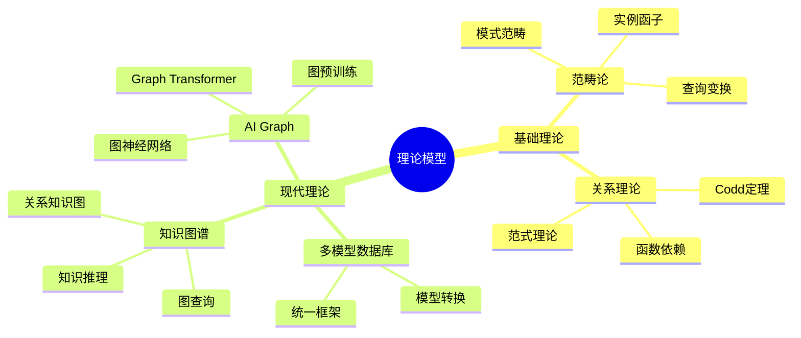
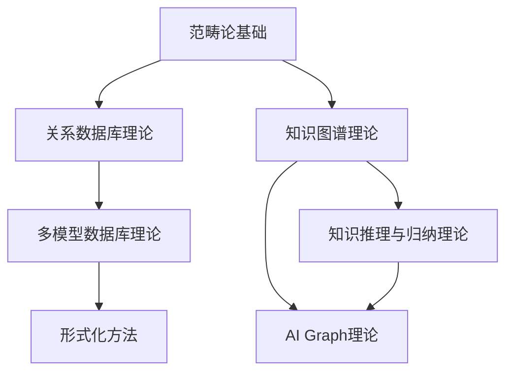

# 理论模型

> **目录**：数据库设计的核心理论模型

---

## 📋 目录

- [理论模型](#理论模型)
  - [📋 目录](#-目录)
  - [1. 概述](#1-概述)
    - [1.1. 理论模型体系](#11-理论模型体系)
  - [2. 文档索引](#2-文档索引)
    - [2.1. 范畴论基础](#21-范畴论基础)
    - [2.2. 关系数据库理论](#22-关系数据库理论)
    - [2.3. 多模型数据库理论](#23-多模型数据库理论)
    - [2.4. 知识图谱理论](#24-知识图谱理论)
    - [2.5. 形式化方法](#25-形式化方法)
    - [2.6. 知识推理与归纳理论 🆕](#26-知识推理与归纳理论-)
    - [2.7. AI Graph理论 🆕](#27-ai-graph理论-)
  - [3. 理论关系](#3-理论关系)
    - [3.1. 理论依赖关系](#31-理论依赖关系)
    - [3.2. 理论应用矩阵](#32-理论应用矩阵)
  - [4. 学习路径](#4-学习路径)
    - [4.1. 基础路径](#41-基础路径)
    - [4.2. 进阶路径](#42-进阶路径)
    - [4.3. 应用路径](#43-应用路径)

---

## 1. 概述

本目录包含数据库设计的核心理论模型，从基础的范畴论、关系理论，到现代的知识图谱、AI Graph等前沿理论。

### 1.1. 理论模型体系

---

## 2. 文档索引

### 2.1. 范畴论基础

**文档**：[01.01-范畴论基础.md](./01.01-范畴论基础.md)

**核心内容**：

- 数据库模式作为范畴
- 数据库实例作为函子
- 查询作为自然变换
- 模式映射与Kan扩张

**适用场景**：

- 模式演化理论
- 数据迁移形式化
- 查询优化理论

### 2.2. 关系数据库理论

**文档**：[01.02-关系数据库理论.md](./01.02-关系数据库理论.md)

**核心内容**：

- Codd定理
- Armstrong公理
- 函数依赖理论
- 范式理论（1NF-5NF、BCNF）
- 查询包含与等价性

**适用场景**：

- 数据库设计
- 范式化设计
- 查询优化

### 2.3. 多模型数据库理论

**文档**：[01.03-多模型数据库理论.md](./01.03-多模型数据库理论.md)

**核心内容**：

- 统一数据模型框架
- 模型间转换
- 跨模型查询
- 多模型事务一致性

**适用场景**：

- 多模型数据库设计
- 数据模型转换
- 统一查询接口

### 2.4. 知识图谱理论

**文档**：[01.04-知识图谱理论.md](./01.04-知识图谱理论.md)

**核心内容**：

- 知识图谱基础
- 关系知识图
- 图查询语言（SPARQL、Cypher、Gremlin）
- 知识推理（规则推理、模式匹配、本体推理）
- 知识归纳 🆕
- 神经推理 🆕
- 混合推理 🆕

**适用场景**：

- 知识图谱构建
- 语义搜索
- 智能问答
- 知识推理

### 2.5. 形式化方法

**文档**：[01.05-形式化方法.md](./01.05-形式化方法.md)

**核心内容**：

- TLA+规范
- Coq证明
- Isabelle验证
- ACID性质验证

**适用场景**：

- 系统形式化验证
- 定理证明
- 正确性保证

### 2.6. 知识推理与归纳理论 🆕

**文档**：[01.06-知识推理与归纳理论.md](./01.06-知识推理与归纳理论.md)

**核心内容**：

- 符号推理（规则推理、逻辑推理、本体推理）
- 统计推理（概率推理、链接预测）
- 神经推理（知识图谱嵌入、图神经网络）
- 知识归纳（规则归纳、模式归纳、概念归纳）
- 混合推理框架

**适用场景**：

- 知识推理系统
- 链接预测
- 规则学习
- 知识补全

### 2.7. AI Graph理论 🆕

**文档**：[01.07-AI Graph理论.md](./01.07-AI Graph理论.md)

**核心内容**：

- 图神经网络（GCN、GAT、GraphSAGE）
- Graph Transformer
- 图预训练模型（GPT-GNN、对比学习）
- 知识图谱+AI融合
- 图数据库AI扩展

**适用场景**：

- 图神经网络应用
- 知识图谱学习
- 图数据挖掘
- AI驱动的图分析

---

## 3. 理论关系

### 3.1. 理论依赖关系

### 3.2. 理论应用矩阵

| 理论模型 | 数据库设计 | 查询优化 | 知识推理 | AI应用 |
|---------|-----------|---------|---------|--------|
| **范畴论** | ⭐⭐⭐⭐⭐ | ⭐⭐⭐⭐ | ⭐⭐⭐ | ⭐⭐ |
| **关系理论** | ⭐⭐⭐⭐⭐ | ⭐⭐⭐⭐⭐ | ⭐⭐ | ⭐ |
| **多模型理论** | ⭐⭐⭐⭐ | ⭐⭐⭐⭐ | ⭐⭐⭐ | ⭐⭐⭐ |
| **知识图谱** | ⭐⭐⭐ | ⭐⭐⭐ | ⭐⭐⭐⭐⭐ | ⭐⭐⭐⭐ |
| **知识推理** | ⭐⭐ | ⭐⭐ | ⭐⭐⭐⭐⭐ | ⭐⭐⭐⭐⭐ |
| **AI Graph** | ⭐⭐ | ⭐⭐⭐ | ⭐⭐⭐⭐ | ⭐⭐⭐⭐⭐ |

---

## 4. 学习路径

### 4.1. 基础路径

1. **关系数据库理论** → 理解数据库设计基础
2. **范畴论基础** → 理解形式化建模
3. **知识图谱理论** → 理解图数据模型

### 4.2. 进阶路径

1. **多模型数据库理论** → 理解统一框架
2. **知识推理与归纳理论** → 理解智能推理
3. **AI Graph理论** → 理解AI+图融合

### 4.3. 应用路径

1. **形式化方法** → 系统验证
2. **知识图谱理论** → 知识系统构建
3. **AI Graph理论** → AI应用开发

---

**最后更新**：2025-01-15
**维护者**：Data-Science Team
**状态**：实施中
