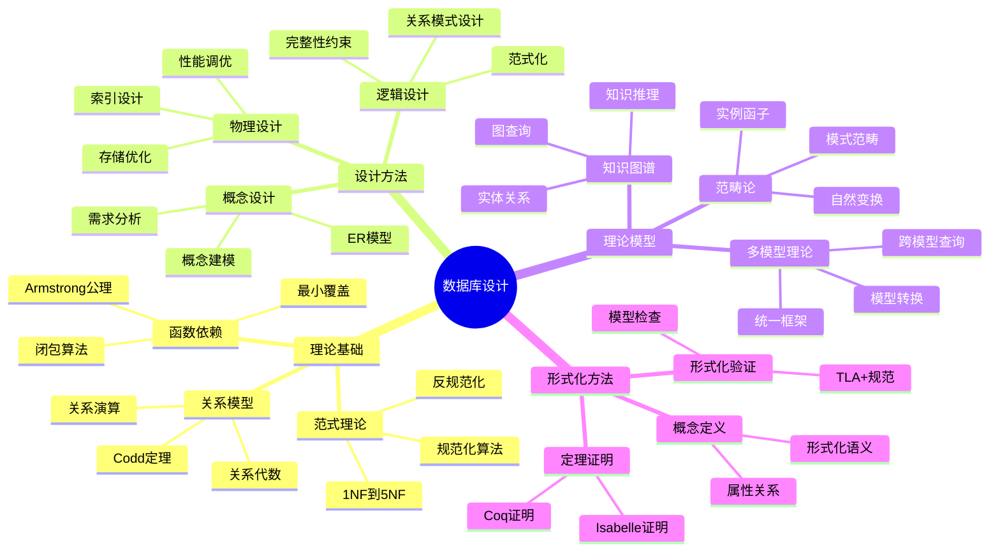
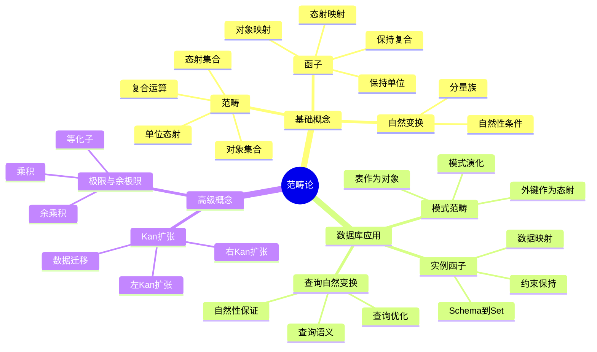
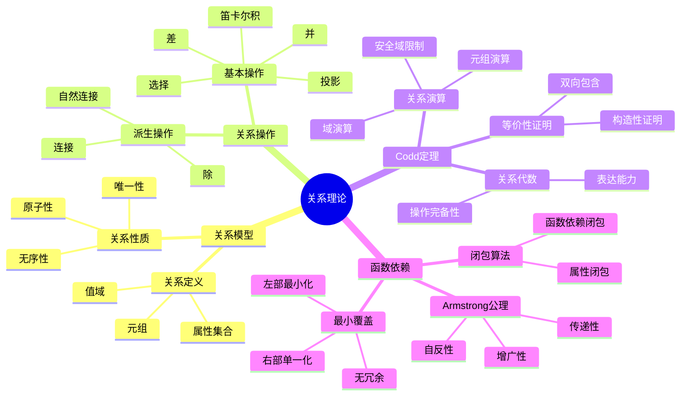
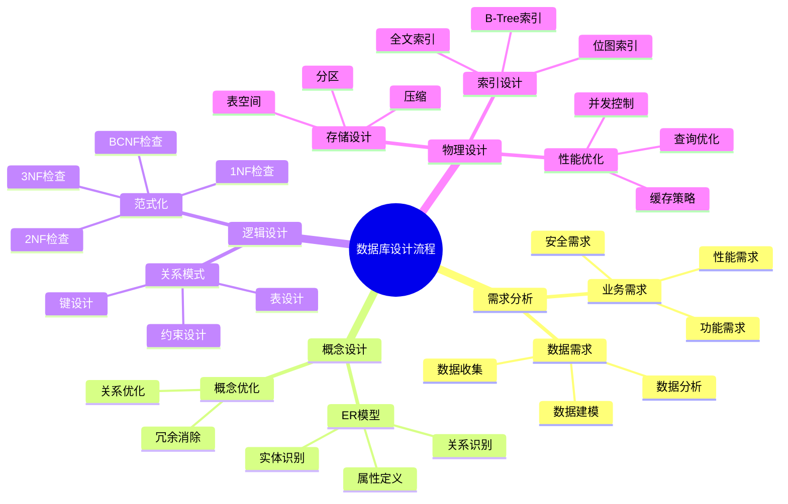
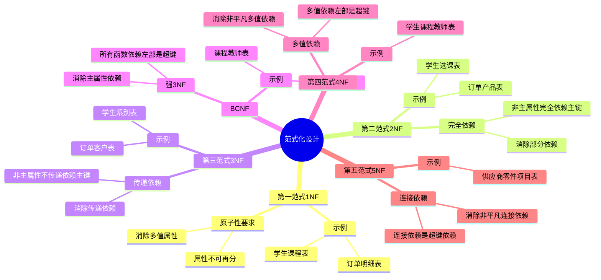
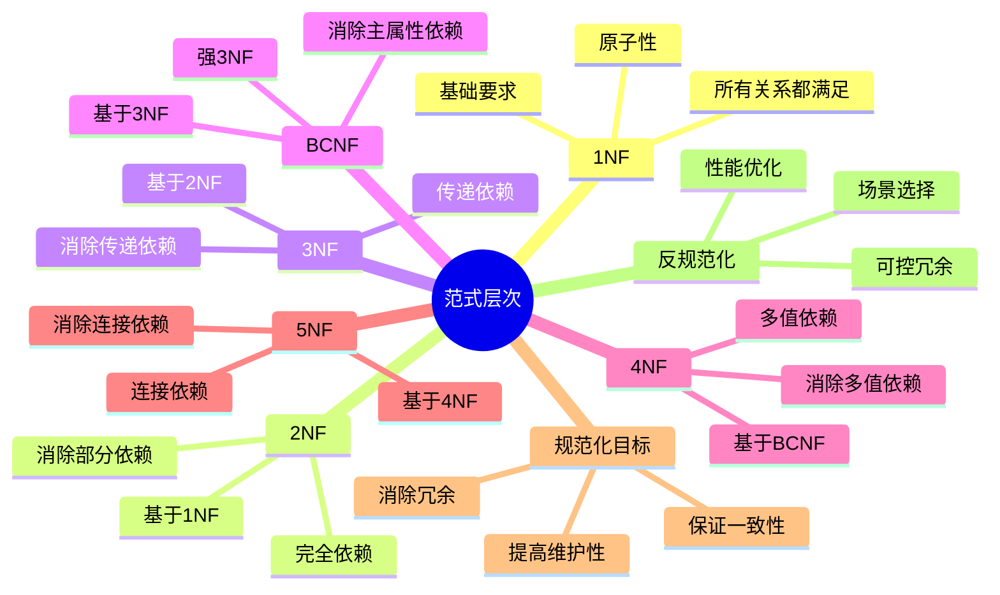
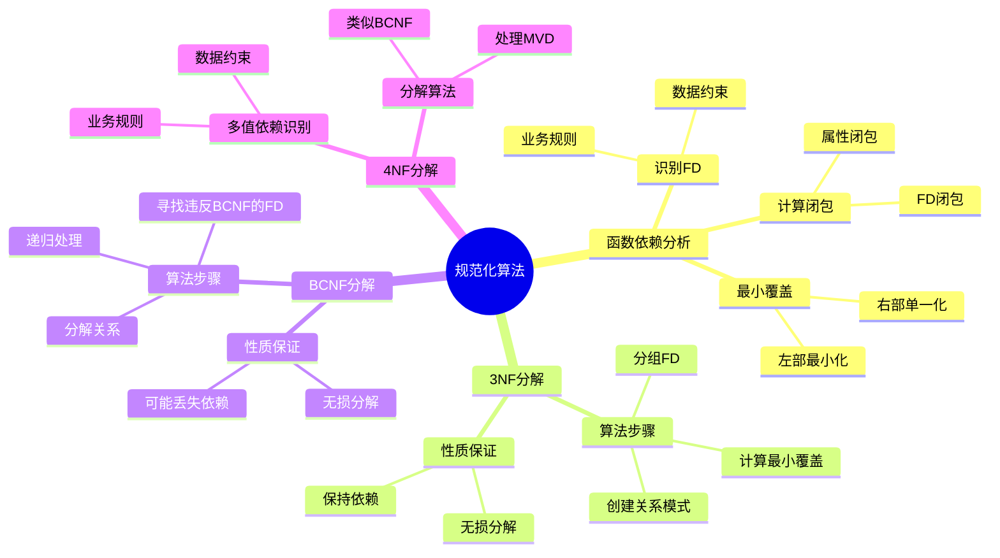
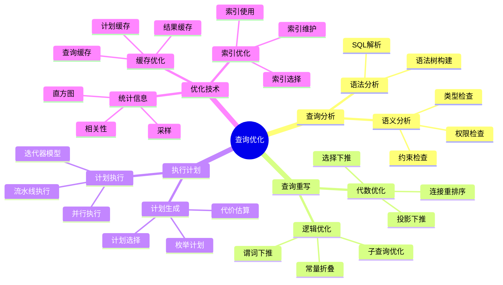
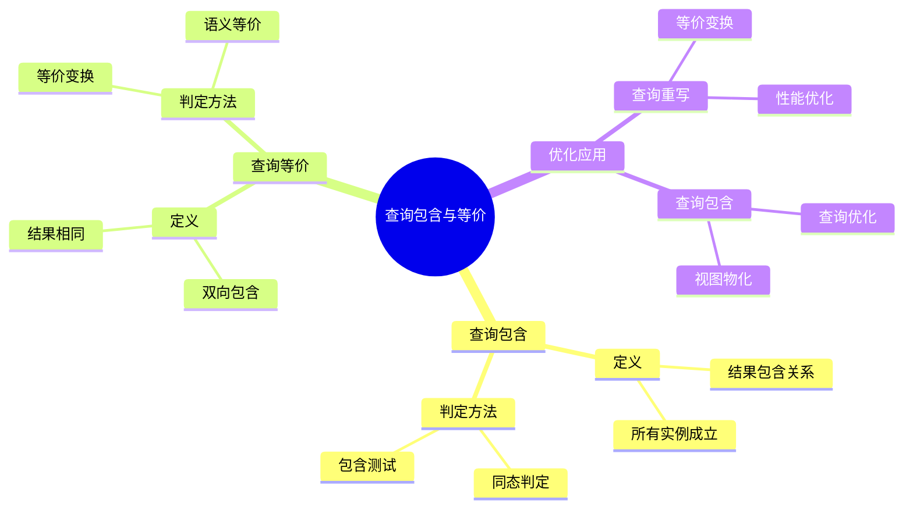

# 思维导图库：数据库设计可视化思维导图

> **创建日期**：2025-01-15
> **最后更新**：2025-01-15
> **版本**：v1.0
> **状态**：规划中

---

## 📋 目录

- [思维导图库：数据库设计可视化思维导图](#思维导图库数据库设计可视化思维导图)
  - [📋 目录](#-目录)
  - [1. 概述](#1-概述)
  - [2. 数据库设计总体思维导图](#2-数据库设计总体思维导图)
  - [3. 理论模型思维导图](#3-理论模型思维导图)
    - [3.1. 范畴论思维导图](#31-范畴论思维导图)
    - [3.2. 关系理论思维导图](#32-关系理论思维导图)
  - [4. 设计方法思维导图](#4-设计方法思维导图)
    - [4.1. 数据库设计流程](#41-数据库设计流程)
    - [4.2. 范式化设计思维导图](#42-范式化设计思维导图)
  - [5. 范式理论思维导图](#5-范式理论思维导图)
    - [5.1. 范式层次结构](#51-范式层次结构)
    - [5.2. 规范化算法思维导图](#52-规范化算法思维导图)
  - [6. 查询优化思维导图](#6-查询优化思维导图)
    - [6.1. 查询优化总体](#61-查询优化总体)
    - [6.2. 查询包含与等价](#62-查询包含与等价)
  - [7. 使用指南](#7-使用指南)
    - [7.1. 如何使用思维导图](#71-如何使用思维导图)
    - [7.2. 思维导图工具推荐](#72-思维导图工具推荐)
  - [8. 参考资料](#8-参考资料)

---

## 1. 概述

思维导图提供了一种直观的方式来理解和记忆数据库设计的复杂概念和关系。本库收集了数据库设计领域的各种思维导图。

---

## 2. 数据库设计总体思维导图

---

## 3. 理论模型思维导图

### 3.1. 范畴论思维导图

### 3.2. 关系理论思维导图

---

## 4. 设计方法思维导图

### 4.1. 数据库设计流程

### 4.2. 范式化设计思维导图

---

## 5. 范式理论思维导图

### 5.1. 范式层次结构

### 5.2. 规范化算法思维导图

---

## 6. 查询优化思维导图

### 6.1. 查询优化总体

### 6.2. 查询包含与等价

---

## 7. 使用指南

### 7.1. 如何使用思维导图

1. **学习新概念**：
   - 从中心主题开始
   - 逐步展开分支
   - 理解概念间的关系

2. **复习知识**：
   - 浏览整个思维导图
   - 回忆每个分支的内容
   - 检查理解程度

3. **知识整理**：
   - 创建自己的思维导图
   - 添加个人理解
   - 建立知识关联

### 7.2. 思维导图工具推荐

- **Mermaid**：Markdown中直接使用
- **XMind**：专业思维导图工具
- **MindMaster**：在线思维导图工具
- **Draw.io**：流程图和思维导图工具

---

## 8. 参考资料

- [数据库设计理论扩展计划](../00-数据库设计理论扩展计划.md)
- [多维矩阵库](./02.02-多维矩阵库.md)
- [概念地图库](./02.03-概念地图库.md)

---

**最后更新**：2025-01-15
**维护者**：Data-Science Team
**状态**：规划中
