# 概念地图库：数据库设计概念关联地图

> **创建日期**：2025-01-15
> **最后更新**：2025-12-01
> **版本**：v2.0
> **状态**：已完成 ✅

---

## 📋 目录

- [概念地图库：数据库设计概念关联地图](#概念地图库数据库设计概念关联地图)
  - [📋 目录](#-目录)
  - [1. 概述](#1-概述)
  - [2. 数据库设计总体概念地图](#2-数据库设计总体概念地图)
  - [3. 理论模型概念地图](#3-理论模型概念地图)
    - [3.1. 范畴论概念地图](#31-范畴论概念地图)
    - [3.2. 关系理论概念地图](#32-关系理论概念地图)
  - [4. 设计方法概念地图](#4-设计方法概念地图)
    - [4.1. 数据库设计流程概念地图](#41-数据库设计流程概念地图)
    - [4.2. 范式化设计概念地图](#42-范式化设计概念地图)
  - [5. 范式理论概念地图](#5-范式理论概念地图)
    - [5.1. 范式层次概念地图](#51-范式层次概念地图)
    - [5.2. 函数依赖概念地图](#52-函数依赖概念地图)
  - [6. 查询优化概念地图](#6-查询优化概念地图)
    - [6.1. 查询处理概念地图](#61-查询处理概念地图)
    - [6.2. 查询包含概念地图](#62-查询包含概念地图)
  - [7. PostgreSQL扩展概念地图](#7-postgresql扩展概念地图)
    - [7.1. PostgreSQL多模型扩展概念地图](#71-postgresql多模型扩展概念地图)
    - [7.2. 向量数据库应用概念地图](#72-向量数据库应用概念地图)
    - [7.3. 知识图谱应用概念地图](#73-知识图谱应用概念地图)
    - [7.4. 时序数据库应用概念地图](#74-时序数据库应用概念地图)
  - [8. 2025技术趋势概念地图](#8-2025技术趋势概念地图)
    - [8.1. AI数据库集成概念地图](#81-ai数据库集成概念地图)
    - [8.2. 云原生数据库概念地图](#82-云原生数据库概念地图)
    - [8.3. 多模态数据库概念地图](#83-多模态数据库概念地图)
  - [9. 使用指南](#9-使用指南)
    - [8.1. 如何使用概念地图](#81-如何使用概念地图)
    - [8.2. 概念地图工具](#82-概念地图工具)
  - [9. 使用指南](#9-使用指南)
    - [9.1. 如何使用概念地图](#91-如何使用概念地图)
    - [9.2. 概念地图工具](#92-概念地图工具)
  - [10. 参考资料](#10-参考资料)

---

## 1. 概述

概念地图通过节点和边表示概念及其关系，帮助理解数据库设计领域的知识结构。

---

## 2. 数据库设计总体概念地图

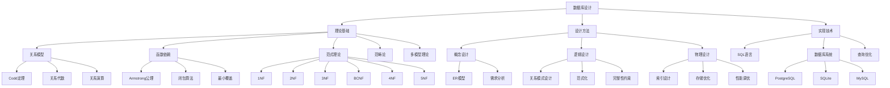
```mermaid
graph TB
    A[数据库设计] --> B[理论基础]
    A --> C[设计方法]
    A --> D[实现技术]

    B --> B1[关系模型]
    B --> B2[函数依赖]
    B --> B3[范式理论]
    B --> B4[范畴论]
    B --> B5[多模型理论]

    B1 --> B1a[Codd定理]
    B1 --> B1b[关系代数]
    B1 --> B1c[关系演算]

    B2 --> B2a[Armstrong公理]
    B2 --> B2b[闭包算法]
    B2 --> B2c[最小覆盖]

    B3 --> B3a[1NF]
    B3 --> B3b[2NF]
    B3 --> B3c[3NF]
    B3 --> B3d[BCNF]
    B3 --> B3e[4NF]
    B3 --> B3f[5NF]

    C --> C1[概念设计]
    C --> C2[逻辑设计]
    C --> C3[物理设计]

    C1 --> C1a[ER模型]
    C1 --> C1b[需求分析]

    C2 --> C2a[关系模式设计]
    C2 --> C2b[范式化]
    C2 --> C2c[完整性约束]

    C3 --> C3a[索引设计]
    C3 --> C3b[存储优化]
    C3 --> C3c[性能调优]

    D --> D1[SQL语言]
    D --> D2[数据库系统]
    D --> D3[查询优化]

    D2 --> D2a[PostgreSQL]
    D2 --> D2b[SQLite]
    D2 --> D2c[MySQL]
```

---

## 3. 理论模型概念地图

### 3.1. 范畴论概念地图

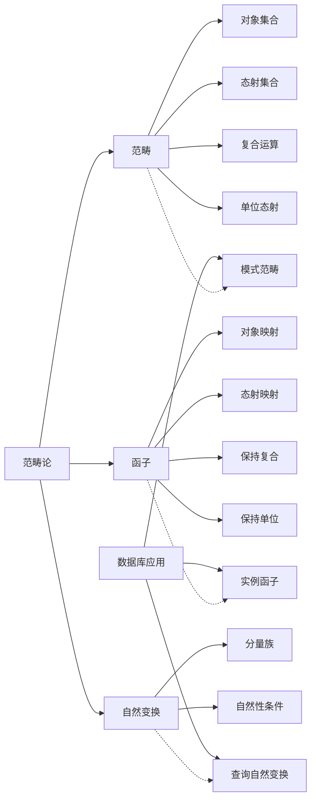
```mermaid
graph LR
    A[范畴论] --> B[范畴]
    A --> C[函子]
    A --> D[自然变换]

    B --> B1[对象集合]
    B --> B2[态射集合]
    B --> B3[复合运算]
    B --> B4[单位态射]

    C --> C1[对象映射]
    C --> C2[态射映射]
    C --> C3[保持复合]
    C --> C4[保持单位]

    D --> D1[分量族]
    D --> D2[自然性条件]

    E[数据库应用] --> E1[模式范畴]
    E --> E2[实例函子]
    E --> E3[查询自然变换]

    B -.-> E1
    C -.-> E2
    D -.-> E3
```

### 3.2. 关系理论概念地图

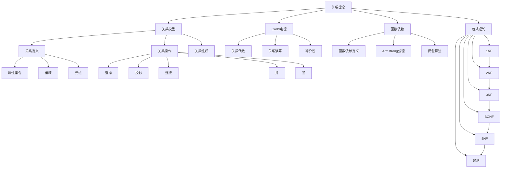
```mermaid
graph TB
    A[关系理论] --> B[关系模型]
    A --> C[Codd定理]
    A --> D[函数依赖]
    A --> E[范式理论]

    B --> B1[关系定义]
    B --> B2[关系操作]
    B --> B3[关系性质]

    B1 --> B1a[属性集合]
    B1 --> B1b[值域]
    B1 --> B1c[元组]

    B2 --> B2a[选择]
    B2 --> B2b[投影]
    B2 --> B2c[连接]
    B2 --> B2d[并]
    B2 --> B2e[差]

    C --> C1[关系代数]
    C --> C2[关系演算]
    C --> C3[等价性]

    D --> D1[函数依赖定义]
    D --> D2[Armstrong公理]
    D --> D3[闭包算法]

    E --> E1[1NF]
    E --> E2[2NF]
    E --> E3[3NF]
    E --> E4[BCNF]
    E --> E5[4NF]
    E --> E6[5NF]

    E1 --> E2
    E2 --> E3
    E3 --> E4
    E4 --> E5
    E5 --> E6
```

---

## 4. 设计方法概念地图

### 4.1. 数据库设计流程概念地图

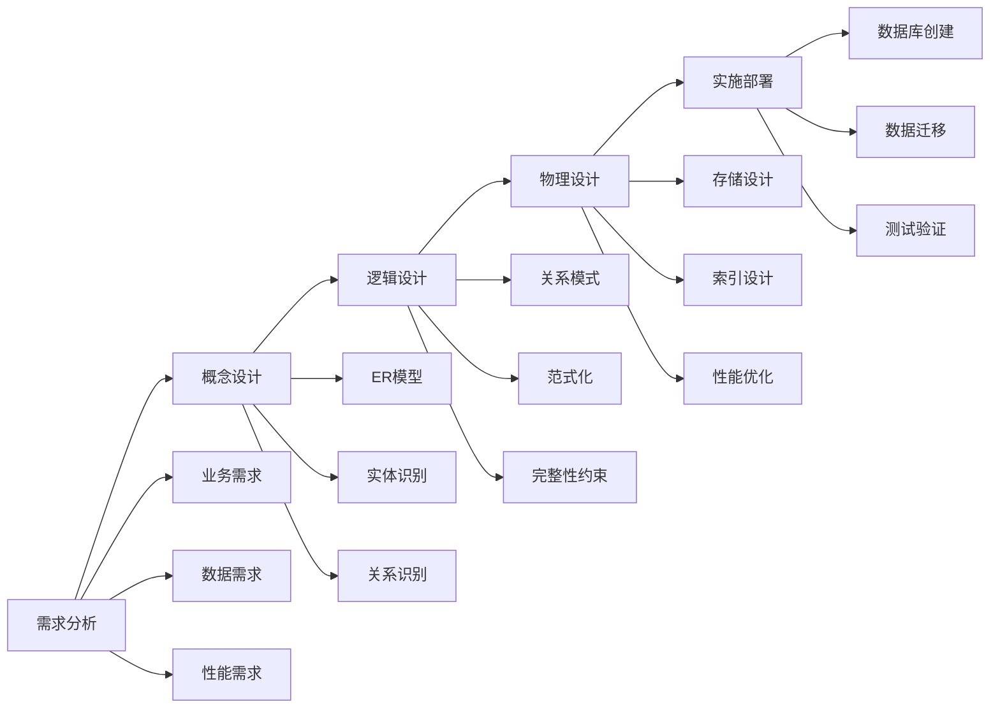
```mermaid
graph LR
    A[需求分析] --> B[概念设计]
    B --> C[逻辑设计]
    C --> D[物理设计]
    D --> E[实施部署]

    A --> A1[业务需求]
    A --> A2[数据需求]
    A --> A3[性能需求]

    B --> B1[ER模型]
    B --> B2[实体识别]
    B --> B3[关系识别]

    C --> C1[关系模式]
    C --> C2[范式化]
    C --> C3[完整性约束]

    D --> D1[存储设计]
    D --> D2[索引设计]
    D --> D3[性能优化]

    E --> E1[数据库创建]
    E --> E2[数据迁移]
    E --> E3[测试验证]
```

### 4.2. 范式化设计概念地图

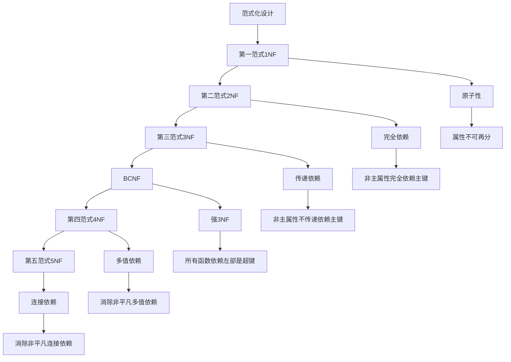
```mermaid
graph TB
    A[范式化设计] --> B[第一范式1NF]
    B --> C[第二范式2NF]
    C --> D[第三范式3NF]
    D --> E[BCNF]
    E --> F[第四范式4NF]
    F --> G[第五范式5NF]

    B --> B1[原子性]
    B1 --> B1a[属性不可再分]

    C --> C1[完全依赖]
    C1 --> C1a[非主属性完全依赖主键]

    D --> D1[传递依赖]
    D1 --> D1a[非主属性不传递依赖主键]

    E --> E1[强3NF]
    E1 --> E1a[所有函数依赖左部是超键]

    F --> F1[多值依赖]
    F1 --> F1a[消除非平凡多值依赖]

    G --> G1[连接依赖]
    G1 --> G1a[消除非平凡连接依赖]
```

---

## 5. 范式理论概念地图

### 5.1. 范式层次概念地图

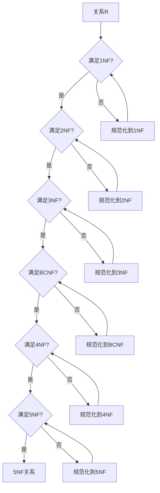
```mermaid
graph TD
    A[关系R] --> B{满足1NF?}
    B -->|是| C{满足2NF?}
    B -->|否| B1[规范化到1NF]
    B1 --> B

    C -->|是| D{满足3NF?}
    C -->|否| C1[规范化到2NF]
    C1 --> C

    D -->|是| E{满足BCNF?}
    D -->|否| D1[规范化到3NF]
    D1 --> D

    E -->|是| F{满足4NF?}
    E -->|否| E1[规范化到BCNF]
    E1 --> E

    F -->|是| G{满足5NF?}
    F -->|否| F1[规范化到4NF]
    F1 --> F

    G -->|是| H[5NF关系]
    G -->|否| G1[规范化到5NF]
    G1 --> G
```

### 5.2. 函数依赖概念地图

```mermaid
graph TB
    A[函数依赖] --> B[函数依赖定义]
    A --> C[Armstrong公理]
    A --> D[闭包算法]
    A --> E[最小覆盖]

    B --> B1[X → Y]
    B1 --> B1a[∀ t1, t2: t1[X]=t2[X] => t1[Y]=t2[Y]]

    C --> C1[自反性]
    C --> C2[增广性]
    C --> C3[传递性]

    C1 --> C1a[Y ⊆ X => X → Y]
    C2 --> C2a[X → Y => XZ → YZ]
    C3 --> C3a[X → Y ∧ Y → Z => X → Z]

    D --> D1[属性闭包X⁺]
    D --> D2[函数依赖闭包F⁺]

    E --> E1[右部单一化]
    E --> E2[左部最小化]
    E --> E3[无冗余]
```

---

## 6. 查询优化概念地图

### 6.1. 查询处理概念地图

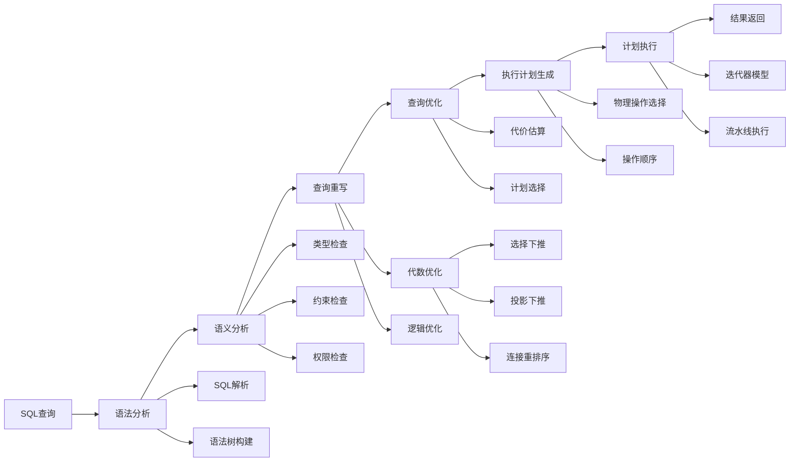
```mermaid
graph LR
    A[SQL查询] --> B[语法分析]
    B --> C[语义分析]
    C --> D[查询重写]
    D --> E[查询优化]
    E --> F[执行计划生成]
    F --> G[计划执行]
    G --> H[结果返回]

    B --> B1[SQL解析]
    B --> B2[语法树构建]

    C --> C1[类型检查]
    C --> C2[约束检查]
    C --> C3[权限检查]

    D --> D1[代数优化]
    D --> D2[逻辑优化]

    D1 --> D1a[选择下推]
    D1 --> D1b[投影下推]
    D1 --> D1c[连接重排序]

    E --> E1[代价估算]
    E --> E2[计划选择]

    F --> F1[物理操作选择]
    F --> F2[操作顺序]

    G --> G1[迭代器模型]
    G --> G2[流水线执行]
```

### 6.2. 查询包含概念地图

```mermaid
graph TB
    A[查询包含] --> B[查询包含定义]
    A --> C[查询等价定义]
    A --> D[判定方法]

    B --> B1[Q1 ⊇ Q2]
    B1 --> B1a[∀ I: Q1(I) ⊇ Q2(I)]

    C --> C1[Q1 ≡ Q2]
    C1 --> C1a[Q1 ⊇ Q2 ∧ Q2 ⊇ Q1]

    D --> D1[同态判定]
    D --> D2[包含测试]
    D --> D3[等价变换]

    D1 --> D1a[SPJ查询]
    D1 --> D1b[同态映射]

    D2 --> D2a[模型检查]
    D2 --> D2b[反例生成]

    D3 --> D3a[代数变换]
    D3 --> D3b[语义等价]
```

---

## 7. PostgreSQL扩展概念地图

### 7.1. PostgreSQL多模型扩展概念地图

```mermaid
graph TB
    A[PostgreSQL多模型扩展] --> B[向量数据库]
    A --> C[知识图谱]
    A --> D[时序数据库]
    A --> E[列式存储]
    A --> F[多租户]
    A --> G[分布式]

    B --> B1[pgvector]
    B1 --> B1a[HNSW索引]
    B1 --> B1b[IVFFlat索引]
    B1 --> B1c[向量操作]
    B --> B2[应用场景]
    B2 --> B2a[AI应用]
    B2 --> B2b[推荐系统]
    B2 --> B2c[语义搜索]

    C --> C1[Apache AGE]
    C1 --> C1a[Cypher查询]
    C1 --> C1b[图遍历]
    C1 --> C1c[图算法]
    C --> C2[应用场景]
    C2 --> C2a[知识图谱]
    C2 --> C2b[社交网络]
    C2 --> C2c[推荐系统]

    D --> D1[TimescaleDB]
    D1 --> D1a[超表]
    D1 --> D1b[连续聚合]
    D1 --> D1c[时间分区]
    D --> D2[应用场景]
    D2 --> D2a[IoT应用]
    D2 --> D2b[监控系统]
    D2 --> D2c[时序分析]

    E --> E1[cstore_fdw]
    E1 --> E1a[列式压缩]
    E1 --> E1b[列式查询]
    E --> E2[应用场景]
    E2 --> E2a[数据分析]
    E2 --> E2b[数据仓库]
    E2 --> E2c[OLAP]

    F --> F1[RLS行级安全]
    F1 --> F1a[租户隔离]
    F1 --> F1b[数据安全]
    F --> F2[应用场景]
    F2 --> F2a[SaaS应用]
    F2 --> F2b[多租户系统]

    G --> G1[Citus]
    G1 --> G1a[分布式表]
    G1 --> G1b[分布式查询]
    G --> G2[应用场景]
    G2 --> G2a[微服务]
    G2 --> G2b[大数据]
    G2 --> G2c[横向扩展]
```

### 7.2. 向量数据库应用概念地图

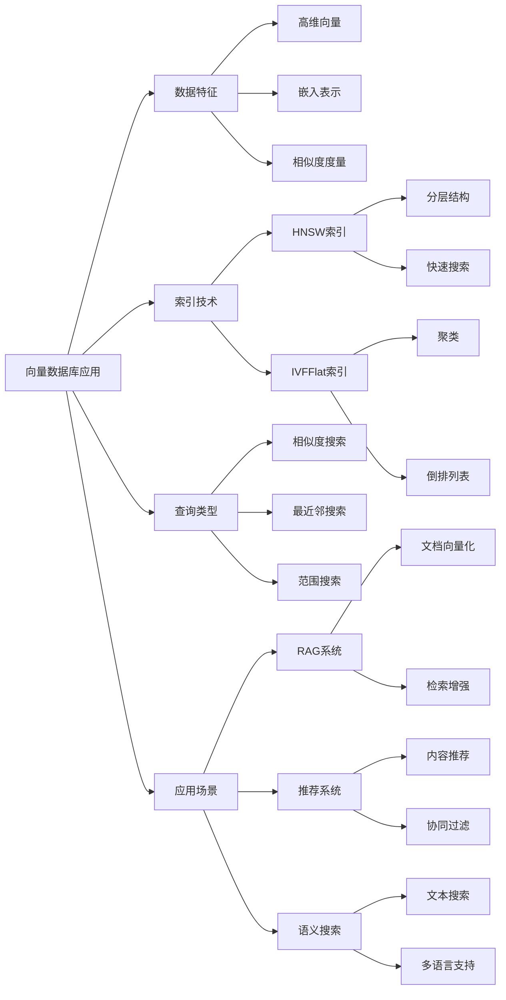
```mermaid
graph LR
    A[向量数据库应用] --> B[数据特征]
    A --> C[索引技术]
    A --> D[查询类型]
    A --> E[应用场景]

    B --> B1[高维向量]
    B --> B2[嵌入表示]
    B --> B3[相似度度量]

    C --> C1[HNSW索引]
    C1 --> C1a[分层结构]
    C1 --> C1b[快速搜索]
    C --> C2[IVFFlat索引]
    C2 --> C2a[聚类]
    C2 --> C2b[倒排列表]

    D --> D1[相似度搜索]
    D --> D2[最近邻搜索]
    D --> D3[范围搜索]

    E --> E1[RAG系统]
    E1 --> E1a[文档向量化]
    E1 --> E1b[检索增强]
    E --> E2[推荐系统]
    E2 --> E2a[内容推荐]
    E2 --> E2b[协同过滤]
    E --> E3[语义搜索]
    E3 --> E3a[文本搜索]
    E3 --> E3b[多语言支持]
```

### 7.3. 知识图谱应用概念地图

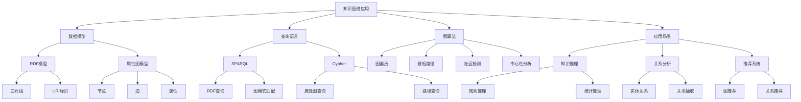
```mermaid
graph TB
    A[知识图谱应用] --> B[数据模型]
    A --> C[查询语言]
    A --> D[图算法]
    A --> E[应用场景]

    B --> B1[RDF模型]
    B1 --> B1a[三元组]
    B1 --> B1b[URI标识]
    B --> B2[属性图模型]
    B2 --> B2a[节点]
    B2 --> B2b[边]
    B2 --> B2c[属性]

    C --> C1[SPARQL]
    C1 --> C1a[RDF查询]
    C1 --> C1b[图模式匹配]
    C --> C2[Cypher]
    C2 --> C2a[属性图查询]
    C2 --> C2b[路径查询]

    D --> D1[图遍历]
    D --> D2[最短路径]
    D --> D3[社区检测]
    D --> D4[中心性分析]

    E --> E1[知识推理]
    E1 --> E1a[规则推理]
    E1 --> E1b[统计推理]
    E --> E2[关系分析]
    E2 --> E2a[实体关系]
    E2 --> E2b[关系抽取]
    E --> E3[推荐系统]
    E3 --> E3a[图推荐]
    E3 --> E3b[关系推荐]
```

### 7.4. 时序数据库应用概念地图

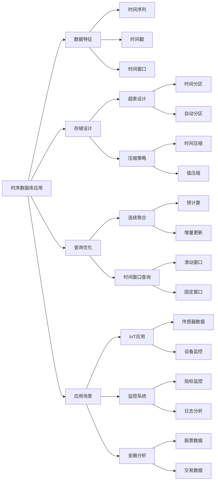
```mermaid
graph LR
    A[时序数据库应用] --> B[数据特征]
    A --> C[存储设计]
    A --> D[查询优化]
    A --> E[应用场景]

    B --> B1[时间序列]
    B --> B2[时间戳]
    B --> B3[时间窗口]

    C --> C1[超表设计]
    C1 --> C1a[时间分区]
    C1 --> C1b[自动分区]
    C --> C2[压缩策略]
    C2 --> C2a[时间压缩]
    C2 --> C2b[值压缩]

    D --> D1[连续聚合]
    D1 --> D1a[预计算]
    D1 --> D1b[增量更新]
    D --> D2[时间窗口查询]
    D2 --> D2a[滑动窗口]
    D2 --> D2b[固定窗口]

    E --> E1[IoT应用]
    E1 --> E1a[传感器数据]
    E1 --> E1b[设备监控]
    E --> E2[监控系统]
    E2 --> E2a[指标监控]
    E2 --> E2b[日志分析]
    E --> E3[金融分析]
    E3 --> E3a[股票数据]
    E3 --> E3b[交易数据]
```

---

## 8. 2025技术趋势概念地图

### 8.1. AI数据库集成概念地图

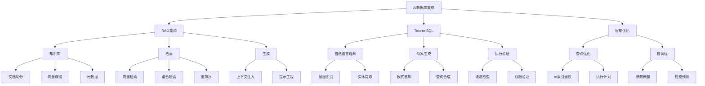
```mermaid
graph TB
    A[AI数据库集成] --> B[RAG架构]
    A --> C[Text-to-SQL]
    A --> D[智能优化]

    B --> B1[知识库]
    B1 --> B1a[文档切分]
    B1 --> B1b[向量存储]
    B1 --> B1c[元数据]
    B --> B2[检索]
    B2 --> B2a[向量检索]
    B2 --> B2b[混合检索]
    B2 --> B2c[重排序]
    B --> B3[生成]
    B3 --> B3a[上下文注入]
    B3 --> B3b[提示工程]

    C --> C1[自然语言理解]
    C1 --> C1a[意图识别]
    C1 --> C1b[实体提取]
    C --> C2[SQL生成]
    C2 --> C2a[模式感知]
    C2 --> C2b[查询合成]
    C --> C3[执行验证]
    C3 --> C3a[语法检查]
    C3 --> C3b[权限验证]

    D --> D1[查询优化]
    D1 --> D1a[AI索引建议]
    D1 --> D1b[执行计划]
    D --> D2[自调优]
    D2 --> D2a[参数调整]
    D2 --> D2b[性能预测]
```

### 8.2. 云原生数据库概念地图

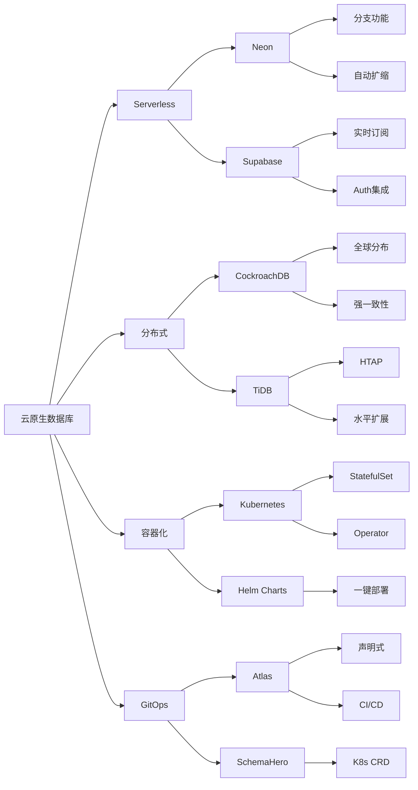
```mermaid
graph LR
    A[云原生数据库] --> B[Serverless]
    A --> C[分布式]
    A --> D[容器化]
    A --> E[GitOps]

    B --> B1[Neon]
    B1 --> B1a[分支功能]
    B1 --> B1b[自动扩缩]
    B --> B2[Supabase]
    B2 --> B2a[实时订阅]
    B2 --> B2b[Auth集成]

    C --> C1[CockroachDB]
    C1 --> C1a[全球分布]
    C1 --> C1b[强一致性]
    C --> C2[TiDB]
    C2 --> C2a[HTAP]
    C2 --> C2b[水平扩展]

    D --> D1[Kubernetes]
    D1 --> D1a[StatefulSet]
    D1 --> D1b[Operator]
    D --> D2[Helm Charts]
    D2 --> D2a[一键部署]

    E --> E1[Atlas]
    E1 --> E1a[声明式]
    E1 --> E1b[CI/CD]
    E --> E2[SchemaHero]
    E2 --> E2a[K8s CRD]
```

### 8.3. 多模态数据库概念地图

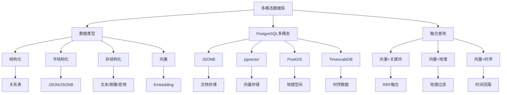
```mermaid
graph TB
    A[多模态数据库] --> B[数据类型]
    A --> C[PostgreSQL多模态]
    A --> D[融合查询]

    B --> B1[结构化]
    B1 --> B1a[关系表]
    B --> B2[半结构化]
    B2 --> B2a[JSON/JSONB]
    B --> B3[非结构化]
    B3 --> B3a[文本/图像/音频]
    B --> B4[向量]
    B4 --> B4a[Embedding]

    C --> C1[JSONB]
    C1 --> C1a[文档存储]
    C --> C2[pgvector]
    C2 --> C2a[向量存储]
    C --> C3[PostGIS]
    C3 --> C3a[地理空间]
    C --> C4[TimescaleDB]
    C4 --> C4a[时序数据]

    D --> D1[向量+关键词]
    D1 --> D1a[RRF融合]
    D --> D2[向量+地理]
    D2 --> D2a[地理过滤]
    D --> D3[向量+时序]
    D3 --> D3a[时间范围]
```

---

## 9. 使用指南

### 9.1. 如何使用概念地图

1. **学习路径规划**：
   - 从中心概念开始
   - 沿着边探索相关概念
   - 理解概念间的关系

2. **知识梳理**：
   - 识别核心概念
   - 理解概念层次
   - 建立概念关联

3. **复习巩固**：
   - 浏览整个概念地图
   - 回忆每个概念的定义
   - 理解概念间的关系

### 9.2. 概念地图工具

- **Mermaid**：Markdown中直接使用
- **Draw.io**：在线概念地图工具
- **CmapTools**：专业概念地图工具
- **XMind**：思维导图和概念地图工具

---

## 10. 参考资料

### 10.1. 相关文档

- [数据库设计理论扩展计划](../00-数据库设计理论扩展计划.md)
- [思维导图库](./02.01-思维导图库.md)
- [多维矩阵库](./02.02-多维矩阵库.md)
- [形式化表示](./02.04-形式化表示.md)
- [论证决策树库](./02.05-论证决策树库.md)
- [向量数据库设计](../07-数据库设计实践/07.10-向量数据库设计.md)

### 10.2. 最新权威资源（2024-2025）

- **XISM：交互式语义地图模型可视化工具** - 2025年7月，Zhu Liu等人提出，结合数据驱动推理与专家知识，生成候选语义地图
- **Map2Text：从低维可视化生成新内容** - 2024年12月，Xingjian Zhang等人提出，将低维可视化中的空间坐标转换为文本内容
- **MindBench：思维导图结构识别与分析的综合基准** - 2024年7月，Lei Chen等人发布，包含精心构建的双语真实或合成图像
- **地图思维的学科交叉驱动演化** - 2024年，任福等人探讨地图思维的演化，提出"数-形-图-谱"四种思维方式
- **知识引导的地图表达与理解** - 2025年11月，ISPRS IJGI特刊，探讨基于时空与语义知识生成有效地图表达
- **知识地图：重构信息时代的认知框架与实践路径** - 2025年11月，通过可视化方式将分散的知识点进行梳理与串联

### 10.3. 工具资源

- [Mermaid Live Editor](https://mermaid.live/)
- [Draw.io](https://app.diagrams.net/)
- [CmapTools](https://cmap.ihmc.us/)

---

**最后更新**：2025-12-01
**维护者**：Data-Science Team
**状态**：已完成 ✅
