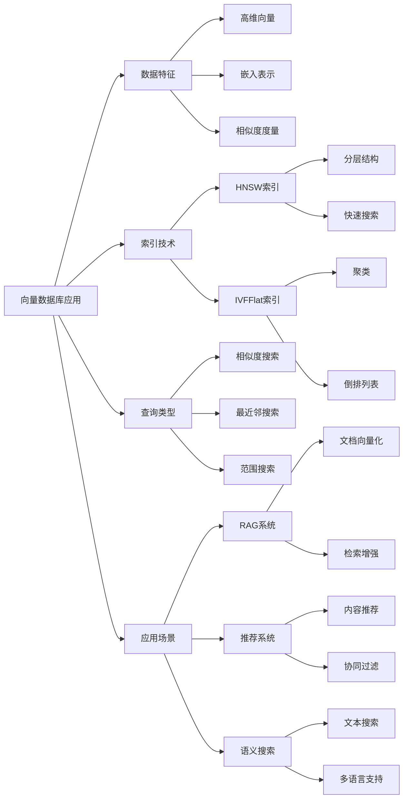
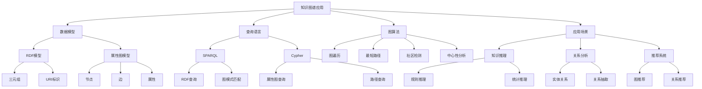
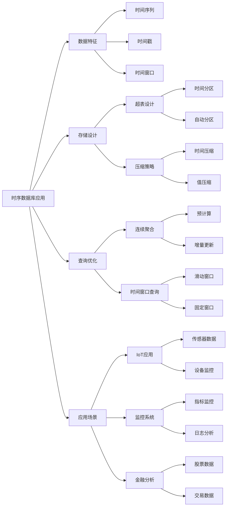

# 概念地图库：数据库设计概念关联地图

> **创建日期**：2025-01-15
> **最后更新**：2025-01-15
> **版本**：v1.0
> **状态**：已完成 ✅

---

## 📋 目录

- [概念地图库：数据库设计概念关联地图](#概念地图库数据库设计概念关联地图)
  - [📋 目录](#-目录)
  - [1. 概述](#1-概述)
  - [2. 数据库设计总体概念地图](#2-数据库设计总体概念地图)
  - [3. 理论模型概念地图](#3-理论模型概念地图)
    - [3.1. 范畴论概念地图](#31-范畴论概念地图)
    - [3.2. 关系理论概念地图](#32-关系理论概念地图)
  - [4. 设计方法概念地图](#4-设计方法概念地图)
    - [4.1. 数据库设计流程概念地图](#41-数据库设计流程概念地图)
    - [4.2. 范式化设计概念地图](#42-范式化设计概念地图)
  - [5. 范式理论概念地图](#5-范式理论概念地图)
    - [5.1. 范式层次概念地图](#51-范式层次概念地图)
    - [5.2. 函数依赖概念地图](#52-函数依赖概念地图)
  - [6. 查询优化概念地图](#6-查询优化概念地图)
    - [6.1. 查询处理概念地图](#61-查询处理概念地图)
    - [6.2. 查询包含概念地图](#62-查询包含概念地图)
  - [7. PostgreSQL扩展概念地图](#7-postgresql扩展概念地图)
    - [7.1. PostgreSQL多模型扩展概念地图](#71-postgresql多模型扩展概念地图)
    - [7.2. 向量数据库应用概念地图](#72-向量数据库应用概念地图)
    - [7.3. 知识图谱应用概念地图](#73-知识图谱应用概念地图)
    - [7.4. 时序数据库应用概念地图](#74-时序数据库应用概念地图)
  - [8. 使用指南](#8-使用指南)
    - [7.1. 如何使用概念地图](#71-如何使用概念地图)
    - [7.2. 概念地图工具](#72-概念地图工具)
  - [9. 参考资料](#9-参考资料)

---

## 1. 概述

概念地图通过节点和边表示概念及其关系，帮助理解数据库设计领域的知识结构。

---

## 2. 数据库设计总体概念地图


---

## 3. 理论模型概念地图

### 3.1. 范畴论概念地图


### 3.2. 关系理论概念地图


---

## 4. 设计方法概念地图

### 4.1. 数据库设计流程概念地图


### 4.2. 范式化设计概念地图


---

## 5. 范式理论概念地图

### 5.1. 范式层次概念地图


### 5.2. 函数依赖概念地图

```mermaid
graph TB
    A[函数依赖] --> B[函数依赖定义]
    A --> C[Armstrong公理]
    A --> D[闭包算法]
    A --> E[最小覆盖]

    B --> B1[X → Y]
    B1 --> B1a[∀ t1, t2: t1[X]=t2[X] => t1[Y]=t2[Y]]

    C --> C1[自反性]
    C --> C2[增广性]
    C --> C3[传递性]

    C1 --> C1a[Y ⊆ X => X → Y]
    C2 --> C2a[X → Y => XZ → YZ]
    C3 --> C3a[X → Y ∧ Y → Z => X → Z]

    D --> D1[属性闭包X⁺]
    D --> D2[函数依赖闭包F⁺]

    E --> E1[右部单一化]
    E --> E2[左部最小化]
    E --> E3[无冗余]
```

---

## 6. 查询优化概念地图

### 6.1. 查询处理概念地图


### 6.2. 查询包含概念地图

```mermaid
graph TB
    A[查询包含] --> B[查询包含定义]
    A --> C[查询等价定义]
    A --> D[判定方法]

    B --> B1[Q1 ⊇ Q2]
    B1 --> B1a[∀ I: Q1(I) ⊇ Q2(I)]

    C --> C1[Q1 ≡ Q2]
    C1 --> C1a[Q1 ⊇ Q2 ∧ Q2 ⊇ Q1]

    D --> D1[同态判定]
    D --> D2[包含测试]
    D --> D3[等价变换]

    D1 --> D1a[SPJ查询]
    D1 --> D1b[同态映射]

    D2 --> D2a[模型检查]
    D2 --> D2b[反例生成]

    D3 --> D3a[代数变换]
    D3 --> D3b[语义等价]
```

---

## 7. PostgreSQL扩展概念地图

### 7.1. PostgreSQL多模型扩展概念地图

```mermaid
graph TB
    A[PostgreSQL多模型扩展] --> B[向量数据库]
    A --> C[知识图谱]
    A --> D[时序数据库]
    A --> E[列式存储]
    A --> F[多租户]
    A --> G[分布式]

    B --> B1[pgvector]
    B1 --> B1a[HNSW索引]
    B1 --> B1b[IVFFlat索引]
    B1 --> B1c[向量操作]
    B --> B2[应用场景]
    B2 --> B2a[AI应用]
    B2 --> B2b[推荐系统]
    B2 --> B2c[语义搜索]

    C --> C1[Apache AGE]
    C1 --> C1a[Cypher查询]
    C1 --> C1b[图遍历]
    C1 --> C1c[图算法]
    C --> C2[应用场景]
    C2 --> C2a[知识图谱]
    C2 --> C2b[社交网络]
    C2 --> C2c[推荐系统]

    D --> D1[TimescaleDB]
    D1 --> D1a[超表]
    D1 --> D1b[连续聚合]
    D1 --> D1c[时间分区]
    D --> D2[应用场景]
    D2 --> D2a[IoT应用]
    D2 --> D2b[监控系统]
    D2 --> D2c[时序分析]

    E --> E1[cstore_fdw]
    E1 --> E1a[列式压缩]
    E1 --> E1b[列式查询]
    E --> E2[应用场景]
    E2 --> E2a[数据分析]
    E2 --> E2b[数据仓库]
    E2 --> E2c[OLAP]

    F --> F1[RLS行级安全]
    F1 --> F1a[租户隔离]
    F1 --> F1b[数据安全]
    F --> F2[应用场景]
    F2 --> F2a[SaaS应用]
    F2 --> F2b[多租户系统]

    G --> G1[Citus]
    G1 --> G1a[分布式表]
    G1 --> G1b[分布式查询]
    G --> G2[应用场景]
    G2 --> G2a[微服务]
    G2 --> G2b[大数据]
    G2 --> G2c[横向扩展]
```



### 7.2. 向量数据库应用概念地图



### 7.3. 知识图谱应用概念地图



### 7.4. 时序数据库应用概念地图



---

## 8. 使用指南

### 7.1. 如何使用概念地图

1. **学习路径规划**：
   - 从中心概念开始
   - 沿着边探索相关概念
   - 理解概念间的关系

2. **知识梳理**：
   - 识别核心概念
   - 理解概念层次
   - 建立概念关联

3. **复习巩固**：
   - 浏览整个概念地图
   - 回忆每个概念的定义
   - 理解概念间的关系

### 7.2. 概念地图工具

- **Mermaid**：Markdown中直接使用
- **Draw.io**：在线概念地图工具
- **CmapTools**：专业概念地图工具
- **XMind**：思维导图和概念地图工具

---

## 9. 参考资料

- [数据库设计理论扩展计划](../00-数据库设计理论扩展计划.md)
- [思维导图库](./02.01-思维导图库.md)
- [多维矩阵库](./02.02-多维矩阵库.md)

---

**最后更新**：2025-01-15
**维护者**：Data-Science Team
**状态**：已完成 ✅
